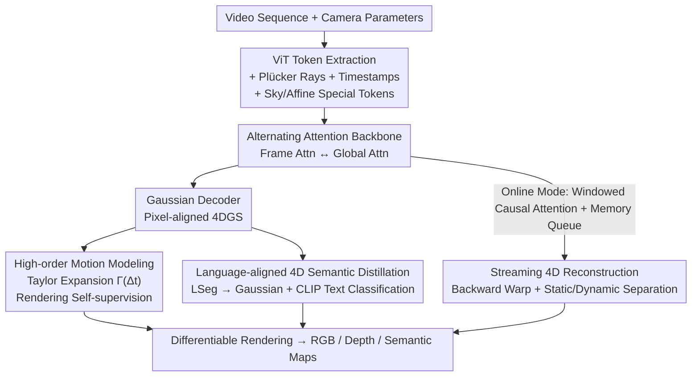

# SLARM: Streaming and Language-Aligned Reconstruction Model for Dynamic Scenes

**Conference**: CVPR 2026  
**Paper**: [CVF Open Access](https://openaccess.thecvf.com/content/CVPR2026/html/Qiu_SLARM_Streaming_and_Language_Aligned_Reconstruction_Model_for_Dynamic_Scenes_CVPR_2026_paper.html)  
**Code**: None  
**Area**: 3D Vision  
**Keywords**: Dynamic Scene Reconstruction, 4D Gaussian, Feed-forward Reconstruction, Language-Aligned Semantics, Streaming Inference

## TL;DR
SLARM is a feed-forward Transformer that simultaneously outputs 4D Gaussian geometry, 3D scene flow, and language-aligned semantics for dynamic scenes in a single forward pass. It utilizes high-order motion functions for unsupervised learning of complex non-uniform motions, distills LSeg for text-queryable semantics, and employs windowed causal attention for constant-latency streaming inference. It improves motion accuracy by 21%, PSNR by 1.6 dB, and segmentation mIoU by 20% on the Waymo dataset.

## Background & Motivation

**Background**: From NeRF to 3DGS, static scene reconstruction has matured significantly. Recently, feed-forward models like DUSt3R, VGGT, and MapAnything have shifted the paradigm from "per-scene optimization" to "data-driven single-forward-pass inference," evolving into general 3D foundation models. However, these models focus almost exclusively on static scenes, leaving **feed-forward dynamic scene reconstruction largely unexplored**.

**Limitations of Prior Work**: STORM, the most closely related work, can reconstruct dynamic 3D from multi-view posed images, but it suffers from three major drawbacks: (1) **Overly simplified motion modeling**: It assumes uniform velocity, failing to fit non-linear and non-rigid complex dynamics such as human walking; (2) **Single functionality**: It only reconstructs geometry without high-level semantic understanding, limiting downstream perception and reasoning; (3) **Inefficient inference**: It requires batch processing of multiple frames with cross-frame interpolation, precluding incremental streaming inference.

**Key Challenge**: In dynamic reconstruction, motion expressiveness, semantic understanding, and real-time streaming are typically treated separately and often conflict—complex motion is hard to model feed-forward, adding semantics increases overhead, and streaming requires sacrificing information from future frames.

**Goal**: Develop a unified feed-forward framework that simultaneously achieves dynamic reconstruction, semantic understanding, and streaming inference, while allowing these tasks to mutually benefit each other.

**Key Insight**: The authors observe that motion can be represented as a "differentiable function of time," modeling displacement as a superposition of high-order derivatives via Taylor expansion. They also find that semantic consistency can serve as a regulator for motion—the semantics of an object should remain stable over time, allowing geometry and semantics to calibrate each other.

**Core Idea**: Use **high-order motion functions + rendering self-supervision** to replace the "uniform velocity assumption + flow supervision." Distill language-aligned semantics from the 2D foundation model LSeg into time-deforming 4D Gaussians, and implement the entire system as constant-latency streaming inference using windowed causal attention.

## Method

### Overall Architecture
The input to SLARM is a video sequence $\{I_t\}_{t=1}^{T}$ with known camera intrinsics and extrinsics. The output is a set of explicit 4D Gaussians (4DGS) for each timestamp—reconstructing current geometry and appearance, encoding 3D scene flow for each Gaussian, and attaching language-aligned semantic features for text queries. The process begins with a **weight-sharing ViT** that extracts tokens from image patches. Two types of priors are injected: geometric priors (6D Plücker coordinates of pixel rays) and temporal priors (learnable embeddings for absolute timestamps). Following STORM, special Sky tokens model the background, and Affine tokens compensate for exposure/white balance differences across cameras. The enhanced tokens pass through an **alternating attention Transformer backbone**, where Frame Attention and Global Attention layers are stacked to capture spatio-temporal structures. Finally, multiple parallel decoders output parameters: the Gaussian Decoder regresses pixel-aligned 4DGS (position $\mu$, rotation $q$, scale $s$, opacity $\alpha$, color $c$), while auxiliary heads output scene flow and semantic features.

### Key Designs

**1. High-order Motion Modeling: Replacing the "Uniform Velocity Assumption" with Differentiable High-order Motion Functions**

STORM uses instantaneous velocity for motion representation, but the uniform velocity assumption fails for non-uniform motions like human limbs during walking. SLARM models displacement as a differentiable function of time using a high-order Taylor expansion. For each order $l\in\{0,\dots,L-1\}$, the network predicts a scalar speed $s_l$ and a 3D direction vector $v_l$. After normalization, motion coefficients are obtained as $m_l = s_l\cdot \frac{v_l}{\|v_l\|_2}$. Given a time offset $\Delta t$, the total displacement aggregates contributions from all orders according to the Taylor series:

$$\Gamma(\Delta t) = \sum_{l=0}^{L-1} m_l\cdot \frac{(\Delta t)^{l+1}}{(l+1)!}.$$

The paper uses $L=3$ (3rd-order expansion) to explicitly model the first three derivatives of position: velocity, acceleration, and jerk, capturing complex real-world dynamics with a compact representation. Crucially, this motion is learned via **pure rendering self-supervision** without ground-truth scene flow. Given frame $t$ and supervision frame $t+\Delta t$, Gaussian positions evolve by $\Gamma(\Delta t)$ while other attributes are frozen. The warped scene is rendered as $\hat{I}_{t+\Delta t}$ and supervision is applied using pixel MSE and perceptual LPIPS ($\lambda_{lpips}=0.05$).

**2. Language-aligned 4D Semantic Distillation: Distilling LSeg Semantics into Deforming Gaussians**

SLARM attaches a high-dimensional semantic feature $f^{sem}_j\in\mathbb{R}^d$ to each Gaussian. Unlike the static approach in Uni3R, these Gaussians deform according to the high-order motion function $\Gamma$. During rendering, alpha-blending is performed on **time-warped** Gaussians to synthesize both RGB images and semantic feature maps $\hat{F}_{t+\Delta t}$. Supervision comes from the frozen 2D foundation model LSeg: MSE loss aligns the rendered semantic map with LSeg's 2D features $\tilde{F}_{t+\Delta t}$, i.e., $L_{sem}=\|\tilde{F}_{t+\Delta t}-\hat{F}'_{t+\Delta t}\|_2^2$. For **annotated data**, an additional layer of supervision is added: the dot product of decoded features $f_{ij}$ and CLIP text features $t_k$ for various categories is passed through a softmax to produce category probabilities, trained via cross-entropy $L_{cls}$ ($\tau=0.07$). This enables natural language queries of dynamic scenes and direct integration with LLMs. Moreover, semantic consistency acts as a regularizer for motion—geometry and semantics mutually enhance each other.

**3. Streaming 4D Reconstruction: Windowed Causal Attention + Backward Warp for Constant Latency**

Offline dynamic reconstruction uses both past and future frames for interpolation, but real-time deployment only accesses current and past observations. SLARM strictly adheres to causality: the streaming model $\phi$ outputs current Gaussians $G_t$ and displacement fields $\Gamma_t$ based on current and historical frames: $(G_t,\Gamma_t)=\phi(I_t\mid I_{t-\Delta t},I_{t-2\Delta t},\dots)$. Without future frames, dynamic Gaussians are **backward** propagated to the most recent historical frame $t-\Delta t$. To avoid holes in new timestamps, the model splits Gaussians into static and dynamic categories based on motion magnitude: those with $\|\Gamma_g(\Delta t)\|\le\tau_m$ are static, others are dynamic. The scene in $[t-\Delta t, t]$ is composed of "static geometry at both ends + backward-warped dynamic parts." Architecturally, frames are processed independently with **windowed attention** and a memory queue, ensuring inference time grows linearly while memory remains constant.

### Loss & Training
The total loss is $L_{total}=L_{rgb}+L_{depth}+\lambda_{sky}L_{sky}+\lambda_{reg}L_{reg}+\lambda_{feat}L_{feat}$. $L_{depth}$ is an L1 loss on valid pixels with ground-truth depth. $L_{sky}$ penalizes the opacity of sky regions (masks obtained via DepthAnythingV2). $L_{reg}=\sum_{l=0}^{3}\|m_l\|_2^2$ suppresses high-order coefficients as a "mostly static" prior. For feature alignment, $L_{sem}$ is used for 200k steps, followed by $L_{cls}$ for 3k steps. Weights: $\lambda_{sky}=0.1$, $\lambda_{reg}=0.005$, $\lambda_{feat}=1.0$. Training used 64 Huawei Ascend 910B NPUs for 4 days with AdamW and 200k iterations.

## Key Experimental Results

Experiments were conducted on the Waymo Open Dataset (WOD), featuring 1000 sequences of ~20s at 10fps. Input resolution: 160×240.

### Main Results

Dynamic Reconstruction (Table 1, comparison with generalizable feed-forward methods; SLARM-F is offline, SLARM-W is online):

| Method | Dynamic PSNR↑ | Dynamic SSIM↑ | Dynamic D-RMSE↓ | Full PSNR↑ | Full SSIM↑ | Full D-RMSE↓ |
|------|------|------|------|------|------|------|
| GS-LRM* | 20.02 | 0.520 | 9.95 | 25.18 | 0.753 | 7.94 |
| STORM* | 22.03 | 0.623 | 7.50 | 25.86 | 0.804 | 5.47 |
| SLARM-W | 23.20 | 0.676 | 6.38 | 27.30 | 0.825 | 4.75 |
| **SLARM-F** | **23.51** | **0.691** | **6.16** | **27.49** | **0.828** | **4.57** |

Scene Flow Estimation (Table 3):

| Method | EPE(m)↓ | Acc5(%)↑ | Acc10(%)↑ | θ(rad)↓ |
|------|------|------|------|------|
| STORM | 0.304 | 79.01 | 83.74 | 0.667 |
| SLARM-F | **0.240** | 78.15 | 83.08 | **0.540** |
| SLARM-W | 0.337 | **81.07** | **84.26** | 0.725 |

Semantic Segmentation (Table 2):

| Method | mIoU↑ | Acc↑ |
|------|------|------|
| LSeg | 0.4876 | 0.7976 |
| Mask2Former-Swin | 0.5505 | 0.8192 |
| **SLARM** | **0.6663** | **0.8923** |

### Ablation Study

| Configuration | Effect (Flow EPE / Semantics) | Note |
|------|------|------|
| Base (No Semantics) | Higher EPE | Purely geometric; motion lacks semantic constraints |
| w/ $L_{sem}$ | EPE decreases | Semantic distillation acts as motion regularization |
| w/ $L_{sem}+L_{cls}$ | EPE further decreases | Stronger supervision from classification |
| Order $L=3$ | Optimal | Jerk-level is sufficient for short windows |
| Online (SLARM-W) | Linear time + constant memory | Friendly for long-range streaming deployment |

### Key Findings
- **Semantics Enhance Motion**: Using semantic consistency as temporal regularization continuously reduces Flow EPE and improves PSNR and semantic metrics—geometry and semantics are mutually beneficial.
- **3rd-Order is Optimal**: Real-world motion is well-fitted with 3rd-order derivatives (jerk) in short time windows; higher orders show diminishing returns.
- **Windowed Attention for Real-time**: SLARM-W shows a minor performance drop compared to SLARM-F but achieves linear scaling in time and memory.

## Highlights & Insights
- **Motion as a Differentiable Function of Time**: Taylor expansion provides physically interpretable decomposition (velocity/acceleration/jerk) and is naturally differentiable for rendering supervision.
- **Semantics as Free Regularization**: The prior that semantic identity should not fluctuate acts as a supervision signal for motion, turning semantic distillation from a burden into a gain.
- **Unified Feed-forward Triplets**: Geometry, flow, and semantics are jointly optimized in a single pass, enhancing each other and eliminating multi-model pipelines.

## Limitations & Future Work
- Evaluation is primarily on Waymo; generalization to indoor or general dynamic scenes requires further validation.
- The streaming mode relies on the motion threshold $\tau_{m}$ and step $\Delta t$; handling rapid appearance changes of new objects remains a challenge.
- Reliability for rare or out-of-distribution safety-critical objects is limited by the underlying 2D foundation models (LSeg/CLIP).
- High training cost (64x 910B NPUs, 4 days).

## Related Work & Insights
- **vs STORM**: STORM assumes uniform velocity, lacks semantics, and requires batch processing; SLARM handles non-uniform motion, adds language-aligned semantics, and supports causal streaming.
- **vs Uni3R**: Uni3R unifies static reconstruction and semantics; SLARM extends this to time-deforming 4D Gaussians for dynamic semantic queries.
- **vs StreamVGGT / Stream3R**: These methods reconstruct frame-by-frame 3D geometry; SLARM models instantaneous geometry and continuous temporal deformation (4D).

## Rating
- Novelty: ⭐⭐⭐⭐⭐ First 4D Gaussian framework to unify dynamic reconstruction, language-aligned semantics, and streaming.
- Experimental Thoroughness: ⭐⭐⭐⭐ Comprehensive multi-task comparison on Waymo, though limited to one major dataset.
- Writing Quality: ⭐⭐⭐⭐ Clear structure and intuitive diagrams.
- Value: ⭐⭐⭐⭐⭐ Directly applicable to real-time dynamic perception in autonomous driving and robotics.

<!-- RELATED:START -->

## Related Papers

- [\[CVPR 2026\] Point4Cast: Streaming Dynamic Scene Reconstruction and Forecasting](point4cast_streaming_dynamic_scene_reconstruction_and_forecasting.md)
- [\[CVPR 2026\] Stabilizing Streaming Video Geometry via Dynamic Feature Normalization](stabilizing_streaming_video_geometry_via_dynamic_feature_normalization.md)
- [\[CVPR 2026\] LangField4D: Learning Identity-Adaptive and Spatio-Temporal Continuous 4D Language Fields for Dynamic Scenes](langfield4d_learning_identity-adaptive_and_spatio-temporal_continuous_4d_languag.md)
- [\[CVPR 2026\] TokenSplat: Token-aligned 3D Gaussian Splatting for Feed-forward Pose-free Reconstruction](tokensplat_token-aligned_3d_gaussian_splatting_for_feed-forward_pose-free_recons.md)
- [\[CVPR 2026\] FastEventDGS: Deformable Gaussian Splatting for Fast Dynamic Scenes from a Single Event Camera](fasteventdgs_deformable_gaussian_splatting_for_fast_dynamic_scenes_from_a_single.md)

<!-- RELATED:END -->
