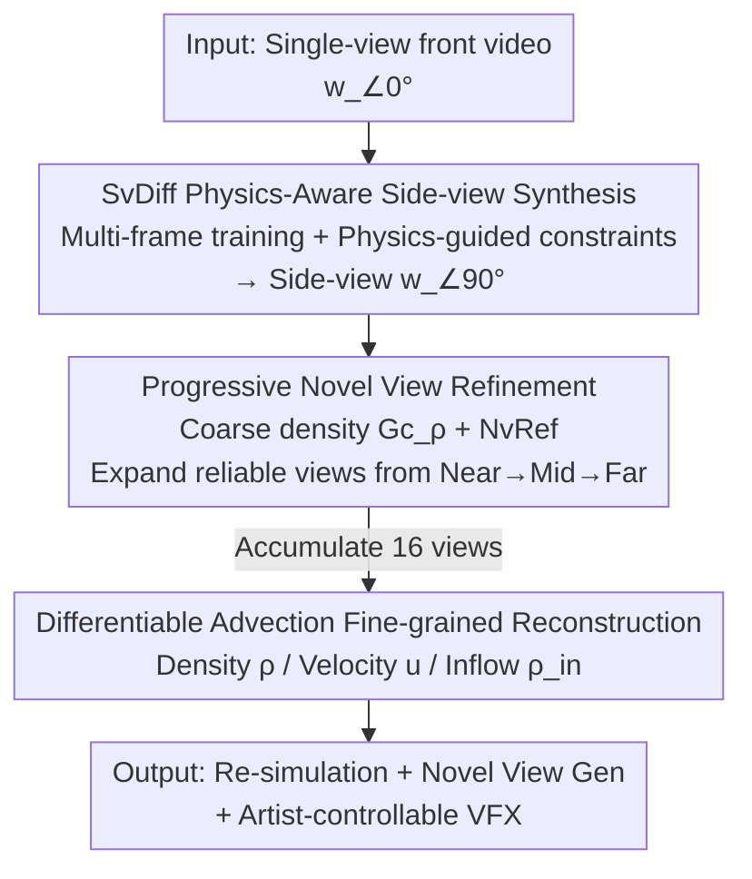

# SmokeSVD: Smoke Reconstruction from A Single View via Progressive Novel View Synthesis and Refinement with Diffusion Models

**Conference**: CVPR 2026  
**Paper**: [CVF Open Access](https://openaccess.thecvf.com/content/CVPR2026/html/Li_SmokeSVD_Smoke_Reconstruction_from_A_Single_View_via_Progressive_Novel_CVPR_2026_paper.html)  
**Code**: TBD  
**Area**: 3D Vision  
**Keywords**: Smoke reconstruction, Single-view, Diffusion models, Novel view synthesis, Fluid physical constraints

## TL;DR
This work utilizes diffusion models to synthesize side views frame-by-frame from a **single-view** video, followed by a cyclic reconstruction process of "coarse density → progressive refinement → fine density". This framework achieves high-quality single-view smoke reconstruction while being two orders of magnitude faster than differentiable rendering (15 minutes vs. >30 hours).

## Background & Motivation

**Background**: Reconstructing dynamic smoke (density field + velocity field) from RGB video is required in computer graphics, atmospheric physics, and medical imaging. Mainstream approaches either depend on multi-camera arrays combined with differentiable rendering or Neural Radiance Fields (PINF, HyFluid, PICT), or apply strict differentiable physical priors for single-view inputs (GlobTrans, Franz et al.).

**Limitations of Prior Work**: Multi-view acquisition is impractical in non-laboratory environments. Conversely, single-view reconstruction is a severely ill-posed problem, as a single viewpoint cannot capture the smoke distribution along the depth axis. While differentiable rendering methods like GlobTrans produce high-quality results, they require **over 30 hours** for optimization, making them impractical. NeRF-based methods for sparse-view reconstruction tend to produce blurred results along the depth dimension.

**Key Challenge**: The deadlock between the **information loss** of single-view input and the requirements for **reconstruction quality/efficiency**. Recent work like FluidNexus attempts to use multi-view diffusion models to generate multi-view videos all at once before reconstruction; however, the generated images are often **inconsistent** (shape-appearance ambiguity) and **lack physical priors** to constrain the complex translucent dynamics of fluids.

**Goal**: To mitigate the ill-posedness of single-view input by synthesizing credible alternative views while ensuring multi-view consistency and physical plausibility, all while reducing computational costs to the minute level.

**Key Insight**: Instead of "generating all views at once before reconstruction," it is more effective to **interleave** 2D diffusion synthesis, spatio-temporal refinement, and 3D reconstruction. A coarse 3D density field is used to constrain 2D diffusion, and the refined 2D images are then used to improve 3D reconstruction, gradually expanding reliable viewpoints from near to far.

**Core Idea**: A physics-guided diffusion side-view synthesizer combined with progressive novel view refinement. This approach decomposes the single-view "completion" into a multi-stage closed loop where 2D generation quality and 3D volumetric consistency mutually enhance each other.

## Method

### Overall Architecture
The input is a single-view frontal video of $T$ frames, denoted as the front-view sequence $w^t_{\angle 0^\circ}$ ($\alpha=\angle 0^\circ$ represents the relative angle to the front). SmokeSVD first employs a diffusion model **SvDiff** to synthesize the $\angle 90^\circ$ side-view sequence frame-by-frame, effectively supplementing the single view with an orthogonal side view. Then, a density generator $G_\rho$ based on a modified UNet3+ estimates a coarse 3D density field. Subsequently, the camera is **gradually rotated** along the horizontal plane to render and refine additional novel views (45°, 135°, etc.). Finally, 16 views are jointly used to reconstruct fine-grained density, velocity, and inflow states, supporting re-simulation and artist-controllable downstream applications.

The entire process is a multi-stage pipeline where "2D Diffusion Synthesis ↔ 3D Reconstruction" alternates, and the set of reliable viewpoints expands from near to far:

### Key Designs

**1. SvDiff Physics-Aware Side-View Synthesizer: Supplementing Single-View with Orthogonal Views**

The primary missing information in single-view reconstruction is the side appearance. SvDiff extends the image diffusion model to process frames sequentially: it is trained with the **previous two side-view frames + current front-view frame** as conditions $c^t = w^t_{\angle 0^\circ} \oplus w^{t-1}_{\angle 90^\circ} \oplus w^{t-2}_{\angle 90^\circ}$ (where $\oplus$ denotes channel concatenation), optimizing the noise loss $\mathcal{L}_{noise} = \|\epsilon - \epsilon_\theta(w^t_{\angle 90^\circ}, c^t, s)\|^2$. Since only "previously synthesized frames" are available during inference, errors can accumulate over time. To address this, the authors introduce a **multi-frame training scheme**: multiple forward diffusion passes are performed within one batch, deriving a clean image $w_{c,\angle 90^\circ} = (w_{s,\angle 90^\circ} - \sqrt{1-\bar\alpha_s}\,\epsilon_\theta)/\sqrt{\bar\alpha_s}$ from noise at each step and using it as the condition for the next forward pass. This forces the model to handle the distribution of its own generated outputs, suppressing long-term drift.

Furthermore, physical guidance is introduced: when the diffusion step $s < T_Q$ (where noise is low enough to extract adjacent physical information), three constraints are applied: a **visual constraint** $\mathcal{L}_{img}=\|x_0^i - \hat{x}_0^i\|^2$ for pixel fidelity; a **velocity constraint** $\mathcal{L}_{vel} = \|\nabla\cdot \mathbf{u}^{i-1}\|^2 + \|\nabla \mathbf{u}^{i-1}\|^2$ utilizing a coarse density field to derive velocity, where the first term enforces incompressibility and the second prevents flickering; and a **spatial constraint** $\mathcal{L}_{sp} = \|H(w_{c,\angle 90^\circ}) - H(w_{\angle 0^\circ})\|^2$, where $H(\cdot)$ sums the $H\times W$ image horizontally into an $H\times 1$ vector to ensure spatial consistency between views. The total loss is $\mathcal{L}_{SvDiff} = \lambda_{noise}\mathcal{L}_{noise} + \lambda_{img}\mathcal{L}_{img} + \lambda_{sp}\mathcal{L}_{sp} + \lambda_{vel}\mathcal{L}_{vel}$.

**2. Progressive Novel View Refinement: Expanding Reliability from Near to Far**

With the front and side views, the density generator $G_\rho$ (which extends 2D convolutions to 3D via UNet3+) estimates a coarse 3D density $\rho^t_{r,c} = G_\rho(I^t)$, where $I^t$ is a concatenation of view images. To improve blurred results in novel views, a refinement module **NvRef** is introduced: for a target angle $\alpha$, it takes the adjacent rendered views $w^t_{r,\angle\alpha\pm\beta}$, the current rendering $w^t_{r,\angle\alpha}$, and downsampled previous refined results $\downarrow w^{t-1}_{f,\angle\alpha}, \downarrow w^{t-2}_{f,\angle\alpha}$ to predict a residual $res^t_\alpha$, yielding the refined image $w^t_{f,\angle\alpha} = res^t_\alpha + w^t_{r,\angle\alpha}$.

This process is **cyclic**: 16 viewpoints are categorized into clear, near, mid, and far relative to the input views. The pipeline "renders views → refines with NvRef → updates density" sequentially for each category, ensuring that each step of reconstruction is built on increasingly credible multi-view data.

**3. Fine-grained Joint Estimation via Differentiable Advection: Temporal Consistency via Navier-Stokes**

When 16 views are accumulated, $G_\rho$ is upgraded to a fine-grained density generator $G^f_\rho$. A differentiable advection operator $\mathcal{A}$ based on the Navier-Stokes equations is used to jointly estimate the velocity field $\mathbf{u}$ and inflow state $\rho_{in}$. The generator loss $\mathcal{L}_{G_\rho}$ includes density L2 terms and rendering constraints for viewpoint sets $\mathbb{A}$ inside and outside the input distribution: $\lambda_{in}\sum_{\alpha\in\mathbb{A}}\|\mathcal{R}(\rho^t_r,\alpha)-\mathcal{R}(\rho^t,\alpha)\|^2 + \lambda_{un}\sum_{\alpha\notin\mathbb{A}}\|\mathcal{R}(\rho^t_r,\alpha)-\mathcal{R}(\rho^t,\alpha)\|^2$, where $\mathcal{R}(\rho,\alpha)$ is the differentiable rendering operator. This ensures that the reconstructed sequence is physically coherent over time, allowing for re-simulation with different initial conditions.

### Loss & Training
SvDiff is trained with $\mathcal{L}_{SvDiff}$ (noise, visual, spatial, and velocity). NvRef is trained with $\mathcal{L}_{NvRef}$ (L2, L1, residual mean, spatial, and PSNR difference). For the real-world dataset ScalarFlow, which lacks 3D ground truth, the authors set $\lambda_\rho$ to zero and utilize results from prior work as density supervision to bypass the lack of 3D annotations.

## Key Experimental Results

### Main Results
Evaluation was conducted on the real-world dataset **ScalarFlow** and synthetic datasets generated via differentiable rendering. Since real 3D data lacks ground truth, comparisons are primarily based on image metrics: RMSE↓, SSIM↑, PSNR↑, LPIPS↓, and side-view STYLE↓.

Reconstruction Comparison on ScalarFlow (Single-view input):

| Method | Input RMSE↓ | Input SSIM↑ | Input PSNR↑ | Input LPIPS↓ | 120-step Time |
|-----------|-----------|-----------|-----------|------------|-----------|
| GlobTrans | 0.0101 | 0.9975 | 40.16 | 0.0054 | >30h |
| NGT | 0.0289 | 0.9539 | 31.07 | 0.0655 | 5min |
| PICT | 0.0315 | 0.9252 | 30.54 | 0.1332 | / |
| PINF | 0.0872 | 0.8715 | 21.30 | 0.1020 | / |
| **Ours** | **0.0127** | **0.9868** | **38.08** | **0.0223** | **15min** |

While GlobTrans achieves the best metrics on the input view, it requires over 30 hours of optimization. Ours achieves the second-best perceptual quality within 15 minutes. On synthetic datasets, Ours significantly outperforms others (PSNR 28.13 vs. the second-best 16.30).

### Ablation Study

SvDiff Side-view Synthesis Ablation (ScalarFlow):

| Config | Input PSNR↑ | Side RMSE↓ | Side STYLE↓ | Description |
|-----------|-----------|-----------|------------|------|
| w/o threshold | 41.84 | 0.0990 | 0.2139 | Remove noise threshold $T_Q$ |
| w/o vel | 41.68 | 0.1032 | 0.2074 | Remove velocity constraint |
| w/o grad | 42.08 | 0.1025 | 0.2025 | Remove gradient (smoothing) |
| w/o divergence | 40.90 | 0.1816 | 0.4831 | Remove divergence term (failed side quality) |
| w/o reconstruction | 41.48 | 0.1025 | 0.3118 | Remove 3D reconstruction guidance |
| **Full SvDiff** | **44.55** | **0.0899** | **0.1892** | — |

NvRef Novel View Refinement Ablation:

| Config | SSIM↑ | PSNR↑ | Description |
|-----------|-------|-------|------|
| w/o Refinement | 0.7454 | 18.75 | No refinement |
| w/o Progressive | 0.7559 | 18.79 | Single-pass instead of progressive |
| w/o Res Loss | 0.7126 | 18.51 | Remove residual loss |
| **Full NvRef** | 0.7559 | **18.80** | — |

### Key Findings
- **Divergence Constraint is Crucial**: Removing it caused side-view RMSE to jump from 0.0899 to 0.1816 and STYLE to double, indicating that incompressibility is the most important physical prior for structural plausibility.
- **Progressive vs. Single-pass Refinement**: The progressive strategy improves perceptual detail and consistency; starting from "near" views successfully pulls "far" views into focus.
- **Generalization**: The model remains effective on unseen scenarios (e.g., inflow-free smoke and horizontal plumes), suggesting the physical constraints prevent overfitting to specific flow patterns.

## Highlights & Insights
- **Cyclic "2D Diffusion ↔ 3D Reconstruction"**: This is the core innovation. By using coarse density to constrain synthesis and refined images to enhance density, the system avoids the "all-at-once" inconsistency issues common in multi-view generation.
- **Multi-frame Training to Suppress Drift**: Training the model on its own generated frames helps the distribution matching at inference time, solving the long-term cumulative error problem in auto-regressive diffusion.
- **Spatial Constraint $H(\cdot)$**: Summing pixels horizontally is a lightweight and effective way to align side and front views without requiring pixel-to-pixel correspondences in translucent media.

## Limitations & Future Work
- Synthesis quality for novel views still trails behind dedicated multi-view diffusion models (like FluidNexus), indicating some consistency loss at far viewpoints.
- The framework currently focuses on rotations along the horizontal plane; **vertical multi-view fusion** remains unsolved.
- Estimating inflow states can still be biased in complex flow patterns. The performance on fluids other than smoke (e.g., water, fire) has not been extensively reported.
- Reliance on prior reconstruction results as "pseudo 3D ground truth" limits supervision quality; the lack of direct 3D ground truth for real data restricts quantitative evaluation to 2D metrics.

## Related Work & Insights
- **vs. GlobTrans / Franz et al.**: These use strict differentiable rendering for physical correctness but take 30+ hours. Ours replaces pure optimization with generative priors to achieve similar quality in 15 minutes.
- **vs. FluidNexus**: They generate all views at once, which is prone to shape-appearance ambiguity. Ours expands reliable views progressively, leading to better input-view quality and robustness.
- **vs. PINF / HyFluid / PICT**: These use implicit reconstruction from multi-views, resulting in severe blurring in the depth direction under sparse-view conditions. Ours supplements orthogonal views and physical constraints to mitigate ill-posedness.

## Rating
- Novelty: ⭐⭐⭐⭐ The cyclic loop and physics-guided side synthesis are novel, though components like diffusion NVS and UNet3+ are existing technologies.
- Experimental Thoroughness: ⭐⭐⭐⭐ Comprehensive testing on real/synthetic datasets and ablations, though lacking 3D quantitative ground truth.
- Writing Quality: ⭐⭐⭐⭐ Clear workflow and complete formulas, though some module details are relegated to the supplement.
- Value: ⭐⭐⭐⭐ Significant practical value for graphics and VFX by reducing reconstruction time from hours to minutes while supporting re-simulation.

<!-- RELATED:START -->

## Related Papers

- [\[CVPR 2026\] PR-IQA: Partial-Reference Image Quality Assessment for Diffusion-Based Novel View Synthesis](pr-iqa_partial-reference_image_quality_assessment_for_diffusion-based_novel_view.md)
- [\[CVPR 2026\] From None to All: Self-Supervised 3D Reconstruction via Novel View Synthesis](from_none_to_all_self-supervised_3d_reconstruction_via_novel_view_synthesis.md)
- [\[CVPR 2026\] OrienPose: Orientation-Guided Novel View Synthesis for Single-Image Unseen Object Pose Estimation](orienpose_orientation-guided_novel_view_synthesis_for_single-image_unseen_object.md)
- [\[CVPR 2026\] Splatent: Splatting Diffusion Latents for Novel View Synthesis](splatent_splatting_diffusion_latents_for_novel_view_synthesis.md)
- [\[CVPR 2026\] GeodesicNVS: Probability Density Geodesic Flow Matching for Novel View Synthesis](geodesicnvs_probability_density_geodesic_flow_matching_for_novel_view_synthesis.md)

<!-- RELATED:END -->
