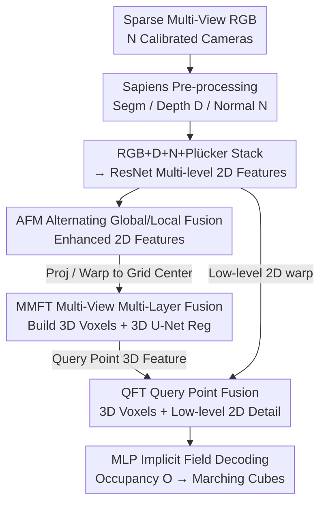

# SMVRT: Implicit Human 3D Modeling Using Sparse Multi-View Volumetric Reconstruction with Transformer Fusion

**Conference**: CVPR 2026  
**Paper**: [CVF Open Access](https://openaccess.thecvf.com/content/CVPR2026/html/Fan_SMVRT_Implicit_Human_3D_Modeling_Using_Sparse_Multi_View_Volumetric_Reconstruction_CVPR_2026_paper.html)  
**Code**: TBD  
**Area**: 3D Vision / Sparse Multi-View Human Reconstruction  
**Keywords**: Sparse Multi-View, Implicit Occupancy Field, 3D Human Reconstruction, Transformer Feature Fusion, Voxel Grid

## TL;DR
SMVRT utilizes an end-to-end, template-free implicit occupancy field network to reconstruct clothed humans from sparse multi-view inputs (2–8 images). The core innovation lies in placing Transformer fusion modules across three stages: 2D encoding, 2D-to-3D voxel construction, and query point decoding. This allows the network to "select the most reliable views and features," effectively halving the Chamfer distance of prior SOTA methods on datasets like THUman2.0/2.1, MultiGarment, and MultiHuman.

## Background & Motivation

**Background**: 3D human reconstruction is a fundamental capability for AR/VR, gaming, and virtual production. One category of approaches relies on fitting parametric templates (SMPL/SMPL-X), which excel at undressed bodies but struggle with clothed humans. Another category is implicit reconstruction (like the PIFu family), which directly learns an occupancy field from single or sparse views.

**Limitations of Prior Work**: Single-view reconstruction inherently suffers from depth ambiguity, forcing the network to "guess" occluded regions. This requires either generative models to synthesize missing views or templates for filling, both of which often fail at unpredictable details like fingers or garment folds. High-quality reconstruction traditionally depends on dense camera arrays, which are expensive and cumbersome. Sparse multi-view approaches serve as a compromise, yet standard multi-view stereo (MVS) fails to compute reliable depth when views are too sparse.

**Key Challenge**: In sparse view scenarios, the mechanism of **multi-view feature fusion** is the critical determinant of success. Basic concatenation does not adapt to an arbitrary number of views. Simple summation, average pooling, or variance-based fusion (used in PIFu and MVSNet) are view-count invariant but assign equal weights to "visible views" and "occluded views," failing to distinguish which views are truly informative for a specific point. Methods like 3DFG-PIFu still construct voxels in front of a reference camera and use straightforward concatenation strategies.

**Goal**: To learn an end-to-end occupancy field from sparse views without relying on templates or MVS depth, delegating the decision of "which view to trust and which feature layer to use" to the network itself.

**Key Insight**: The authors noted that Transformer attention is naturally suited for "weighted selection." Since average pooling cannot differentiate view contributions, attention can be used at different stages for geometry-aware view selection and multi-layer feature aggregation. Inspired by multi-view point maps (MASt3R, VGGT) and implicit reconstruction (PIFu family), the fusion is decomposed and optimized across three distinct network stages.

**Core Idea**: Instead of choosing one specific stage for fusion, **fusion modules are integrated into all three stages**: 2D feature encoding (AFM for alternating global/local fusion), 2D-to-3D voxel construction (MMFT to select relevant views), and query point occupancy decoding (QFT to fuse coarse but robust 3D voxel features with detail-preserving low-level 2D features). These stages collectively support a shared voxel grid centered on the human body.

## Method

### Overall Architecture

The input consists of $N$ calibrated RGB images captured around the human (2/4/8 views in the paper); the output is an implicit occupancy field, from which a triangular mesh is extracted via Marching Cubes. The pipeline can be understood as: "strengthening 2D features per image, mapping multi-view 2D features onto a shared 3D voxel grid, and finally combining 3D and 2D features for each query point to decode occupancy values."

Specifically, each RGB image is processed by a pre-trained Sapiens model to obtain segmentation, depth maps $D$, and normal maps $N$. Camera calibration provides Plücker ray maps $P$ as pose conditions. The stacked RGB, $D$, $N$, and $P$ maps are fed into a modified ResNet to extract four levels of 2D features. The top-level features are tokenized and sent to the **AFM** (Alternating Fusion Module) for global/local fusion. A $64^3$ 3D grid $G$ spanning $[-1.0\text{m}, 1.0\text{m}]$ is then defined around the human. Multi-view 2D features are bilinearly sampled and projected to each grid center, where the **MMFT** (Multi-view Multi-layer Fusion Transformer) performs multi-view multi-layer fusion to form 3D voxel features, followed by a 3D U-Net for contextual regularization. Finally, for any query point, 3D features are tri-linearly interpolated from the voxels, and low-level 2D features are warped from the 2D maps. These are fused by the **QFT** (Query-point Fusion Transformer) and decoded by an MLP to output an occupancy value $O \in [0,1]$.

### Key Designs

**1. AFM: Strengthening cross-view features in the 2D encoding stage via alternating global/local attention.**

The limitation of encoding each image independently is the risk of "premature single-view judgments" lacking cross-view consistency. AFM tokenizes the highest-level features of all views into patches $T_{i,j} \in \mathbb{R}^d$ and passes them through several alternating global/intra-frame fusion blocks. Specifically, tokens from all views are packed for global attention $T^{l} = \text{Attn}^{global}_{AFM}(T^{l-1})$ to allow cross-view information flow, then unpacked for intra-frame attention $T^{l+1} = \text{Attn}^{frame}_{AFM}(T^{l})$ to consolidate single-view structures. This "global for consistency, local for structure" design draws from MASt3R/VGGT multi-view point maps, utilizing register tokens for stability. The fusion blocks can use standard Transformers or Mamba—the latter offers similar accuracy but is ~1.5× faster for training and inference.

**2. MMFT: Selecting views in the 2D-to-3D voxel construction stage via geometry-aware attention instead of average pooling.**

This is the core design addressing the issue where average/variance fusion treats all views equally. For a 3D grid center $C(x,y,z)$, it is projected onto each view as $p_{i,u,v} = \pi_i(T_i \circ C(x,y,z))$. Each view's multi-layer features $F^{2D}_{i,j}$ ($j=0,1,2$ for multi-scale; $j=3$ for AFM global features) are bilinearly sampled and stacked into $F^{2D}_i$. Attention fusion is performed:

$$G(F^{2D}_i) = \text{Attn}_{MMFT}[F^{2D}_1, z_1, \dots, F^{2D}_N, z_N]$$

The depth $z_i$ of the grid center in each view is also fed in, making the fusion "geometry-aware." Based on scaled dot-product attention ($Q=M_Q X,\ K=M_K X,\ V=M_V X$), the network learns which cameras are most reliable (e.g., visible vs. occluded) for the current grid center. The fused $\{G_i\}$ are then average pooled to obtain the final voxel feature $F_{fused} = \text{Average}(G_1, \dots, G_N)$, followed by a 3D U-Net for voxel-level context. Unlike 3DFG-PIFu’s reference-camera-centric voxels, SMVRT builds a **shared** human-centric voxel grid, enabling more direct and robust fusion.

**3. QFT: Fusing robust 3D voxel features with detail-preserving low-level 2D features during query point decoding.**

Relying solely on 3D voxel features would be too "blurry"—a low-resolution $64^3$ voxel grid provides global shape but loses high-frequency details like fingers or folds. QFT addresses this for each query point $q$ by tri-linearly interpolating 3D features $F_{tri}(x,y,z)$ (denoted $F_v$) while simultaneously warping high-resolution low-level 2D features $F^{2D}_{i,0}$ to the same point. Each 2D feature is concatenated with $F_v$ and processed via attention:

$$F(q) = \text{Attn}_{QFT}\big((F_v, F^{2D}_{1,0}, z_0), \dots, (F_v, F^{2D}_{N,0}, z_N)\big)$$

The result is average-pooled and concatenated with coordinates $(x_q, y_q, z_q)$ before entering the MLP implicit decoder $f(\cdot)$ to produce $O = f(\text{Average}(F(q)), x_q, y_q, z_q)$. Ablations show that without this "detail preserver" (low-level 2D features), normal consistency (NC) drops significantly and surfaces become overly smooth, confirming the division of labor between 3D (global) and 2D (detail).

### Loss & Training
The training data consists of multi-view 2D images rendered from textured human meshes $S$ using Blender. Supervision is provided by the ground truth occupancy of query points. Query points are sampled by taking $K$ points $p_k$ on the surface and adding Gaussian noise $q_k = p_k + n_k,\ n_k \sim \mathcal{N}(0,\Sigma)$. The optimization objective is per-point binary cross-entropy:

$$Loss = -\frac{1}{BN}\sum_{i=1}^{B}\sum_{k=1}^{N} BCE(O_{pred\_i,k}, O_{gt\_i,k})$$

Training uses Adam ($\beta_1=0.9, \beta_2=0.999$) with an initial learning rate of $1\times10^{-4}$, decayed by 0.1 at epochs 50 and 100 on a single A100. The first layer of ResNet is fine-tuned for multimodal input; other weights are initialized from pre-training or randomly.

## Key Experimental Results

### Main Results

On THUman2.1 (4 views), SMVRT leads significantly in IoU and NC over non-template baselines, with slightly better Chamfer distance:

| Dataset | Method | CD l1↓(mean) | IoU↑(mean) | NC↑(mean) | F1.0↑(mean) |
|--------|------|------|------|------|------|
| THUman2.1 | MV-PIFu | 10.24 | 0.844 | 0.844 | 0.653 |
| THUman2.1 | Zins et al. | 3.65 | 0.908 | 0.900 | 0.964 |
| THUman2.1 | **SMVRT (Ours)** | **3.58** | **0.958** | **0.940** | **0.973** |

On THUman2.0/MultiHuman (Chamfer l2 / P2S l2 $\times10^{-5}$), SMVRT shows ~2× improvement over SOTA:

| Dataset | Method | CD l2↓ | P2S↓ |
|--------|------|------|------|
| THUman2.0 | 3DFG-PIFu | 5.13 | 5.03 |
| THUman2.0 | **SMVRT** | **2.39** | **2.14** |
| MultiHuman | 3DFG-PIFu | 5.32 | 4.87 |
| MultiHuman | **SMVRT** | **3.66** | **3.36** |

### Ablation Study

Evaluating the contribution of the three fusion modules (where "No fusion" replaces modules with average pooling) on THUman:

| Configuration | CD l1↓ | IoU↑ | NC↑ | F1.0↑ | Description |
|------|------|------|------|------|------|
| No fusion | 4.40 | 0.937 | 0.927 | 0.945 | All Avg Pooling |
| AFM only | 4.37 | 0.939 | 0.934 | 0.945 | 2D fusion only (Limited gain) |
| QFT only | 4.02 | 0.948 | 0.930 | 0.955 | Only query point fusion |
| MMFT only | 3.84 | 0.951 | 0.937 | 0.966 | Largest single contribution |
| MMFT+QFT | 3.61 | 0.957 | 0.940 | 0.972 | Synergistic effect |
| **Full Model** | **3.58** | **0.958** | **0.940** | **0.973** | Complete model |

Additional Ablations:

| Dimension | Config | Key Metric | Conclusion |
|------|------|---------|------|
| Input Modality | RGB→+N→+D→+P | CD l1 3.90→3.71→3.65→3.58 | Monotonic gain; Normal map helps most |
| Camera Count | 2/4/8 cam | CD l1 8.74/3.58/2.96 | More is better; 2 views is challenging |
| AFM Block | Trans vs Mamba | Near identical | Mamba ~1.5× faster |
| QFT 2D Detail | w/ vs w/o detail | NC 0.940 vs 0.937 | Without it, surfaces are too smooth |
| Zero-shot | MultiGarment (4 cam) | IoU 0.962/0.963 | Good cross-dataset generalization |

### Key Findings
- **MMFT is the most impactful single module**: Adding it alone drops CD l1 from 4.40 to 3.84 and raises F1.0 from 0.945 to 0.966. This suggests that view selection in the 2D-to-3D stage is more critical than in the earlier 2D encoding or later query stages.
- **AFM has limited individual gain but provides incremental benefits**: Moving from MMFT+QFT (3.61) to the full model (3.58) shows it acts as a global regularizer rather than the main driver.
- **Normal maps contribute most to input modality**: Adding normals (N) to RGB drops CD l1 from 3.90 to 3.71, as it explicitly guides the network to capture local details.
- **Low-level 2D details determine NC/surface quality**: Removing the detail preserver in QFT leads to visibly blurrier surfaces, confirming the "3D for global, 2D for detail" paradigm.
- **Mamba is a viable alternative**: It matches Transformer accuracy while reducing computational load.

## Highlights & Insights
- **"Three-stage Fusion" Strategy**: Rather than picking a single point for fusion, decomposing it into 2D encoding, voxel construction, and query decoding allows each stage to solve a specific problem (global consistency / view selection / detail preservation).
- **Geometry-Aware View Selection**: Feeding depth $z_i$ into the MMFT attention mechanism allows the network to use geometric cues to decide which camera to trust, which is more physically grounded than pure feature-based attention.
- **Shared Voxel Grid**: Building a human-centric shared voxel grid instead of a reference-camera-relative one avoids view bias and generalizes better to arbitrary camera counts.
- **High Utility for Sparse Reconstruction**: The paradigm of "blur-resistant 3D + detail-preserving 2D warp + attention fusion" is effectively transferable to implicit reconstruction (Occupancy/SDF) for general objects beyond humans.

## Limitations & Future Work
- **Dependency on Calibration and Sapiens**: The model requires calibrated cameras and pre-processed maps. Errors in Sapiens (especially on in-the-wild images or rare poses) will propagate directly to the reconstruction quality.
- **Voxel Resolution Constraints**: The training voxels are only $64^3$. While high-resolution grids can be used at inference, the geometric upper bound of the learned global shape may be limited for extremely fine structures like hair or thin attire.
- **Geometry Only**: The current output is an occupancy field resulting in a mesh; it lacks texture or appearance recovery for full "renderable avatars."
- **Lower Bound at 2 Views**: Performance drops significantly with only 2 cameras (CD l1 8.74), suggesting the method still needs a reasonable degree of multi-view coverage to excel.

## Related Work & Insights
- **vs. PIFu family**: PIFu uses pixel-aligned features with average pooling. SMVRT achieves significantly higher IoU/NC (0.958 vs. 0.844 on THUman2.1) by replacing equal-weighted pooling with geometry-aware attention.
- **vs. Zins et al.**: While Zins et al. use local attention at the query point, SMVRT’s two-stage approach (view selection at voxel level + detail restoration at query point) leads to much smoother surfaces and superior metrics (CD l2 2.39 vs. 12.67 on THUman2.0).
- **vs. 3DFG-PIFu**: 3DFG uses reference-camera-relative voxels and concatenation. SMVRT’s symmetric human-centric grid and attention-based fusion halve the CD l2 error.

## Rating
- Novelty: ⭐⭐⭐⭐ The three-stage attention fusion and geometry-aware selection is an effective and clear design for sparse reconstruction.
- Experimental Thoroughness: ⭐⭐⭐⭐ Diverse datasets and comprehensive ablations (modalities, camera counts, Mamba, etc.) provide clear evidence; however, direct comparison with diffusion-based view synthesis methods is missing.
- Writing Quality: ⭐⭐⭐⭐ The logic from motivation to module breakdown is smooth; the strategy comparisons are particularly well-articulated.
- Value: ⭐⭐⭐⭐ Doubling SOTA performance without relying on dense arrays or templates is highly valuable for low-cost digital human capture.

<!-- RELATED:START -->

## Related Papers

- [\[CVPR 2026\] Intrinsic Image Fusion for Multi-View 3D Material Reconstruction](intrinsic_image_fusion_for_multi-view_3d_material_reconstruction.md)
- [\[CVPR 2026\] Multi-view Pyramid Transformer: Look Coarser to See Broader](multi-view_pyramid_transformer_look_coarser_to_see_broader.md)
- [\[CVPR 2026\] RnG: A Unified Transformer for Complete 3D Modeling from Partial Observations](rng_a_unified_transformer_for_complete_3d_modeling_from_partial_observations.md)
- [\[CVPR 2026\] Coherent Human-Scene Reconstruction from Multi-Person Multi-View Video in a Single Pass](coherent_humanscene_reconstruction_from_multiperso.md)
- [\[CVPR 2026\] ART: Articulated Reconstruction Transformer](art_articulated_reconstruction_transformer.md)

<!-- RELATED:END -->
