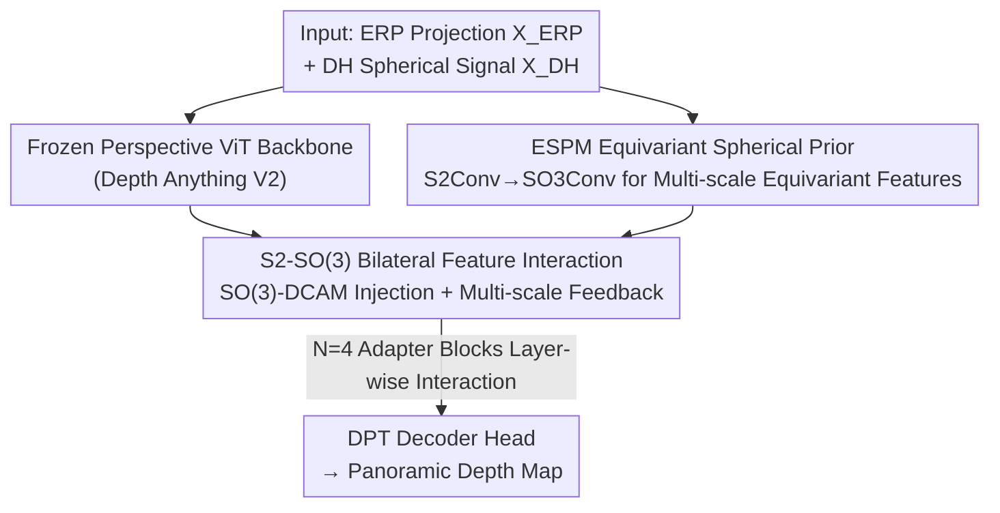

# SO(3)-Equivariant ViT-Adapter for Data-Efficient Zero-Shot Sim-to-Real Indoor Panoramic Depth Estimation

**Conference**: CVPR 2026  
**Paper**: [CVF Open Access](https://openaccess.thecvf.com/content/CVPR2026/html/He_SO3-Equivariant_ViT-Adapter_for_Data-Efficient_Zero-Shot_Sim-to-Real_Indoor_Panoramic_Depth_Estimation_CVPR_2026_paper.html)  
**Code**: To be confirmed  
**Area**: 3D Vision  
**Keywords**: Panoramic depth estimation, SO(3)-equivariant, ViT-Adapter, Zero-shot, Sim-to-Real

## TL;DR
Add an **SO(3)-equivariant adapter** to a frozen perspective pre-trained ViT (Depth Anything V2). By training on only 6.5K synthetic panoramas with zero real data, the framework transfers the zero-shot generalization capabilities of perspective models to 360° panoramas, outperforming real-data-dependent PanDA in zero-shot sim-to-real on Matterport3D / Stanford2D3D.

## Background & Motivation

**Background**: Zero-shot monocular depth estimation for perspective views (narrow FoV) is mature. Large-scale pre-training with ViT backbones (e.g., Marigold, Depth Anything) enables cross-dataset generalization. Panoramic images provide full 360° environmental understanding and reduced blind spots, offering higher value for robotics, AR-VR, and autonomous navigation.

**Limitations of Prior Work**: Directly applying perspective models to panoramas leads to a **sharp performance drop** due to severe distortions in Equirectangular Projection (ERP). Furthermore, standard convolutional and Transformer operators **lack rotation equivariance**, leading to structural inconsistencies when modeling spherical geometry. Additionally, acquiring panoramic RGB-D ground truth requires specialized hardware and complex calibration, making it **extremely expensive** to train panoramic foundation models at scale.

**Key Challenge**: While perspective pre-training provides rich transferable depth priors, transferring them to panoramas is hindered by three factors: **data availability** (lack of large-scale panoramic ground truth), **spherical geometry modeling** (lack of equivariance), and **inference performance**. Existing methods involve trade-offs: 360MonoDepth fuses panoramic patches but is slow and has stitching artifacts; DepthAnywhere uses semi-supervised learning with real and pseudo-labeled panoramas but incurs high real-data costs; PanDA removes real depth supervision but still depends on large-scale real images and lacks rotation-consistent operators in the backbone.

**Goal**: Construct a geometrically consistent, data-efficient zero-shot panoramic depth framework without using any real panoramic data, effectively transferring the sim-to-real generalization of perspective ViTs.

**Key Insight**: Panoramas are parameterized by spherical coordinates $\alpha\in[0,2\pi), \beta\in[0,\pi]$. "Translation" on a spherical grid is essentially a 3D rotation. Therefore, SO(3) equivariance should be introduced at the **operator level** to ensure robustness to vertical rotations, rather than relying on data augmentation.

**Core Idea**: Attach an SO(3)-equivariant adapter to a frozen perspective ViT without modifying it. Use a spherical CNN to extract equivariant priors and SO(3) deformable cross-attention to align them with ViT features, injecting rotation-equivariant inductive biases.

## Method

### Overall Architecture
The framework consists of a **frozen perspective pre-trained ViT** (Depth Anything V2) and a set of **trainable adapter modules**. Only the adapter and a randomly initialized DPT decoder head are trained. Two representations are used as input: ERP projection $X_{ERP}\in\mathbb{R}^{H\times W\times 3}$ (split into $14\times14$ patches → patch embedding → ViT tokens) and a spherical signal $X_{DH}\in\mathbb{R}^{2B\times2B\times3}$ sampled on a Driscoll–Healy grid (bandwidth $B=\lfloor H/8\rfloor$). The ESPM extracts multi-scale SO(3)-equivariant features from $X_{DH}$ as geometric priors for the first adapter block.

The Transformer encoder is divided into $N=4$ blocks. Each ViT block is augmented with an **SO(3) Feature Injector** (before) and a **Multi-Scale Feature Extractor** (after), forming an S2-SO(3) bilateral feature interaction. Feature alignment across spherical/rotation groups is performed by **SO(3)-DCAM**. Finally, ViT features from each adapter block are upsampled into a multi-resolution feature pyramid, fused scale-by-scale with equivariant features projected back to the sphere, and fed into the DPT head to decode the panoramic depth map.

### Key Designs

**1. ESPM Equivariant Spherical Prior Module:** Explicitly builds rotation-equivariant features where "spherical translation is 3D rotation."
Perspective views follow translation symmetry, where local + translation-equivariant features from standard CNNs serve as inductive biases for ViT. However, panoramas use spherical coordinates where "translation" is actually 3D rotation, which standard convolutions cannot model correctly. All 3D rotations form the Special Orthogonal Group SO(3), with each rotation $R=R_z(\alpha)R_y(\beta)R_z(\gamma)$ parameterized by ZYZ-Euler angles. ESPM is based on spherical CNNs: **S2Conv** lifts a spherical function $f:S^2\to\mathbb{R}^{c_{in}}$ to a function on SO(3) as $h(R)=\int_{S^2}\kappa(R^{-1}x)f(x)dx$; **SO3Conv** then aggregates on the group via $h'(R)=\int_{SO(3)}\kappa(R^{-1}Q)h(Q)dQ$. For efficiency, these are implemented in the spectral domain—spherical signals undergo Spherical Harmonic Transform $f(\theta,\phi)=\sum_l\sum_m \hat{f}^l_m Y^l_m(\theta,\phi)$, reducing convolution to point-wise multiplication of coefficients. SO3Conv uses Wigner-D matrices as Fourier bases on SO(3). The final output is three scales of equivariant features $F^0_{esp}=\{F_1, F_2, F_3\}$. This is the source of rotation consistency for the entire framework.

**2. SO(3)-DCAM Deformable Cross-Attention:** Lifts sampling from a 2D plane to the SO(3) group to eliminate ambiguities from non-uniform spherical sampling.
Standard attention is designed for narrow FoV perspective views and suffers from **non-uniform sampling** when applied to spherical representations. SO(3)-DCAM generalizes deformable attention to the sphere with two innovations:

(1) **SO(3) Sparse Sampling**: Lifts sampling from the 2D Euclidean plane to the **SO(3) group**, ensuring that for any query position $z_q$ on $S^2$, the initial relative positions of neighborhood features remain consistent, mitigating discretization errors. A set of offset rotations $R_{offset}(\Delta\alpha,\Delta\beta,\Delta\gamma)$ is sampled relative to the North Pole, then compounded with a transmission rotation $R_x$ that moves the origin to $z_q$, resulting in specialized sampled rotations $R^s_k=R_x\cdot R_{offset}$. These are converted back to ZYZ-Euler angles to sample key-value features from $F_{esp}$. To encourage locality, the initial offsets follow a **soft constraint**: linear layer biases are set to SO(3) grid coordinates centered at the North Pole.

(2) **Spherical Contextual Relative Position Encoding (SCRPE)**: Computes the rotation elements $\{R^s_{qk}\}$ that align the query with each key's spherical coordinates. These are mapped to the Lie algebra via a logarithm map to represent vectors $\{\omega^s_{qk}\}$, which are then encoded using learnable embeddings for quantized direction and magnitude. The final attention $\sum_s\sum_k A^s_{qk}(W_V f^s_{qk}+\text{PE}(\gamma^s_{qk}))$ aligns equivariant and perspective features while explicitly injecting spherical geometric relationships.

**3. S2-SO(3) Bilateral Feature Interaction:** Injects equivariant priors into the frozen ViT and feeds depth priors back to the equivariant branch.
The frozen ViT extracts **non-equivariant** features on ERP images, which are rich in visual priors but lack robustness to geometric distortion. **SO(3) Feature Injector** (before block) uses SO(3)-DCAM with ViT features $F^i_{vit}$ as queries and equivariant features $F^i_{esp}$ as keys: $\hat{F}^i_{vit}=F^i_{vit}+\lambda^i\,\text{SO(3)-DCAM}(F^i_{vit}, F^i_{esp})$, where $\lambda^i$ is initialized to $10^{-6}$. **Multi-Scale Feature Extractor** (after block) projects SO(3) features to $S^2$ and uses standard DCAM to enrich them with $F^{i+1}_{vit}$ before lifting back to SO(3). This iterative injection and extraction allows depth and equivariant priors to enhance each other across 4 adapter blocks.

### Loss & Training
Depth regression uses the **BerHu loss**, which behaves like $\ell_1$ for small residuals and $\ell_2$ for large ones, ensuring stability. Only the adapter and DPT head are updated; the Depth Anything V2 backbone remains frozen. Training is performed on PNVS-hard (6548 RGB-D pairs) for 30 epochs with AdamW (lr 1e-4), **without any rotation augmentation**, relying on operator-level equivariance for robustness.

## Key Experimental Results

### Main Results
Evaluation is conducted on **Matterport3D** and **Stanford2D3D** official test sets under a **strict zero-shot sim-to-real** setting—no real panoramic data (labeled or unlabeled) is used during training. Performance is measured using 7 spherical-aware metrics (latitude-weighted AbsRel, SqRel, RMSE, RMSE(log10), and accuracy thresholds $\delta_i<1.25^i$).

Matterport3D Zero-Shot Sim-to-Real:

| Method | Backbone | Training Data | AbsRel↓ | RMSE↓ | $\delta_1$↑ |
|------|------|---------|---------|-------|------------|
| DepthAnything V2 | ViT-S | Persp. Pre-train | 0.177 | 0.599 | 0.638 |
| 360MonoDepth | MiDaS V3 | Persp. Pre-train | 0.158 | 0.749 | 0.660 |
| DepthAnywhere | UniFuse | PNVS + Pseudo-label | 0.155 | 0.726 | 0.790 |
| PanDA-L | ViT-L | Persp + PNVS + Pseudo-label | 0.091 | 0.421 | 0.881 |
| **Ours** | ViT-S | Persp + PNVS | 0.089 | 0.416 | 0.882 |
| **Ours** | ViT-L | Persp + PNVS | **0.078** | **0.388** | **0.906** |

Key takeaway: **Ours ViT-S matches or exceeds PanDA-L** (0.089 vs 0.091 AbsRel) despite using significantly less data (no pseudo-labeled real data). On Stanford2D3D, Ours ViT-L achieves AbsRel 0.060 and RMSE 0.295, outperforming PanDA-L (0.073 and 0.335).

### Ablation Study

Main Components (Matterport3D):

| Config | AbsRel↓ | RMSE↓ | $\delta_1$↑ | Description |
|------|---------|-------|------------|-------------|
| ViT-S(*) | 0.100 | 0.447 | 0.858 | Base variant |
| ViT-S | 0.093 | 0.439 | 0.871 | Direct fine-tuning |
| ViT-Adapter | 0.093 | 0.431 | 0.872 | Standard adapter |
| Ours w/o SO(3)-DCAM | 0.092 | 0.430 | 0.875 | Remove SO(3) deformable attn |
| Ours w/o SCRPE | 0.091 | 0.426 | 0.879 | Remove spherical RPE |
| **Ours** | **0.089** | **0.416** | **0.882** | Full Model |

Vertical Rotation Robustness (RMSE@20° changes): Ours without augmentation (RMSE 0.416) outperforms ViT-Adapter with augmentation (RMSE 0.426) at $0^\circ$, and shows the smallest performance drop at $20^\circ$.

### Key Findings
- **SO(3)-DCAM and SCRPE are complementary**: Adding both leads to consistent improvements, indicating "spherical sampling" and "spherical RPE" contribute unique equivariant features.
- **Equivariance provides intrinsic robustness**: Operator-level equivariance achieves better rotation robustness than data augmentation, effectively handling geometric shifts.
- **Data Efficiency**: Surpassing pseudo-label-dependent models with only 6.5K synthetic images proves that "embedding equivariance in operators" is more efficient than "brute-force data generalization."

## Highlights & Insights
- **"Spherical translation = 3D rotation"** is the fundamental insight: Shifting the adapter's inductive bias from translation equivariance to SO(3) equivariance is a powerful perspective applicable to other panoramic tasks.
- **Lifting sampling to the SO(3) group** is elegant: Aligning neighborhood relative positions atop the SO(3) group resolves ambiguities from non-uniform 2D sampling on the sphere.
- **Frozen backbone + equivariant adapter** paradigm: Reusing Depth Anything's priors while teaching it spherical geometry through an external module is a highly practical way to bridge the perspective-to-panoramic gap.

## Limitations & Future Work
- **Inference overhead**: Equivariant modules (Spherical CNN + SO(3) attention) computed in the spectral domain incur higher computational costs compared to standard ViT adapters.
- **Scenario constraints**: Effectiveness is validated mainly on indoor benchmarks (Matterport3D/Stanford2D3D); performance in outdoor or ultra-complex scenes remains to be seen.
- **Complexity of SCRPE**: The complexity of its design (Lie algebra log maps) vs. its gain (0.002 AbsRel) might benefit from further optimization.

## Related Work & Insights
- **vs 360MonoDepth**: While 360MonoDepth uses patch-wise fusion to avoid panoramic training, it suffers from artifacts. Ours provides end-to-end consistency through equivariance.
- **vs DepthAnywhere / PanDA**: These rely on large-scale real/pseudo-labeled panoramas. Ours achieves better data efficiency and geometric consistency without real data.
- **vs ViT-Adapter**: Standard adapters use CNNs for translation equivariance, which fails under spherical distortion. Ours extends the adapter concept specifically for the spherical manifold using SO(3) equivariance.

## Rating
- Novelty: ⭐⭐⭐⭐⭐ 
- Experimental Thoroughness: ⭐⭐⭐⭐ 
- Writing Quality: ⭐⭐⭐⭐ 
- Value: ⭐⭐⭐⭐⭐ 

<!-- RELATED:START -->

## Related Papers

- [\[CVPR 2026\] VGGT-360: Geometry-Consistent Zero-Shot Panoramic Depth Estimation](vggt-360_geometry-consistent_zero-shot_panoramic_depth_estimation.md)
- [\[CVPR 2026\] Depth Any Panoramas: A Foundation Model for Panoramic Depth Estimation](depth_any_panoramas_a_foundation_model_for_panoramic_depth_estimation.md)
- [\[CVPR 2026\] Zero-Shot Depth Completion with Vision-Language Model](zero-shot_depth_completion_with_vision-language_model.md)
- [\[CVPR 2026\] ConceptPose: Training-Free Zero-Shot Object Pose Estimation using Concept Vectors](conceptpose_training-free_zero-shot_object_pose_estimation_using_concept_vectors.md)
- [\[CVPR 2026\] PAM: A Pose-Appearance-Motion Engine for Sim-to-Real HOI Video Generation](pam_a_pose-appearance-motion_engine_for_sim-to-real_hoi_video_generation.md)

<!-- RELATED:END -->
