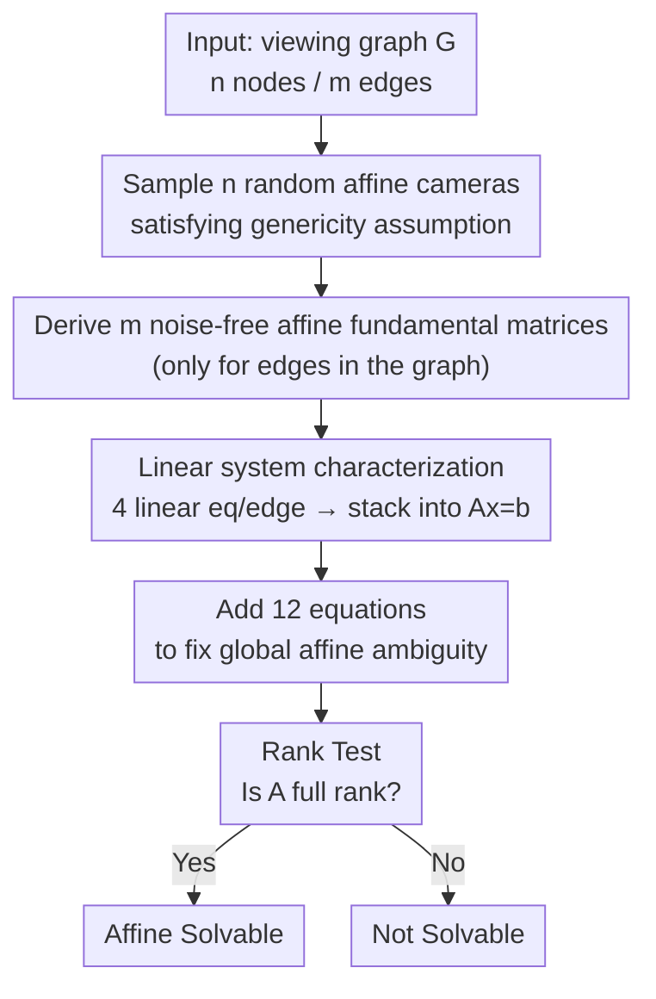

# Solvability of the Viewing Graph Under the Affine Camera Model

**Conference**: CVPR 2026  
**Paper**: [CVF Open Access](https://openaccess.thecvf.com/content/CVPR2026/html/Pedroni_Solvability_of_the_Viewing_Graph_Under_the_Affine_Camera_Model_CVPR_2026_paper.html)  
**Code**: https://github.com/federica-arrigoni/affine-solvability  
**Area**: 3D Vision  
**Keywords**: viewing graph, affine camera, SfM, solvability, parallel rigidity

## TL;DR
This paper conducts the first study on the solvability of the viewing graph under the affine camera model. It characterizes the problem of "whether a given set of two-view relations uniquely determines all cameras" as a **linear system** $Ax=b$. Consequently, a practical testing algorithm based on matrix rank is provided along with several necessary/sufficient conditions. Finally, it is conjectured that "affine solvability = 2D parallel rigidity."

## Background & Motivation
**Background**: Structure from Motion (SfM) aims to recover 3D points and cameras from multiple images. A common abstract tool is the **viewing graph**, where each node represents a camera/image and each edge represents a known two-view geometric relation (essential matrix $E$ for calibrated cameras, fundamental matrix $F$ for uncalibrated cameras). Studying the "solvability" of this graph asks: can all cameras be **uniquely** determined (up to a global transformation) solely from these two-view relations? If so, the graph is solvable.

**Limitations of Prior Work**: Existing results on solvability only cover two types of camera models. The **calibrated case** is largely solved—it is equivalent to **3D parallel rigidity** in graph theory, possessing both combinatorial and linear system characterizations as well as practical tests. The **uncalibrated case** is much more challenging: its solvability is characterized by **systems of polynomial equations** [38]. Solving polynomials has exponential complexity in the worst case relative to the number of variables, and currently, no practical exact test exists, forcing the use of "finite solvability" as an approximation [5–7].

**Key Challenge**: Camera models other than calibrated/uncalibrated are entirely missing from the solvability framework. Among them, the **affine camera** is a highly practical model—it serves as a good approximation for uncalibrated cameras when scene depth variation is small relative to the camera distance (e.g., aerial photography, turntable capture), and its mathematical form is simpler (the last row is fixed as $[0\,0\,0\,1]$). However, its behavior within the viewing graph solvability framework has never been investigated.

**Goal**: (1) Provide a **theoretical characterization** of affine solvability; (2) Convert this characterization into an **executable testing algorithm**; (3) Clarify how solvability changes for the same graph under calibrated, uncalibrated, and affine models.

**Key Insight**: The authors discovered that the specific structure of affine cameras (where both camera and fundamental matrices contain numerous zero elements) causes the compatibility constraint "the fundamental matrix is consistent with a camera pair"—originally polynomial—to **degenerate into linear constraints**. Thus, the solvability of the entire graph converges to the question of whether a linear system has a unique solution.

**Core Idea**: A **linear system $Ax=b$** with $4m+12$ rows and $8n$ columns is used to fully characterize affine solvability. A graph is affine solvable $\iff$ the coefficient matrix $A$ is full rank. Solvability testing is thus simplified to a single rank calculation.

## Method

### Overall Architecture
This paper addresses a purely theoretical question: given a viewing graph $G=(V,E)$ ($n$ nodes, $m$ edges) where each edge carries a known **affine fundamental matrix**, can these constraints uniquely determine all affine cameras up to a global affine transformation? The overall mechanism follows three steps: first, using the classic compatibility condition that "$Q^\top F P$ is skew-symmetric," combined with the specific forms of affine cameras and fundamental matrices, each edge is expressed as 4 **linear** equations; second, equations from all edges are stacked, and 12 additional equations are added to eliminate global affine ambiguity, resulting in the complete linear system $Ax=b$; finally, the "unique solvability" is reduced to "whether $A$ is full rank," implemented via rank calculation. Beyond theoretical characterization, the authors derive several necessary/sufficient conditions for fast pruning and propose an equivalence conjecture through experiments.

The specific forms of affine cameras and affine fundamental matrices are the source of all simplifications. An affine camera is:
$$P=\begin{bmatrix} N & u \\ \mathbf{0}^\top & 1\end{bmatrix},$$
where $N$ is $2\times3$ and $u$ is $2\times1$, totaling 8 degrees of freedom (fewer than the $3\times4$ of uncalibrated cameras). An affine fundamental matrix has 4 zero elements:
$$F=\begin{bmatrix} \mathbf{0} & f \\ g^\top & e\end{bmatrix}=\begin{bmatrix}0&0&a\\0&0&b\\c&d&e\end{bmatrix},$$
retaining only 4 degrees of freedom. These zeros cause the compatibility constraints to collapse from polynomials into linear equations.

The following diagram corresponds to the algorithmic pipeline (Algorithm 1, which turns the theoretical characterization into an executable test):

### Key Designs

**1. Linear System Characterization: Formulating Affine Solvability as $Ax=b$**

Uncalibrated solvability is difficult because its compatibility constraints are polynomial; this paper resolves exactly this. The starting point is the classic result from [19] (Proposition 1): a non-zero matrix $F$ is a fundamental matrix for camera pair $P,Q$ if and only if $Q^\top F P$ is **skew-symmetric**. This condition is essentially the epipolar constraint and holds for affine cameras as well. Critically, by substituting the specific forms of affine cameras (1), (3) and fundamental matrices (2) into $Q^\top F P$, the top-left $3\times3$ block of the product becomes zero, and the "skew-symmetric" condition reduces to only 4 scalar equations:
$$\begin{cases} m_{11}a+m_{21}b+n_{11}c+n_{21}d=0\\ m_{12}a+m_{22}b+n_{12}c+n_{22}d=0\\ m_{13}a+m_{23}b+n_{13}c+n_{23}d=0\\ t_1a+t_2b+u_1c+u_2d=-e \end{cases}$$
Here $a,b,c,d,e$ are known elements from the fundamental matrix, while $m_{ij},t_i,n_{ij},u_i$ are **unknown** elements of the two cameras—all equations are linear with respect to the unknowns. Collecting these 4 equations for every edge in the graph yields a linear system $Ax=b$ with $4m$ equations and $8n$ unknowns. Compared to the polynomial systems in the uncalibrated case, this is a qualitative simplification that aligns with the intuition of the affine model being an approximation of the uncalibrated one.

**2. Fixing Global Ambiguity + Rank Test: Equating "Unique Solution" to "Full Rank"**

Compatibility equations alone are insufficient because affine reconstruction inherently possesses global affine ambiguity. A subtle detail exists here (Remark 1): an affine camera has 8 degrees of freedom, while an affine transformation has 12. Therefore, **fixing all elements of a single camera (8) is not enough to eliminate ambiguity**; a portion of a second camera must be fixed to reach 12 parameters—in graph terms, disambiguation requires **two nodes** rather than one. The authors fix all elements of the first camera plus the first row of the second camera, totaling exactly 12 fixed parameters, which corresponds to appending 12 equations to $Ax=b$. With these, the system fully characterizes the graph: **the graph is affine solvable $\iff$ $A$ is full rank** (Proposition 2). Since this is a non-homogeneous linear system, "having a unique solution" is equivalent to the coefficient matrix being full rank. This lead to Algorithm 1: sample random cameras to generate noise-free fundamental matrices (ensuring genericity and compatibility), stack equations, add anchoring equations, and compute the rank of $A$. One rank calculation determines solvability.

**3. Necessary/Sufficient Conditions: Fast Pruning of Bad Graphs**

Beyond "computation," the authors aim to "identify" why a graph is (or isn't) solvable using combinatorial conditions. **Merge Rule (Prop 3, Sufficient)**: If two affine solvable graphs are merged by aligning two nodes, the result remains affine solvable—because two nodes provide exactly enough parameters to eliminate affine ambiguity between two independent reconstructions (referencing Remark 1). **2-Connectivity (Prop 4, Necessary)**: An affine solvable graph must be 2-connected (remaining connected after removing any single node); otherwise, two components sharing only one node cannot merge their respective affine transformations into a single global one. **Edge Lower Bound (Prop 5, Necessary)**: $m\ge 2n-3$, derived directly from "number of equations $4m+12 \ge 8n$ unknowns." These conditions allow for quick screening before running Algorithm 1 (e.g., small graphs 5g6 and 6g8 are ruled out by Prop 5). Interestingly, the lower bound $2n-3$ **exactly matches the minimum number of edges required for 2D parallel rigidity**.

**4. "Affine Solvable = 2D Parallel Rigid" Conjecture: Placing the Affine Model in the Rigidity Theory Spectrum**

Calibrated solvability is proven to be equivalent to **3D parallel rigidity**. What does the "lower-dimensional" affine model correspond to? While not formally proven, the paper observes a clean equivalence through extensive experiments: across all synthetic and real graphs, **affine solvability results are identical to those of 2D parallel rigidity**, and affine solvability always implies uncalibrated solvability. Thus, the authors conjecture that $\text{affine solvable}\iff\text{2D parallel rigid}$ and $\text{affine solvable}\Rightarrow\text{uncalibrated solvable}$. This is consistent with several facts: 2D parallel rigidity implies 3D parallel rigidity; the minimum edge requirements satisfy $2n-3\ \ge\ (11n-15)/7\ \ge\ (3n-4)/2$ (lower bounds for affine/2D rigid, uncalibrated, and calibrated/3D rigid respectively, for $n\ge2$), indicating the affine model is indeed more "restrictive." A formal proof is left for future work. ⚠️ This is a conjecture, not a theorem.

### An Example: Triangle and 4g5
The most intuitive example is the **triangle** (Fig. 3a): 3 nodes, 3 edges, $m=3=2\cdot3-3$, exactly meeting the lower bound. As a complete graph, it is affine solvable. Consider the **4g5** graph from [24] (Fig. 3b): it can be viewed as two triangles merged along two common nodes, thus determined affine solvable by the Merge Rule (Prop 3). In contrast, the classic small graphs **5g6 and 6g8** (Fig. 3c/3d), though calibrated and uncalibrated solvable, are **affine unsolvable** because they fail $m\ge2n-3$. This demonstrates that affine solvability is more stringent.

## Key Experimental Results

As the first work on affine viewing graph solvability, there are no direct competitors. Experiments aim to provide concrete examples and compare solvability across the three camera models. The implementation is based on MATLAB and is open-sourced.

### Main Results: Synthetic Graphs (Fixed Density, Varying Nodes)
With a fixed edge density of 15%, 1000 connected graphs were sampled for each $n$. The number of solvable graphs was recorded:

| n | 2D Parallel Rigidity | Affine Solvable (Ours) | Uncalibrated Solvable | Calibrated Solvable |
|---|----------------------|------------------------|-----------------------|---------------------|
| 10 | 266 | 266 | 327 | 374 |
| 25 | 447 | 447 | 457 | 475 |
| 50 | 865 | 865 | 865 | 867 |
| 75 | 999 | 999 | 999 | 999 |
| 100 | 1000 | 1000 | 1000 | 1000 |

The number of solvable graphs increases with $n$ (edge count grows quadratically). Key observation: **affine solvability count is always $\le$ uncalibrated solvability** (the cost of a more restricted model), and **the affine count matches 2D rigidity count exactly**—the core evidence for the conjecture.

### Second Synthetic Experiment: Fixed Nodes, Varying Density
For $n=25$, edge density varied from 15% to 40%, sampling 1000 graphs each:

| Density | 2D Parallel Rigidity | Affine Solvable | Uncalibrated Solvable | Calibrated Solvable |
|---------|----------------------|-----------------|-----------------------|---------------------|
| 0.15 | 439 | 439 | 447 | 465 |
| 0.20 | 531 | 531 | 540 | 559 |
| 0.25 | 816 | 816 | 816 | 818 |
| 0.30 | 952 | 952 | 952 | 952 |
| 0.40 | 999 | 999 | 999 | 999 |

Solvability increases with density, and the ordering "Affine ≡ 2D Rigid," "Affine $\le$ Uncalibrated $\le$ Calibrated" remains consistent.

### Real Data
Tests on real viewing graphs from SfM datasets [29,41] (using the maximal 2-connected subgraph). All subgraphs are calibrated solvable, so only affine/uncalibrated/2D results are reported:

| Dataset | n | Density | 2D Rigidity | Affine Solvable | Uncalibrated Solvable |
|---------|---|---------|-------------|-----------------|-----------------------|
| Gustav Vasa | 18 | 72% | ✓ | ✓ | ✓ |
| Dino 319 | 36 | 37% | ✓ | ✓ | ✓ |
| Folke Filbyter | 40 | 32% | ✓ | ✓ | ✓ |
| Toronto University | 77 | 33% | ✓ | ✓ | ✓ |
| Tsar Nikolai I | 98 | 52% | ✓ | ✓ | ✓ |
| Pumpkin | 195 | 65% | ✓ | ✓ | ✓ |

### Key Findings
- **Affine solvability and 2D parallel rigidity results are perfectly identical** across all synthetic and real graphs, providing strong empirical support for the $\text{affine}=\text{2D rigid}$ conjecture.
- **No difference was observed between affine and uncalibrated models** in real data, where most graphs are solvable. This suggests that for scenarios like turntables or small depth variations, using the simpler affine model incurs almost no loss in solvability.
- Affine solvability is **stricter** than calibrated/uncalibrated: its count never exceeds uncalibrated in synthetic tests, and specific graphs (5g6/6g8) are solvable in other models but not in affine.

## Highlights & Insights
- **Trading "Zero Structure" for "Linearization"**: The abundance of zeros in affine cameras and fundamental matrices causes polynomial constraints to degenerate into linear ones. This is the paper's cleverest contribution—reducing a potentially NP-hard problem to a rank calculation.
- **8 vs 12 DOF Ambiguity**: Since an affine camera has 8 DOF and an affine transformation 12, "one node cannot fix global ambiguity; two are required." This simple counting argument yields the anchoring equations and supports both the merge rule and 2-connectivity necessity.
- **Embedding New Models into Rigidity Theory**: Calibrated ↔ 3D parallel rigidity is known; this paper conjectures affine ↔ 2D parallel rigidity. The alignment of the minimum edge bound $2n-3=(8n-12)/4$ with the 2D rigidity bound provides a unified "dimension-model" intuition.

## Limitations & Future Work
- **Conjecture Lacks Theorem Status**: Both $\text{affine solvable} \iff \text{2D parallel rigid}$ and $\text{affine solvable} \Rightarrow \text{uncalibrated solvable}$ lack formal proofs. ⚠️ Note the unproven status when citing.
- **Determines Solvability, Not Reconstruction**: The paper only answers "is the solution unique?" it does not provide an algorithm for actually computing the cameras on a solvable graph.
- **Lack of Empirical Gap on Real Data**: In the analyzed real sequences, both models yielded identical results. More datasets (particularly those with sparse edges or non-turntable motion) are needed to expose the actual gap.
- **Dependency on Genericity**: The algorithm uses random camera sampling to generate noise-free matrices to ensure genericity; conclusions apply to general poses and exclude degenerate configurations (e.g., collinear centers).

## Related Work & Insights
- **vs. Calibrated Solvability [2,30,31]**: The calibrated case is equivalent to 3D parallel rigidity. This paper brings the "linear system + rank test" paradigm to the affine model and conjectures a link to the lower-dimensional 2D parallel rigidity.
- **vs. Uncalibrated Solvability [4,5,6,38]**: Uncalibrated solvability requires polynomial systems [38], making exact tests infeasible and forcing "finite solvability" approximations [5–7]. This paper proves affine solvability is **linear**, allowing for **exact** uniqueness tests—a fundamental advantage over the uncalibrated case, albeit for a more restricted model.
- **vs. Merge/Composition Rules [2,34]**: Composition rules exist for uncalibrated [34] and merge theorems for calibrated [2]. Prop 3 in this paper is their affine counterpart, with the argument centered on using "two common nodes" for disambiguation.

## Rating
- Novelty: ⭐⭐⭐⭐⭐ First study on affine viewing graph solvability, discovering its linear structure and equivalence to 2D parallel rigidity.
- Experimental Thoroughness: ⭐⭐⭐⭐ Systematically scans node count and density in synthetic graphs and validates on real SfM graphs, though the real-world gap between affine and uncalibrated remains unexposed.
- Writing Quality: ⭐⭐⭐⭐⭐ Clear theoretical derivation; the flow from theorem to proof, examples, and conjectures is highly readable.
- Value: ⭐⭐⭐⭐ Provides a practical solvability pre-check for affine SfM and integrates the affine model into the broader spectrum of rigidity theory.

<!-- RELATED:START -->

## Related Papers

- [\[ECCV 2024\] A Direct Approach to Viewing Graph Solvability](../../ECCV2024/3d_vision/a_direct_approach_to_viewing_graph_solvability.md)
- [\[CVPR 2026\] Affine Perspective-Three-Point Problem](affine_perspective-three-point_problem.md)
- [\[CVPR 2026\] Variational Graph-based Normal Integration](variational_graph-based_normal_integration.md)
- [\[CVPR 2026\] Sky2Ground: A Benchmark for Site Modeling under Varying Altitude](sky2ground_a_benchmark_for_site_modeling_under_varying_altitude.md)
- [\[CVPR 2026\] 4C4D: 4 Camera 4D Gaussian Splatting](4c4d_4_camera_4d_gaussian_splatting.md)

<!-- RELATED:END -->
