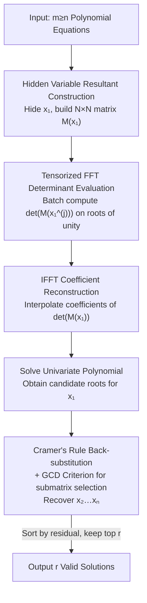

# Solving Minimal Problems Without Matrix Inversion Using FFT-Based Interpolation

**Conference**: CVPR 2026  
**arXiv**: [2605.06572](https://arxiv.org/abs/2605.06572)  
**Code**: https://github.com/hayden-86/fft-minimal-solvers (Available)  
**Area**: 3D Vision / Multi-view Geometry / Camera Pose Estimation  
**Keywords**: Minimal Problems, Sparse Resultant, Hidden Variable Elimination, FFT Interpolation, Cramer's Rule

## TL;DR
This paper proposes a **matrix-inversion-free** construction method for minimal problem solvers. By using hidden variable sparse resultants, multivariate polynomial systems are reduced to a univariate determinantal polynomial in $x_1$. Then, **IFFT interpolation** is employed to numerically reconstruct the polynomial coefficients from sampling values on the unit circle (bypassing symbolic expansion). Finally, Cramer's rule combined with a GCD criterion is used for robust back-substitution of remaining unknowns. The method achieves a **zero failure rate** in numerical stability across 14 camera pose minimal problems and provides an average speedup of approximately 30% for small-scale problems.

## Background & Motivation

**Background**: Camera geometry estimation (structure-from-motion, relative pose, absolute pose/PnP, calibration, etc.) in practice almost exclusively relies on the RANSAC framework to repeatedly solve "minimal problems"—estimating model parameters using the minimum number of point correspondences. The vast majority of these minimal problems involve solving systems of multivariate polynomial equations. The two main pipelines for solving such systems in computer vision are **Gröbner basis methods** (extended by Stewénius, automatic solver generators by Kukelova/Larsson, GAPS, etc.) and **resultant methods** (specifically sparse resultants adapted to sparse structures).

**Limitations of Prior Work**: Whether using Gröbner bases or resultants, constructed online solvers **almost always include an explicit matrix inversion step** (typically inverting the elimination matrix to obtain the action matrix or taking the Schur complement of a resultant submatrix). When matrices are near-singular or ill-conditioned—a common occurrence under noise or degenerate configurations—matrix inversion is both expensive and numerically unstable, often leading to biased eigenvalues or solver failure. Another route using resultant determinants is blocked by **symbolic expansion**: an $N\times N$ determinant can have up to $N!$ terms, making symbolic expansion computationally infeasible and numerically unstable for high-dimensional matrices.

**Key Challenge**: A deadlock between stability and feasibility—avoiding ill-conditioned matrix inversion usually requires means that lead to larger eigenvalue problems and higher computational overhead (e.g., hidden variable resultants by Bhayani et al. [2]); solving determinantal polynomials as univariate polynomials is blocked by the factorial complexity of symbolic expansion.

**Goal**: Construct a minimal solver that performs **neither explicit matrix inversion nor symbolic determinant expansion**, while maintaining high numerical stability and competitive runtime.

**Key Insight**: The authors observe from a numerical perspective that since only the univariate determinantal polynomial $\det(M(x_1))$ regarding the hidden variable $x_1$ is needed, **symbolic expansion is unnecessary**. As long as $\det(M(x_1))$ is evaluated numerically at enough sampling points, the univariate polynomial can be **interpolated**. If the sampling points are chosen as the $(k+1)$-th roots of unity on the complex unit circle, the Vandermonde interpolation matrix degenerates into a Discrete Fourier Transform matrix. Thus, coefficient recovery becomes an **IFFT**—avoiding the inversion of ill-conditioned Vandermonde matrices and requiring only $O(k\log k)$ complexity.

**Core Idea**: **Replace "symbolic determinant expansion / matrix inversion" with "unit circle sampling + IFFT interpolation"** to obtain the hidden variable univariate polynomial, then use Cramer's rule (in ratio form, without explicit submatrix inversion) to back-substitute other unknowns, ensuring no matrix inversion throughout the pipeline.

## Method

### Overall Architecture
The method consists of **offline construction** and **online solving** stages. Given a minimal problem ($m\ge n$ equations in $n$ variables), a hidden variable method is first used to "hide" one variable $x_1$ within the coefficient field. A sparse resultant $N\times N$ determinantal matrix $M(x_1)$ is constructed—each element is a univariate polynomial in $x_1$, and its determinant $\det(M(x_1))=c_k x_1^k+\dots+c_0$ is a univariate polynomial whose (true) roots are the $x_1$ coordinates of the original system's solutions.

The offline stage is performed once per problem type: determining the determinant degree $k$ and the number of true solutions $r$ (using algebraic tools like Maple/Macaulay2) and identifying a reliable pair of row/column indices $(i,j)$ for online back-substitution via the GCD criterion. For every new instance in the online stage: substitute specific coefficients into $M(x_1)$ → **batch evaluate all $\det(M(x_1^{(j)}))$ using tensorized FFT** at $k+1$ roots of unity → use **IFFT** to interpolate the coefficients $c_0,\dots,c_k$ → solve the univariate polynomial for candidate roots of $x_1$ → for each root, use **Cramer's rule** to compute monomial ratios and back-substitute $x_2,\dots,x_n$ → sort candidate solutions by residual and retain the $r$ solutions with the smallest residuals. The entire pipeline **contains no explicit matrix inversion and no symbolic determinant expansion**.

### Key Designs

**1. IFFT Unit Circle Interpolation for Determinant Reconstruction: Replacing "Symbolic Expansion" with "Numerical Sampling + One IFFT"**

This is the core of the paper. To solve the hidden variable univariate polynomial $\det(M(x_1))=c_k x_1^k+\dots+c_0$, the coefficients $c_l$ themselves are multivariate polynomials of the original coefficients, where symbolic expansion triggers an $N!$ factorial explosion. The authors transform "coefficient calculation" into "evaluation followed by interpolation": first, the degree $k$ is determined offline (by computing the determinant once with random numerical coefficients; $k$ depends only on the problem form and is constant for the same problem), then sampling is performed on the $(k+1)$-th roots of unity on the complex unit circle:

$$x_1^{(j)}=\omega^{-j},\quad \omega=e^{2\pi i/(k+1)},\quad j=0,\dots,k$$

The value $y^{(j)}=\det(M(x_1^{(j)}))$ is calculated numerically at each point. The relationship between these $k+1$ values and the coefficients $\mathbf c$ is a Vandermonde linear system $\mathbf y=V\mathbf c$. Directly inverting $V$ is numerically unstable due to the ill-conditioned nature of Vandermonde matrices, but **when sampling points are roots of unity, $V$ is equivalent to the DFT matrix (scaled)**. Recovering $\mathbf c$ thus simplifies to an IFFT:

$$c_l=\frac{1}{k+1}\sum_{j=0}^{k}y^{(j)}\,\omega^{jl}$$

This bypasses symbolic expansion and replaces the ill-conditioned Vandermonde inversion with a stable IFFT, with a complexity of only $O(k\log k)$. Unit circle sampling also ensures all sampling points have a magnitude of 1, preventing exponential explosion or decay of monomial terms, improving numerical stability at the source.

**2. Tensorized FFT Batch Determinant Evaluation: Compressing $k+1$ Point Evaluations into a Single FFT Along the Degree Axis**

IFFT alone is insufficient; one must first compute $N\times N$ determinants at $k+1$ points. The authors note that each $(r,c)$ element of $M(x_1)$ is a univariate polynomial $p_{rc}(x_1)=\sum_l a_{rc,l}x_1^l$. Thus, the entire matrix can be written as a sum of coefficient matrices expanded by degree $M(x_1)=\sum_{l=0}^{d}A_l x_1^l$. Stacking these coefficient matrices $\{A_l\}$ along the "polynomial degree" dimension into a 3D tensor $\mathcal A\in\mathbb C^{N\times N\times(d+1)}$, "simultaneous evaluation of $M(x_1^{(j)})$ at all roots of unity" is equivalent to **performing a 1D FFT along the third dimension of the tensor**:

$$M_{\text{fft}}(:,:,j)=\sum_{l=0}^{d}A_l\,e^{-2\pi i jl/(d+1)}$$

Each tensor slice represents the matrix $M(x_1^{(j)})$ at a specific sampling point. Performing batch determinants on these slices yields all $y^{(j)}$. This merges multiple sequential polynomial evaluations into a single batch FFT, significantly reducing overhead without sacrificing stability.

**3. Cramer's Rule Ratio Back-substitution + GCD Criterion for Robust Submatrix Localization: Recovering Unknowns Without Inversion**

After obtaining the roots of $x_1$, substituting them back into the homogeneous system yields $M(x_1)\mathbf b=\mathbf 0$. Theoretically, $M(x_1)$ should have a rank deficiency of 1. Deleting a row $i$ and a column $j$ yields a full-rank submatrix $M'(x_1)$, and the system can be rearranged into a linear system $M'(x_1)\,\mathbf b'/b_j=-\mathbf m'_j$. Instead of **explicitly inverting $M'(x_1)$**, the authors use Cramer's rule to write each monomial ratio as a ratio of two determinants:

$$\frac{b_k}{b_j}=\frac{|\tilde M'_k(x_1)|}{|M'(x_1)|}$$

where $\tilde M'_k$ is $M'$ with the $k$-th column replaced by $-\mathbf m'_j$. Since the desired unknown $x_w$ can be expressed as the quotient of two monomial ratios (e.g., if $b_1=x_2^4x_3$ and $b_2=x_2^3x_3$, then $x_2=(b_1/b_j)/(b_2/b_j)$), the final $x_w(x_1)=|\tilde M'_{j_1}(x_1)|/|\tilde M'_{j_2}(x_1)|$ is independent of the choice of $b_j$. **This step involves only determinant ratios and no matrix inversion**.

The challenge is that under floating-point error, $M(x_1)$ might be misidentified as full rank, causing all submatrices to "appear full rank." The authors propose a **GCD Coprimality Criterion**: since the root $x_1$ makes $\det(M(x_1))=0$ but not necessarily $\det(M'_{(i,j)}(x_1))=0$, these two polynomials should be coprime, and their GCD should be a constant:

$$\gcd\big(\det(M(x_1)),\det(M'(x_1))\big)=c,\quad c\in\mathbb R\setminus\{0\}$$

To avoid the high cost of symbolic determinant expansion, the authors use a **random specialization** strategy: assign random prime values to all symbolic coefficients except $x_1$, then compute the GCD of the two polynomials. The specialized GCD is equivalent to the symbolic GCD but much faster to compute. A constant GCD indicates that $(i,j)$ is a valid deletion pair. This step is done once offline and reused for all instances, ensuring stability and generalization of online back-substitution.

### Loss & Training
This is a **pure geometric/algebraic solver** and does not involve network training or loss functions. The "offline-online" split acts as a pre-processing phase: offline tasks (determining $k$, $r$, and $(i,j)$ via GCD) are done once per problem, and the results are stored as solver parameters. Online, these parameters are reused to execute the numerical pipeline. Residual screening uses a normalized residual $\hat r(\mathbf x)=r(\mathbf x)/\|\mathbf x\|_2$ (where $r(\mathbf x)=\max_i|f_i(\mathbf x)|$ is the maximum absolute residual), ranking candidates and retaining the top $r$ solutions.

## Key Experimental Results

Experiments were conducted on synthetic datasets (5000 random instances generated following the SparseR [1] pipeline) covering 14 minimal problems. Implementation was in MATLAB on an Intel Core i5-13500H with 16GB RAM. Baselines include SOTA solvers: **SparseR** [1] (sparse resultant) and **GAPS** [29] (Gröbner basis).

### Main Results

**Numerical Stability** ($log_{10}$ normalized equation residual, lower is better; fail% is defined as instances with residual $>10^{-3}$):

| Minimal Problem | Ours mean / fail% | SparseR mean / fail% | GAPS mean / fail% |
|-----------------|-------------------|----------------------|-------------------|
| Rel. pose F+λ 8pt | −13.17 / **0** | −12.71 / 0.2 | −12.62 / 0.1 |
| Rolling shutter pose | −11.14 / **0** | −12.43 / 0 | −12.26 / 0 |
| Abs. pose refractive P5P | −11.24 / **0** | −10.68 / 0.06 | −9.96 / 0.18 |
| Rel. pose E+fλ 7pt | −7.83 / **0** | −9.75 / 0.02 | −7.65 / **0.3** |
| Rel. pose λ1+F+λ2 9pt | −8.83 / **0** | −8.76 / 1.24 | −8.66 / 1.04 |

**Core Conclusion**: Across all 14 problems, the proposed solver achieved a **zero failure rate**. SparseR and GAPS showed minor failure rates across multiple problems (typically $<0.2\%$, though reaching $1.0\%-1.2\%$ for the 9pt problem). Mean/median residuals were on par with or better than competitors, indicating that reconstruction without matrix inversion **does not sacrifice precision**.

**Runtime and Candidate Root Counts** (Time is average per instance; roots* indicates count before filtering):

| Minimal Problem (True Roots) | Ours time / roots | SparseR time / roots | GAPS time / roots |
|-------------------|-------------------|----------------------|-------------------|
| Rel. pose F+λ 8pt (8) | **0.086** / 8 | 0.101 / 9 | 0.106 / 8 |
| Rel. pose E+f 6pt (9) | **0.154** / 9 | 0.345 / 9 | 0.235 / 9 |
| Rel. pose f+E+f 6pt (15) | **0.287** / 15 | 0.597 / 18 | 0.515 / 15 |
| Rel. pose E+fλ 7pt elim.λ (19) | **0.417** / 19 | 0.637 / 19 | 0.545 / 19 |
| Triangulation satellite (27) | 2.923 / 27 | **0.552** / 27 | 0.554 / 27 |
| Optimal PnP Cayley (40) | 7.442* / 43 | **1.393** / 40 | 3.005 / 40 |

**Core Conclusion**: On the first five **small-scale** problems, the proposed solver was consistently faster, with an average speedup of approximately **30%** (range 10%–50%). However, it **does not outperform for large-scale problems**—the solver must perform determinant evaluation and back-substitution for every candidate root, meaning runtime grows **nearly linearly** with root count. Thus, for problems with 27 or 40 roots, it is significantly slower than SparseR/GAPS.

### Ablation Study
There is no traditional ablation table as there are no trainable modules, but the necessity of the designs is validated across different dimensions:
- **0% Failure Rate vs. 0.02%–1.24%**: Validates the numerical gain of skipping ill-conditioned matrix inversion.
- **30% Speedup vs. Large-scale Slowdown**: Validates the applicability boundaries of the tensorized FFT approach.
- **Exact Root Counts for Small Problems**: Validates that the GCD criterion successfully identifies effective deletion pairs, yielding "cleaner" candidate sets.

### Key Findings
- **Stability stems from "no inversion" rather than complex numerical tricks**: The zero failure rate confirms that competitor failures are almost entirely due to ill-conditioned matrix inversions (e.g., Schur complements) that amplify noise.
- **Runtime scaling is the main bottleneck**: Performance is excellent for small-scale problems ($\le 19$ roots) but lags for large systems because each root requires independent determinant evaluation and Cramer back-substitution.
- **Randomly specialized GCD criterion is robust**: It consistently identified valid $(i,j)$ pairs across all problems, which is critical for turning "theoretical rank deficiency" into practical numerical success.

## Highlights & Insights
- **Elegant link between Sampling and FFT**: The mapping of "unit circle sampling $\Rightarrow$ Vandermonde degeneration into DFT $\Rightarrow$ interpolation becomes IFFT" is mathematically clean. It transforms a notoriously ill-conditioned problem (Vandermonde inversion) into a highly stable one (FFT) while sidestepping the $N!$ complexity of symbolic expansion.
- **Transferable Tensorized FFT Perspective**: Stacking coefficient matrices along the degree axis into a tensor allows batch multi-point evaluation to be treated as a 1D FFT. This trick is applicable to any polynomial matrix evaluation problem.
- **Ratio-form Cramer's Rule**: Using $x_w=|\tilde M'_{j_1}|/|\tilde M'_{j_2}|$ allows for direct recovery of unknowns without matrix inversion and makes the solution independent of the normalization denominator $b_j$.
- **Amortized Symbolic Costs**: By moving degree determination, root counts, and submatrix selection to an offline phase, the online cost in the RANSAC loop is minimized.

## Limitations & Future Work
- **Scaling Complexity**: Runtime grows linearly with the number of candidate roots, making the method **slower than SparseR/GAPS for large-scale problems**. GPU parallelization of determinant evaluation was suggested as future work.
- **Narrow Practical Advantage**: Benefits are concentrated in "small-scale" problems ($\le 19$ roots), which cover many classic P3P/5pt/6pt problems but diminish for complex systems with many roots.
- **Pseudo-roots in Large Systems**: Larger problems reconstruct more candidates than true solutions, requiring residual screening. The reliability of this screening under extreme noise requires further analysis.
- **Dependence on Symbolic Tools**: The offline phase still requires CAS tools (Maple/Macaulay2) for initial setup, which maintains a barrier for new problem construction.
- **Limited Evaluation**: Evaluation is restricted to synthetic data; end-to-end verification in real-world RANSAC pipelines is missing.

## Related Work & Insights
- **Comparison with SparseR [1]**: Both use hidden variable sparse resultants. This work adopts SparseR's matrix construction but replaces Schur complements (requiring inversion) with IFFT/Cramer ratios, achieving 0% failure at the cost of speed in large systems.
- **Comparison with GAPS [29]**: Gröbner basis methods often require inverting elimination matrices for action matrix construction. This work's inversion-free approach provides superior stability.
- **Insight**: When an ill-conditioned linear algebra operation caps a pipeline's performance, it may be better to replace the operation with a mathematically equivalent but numerically superior path—in this case, using "sampling-interpolation" to replace "symbolic expansion/inversion."

## Rating
- Novelty: ⭐⭐⭐⭐ 
- Experimental Thoroughness: ⭐⭐⭐ 
- Writing Quality: ⭐⭐⭐⭐ 
- Value: ⭐⭐⭐⭐ 

<!-- RELATED:START -->

## Related Papers

- [\[ICCV 2025\] PLMP -- Point-Line Minimal Problems for Projective SfM](../../ICCV2025/3d_vision/plmp_-_point-line_minimal_problems_for_projective_sfm.md)
- [\[CVPR 2026\] Minimal Constraint Relaxation for Multiview Autocalibration](minimal_constraint_relaxation_for_multiview_autocalibration.md)
- [\[CVPR 2026\] Linear Fundamental Matrix Estimation from 7 or 5 Points](linear_fundamental_matrix_estimation_from_7_or_5_points.md)
- [\[CVPR 2026\] TESO: Online Tracking of Essential Matrix by Stochastic Optimization](teso_online_tracking_of_essential_matrix_by_stochastic_optimization.md)
- [\[CVPR 2026\] PaNDaS: Learnable Shape Interpolation Modeling with Localized Control](pandas_learnable_shape_interpolation_modeling_with_localized_control.md)

<!-- RELATED:END -->
