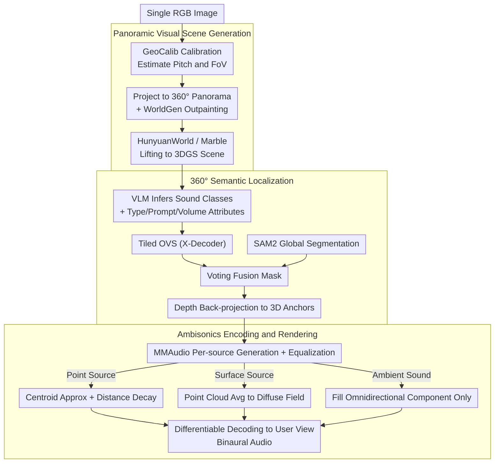

# SonoWorld: From One Image to a 3D Audio-Visual Scene

**Conference**: CVPR 2026  
**arXiv**: [2603.28757](https://arxiv.org/abs/2603.28757)  
**Code**: [https://humathe.github.io/sonoworld/](https://humathe.github.io/sonoworld/)  
**Area**: 3D Vision / Audio-Visual Scene Generation  
**Keywords**: 3D Audio-Visual Scene, Spatial Audio Generation, Panorama Reconstruction, Ambisonics Encoding, Single-image Generation

## TL;DR

SonoWorld is proposed, a training-free framework that generates explorable 3D audio-visual scenes from a single image. It first expands a single image into a 360° panorama and reconstructs it as a 3D Gaussian scene. Then, it utilizes VLM-driven semantic localization to place sound source anchors, and finally renders spatial audio using Ambisonics encoding to achieve both geometric and semantic alignment between visual and auditory domains.

## Background & Motivation

**Background**: Recent years have seen significant progress in visual scene generation. Techniques ranging from panoramic methods like WorldGen to 3D Gaussian Splatting (3DGS) have enabled the generation of free-roaming 3D worlds from a single image. However, these systems currently produce "silent worlds" that can be seen but not heard.

**Limitations of Prior Work**: True immersive experiences are inherently multi-sensory. For example, in a garden, the sound of a waterfall should emanate from upstream and increase in volume as one approaches, bird songs should come from the treetops, and insect chirping should change with head rotation. Without semantically correct audio containing distance and directional cues, the perception of even the most realistic visual world remains incomplete. Existing audio generation methods either produce only monaural audio or are limited to single objects or fixed viewpoints, failing to handle scene-level audio containing diverse source types like point sources (e.g., birds), surface sources (e.g., rivers), and ambient sounds (e.g., wind).

**Key Challenge**: Generating scene-level spatial audio requires addressing three simultaneous problems: (1) combining heterogeneous sound source types (point, surface, and ambient) which exhibit different behaviors; (2) reasoning about which objects are making sounds, how they sound, and their relative volume from purely visual context; (3) anchoring all sounds to plausible 3D positions inferred from the image with perceptually realistic spatial effects.

**Goal**: This work defines a brand new task, Image2AVScene: simultaneously generating an interactive 3D visual scene and a semantically/geometrically aligned spatial sound field from a single image, and proposes the first complete framework for it.

**Key Insight**: An equirectangular panorama representation is adopted to unify the coordinate systems of vision and audio. Furthermore, Vision-Language Models (VLMs) are utilized for semantic understanding to bridge the gap between vision and sound.

**Core Idea**: A training-free pipeline consisting of panoramic outpainting → 3DGS reconstruction → VLM-driven 360° semantic localization → Ambisonics encoding is implemented to generate free-roaming 3D audio-visual scenes from a single image.

## Method

### Overall Architecture

SonoWorld addresses the Image2AVScene task: given an ordinary RGB image, it creates a free-roaming 3D visual scene and a spatial sound field that matches it semantically and geometrically. The difficulty lies in the fact that sound is invisible—one cannot see "where it sounds, what sounds, or how loud" in an image—and different sound sources (birds, rivers, wind) have entirely different spatial behaviors.

The pipeline uses a panorama to align vision and audio within the same coordinate system, gradually translating "visible" elements into "audible" ones. The process follows four steps: the single image undergoes camera calibration and outpainting to form a 360° panorama, which is then lifted into a 3D Gaussian scene. Next, a VLM infers which objects are producing sound from the image; combined with segmentation, these sound sources are precisely localized and back-projected into 3D. Subsequently, waveforms are generated for each source and encoded into Ambisonics coefficients based on their type. Finally, at the user's actual position and orientation, the Ambisonics are decoded into binaural audio. This framework requires no parameter training and relies entirely on a combination of existing pre-trained models.

### Key Designs

**1. Panoramic Visual Scene Generation: Completing a Flat Photo into a 3D World with a Unified Coordinate System**

Locating sound sources directly from a single perspective image is difficult due to the narrow field of view and lack of a 360° environment. Furthermore, previous methods often assumed horizontal camera placement, leading to vertical distortion when encountering pitch angles. Here, GeoCalib is used for single-image calibration to estimate the elevation angle and field of view $(\varphi, f) = \text{Calib}(I)$. Based on this, the image is projected into an equirectangular panorama via Gaussian pyramid anti-aliasing sampling. The WorldGen outpainting model is then used to complete the missing 360° view. Finally, this is lifted into a 3D Gaussian Splatting scene using HunyuanWorld (open-source) or Marble (commercial). Choosing the panorama as the intermediate representation is crucial: it naturally covers the entire 360° view and aligns with the spherical coordinate system of Ambisonics, allowing vision and audio to share the same geometry. The elevation correction step specifically addresses vertical distortion left by previous "horizontal assumption" methods.

**2. 360° Semantic Localization: Inferring Sound Sources from Vision and Anchoring them to Accurate 3D Positions**

Since sound has no pixels, the framework must first answer "what is sounding in the image" and then "where is it in 3D." The first question is handled by a VLM (GPT-5 or LLaVA-Next-34B), which reasons the set of sounding categories $\mathcal{C}$ and their attributes directly from the input image—including source type (point/surface/ambient), text prompts for audio generation, and equalization parameters. The second question involves localizing these categories on the panorama. Open-vocabulary segmentation (OVS) models are typically trained on perspective images and distort if fed a panorama directly. Therefore, the panorama is divided into overlapping FoV tiles; X-Decoder performs OVS on each tile, and the results are projected back to panoramic coordinates. To solve edge fractures and incomplete regions at tile boundaries, SAM2 is used to provide global, class-agnostic segmentation for the entire panorama, yielding geometrically clean and continuous regions. A "voting" mechanism then fuses the X-Decoder semantic results with the SAM2 regions—using SAM2's global consistency as a base and X-Decoder to provide category semantics. The localized masks are back-projected into 3D using depth maps to obtain the set of sound source anchors $\mathcal{P}$.

**3. Ambisonics Encoding and Rendering: Spatializing Source Types Separately and Decoding Differentiably to Any Viewpoint**

Spatial behaviors differ greatly across sources—bird songs are point sources with clear directionality, rivers are surface sources producing diffuse sound fields, and wind is an ambient sound independent of direction—so a "one-size-fits-all" approach is avoided. The framework first uses MMAudio to generate raw waveforms $a_{i,\text{raw}}$ according to the text prompts for each source. After equalization:

$$a_i(t) = 10^{v_i/20}\, a_{i,\text{raw}}(t)$$

the sounds are encoded into Ambisonics coefficients by type. Point sources use centroid approximation with distance decay $\mathbf{A}_\text{point} = \sum_i a_i\, \sigma(\|d_i\|)\, \mathbf{y}_L(\cdot)$. Surface sources are averaged across their entire point cloud to create a diffuse sound field. Ambient sounds only fill the omnidirectional component $\mathbf{A}_\text{global} = a_\text{global}[1, 0, \dots, 0]^\top$. Distance decay is defined as $\sigma(d) = e^{-\alpha d}/d$. The entire rendering pipeline is differentiable with respect to the audio buffer—not just for rendering, but also to allow the framework to perform backpropagation for optimization in downstream tasks like room acoustic learning and source separation.

### Example: From a Garden Photo to an Audible Scene

Take a garden photo as an example: calibration estimates the camera is slightly tilted downwards, outpainting completes the bushes and sky behind, and the scene is lifted into a roamable 3DGS scene. The VLM identifies three types of sound sources: "Waterfall (Surface) / Upstream," "Birdsong (Point) / Treetop," and "Wind (Ambient) / Global," along with their prompts and volumes. The waterfall and bird are precisely segmented through tiled OVS + SAM2 voting and back-projected to 3D to obtain anchors, while the wind requires no localization. After waveform generation, the birdsong is encoded as directional point source coefficients, the waterfall as a diffuse field, and the wind occupies only the omnidirectional component. When a user walks closer to the waterfall and turns their head, the binaural audio decoded from Ambisonics in real-time shows the waterfall sound increasing with proximity and the birdsong moving with head rotation—wherever you go visually, you are matched auditorily.

### Loss & Training

SonoWorld is entirely training-free and does not train any parameters; the entire process is a combination of pre-trained models (VLM, outpainting, 3D reconstruction, audio generation). Optimization is only utilized in the differentiable rendering pipeline—when applied to downstream tasks like one-shot room acoustic learning, backpropagation can be used to fit real acoustics.

## Key Experimental Results

### Main Results

Evaluated on the self-constructed SonoScene360 dataset (68 clips, 6 real scenes):

| Method | ΔAngular↓ | CC↑ | AUC↑ | D-CLAPT↑ | D-CLAPR↑ |
|------|-----------|-----|------|----------|----------|
| MMAudio | — | — | — | 0.322 | 33.8% |
| SEE-2-SOUND | 1.397 | 0.194 | 0.603 | 0.156 | 22.1% |
| OmniAudio | 1.449 | 0.148 | 0.588 | 0.104 | 39.7% |
| Ours (Open-source) | 0.975 | 0.491 | 0.753 | 0.413 | 52.9% |
| **Ours (Proprietary)** | **0.728** | **0.658** | **0.838** | **0.457** | **67.6%** |

DOA error was reduced by 47%, CC improved by over 239%, and semantic metrics improved by over 117%.

### Ablation Study

One-shot room acoustic learning:

| Method | ΔAngular↓ | MAG↓ | ENV↓ |
|------|-----------|------|------|
| NAF | 1.76 | 3.96 | 3.60 |
| AV-NeRF | 1.58 | 4.58 | 1.89 |
| **Ours** | **0.22** | **3.46** | **1.22** |

### Key Findings

- The method achieves an audio callback latency of < 1ms on an Apple M3 Pro laptop, far below the 5.3ms real-time requirement.
- In a user study (50 participants, 12 scenes), SonoWorld obtained the highest preference rate across all comparisons.
- The open-source version (HunyuanWorld + LLaVA-Next) significantly outperformed baselines even when compared against those using commercial model outputs.
- Siren scenarios exposed limitations regarding moving sound sources—static image input cannot perceive source motion.

## Highlights & Insights

- **First Image2AVScene Task Definition and Complete Solution**: Unifies visual scene generation and spatial audio generation into a single framework.
- **Unity of Panorama Representation**: The panorama provides a complete 360° view and naturally aligns with the Ambisonics coordinate system, serving as a critical architectural choice.
- **VLM + SAM2 Complementary Fusion**: OVS provides semantics without global consistency, whereas SAM2 is globally consistent without semantics; the voting fusion strategy effectively combines them.
- **Versatility of the Differentiable Rendering Pipeline**: The same framework easily extends to acoustic learning and source separation.
- **Training-free Design**: Based entirely on the clever combination of existing models, offering high engineering feasibility.

## Limitations & Future Work

- Incapable of handling moving sound sources (input is a static image).
- FOA (First-order Ambisonics) has limited spatial resolution; higher orders could improve this but with exponentially increasing channel counts.
- Sound generation depends on the quality of MMAudio, which may perform poorly on certain rare sound sources.
- Does not model complex acoustic phenomena like room reverberation or multi-path effects.
- The quality of generated visual scenes is limited by the capabilities of the outpainting and 3D reconstruction models.

## Related Work & Insights

- **WonderWorld/WorldGen**: Foundations for panorama-to-3D scene generation.
- **MMAudio**: Video-to-audio generation model used here for per-source audio synthesis.
- **X-Decoder + SAM2**: The combination of open-vocabulary segmentation and panoramic refinement is a noteworthy strategy.
- This framework's philosophy can be extended to 4D dynamic scenes and acoustic perception in embodied AI.

## Rating

- **Novelty**: ⭐⭐⭐⭐⭐ First to define and solve the task of generating 3D audio-visual scenes from a single image; ground-breaking work.
- **Experimental Thoroughness**: ⭐⭐⭐⭐ Includes a self-built dataset, comprehensive metrics, user study, and extended applications, though the number of evaluation scenes is limited (6 real scenes).
- **Writing Quality**: ⭐⭐⭐⭐⭐ Clear problem definition, complete method description, and rigorous mathematical derivation.
- **Value**: ⭐⭐⭐⭐⭐ Opens new directions for multi-sensory scene generation in VR/AR and embodied AI.

<!-- RELATED:START -->

## Related Papers

- [\[CVPR 2026\] Pano3DComposer: Feed-Forward Compositional 3D Scene Generation from Single Panoramic Image](pano3dcomposer_feed-forward_compositional_3d_scene_generation_from_single_panora.md)
- [\[CVPR 2026\] CoLoR: The Devil is in Scene Coordinate Regression for Large-Scale Visual Localization](color_the_devil_is_in_scene_coordinate_regression_for_large-scale_visual_localiz.md)
- [\[CVPR 2026\] Omni-3DEdit: Generalized Versatile 3D Editing in One-Pass](omni-3dedit_generalized_versatile_3d_editing_in_one-pass.md)
- [\[CVPR 2026\] Towards Visual Query Localization in the 3D World](towards_visual_query_localization_in_the_3d_world.md)
- [\[CVPR 2026\] Efficiently Reconstructing Dynamic Scenes One D4RT at a Time](efficiently_reconstructing_dynamic_scenes_one_d4rt_at_a_time.md)

<!-- RELATED:END -->
