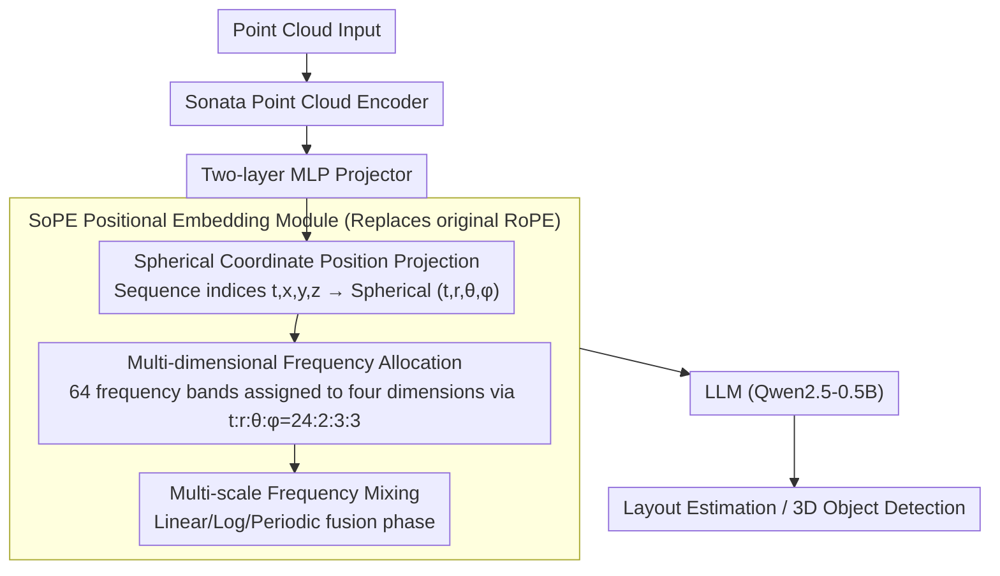

# SoPE: Spherical Coordinate-Based Positional Embedding for Enhancing Spatial Perception of 3D LVLMs

**Conference**: CVPR2026  
**arXiv**: [2602.22716](https://arxiv.org/abs/2602.22716)  
**Code**: None  
**Area**: 3D Vision / 3D Scene Understanding  
**Keywords**: positional embedding, 3D LVLM, spherical coordinates, RoPE, point cloud, spatial perception

## TL;DR

Proposes Spherical Coordinate-Based Positional Embedding (SoPE), which remaps point cloud tokens from 1D sequence indices to a spherical coordinate space $(t,r,\theta,\phi)$. Combined with multi-dimensional frequency allocation and multi-scale frequency mixing strategies, it significantly enhances the spatial perception capabilities of 3D Large Vision-Language Models.

## Background & Motivation

Current 3D Large Vision-Language Models (3D LVLMs) widely adopt Rotary Positional Embedding (RoPE) inherited from LLMs to model positional relationships between tokens. However, RoPE exhibits two fundamental flaws in 3D scenarios:

**Loss of 3D spatial structure**: RoPE flattens point cloud tokens into a 1D sequence based on raster scan order, assigning indices according to sequence positions. This approach completely ignores the true 3D spatial locations of point cloud tokens, leading to spatially adjacent tokens being assigned non-adjacent position indices, which destroys 3D neighborhood continuity.

**Missing directional awareness**: The relative distance calculation in RoPE, $\Delta t = t_1 - t_2$, only captures temporal changes in the sequence and cannot perceive differences in angles and directions between tokens. Consequently, the model is indifferent to directional changes that are critical for visual representation.

The authors identified "spatial perception bias" through attention visualization: cross-modal attention focuses on a few hotspot regions, while many 3D tokens with significantly different positions and orientations receive nearly identical attention weights, effectively ignoring large areas of the scene. Small objects and structural boundaries in large indoor scenes are particularly prone to being suppressed.

While some work has extended RoPE to multi-modalities (e.g., variants for images/videos), they still treat position indices as sequence or grid coordinates and do not explicitly encode the 3D geometry of point cloud tokens. This core gap constitutes the design motivation for this paper.

## Method

### Overall Architecture

SoPE addresses the spatial perception flaws caused by 3D LVLMs directly adopting LLM's RoPE: RoPE flattens tokens into 1D sequences, losing 3D structure and directional perception. SoPE is a connector-level positional embedding module that replaces the original RoPE in SpatialLM in a plug-and-play manner. The overall architecture, SpatialSoPE, consists of a point cloud encoder (Sonata), a two-layer MLP projector, and an LLM (Qwen2.5-0.5B). SoPE is inserted between the projector and LLM to re-parameterize the positional embedding, featuring spherical coordinate position projection, multi-dimensional frequency allocation, and multi-scale frequency mixing.

### Key Designs

**1. Spherical Coordinate Position Projection: Replacing 1D sequence indices with geometry-aware 4D positions**

The relative distance in RoPE only calculates $\Delta t = t_1 - t_2$, capturing sequence temporality but failing to perceive angular and directional differences between tokens; spatially adjacent tokens are often assigned non-adjacent indices. SoPE remaps this in two steps: first, position index reassignment extracts the Cartesian coordinates $(x,y,z)$ of point cloud tokens while retaining the original sequence index $t$, resulting in $(t,x,y,z)$; second, spherical mapping converts Cartesian coordinates to radius $r = \sqrt{x^2+y^2+z^2}$ (encoding depth/distance), polar angle $\theta = \arccos(z/r)$ (elevation), and azimuthal angle $\phi = \text{atan2}(y,x)$ (horizontal orientation). The final position indices are $(t,r,\theta,\phi)$, and the relative positions expand into four components $(\Delta t, \Delta r, \Delta \theta, \Delta \phi)$. This allows the model to simultaneously capture spatial locations and directional changes, fundamentally addressing the shortfall of RoPE's reliance on 1D temporal indices.

**2. Multi-dimensional Frequency Allocation: Assigning frequency bands by importance**

The four components are not equivalent regarding the frequencies they should use: spherical components target fine-grained geometry, while the temporal component ensures long-range continuity. SoPE divides the $d/2=64$ frequency bands of RoPE proportionally among the four dimensions—spherical coordinates $(r,\theta,\phi)$ utilize high-frequency sub-bands (front-end) to capture fine-grained spatial and angular changes, while timing $t$ utilizes low-frequency sub-bands (back-end) to maintain long-range temporal dynamics. The final relative rotation matrix is obtained by summing the four rotation matrix parts. Through extensive ablation, the optimal ratio is determined as $t:r:\theta:\phi = 24:2:3:3$ (totaling 32 frequency band pairs); uniform allocation performed the worst.

**3. Multi-scale Frequency Mixing Strategy: Covering detail and global context via three coordinate transformations**

A single-scale positional embedding struggles to handle fine-grained geometry and large-scale architectural layouts simultaneously. SoPE constructs three complementary transformations for each coordinate component $u \in \{t,r,\theta,\phi\}$—linear scale $g^{\text{lin}}(u)$ for absolute positional accuracy, logarithmic compression scale $g^{\text{log}}(u)$ to emphasize local neighborhoods, and periodic scale $g^{\text{per}}(u)$ to capture global patterns and long-range dependencies. The final phase is an equal-weight fusion of the three: $\varphi_k(u) = \frac{1}{3}(\omega_k^{\text{lin}}g^{\text{lin}}(u) + \omega_k^{\text{log}}g^{\text{log}}(u) + \omega_k^{\text{per}}g^{\text{per}}(u))$. This maintains efficiency without introducing additional learnable parameters. Ablations indicate that multi-scale benefits spherical parameterization significantly more than RoPE-3D, demonstrating a synergistic effect.

### Loss & Training

Based on the SpatialLM framework, joint training is performed using the Sonata point cloud encoder. It uses single-stage training on four NVIDIA H20 GPUs, supporting both training from scratch and pre-training-fine-tuning configurations.

## Key Experimental Results

### Main Results: Layout Estimation (Structured3D)

| Method | IoU2D@0.25 ↑ | IoU2D@0.5 ↑ |
|------|-------------|------------|
| RoomFormer | 70.4 | 67.2 |
| SceneScript | 83.1 | 80.8 |
| SpatialLM (ft. SpatialLM→S3D) | 86.5 | 84.6 |
| **SpatialSoPE (ft. SpatialLM→S3D)** | **88.7** | **86.2** |

### Main Results: 3D Object Detection (ARKitScenes)

| Method | IoU3D@0.25 ↑ | IoU3D@0.5 ↑ |
|------|-------------|------------|
| VoteNet | 53.9 | 45.4 |
| H3DNet | 55.7 | 46.3 |
| NeRF-Det | 60.3 | 34.7 |
| UniDet3D | 62.8 | 48.3 |
| SpatialLM | 63.9 | 60.7 |
| **SpatialSoPE** | **66.1** | **63.2** |

### Comparison of Positional Embedding Schemes (ARKitScenes + SpatialLM Dataset)

| Method | ARKit@0.25 ↑ | ARKit@0.5 ↑ | SpatialLM@0.25 ↑ | SpatialLM@0.5 ↑ |
|------|-------------|------------|------------------|-----------------|
| SpatialLM (baseline) | 63.9 | 60.7 | 69.7 | 62.0 |
| +MCA | 63.7 | 60.2 | 70.1 | 61.6 |
| +CCA | 64.1 | 60.5 | 69.8 | 62.5 |
| +RoPE-3D | 64.2 | 61.4 | 69.7 | 62.4 |
| **SpatialSoPE** | **66.1** | **63.2** | **71.4** | **63.4** |

### Ablation Study: Frequency Allocation Ratio (ARKitScenes)

| Configuration | $t:r:\theta:\phi$ | IoU3D@0.25 ↑ | IoU3D@0.5 ↑ |
|------|-------------------|-------------|------------|
| Angular-Biased | 8:6:9:9 | 65.5 | 62.7 |
| Uniform | 1:1:1:1 | 63.0 | 59.0 |
| Temporal-Biased | 5:1:1:1 | 65.0 | 62.7 |
| **SpatialSoPE** | **24:2:3:3** | **66.1** | **63.2** |

### Ablation Study: Effect of Multi-scale Frequency Mixing

| Method | Multi-scale | ARKit@0.25 | ARKit@0.5 | SpatialLM@0.25 | SpatialLM@0.5 |
|------|--------|-----------|----------|----------------|---------------|
| RoPE-3D | ✗ | 64.2 | 61.7 | 69.4 | 62.3 |
| RoPE-3D | ✓ | 64.8 | 62.1 | 70.3 | 62.9 |
| SoPE | ✗ | 65.4 | 61.4 | 71.0 | 62.5 |
| **SoPE** | **✓** | **66.1** | **63.2** | **71.4** | **63.4** |

### Key Findings

1. SoPE consistently outperforms the SpatialLM baseline across all three benchmarks (ARKitScenes, SpatialLM Dataset, Structured3D), with layout estimation improving by +2.2/+1.6 and object detection increasing by +2.2/+2.5.
2. Compared with 2D projection schemes like CCA and MCA, direct 3D encoding (RoPE-3D) is already superior, and spherical coordinate encoding (SoPE) further widens the gap.
3. Frequency allocation ratios significantly impact performance: uniform allocation is the worst (IoU3D@0.5 at only 59.0), while the scheme emphasizing temporal 24 + spherical 8 is optimal.
4. The gain from multi-scale frequency mixing for SoPE is markedly higher than for RoPE-3D (+1.8 vs +0.4 in IoU@0.5), indicating a strong synergy between spherical parameterization and the multi-scale strategy.
5. Cross-modal attention visualization shows that SoPE produces a more balanced global attention pattern, effectively alleviating spatial perception bias.

## Highlights & Insights

1. **Precise Problem Positioning**: Approaching 3D LVLM performance through positional embedding targets an overlooked but fundamental issue. Revealing the "spatial perception bias" through attention flow visualization makes the motivation highly convincing.
2. **Spherical Coordinates as a Natural Choice**: Point cloud data inherently possesses directional and distance attributes. Compared to Cartesian coordinates, spherical coordinates $(r,\theta,\phi)$ naturally decouple distance and angular information, achieving better mathematical alignment with the rotation mechanism of RoPE.
3. **Plug-and-play Design**: As a drop-in replacement, SoPE does not change the model architecture or introduce learnable parameters, ensuring high practicality.
4. **Complete Engineering Validation**: Beyond benchmark experiments, end-to-end deployment was verified on a real robot system (point cloud reconstruction → scene understanding → navigation planning), demonstrating practical application potential.

## Limitations & Future Work

1. **Validation limited to Qwen2.5-0.5B**: Experiments only used 0.5B-scale LLMs; it remains unverified if the method is equally effective for larger models (7B/13B+), leaving scalability questions.
2. **Empirical Frequency Ratio Search**: The optimal ratio of 24:2:3:3 was determined via ablation without theoretical guidance. Could ratios be adaptively assigned based on data characteristics?
3. **Spherical Coordinate Origin Selection**: The paper uses the coordinate origin for calculation, but the origin location in different scenes may affect encoding, particularly in multi-room scenarios.
4. **Fixed Multi-scale Weights**: Equal weights for the three scales might not be ideal; different scenes or object sizes might require varying weights.
5. **Indoor Scene Focus**: Experiments were concentrated on indoor scenes (ARKitScenes, Structured3D); the effectiveness for large-scale outdoor scenes (e.g., autonomous driving) is unknown.

## Related Work & Insights

- **SpatialLM**: The foundational framework for this work, providing data, architecture, and training designs for 3D spatial reasoning.
- **RoPE Variants** (VideoRoPE, M-RoPE, ComRoPE, DRoPE): These extend RoPE in temporal or multi-view dimensions but do not specifically address point cloud geometry.
- **Circle-RoPE**: Uses conical projections to decouple cross-modal positional embedding; similar in concept but different in methodology.
- **Insight**: Spherical coordinate encoding could be generalized to other 3D tasks requiring directional awareness (e.g., 3D object tracking, scene flow estimation) and positional modeling in emerging representations like 3D Gaussian Splatting.

## Rating

- **Novelty**: ⭐⭐⭐⭐ — The approach of combining spherical coordinates and multi-scale frequency mixing to improve RoPE is novel and practical, though the core idea (using spatial coordinates instead of sequence indices) has precedents in 2D.
- **Experimental Thoroughness**: ⭐⭐⭐⭐ — Complete comparisons across multiple benchmarks and baselines with extensive ablations, though only a 0.5B model was used, lacking large-scale model validation.
- **Writing Quality**: ⭐⭐⭐⭐ — Deep motivation analysis, clear mathematical derivation, and convincing visualizations.
- **Value**: ⭐⭐⭐⭐ — High practicality as a drop-in replacement, offering direct reference value to the 3D LVLM community.

<!-- RELATED:START -->

## Related Papers

- [\[CVPR 2025\] SphereUFormer: A U-Shaped Transformer for Spherical 360 Perception](../../CVPR2025/3d_vision/sphereuformer_a_u-shaped_transformer_for_spherical_360_perception.md)
- [\[ICLR 2026\] Positional Encoding Field](../../ICLR2026/3d_vision/positional_encoding_field.md)
- [\[CVPR 2026\] 3D-Object Perception Transformer (3PT)](3d-object_perception_transformer_3pt.md)
- [\[CVPR 2026\] PE3R: Perception-Efficient 3D Reconstruction](pe3r_perception-efficient_3d_reconstruction.md)
- [\[CVPR 2026\] DMAligner: Enhancing Image Alignment via Diffusion Model Based View Synthesis](dmaligner_enhancing_image_alignment_via_diffusion_model_based_view_synthesis.md)

<!-- RELATED:END -->
