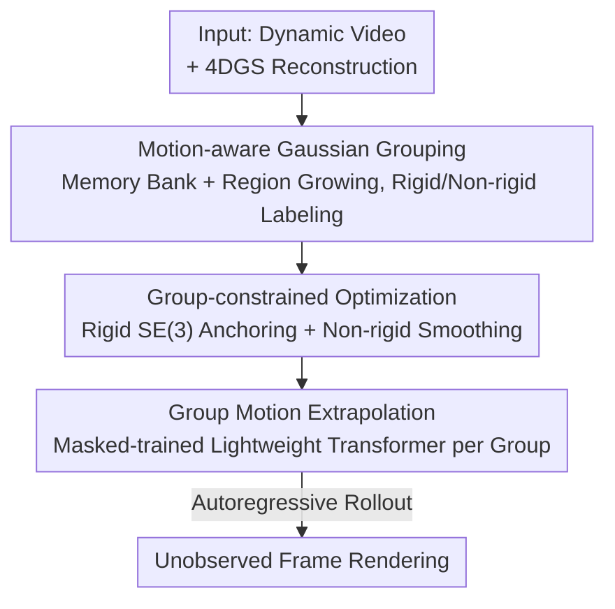

# Space-Time Forecasting of Dynamic Scenes with Motion-aware Gaussian Grouping

**Conference**: CVPR 2026  
**Paper**: [CVF Open Access](https://openaccess.thecvf.com/content/CVPR2026/html/Lee_Space-Time_Forecasting_of_Dynamic_Scenes_with_Motion-aware_Gaussian_Grouping_CVPR_2026_paper.html)  
**Code**: None  
**Area**: 3D Vision  
**Keywords**: 4D Gaussian Splatting, Dynamic Scene Prediction, Motion Grouping, Long-term Extrapolation, Rigid/Non-rigid Constraints

## TL;DR
MoGaF advances 4D Gaussian Splatting from "interpolation of observed frames" to physically consistent long-term scene forecasting. It accomplishes this by grouping Gaussians into object-level units labeled as rigid or non-rigid, applying typed motion constraints during optimization, and utilizing a lightweight Transformer per group for autoregressive motion extrapolation.

## Background & Motivation

**Background**: 3D/4D Gaussian Splatting enables the reconstruction of dynamic scenes from handheld videos, allowing for high-fidelity real-time rendering. However, most existing methods focus solely on **interpolation**—reconstructing motion within the observed time window and rendering intermediate states between training frames.

**Limitations of Prior Work**: Practical applications such as robotic decision-making and autonomous driving require **forecasting** (extrapolation) to predict unobserved future movements. Current approaches are inadequate: 2D video prediction methods are limited to fixed viewpoints and suffer from geometric inconsistency in complex scenes; 3D reconstruction methods are inherently interpolative, causing motion trajectories to either "freeze" or "collapse" when extended beyond the training range. The closest work, GaussianPrediction (GSPred), incorporates explicit motion modeling but still struggles with long-term prediction, showing significant degradation.

**Key Challenge**: The failure of long-term prediction stems from two root causes. At the **representation level**, Gaussians move independently, lacking object-level constraints, which leads to spatially incoherent motion and cumulative drift. At the **architecture level**, most predictors are short-term models that produce frozen or collapsed trajectories during long rollouts.

**Goal**: To achieve scene-level, physically consistent long-term extrapolation on 4DGS, maintaining the global structure of rigid bodies while ensuring smooth and coherent local deformation for non-rigid bodies.

**Key Insight**: The authors observe that Gaussians in a dynamic scene should not be treated as independent particles but should be clustered into object-level groups based on consistent motion patterns. Sharing motion laws within a group stabilizes extrapolation. Thus, they formulate a "grouping-constraint-prediction" pipeline.

**Core Idea**: Use **motion-aware Gaussian grouping** to decompose the scene into rigid and non-rigid object groups, apply **typed motion constraints** per group to obtain a structured 4D representation, and then **extrapolate future motion independently per group** using lightweight predictors.

## Method

### Overall Architecture
MoGaF takes a dynamic video $\{I_t\}_{t=1}^{T}$ as input with the goal of rendering new frames at unobserved timestamps ($t>T$). Built upon the 4DGS representation (where each Gaussian has canonical parameters $\{\mu, R, s, o, c\}$ and motion is represented by a weighted mixture of $B$ shared motion bases $\{T^{(b)}_{c\to t}\}$), the pipeline consists of three serial stages: **grouping Gaussians by motion** and labeling them as rigid/non-rigid, performing **group-based constrained optimization** to yield a physically structured 4D representation, and finally **training a lightweight predictor per group** for autoregressive extrapolation and rendering. These stages progress logically—grouping provides object-level units for optimization and prediction, optimization ensures clean and consistent intra-group motion, and prediction stably extends motion beyond the observation window.

### Key Designs

**1. Motion-aware Gaussian Grouping: Clustering Gaussians into Rigid/Non-rigid Object Groups**

Addressing the "representation level" issue where independent Gaussian movement causes drift, MoGaF adopts the memory bank concept from the static grouping method Gaga but extends it to handle dynamic representations and explicit motion types. Each group is denoted as $M^{(k)}=(G^{(k)}, \tau^{(k)})$, where $\tau^{(k)}\in\{0,1\}$ labels it as non-rigid (0) or rigid (1). The process begins by using a grounded segmentation model on the video to generate $K$ object masks and rigidity labels, identifying the foremost Gaussians along the line of sight for each mask as reliable seeds.

The authors found that simple projection-based grouping (assigning Gaussians to group $G^{(k)}_t=\{g\in\mathcal{G}\mid \text{Proj}(g_t)\in M^{(k)}_t\}$) leads to frequent mis-grouping due to occlusions or overlapping Gaussians. Consequently, they utilize **iterative region growing**: each Gaussian is represented by a compact spatial-temporal feature $f_g=[\mu_{c,g}, w'_g]$ (canonical mean + PCA-reduced motion coefficients). The process alternates between "forward Gaussian seeding" and "feature space expansion" across keyframes—merging neighboring Gaussians that satisfy $|f_g-f_{g'}|<\epsilon_r$, where the adaptive threshold is $\alpha$ times the mean KNN distance within the group. This cycle captures both spatial location and motion similarity, resulting in more reliable object-level groups than single-frame mask growing.

**2. Group-constrained Optimization: Rigid SE(3) Sharing and Non-rigid Local Smoothing**

After grouping, **typed** motion regularization is applied based on the rigidity label $\tau^{(k)}$, which is critical for reducing drift and improving temporal consistency. For rigid groups ($\tau^{(k)}=1$), all Gaussians in the group are forced to share a single SE(3) transformation $\Phi^{(k)}_{t}=[R^{(k)}_{c\to t}\mid t^{(k)}_{c\to t}]$, mapping the canonical mean to time $t$: $\Phi^{(k)}_t(g)=R^{(k)}_{c\to t}\mu_{c,g}+t^{(k)}_{c\to t}$. The rigid anchoring loss measures the deviation of learned motion from this group-level rigid transform:

$$\mathcal{L}^{(k)}_{\text{rigid}}=\sum_t\sum_{g\in G^{(k)}}\big\|\mu_{t,g}-\Phi^{(k)}_t(g)\big\|_2^2$$

For non-rigid groups ($\tau^{(k)}=0$), each Gaussian has learnable motion coefficients $w_g\in\mathbb{R}^B$, and a spatial smoothness regularization is applied to ensure consistency among neighbors: $\mathcal{L}^{(k)}_{\text{nr}}=\sum_{g\in G^{(k)}}\sum_{g'\in\text{NN}(g)}\|w_g-w_{g'}\|_2^2$. The total motion objective is a weighted sum based on the rigidity flag: $\mathcal{L}_{\text{motion}}=\sum_k[\tau^{(k)}\mathcal{L}^{(k)}_{\text{rigid}}+(1-\tau^{(k)})\mathcal{L}^{(k)}_{\text{nr}}]$. This ensures rigid bodies maintain global structure while non-rigid bodies remain locally smooth.

**3. Group Masked Extrapolation: A Lightweight Transformer per Group with Masked Training**

This design directly addresses the "architecture level" short-term degradation. The motion of each Gaussian at time $t$ is represented by the SE(3) transform $T_{t,g}=[R_{t,g}\mid\mu_{t,g}]$. The predictor takes the optimized sequence $\{T_{t,g}\}_{t=0}^{T}$ and autoregressively generates subsequent frames using the most recent $T-1$ frames. The predictor is a **very shallow** Transformer encoder (one layer, 8 heads, 32-dim embedding, 64-dim FFN). Two keys: first, **a separate predictor is trained for each motion group**, decoupling heterogeneous movements of different objects and ensuring consistent temporal patterns within a group; second, inspired by Masked Language Modeling (MLM), **segment-level masked training** is introduced. By masking continuous temporal segments, the model is forced to infer dynamics from context. The masking ratio is annealed during training to improve long-term robustness. The training objective includes a motion reconstruction loss $\mathcal{L}^{(k)}_{\text{pred}}$ and an acceleration regularization $\mathcal{L}^{(k)}_{\text{acc}}=\frac{1}{|G^{(k)}|}\sum_g\|\hat\mu_{T,g}-2\mu_{T-1,g}+\mu_{T-2,g}\|_2^2$ to ensure physical smoothness: $\mathcal{L}^{(k)}_{\text{group}}=\mathcal{L}^{(k)}_{\text{pred}}+\lambda_{\text{acc}}\mathcal{L}^{(k)}_{\text{acc}}$.

### Loss & Training
The reconstruction backbone uses Shape-of-Motion (SoM) for canonical space and motion parameterization. Grouping leverages a refined version of the Gaga implementation. During the optimization phase, $\mathcal{L}_{\text{motion}}$ constrains rigid and non-rigid behaviors. In the prediction phase, each group is trained independently using $\mathcal{L}^{(k)}_{\text{group}}$. Evaluation is performed across two observation ratios: 80% (extrapolating the remaining 20%) and a more challenging 60% (extrapolating 40%).

## Key Experimental Results

### Main Results

Average results on the iPhone dataset (80% observation, 20% extrapolation; ⚠️ GSPred-SoM† / ODE-GS-SoM† denote baselines reproduced on SoM-4DGS):

| Method | mPSNR↑ | mSSIM↑ | mLPIPS↓ |
|------|--------|--------|---------|
| GSPred | 13.76 | 0.4699 | 0.4757 |
| GSPred-SoM† | 14.99 | 0.6405 | 0.4482 |
| ODE-GS-SoM† | 14.66 | 0.6355 | 0.4597 |
| **Ours** | **15.58** | 0.6395 | **0.4227** |

Average results on the D-NeRF synthetic dataset (60% observation, 40% extrapolation). Ours outperforms GSPred in most scenes, with a significant gain in the Lego scene where GSPred largely fails:

| Method | PSNR↑ | SSIM↑ | LPIPS↓ | Lego PSNR↑ |
|------|-------|-------|--------|------------|
| GSPred | 21.78 | 0.9011 | 0.0919 | 12.65 |
| **Ours** | **23.37** | **0.9147** | **0.0746** | **21.61** |

### Ablation Study

| Config | 3D-EPE↓ | δ.10 3D↑ | 2D-AJ↑ | OA↑ | Description |
|------|---------|----------|--------|-----|------|
| w/o Grouping | 0.296 | 35.6 | 17.1 | 64.1 | No group optimization/prediction; single predictor for all Gaussians |
| **MoGaF** | **0.236** | **44.8** | **22.5** | **80.1** | Full model |

| Config | PSNR↑ | SSIM↑ | LPIPS↓ | Description |
|------|-------|-------|--------|------|
| w/o Masking | 24.68 | 0.9283 | 0.0551 | Predictor trained without temporal masking |
| **Ours** | **25.87** | **0.9357** | **0.0491** | Segment-level masked training |

### Key Findings
- **Grouping is the Foundation**: Removing grouping caused 3D tracking EPE to degrade from 0.236 to 0.296 and Occlusion Accuracy (OA) to drop from 80.1 to 64.1, proving that object-level structure is vital for physically consistent and temporally coherent long-term prediction.
- **Masked Training Stabilizes Long Horizons**: Shallow Transformers tend to overfit on fully observed sequences. Segment-level masking forces the model to focus on latent motion cues, improving PSNR by +1.19 and significantly reducing LPIPS.
- **Greater Advantage over Longer Horizons**: Under the 60% observation setting, MoGaF's lead over GSPred is more pronounced than at 80%, directly addressing the weakness of baselines in preventing long-term trajectory collapse.

## Highlights & Insights
- **Extending Grouping to 4D with Physical Semantics**: While Gaga's memory bank was originally a static 3DGS segmentation tool, MoGaF extends it to 4DGS using spatial-temporal features $[\mu_c, w']$ and integrates rigid/non-rigid labels. This coupling of grouping with downstream motion constraints is highly effective.
- **Typed Motion Constraints**: By enforcing shared SE(3) for rigid bodies and local smoothing for non-rigid bodies through a unified $\tau^{(k)}$ switch, the model effectively encodes "hard where it should be, soft where it should be" into the optimization.
- **Transferring MLM to Motion Forecasting**: Adapting Masked Language Modeling for segment-level masking of motion sequences is a transferable trick that suppresses overfitting and enhances long-horizon robustness in any autoregressive trajectory prediction task.

## Limitations & Future Work
- **Heavy Dependency on Upstream Quality**: Grouping relies on grounded segmentation masks and SoM reconstruction; errors in these stages propagate to optimization and prediction.
- **Coarse Rigidity Binary**: Real-world objects are often articulated (partially rigid + joints). A binary 0/1 label cannot fully capture these dynamics, and the paper does not extensively address articulated bodies.
- **Scalability of Independent Predictors**: Training many lightweight predictors when the group count is high may be inefficient. Furthermore, group interactions (e.g., collisions or contact) are not explicitly modeled, which may limit performance in complex multi-object scenes.
- **Limited Evaluation Scale**: Validation is primarily on iPhone and D-NeRF datasets, lacking large-scale street scenes or autonomous driving scenarios mentioned in the motivation.

## Related Work & Insights
- **vs GSPred [50]**: GSPred uses graph networks to predict keypoint motion which is then propagated; it is a short-term predictor and often "freezes" objects in long rollouts. MoGaF uses object-level grouping and masked extrapolation to maintain high-fidelity geometry over long horizons.
- **vs ODE-GS [36] (Concurrent Work)**: ODE-GS models continuous Gaussian motion via Neural ODEs. MoGaF utilizes a discrete grouping and masked Transformer approach, achieving better mPSNR/mLPIPS on real iPhone data.
- **vs Gaga [26]**: Gaga is designed for static 3DGS segmentation. MoGaF adapts it to 4DGS through temporal region growing and keyframe registration to obtain temporally consistent motion groups.

## Rating
- Novelty: ⭐⭐⭐⭐ Composes dynamic grouping, typed constraints, and group masked extrapolation into the first unified pipeline for long-term forecasting.
- Experimental Thoroughness: ⭐⭐⭐⭐ Validated on real and synthetic datasets with two observation ratios; good ablation on tracking metrics and masking. However, lacks large-scale driving baselines.
- Writing Quality: ⭐⭐⭐⭐ Clear mapping between the three-stage motivation and method; comprehensive formulas and algorithms.
- Value: ⭐⭐⭐⭐ Shifts dynamic 3D reconstruction from interpolation to extrapolation, with significant implications for robotic and autonomous driving motion anticipation.

<!-- RELATED:START -->

## Related Papers

- [\[CVPR 2026\] Efficiently Reconstructing Dynamic Scenes One D4RT at a Time](efficiently_reconstructing_dynamic_scenes_one_d4rt_at_a_time.md)
- [\[CVPR 2026\] MoRGS: Efficient Per-Gaussian Motion Reasoning for Streamable Dynamic 3D Scenes](morgs_efficient_per-gaussian_motion_reasoning_for_streamable_dynamic_3d_scenes.md)
- [\[CVPR 2026\] MotionScale: Reconstructing Appearance, Geometry, and Motion of Dynamic Scenes with Scalable 4D Gaussian Splatting](motionscale_reconstructing_appearance_geometry_and_motion_of_dynamic_scenes_with.md)
- [\[CVPR 2026\] Point4Cast: Streaming Dynamic Scene Reconstruction and Forecasting](point4cast_streaming_dynamic_scene_reconstruction_and_forecasting.md)
- [\[CVPR 2026\] SpeeDe3DGS: Speedy Deformable 3D Gaussian Splatting with Temporal Pruning and Motion Grouping](speede3dgs_speedy_deformable_3d_gaussian_splatting_with_temporal_pruning_and_mot.md)

<!-- RELATED:END -->
