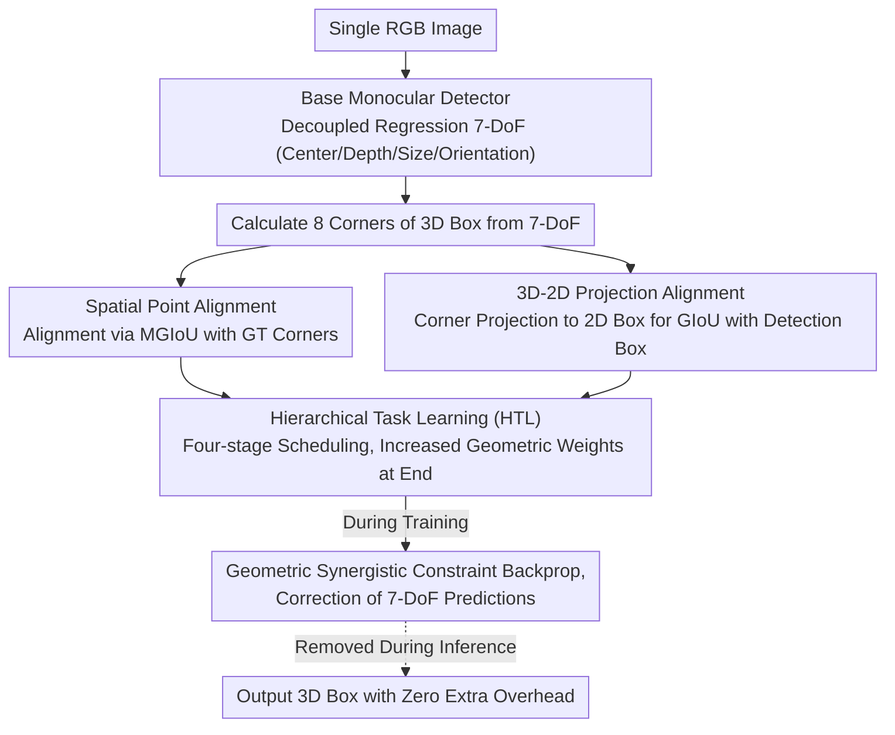

# SPAN: Spatial-Projection Alignment for Monocular 3D Object Detection

**Conference**: CVPR2026  
**arXiv**: [2511.06702](https://arxiv.org/abs/2511.06702)  
**Code**: [Project Homepage](https://wyfdut.github.io/SPAN/)  
**Area**: 3D Vision  
**Keywords**: Monocular 3D detection, geometric consistency, spatial alignment, projection constraints, plug-and-play

## TL;DR

Proposes Spatial-Projection Alignment (SPAN), which utilizes two geometric synergistic constraints—3D corner spatial alignment and 3D-2D projection alignment—combined with a hierarchical task learning strategy. It serves as a plug-and-play module to improve the localization accuracy of arbitrary monocular 3D detectors.

## Background & Motivation

1. **Core challenge of monocular 3D detection**: Inferring complete 3D spatial information from a single RGB image is an ill-posed problem due to the lack of direct depth cues. However, its low cost and flexible deployment make it a vital direction for autonomous driving and robotic perception.
2. **Limitations of decoupled regression paradigms**: Existing methods split the 7 degrees of freedom (7-DoF) of the 3D box (center coordinates, depth, dimensions, rotation angle) into different branches for independent prediction. While this simplifies the learning objective, it ignores the geometric synergistic constraints between attributes.
3. **Lack of geometric consistency**: Independent attribute prediction often violates inherent spatial constraints, resulting in predicted 3D boxes that do not align perfectly with the ground truth in space, thus reducing localization accuracy.
4. **Deficiencies of existing geometric constraint methods**: Methods like Deep3DBox solve for depth using overdetermined equations, making them extremely sensitive to minor 2D box perturbations; Homography Loss lacks fine-grained correction; and data augmentation schemes like 3D Copy-Paste do not rigorously verify 3D-2D projection consistency.
5. **Limitations of MonoDGP**: Although it introduces a geometric error prior to correct depth bias, it still regresses attributes independently and lacks a unified consistency constraint.
6. **Training stability issues**: Directly applying high-order geometric constraints early in training leads to instability due to high initial prediction noise, necessitating a proper scheduling strategy.

## Method

### Overall Architecture

The mainstream approach in monocular 3D detection decouples the 7-DoF of a 3D box into separate branches for regression. This simplifies learning but loses geometric constraints—while each branch is "optimal" individually, their combination may not form a cube aligned with the ground truth. SPAN does not modify the detector architecture; instead, it supplements the original branches with two geometric synergistic constraints during training: spatial point alignment in 3D space and projection alignment in the 2D image. These are weighted dynamically using Hierarchical Task Learning (HTL) according to the training progress, ensuring they only take full effect after 3D predictions become sufficiently stable. All constraints are removed during inference, resulting in zero extra overhead.

### Key Designs

**1. Spatial Point Alignment: Direct corner alignment instead of individual parameter regression**

The root issue of decoupled regression is that center, depth, size, and orientation are handled independently, with none responsible for whether the "eight corners fall on the ground truth." Spatial point alignment applies constraints directly to the corners: 8 corners $\{P_i\}_{i=1}^{8}$ are calculated from the predicted 7-DoF parameters and aligned with ground truth corners using MGIoU (Marginalized GIoU). MGIoU decomposes the alignment into 1D GIoUs along the three facial normal vectors $\mathbf{a}_k$ instead of computing precise intersections of arbitrarily oriented 3D boxes. The loss is defined as $\mathcal{L}_{3Dcorner} = (1 - \text{MGIoU}^{3D}) / 2$. Unlike ROI-10D/MonoDIS which treat corner regression as an auxiliary task, this directly constrains the 7-DoF parameters of the main branch.

**2. 3D-2D Projection Alignment: Constraining depth using physical perspective projection**

Small errors in depth estimation cause the 3D box projection to misalign with the 2D bounding box, which represents the most reliable supervision in the image. Projection alignment treats this physical fact as a loss: the 8 predicted 3D corners are projected onto the image plane via $u_i = f_u \cdot x_i / z_i + c_u$ to find the minimal horizontal bounding box $\mathcal{B}_{proj}^{2D}$. The 2D GIoU between this and the ground truth 2D box $\mathcal{B}_{gt}^{2D}$ forms the loss $\mathcal{L}_{proj} = 1 - \text{GIoU}^{2D}$. This is essentially a differentiable version of the "2D box back-calculates 3D" constraint from Deep3DBox, providing stability without increasing inference complexity.

**3. Hierarchical Task Learning (HTL): Applying geometric constraints only when effective**

A counter-intuitive phenomenon observed in ablations is that applying geometric constraints without HTL can degrade performance. This is because high 3D prediction noise in early training stages leads to erroneous corner and projection calculations. HTL splits training into four stages, unlocking tasks based on dependencies and increasing the weight of geometric alignment only after 3D attribute regressions have stabilized:

| Stage | Task | Description |
|------|------|------|
| Stage 1 | 2D Detection | Classification, 2D box localization, projection center regression |
| Stage 2 | 3D Size and Orientation | Initialized based on Stage 1 2D cues |
| Stage 3 | Depth Estimation | Based on geometric relationships from Stage 1+2 |
| Stage 4 | Spatial-Projection Alignment | Applied after all 3D attributes have stabilized |

### Loss & Training

The total loss consists of four parts: 2D regression loss $\mathcal{L}_{2D}$, 3D regression loss $\mathcal{L}_{3D}$, depth map loss $\mathcal{L}_{dmap}$, and the two geometric synergistic constraints mentioned above, with constraint weights set to $\lambda_c = \lambda_p = 1.0$.

## Key Experimental Results

### Main Results on KITTI Car Category

On the KITTI test set (based on MonoDGP baseline):

| Method | Easy | Mod. | Hard |
|------|------|------|------|
| MonoDGP | 26.35 | 18.72 | 15.97 |
| MonoDGP + SPAN | **27.02** | **19.30** | **16.49** |
| Gain | +0.67 | +0.58 | +0.52 |

On the KITTI validation set:

| Method | Easy | Mod. | Hard |
|------|------|------|------|
| MonoDGP | 30.76 | 22.34 | 19.02 |
| MonoDGP + SPAN | **30.98** | **23.26** | **20.17** |
| Gain | +0.22 | +0.92 | +1.15 |

### Multi-baseline Verification (KITTI val, Car $AP_{3D}$)

| Baseline | Mod. Gain | Hard Gain |
|----------|----------|----------|
| MonoDETR + SPAN | +0.61 | +0.70 |
| MoVis + SPAN | +0.67 | +0.82 |
| MonoDGP + SPAN | +0.92 | +1.15 |

### Ablation Study

| $\mathcal{L}_{3Dcorner}$ | $\mathcal{L}_{proj}$ | HTL | Mod. |
|---|---|---|---|
| ✗ | ✗ | ✗ | 22.34 |
| ✓ | ✗ | ✗ | 21.92 (Drop) |
| ✗ | ✓ | ✗ | 21.80 (Drop) |
| ✗ | ✗ | ✓ | 22.56 |
| ✓ | ✓ | ✓ | **23.26** |

**Key Findings**: Using either geometric constraint alone without HTL reduces performance, verifying the necessity of the hierarchical training strategy.

## Highlights & Insights

1. **Plug-and-play**: Requires no changes to detector architecture and adds no inference overhead, allowing direct integration into the training pipeline of any monocular 3D detector.
2. **Geometric Synergy**: The first to jointly optimize spatial alignment and projection alignment in a unified framework, addressing the core deficiency of the decoupled regression paradigm.
3. **Clever use of MGIoU**: Decomposes 3D box alignment into three 1D projection problems, avoiding the high complexity of calculating exact intersections of rotated 3D boxes.
4. **Necessity of HTL strategy**: Experiments demonstrate that geometric constraints require phased training to be effective; direct application is harmful.
5. **Significant Gain on Hard Level**: The largest improvements occur on difficult samples (distant, heavily occluded), suggesting that geometric constraints are most effective for scenarios with depth ambiguity and localization difficulty.

## Limitations & Future Work

1. **Sensitive to 2D detection noise**: Performance drops sharply when 2D box perturbation exceeds 15px, making the 2D detector quality a bottleneck in deployment.
2. **Primary validation on KITTI**: While the appendix includes Waymo results, the main experiments are limited to KITTI, which has restricted data scale and scene diversity.
3. **Occasional drop in BEV metrics**: Mod./Hard BEV metrics on the test set showed slight decreases (-0.40/-0.23), indicating potential conflict between spatial alignment and BEV projection.
4. **Consideration of yaw angle only**: Assumes objects only rotate around the Y-axis, limiting applicability to non-flat roads or tilted objects.
5. **Increased training cost**: The HTL phased strategy increases the complexity of hyperparameter tuning, requiring additional effort to determine stage transition timings.
6. **Not yet extended to multi-view**: The authors mention future work extending the method to multi-view 3D perception, as it is currently limited to monocular scenarios.

## Related Work & Insights

| Method | Constraint Type | Limitation |
|------|---------|------|
| Deep3DBox | 2D→3D projection equation solving | Extremely sensitive to 2D box noise |
| Homography Loss | Global homography constraint | Lacks fine-grained correction |
| ROI-10D / MonoDIS | Corner regression as auxiliary task | Does not directly constrain main branch parameters |
| MonoDGP | Geometric error correction via depth formula | Still regresses attributes independently |
| **SPAN** | **Joint spatial + projection constraint** | **Unified framework, plug-and-play** |

## Rating

- Novelty: ⭐⭐⭐ — The core idea of spatial and projection alignment is intuitive; MGIoU and HTL leverage existing concepts, with the novelty lying in their combination.
- Experimental Thoroughness: ⭐⭐⭐⭐ — Includes verification across three baselines, complete ablations, noise robustness analysis, and evaluation on pedestrian/cyclist categories.
- Writing Quality: ⭐⭐⭐⭐ — Motivation is clear, mathematical derivations are complete, and charts are intuitive.
- Value: ⭐⭐⭐⭐ — Strong practical utility as a plug-and-play module with meaningful implications for the monocular 3D detection field.

<!-- RELATED:START -->

## Related Papers

- [\[CVPR 2026\] Towards Intrinsic-Aware Monocular 3D Object Detection](towards_intrinsic-aware_monocular_3d_object_detection.md)
- [\[CVPR 2026\] Unleashing the Power of Chain-of-Prediction for Monocular 3D Object Detection](unleashing_the_power_of_chain-of-prediction_for_monocular_3d_object_detection.md)
- [\[CVPR 2026\] MonoSAOD: Monocular 3D Object Detection with Sparsely Annotated Label](monosaod_monocular_3d_object_detection_with_sparsely_annotated_label.md)
- [\[AAAI 2026\] MonoCLUE: Object-Aware Clustering Enhances Monocular 3D Object Detection](../../AAAI2026/3d_vision/monoclue_object-aware_clustering_enhances_monocular_3d_object_detection.md)
- [\[CVPR 2026\] RaGS: Unleashing 3D Gaussian Splatting from 4D Radar and Monocular Cue for 3D Object Detection](rags_unleashing_3d_gaussian_splatting_from_4d_radar_and_monocular_cue_for_3d_obj.md)

<!-- RELATED:END -->
