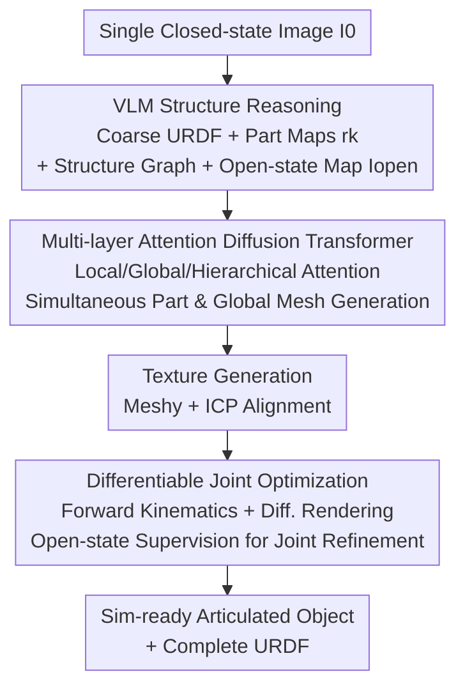

# SPARK: Sim-ready Part-level Articulated Reconstruction with VLM Knowledge

**Conference**: CVPR 2026  
**Paper**: [CVF Open Access](https://openaccess.thecvf.com/content/CVPR2026/html/He_SPARK_Sim-ready_Part-level_Articulated_Reconstruction_with_VLM_Knowledge_CVPR_2026_paper.html)  
**Code**: None (Project page only: https://heyumeng.com/SPARK-web/)  
**Area**: 3D Vision  
**Keywords**: Articulated Object Reconstruction, URDF Estimation, Diffusion Transformer, VLM Prior, Differentiable Forward Kinematics

## TL;DR
SPARK starts from a single RGB image, using a VLM to parse coarse URDF parameters, part-level reference images, and an open-state image. A Diffusion Transformer with multi-layer attention then simultaneously generates part-level and global meshes. Finally, differentiable forward kinematics optimize joint parameters, creating end-to-end "sim-ready" articulated objects compatible with physics engines, reducing various URDF errors by over 60% compared to previous methods.

## Background & Motivation
**Background**: Articulated objects (drawers, cabinet doors, laptops, and other assets with moving parts) are essential for embodied AI, robotic manipulation, and scene understanding. However, manually modeling part hierarchies and motion structures is extremely labor-intensive. Generative 3D models (TripoSG, TRELLIS, Hunyuan3D) can generate high-fidelity meshes directly from images, and part-level generation (PartCrafter, OmniPart, AutoPartGen) can segment semantic parts.

**Limitations of Prior Work**: Most meshes generated by existing models are "fused" single blocks, making them difficult to reuse for manipulation, animation, or simulation. While part-level generation offers good geometric quality, its segmentation is appearance-driven and completely ignores the underlying kinematic structure. This results in parts lacking **kinematic consistency**—often splitting a single kinematic chain into several pieces (over-segmentation) or merging two distinct parts into one (under-segmentation).

**Key Challenge**: Creating "sim-ready" articulated objects requires three things simultaneously: clean part-level geometry, globally consistent meshes, and accurate URDF kinematic parameters (joint type, axis, origin, and limits). Existing works either require templates, multi-view/multi-state images, or explicit kinematic graphs. **None can solve geometry and URDF together from a single image.** Purely data-driven end-to-end URDF prediction also suffers from inaccurate joint parameter estimation due to a lack of kinematic guidance.

**Goal**: Reconstruct kinematic part-level articulated objects and complete URDF parameters from only a single image.

**Key Insight**: VLMs understand both semantics (identifying drawers vs. doors) and structure (parent-child hierarchies), which compensates for kinematic structure information missing in appearance-based segmentation. Geometric details are handled by Diffusion Transformers specialized in shape generation, while joint numerical values are refined through differentiable optimization.

**Core Idea**: Use VLM priors (part maps, structure graphs, and open-state maps) to guide kinematic-aware part generation in a Diffusion Transformer, then refine joint parameters via differentiable forward kinematics under the supervision of the open-state map—dividing labor between "semantic structure reasoning" and "geometric/numerical generation."

## Method

### Overall Architecture
The input is a single closed-state image $I_0$, and the output is a global mesh $M$ composed of part-level meshes $\{M_k\}_{k=1}^{K}$, along with hierarchical URDF parameters $u=\{u_\ell, u_j\}$ (where $u_\ell$ represents link nodes and $u_j$ contains joint type $u_j^{type}$, axis $u_j^{axis}$, origin $u_j^{origin}$, and limit $u_j^{limit}$). The pipeline consists of three stages: first, VLM-based structure reasoning produces coarse URDF, part reference images, and an open-state image; second, a Diffusion Transformer with multi-layer attention synthesizes part and global meshes and generates textures; finally, differentiable forward kinematics refine joint parameters under open-state image supervision.

### Key Designs

**1. VLM-guided Structure Reasoning: Using Language Models to Supplement Hidden Kinematic Structures**

This step addresses the limitation where "part segmentation only follows appearance without kinematic awareness." SPARK uses a VLM (GPT-4o to extract part labels and joint metadata) to infer the part hierarchy—number of links, connections, and joint types—and instantiates a standard URDF template accordingly by declaring links $u_\ell$, parent-child relationships, and joint specifications $u_j$. The key is treating joint attributes as either **discrete** or **continuous**. Discrete attributes (type $u_j^{type}\in\{$fixed, revolute, prismatic$\}$ and axis $u_j^{axis}$) are selected from a predefined dictionary to ensure semantic and directional consistency. Axes are restricted to 6 canonical unit directions (front $(0,0,1)$, back $(0,0,-1)$, up, down, left, right). Prismatic joints correspond directly to translation directions, while revolute joints define the rotation axis followed by the sign (negative for clockwise, positive for counter-clockwise; e.g., a door opening left rotates clockwise around the $y$-axis $(0,-1,0)$). Limits for the lower bound are constant at 0, while upper bounds are preset based on large-scale (doors/drawers) or small-scale (buttons) motions. Continuous attributes (joint origin $u_j^{origin}$, limits) are roughly estimated as initial values by the VLM. After obtaining the coarse URDF, part-level reference images $\{r_k\}_{k=1}^{K}$ are generated based on semantic labels (drawer/door/frame), and a structure map is constructed according to parent-child relationships, serving as guidance for the subsequent generation stage. Constraining discrete attributes to a dictionary prevents unstable predictions common in direct numerical VLM outputs, providing a foundation for convergence in later optimization.

**2. Multi-layer Attention Diffusion Transformer: Simultaneous Generation of Kinematically Consistent Parts and Global Mesh**

This step injects the local, global, and structural guidance from the VLM into the geometric generation process. SPARK utilizes a Diffusion Transformer (DiT) inspired by TripoSG, where shared DINOv2 encodes local embeddings $E_k^{loc}$ for each part map $r_k$ and global embeddings $E^{glob}$ for the replicated global image $I_0$. The DiT contains learnable geometric latent tokens, where $N$ tokens for each of the $K$ parts are stacked as $Z=[Z_1;\dots;Z_K]\in\mathbb{R}^{NK\times C}$. During denoising, local and global cross-attention are alternated: local blocks allow each part to attend only to its own visual reference ($A_i^{local}=\text{softmax}(Z_iZ_i^\top/\sqrt{C})$), while global blocks inject full-object context ($A^{global}=\text{softmax}(ZZ^\top/\sqrt{C})$). The kinematic structure is explicitly represented via **Hierarchical Attention**: a parent index map $\pi$ defines the link hierarchy. Child tokens initially attend only to parent tokens:

$$A_{uv}^{c\to p}=\frac{\exp(Z_uZ_v^\top/\sqrt{C})\,\mathbb{1}[v\in P(u)]}{\sum_{v'}\exp(Z_uZ_{v'}^\top/\sqrt{C})\,\mathbb{1}[v'\in P(u)]},\quad Z'=Z+A^{c\to p}Z$$

The updated $Z'$ then allows parent tokens to attend back to child tokens ($Z''=Z'+A^{p\to c}Z$), forming a bi-directional exchange. Furthermore, double positional embeddings (learnable relative part index embeddings + absolute position embeddings) bind the latent sequence to semantic parts. During training, (part map, part mesh) pairs are randomly shuffled to enforce order-invariance of labels (e.g., "link 0 is always link 0"), preventing part misalignment during inference. This design allows the network to output part decomposition and global assembly simultaneously, where decomposition naturally carries kinematic semantics—distinguishing it from the "generate then cut" approach.

**3. Differentiable Joint Optimization: Aligning Joint Parameters to Physical Consistency via Open-state Maps**

Joint parameters roughly estimated by the VLM are often imprecise, and purely data-driven methods lack kinematic guidance. SPARK refines them through two paths. Discrete parameters (axis $u_j^{axis}$, type $u_j^{type}$) use a **feature injection** strategy, feeding the coarse URDF and input image back into the VLM for re-prediction. Continuous parameters (origin $u_j^{origin}$, rotation angle $\Delta\theta$) use differentiable optimization: let learnable parameters be $\xi=(\Delta t,\Delta\theta)$ (where $\Delta t\in\mathbb{R}^3$ is the joint origin in the parent frame, and $\Delta\theta$ is the rotation angle around the predefined axis). These define an $SO(3)$ rigid body rotation for the child link's local motion. Starting from the closed-state object $M^0$, differentiable forward kinematics $G(\cdot)$ calculate the transformed object $M^t=G(M^0,\Delta t,\Delta\theta)$. A soft silhouette $I^{sil}$ is obtained via a differentiable renderer under a fixed camera, which is aligned with the VLM-generated open-state reference map $I_{open}$:

$$\min_{\xi}\ L_{total}=L_{pixel}(I^{sil},I_{open})+L_{reg}(\xi)$$

Here, $L_{pixel}$ consists of a region loss $L_{region}=1-\frac{2\langle I^{sil},I_{open}\rangle}{\|I^{sil}\|+\|I_{open}\|}$ (emphasizing regional overlap) and an edge loss $L_{edge}=\||\nabla I^{sil}|-|\nabla I_{open}|\|$ (preserving boundary sharpness). The regularization term $L_{reg}=\lambda_t\|\Delta t\|_2^2+\lambda_\theta\|\Delta\theta\|_2^2$ prevents joint translation and rotation from deviating excessively from initial values. Using the open-state map as a supervision signal effectively simulates "opening the door to see" and back-calculates the most reasonable joint parameters—closing the loop between appearance evidence and geometric parameters.

### Loss & Training
Part generation is trained using Rectified Flow matching: a VAE encodes each ground truth part mesh into a latent $z_{k,0}$, with base latent $z_{k,1}\sim\mathcal{N}(0,I)$. A shared timestep $t$ is used for the entire object, with interpolation $x_k(t)=(1-t)z_{k,0}+tz_{k,1}$. The target velocity field is $U^\star=Z_0-Z_1$, with loss defined as $L_{RF}=\mathbb{E}[w(t)\sum_k\alpha_k\|v_\theta(x_k(t),C,t)-u_k^\star\|_2^2]$. Training data is based on PartNet-Mobility (2,347 objects, 46 classes). To address cases where assets represent only a single canonical state or are over-segmented, **over-segmented meshes are merged** based on URDF link associations, and multi-pose samples (e.g., half-open drawers) are generated for augmentation. Training was conducted on 4 H100s with a batch size of 48 and a learning rate of $1\times10^{-4}$ for 1,000 epochs, approximately 60 hours.

## Key Experimental Results

### Main Results
The test set consists of 100 images from GAPartNet across 25 categories. Shape reconstruction is measured by Chamfer Distance (CD) and F-Score; URDF estimation is measured by AxisErr, PivotErr, and TypeErr.

**Shape Reconstruction Comparison (Table 1)**:

| Method | CD↓ | F-Score@0.1↑ | F-Score@0.5↑ |
|------|------|------|------|
| PartCrafter | 0.4342 | 0.3600 | 0.8840 |
| OmniPart | 0.4971 | 0.1928 | 0.8469 |
| URDFormer | 1.0556 | 0.0438 | 0.1762 |
| **Ours (SPARK)** | **0.3915** | **0.4151** | **0.8959** |

While F-Score@0.5 is similar to PartCrafter/OmniPart, SPARK significantly leads in the strict F-Score@0.1 (0.4151 vs. 0.36), indicating better fine-grained geometric recovery.

**URDF Parameter Estimation Comparison (Table 2)**:

| Method | AxisErr↓ | PivotErr↓ | TypeErr↓ |
|------|------|------|------|
| Articulate-Anything | 0.5491 | 0.3529 | 0.2500 |
| Articulate AnyMesh | 1.1834 | 0.9162 | 0.7000 |
| **Ours (SPARK)** | **0.1577** | **0.1653** | **0.0500** |

All three error metrics are dramatically lower than the baselines, especially continuous parameters (axis, pivot) due to the differentiable optimization component.

### Ablation Study

**Shape Reconstruction Ablation (Table 3)**:

| Configuration | CD↓ | F-Score@0.1↑ | F-Score@0.5↑ | Note |
|------|------|------|------|------|
| w/o Part Guidance | 0.4284 | 0.3755 | 0.8725 | Without part guidance, doors may be missing |
| w/o Data Aug. | 0.4200 | 0.3675 | 0.8883 | Without augmentation, overfits to single state |
| **Full** | **0.3959** | **0.4214** | **0.8934** | Full model |

**URDF Estimation Ablation (Table 4)**:

| Configuration | AxisErr↓ | PivotErr↓ | TypeErr↓ | Note |
|------|------|------|------|------|
| w/o Joint Optimization | 0.3148 | 0.2388 | 0.2000 | Without optimization, moving parts drift |
| **Full** | **0.1577** | **0.1653** | **0.0500** | Full model |

### Key Findings
- The joint optimization component contributes most significantly: without it, AxisErr doubles from 0.1577 to 0.3148, and TypeErr rises from 0.05 to 0.20, showing clear joint axis and pivot drift—differentiable forward kinematics with open-state supervision is the key to URDF accuracy.
- Part guidance primarily affects geometric completeness: its absence leads to missing components like cabinet doors, proving VLM part maps provide strong structural priors.
- Data augmentation resolves overfitting to "single canonical states": without it, similar parts like two cabinet doors are confused.
- Baseline failure modes are instructive: PartCrafter often produces floating/disconnected parts; URDFormer's template retrieval misidentifies part types; OmniPart is sensitive to segmentation noise, leading to distortions in occluded regions; retrieval-based methods (Articulate-Anything/AnyMesh) often misjudge the side of a refrigerator as a door, leading to incorrect motion.

## Highlights & Insights
- **Divide-and-Conquer for Joint Parameters**: Discrete attributes are constrained to a 6-direction dictionary and type enumerations, while continuous attributes are handled via differentiable optimization—preventing VLM jitter while maintaining precision through gradient refinement.
- **Hierarchical Attention Embeds Kinematics into Geometry**: Bi-directional parent-child attention with parent index mapping allows the DiT to "know" which part is a child of another during generation, ensuring kinematic semantics are built-in rather than cut post-hoc.
- **Open-state Image Feedback Loop**: Generating an open-state map ("what it looks like when open") and using differentiable rendering to align the mesh ensures joint values are physically grounded—a much more robust approach than purely geometric heuristics.
- **Shuffled Training + Double Positional Embeddings**: Enforcing order invariance solves the hidden but critical engineering problem of part misalignment in multi-part generation.

## Limitations & Future Work
- Currently handles simple kinematics; future work is needed for multi-DOF joints, complex mechanisms, and closed-chain structures.
- Strong dependency on VLM (GPT-4o + Gemini 2.5 Flash) reasoning quality: if the VLM miscounts parts or misidentifies hierarchies, subsequent geometry and URDF will be incorrect. The process lacks a fallback mechanism for VLM errors. ⚠️ The paper provides no quantitative analysis of VLM reasoning failure rates.
- Training data is primarily synthetic (PartNet-Mobility); while in-the-wild results are shown, the model relies on the VLM to generate front views, and robustness to noisy or non-profile inputs is only demonstrated qualitatively.
- Texture generation relies on external commercial tools (Meshy + ICP), which is not end-to-end and is limited by third-party quality.
- The evaluation set is small (100 images, 25 classes) and heavily biased toward indoor furniture.

## Related Work & Insights
- **vs PartCrafter / OmniPart**: These use part latents or 2D boxes for simultaneous generation, but segmentation is purely appearance-driven. SPARK uses VLM structure maps and hierarchical attention to inject parent-child kinematics, resulting in kinematically consistent decomposition.
- **vs URDFormer / Articulate-Anything**: URDFormer relies on template retrieval and misidentifies types; Articulate-Anything uses program synthesis without geometric refinement, leading to high axis/pivot errors. SPARK reduces these errors by 60%+ through differentiable kinematics and open-state alignment.
- **vs Articulate AnyMesh / DreamArt**: These explicitly slice 3D representations using segmentation models, which are sensitive to segmentation quality and noise. SPARK generates parts and global structure once from the image, avoiding "cutting error propagation."
- **Inspiration**: Inherits the idea from Articulate-Anything / DreamArt of generating URDF code first but improves it by using a VLM template with differentiable kinematics and synthetic open/closed state pairs for refinement.

## Rating
- Novelty: ⭐⭐⭐⭐ Combines VLM structural priors, hierarchical attention DiT, and differentiable joint optimization into a novel end-to-end pipeline for single-image sim-ready reconstruction.
- Experimental Thoroughness: ⭐⭐⭐⭐ Dual-task comparison + comprehensive ablations + downstream robotics applications, though the evaluation set is small and lacks VLM failure analysis.
- Writing Quality: ⭐⭐⭐⭐ Clear sections and complete formulas; the discrete/continuous distinction is well-explained.
- Value: ⭐⭐⭐⭐⭐ High utility for producing simulation-ready assets for embodied AI and robotic manipulation data.

<!-- RELATED:START -->

## Related Papers

- [\[CVPR 2026\] ART: Articulated Reconstruction Transformer](art_articulated_reconstruction_transformer.md)
- [\[CVPR 2026\] Part$^{2}$GS: Part-aware Modeling of Articulated Objects using 3D Gaussian Splatting](part2gs_part-aware_modeling_of_articulated_objects_using_3d_gaussian_splatting.md)
- [\[CVPR 2026\] UniPR: Unified Object-level Real-to-Sim Perception and Reconstruction from a Single Stereo Pair](unipr_unified_object-level_real-to-sim_perception_and_reconstruction_from_a_sing.md)
- [\[ICLR 2026\] PD²GS: Part-Level Decoupling and Continuous Deformation of Articulated Objects via Gaussian Splatting](../../ICLR2026/3d_vision/pd2gs_part-level_decoupling_and_continuous_deformation_of_articulated_objects_vi.md)
- [\[CVPR 2026\] ArtPro: Self-Supervised Articulated Object Reconstruction with Adaptive Integration of Mobility Proposals](artpro_self-supervised_articulated_object_reconstruction_with_adaptive_integrati.md)

<!-- RELATED:END -->
