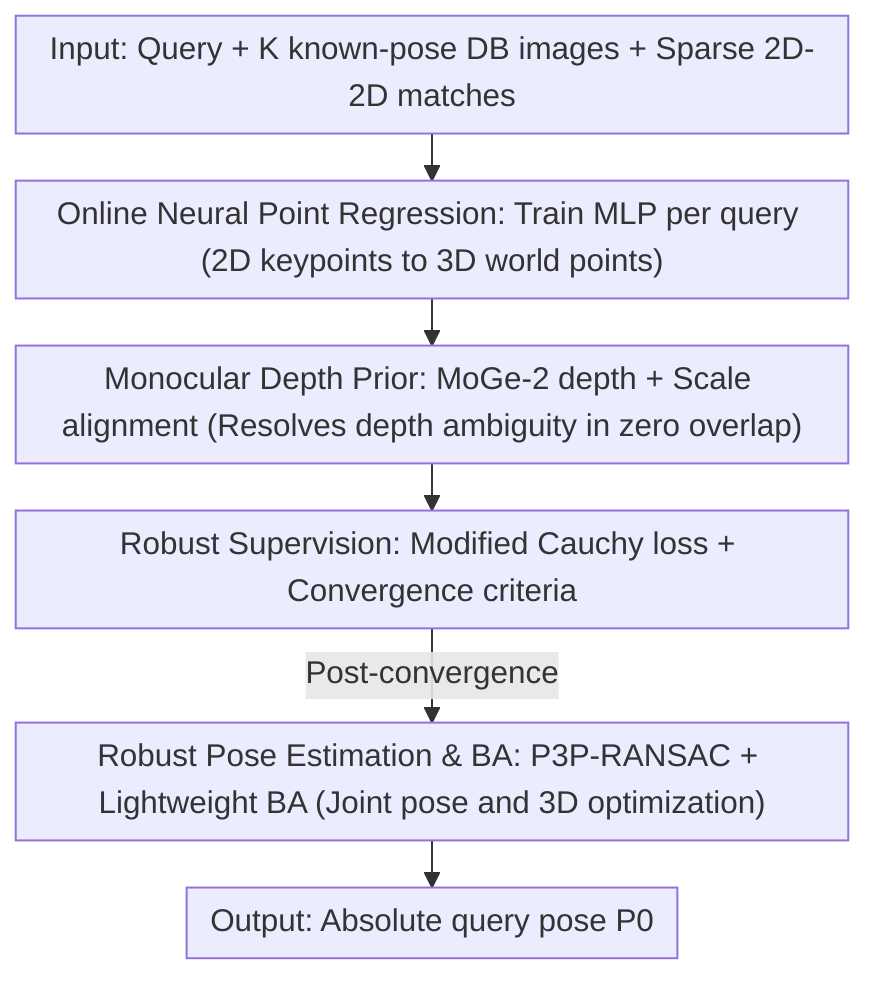

# Sparse-View Localization via Online Neural 3D Regression

**Conference**: CVPR 2026  
**Paper**: [CVF Open Access](https://openaccess.thecvf.com/content/CVPR2026/html/Dillen_Sparse-View_Localization_via_Online_Neural_3D_Regression_CVPR_2026_paper.html)  
**Code**: https://github.com/ludvigdillen/ON3R  
**Area**: 3D Vision  
**Keywords**: Camera Localization, Sparse-view, Structure-less Localization, Online Neural Regression, Monocular Depth Prior

## TL;DR
ON3R addresses extreme sparse-view localization scenarios where database images have minimal overlap (star-topology) and no pre-built 3D maps. It **temporarily trains a small MLP online** for each query image to regress query keypoints into 3D points (supervised by database reprojection residuals and monocular depth priors). Absolute poses are then estimated via P3P-RANSAC and lightweight BA. It outperforms existing structure-less methods and even exceeds structured HLOC on MegaDepth, Cambridge, and sparsified Aachen datasets.

## Background & Motivation
**Background**: Camera localization (estimating the 6-DoF pose of a query image) is mainly divided into two categories. **Structured methods** (e.g., HLOC) first reconstruct explicit 3D point clouds via SfM, then perform 2D-3D matching and P3P-RANSAC. These achieve high accuracy but require pre-built maps, high storage/engineering overhead, and complex maintenance. **Structure-less methods** (Pose Regression APR/RPR, motion averaging, transitive matching, etc.) do not require pre-built maps but generally suffer from low accuracy.

**Limitations of Prior Work**: Real-world scenarios often involve "sparse-view" setups—surveillance or factory cameras are sparsely deployed to save costs, or autonomous platforms retain few frames due to storage limits. In these cases, **visual overlap between database images is extremely low or zero**. The authors refer to this as a **star-topology**: the query image overlaps with each retrieved database image, but the database images do not overlap with each other. Structured methods fail here because triangulation is unreliable (3D points cannot be built), making them fragile; existing structure-less methods provide poses but lack sufficient accuracy.

**Key Challenge**: Under star-topology, multi-view triangulation constraints for 3D points are non-functional (no co-visibility between DB images), while pure end-to-end pose regression lacks explicit geometric constraints. The dilemma is to achieve "no dependence on co-visibility/pre-built maps" while maintaining "explicit geometric supervision."

**Goal**: Stable estimation of absolute query poses given $K\le 10$ low-overlap database images without pre-built 3D maps.

**Key Insight**: Even with limited database overlap, reasoning about query-database geometry **jointly** across all database images is beneficial. The **smoothness** of neural networks in input space acts as a "soft geometric prior," enabling relatively reasonable depth inference even under single-view constraints (similar to Scene Coordinate Regression (SCR), but while SCR smoothes across visually similar patches, ON3R smoothes across the spatial domain).

**Core Idea**: Instead of pre-building maps or performing fragile pose regression, ON3R **learns an MLP online for each query** to explicitly regress query keypoints to 3D world coordinates. It uses database reprojection residuals and monocular depth priors for explicit geometric supervision, followed by classical P3P-RANSAC and BA—treating the neural network as an "online, per-query, geometrically supervised implicit 3D representation."

## Method

### Overall Architecture
The input to ON3R is a query image and $K$ database images with **known poses/intrinsics** that have been sparsely matched (using only 2D-2D sparse matches, no visual feature vectors). The output is the 6-DoF absolute pose $P_0=[R_0|t_0]$. The pipeline involves a "train-from-scratch per query, then estimate pose" process: matched query keypoints are fed into a compact MLP to regress 3D world coordinates. Supervision comes from reprojection residuals (projecting predicted 3D points back to database images) and a monocular depth prior (to resolve depth scale in zero-overlap cases). The network is trained using a modified robust Cauchy loss until convergence. Finally, 2D-3D correspondences are passed to P3P-RANSAC for an initial pose, followed by lightweight bundle adjustment (BA) to jointly optimize the query pose and 3D points. Crucially, weights are **not shared across scenes**; the network is trained from zero for every query-database tuple.

### Key Designs

**1. Online Neural Point Regression: Lifting keypoints to 3D with per-query MLPs**

This core component addresses the triangulation failure in star-topologies. A network $N$ receives normalized 2D query keypoints $x_{i0} \in [0,1]$ (concatenated with fixed positional encodings $[\sin(2^f x),\cos(2^f x)]_{f=0}^{4}$), and outputs 3D world coordinates $X_i$, yielding 2D-3D correspondences $\{(x_{i0},X_i)\}$. The network is a 7-layer MLP **without visual features**, processing each keypoint independently and **training from scratch for each query**. Supervision is derived from reprojection: 3D points are projected to DB images as $x^N_{ij}=X_{ij}/d^N_{ij}$, where $X_{ij}=R_j X_i + t_j$ and $d^N_{ij}$ is the depth component. Residuals $r^c_{ij}=\lVert x^N_{ij}-K_j^{-1}(x_{ij},1)^T\rVert_2$ are calculated where matches exist (mask $m_{ij}=1$).

Depth inference under single-view constraints relies on the MLP's **smoothness** over input coordinates—neighboring keypoints are mapped to spatially close 3D points, acting as a soft spatial-geometric regularizer. Unlike SCR, which requires hundreds of images and minutes of training, ON3R smoothes across the "spatial domain" for a **query-specific** network, making it suitable for sparse, dynamic scenes.

**2. Monocular Depth Prior: Anchoring scale in zero-overlap database images**

When database images have **zero overlap**, reprojection residuals alone cannot determine depth (depth is under-constrained). The authors introduce MoGe-2 as a monocular depth prior. Since scenes may not be metric, a global scale factor $\gamma$ aligns the network depth $d^N_k$ to the metric depth $d^M_k$ by minimizing $\sum_k w_k^2(\gamma d^N_k - d^M_k)^2$. Weights $w_k=\frac{s^2}{s^2+\min(r^c_k,s^d_{init})^2}$ downweight outliers using reprojection residuals. The closed-form solution for $\gamma$ is:

$$\gamma=\Big(\sum_k w_k^2 d^N_k d^M_k\Big)\Big/\Big(\sum_k w_k^2 d^N_k d^N_k\Big)$$

Depth residuals are converted to the same scale as image coordinates: $r^d_k=(\gamma d^N_k - d^M_k)/d^M_k$. Ablations show this prior is vital; removing it increases median translation error on MegaDepth ($K{=}2$) from 0.45 to 0.84.

**3. Loss & Training: Modified Cauchy loss and convergence**

To handle outliers in sparse matches, a modified robust Cauchy loss is used: $\rho(r)=s\ln(1+r^2/s^2)$. The total loss combines reprojection and depth terms:

$$L=\sum_{d^N_k>0}\rho(r^c_k)+\begin{cases}\lambda\sum_k\rho(r^d_k) & \gamma>0\\ -\sum_k d^N_k & \gamma\le 0\end{cases}$$

Setting $\lambda=0.1$. If $\gamma\le 0$ (points falling behind cameras), the loss penalizes negative depth to "push" the scene in front of the reference view. Training initially focuses on depth for a few dozen epochs before adding the reprojection term.

**4. Robust Pose Estimation & BA: Geometric refinement**

After convergence, 2D-3D correspondences are fed into P3P-RANSAC for an initial pose. This is refined via lightweight bundle adjustment (BA) using Ceres, jointly optimizing the query pose and 3D points with fixed database poses. BA is critical for accuracy but adds negligible cost (approx. 20ms).

## Key Experimental Results

### Main Results (MegaDepth, Star-topology sampling)
Metrics: median rotation/translation errors $(\varepsilon_R,\varepsilon_t)\downarrow$ and recall points $(\varepsilon_1,\varepsilon_2,\varepsilon_3,\varepsilon_4)\uparrow$. Results for $K=2$ (most sparse):

| Method | $\varepsilon_R$↓ | $\varepsilon_t$↓ | $\varepsilon_1$↑ | $\varepsilon_4$↑ |
|------|------|------|------|------|
| Transitive Matching | 1.34 | 1.89 | 4.7 | 62.7 |
| Motion Averaging | 1.40 | 3.06 | 0.7 | 63.0 |
| VGGT | 1.11 | 3.67 | 0.0 | 58.0 |
| Reloc3r | 0.90 | 2.83 | 0.0 | 64.7 |
| ACE (SCR) | 27.62 | 4.35 | 0.0 | 11.3 |
| **Ours (ON3R)** | **0.37** | **0.45** | **7.7** | **85.0** |

ON3R leads significantly at $K=2$. Transitive matching is the closest competitor but still lags. Pose regression methods (VGGT/Reloc3r) lack precision, and ACE fails to learn depth with so few images.

**vs Structured HLOC (Sparsified datasets)**: In Cambridge with 5/10 total images per scene, ON3R wins in 35 out of 40 metrics. On 99% sparsified Aachen Day-Night (67 images total), ON3R's recall at $(10°, 5m)$ is 81.6% (Day) and 58.6% (Night) higher than HLOC, as it does not rely on database co-visibility.

### Ablation Study (MegaDepth, $K=2$)
| Configuration | Time [s]↓ | $\varepsilon_R$↓ | $\varepsilon_t$↓ | Note |
|------|------|------|------|------|
| ON3R (Full) | 0.55 | 0.37 | 0.45 | 500 epochs + SuperPoint |
| w/o BA | 0.53 | 4.11 | 9.31 | Accuracy collapses |
| w/o MoGe-2 | 0.33 | 0.55 | 0.84 | Significant drop |
| 50 epochs | 0.41 | 0.39 | 0.47 | 10× faster training, negligible drop |
| DISK descriptor | 0.62 | 0.31 | 0.41 | Better accuracy, slower |

### Key Findings
- **BA is the precision lynchpin**: Without it, rotation error jumps from 0.37° to 4.11°.
- **Depth prior is valuable**: While MoGe-2 accounts for 40% of runtime, removing it nearly doubles translation error.
- **Training is redundant**: Reducing epochs from 500 to 50 results in minimal performance loss, suggesting room for speed optimization.

## Highlights & Insights
- **"Per-query online training as 3D representation"**: Uses NN smoothness as a geometric prior, bypassing the impossibility of triangulation in star-topologies. It offers a third way between per-scene and scene-agnostic models.
- **Minimalist Input**: Uses only 2D-2D matches without visual features, making it a plug-and-play estimator for any retrieval/matching backend.
- **Geometric-Classical Hybrid**: Retains mature tools like P3P-RANSAC/BA, ensuring interpretability and precision.

## Limitations & Future Work
- Sensitive to retrieval outliers as they affect the MLP and initialization.
- Computationally slower than some structure-less methods (approx. 0.5s per query).
- Underperforms HLOC in non-sparse (dense database) scenarios where co-visibility is abundant.
- Future work: Use pre-trained encoders for initialization, analyze loss landscapes to avoid local minima, and enhance robustness to poor retrieval.

## Related Work & Insights
- **vs HLOC**: HLOC requires SfM maps and co-visibility; ON3R works without maps or DB overlap.
- **vs ACE/SCR**: SCR requires many images for scene-specific training; ON3R works with few images via query-specific spatial smoothing.
- **vs APR**: Pose regressors are fast but low-precision; ON3R achieves high precision through explicit geometric supervision and solvers.

## Rating
- Novelty: ⭐⭐⭐⭐⭐ 
- Experimental Thoroughness: ⭐⭐⭐⭐ 
- Writing Quality: ⭐⭐⭐⭐ 
- Value: ⭐⭐⭐⭐ 

<!-- RELATED:START -->

## Related Papers

- [\[CVPR 2026\] CoLoR: The Devil is in Scene Coordinate Regression for Large-Scale Visual Localization](color_the_devil_is_in_scene_coordinate_regression_for_large-scale_visual_localiz.md)
- [\[CVPR 2026\] DiffusionHarmonizer: Bridging Neural Reconstruction and Photorealistic Simulation with Online Diffusion Enhancer](diffusionharmonizer_bridging_neural_reconstruction_and_photorealistic_simulation.md)
- [\[CVPR 2026\] Intrinsic Geometry-Appearance Consistency Optimization for Sparse-View Gaussian Splatting](intrinsic_geometry-appearance_consistency_optimization_for_sparse-view_gaussian_.md)
- [\[CVPR 2026\] Generalizable Sparse-View 3D Reconstruction from Unconstrained Images](generalizable_sparse-view_3d_reconstruction_from_unconstrained_images.md)
- [\[CVPR 2026\] Revisiting Pose Sensitivity in Splat-based Computed Tomography under Sparse-view Reconstruction](revisiting_pose_sensitivity_in_splat-based_computed_tomography_under_sparse-view.md)

<!-- RELATED:END -->
