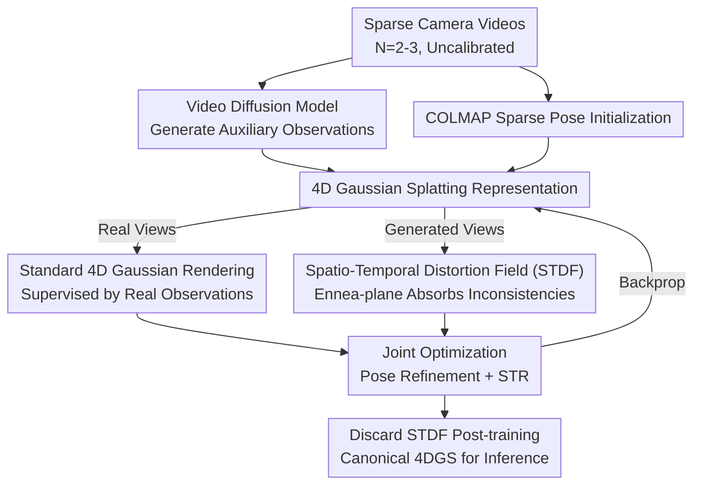

# SparseCam4D: Spatio-Temporally Consistent 4D Reconstruction from Sparse Cameras

**Conference**: CVPR 2026  
**arXiv**: [2603.26481](https://arxiv.org/abs/2603.26481)  
**Code**: [https://inspatio.github.io/sparse-cam4d/](https://inspatio.github.io/sparse-cam4d/)  
**Area**: 3D Vision  
**Keywords**: Sparse camera 4D reconstruction, spatio-temporal distortion field, 4D Gaussian Splatting, video diffusion models, dynamic scenes

## TL;DR

SparseCam4D is proposed as the first method to achieve 4D reconstruction from sparse cameras (2-3) on standard multi-camera dynamic scene benchmarks. The core innovation is the Spatio-Temporal Distortion Field (STDF), which explicitly models spatio-temporal inconsistencies in generative observations and decouples them from the canonical 4D Gaussian representation, achieving high-fidelity and spatio-temporally consistent dynamic scene rendering.

## Background & Motivation

**Background**: High-quality 4D reconstruction typically relies on dense camera arrays (usually 18-21 synchronized cameras) to achieve photorealistic rendering. However, such expensive laboratory-grade equipment severely limits practical applications.

**Limitations of Prior Work**: Sparse-view 4D reconstruction faces two primary difficulties: (1) Geometric regularization methods (e.g., MonoFusion using monocular depth and 3D tracking) provide structural constraints but cannot guarantee appearance quality, leading to rendering collapse during view shifts. (2) Camera-controlled video diffusion models can generate high-quality multi-view data as auxiliary observations, but these frames suffer from severe spatio-temporal inconsistency—spatial inconsistency across different views at the same timestamp (appearance/geometry bias) and temporal inconsistency across different timestamps in the same view (flickering, unstable motion). Directly using these for reconstruction results in significant blur and artifacts.

**Key Challenge**: While generative observations are "photorealistic," they exhibit systematic deviations from the true scene to be reconstructed. these deviations span both spatial and temporal dimensions and cannot be simply ignored or treated independently.

**Goal**: How to utilize rich but inconsistent generative observations to assist sparse-view 4D reconstruction by extracting useful information while stripping away inconsistencies.

**Key Insight**: Explicitly model the inconsistency as a learnable spatio-temporal distortion field, which is used to adapt to generative observations during training and discarded during inference—resulting in zero additional computational overhead.

**Core Idea**: A Spatio-Temporal Distortion Field decomposed via Ennea-planes is used to uniformly model the spatial-temporal inconsistencies in generative observations, allowing 4D Gaussian Splatting (4DGS) to learn the correct scene representation from inconsistent diffusion-generated data.

## Method

### Overall Architecture

Input: $N$ sparse camera videos ($N=2-3$, uncalibrated). Workflow: (1) Use video diffusion models to generate auxiliary observations in novel views; (2) Obtain coarse pose initialization using COLMAP; (3) Construct a 4D Gaussian Splatting scene representation + STDF, jointly optimizing poses, rendering, and regularization terms. Real views are rendered using standard 4D Gaussians, while generated views are rendered using 4D Gaussians warped by the STDF. After training, the STDF is discarded, retaining only the canonical 4D Gaussians.

### Key Designs

**1. Spatio-Temporal Distortion Field (STDF): Isolating Inconsistencies into a Discardable Field**

Auxiliary frames from diffusion models are photorealistic but contain systematic biases relative to the real scene. Supervising 4DGS directly with these leads to the learning of these biases, causing blur. STDF does not correct the generated images but instead learns a set of "warping amounts" for each generated view and timestamp. These warps specifically absorb inconsistencies, decoupling the clean scene representation from dirty observation biases.

Specifically, STDF treats the target quantity as a 5D volume $(x,y,z,t,s)$, where the first three are spatial coordinates, $t$ is the time index, and $s$ is the pose (generated view) index. The STDF follows the K-planes concept by decomposing this 5D volume into the product of feature planes. Nine planes are used (omitting the semantically meaningless $t$-$s$ plane), referred to as the Ennea-plane. For a given coordinate, features are retrieved via bilinear interpolation, multiplied element-wise across planes, concatenated multi-resoluntionally, and decoded by a multi-head MLP into position, rotation, and scale distortions $\Delta\mu,\ \Delta q_l,\ \Delta q_r,\ \Delta s$. Generated views are rendered using:

$$\mathcal{G}'_{4D} = \mathcal{G}_{4D} + \Delta\mathcal{G}_{4D}$$

While real views use the original $\mathcal{G}_{4D}$. Thus, $\Delta\mathcal{G}_{4D}$ captures the generated biases. Retaining both $s$ and $t$ dimensions is critical: $s$ handles spatial inconsistency across views, while $t$ handles temporal flickering.

**2. Joint Pose Optimization: Refining Camera Parameters**

Under sparse inputs, COLMAP initialization is often inaccurate and further corrupted by inconsistencies in generated frames. SparseCam4D treats the translation $T$ and rotation quaternion $q$ of each camera as learnable variables, optimized alongside 4D Gaussian attributes. A regularization term anchors them to initial COLMAP values:

$$\mathcal{L}_\text{pose} = \lambda_p\left(\|T - \hat{T}\| + \|q - \hat{q}\|\right)$$

Optimization follows a schedule: the first 3000 iterations act as a warm-up (standard training), followed by joint pose and STDF optimization, after which poses are frozen at 7000 iterations.

**3. Spatio-Temporal Regularization (STR): Priors for STDF Constraints**

To prevent STDF from overfitting to generative noise, specific smoothness constraints are applied. Generated views use perceptual loss $\mathcal{L}_\text{lpips}$ rather than pixel-wise $\mathcal{L}_1$, as it is more tolerant of local biases. Total Variation (TV) regularization $\mathcal{L}_{TV}$ is applied to spatial planes. For the pose axis, a second-order smoothness regularization is employed:

$$\mathcal{L}_\text{smooth} = \sum\left\|(P^{i,s-1} - P^{i,s}) - (P^{i,s} - P^{i,s+1})\right\|_2^2$$

This only affects planes involving the pose axis ($xs,\ ys,\ zs$). This choice reflects the prior that distortions across adjacent generated poses are smooth, whereas temporal distortions may change abruptly due to motion.

### Loss & Training

Total Loss: $\mathcal{L} = \mathcal{L}_\text{input} + \mathcal{L}_\text{gen} + \mathcal{L}_\text{pose} + \mathcal{L}_{TV} + \mathcal{L}_\text{smooth}$

- Input Views: $(1-\lambda)\mathcal{L}_1 + \lambda\mathcal{L}_\text{D-SSIM}$, with $\lambda = 0.2$
- Generated Views: $\lambda_1\mathcal{L}_1 + \lambda_2\mathcal{L}_\text{lpips}$, with $\lambda_1=0.02, \lambda_2=0.2$

Training involves 30,000 iterations per scene, sampling one real and one generated view per step. ViewCrafter is used to generate auxiliary videos (25 frames per sequence) on an A800 GPU.

## Key Experimental Results

### Main Results

Quantitative comparison on three standard 4D benchmarks (2-3 sparse camera inputs):

| Method | Technicolor PSNR↑ | Neural 3D PSNR↑ | Nvidia Dynamic PSNR↑ |
|------|-------------------|-----------------|---------------------|
| 4DGaussians | 16.20 | 17.40 | 16.81 |
| 4D-Rotor | 14.85 | 18.20 | 19.38 |
| MonoFusion* | 17.97 | 18.43 | 20.22 |
| **Ours** | **23.15** | **21.91** | **24.81** |

LPIPS also shows significant gains: Technicolor 0.299 vs MonoFusion 0.352, Nvidia 0.150 vs 0.192.

### Ablation Study

STDF Ablation (LPIPS↓ / SSIM↑ on Train/Jumping scenes):

| Setting | Train LPIPS | Jumping LPIPS |
|------|-------------|---------------|
| w/o distortion field | 0.608 | 0.319 |
| w/o time axis | 0.458 | 0.279 |
| w/o pose axis | 0.469 | 0.268 |
| **Full STDF** | **0.264** | **0.170** |

Removing pose optimization: LPIPS increased from 0.264 to 0.336 (Train) and 0.170 to 0.217 (Jumping).

### Key Findings

- **Omitting STDF leads to severe blur**: Visualization of spatio-temporal slices clearly shows temporal jittering caused by inconsistencies.
- **Both spatial and temporal axes are essential**: Performances drop significantly if either is removed, verifying that generative inconsistency is cross-dimensional.
- **STDF Visualizations are semantically reasonable**: High distortion regions (e.g., faces, bottles) correspond to areas with the largest deformations in diffusion generation.
- **Generalization across Diffusion Models**: Gains are consistent using both ViewCrafter and ReCamMaster (+2.51 dB and +1.76 dB respectively).

## Highlights & Insights

- **"Train-time usage, inference-time discarding" design**: STDF effectively adapts to inconsistent generative observations during training with zero overhead at test time.
- **Ennea-plane Decomposition**: Successfully extends the K-planes concept from 4D to 5D by adding the pose index dimension.
- **Shift from "Fighting Inconsistency" to "Explicitly Modeling It"**: Instead of forcing the diffusion model to be consistent, the method acknowledges and models the systematic deviations.
- STDF visualizations provide insights into how diffusion models "perceive" the physical world, showing varying deformation levels across different regions.

## Limitations & Future Work

- Performance depends on the quality of the video diffusion model.
- Requires per-scene training, with 30k iterations involving computational cost.
- Pose optimization relies on COLMAP initialization; extremely sparse settings (e.g., 1 camera) may fail initialization.
- Does not explicitly handle dynamic topological changes (e.g., objects appearing/disappearing).

## Related Work & Insights

- **MonoFusion / Shape-of-Motion**: Representative of geometric regularization; this work demonstrates that geometric priors alone are insufficient for high-quality appearance.
- **ViewCrafter / ReCamMaster**: Advanced VDM providing auxiliary views but introducing inconsistencies.
- **K-planes**: Foundation for decomposed scene representation; STDF expands this design space.

## Rating

- **Novelty**: ⭐⭐⭐⭐⭐ First framework to unify modeling of spatio-temporal inconsistencies in generative observations.
- **Experimental Thoroughness**: ⭐⭐⭐⭐⭐ Extensive validation across benchmarks, thorough ablations, and cross-model verification.
- **Writing Quality**: ⭐⭐⭐⭐ Clear problem definition and convincing visualizations.
- **Value**: ⭐⭐⭐⭐⭐ Significantly reduces the camera requirement for 4D reconstruction, showing high practical potential.

<!-- RELATED:START -->

## Related Papers

- [\[CVPR 2026\] Mark4D: Temporally-Consistent Watermarking for 4D Gaussian Splatting](mark4d_temporally-consistent_watermarking_for_4d_gaussian_splatting.md)
- [\[CVPR 2026\] ST4R-Splat: Spatio-Temporal Referring Segmentation in 4D Gaussian Splatting](st4r-splat_spatio-temporal_referring_segmentation_in_4d_gaussian_splatting.md)
- [\[CVPR 2026\] DetAny4D: Detect Anything 4D Temporally in a Streaming RGB Video](detany4d_detect_anything_4d_temporally_in_a_streaming_rgb_video.md)
- [\[CVPR 2026\] 4D Primitive-Mâché: Glueing Primitives for Persistent 4D Scene Reconstruction](4d_primitive-mache_glueing_primitives_for_persistent_4d_scene_reconstruction.md)
- [\[CVPR 2026\] Complet4R: Geometric Complete 4D Reconstruction](complet4r_geometric_complete_4d_reconstruction.md)

<!-- RELATED:END -->
