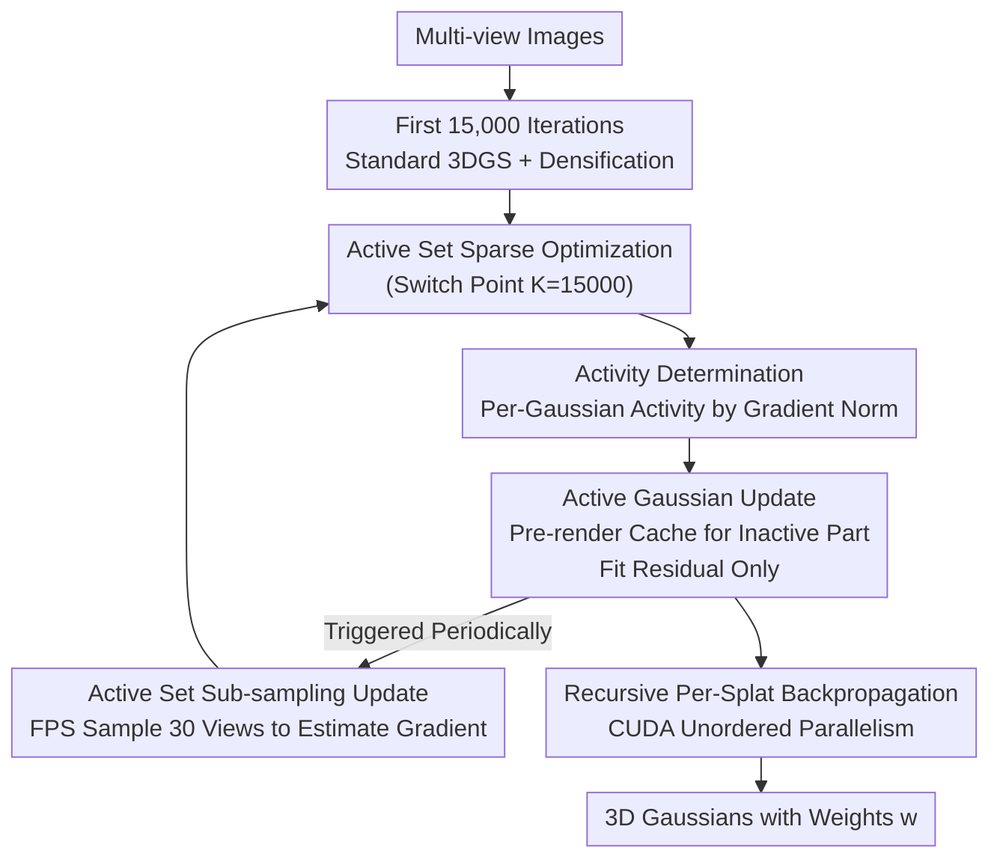

# SparseOIT: Improving Order-Independent Transparency 3DGS via Active Set Method

**Conference**: CVPR 2026  
**Paper**: [CVF Open Access](https://openaccess.thecvf.com/content/CVPR2026/html/Yang_SparseOIT_Improving_Order-Independent_Transparency_3DGS_via_Active_Set_Method_CVPR_2026_paper.html)  
**Code**: https://wentaoyang19.github.io/SparseOIT.github.io/ (Project Homepage)  
**Area**: 3D Vision  
**Keywords**: 3D Gaussian Splatting, Order-Independent Transparency, Active Set Method, Training Acceleration, Sparse Optimization

## TL;DR
This work identifies that after removing depth sorting from the Order-Independent Transparency (OIT) rendering equation, the dependency between Gaussians becomes significantly decoupled and highly sparse. Consequently, an "active set method" is employed to optimize only a small subset of Gaussians that are truly undergoing updates. Combined with a redesigned CUDA backpropagation mechanism, this approach accelerates the training of OIT-based methods by 4–6×, achieving a quality close to 3DGS / Taming-3DGS.

## Background & Motivation

**Background**: 3D Gaussian Splatting (3DGS) has become the mainstream method for novel view synthesis due to its photorealistic rendering quality. It inherits the volume rendering equation of NeRF, which sorts Gaussians based on their distance from the camera and performs alpha-blending with front-to-back occlusion.

**Limitations of Prior Work**: Depth sorting in volume rendering is a major source of trouble. Since Gaussians are constantly updated during the optimization process, any change in sorting order leads to non-smooth jumps in gradients. Moreover, changing to a new viewpoint can produce popping artifacts, which are particularly unfriendly to non-Lambertian/transparent materials. To bypass sorting, OIT (Order-Independent Transparency) methods (such as SortFree) replace the sorting step with an order-independent weighted blending equation. However, OIT methods have not gained popularity because: (1) their training time is far slower than volume rendering 3DGS (SortFree is about 3× slower than 3DGS); and (2) their rendering quality under novel views is significantly lower.

**Key Challenge**: Eliminating sorting in OIT achieves order independence at the cost of slower optimization and worse quality, leaving its potential unexploited. The authors notice a neglected byproduct: **once the sorting step is removed, the coupling between Gaussians in the rendering equation also disappears**. In standard 3DGS, transmittance $T_i=\prod_{j<i}(1-\alpha_j)$ makes the contribution of each Gaussian dependent on the sorting results of all preceding Gaussians, whereas the weighted summation form of OIT allows each Gaussian to contribute approximately independently.

**Goal**: To transform the "decoupling brought by OIT" from a passive side effect into an actively exploitable acceleration lever, while simultaneously closing the efficiency gap at the GPU implementation level.

**Key Insight**: The authors observe an "80/20" sparsity in 3DGS optimization: simple structures (walls, tabletops) use many Gaussians but converge quickly, while complex small objects occupy only a few Gaussians but require many iterations. In other words, **at any given moment, only a small portion of Gaussians are truly updating, while most can be "frozen."** In the coupled 3DGS framework, freezing some Gaussians would pollute the blending results of others, making it unfeasible; but in decoupled OIT, frozen Gaussians can be pre-rendered and cached, allowing subsequent optimization to focus solely on active Gaussians.

**Core Idea**: Manage a set of active Gaussians using the "active set method" from numerical optimization and optimize only this active set, where the acceleration ratio is proportional to the potential sparsity of the scene. Furthermore, GPU acceleration techniques like those in Taming-3DGS are rewritten into the order-independent characteristics of OIT to bridge the efficiency gap with volume-rendering methods.

## Method

### Overall Architecture

The input of SparseOIT is multi-view images, and the output is a set of 3D Gaussians with weight terms $w_i$. The entire pipeline is divided into two phases: **the first 15,000 iterations exactly replicate the optimization of standard 3DGS (including densification)** to allow the number of Gaussians and coarse structures to grow first; **after the 15,000th iteration, the training switches to active set sparse optimization**. The reason for this transition is straightforward—during early optimization, almost all Gaussians undergo drastic updates, making the active set nearly identical to the full set, rendering the active set method pointless. Large-scale areas of "converged and freezable" Gaussians emerge only in the later stages.

After switching, the training is divided into several "stages," with "active set updates" inserted between them. Before each stage begins, the active set $\mathcal{A}$ is updated, and the precomputed "inactive set pre-rendered map" $I^{pre}$ (i.e., the rendering result of the frozen Gaussians) is retrieved. Within a stage, only the current active set is rendered to fit the residual of "input image − pre-rendered map," while simultaneously generating a new pre-rendered map for the next stage. All of this is possible entirely because of the decoupling of the OIT rendering equation—the contribution of inactive Gaussians can be precomputed and cached for reuse, without being invalidated by updates to the active Gaussians.

The entire system consists of three layers: **activity determination → active Gaussian update (pre-rendering residual) → periodic active set update (sub-sampling estimation)**, with an independent **CUDA backpropagation redesign** running through the whole system.

### Key Designs

**1. Converting OIT Decoupling into "Active Set" Acceleration: Optimizing Only Changing Gaussians**

This is the core of the entire paper. In the standard 3DGS rendering equation $\mathbf{C}=\sum_i T_i\alpha_i\mathbf{c}_i,\ T_i=\prod_{j<i}(1-\alpha_j)$, the contribution of each Gaussian is tied to the sorting and transmittance of all preceding Gaussians, preventing individual freezing. OIT adopts the weighted blending formulation of SortFree:

$$\mathbf{C}=T\,\mathbf{c}_0+(1-T)\,\frac{\sum_{i=1}^N \mathbf{c}_i\,\alpha_i\,w_i}{\sum_{i=1}^N \alpha_i\,w_i},\quad T=\prod_{i=1}^N(1-\alpha_i)$$

where $w_i=\max(0,1-\frac{d}{\sigma})v(\mathbf{r})$ is a learnable weight dependent on depth $d$ and view direction $\mathbf{r}$, and $v(\mathbf{r})$ uses third-order spherical harmonics to compensate for view-dependent appearance. In this fractional form, each Gaussian contributes through independent accumulated terms in the numerator and denominator, removing the cascaded coupling of $\prod_{j<i}$. Consequently, "freezing a portion of Gaussians and only optimizing the rest" is mathematically self-consistent. Based on this, the authors introduce the active set method: instead of performing gradient descent on the full set, optimization is restricted to the active set $\mathcal{A}$, where the acceleration magnitude is proportional to the potential sparsity. The success of the active set method depends on three factors—how activity is defined, how active Gaussians are updated efficiently, and how the active set is periodically refreshed at a low cost—which are addressed in the following three points.

**2. Activity Determination: Gaussian-level, Frozen as a Whole via Gradient Norm**

Gaussians are multi-attribute variables (position $\mu$, quaternion $q$, scale $s$, opacity $o$, spherical harmonics $h$, weight $w$). Since these attributes are highly correlated, the authors do not evaluate them separately. Instead, they treat all attributes of the same Gaussian as an indivisible group and determine "Gaussian-level activity":

$$\mathbf{1}_{\text{active}}(i)=\exists\, v\in\{\mu_i,q_i,s_i,o_i,h_i,w_i\},\ (\|\nabla_v\|>\epsilon_v)$$

That is, if the gradient norm of any attribute exceeds the threshold $\epsilon_v$, the Gaussian is considered active; only when the gradient norms of all attributes are close to zero is it frozen. The threshold $\epsilon_v$ is set empirically to balance efficiency and quality—a more aggressive threshold freezes more Gaussians, leading to faster speeds, but poses a greater risk of quality degradation. This "whole-group evaluation" prevents state inconsistencies caused by some attributes of a Gaussian being updated while others are frozen.

**3. Active Gaussian Update: Pre-rendering and Caching Inactive Sets, Fitting Residuals Only**

After identifying the active set $\mathcal{A}$ and its complement (the inactive set $\bar{\mathcal{A}}$), the key is to avoid re-rendering all Gaussians at each iteration. Since the OIT equation does not couple Gaussians, the authors maintain a **pre-rendered map** for each training view by precomputing and caching the rendering results of the inactive Gaussians. Between active set updates, the training simplifies to having the active Gaussians fit the residual of "input image − pre-rendered map," thereby completely saving the computational overhead of the inactive portion.

There is a GPU parallelization bottleneck in the implementation: when the active set is updated, the inactive set changes, requiring the pre-rendered map to be recomputed. However, such updates are highly sparse on the image (affecting only a few pixels), and direct updates would lead to poor GPU parallelization. The authors address this via **deferred updates**—postponing the refresh of the pre-rendered map until it is actually needed for training. The pre-rendered and training maps are then fed into the GPU together, with each Gaussian labeled as "active" or "inactive" and processed through dual paths.

**4. Periodic Active Set Update: Sub-sampling Viewpoints to Estimate Gradients, Reducing Update Costs to Sub-linear**

The active set must be periodically reassessed. The most naive approach is to recompute the gradients of all Gaussians, which is equivalent to a full-variable update, defeating the purpose of acceleration. The key observation of the authors is that **activity determination merely compares the gradient to a zero vector, which naturally tolerates a certain degree of approximation error**. Thus, sub-sampling can be used to save costs. Specifically, during active set updates, training viewpoints are **sampled using Farthest Point Sampling (FPS, with random initialization) to extract a subset (30 viewpoints in experiments)** to estimate Gaussian gradients, reducing the complexity from linear to sub-linear. Experiments show that even with sub-sampling, the estimation of activity remains highly reliable. The overall active set workflow is detailed in Alg. 1: sample training views -> rasterize with active set + pre-rendered map -> compute residual loss -> update active Gaussians; during update epochs, recompute loss on sub-sampled views and refresh the active set.

**5. Recursive Per-Splat Backpropagation: Leveraging OIT's Order-Independence to Eliminate Redundant Computations in Taming-3DGS**

This is a separate acceleration pathway targeting CUDA backpropagation. In standard 3DGS, gradients flow from pixels to Gaussians during backpropagation, and multiple threads perform atomic writes to the same splat accumulator, causing severe contention and thread stalling. Taming-3DGS alleviates contention using splat-level parallelization, but its forward pass requires depth sorting and performs a per-pixel state checkpoint every 32 splats, forcing the backward pass to traverse strictly in depth order. The fixed warp size of 32 results in up to 31 redundant computations per tile. SparseOIT exploits the property that "OIT rendering holds no constraints on Gaussian processing order." It divides each tile (256 pixels) into 8 groups, each containing 32 pixels to match the warp size. Inside the warp, each lane retrieves the state of its own pixel (queried only once per group), and these per-pixel states are rotated inside the warp, sequentially feeding 32 pixel states to each splat and accumulating the gradient. This rotation is repeated 8 times to complete the tile. This allows multiple lanes to retrieve data simultaneously, reducing stalls, and **provably generates zero redundant arithmetic operations**. Additionally, it adopts the culling strategy from SpeedySplat to reduce both forward and backward workloads.

*Mapping of Framework to Key Designs: The contribution nodes in the framework diagram—"Activity Determination", "Active Gaussian Update", "Active Set Sub-sampling Update", and "Recursive Per-Splat Backpropagation"—correspond to Key Designs 2, 3, 4, and 5, respectively. Design 1 acts as the decoupling premise that underlies all of these steps. The first 15,000 iterations of standard 3DGS and the final Gaussian outputs serve as scaffolding nodes.*

### Loss & Training
The loss function is identical to that of the original 3DGS ($L_1$ + SSIM, inheriting $\lambda_{ssim}$ from 3DGS). Using the Adam optimizer, the learning rates are set to 0.01 for $o$, 0.1 for $\sigma$, and 0.005 for $v$, with other rates inherited from 3DGS; the weight $v$ is represented by single-channel third-order spherical harmonics. The densification strategy is consistent with 3DGS, but to prevent GPU out-of-memory (OOM) errors, empirical random sampling probabilities are applied based on the scene to constrain the total number of Gaussians. Densification terminates at 15,000 iterations, at which point active set acceleration is enabled. Since the method exhibits noticeable run-to-run variance (e.g., PSNR can vary by 0.6 dB in scenes like Bicycle/Room), the reported values are averaged over multiple runs.

## Key Experimental Results

Datasets: Mip-NeRF 360, Deep-Blending, Tanks & Temples (Mip-NeRF 360 uses 1/4 resolution to prevent OOM). Baselines: 3DGS, Taming-3DGS, SortFree (an OIT method, using a third-party implementation). Metrics: PSNR / SSIM / LPIPS + Training Time (seconds) + Number of Gaussians N(k). Hardware: Single NVIDIA 4090 (24GB). Three variants: **SparseOIT-A** (CUDA acceleration only), **SparseOIT-B** (CUDA acceleration + Active Set), and **SparseOIT-C** (CUDA acceleration + Taming densification, no Active Set).

### Main Results

| Dataset | Method | PSNR↑ | SSIM↑ | LPIPS↓ | Training Time↓ | N(k) |
|--------|------|-------|-------|--------|----------|------|
| Tanks&Temples | SortFree | 22.97 | 0.8299 | 0.1814 | 2159 | 3765 |
| Tanks&Temples | 3DGS | 23.78 | 0.8494 | 0.1704 | 705 | 1569 |
| Tanks&Temples | **SparseOIT-B** | 23.68 | 0.8429 | 0.1798 | **445** | 2052 |
| DeepBlending | SortFree | 29.76 | 0.9016 | 0.2399 | 2065 | 2843 |
| DeepBlending | 3DGS | 29.70 | 0.9027 | 0.2409 | 1213 | 2459 |
| DeepBlending | **SparseOIT-B** | **29.80** | **0.9043** | 0.2486 | **309** | 1251 |
| Mip-NeRF 360 | SortFree | 27.33 | 0.8067 | 0.1792 | 2302 | 4314 |
| Mip-NeRF 360 | 3DGS | 27.68 | 0.8214 | 0.1771 | 909 | 2679 |
| Mip-NeRF 360 | **SparseOIT-B** | 27.21 | 0.8027 | 0.2040 | **408** | 2121 |

Key takeaways: SparseOIT-B accelerates training by approximately **4–6×** compared to SortFree, and **2–4×** compared to 3DGS, while maintaining comparable quality to 3DGS/Taming. On DeepBlending, its PSNR/SSIM even slightly exceeds 3DGS. SparseOIT-C (with Taming densification) further reduces training time to the scale of ~160s, comparable to Taming. Interestingly, OIT-style methods perform better than 3DGS on reflective objects and complex indoor lighting scenes, because OIT optimizes weights as independent variables, whereas the weights in 3DGS are strongly coupled with opacity and depth.

### Ablation Study

Backpropagation parallelization modes (Playroom scene):

| Backpropagation Implementation | PSNR↑ | SSIM↑ | LPIPS↓ | Time↓ | N(k) |
|----------|-------|-------|--------|-------|------|
| Per-pixel [3DGS] | 30.04 | 0.9024 | 0.2474 | 981 | 1383 |
| Per-splat [Taming] | 29.93 | 0.9024 | 0.2477 | 415 | 1377 |
| **Ours (Recursive Per-Splat)** | 29.93 | 0.9020 | 0.2483 | **396** | 1380 |

Recursive per-splat backpropagation achieves approximately **2× acceleration** compared to original 3DGS, saving nearly 20 seconds even over Taming, with almost no loss in quality. For active set ablation, comparing A vs B in Tab. 1: enabling the active set (B) yields faster training with negligible quality degradation compared to CUDA-only acceleration (A). Furthermore, **the larger the number of Gaussians, the more significant the acceleration**, validating the assumption that "higher sparsity yields greater gains from the active set."

### Key Findings
- The acceleration mainly stems from two orthogonal pathways: **the active set (A→B)** and **the CUDA backpropagation redesign (per-pixel→Ours)**. Achieving a speed comparable to Taming requires the integration of both.
- The performance gain of the active set scales with the volume of Gaussians, indicating that larger scenes contain a higher proportion of "freezable Gaussians," thereby rendering the sparsity hypothesis more valid.
- The superior quality of OIT on reflective scenes over 3DGS is an unexpected positive outcome of "weight decoupling" rather than just an acceleration benefit.

## Highlights & Insights
- **Translating a mathematical property of the rendering equation (decoupling) into system-level acceleration (active set + pre-rendering cache)**: This is the most ingenious step. While prior works treated OIT merely as a rendering trick to "avoid sorting," this paper recognizes that OIT implicitly sparsifies the variable dependency graph, enabling the classical active set method from numerical optimization to be applied to 3DGS for the first time.
- **Sub-sampled gradient estimation + fault-tolerant determination**: Since activity determination merely compares gradients with zero, it naturally tolerates noise. Thus, FPS sub-sampling can be utilized to compress the active set update cost to sub-linear. This chain of "fault-tolerant determination -> allows approximation -> yields acceleration" is a valuable paradigm that can be transferred to other training scenarios requiring periodic importance estimation (such as sparsification, pruning, and curriculum sampling).
- **Order-independence unlocks GPU parallelization in reverse**: The redundant computation in Taming stems from depth-order constraints. Since OIT lacks this constraint, warp lanes can rotate pixel states without redundancy. This is a classic case where "removing a constraint directly accelerates downstream implementation."

## Limitations & Future Work
- The authors acknowledge that **pruning in OIT-based 3DGS remains largely uninvestigated**. The lack of pruning hampers Gaussian optimization, affecting the final Gaussian count and training efficiency.
- The weight term $w$ introduces additional computational and storage overhead, which can degrade the quality of novel view synthesis. This contributes to the weaker rendering performance in certain scenes. Future work needs to explore more efficient parameterization of $w$.
- The method exhibits noticeable run-to-run variance (with PSNR differences up to 0.6 dB in some scenes), requiring averaging over multiple runs to stabilize. This indicates room for improvement in optimization stability.
- A residual performance gap still exists compared to Taming, stemming from differences in scene representation, rendering truncation, and the extra weight coefficients that make the parameter size slightly larger than standard 3DGS.

## Related Work & Insights
- **vs SortFree (The pioneer of OIT)**: Both utilize weighted, order-independent blending equations. However, SortFree only addresses the "unsorted" aspect without modifying the optimization algorithm, leading to slow training times (~2000s+). This work overlays the active set and CUDA redesigns onto its rendering equation, improving speed by 4–6× while offering superior quality.
- **vs Taming-3DGS**: Taming achieves acceleration via splat-level parallelization and resource scheduling but suffers from redundancies due to depth-order constraints. The proposed method leverages OIT's order-independence to perform redundancy-free recursive per-splat backpropagation, saving an additional 20s per scene, and directly inherits Taming's densification (variant C) to achieve comparable speeds.
- **vs 3DGS-LM / 3DGS² (Second-order optimization acceleration)**: These approaches accelerate convergence by changing the optimizer (LM / local Newton), which is orthogonal to this work. Instead of changing the optimizer, this work reduces the number of variables to be optimized in each iteration (via the active set). In principle, these two strategies can be integrated.

## Rating
- Novelty: ⭐⭐⭐⭐⭐ The causal link from "OIT order-independence -> variable decoupling -> sparsity -> active set" is logically robust, novel, and non-obvious.
- Experimental Thoroughness: ⭐⭐⭐⭐ Evaluation across three datasets, three variants, and two ablation steps is relatively complete, though it lacks quantitative reporting of run-to-run variance and trials on larger-scale scenes.
- Writing Quality: ⭐⭐⭐⭐ The motivation and methodology are logically clear, though some formulas present OCR noise and the details of $w$ are somewhat brief.
- Value: ⭐⭐⭐⭐ Transitioning OIT-based 3DGS from "slow and weak" to "fast and comparable" is a practical advancement for rebuilding transparent/reflective materials.

<!-- RELATED:START -->

## Related Papers

- [\[CVPR 2026\] Faster-GS: Analyzing and Improving Gaussian Splatting Optimization](faster-gs_analyzing_and_improving_gaussian_splatting_optimization.md)
- [\[CVPR 2026\] GLINT: Modeling Scene-Scale Transparency via Gaussian Radiance Transport](glint_modeling_scene-scale_transparency_via_gaussian_radiance_transport.md)
- [\[CVPR 2026\] EDGS: Eliminating Densification for Efficient Convergence of 3DGS](edgs_eliminating_densification_for_efficient_convergence_of_3dgs.md)
- [\[CVPR 2026\] Z-Order Transformer for Feed-Forward Gaussian Splatting](z-order_transformer_for_feed-forward_gaussian_splatting.md)
- [\[CVPR 2026\] ObjectMorpher: 3D-Aware Image Editing via Deformable 3DGS](objectmorpher_3d-aware_image_editing_via_deformable_3dgs.md)

<!-- RELATED:END -->
