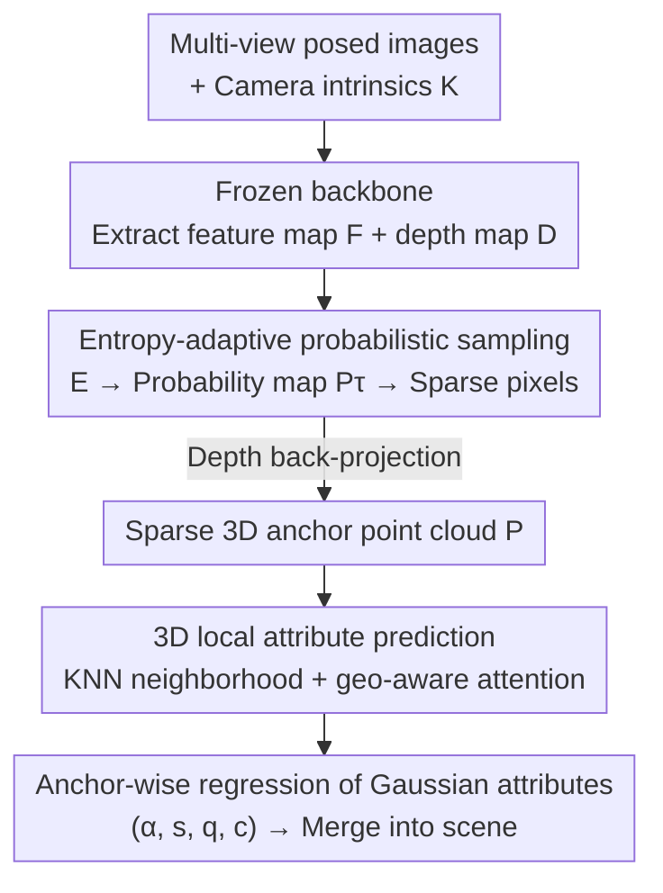

# SparseSplat: Towards Applicable Feed-Forward 3D Gaussian Splatting with Pixel-Unaligned Prediction

**Conference**: CVPR 2026  
**Paper**: [CVF Open Access](https://openaccess.thecvf.com/content/CVPR2026/html/Zhang_SparseSplat_Towards_Applicable_Feed-Forward_3D_Gaussian_Splatting_with_Pixel-Unaligned_Prediction_CVPR_2026_paper.html)  
**Code**: [Project Page](https://victkk.github.io/SparseSplat-page/) (Public GitHub not yet available)  
**Area**: 3D Computer Vision  
**Keywords**: Feed-forward 3DGS, novel view synthesis, adaptive sampling, information entropy, point cloud network

## TL;DR
SparseSplat is the first feed-forward 3DGS model capable of **adaptively allocating Gaussian density** based on scene structure and local informational richness. It replaces the "one Gaussian per pixel" paradigm with Shannon entropy-based probabilistic sampling to generate sparse anchors, and then utilizes a KNN prediction head operating on 3D local neighborhoods to regress Gaussian attributes. Ultimately, it achieves comparable rendering quality using only 22% of the Gaussians of DepthSplat (150k vs. 688k), while enabling seamless adjustability of sparsity between 10k and 150k Gaussians with a single model.

## Background & Motivation

**Background**: Feed-forward 3D Gaussian Splatting (feed-forward 3DGS) has recently become a hot research topic. It trains a network to predict a complete 3DGS scene representation in a single forward pass from a few posed RGB images, saving the minutes-long per-scene optimization of vanilla 3DGS, which is highly suitable for "instant reconstruction" downstream tasks such as SLAM, AR/VR, and robotics. Representative works like PixelSplat, MVSplat, and DepthSplat have pushed rendering quality to new heights.

**Limitations of Prior Work**: The 3DGS maps generated by these methods are **highly dense and redundant**. Early feed-forward methods are generally "pixel-aligned", predicting one Gaussian for each pixel of the input views. Consequently, even textureless regions like skies and white walls are packed with uniformly distributed Gaussians. DepthSplat often requires 688k Gaussians for a single scene, incurring memory and computational overheads unacceptable for edge devices such as vehicle-mounted platforms, UAVs, and AR glasses, which directly hinders feed-forward 3DGS from being deployed in real-world applications like SLAM.

**Key Challenge**: The root cause of this redundancy lies in the **mismatch between structure and distribution**. Vanilla optimization-based 3DGS is naturally content-adaptive, deploying sparse, large Gaussians in low-texture areas and dense, small Gaussians in high-texture areas. In contrast, pixel-aligned (and even voxel-aligned methods like AnySplat/VolSplat) pin Gaussians to a **rigid, scene-independent uniform grid**, which is fundamentally incompatible with the non-uniform distribution desired by 3DGS. Post-processing methods (GGN, Long-LRM) merely prune or merge Gaussians ex post facto—they are "redundancy cleaners" rather than "redundancy avoiders," which treats the symptoms rather than the root cause.

**Goal**: The authors attribute this failure to two fundamental design flaws and tackle them separately: ① **Distribution mismatch** (rigid grid vs. content-adaptive distribution); ② **Receptive field mismatch**—they observe that 3DGS optimization is inherently a **local process** (the attributes of a Gaussian are majorly determined by its neighbors in 2D/3D spaces), yet existing methods employ large-receptive-field backbones to extract global context and then regress Gaussian attributes from **single-pixel features**. This "global perception, single-point prediction" approach contradicts the locality of the prediction task.

**Core Idea**: Completely abandon the pixel-aligned paradigm. Instead, use a two-step process: "adaptive sampling based on informational richness + attribute prediction in 3D local neighborhoods" to enable the feed-forward network to mimic the adaptive and efficient distribution of optimization-based 3DGS.

## Method

### Overall Architecture
SparseSplat aims to address the problem of "how to generate a sparse, efficient, and high-fidelity 3DGS map in a feed-forward manner." The entire pipeline consists of three sequential stages: first, a **frozen backbone** extracts feature maps and depth maps from multi-view posed images; second, in the **adaptive sampling** phase, the local entropy of each image is converted into a probability map, from which sparse 2D pixels are randomly sampled according to the probabilities and back-projected with depth into a sparse 3D anchor point cloud; finally, in the **3D local attribute prediction** stage, a KNN search is performed for each anchor point, and the local neighborhood features are fed into a lightweight prediction head to regress full Gaussian attributes $(\alpha, s, q, c)$. All Gaussians are then merged to obtain the final scene representation. SparseSplat itself **does not introduce a new backbone**—it directly inherits and freezes the multi-view depth estimation network from DepthSplat. The novelty lies entirely in "how to utilize $F$ and $D$ to generate sparse representations."

### Key Designs

**1. Entropy-Adaptive Probabilistic Sampling: Let Information Entropy Decide Where to Cluster Gaussians**

This step directly addresses the issue of "distribution mismatch." Since 3DGS desires "low texture $\rightarrow$ sparse and large Gaussians, high texture $\rightarrow$ dense and small Gaussians," the sampling density should be proportional to local information complexity. The authors borrow the well-established principle from image processing that "entropy measures texture complexity." For the grayscale version of each input image, Shannon entropy is calculated within an $N\times N$ local window for each pixel, yielding an information density map $E\in\mathbb{R}^{H\times W}$:

$$E(u,v) = -\sum_{i=0}^{L-1} p_i \log p_i$$

Where $L$ is the number of gray levels (e.g., 256), and $p_i$ is the normalized histogram probability of gray level $i$ within the window $W_{u,v}$. Higher $E$ values correspond to high-frequency texture regions, while lower values correspond to flat regions. The entropy map is then normalized to its theoretical maximum $\log L$ and multiplied by a temperature coefficient $\tau$, converting it to an independent sampling probability per pixel:

$$P_\tau(u,v) = \mathrm{clip}\!\left(\tau\cdot\frac{E(u,v)}{\log L},\,0,\,1\right)$$

Then, a random number $r\sim U(0,1)$ is generated for each pixel. If $r<P_\tau(u,v)$, the pixel is selected into the sparse set $S$, which is then back-projected into a 3D anchor point cloud $P$ using depth $D$ and camera parameters. The elegance of this design lies in $\tau$ acting as an **intuitive sparsity dial**: a larger $\tau$ yields higher sampling probabilities and a denser point cloud, whereas a smaller $\tau$ makes it sparser. Thus, a **single model** can switch seamlessly between different Gaussian counts (such as 150k, 100k, 40k, 10k), trading memory for rendering quality via a single hyperparameter to adapt to various downstream requirements like AR/VR (requiring low memory) or SLAM (requiring extreme sparsity and fast updates). This is a "sparse-by-design" approach, unlike voxelization methods locked by grid resolution or post-processing methods that can only patch things up afterwards.

**2. 3D Local Attribute Predictor: Aligning the Receptive Field with the Locality of 3DGS Optimization**

This step targets the "receptive field mismatch." The authors first offer a theoretical validation (Fig.3): in vanilla 3DGS optimization, when a 3D Gaussian is splatted onto the 2D image plane, it only covers a small patch of pixels, and the gradient of the rendering loss only flows back to the attributes of this Gaussian from this small local neighborhood. Meanwhile, neighboring Gaussians that overlap with it after projection modulate the rendering of this pixel patch, thereby influencing the gradient flow. The conclusion is: **The attributes of a Gaussian are primarily determined by itself and its neighbors in 2D/3D space, and 3DGS optimization is inherently a local process.** Therefore, using a global backbone paired with single-pixel regression is a contradictory design.

SparseSplat's predictor strictly adheres to this principle of locality. For each anchor point $p_i$, an efficient FAISS search is performed in 3D space to find its $K$ nearest neighbors $\{p_{n1},...,p_{nK}\}$. For each point (center or neighbor), a **dual-projection strategy** is applied—geometric features $g\in\mathbb{R}^{d_g}$ (xyz coordinates, surface normals, viewing directions) and high-dimensional image features $v\in\mathbb{R}^{d_v}$ (sourced from the backbone feature maps) are projected via two learnable projections $\phi_g, \phi_v$ respectively, and then concatenated:

$$f = [\phi_g(g);\phi_v(v)]\in\mathbb{R}^{2d_h}$$

This yields a local neighborhood feature set $\mathcal{F}_i=\{f_i\}\cup\{f_{nj}\}_{j=1}^K$. The authors experimented with DGCNN edge convolution, PointNet max-pooling, simple MLP, and geo-aware attention. Ablation studies revealed that **geo-aware attention** performs the best, allowing the network to adaptively weigh the contributions of different neighbors: $\tilde f_i=\mathrm{Attention}(f_i,\mathcal{F}_i)$. The aggregated features are then passed through a lightweight MLP to regress all Gaussian attributes $\{\alpha,s,q,c\}=\mathrm{MLP}_\theta(\tilde f_i)$ (opacity, 3D scale, quaternion rotation, spherical harmonics coefficients). This design achieves two goals at once: aligning the receptive field (3D local neighborhood) perfectly with the nature of the task (local optimization), while staying lightweight and efficient. An unexpected benefit is its enhanced robustness to depth errors. In regions where backbone depth estimation fails (such as sky-building boundaries), processing 3D neighborhoods allows the model to better identify local geometric inconsistencies compared to single-pixel methods, suppressing artifact propagation by predicting smaller, more localized Gaussians.

### Loss & Training
Entirely end-to-end, **supervised only by RGB**. The predicted Gaussian set $G$ is rendered to the training views using a standard differentiable Gaussian rasterizer $\mathcal{R}$ to obtain $I_{render}$. Since the depth maps are provided by the frozen backbone, the training objective focuses solely on rendering quality, combining MSE and perceptual LPIPS:

$$L = (1-\lambda)L_{MSE}(I_{render},I_{gt}) + \lambda L_{LPIPS}(I_{render},I_{gt})$$

Implementation details: Trained on 4×A100 (80GB) for approximately 48 hours, utilizing an Adam optimizer with a cosine scheduler, batch size of 2, learning rate of $2\times10^{-4}$, entropy window size $N=7$, default KNN $K=20$, and a resolution of 256×448 on DL3DV. During training, **the backbone providing depth/features is frozen** to ensure a fair comparison with the primary baseline, DepthSplat.

## Key Experimental Results

### Main Results
On DL3DV (6000 scenes for training / 140 scenes for testing), SparseSplat delivers different operational points by adjusting $\tau$ on a single model:

| Method | Category | PSNR ↑ | SSIM ↑ | LPIPS ↓ | No. Gaussians ↓ | Time (s) ↓ |
|------|------|--------|--------|---------|----------|-----------|
| MVSplat | pixel-aligned | 22.95 | 0.774 | 0.192 | 688k | 0.260 |
| DepthSplat | pixel-aligned | 24.17 | 0.816 | 0.152 | 688k | 0.128 |
| GGN | Post-processing | 20.23 | 0.570 | 0.268 | 162k | 0.320 |
| Long-LRM | Post-processing | 20.92 | 0.627 | 0.265 | 200k | 0.115 |
| AnySplat | Voxelized | 17.45 | 0.471 | 0.320 | 608k | 0.378 |
| **Ours-150k** | Adaptive | **24.20** | 0.817 | 0.168 | **150k** | 0.398 |
| Ours-100k | Adaptive | 23.95 | 0.786 | 0.189 | 100k | 0.192 |
| Ours-40k | Adaptive | 22.65 | 0.737 | 0.251 | 40k | 0.111 |
| Ours-10k | Adaptive | 21.29 | 0.665 | 0.321 | 10k | 0.105 |

Key Findings: Ours-150k achieves a comparable PSNR of 24.20 to DepthSplat using only **22% of the Gaussians** (150k vs. 688k), at the cost of a slightly slower single reconstruction time (398ms vs. 128ms, mainly spent on KNN). Meanwhile, the sparser 10k/40k models are faster than DepthSplat (105/111ms vs. 128ms) while maintaining robust quality (21.29/22.65 PSNR). This "graceful degradation" capability is completely absent in AnySplat (whose quality collapses under extreme sparsity).

Cross-dataset generalization (trained on DL3DV, evaluated directly on unseen Replica):

| Method | PSNR ↑ | SSIM ↑ | LPIPS ↓ |
|------|--------|--------|---------|
| MVSplat | 19.13 | 0.628 | 0.423 |
| DepthSplat | 26.47 | 0.836 | 0.175 |
| Ours-150k | **26.64** | **0.846** | 0.180 |

Ours surpasses DepthSplat in PSNR, demonstrating generalizability to completely different domains without retraining; DepthSplat only slightly outperforms in LPIPS.

### Ablation Study
(All variants are trained for 30k steps and evaluated at the 40k Gaussian level)

| Configuration | PSNR ↑ | SSIM ↑ | LPIPS ↓ | Notes |
|------|--------|--------|---------|------|
| Entropy Sampling (Ours) | **22.36** | 0.718 | 0.262 | Full sampling strategy |
| Random Sampling | 21.50 | 0.696 | 0.288 | Drastic drop (-0.86 PSNR) |
| Laplacian Edge Sampling | 21.95 | 0.705 | 0.267 | Drop (-0.41 PSNR) |
| K=0 (degenerated to single-point MLP) | 21.53 | 0.683 | 0.291 | Drop (-0.83 PSNR) |
| K=20 (Default) | 22.36 | 0.718 | 0.262 | Local neighborhood aggregation |
| Predictor: Graph-Conv | 20.78 | 0.664 | 0.329 | |
| Predictor: MLP | 21.47 | 0.683 | 0.299 | |
| Predictor: Max Pooling | Fail | Fail | Fail | Training directly diverges |
| Predictor: Geo-aware Attn | 22.36 | 0.718 | 0.263 | Best |

### Key Findings
- **Entropy is indeed more effective at distributing Gaussians than edge/random sampling**: Entropy sampling (22.36 PSNR) > Laplacian (21.95) > Random (21.50), validating that "informational richness" is a more suitable guide for sparse Gaussian allocation than simple edge detection, directly addressing "distribution mismatch."
- **The local neighborhood is hard evidence of the receptive field mismatch hypothesis**: Setting $K=0$ (degraded to single-point MLP) drops performance to 21.53, while increasing to $K=20$ boosts it to 22.36. Diminishing returns are observed with $K > 20$ (e.g., $K=30$ yields only 22.38), hence $K=20$ is selected by default to balance performance and computation.
- **The choice of aggregation head is crucial**: Geo-aware attention (22.36) significantly outperforms MLP (21.47) and Graph-Conv (20.78), while PointNet-style max-pooling causes training to diverge. This underscores the necessity of "adaptive weighting" rather than coarse pooling for local 3D neighborhoods.

## Highlights & Insights
- **Tracing "redundancy" back to two mismatches**: The authors did not stop at the superficial issue of "too many Gaussians," but instead deconstructed the root causes into "distribution mismatch" and "receptive field mismatch," addressing each with a targeted component. This problem analysis itself stands as one of the paper's core contributions.
- **Unifying full-spectrum sparsity with a single dial**: A single trained model can be adjusted dynamically between 10k to 150k Gaussians simply by changing the temperature coefficient $\tau$, in which rendering quality degrades gracefully. This is highly practical for scenarios where "a single model must serve both AR/VR and SLAM," saving the cost of training multiple fixed-capacity models.
- **Deriving "locality" from the gradient flow of 3DGS optimization to guide network design**: By evaluating the gradient backpropagation (Fig.3), the authors demonstrate that 3DGS is inherently a local process, thereby rejecting the "global perception, single-point prediction" layout. This mindset of "deriving architecture from optimization principles" easily extends to other feed-forward reconstruction tasks.
- **Backbone-agnostic decoupling**: The sparsification logic is completely decoupled from the depth/feature backbone (which freezes and reuses DepthSplat). Future advancements in multi-view depth estimation can thus be directly integrated for free.

## Limitations & Future Work
- **The authors acknowledge** that 3D KNN is not the optimal context aggregation method under severe depth errors. If a point is erroneously projected to the foreground of another view, completely occluding the background scene, KNN cannot acquire the occluded points that would have otherwise hinted at the positional error. The authors believe that 2D co-visibility-based aggregation would be more effective and list this as future work.
- **Inefficient KNN computation**: The 150k model requires 398ms for reconstruction, which is noticeably slower than DepthSplat's 128ms. The bottleneck lies in the KNN search, limiting its throughput in high-density real-time settings.
- **Our own observation**: The experiments were solely trained on DL3DV and tested on Replica for generalization, meaning the scene types (indoor/outdoor real-world environments) are somewhat limited. While the sparsest configuration (10k) degrades gracefully, its PSNR drops to 21.29 with an LPIPS of 0.321, which might not suffice for high-fidelity requirements. Furthermore, computing entropy on grayscale images might underestimate informational richness in areas that are chromatically rich but grayscale-uniform.

## Related Work & Insights
- **vs DepthSplat / MVSplat (pixel-aligned)**: These methods assign a Gaussian to every pixel, causing uniform redundancy (688k). SparseSplat uses entropy sampling to adaptively allocate Gaussians based on image content, matching their performance with just 22% of the Gaussians while leveraging the same frozen backbone. It achieves this purely through sparsification logic and shows superior robustness to depth errors.
- **vs AnySplat / VolSplat (voxelized)**: These approaches utilize 3D voxels instead of 2D pixels, but they still rely on rigid, scene-independent uniform grids. SparseSplat avoids grids entirely, realizing a genuinely non-uniform distribution via probabilistic sampling, and avoids the catastrophic quality collapse under sparse conditions seen in AnySplat.
- **vs GGN / Long-LRM (post-processing)**: These methods merge or prune Gaussians after pixel-aligned prediction, functioning as "ex-post redundancy cleaners." SparseSplat is "sparse-by-design," mitigating redundancy from the beginning rather than patching it up afterwards.
- **Insights from Point Cloud Networks**: The prediction head of SparseSplat adopts geo-aware local self-attention (reminiscent of Point Transformer), validating that "local neighborhood self-attention + positional encoding" is superior to DGCNN/PointNet variants for feed-forward 3DGS attribute regression.

## Rating
- Novelty: ⭐⭐⭐⭐⭐ First content-adaptive feed-forward 3DGS, moving away from pixel/voxel-aligned paradigms. The analysis of the two mismatches is highly insightful.
- Experimental Thoroughness: ⭐⭐⭐⭐ The main experiments, cross-dataset evaluation, and three groups of ablation studies (sampling strategy, $K$, and prediction head) are thorough. However, the evaluation dataset is somewhat homogenous and lacks end-to-end validation on real SLAM downstream tasks.
- Writing Quality: ⭐⭐⭐⭐⭐ Motivations are built progressively, dissecting the redundancy issue into two root causes and addressing them independently with clear logic.
- Value: ⭐⭐⭐⭐⭐ Unifying sparsity under a single dial while significantly compressing Gaussian count, truly pushing feed-forward 3DGS towards deployment on edge devices and in SLAM.

<!-- RELATED:START -->

## Related Papers

- [\[CVPR 2026\] EcoSplat: Efficiency-controllable Feed-forward 3D Gaussian Splatting from Multi-view Images](ecosplat_efficiency-controllable_feed-forward_3d_gaussian_splatting_from_multi-v.md)
- [\[CVPR 2026\] Z-Order Transformer for Feed-Forward Gaussian Splatting](z-order_transformer_for_feed-forward_gaussian_splatting.md)
- [\[CVPR 2026\] AnchorSplat: Feed-Forward 3D Gaussian Splatting with 3D Geometric Priors](anchorsplat_feed-forward_3d_gaussian_splatting_with_3d_geometric_priors.md)
- [\[CVPR 2026\] Off The Grid: Detection of Primitives for Feed-Forward 3D Gaussian Splatting](off_the_grid_detection_of_primitives_for_feed-forward_3d_gaussian_splatting.md)
- [\[CVPR 2026\] TokenSplat: Token-aligned 3D Gaussian Splatting for Feed-forward Pose-free Reconstruction](tokensplat_token-aligned_3d_gaussian_splatting_for_feed-forward_pose-free_recons.md)

<!-- RELATED:END -->
