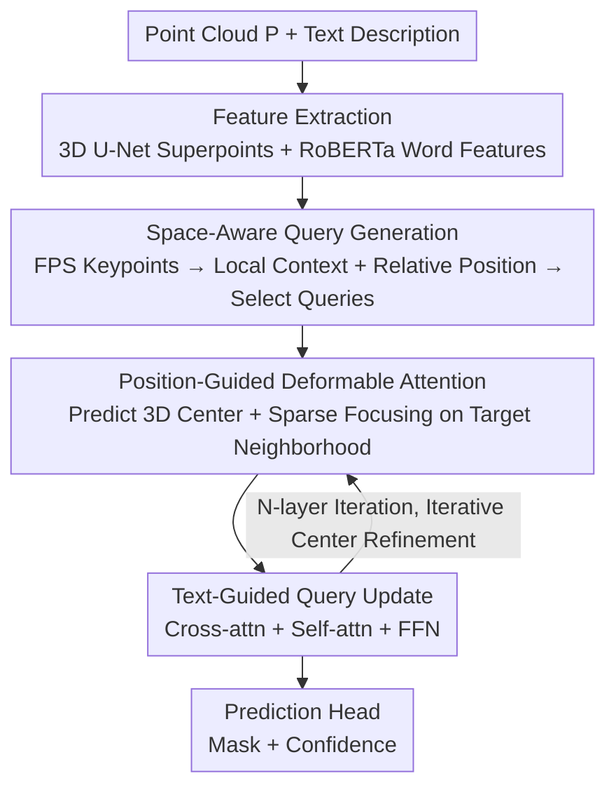

# Spatial Matters: Position-Guided 3D Referring Expression Segmentation

**Conference**: CVPR 2026  
**Paper**: [CVF Open Access](https://openaccess.thecvf.com/content/CVPR2026/html/Wang_Spatial_Matters_Position-Guided_3D_Referring_Expression_Segmentation_CVPR_2026_paper.html)  
**Code**: https://github.com/LiJiaBei-7/Position3D  
**Area**: 3D Vision / Segmentation  
**Keywords**: 3D Referring Expression Segmentation, Spatial Relationship Modeling, Deformable Attention, Point Clouds, Query Generation

## TL;DR
Addressing the limitation where 3D referring expression segmentation (3D-RES) focuses solely on semantics and ignores spatial relationships—leading to failures in distinguishing "multiple similar objects"—Position3D explicitly injects relative spatial positions into two stages: **space-aware query generation** (initializing queries with geometric awareness) and a **position-guided deformable attention decoder** (progressively shrinking attention from global to local targets). It achieves mIoU scores of 51.0 / 53.2 on ScanRefer and Multi3DRefer, significantly outperforming the previous SOTA, IPDN.

## Background & Motivation
**Background**: 3D Referring Expression Segmentation (3D-RES) aims to segment a target object mask in a point cloud scene based on a natural language description (e.g., "the chair near the window"). It serves as a fundamental interaction capability for AR/VR, embodied AI, and robotic manipulation. Early approaches followed a "segment-then-match" two-stage paradigm: generating candidate proposals via 3D instance segmentation followed by linguistic matching. Recent trends have shifted toward one-stage DETR-style encoder-decoder architectures that use object queries for direct target decoding, achieving SOTA results.

**Limitations of Prior Work**: Whether two-stage or one-stage, existing methods rely almost exclusively on **semantic cues** (appearance, category) and lack explicit modeling of **spatial relationships**. While they perform well when semantics are sufficient (e.g., "the black square TV"), they fail in scenes containing multiple visually identical instances (e.g., a row of identical chairs or several toolboxes) where the target must be identified via relative positions ("the second one from the left" or "the green toolbox in front of the red one").

**Key Challenge**: 3D scenes are far more complex than 2D images; objects are scattered across space, and references often combine "target + spatial relationship with surrounding objects." Semantic features lack geometric signals such as adjacency or directional orientation, making it difficult for models to select the correct instance from a group of similar objects.

**Goal**: To **explicitly** incorporate spatial relationships into two critical stages of 3D-RES—query generation and decoder focusing—rather than relying on attention to learn them implicitly.

**Core Idea**: Implement "position guidance" throughout the pipeline. During query generation, pairwise relative positions are injected into point proxies to give queries inherent spatial awareness. During decoding, a 3D center is predicted and refined for each query, using sparse deformable attention to progressively contract the receptive field from global to local target neighborhoods.

## Method

### Overall Architecture
Position3D is a one-stage framework. Inputs consist of a text description and a point cloud scene $P \in \mathbb{R}^{N_p \times 6}$ (xyz coordinates and RGB colors); the output is the target instance mask. The pipeline consists of three stages: **Feature Extraction → Space-Aware Query Generation → Position-Guided Decoder**.

Feature extraction uses a pre-trained RoBERTa for word-level text features $\bar{F}_t$. For point clouds, a sparse 3D U-Net extracts point-wise features, which are then pooled into superpoint features $\bar{F}_s \in \mathbb{R}^{N_s \times D_p}$ (following IPDN, complemented by multi-view 2D features to mitigate 3D representation loss). This is followed by two innovative modules: first, the Space-Aware Query Generation module transforms superpoints into "semantic and geometric-aware" point proxies, selecting those most relevant to the text as decoder queries. Then, the Position-Guided Decoder iteratively refines 3D centers, applies sparse deformable attention, and updates queries through text interaction across $N$ layers to produce the final mask and confidence score.

### Key Designs

**1. Space-Aware Query Generation: Geometrically Initialized Queries**

To solve the issue of queries lacking spatial awareness, the authors construct **space-aware point proxies** instead of using raw FPS (Farthest Point Sampling) points. Initially, keypoints $F_{key} = \bar{F}_s[\text{FPS}(P_s)]$ are selected for geometric coverage. To enrich their context, "Spatial Context Aggregation Blocks" are applied, each consisting of:

- **Local Context Aggregation (LCA)**: For each keypoint, $K_s$ nearest neighbors $F_n$ are identified via KNN. Adaptive weights are calculated: $S = F_{key} F_n^top / \sqrt{D}$, $F_c = \text{Softmax}(S)\cdot F_n$, yielding context-rich local geometry.
- **Space-Aware Interaction (SAI)**: Models global spatial relationships between keypoints. Pairwise relative positions are mapped to high-dimensional embeddings $\text{Rel}(F_{key})_{i,j} = \phi_r(x_i-x_j,\, y_i-y_j,\, z_i-z_j)$ and **added directly to the self-attention scores**: $A_{spa} = \text{Rel}(F_{key}) + Q(F_{key})K(F_{key})^\top/\sqrt{d}$, allowing the attention mechanism to simultaneously consider semantic similarity and spatial geometry.

These are fused into proxies: $F_{proxy} = \phi_{proxy}(F_c + F_{spa}) + F_{key}$. Finally, **Query Selection** is performed by calculating text-proxy similarity $S_{proxy} = \frac{1}{N_t}\sum_i \bar{F}_{t,i}\cdot F_{proxy}^\top$, picking the TopK $N_q$ proxies.

**2. Position-Guided Deformable Attention: Iterative Focus on Target Neighborhoods**

Instead of global attention, each query is assigned a movable 3D center, concentrating computation near the target. Offsets are predicted and refined per layer: $\Delta P^l = \phi_{offset}(Q^l)$, $C^l = C^{l-1} + \Delta P^l$, with $C^0$ initialized from proxy coordinates. Geometric priors are defined as: $\text{Rel}(C^l, P_s) = \phi_g(c_i^x - x_j,\, c_i^y - y_j,\, c_i^z - z_j)$.

The "sparsity" is achieved by attending only to the $m_l$ nearest superpoints, where $m_l$ decreases per layer (e.g., $\{128, 64, 32, 16\}$). This allows the receptive field to shrink from global context to precise local neighborhoods. The geometric prior is added to the attention scores: $A_{pad}^l = \text{Rel}(Q^l, \tilde{F}_s^l) + Q(Q^l)K(\tilde{F}_s^l)^\top/\sqrt{d}$.

**3. Text-Guided Query Update: Semantic Re-alignment**

Following spatial focusing, queries are aligned with the linguistic description. In each layer, cross-attention $Q_t^l = \text{Attention}(\hat{Q}^l, F_t, F_t)$ aligns 3D regions with text semantics, followed by self-attention $Q_s^l = \text{Attention}(Q_t^l, Q_t^l, Q_t^l)$ to capture inter-query dependencies. The combination of spatial focusing and semantic alignment allows queries to converge on the correct target.

### Loss & Training
The prediction head outputs mask $M = Q\cdot\phi_m(\bar{F}_s)^\top$ and confidence $Prob = \phi_{prob}(Q)$. The training objective employs four weighted loss terms: BCE + Dice for masks ($L_{mask}$), BCE for confidence ($L_{cls}$), $L1$ for center distance ($L_{center} = \|C - C_{gt}\|_1$), and a contrastive loss ($L_{contra}$) for text-query alignment. Total loss $L = \lambda_{mask}L_{mask} + \lambda_{cls}L_{cls} + \lambda_{center}L_{center} + \lambda_{contra}L_{contra}$ with weights $1.0 / 0.1 / 0.5 / 0.1$. Implementation details: 256 proxies, 128 queries, 4 decoder layers, $K_s = 32$.

## Key Experimental Results

### Main Results
Evaluated on ScanRefer (51,583 expressions, 800 scenes) across Unique, Multiple, and Overall categories. The "Multiple" subset (81% of data) is the primary test for spatial reasoning:

| Dataset | Metric | Position3D | Prev. SOTA (IPDN) | Gain |
|--------|------|------------|-----------------|------|
| ScanRefer Overall | Acc@0.25 | 61.5 | 60.6 | +0.9 |
| ScanRefer Overall | Acc@0.5 | 56.1 | 54.9 | +1.2 |
| ScanRefer Overall | mIoU | 51.0 | 50.2 | +0.8 |
| ScanRefer Multiple | mIoU | 44.7 | 43.6 | +1.1 |
| Multi3DRefer All | Acc@0.25 | 72.3 | 71.5 | +0.8 |
| Multi3DRefer | mIoU | 53.2 | 51.7 | +1.5 |

Significant improvements were observed on Multi3DRefer, particularly in "multi-target + distractor" scenarios.

### Ablation Study
Breakdown of components on ScanRefer (LCA = Local Context Aggregation, SAI = Space-Aware Interaction, SADA = Position-Guided Deformable Attention):

| Configuration | Acc@0.25 | Acc@0.5 | mIoU | Description |
|------|---------|---------|------|------|
| LCA only (FPS points as queries) | 58.7 | 52.8 | 48.2 | No proxies, significant drop |
| LCA + SAI | 58.6 | 53.3 | 48.5 | Missing position-guided decoder |
| LCA + SADA | 59.2 | 53.8 | 48.9 | Missing spatial interaction |
| SAI + SADA | 59.5 | 54.4 | 49.4 | Missing local context |
| Full model | 61.5 | 56.1 | 51.0 | Complete model |

Removing spatial relationships $Rel(\cdot)$ from query generation dropped mIoU by 1.8%, while removing them from the decoder also caused performance degradation, proving the necessity of spatial modeling in both stages.

### Key Findings
- **Proxy Construction is Fundamental**: Using raw FPS points as queries yields the largest performance drop, indicating that "maturing" points into proxies with semantic/geometric info before selection is crucial.
- **Decreasing Superpoint Count is Optimal**: Using all points or a fixed small number in deformable attention is sub-optimal; the $\{128, 64, 32, 16\}$ sequence balances spatial coverage and compactness.
- **$K_s$ Sweet Spot**: $K_s=32$ is optimal; smaller values (8) lack local geometry, while larger ones (64) introduce noise.
- **Benefits Maximize in Multiple Subset**: Gains are concentrated in ambiguous scenes with similar instances, validating the motivation that spatial relations are key to disambiguation.

## Highlights & Insights
- **End-to-end Position Guidance**: Relative positions are not a "patch" for the decoder but are integrated from query generation through to final decoding, creating a self-consistent pipeline.
- **Explicit Coarse-to-Fine Mechanism**: The combination of center refinement and decreasing superpoint counts transforms the implicit "global-to-local" attention focus into an explicit, controllable mechanism.
- **Relative Position as Attention Bias**: Adding relative positions to attention scores ($A = \text{Rel} + QK^\top/\sqrt{d}$) serves as a lightweight, structural bias that is more direct than simple coordinate concatenation.

## Limitations & Future Work
- **Zero-Target Performance**: Performance on "zero target + distractor" subsets of Multi3DRefer lags behind IPDN—strong spatial focus might cause overconfidence when no target exists.
- **Moderate overall gains**: While surpassing IPDN, the +0.8 mIoU gain on ScanRefer represents a steady improvement rather than a generational leap.
- **Dependency on Clean Coordinates**: The method assumes high-quality 3D coordinates; robustness against sensor noise or incomplete point clouds has not been analyzed.
- **Heuristic Hyperparameters**: The decreasing sequence $\{m_l\}$ is manually tuned; adaptive prediction of these values could be an area for improvement.

## Related Work & Insights
- **vs. IPDN**: IPDN uses multi-view 2D features to supplement 3D data but remains semantic-heavy. Ours reuses these features while adding explicit spatial modeling to outperform in ambiguous multiple-object scenarios.
- **vs. RG-SAN**: RG-SAN decomposes text into object-centric representations (language-side spatial modeling). Ours is complementary, focusing on vision-side spatial modeling (position embeddings + guided attention).
- **vs. MDIN / RefMask3D**: While following the one-stage DETR framework, they rely primarily on semantic interaction. Position3D differentiates itself through iterative 3D centers and sparse deformable attention.

## Rating
- Novelty: ⭐⭐⭐⭐ Explicitly integrating spatial positions from query generation through decoding with iterative centers is a clear and effective approach.
- Experimental Thoroughness: ⭐⭐⭐⭐ Solid results across major benchmarks and extensive ablations, though lacking systematic failure analysis.
- Writing Quality: ⭐⭐⭐⭐ Clear logic, complete formulas, and intuitive visualizations of attention focus.
- Value: ⭐⭐⭐⭐ Provides a transferable spatial modeling paradigm for disambiguating similar objects in 3D localization and detection tasks.

<!-- RELATED:START -->

## Related Papers

- [\[CVPR 2026\] SAQN: Semantic-based Adaptive Query Network for 3D Referring Expression Segmentation](saqn_semantic-based_adaptive_query_network_for_3d_referring_expression_segmentat.md)
- [\[CVPR 2026\] MVGGT: Multimodal Visual Geometry Grounded Transformer for Multiview 3D Referring Expression Segmentation](mvggt_multimodal_visual_geometry_grounded_transformer_for_multiview_3d_referring.md)
- [\[CVPR 2026\] CoSMo3D: Open-World Promptable 3D Semantic Segmentation through LLM-Guided Canonical Spatial Modeling](cosmo3d_open-world_promptable_3d_semantic_segmentation_through_llm-guided_canoni.md)
- [\[CVPR 2026\] Masking Matters: Unlocking the Spatial Reasoning Capabilities of LLMs for 3D Scene-Language Understanding](masking_matters_unlocking_the_spatial_reasoning_capabilities_of_llms_for_3d_scen.md)
- [\[CVPR 2026\] SPE-MVS: Spatial Position Encoding Enhanced Multi-View Stereo with Monocular Depth Priors](spe-mvs_spatial_position_encoding_enhanced_multi-view_stereo_with_monocular_dept.md)

<!-- RELATED:END -->
