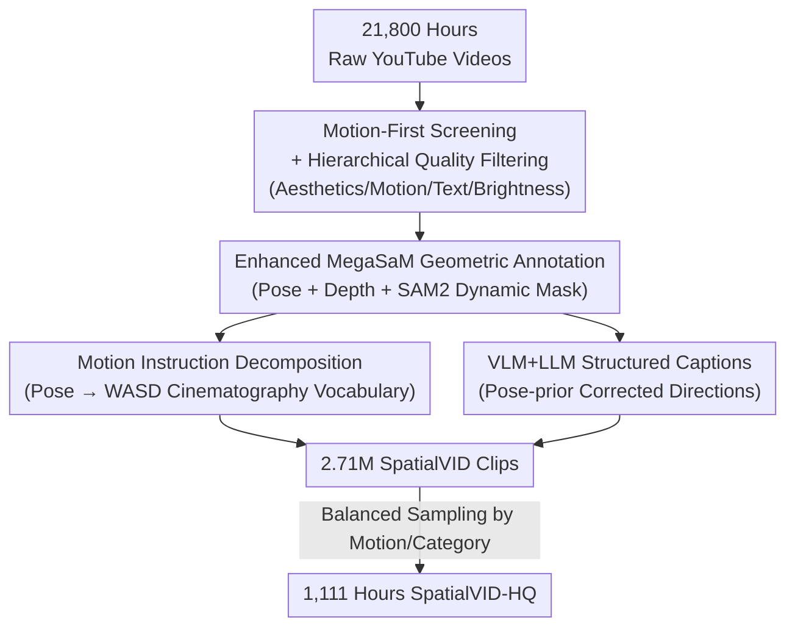

# SpatialVID: A Large-Scale Video Dataset with Spatial Annotations

**Conference**: CVPR 2026  
**Paper**: [CVF Open Access](https://openaccess.thecvf.com/content/CVPR2026/html/Wang_SpatialVID_A_Large-Scale_Video_Dataset_with_Spatial_Annotations_CVPR_2026_paper.html)  
**Code**: https://nju3dv.github.io/projects/SpatialVID/ (Project Page)  
**Area**: 3D Vision / Video Understanding  
**Keywords**: Video Dataset, Camera Pose, Depth Annotation, World Models, Controllable Video Generation

## TL;DR
SpatialVID distills 2.71 million dynamic segments (7,089 hours in total) from 21,000 hours of in-the-wild web videos using a three-stage "hierarchical filtering + geometric/semantic annotation + balanced sampling" pipeline. Each segment includes per-frame camera poses, depth, dynamic masks, structured captions, and serialized motion instructions, representing the largest and most comprehensively annotated video dataset for "dynamic scenes + explicit geometry."

## Background & Motivation
**Background**: Spatial intelligence (spatial reconstruction + world exploration) is rapidly advancing—from feed-forward 3D reconstruction like SfM/MVS to DUSt3R and VGGT, to video generation works like Sora and CogVideoX that treat video generation as "world simulators." Their common bottleneck is not the model, but the training data.

**Limitations of Prior Work**: Existing datasets are split into two incompatible halves. One half consists of **large-scale video datasets** (Panda70M, MiraData), which are semantically rich but lack any 3D ground truth, forcing models to implicitly guess spatial relationships from pixels. The other half consists of **spatial datasets** (CO3D, RealEstate10K, TartanAir), which are geometrically accurate but small in scale, either object-centric, synthetic, or featuring near-static cameras (80% of RealEstate10K consists of static viewpoints).

**Key Challenge**: There is a structural decoupling between "semantically diverse but geometry-less" and "geometrically accurate but semantically poor and static" data. A true world simulator requires **dynamic real-world scenes + explicit geometry + rich semantics** simultaneously, which no existing dataset satisfies.

**Goal**: To create a multimodal dataset that directly connects raw pixels to the physical world—requiring scale (millions of clips), dynamic real-world scenes, and a full suite of per-frame annotations including camera poses, depth, motion instructions, and structured captions.

**Key Insight**: In-the-wild videos naturally encode spatial, temporal, and semantic cues and are inexhaustible. Instead of expensive 3D ground truth acquisition, it is more effective to use a **motion-first** approach to filter clips with rich camera movement and sufficient parallax from massive YouTube resources, then complete the geometry and semantics through an automated annotation pipeline.

**Core Idea**: Use a "filtering $\rightarrow$ annotation $\rightarrow$ sampling" procedural pipeline to distill messy in-the-wild videos into training corpora with explicit 3D annotations, thereby bridging dynamic video and spatial understanding.

## Method

### Overall Architecture
SpatialVID is essentially a **data curation pipeline** rather than a model. The input consists of 33,000 raw YouTube videos (21,800 hours), and the output includes 2.71 million clips with full spatial annotations (SpatialVID) and a 1,111-hour balanced high-quality subset (SpatialVID-HQ). The pipeline consists of three stages:

1.  **Filtering**: Long videos are first cut into 3–15 second clips (standardized with 720P H.265 encoding), resulting in over 7 million candidate clips. These are then filtered through four quality metrics (aesthetics, motion intensity, text interference, and brightness), retaining approximately 2.71 million clips.
2.  **Annotation**: Retained clips are augmented with geometry and semantics—camera poses and depth are estimated using an enhanced MegaSaM, dynamic masks are extracted via SAM2, pose sequences are decomposed into WASD-style motion instructions, and structured captions are generated through VLM+LLM collaboration. This step consumed approximately 69,000 GPU hours (MegaSaM only).
3.  **Sampling**: Quality thresholds are tightened, and balanced sampling is performed based on semantic labels and trajectory statistics to obtain SpatialVID-HQ with a well-distributed category balance.

### Key Designs

**1. Motion-First Manual Pre-screening + Hierarchical Quality Filtering: Excluding "Unreconstructable" Static/Low-quality Clips**

The success of a dataset depends primarily on the source data. General video sets (e.g., Panda70M) only have about 10% of clips meet the requirements of the author's pipeline—many segments are static, flickering, or lack motion descriptions in captions. Consequently, the authors implemented two measures. First, **motion-first collection**: searching YouTube using motion-related keywords like *walk*, *tour*, or *drone* and manually excluding damaged footage, panoramic cameras (which break MegaSaM assumptions), and videos with heavy occlusions or logos, resulting in 33,000 videos with smooth camera trajectories and rich parallax. Second, **four-metric hierarchical filtering**: a CLIP+MLP aesthetics predictor filters unattractive clips, brightness filtering removes over/under-exposed segments, PaddleOCR excludes clips with excessive text area ratios, and a lightweight VMAF metric ensures sufficient motion. Clipping uses a modified PySceneDetect (lower threshold + multi-frame comparison for fade transitions), with all exports standardized to 1280×720 H.265 MP4. This "motion-first + multi-metric" approach directly determines the reliability of downstream camera pose estimation.

**2. Enhanced MegaSaM Geometric Annotation: Reliable Poses, Depth, and Masks in Dynamic Videos**

Geometric annotation in dynamic videos is hindered by moving objects and unreliable monocular depth, which can cause reconstruction failure. The authors use MegaSaM as the primary estimator (the most robust for in-the-wild video) and implement three reinforcements. First, the original MegaSaM depth module is replaced with **UniDepth v2 + Depth Anything v2**, significantly improving depth accuracy. Second, **dynamic masks**: adaptive thresholds and contour detection provide candidate regions, from which anchor points are sampled as SAM2 prompts to extract masks; these are used to calculate the per-frame dynamic ratio. Third, an **acceleration-based detector** identifies abrupt non-physical motion jitter to exclude unreasonable trajectories. To quantify camera motion, three metrics were defined: MoveDist (total trajectory length), RotAngle (cumulative rotation), and TrajTurns (number of significant direction changes)—which are used for trajectory diversity balancing during sampling.

**3. Motion Instruction Decomposition: Translating Continuous Poses into WASD Vocabulary**

To allow the data to supervise navigation/control models (e.g., Hunyuan-GameCraft), camera pose sequences are decomposed into discrete, interpretable motion instructions. Specifically, motion dynamics are read from the relative translation and rotation of adjacent frames. Temporal smoothing filtering is applied to suppress jitter, and magnitude-based thresholds identify "perceivable" motion segments—instructions are only generated when pose changes exceed thresholds to avoid labeling minor vibrations. Finally, motion signals are mapped to a controlled cinematography vocabulary (e.g., *dolly in*, *pan left*, *truck right*) and intuitive control symbols like W/A/S/D. This standardized decomposition is key to transforming "passive video" into "controllable signals."

**4. VLM+LLM Collaborated Structured Captions: Correcting VLM Spatial Hallucinations with Pose Priors**

Pure VLMs (e.g., Gemini) exhibit weak spatial reasoning in video captioning, often reversing camera motion directions. The authors designed a two-stage framework: Stage 1, **visual parsing**, uses Gemini-2.0-Flash to analyze sampled frames and produce initial scene and camera descriptions. Stage 2, **linguistic refinement**, uses Qwen3-30B-A3B with **camera poses as a prior** to correct motion directions and ensure spatial consistency. The refined captions integrate scene semantics, camera motion, and multi-level attributes (scene type, lighting, weather, time, crowd density, etc.), forming a hierarchical text representation (Scene Description / Camera Description / Category Tags / Shot Summary). This makes captions both semantically rich and **spatially grounded**.

## Key Experimental Results
The authors do not just compare SOTA on a single task but use SpatialVID-HQ as training data to verify if models improve across three downstream tasks.

### Main Results: Camera-Controllable Video Generation
Based on the ReCamMaster camera injection mechanism + Wan2.2 architecture, separate versions were trained using RealEstate10K, Sekai-Real, and SpatialVID-HQ, with camera controllability compared across three benchmarks (lower error is better).

| Evaluation Benchmark | Training Data | TransErr $\downarrow$ | RotErr $\downarrow$ | CamMC $\downarrow$ | CLIP-T $\uparrow$ |
| :--- | :--- | :--- | :--- | :--- | :--- |
| RealEstate10K | RE10K | 7.46 | 1.15 | 7.91 | 30.38 |
| RealEstate10K| **SpatialVID-HQ** | **7.42** | **0.99** | **7.72** | **30.54** |
| Sekai | RE10K | 8.17 | 1.51 | 8.78 | 34.97 |
| Sekai | **SpatialVID-HQ** | **6.04** | **1.43** | **6.70** | 35.19 |
| SpatialVID | Sekai-Real | 5.63 | 4.70 | 9.39 | 30.25 |
| SpatialVID | **SpatialVID-HQ** | **4.33** | **3.81** | **7.57** | 30.26 |

On all three benchmarks, models trained with SpatialVID-HQ showed the lowest camera controllability error and the highest CLIP-T (text-video alignment). VBench metrics, particularly Imaging Quality, also showed consistent improvement.

### Cross-task Validation: Novel View Synthesis & Geometry Prediction

| Task | Setting | Training Data | Key Metric | Result |
| :--- | :--- | :--- | :--- | :--- |
| NVS (GS-LRM) | DL3DV Test | RE10K $\rightarrow$ SpatialVID | PSNR $\uparrow$ | 27.01 $\rightarrow$ **27.80** |
| NVS (GS-LRM) | SpatialVID Test | RE10K $\rightarrow$ SpatialVID | PSNR $\uparrow$ | 24.13 $\rightarrow$ **24.97** |
| Pose Est. (CUT3R)| TUM-dynamics | Before $\rightarrow$ After FT | ATE $\downarrow$ | 0.049 $\rightarrow$ **0.040** |
| Pose Est. (VGGT) | TUM-dynamics | Before $\rightarrow$ After FT | ATE $\downarrow$ | 0.015 $\rightarrow$ **0.013** |

After GS-LRM was trained on a SpatialVID subset (segment count aligned with RealEstate10K), it outperformed RE10K across PSNR/SSIM/LPIPS on both DL3DV and SpatialVID. For pose estimation, both CUT3R and VGGT improved after fine-tuning on TUM-dynamics dynamic scenes.

### Key Findings
- **Data Quality Distribution is the Core Selling Point**: Fig. 5 shows that 83.7% of Panda70M clips cannot be reconstructed by MegaSaM due to insufficient motion (TrajTurns), while SpatialVID-HQ deliberately increases the proportion of clips with curved/turning trajectories, making the motion distribution more balanced and realistic.
- **Balanced Sampling is Meaningful**: In SpatialVID (2.71M clips), 52.9% are 0-turn segments, whereas the curated SpatialVID-HQ reduces 0-turn clips to 30.7% and increases 1-turn clips to 53.5%, actively enriching samples with more complex motion.
- **VGGT is Near its Ceiling**: Since it was already trained on multiple 3D datasets and performs strongly, fine-tuning on SpatialVID yielded only minor fluctuations, indicating limited gains for saturated strong models but significant gains for models like CUT3R.

## Highlights & Insights
- **"Motion-first" Curation Philosophy**: Screening videos based on camera motion richness at the source rather than collecting and then filtering avoids the pitfall of general video sets where 90% of clips are unusable.
- **Using Pose Priors to Cure VLM Direction Hallucinations**: Correcting VLM-generated motion directions using camera poses is a low-cost, high-impact trick applicable to any "spatial-language alignment" captioning scenario.
- **Discretizing Continuous Motion into WASD Vocabularies**: Mapping pose sequences $\rightarrow$ cinematography terms $\rightarrow$ game controls transforms video data into supervision signals for controllable generation/world models.
- **Quantitative Metrics for Camera Motion**: (MoveDist/RotAngle/TrajTurns) are used for both filtering and balanced sampling, providing an operational definition for "motion diversity."

## Limitations & Future Work
- **Inheritance of MegaSaM Failure Modes**: Annotations degrade in extreme scenarios such as object-dominated frames, zooming, or severe radial distortion. Predicted poses can remain non-metric in specific cases.
- **Annotation Quality Bound by Existing Estimators**: The ceiling for geometric annotation is set by MegaSaM; the authors hope to replace it with stronger estimators like ViPE in the future.
- **Downstream Gains Depend on Task Difficulty**: Improvements are limited for established tasks like RealEstate10K but more pronounced for dynamic scene tasks (TUM-dynamics).
- **Future Improvements**: Upgrading dynamic masks to robust segmentation, introducing metric depth annotations, and adding more modalities like audio.

## Related Work & Insights
- **vs. RealEstate10K / CO3D**: These are geometrically accurate but static/object-centric and small. SpatialVID provides millions of dynamic, open-world clips with added depth, masks, and instructions.
- **vs. Panda70M / MiraData**: These are semantically rich but lack 3D GT and are mostly static. Processing the Panda70M val set through this pipeline yielded only a 10% success rate, highlighting the "dynamic + explicit geometry" differentiation.
- **vs. DynPose100K / CamVid-30K**: These also mine poses from video, but SpatialVID is more comprehensive in scale and annotation richness (depth + captioning + instructions).

## Rating
- **Novelty**: ⭐⭐⭐⭐ While not a new model, the combination of "dynamic real scenes + full explicit geometric/semantic annotation + million-scale" is unique.
- **Experimental Thoroughness**: ⭐⭐⭐⭐⭐ Demonstrated "data swap" controls across controllable video generation, NVS, and pose estimation.
- **Writing Quality**: ⭐⭐⭐⭐ The three-stage pipeline is clearly narrated with sufficient diagrams.
- **Value**: ⭐⭐⭐⭐⭐ Directly addresses the scarcity of training data for spatial intelligence and world models.

<!-- RELATED:START -->

## Related Papers

- [\[CVPR 2026\] SceneScribe-1M: A Large-Scale Video Dataset with Comprehensive Geometric and Semantic Annotations](scenescribe-1m_a_large-scale_video_dataset_with_comprehensive_geometric_and_sema.md)
- [\[CVPR 2026\] Ego-1K: A Large-Scale Multiview Video Dataset for Egocentric Vision](ego-1k_--_a_large-scale_multiview_video_dataset_for_egocentric_vision.md)
- [\[CVPR 2026\] OLATverse: A Large-scale Real-world Object Dataset with Precise Lighting Control](olatverse_a_large-scale_real-world_object_dataset_with_precise_lighting_control.md)
- [\[CVPR 2026\] 3DReflecNet: A Large-Scale Dataset for 3D Reconstruction of Reflective, Transparent, and Low-Texture Objects](3dreflecnet_a_large-scale_dataset_for_3d_reconstruction_of_reflective_transparen.md)
- [\[CVPR 2026\] Scaling4D: Pushing the Frontier of Video Novel View Synthesis through Large-Scale Monocular Videos](scaling4d_pushing_the_frontier_of_video_novel_view_synthesis_through_large-scale.md)

<!-- RELATED:END -->
