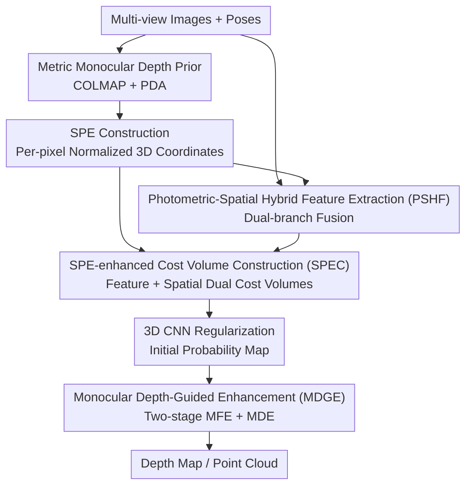

# SPE-MVS: Spatial Position Encoding Enhanced Multi-View Stereo with Monocular Depth Priors

**Conference**: CVPR 2026  
**Paper**: [CVF Open Access](https://openaccess.thecvf.com/content/CVPR2026/html/Wang_SPE-MVS_Spatial_Position_Encoding_Enhanced_Multi-View_Stereo_with_Monocular_Depth_CVPR_20_paper.html)  
**Code**: https://github.com/bdwsq1996/SPE-MVS  
**Area**: 3D Vision / Multi-View Stereo / Depth Estimation  
**Keywords**: Multi-View Stereo, Spatial Position Encoding, Monocular Depth Priors, Cost Volume, Weak-texture Reconstruction

## TL;DR
SPE-MVS utilizes metric monocular depth priors to construct a "Spatial Position Encoding (SPE)" in a unified coordinate system for each pixel across views. This encoding is fed into feature extraction and cost volume construction alongside the images. A monocular depth-guided two-stage refinement module is then used to polish the probability maps, significantly improving MVS reconstruction quality in areas where photometric matching fails, such as weak-textured and non-Lambertian surfaces.

## Background & Motivation

**Background**: Learning-based Multi-View Stereo (MVS) has become the mainstream, typically following a four-step pipeline: "Image Feature Extraction → Cost Volume Construction → Regularization → Depth Regression." The core objective is determining the optimal depth through multi-view feature similarity (e.g., MVSNet series, cascaded multi-scale, iterative refinement, Transformer enhancement).

**Limitations of Prior Work**: This pipeline essentially **overs-relies on photometric similarity across views** to represent matching correspondence. In weak-textured regions and on non-Lambertian surfaces, photometric differences are indistinct and the photometric consistency assumption fails, leading to poor reconstruction robustness in these "hard areas" and limiting the deployment of MVS in complex real-world scenes.

**Key Challenge**: Matching signals in MVS are almost entirely dependent on photometry, which is precisely at its most unreliable in the most difficult regions. To break through this limitation, complementary additional priors must be introduced.

**Goal**: To identify a prior that remains reliable in weak-textured/non-Lambertian areas and can be integrated into multi-view matching, systematically reducing MVS's dependence on photometric matching.

**Key Insight**: Metric monocular depth estimation (e.g., Prior Depth Anything) has become highly effective—it can produce scale-consistent dense depth from a single image plus sparse depth. While its absolute accuracy may not match MVS, it maintains **excellent surface consistency and robustness in weak-textured/non-Lambertian regions**. Existing methods like MonoMVSNet only use monocular cues in the reference view, failing to exploit their full potential.

**Core Idea**: Transform the metric monocular depth of each view into the reference coordinate system, encoding it as per-pixel "Spatial Position Encoding (SPE)." This allows the MVS system to obtain "spatial position similarity" alongside photometric similarity, while using monocular features/depth to guide the refinement of probability maps.

## Method

### Overall Architecture
SPE-MVS takes multi-view images with known poses as input and outputs a depth map for the reference view (subsequently fused into a point cloud). It first utilizes COLMAP to generate sparse depth for each view and employs a pre-trained monocular depth model (PDA) to obtain **metric monocular depth maps**. These depths are projected and normalized to the reference coordinate system to be encoded as per-pixel **Spatial Position Encoding (SPE)**. The SPE and original images are input into the **Photometric-Spatial Hybrid Feature Extractor (PSHF)** to obtain multi-scale fused features. Simultaneously, the **SPE-enhanced Cost Volume Construction (SPEC)** fuses the "feature similarity cost volume" with the "spatial position similarity cost volume." After regularization, an initial depth probability map is obtained. Finally, the **Monocular Depth-Guided Enhancement (MDGE)** refines the probability map in two stages using reference monocular features and depth.

### Key Designs

**1. Spatial Position Encoding (SPE): Converting Monocular Depth into Per-pixel 3D Positions in a Unified Coordinate System**

To address the failure of photometric matching in difficult areas, a position signal independent of photometry is introduced. For the monocular depth $D_i^m$ of each view $I_i$, the pixel $p=[u_i,v_i]$ is back-projected to the **reference coordinate system** using camera parameters: for the reference view $P_0 = D_0^m(p) \cdot K_0^{-1} \cdot [u_0,v_0,1]^\top$, and for source views $P_i = D_i^m(p)\cdot R_i \cdot (K_i^{-1}\cdot[u_i,v_i,1]^\top) + t_i$. Since image sizes and depth ranges vary significantly across scenes, normalization is performed using $H$, $W$, and $d_{max}$ of the reference view: $[X_{max},Y_{max},d_{max}]^\top = d_{max}\cdot K_0^{-1}\cdot[W,H,1]^\top$, resulting in $S_i(p) = [X_i/X_{max},\,X_i/Y_{max},\,D_i^m(p_i)/d_{max}]^\top$, which yields $S_i \in \mathbb{R}^{3\times H\times W}$. This assigns a normalized 3D coordinate in a unified space to each pixel. The metric monocular depth itself is guided by COLMAP sparse depth and generated by PDA to ensure scale consistency—a prerequisite for reliable SPE.

**2. Photometric-Spatial Hybrid Feature Extractor (PSHF): Dual-branch Fusion for Appearance and Position Awareness**

Traditional MVS extracts features solely from images, which are constrained by photometry. PSHF is a **dual-branch fusion FPN**: the encoder uses two branches to extract and aggregate features from images $\{I_i\}$ and SPE $\{S_i\}$ respectively, constructing multi-scale hybrid features $\{F_i^k\}$ in the decoder (four scales $k=0,1,2,3$, resolutions $\frac{H}{2^{3-k}}\times\frac{W}{2^{3-k}}$, channels 64/32/16/8). The authors compared "input-level channel concatenation" and "separate dual-encoder" architectures, finding that dual-branch fusion significantly outperformed the others—indicating that **sufficient aggregation** of the two input types is more critical than simple concatenation.

**3. SPE-enhanced Cost Volume Construction (SPEC): Constructing Spatial Position Similarity Beyond Feature Similarity**

Enhancing features alone is insufficient; the matching similarity itself should include a spatial dimension. SPEC constructs and fuses two cost volumes at each scale. Based on depth hypotheses $\{d_j^k\}$, homography transformation $p_{i,j} = K_i\cdot(R_i\cdot(K_0^{-1}\cdot p\cdot d_j^k)+t_i)$ finds corresponding pixels. **Feature similarity** uses group-wise correlation $c_F^{i,k}(p,d_j^k)=\langle F_0^k(p),F_i^k(p_{i,j})\rangle_g$, while **spatial similarity** uses the squared difference of SPE: $c_S^{i,k}(p,d_j^k)=(S_0^k(p)-S_i^k(p_{i,j}))^2$. These are aggregated into feature cost volume $C_F^k$ (pixel-weighted) and SPE cost volume $C_S^k$ (averaged over source views), then fused via 3D CNN: $C^k = f_{3d}([f_{3d}(C_S^k),\,C_F^k])$. Spatial similarity remains discriminative where photometry fails—pixels that align spatially will naturally have a small squared difference—which is the source of performance gains in difficult areas.

**4. Monocular Depth-Guided Enhancement (MDGE): Two-stage Probability Map Refinement for Surface Smoothness**

A key advantage of monocular depth is its naturally continuous surface representation, providing smooth depth even in weak-textured areas. MDGE performs two-step refinement at the probability map level. **MFE (Monocular Feature Enhancement)** first modifies the probability map using high-level features: one branch applies a 2D CNN to $[F_0^k, F_m^k, P_{init}^k]$ (reference features, monocular features, initial probability volume), while another applies a 3D CNN to $P_{init}^k$. The result is $P_f^k = f_{3d}(f_{3d}(P_{init}^k) + f_{2d}([F_0^k,F_m^k,P_{init}^k]))$. **MDE (Monocular Depth Enhancement)** has a similar structure but replaces features with depth: using monocular depth $D_m^{0,k}$ and $D_f^k$ (from soft-argmax of the MFE output), it computes $P_d^k = f_{3d}(f_{3d}(P_f^k)+f_{2d}([D_f^k, D_m^{0,k}, P_f^k]))$, emphasizing geometric consistency and surface continuity.

### Loss & Training
Cross-entropy loss is applied to all predicted probability maps at all scales, including the three probability maps from MDGE (initial, post-MFE, post-MDE): $L = \sum_{k=0}^{3} -P_{gt}^k(\log(P_{init}^k) + \log(P_f^k) + \log(P_d^k))$. Training proceeds in two stages: 15 epochs on DTU, followed by 10 epochs of fine-tuning on BlendedMVS. During DTU training, $N=5$ views and depth hypothesis numbers $Z_k=32/16/8/4$ are used with an Adam optimizer and OneCycleLR (initial LR 0.001). For BlendedMVS, $N=7$ and resolution is 576×768. Evaluation on DTU uses 5 views at 1152×1600, while Tanks & Temples uses 21 views at 1056×1920.

## Key Experimental Results

### Main Results
DTU results use Overall/Acc./Comp. (mm, lower is better); Tanks & Temples results use F1-score (higher is better).

| Dataset | Metric | Ours | MonoMVSNet | MVSFormer++ |
|--------|------|------|------------|-------------|
| DTU | Overall↓ | **0.272** | 0.278 | 0.281 |
| DTU | Acc.↓ | 0.324 | 0.313 | 0.309 |
| DTU | Comp.↓ | **0.220** | 0.243 | 0.252 |
| T&T Intermediate | Mean F1↑ | **69.13** | 68.63 | 67.18 |
| T&T Advanced | Mean F1↑ | **44.72** | 43.58 | 41.60 |

On DTU, the proposed method achieves SOTA in Overall and Completeness. Compared to MonoMVSNet, which also uses monocular priors, Overall decreased from 0.278 to 0.272 and Completeness significantly improved from 0.243 to 0.220, indicating that SPE and MDGE focus on "completing difficult regions." On Tanks & Temples, SOTA performance was achieved on both sets.

### Ablation Study
Ablation on DTU using the ET-MVSNet backbone as the baseline:

| Configuration | Overall↓ | Acc.↓ | Comp.↓ | Description |
|------|----------|-------|--------|------|
| Baseline | 0.298 | 0.342 | 0.254 | Backbone only |
| + PSHF | 0.283 | 0.336 | 0.230 | Hybrid features, large Comp. gain |
| + SPEC | 0.288 | 0.340 | 0.236 | Spatial cost volume |
| + MDGE | 0.286 | 0.330 | 0.242 | Monocular refinement |
| + PSHF + SPEC | 0.279 | 0.331 | 0.227 | SPE modules synergy |
| Full Model | **0.272** | **0.324** | **0.220** | Complete SPE-MVS |

### Key Findings
- PSHF and SPEC, the modules directly related to SPE, primarily drive the improvement in **Completeness** (0.254 → 0.230 / 0.236), confirming that spatial position information addresses reconstruction fragmentation in difficult areas. MDGE provides balanced improvements across Accuracy and Completeness.
- In PSHF structural comparisons, dual-branch fusion (Overall 0.272) was significantly better than input concatenation (0.277) or dual encoders (0.276), showing that the two input types must be **fully aggregated** throughout the encoding-decoding process.
- In MDGE component ablation, MFE (feature enhancement) contributed more than MDE. Removing either monocular features (MF) or monocular depth (MD) priors led to a significant performance drop.

## Highlights & Insights
- **"Spatial Position Similarity" as a Clever New Matching Cue**: While MVS has relied on photometry for decades, this work uses the squared difference of normalized 3D positions to create a similarity measure orthogonal to photometry. This is a generalizable increment that can be integrated into any MVS cost volume framework.
- **"Exhaustive" Monocular Depth Usage**: Unlike MonoMVSNet, which only uses monocular cues in the reference view, SPE provides per-pixel 3D positions for **all views**. This "all-view + all-pixel" approach is key to the gains in completeness and can be migrated to stereo matching or depth completion.
- **Two-stage Probability Map Refinement (MFE→MDE)**: Injecting monocular priors from "feature" and "depth" perspectives separately, rather than all at once, is a graduated multi-modal refinement design worth emulating.

## Limitations & Future Work
- The pipeline depends on COLMAP sparse reconstruction and PDA monocular depth as prerequisites for SPE. If COLMAP fails in extremely weak-textured scenes or monocular scale alignment is off, SPE quality will suffer.
- The Accuracy on DTU is not optimal (0.324), indicating that SPE primarily trades improved completeness for limited accuracy gains, suggesting an Acc.↔Comp. trade-off.
- The computational and memory overhead increases due to multi-view SPE construction, dual-branch features, dual cost volumes, and two-stage refinement; a detailed efficiency analysis was not provided.
- Integrating the monocular depth model (PDA/DepthAnything) for joint end-to-end optimization or scene adaptation remains a potential future direction.

## Related Work & Insights
- **vs. MonoMVSNet**: Both use monocular depth priors, but MonoMVSNet only applies monocular features to the reference view to optimize depth search ranges. Ours constructs per-pixel SPE for **all views**, integrating them into both feature extraction and cost volume construction for more thorough prior utilization.
- **vs. Traditional Photometric MVS (MVSFormer++/ET-MVSNet)**: These methods improve difficult areas by enhancing feature extraction, but the matching signal remains photometric. Ours introduces an **entirely new spatial position matching path**, fundamentally easing the reliance on photometric consistency.

## Rating
- Novelty: ⭐⭐⭐⭐ The use of "Spatial Position Encoding" as a complementary matching signal is a clear and solid increment to the mature MVS pipeline.
- Experimental Thoroughness: ⭐⭐⭐⭐⭐ DTU and T&T benchmarks combined with three layers of ablation provide strong support for the conclusions.
- Writing Quality: ⭐⭐⭐⭐ The four-module pipeline is clearly explained, with good correspondence between formulas and diagrams.
- Value: ⭐⭐⭐⭐ SOTA improvements in completeness for difficult areas are practically significant for real-world reconstruction.

<!-- RELATED:START -->

## Related Papers

- [\[CVPR 2026\] Unsupervised Monocular 3D Keypoint Discovery from Multi-View Diffusion Priors](unsupervised_monocular_3d_keypoint_discovery_from_multi-view_diffusion_priors.md)
- [\[CVPR 2026\] Spatial Matters: Position-Guided 3D Referring Expression Segmentation](spatial_matters_position-guided_3d_referring_expression_segmentation.md)
- [\[CVPR 2026\] LiDAR Prompted Spatio-Temporal Multi-View Stereo for Autonomous Driving](lidar_prompted_spatio-temporal_multi-view_stereo_for_autonomous_driving.md)
- [\[CVPR 2026\] Learning Multi-View Spatial Reasoning from Cross-View Relations](learning_multi-view_spatial_reasoning_from_cross-view_relations.md)
- [\[CVPR 2026\] Iris: Bringing Real-World Priors into Diffusion Model for Monocular Depth Estimation](iris_bringing_realworld_priors_into_diffusion_model_for_monocular_depth_estimation.md)

<!-- RELATED:END -->
