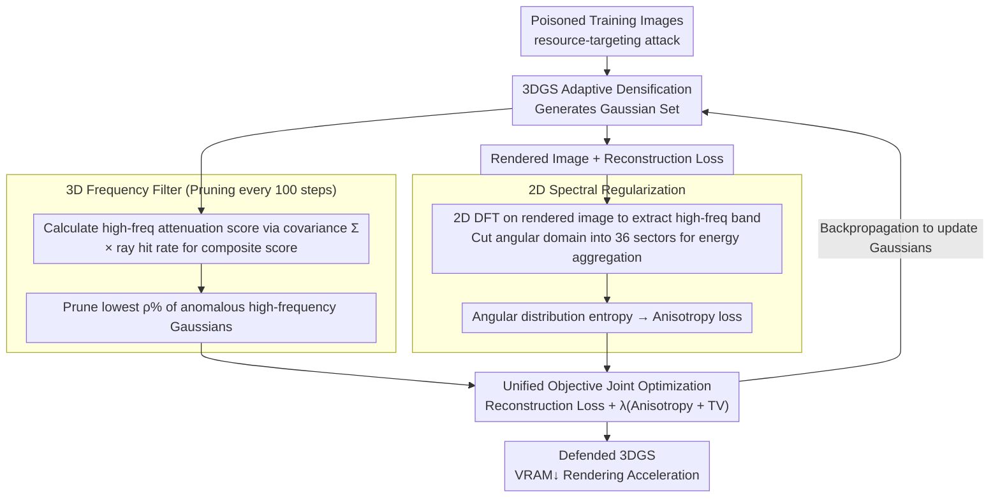

# Spectral Defense Against Resource-Targeting Attack in 3D Gaussian Splatting

**Conference**: CVPR2026  
**arXiv**: [2603.12796](https://arxiv.org/abs/2603.12796)  
**Code**: TBD  
**Area**: 3D Vision  
**Keywords**: 3D Gaussian Splatting, Adversarial Defense, Resource-exhaustion Attack, Frequency Domain Analysis, Gaussian Pruning, Spectral Regularization

## TL;DR

The first frequency-domain defense framework against resource-targeting attacks in 3DGS is proposed. By selectively pruning anomalous high-frequency Gaussians with a 3D frequency filter and constraining anisotropic noise in rendered images via 2D spectral regularization, it suppresses Gaussian overgrowth by up to 5.92×, reduces VRAM by up to 3.66×, and accelerates rendering by up to 4.34× under attack, while maintaining reconstruction quality.

## Background & Motivation

**Security blind spot of 3DGS**: 3D Gaussian Splatting matches scene complexity through an adaptive densification mechanism, but this flexibility exposes a new attack surface—resource-targeting attacks. Adversaries can poison training images to induce extreme overgrowth of Gaussian primitives, leading to GPU memory exhaustion and a sharp decline in training/rendering speeds.

**Failure of existing defenses**: Simple defenses proposed in Poison-Splat (image smoothing or uniform Gaussian count thresholds) have significant flaws—smoothing destroys valid structural details, and uniform thresholds fail to generalize across varying scene complexities, being too restrictive for some and too lenient for others.

**Inapplicability of efficiency pruning**: Efficiency-oriented pruning strategies like LightGaussian and PUP are designed for clean inputs. Under poisoned inputs, they struggle to distinguish fine details from malicious noise textures, making it impossible to reliably identify and remove attack-induced Gaussians.

**Unreliability of spatial domain detection**: Poisoning perturbations are extremely stealthy in pixel space (constrained by $\epsilon$-ball), yet they manifest as anomalous high-frequency amplification and directional anisotropy in the frequency domain. Spatial domain methods fail to capture these spectral distortions.

**Frequency-domain root cause analysis**: Authors observe that the fundamental cause of overgrowth lies in spectral behavior rather than spatial structure—poisoned images exhibit anomalous energy concentration and directional bias in high-frequency Fourier regions, misleading the optimizer to interpret noise patterns as detailed structures.

**Infeasibility of direct high-frequency suppression**: Natural scenes also contain legitimate high-frequency components (edges, textures). Crude filtering severely damages reconstruction fidelity; thus, more refined frequency-domain priors are required to distinguish legitimate high frequencies from malicious ones.

## Method

### Overall Architecture

The core of resource-targeting attacks is poisoning training images to induce the 3DGS adaptive densification mechanism to produce excessive Gaussian primitives, consuming VRAM and hindering rendering. Authors found the root cause is spectral: poisoned images show anomalous energy concentration and directional bias in high-frequency Fourier regions, misidentifying noise as detail. Spectral Defense employs a dual-layered approach: periodically pruning "anomalous high-frequency" Gaussians in the 3D parameter space using a frequency filter, and suppressing anisotropic noise in the 2D rendered image frequency domain via a regularization term. Both are jointly optimized with reconstruction and total variation losses.

### Key Designs

**1. 3D Frequency Filter: Removing Malicious Gaussians by Frequency Response**

Efficiency pruning for clean inputs (LightGaussian, PUP) fails in poisoned scenarios because they cannot distinguish between fine details and malicious noise textures. A different criterion is used: the covariance matrix $\Sigma$ of each Gaussian $G$ entirely determines its frequency response. After Fourier transform, the amplitude decays as $\gamma(t) = (2\pi)^{3/2}|\Sigma|^{1/2}\exp(-2\pi^2 t^\top \Sigma t)$. The smaller the minimum eigenvalue $\sigma_{\min}$, the stronger the high-frequency response. Accordingly, a high-frequency attenuation score is calculated at a fixed cutoff frequency $t=8$: $\mathcal{S}(G) = \exp(-2\pi^2 t^2 \sigma_{\min}^2)$. This is converted into a frequency-aware weight $\mathcal{W}(G) = (1 - \mathcal{S}(G))^\alpha$ ($\alpha=2$) such that anomalous high-frequency Gaussians receive low weights. This weight is multiplied by the ray hit rate to yield a composite score $\text{score}(G) = \mathcal{W}(G) \cdot \text{hit}(G)$ to account for geometric visibility. Every $T_{\text{prune}}=100$ steps, scores are computed for $K^*=48$ randomly sampled views, and the lowest $\rho\%$ of Gaussians are pruned—precisely targeting attack-induced Gaussians without damaging legitimate edge textures.

**2. 2D Spectral Regularization: Capturing Poisoning Signals via Angular Anisotropy**

Poisoning perturbations are constrained by ε-ball in pixel space, making them nearly invisible in the spatial domain, but they are exposed as sharp directional concentrations in the frequency domain. Regularization first applies 2D DFT to the rendered image, extracting the high-frequency band $\mathcal{E}(u,v)$ (where energy falls in $[\dot{\gamma}_{\min}, \dot{\gamma}_{\max}] = [0.3, 0.9]$). The angular domain $[-\pi, \pi)$ is divided into $B=36$ uniform sectors to aggregate energy $\mathcal{E}_b$, which is then normalized into a probability distribution $\mathcal{P}_b$. Clean images are approximately isotropic in high-frequency regions (uniform distribution), whereas poisoned images show sharp concentration in few directions (anisotropy). Information entropy is used to quantify this uniformity; the anisotropy loss is $\mathcal{L}_{\text{ani}} = 1 - \mathcal{H}/\log B$ (where $\mathcal{H}$ is entropy). Lower entropy signifies stronger anisotropy and higher penalty, pushing the rendering towards an isotropic natural distribution.

### Loss & Training

$$\min_{\mathcal{G}} \Big(\mathcal{L}(\dot{\mathcal{V}}^p, \mathcal{V}^p) + \lambda\big(\mathcal{L}_{\text{freq}}(\dot{\mathcal{V}}^p) + \mathcal{L}_{\text{tv}}(\dot{\mathcal{V}}^p)\big)\Big)$$

Where $\mathcal{L}$ is the standard 3DGS reconstruction loss ($L_1 + \text{D-SSIM}$), $\mathcal{L}_{\text{freq}}$ is the mean anisotropy loss across views, $\mathcal{L}_{\text{tv}}$ is the total variation loss, and $\lambda$ is set to 4–5 based on scene complexity.

## Key Experimental Results

### Experimental Settings

- **Datasets**: Tanks and Temples (21 scenes), NeRF-Synthetic (8 objects), Mip-NeRF 360 (9 scenes)
- **Baselines**: Universal Threshold (UT▽), LightGaussian (LG▽), PUP 3D-GS (PUP▽), all implemented under poisoned settings
- **Metrics**: Gaussian count, peak GPU VRAM, training time, FPS, PSNR, SSIM
- **Hardware**: Single NVIDIA RTX A6000

### Main Results

| Dataset | Metric | Clean | Poison | Defense | Effect |
|--------|------|-------|--------|---------|---------|
| TT (avg) | Gaussians (M) | 1.751 | 2.889 (1.65×↑) | 1.128 (2.56×↓) | Effectively suppressed |
| NS (avg) | Gaussians (M) | 0.291 | 0.720 (2.47×↑) | 0.273 (2.64×↓) | Lower than clean |
| MIP (avg) | Gaussians (M) | 3.191 | 7.045 (2.21×↑) | 1.876 (3.76×↓) | Significant compression |
| MIP-bonsai | Gaussians (M) | 1.273 | 6.139 (4.82×↑) | 1.037 (**5.92×↓**) | Best performing |
| TT-Train | Peak VRAM (MB) | 5674 | 15805 (2.79×↑) | 4324 (**3.66×↓**) | Best performing |
| MIP-garden | FPS | — | 48 (poison) | 208 (**4.34×↑**) | Best performing |

Regarding rendering quality, the defense method outperforms other pruning baselines on all scenes; for example, MIP-bonsai PSNR improved from 27.14 (poison) to 29.07 (Defense), whereas UT▽ only achieved 22.68.

### Ablation Study

| Factor | Key Findings |
|---------|---------|
| Reference frequency $t$ and index $\alpha$ | $t=8, \alpha=2$ is optimal; results are stable across settings |
| Pruning ratio $\rho$ and sample count $K^*$ | $\rho=3\%, K^*=48$ offers the best balance for NS; higher $\rho$ harms PSNR |
| Frequency thresholds $[\dot{\gamma}_{\min}, \dot{\gamma}_{\max}]$ | [0.3, 0.9] is globally optimal; the method is robust to hyperparameters |
| Sector count $B$ | $B=36$ is best; excessively large $B$ causes Gaussian count to rebound |
| Loss weight $\lambda$ | 4 for TT/NS, 5 for MIP; excessively high $\lambda$ over-suppresses natural patterns |
| Attack strength $\epsilon$ | Effectively defends from $\epsilon=8/255$ to unconstrained attacks; gains are more significant under strong attacks |

### Key Findings

- Under the defense setting, Gaussian counts can even be compressed **below the clean setting** (e.g., NS average 0.273M vs clean 0.291M), indicating frequency filtering also removes redundancy in original scenes.
- Applying the defense on clean inputs is also effective (Table 4); for MIP-bicycle, Gaussian count dropped from 5.782M to 1.339M (4.32×↓), demonstrating utility as an efficiency optimizer.
- Black-box attack experiments (Table 5): When attacks are generated based on 3DGS but the victim is Scaffold-GS, the defense remains effective, showing cross-architecture generalization.

## Highlights & Insights

- **Novelty**: First defense framework specifically targeting resource-targeting attacks in 3DGS, filling a gap in 3DGS security research.
- **Spectral Perspective**: Root causes of attacks are analyzed via spectral behavior, identifying high-frequency anisotropy as the core signal, which is more principled than spatial domain methods.
- **Dual Defense**: 3D frequency filtering addresses parameter space redundancy, while 2D spectral regularization corrects image-domain noise; the two are more effective together than in isolation.
- **Practicality**: Acts as a plug-and-play module in the training loop without requiring clean supervision. It can also serve as an efficiency optimization tool for non-attack scenarios.
- **Experimental Thoroughness**: Extensive evaluation across 38 scenes in 3 datasets, covering clean/poison/defense settings with comprehensive ablations.

## Limitations & Future Work

- Requires manual adjustment of $\rho$ and $\lambda$ for different scene scales (3%/4 for NS, 4.5%/4 for TT, 5%/5 for MIP), limiting automation.
- Spectral regularization is based on global DFT, which might be less sensitive to localized attack patterns (e.g., perturbations affecting only a specific image region).
- Only Poison-Splat was used for verification; possible adaptive adversarial attacks specifically designed to bypass frequency defenses were not evaluated.
- Training time for complex scenes (e.g., MIP-counter) only decreased slightly (1.12×↓), showing a ceiling for efficiency gains in large scenes.
- Cutoff frequency $t$ is fixed as a global constant rather than adaptively adjusted based on scene content.

## Related Work & Insights

- **Poison-Splat** [Lu et al., 2024]: First resource-targeting attack on 3DGS, providing the basis for this work's attack setting.
- **LightGaussian** [Fan et al., 2024]: Gaussian pruning based on importance scores, used as a baseline.
- **PUP 3D-GS** [Hanson et al., 2025]: Another pruning strategy used as a baseline.
- **Scaffold-GS** [Lu et al., 2024]: Anchor-based Gaussian representation used for black-box generalization experiments.
- **MaskGaussian** [Liu et al., 2025]: Pruning strategy using learnable masks.
- **3DGS Security Research**: StealthAttack [Ke et al., 2025] targets accuracy; IPA-NeRF [Jiang et al., 2024] targets NeRF poisoning.

## Rating

- Novelty: ⭐⭐⭐⭐ — First defense for 3DGS resource attacks with a unique spectral perspective.
- Experimental Thoroughness: ⭐⭐⭐⭐⭐ — 38 scenes across 3 datasets, multiple baselines, thorough ablation, and black-box/clean generalization.
- Writing Quality: ⭐⭐⭐⭐ — Clear structure, rigorous frequency domain derivation, and informative charts.
- Value: ⭐⭐⭐⭐ — Fills a gap in security defense and offers practical efficiency optimization utility.

<!-- RELATED:START -->

## Related Papers

- [\[CVPR 2026\] FastGS: Training 3D Gaussian Splatting in 100 Seconds](fastgs_training_3d_gaussian_splatting_in_100_seconds.md)
- [\[CVPR 2026\] VarSplat: Uncertainty-aware 3D Gaussian Splatting for Robust RGB-D SLAM](varsplat_uncertainty-aware_3d_gaussian_splatting_for_robust_rgb-d_slam.md)
- [\[CVPR 2026\] Rethinking Pose Refinement in 3D Gaussian Splatting under Pose Prior and Geometric Uncertainty](rethinking_pose_refinement_in_3d_gaussian_splatting_under_pose_prior_and_geometr.md)
- [\[CVPR 2026\] Speeding Up the Learning of 3D Gaussians with Much Shorter Gaussian Lists](speeding_up_the_learning_of_3d_gaussians_with_much_shorter_gaussian_lists.md)
- [\[CVPR 2026\] Where, What, Why: Toward Explainable 3D-GS Watermarking](where_what_why_toward_explainable_3d-gs_watermarking.md)

<!-- RELATED:END -->
