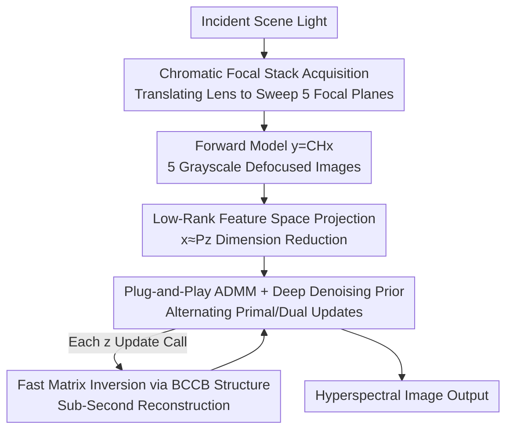

# Spectrum from Defocus: Fast Spectral Imaging with Chromatic Focal Stack

**Conference**: CVPR 2026  
**Paper**: [CVF Open Access](https://openaccess.thecvf.com/content/CVPR2026/html/Aydin_Spectrum_from_Defocus_Fast_Spectral_Imaging_with_Chromatic_Focal_Stack_CVPR_2026_paper.html)  
**Code**: https://nubivlab.github.io/spectrum_from_defocus  
**Area**: Computational Imaging / Image Reconstruction  
**Keywords**: Hyperspectral Imaging, Chromatic Aberration, Focal Stack, Plug-and-Play ADMM, Compressed Sensing

## TL;DR
Using two off-the-shelf lenses and a grayscale sensor, this method leverages lens **chromatic aberration** to focus different wavelengths onto different focal planes. By capturing 5 defocused grayscale images to form a "chromatic focal stack," a physics-driven fast iterative algorithm reconstructs hyperspectral images in under 1 second. The reconstruction quality reaches SOTA (PSNR 30.81 dB) using only 4 optical elements with almost no loss of incident light.

## Background & Motivation

**Background**: Hyperspectral imaging (HSI) extends traditional three-channel RGB to dozens of narrow spectral bands. This captures subtle spectral differences between materials, which is crucial in remote sensing, medical diagnosis, food quality inspection, and industrial testing. To acquire spectral cubes in snapshot or short-exposure modes, mainstream approaches employ compressed sensing: encoding spectral information into spatial measurements using coded apertures, dispersive prisms, or diffractive optical elements (DOEs), and then recovering it via computational reconstruction.

**Limitations of Prior Work**: This path incurs three unavoidable trade-offs. First, **low photon efficiency**: spectral filters, dispersive elements, and coded apertures inherently "block or split light." Since each channel already receives few photons, being further attenuated by optical elements leads to an extremely poor signal-to-noise ratio (SNR) in low-light or dynamic scenes. Systems like Coded Aperture Snapshot Spectral Imaging (CASSI) are often bulky, mechanically sensitive, and difficult to fit into compact platforms. Second, **heavy computation and slow speed**: classical optimization solvers require large matrix operations or iterations, often taking over 15 minutes, whereas swapping them for inverse filtering to speed up reconstruction sacrifices quality. Third, **hallucinations**: pure data-driven learning methods are fast but prone to "hallucinating" non-existent spectral content, making them unreliable for tasks highly sensitive to spectral accuracy, such as material analysis or food inspection.

**Key Challenge**: Hyperspectral imaging inherently trade-offs **spatial resolution, spectral resolution, and temporal resolution**, all constrained by the underlying limit of "low photon count." It either features simple optics with long computation times (e.g., KRISM, which shifts computation to hardware) or fast computation with complex, light-blocking optics. Light efficiency, optical simplicity, computational speed, and physical interpretability are extremely difficult to achieve simultaneously.

**Key Insight**: The authors observe that ordinary refractive lenses naturally possess **longitudinal chromatic aberration**—the focal points of different wavelengths naturally lie at different positions along the optical axis. Instead of manufacturing expensive custom DOEs or metasurfaces to artificially encode spectra, this "imperfection" can be utilized as a free wavelength encoder. By translating the lens to sweep across a series of focal planes, each plane brings a specific wavelength into sharp focus while others blur gradually based on their deviation. Thus, spectral information is naturally encoded into a set of defocused images **without blocking any light** throughout the process.

**Core Idea**: Using the chromatic aberration of off-the-shelf lenses as a wavelength encoder, a series of defocused grayscale focal stacks is captured (with almost zero photon loss), coupled with a physics-driven, fast iterative algorithm with deep denoising regularization to reconstruct the hyperspectral image—harmonizing "light efficiency + optical simplicity + speed + interpretability + hallucination resistance" all at once.

## Method

### Overall Architecture

The core problem SfD solves: given a group of defocused grayscale focal stacks $\mathbf{Y} \in \mathbb{R}^{HW \times N}$ ($N=5$ images), reconstruct the hyperspectral image $\mathbf{X} \in \mathbb{R}^{HW \times C}$ ($C=29$ bands). The pipeline is divided into two steps: **optical acquisition**, which translates the lens to sweep focus and encode the spectrum into defocus patterns, and **algorithmic reconstruction**, which recovers the spectrum using a physical forward model combined with iterative optimization.

Acquisition: With the objective lens and sensor fixed, a second lens translates along the optical axis to five positions $z_1,\dots,z_5$. Each position $z_i$ is calibrated to focus a specific wavelength $\lambda_i$. Consequently, the captured image $I_i$ exhibits sharp structures at $\lambda_i$, while other wavelengths get progressively blurrier with spatial deviation. The five images are combined to form the chromatic focal stack. The forward imaging model is formulated linearly as:

$$\mathbf{y} = \mathbf{C}\mathbf{H}\mathbf{x}$$

where $\mathbf{x}=\text{vec}(\mathbf{X})$, $\mathbf{y}=\text{vec}(\mathbf{Y})$, $\mathbf{H}$ is a block-2D convolution matrix generated by the point spread functions (PSFs) $K(z_i,\lambda_j)$ of each wavelength at each focal plane, and $\mathbf{C}$ is a binary matrix that crops the convolution boundaries. The PSFs are measured experimentally band-by-band using a narrowband tunable filter during calibration. During deployment, the grayscale sensor only measures the total intensity integrated across all wavelengths.

Reconstruction: Inversion is performed on the forward model, but solving it directly is both ill-posed and computationally massive. The authors project the inversion problem into a **low-rank feature space** and employ **Plug-and-Play ADMM** to alternate between "physical inversion + deep denoising." Here, the pivotal large-matrix inversion is achieved in sub-seconds using a **BCCB structure**. The entire pipeline is illustrated below:

### Key Designs

**1. Chromatic Focal Stack Acquisition: Turning Lens "Imperfections" into a Free Wavelength Encoder**

Traditional compressed spectral systems either block light or rely on custom optical elements, incurring large photon losses and hardware complexity. SfD directly exploits the longitudinal chromatic aberration of ordinary refractive lenses—the focal points of different wavelengths naturally distribute along different axial positions. The authors select two off-the-shelf 50 mm lenses, making longitudinal chromatic aberration the dominant system aberration. This yields an axial chromatic focal shift of approximately 0.7 mm and a depth of field of 34 cm (2.64–2.98 m) within the visible range. Moving the lens to five positions, each $z_i$ is calibrated to focus a specific wavelength $\lambda_i$, making $I_i$ sharp at that wavelength and progressively blurred for other wavelengths. This optical design is **completely light-blocking-free**, retaining almost all incident photons, which yields a much better SNR in low-exposure and dark scenes than filter-based or dispersive systems. A direct consequence is: where the chromatic focal shift is stronger, the spectral separation is better, and the reconstruction is more accurate—experiments show that the chromatic focal shift flattens in longer wavelengths, causing accuracy in red/black channels to decline, validating this working principle.

**2. Low-Rank Feature Space Projection: Stabilizing Ill-Posed Inversion via Low-Dimensional Statistics of Natural Spectra**

Inverting directly on the $C=29$-dimensional spectrum is both ill-posed and costly. The authors leverage a prior that natural visible spectra largely lie in a low-dimensional subspace. Thus, the reconstruction variables are projected into a $v$-dimensional feature space: $\mathbf{x} \approx \mathbf{P}\mathbf{z}$, where $\mathbf{P}=\mathbf{B}^T \otimes \mathbf{I}_{HW}$, the rows of $\mathbf{B}$ are spectral eigenvectors (PCA bases) calculated from the Harvard dataset, and $\otimes$ is the Kronecker product. The optimization objective is thus reformulated and solved in the feature space:

$$\min_{\mathbf{z}} \frac{1}{2}\|\mathbf{y}-\mathbf{C}\mathbf{H}\mathbf{P}\mathbf{z}\|_2^2 + \Phi_{\boldsymbol{\theta}}(\mathbf{P}\mathbf{z})$$

Dimensionality reduction shrinks the scale of unknowns to accelerate computation, whilst constraining the solution to a subspace resembling "natural spectra" to suppress noise amplification. The cost is that the reconstructed spectra might be slightly over-smoothed due to the low-rank representation (which the paper acknowledges as a mild oversmoothing in reconstructed spectra).

**3. Plug-and-Play ADMM + Deep Denoising Regularization: Using Physical Inversion to Fight Hallucinations and Off-the-Shelf Denoisers to Restore Quality**

To balance physical interpretability and reconstruction quality, the authors decompose the objective into separable variables, introducing slack variables $\mathbf{v},\mathbf{u}$ (and letting $\hat{\mathbf{H}}:=\mathbf{H}\mathbf{P}$) to perform plug-and-play ADMM. This alternates updates of the primal variables $(\mathbf{v},\mathbf{z},\mathbf{u})$ and dual variables $(\boldsymbol{\xi},\boldsymbol{\eta})$. Here, $\mathbf{v}$ is a pseudo-measurement derived from the real measurement $\mathbf{y}$ and the current estimate; $\mathbf{z}$ is estimated using a Wiener-like filter $(\mu_1\hat{\mathbf{H}}^T\hat{\mathbf{H}}+\mu_2\mathbf{I})^{-1}$; and the $\mathbf{u}$-step first transforms $\mathbf{z}$ back to the image domain, applies an **off-the-shelf deep denoising network** $\phi_{\boldsymbol{\theta}}$ to suppress noise, and then projects it back to the feature space, i.e., $\mathbf{u}\leftarrow \mathbf{P}^T\phi_{\boldsymbol{\theta}}(\mathbf{P}(\mathbf{z}+\boldsymbol{\eta}))$. Crucially, the denoiser serves only as a **regularization term**, with the main solver driven by the physical forward inversion. This significantly mitigates 'spectral hallucination' compared to purely data-driven methods (like MST). The paper also provides comparisons showing that this deep denoiser outperforms conventional $\ell_1$ regularization. Convergence is determined when the step size drops below a threshold or begins to increase.

**4. Fast Matrix Inversion via BCCB Structure: Reducing Minute-Level Iteration to Sub-Seconds**

Updating $\mathbf{z}$ in ADMM requires inverting a massive non-diagonal matrix, which is impractical to calculate directly. The authors notice that the submatrices of $\mathbf{H}$ exhibit a **BCCB (Block Circulant with Circulant Blocks)** structure—an algebraic manifestation of the convolution operator's diagonalizability in the Fourier domain. Exploiting this, they derive a fast inversion formula that separates spatial and frequency domain computations, reducing the large-matrix inversion in each iteration to pointwise division in the frequency domain. This key step enables the full algorithm to run in sub-seconds (0.64 s), slashing the typical "minute-level" cost of classic iterative solvers while maintaining physical interpretability.

## Key Experimental Results

### Main Results

Simulations are conducted on three public hyperspectral datasets: Harvard, KAIST, and CAVE (Table 1 is based on 30 images from Harvard under a 5-second total exposure in bright conditions). All methods are aligned using the **same total exposure time and total photon budget**, factoring in Poisson noise and the transmittance of each optical element; timing is measured on an NVIDIA RTX A6000. The optical element count counts lenses, apertures, prisms, actuators, SLMs, and sensors.

| Method | Category | PSNR↑ | SSIM↑ | SAM(°)↓ | Computation Time | Optical Element Count |
|------|------|-------|-------|---------|---------|-----------|
| Tunable Filter | Spectral Filter | 4.78 | 0.08 | 70.10 | 0 | 3 |
| S.DiffuserCam | Spectral Filter | 15.59 | 0.46 | 34.98 | >15 min | 3 |
| S.DefocusCam | Spectral Filter | 21.17 | 0.61 | 25.11 | 39 s | 4 |
| Choi et al. | Dispersive Element | 23.97 | 0.68 | 14.85 | >15 min | 9 |
| MST (Purely Data-Driven) | Dispersive Element | 30.62 | 0.92 | 9.33 | 1.19 s | 9 |
| KRISM | Dispersive Element | 29.40 | 0.91 | **6.91** | 0 | 20 |
| 2in1 Cameras | DOE | 29.11 | 0.87 | 8.72 | 1.74 s | 4 |
| Zhan et al. | Chromatic Aberration | 14.11 | 0.07 | 23.95 | 0.24 s | 5 |
| **SfD (Ours)** | Chromatic Aberration | **30.81** | **0.92** | 7.35 | 0.64 s | 4 |

SfD achieves the **best PSNR (30.81) and best SSIM (0.92), alongside the second-best SAM (7.35°)** among the 9 compared methods, trailing only KRISM. However, KRISM requires 20 optical elements to perform scene-specific SVD, which is an order of magnitude more complex in hardware. SfD outperforms systems with up to 20 elements while using only 4 optical elements and taking 0.64 s. Although Zhan et al., which also follows a chromatic aberration path, enjoys high light efficiency and fast speeds (0.24 s), it collapses under mild noise (PSNR of only 14.11, SSIM 0.07) due to its naive inverse filtering, highlighting the value of a robust reconstruction algorithm.

### Real Prototype and Robustness

The prototype utilizes a grayscale sensor paired with two off-the-shelf 50 mm lenses (with the focusing lens mounted on a linear translation stage). For calibration, a tungsten-halogen lamp, a 100 µm pinhole, and a liquid crystal tunable filter (LCTF) are used, covering 29 bands from 440 to 720 nm with a 10 nm step size. The experimentally measured PSFs are fed band-by-band into the forward model $\mathbf{H}$.

| Evaluation | PSNR(dB)↑ | SAM(°)↓ | Description |
|------|-----------|---------|------|
| Simulation (Harvard, Tab. 1) | 30.81 | 7.35 | Naturally textured scenes |
| Real Macbeth ColorChecker | 29.54 | 7.42 | ColorChecker lacks natural textures; errors in longer wavelengths skew higher |

The real-world data aligns well with simulations, verifying the transferability of the method. In terms of robustness: increasing the number of measurement frames stabilizes reconstruction, and RGB reconstruction saturates earlier than spectral reconstruction (due to its lower dimensionality). Quality remains high within the predicted working range of 264–298 cm, and drops slowly once exceeded—low-frequency chromatic aberration artifacts only start appearing when the object approaches 2.35 m (extrapolating the theoretical range by ~29 cm), showing that the practical tolerance is wider than the theoretical one.

### Key Findings
- **Photon efficiency is the root of performance**: Filter-based methods have significantly worse SAM mainly because low light efficiency leads to high noise or missing high-frequency details. The shorter the exposure, the more dramatic SfD's advantage becomes (under low exposure, the purely data-driven MST suffers from severe hallucinations, "conjuring" fake spectra for yellow/red peppers).
- **Hybrid physics-data design resists hallucinations**: SfD relies primarily on physical forward inversion, utilizing deep denoising only as a regularizer. Thus, it remains largely "hallucination-free" in low-light environments, whereas purely data-driven methods collapse most severely in photon-starved configurations.
- **Chromatic focal shift intensity dictates spectral separability**: The chromatic focal shift flattens in longer wavelengths, causing a drop in accuracy for the red/black channels. This directly reflects SfD's underpinnings and acts as its primary failure mode.
- **Failure Case**: The windmill target struggles to recover full resolution/contrast in the 700 nm channel—true black regions brightened by the defocused light of neighboring white pixels become indistinguishable from gray regions. This can be mitigated by high-dynamic-range sensors, more measurement frames, or adding TV priors.

## Highlights & Insights
- **Treating aberrations as resources rather than flaws**: Longitudinal chromatic aberration is typically an imaging defect to be corrected. The authors invert this perspective, treating it as a free, light-efficient wavelength encoder, bypassing custom DOEs/metasurfaces. This reversal of perspective is the most insightful "aha" moment of the paper.
- **"No light blocking throughout" is the performance moat**: By avoiding filters/coded apertures for light splitting, almost all photons are preserved. This turns low-exposure and dark environments into a strength rather than a weakness—precisely the high-noise scenarios where hyperspectral imaging suffers most.
- **Dual acceleration of low-rank + BCCB is transferable**: Projecting spectra into a low-dimensional PCA subspace stabilizes the ill-posed inversion, while the Fourier-domain diagonalizability of the BCCB convolution matrix converts huge matrix inversions into pointwise divisions. This combination of "dimensionality reduction followed by fast frequency-domain inversion" can be transferred to other compressed sensing reconstructions with convolutional forward models.
- **Trade-off between physical backbone and deep denoising prior**: It is neither as slow as pure optimization nor as prone to hallucinations as pure networks. The PnP-ADMM division of labor—where "physics builds the skeleton, networks restore the skin"—is a highly valuable paradigm.

## Limitations & Future Work
- **Narrow operating range**: The method assumes the scene lies within a 34 cm depth of field and a near-axial, narrow field of view (though experiments show some extrapolation tolerance, this remains a limitation). Enlarging the operating volume requires joint optical and algorithmic design.
- **Low red/black channel accuracy**: The chromatic focal shift flattens at longer wavelengths and the system's dynamic range is limited. Black regions can easily be miscolored as gray or false colors due to sensor saturation and light leakage from neighboring bright pixels. This can be improved by utilizing more dispersive glasses or high-dynamic-range sensors.
- **Multi-frame dependency**: Because reconstruction models incident photons across all wavelengths, even standard RGB output requires capturing all 5 frames to produce high-quality images, which is unfriendly to dynamic scenes. Incorporating burst photography tools and more data-driven components represents an important future direction.
- **Low-light advantages not fully exploited**: Although it shows remarkable gains under low exposures, solidifying this claim requires more high-fidelity low-light noise models.

## Related Work & Insights
- **vs CASSI (Choi et al. / MST)**: CASSI uses coded apertures and dispersive prisms to spatially encode spectra, resulting in large, mechanically sensitive, and light-lossy systems. MST achieves high PSNR via spectral self-attention but is entirely data-driven, causing severe low-light hallucinations. SfD utilizes only two off-the-shelf lenses and swept-focus chromatic aberration encoding, offering simple, light-preserving hardware with better stability in low-light conditions.
- **vs Spectral DefocusCam**: Both use defocus to encode information, but DefocusCam uses achromatic lenses and binned superpixels to leverage blur for spatial super-resolution. SfD uses a grayscale sensor and specifically relies on spatially-varying blur caused by **chromatic aberration** to encode spectra, representing opposite paradigms.
- **vs KRISM**: KRISM uses complex optics (20 elements) to directly measure spectral singular values, shifting computing to hardware. Its scene-specific SVD yields the best SAM but introduces scene-specific spectral biases (over/under-saturation). SfD balances these extremes with minimal optics and lightweight physical algorithms.
- **vs Zhan et al. (also chromatic-aberration-based)**: Both utilize chromatic focal stacks for high light efficiency. However, Zhan et al. relies on naive inverse filtering, which becomes unstable under mild noise. SfD's robust iterative algorithm achieves high-fidelity reconstruction even under significant noise.
- **vs 2in1 Cameras (DOE)**: Both rely on spectrally-encoded PSFs. However, 2in1 Cameras rely on dual pixels with DOEs, where RGB filters lose light and data-driven models introduce hazing/under-saturation. SfD achieves PSF encoding through the natural chromatic aberration of ordinary refractive lenses, eliminating the need for custom optics.

## Rating
- **Novelty**: ⭐⭐⭐⭐⭐ Inverting "chromatic aberration defects" into free, light-efficient wavelength encoders, achieving SOTA with minimal optics; highly original perspective.
- **Experimental Thoroughness**: ⭐⭐⭐⭐ Solid simulation on three datasets, validated by real prototype consistency, along with complete robustness analysis. Most ablations are left to the supplemental materials.
- **Writing Quality**: ⭐⭐⭐⭐⭐ Motivation, forward models, and algorithmic derivations progress logically, establishing clear links between physical intuition and mathematical formulas.
- **Value**: ⭐⭐⭐⭐⭐ Compact, low-cost, fast, hallucination-resistant, and interpretable hyperspectral solution with high commercial potential.

<!-- RELATED:START -->

## Related Papers

- [\[CVPR 2026\] NeAR: Coupled Neural Asset–Renderer Stack](near_coupled_neural_asset-renderer_stack.md)
- [\[CVPR 2026\] Kaleidoscopic Scintillation Event Imaging](kaleidoscopic_scintillation_event_imaging.md)
- [\[CVPR 2026\] SpiderCam: Low-Power Snapshot Depth from Differential Defocus](spidercam_low-power_snapshot_depth_from_differential_defocus.md)
- [\[CVPR 2026\] DynamicTree: Interactive Real Tree Animation via Sparse Voxel Spectrum](dynamictree_interactive_real_tree_animation_via_sparse_voxel_spectrum.md)
- [\[CVPR 2026\] Generalizable Radio-Frequency Radiance Fields for Spatial Spectrum Synthesis](generalizable_radio-frequency_radiance_fields_for_spatial_spectrum_synthesis.md)

<!-- RELATED:END -->
