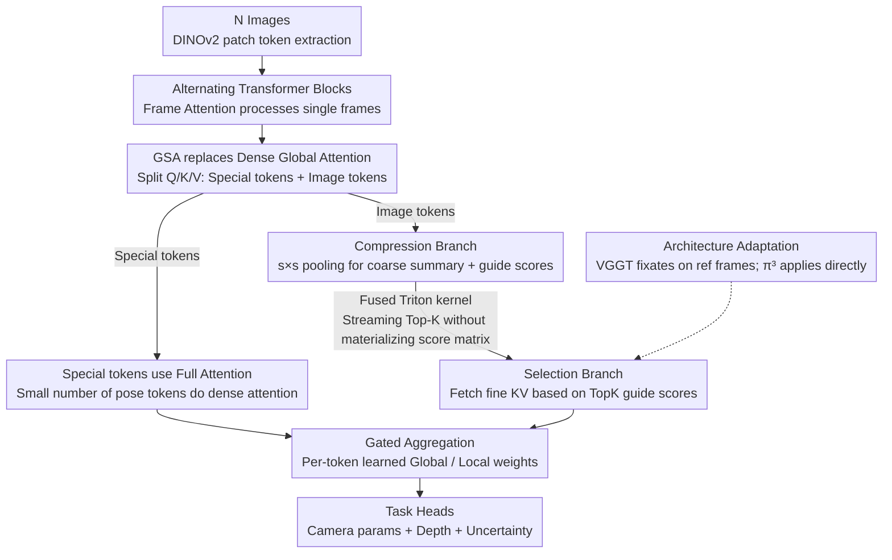

# Speed3R: Sparse Feed-forward 3D Reconstruction Models

**Conference**: CVPR 2026 Findings  
**arXiv**: [2603.08055](https://arxiv.org/abs/2603.08055)  
**Code**: [https://visual-ai.github.io/speed3r/](https://visual-ai.github.io/speed3r/)  
**Area**: 3D Vision  
**Keywords**: 3D Reconstruction, Sparse Attention, Feed-forward, Inference Acceleration, Structure-from-Motion

## TL;DR

Speed3R designs a trainable dual-branch Global Sparse Attention (GSA) mechanism for feed-forward 3D reconstruction models. By providing coarse-grained scene summaries via a compression branch and focusing fine-grained attention on key tokens via a selection branch, it achieves a **12.4x inference speedup** on 1000-view sequences with only minimal accuracy degradation.

## Background & Motivation

**Background**: Recent feed-forward 3D reconstruction models (VGGT, $\pi^3$) can jointly infer dense geometry and camera poses in a single forward pass, bypassing the multi-stage pipelines of classical SfM/MVS.

**Limitations of Prior Work**: These models rely on dense global attention, where the computational complexity grows as $O(n^2)$ with the number of tokens. When processing large numbers of views or high-resolution images, inference speed becomes a severe bottleneck—for instance, $\pi^3$ takes **202 seconds** to process 1024 images.

**Key Challenge**: Training-free methods like FastVGGT (token merge-unmerge) and Block-Sparse VGGT (top-k attention) cannot be optimized end-to-end, and aggressive pruning leads to significant precision drops.

**Key Insight**: The core concept of traditional SfM—that sparse keypoints are sufficient for robust pose estimation—has not been fully utilized by feed-forward methods.

**Goal**: Inspired by dual-branch sparse attention (NSA, MOBA) in SfM and LLMs, this work designs an end-to-end trainable sparse attention mechanism and transfers performance from dense models via knowledge distillation.

## Method

### Overall Architecture

Speed3R addresses a specific problem: making feed-forward 3D reconstruction models like VGGT and $\pi^3$ run faster on long sequences. These models compress multi-view geometry and camera poses into a single forward pass, but at the cost of performing dense global attention in every Transformer block, leading to $O(n^2)$ complexity explosions as tokens increase. Speed3R replaces this dense global attention block with its custom Global Sparse Attention (GSA) while keeping the rest of the pipeline intact: $N$ images first pass through DINOv2 to extract patch tokens, then enter alternating Transformer blocks—where local Frame Attention handles intra-frame processing and global GSA handles cross-frame information flow. Refined tokens are then fed into task heads to output per-view camera parameters $\{\hat{C_i}\}$, depth maps $\{\hat{D_i}\}$, and uncertainties $\{\hat{\alpha_i}\}$. The core logic of GSA is "coarse-to-fine": it uses low-resolution representations to capture a scene overview and then directs each token to look only at the most relevant small subset of neighbors at full resolution.

### Key Designs

**1. Special tokens use full attention, targeting only massive image tokens**

The GSA input $X \in \mathbb{R}^{M \times C}$ is a concatenation of special tokens $X_{\text{spec}}$ (e.g., pose tokens) and image tokens $X_{\text{img}}$. After projecting Q/K/V, they are split by type. Global tasks like pose estimation are sensitive to information loss; since special tokens are few, they execute standard dense attention over all tokens with negligible overhead:

$$O_{\text{spec}} = \text{softmax}\left(\frac{Q_{\text{spec}} K^T}{\sqrt{d_k}}\right) V$$

The $O(n^2)$ bottleneck is caused by the vast number of image tokens; subsequent sparsification steps Target only these, preserving critical global information while cutting the bottleneck.

**2. Compression Branch: Coarse scene summary and guide scores**

$Q_{\text{img}}, K_{\text{img}}, V_{\text{img}}$ undergo $s \times s$ non-overlapping average pooling, compressing image tokens from $M_{\text{img}}$ to $M'_{\text{img}} = M_{\text{img}} / s^2$. Attention is computed in this smaller space: $O'_{\text{comp}} = \text{Attention}(Q_{\text{comp}}, K_{\text{comp}}, V_{\text{comp}})$, then upsampled back to original resolution via nearest-neighbor interpolation: $O_{\text{comp}} = \text{Upsample}(O'_{\text{comp}})$. This branch provides a coarse-grained global summary and produces a guide score matrix:

$$S_{\text{guide}} = Q_{\text{comp}} K_{\text{comp}}^T \in \mathbb{R}^{M'_{\text{img}} \times M'_{\text{img}}}$$

It identifies which coarse regions correlate, serving as a roadmap for selecting tokens in the next step.

**3. Selection Branch: Fetching fine-grained KV based on guide scores**

To recover details lost in the coarse summary, a fine-grained branch is added. For each query, $\text{TopKSelect}(\cdot)$ picks the most relevant coarse regions from $S_{\text{guide}}$. It then retrieves the corresponding $K_{\text{sel}}, V_{\text{sel}}$ from the full-resolution $K_{\text{img}}, V_{\text{img}}$ (queries within the same compression window share the same KV set to avoid redundant selection). Fine attention is computed only on this subset:

$$O_{\text{sel}} = \text{Attention}(Q_{\text{img}}, K_{\text{sel}}, V_{\text{sel}})$$

Each query effectively attends to only $k \ll M_{\text{img}}$ tokens. This translates the SfM principle—"sparse keypoints are sufficient for robust pose estimation"—to feed-forward models: look only at the right points, not the whole scene.

**4. Gated Aggregation: Per-token decision between global and local**

The coarse summary and fine attention have complementary strengths. Instead of a hard choice, a learnable gate performs dynamic per-token weighting:

$$g = \sigma(W_g Q_{\text{img}}), \quad O_{\text{img}} = g \odot O_{\text{comp}} + (1 - g) \odot O_{\text{sel}}$$

Tokens requiring global context rely more on the compression branch, while those needing detail favor the selection branch.

**5. Fused Triton kernel: Avoiding score matrix materialization**

A naive implementation would materialize the full $S_{\text{guide}}$ matrix, exceeding VRAM on long sequences. The authors implemented a fused kernel that integrates streaming Top-K into the FlashAttention workflow. It maintains a running Top-K index set while computing scores tile-by-tile in on-chip SRAM, completing region selection and compression output in one pass without ever materializing the full matrix. This allows the theoretical sparse speedup to translate into wall-clock time.

**6. Architecture Adaptation**

GSA is plug-and-play, but backbones differ. VGGT uses the first frame as a global reference and has dedicated camera tokens. To prevent reference information from being sparsified, its selection set always includes "all tokens from the reference frame + every 100th frame" as global context, overlaid with dynamic Top-K windows. $\pi^3$ has no reference frame dependencies; GSA applies directly, and the authors found that register tokens could be removed in the sparse variant without performance loss.

### Example: Sparsifying 1024 Images

Processing 1024 images with $\pi^3$: The dense version requires tokens to attend to all other image tokens, taking **202.39 seconds** for a forward pass. With GSA (optimal config: $4\times4$ window, top-32), the compression branch pools image tokens by $4\times4$, reducing the scale to $\approx 1/16$ for the summary. The selection branch then permits each query to pick only the 32 most relevant coarse regions. The forward pass is reduced to **16.38 seconds**, a **12.4x acceleration**, with almost no loss in pose accuracy on RE10K/CO3Dv2.

## Loss & Training

Training utilizes knowledge distillation: a pre-trained dense model serves as the teacher, providing pseudo-labels for depth and pose to guide the sparse student, bypassing label noise in real datasets. The total loss is $\mathcal{L}_{\text{total}} = \mathcal{L}_{\text{depth}} + \lambda \mathcal{L}_{\text{camera}}$. Training is conducted on a mix of 7 datasets (ArkitScene, Scannet++, DL3DV, CO3D, Hypersim, WildRGBD, VirtualKitti2) for 80 epochs, using 8× NVIDIA H20 GPUs (~7 days) with a learning rate of $1 \times 10^{-5}$ and an effective batch size of 32.

## Key Experimental Results

### Main Results: Multi-view Pose Estimation (RE10K / CO3Dv2)

| Method | Sparsity (%) | RE10K AUC@30↑ | CO3Dv2 AUC@30↑ |
|------|-----------|---------------|----------------|
| VGGT (dense) | 0 | 74.17 | 88.33 |
| Block Sparse-VGGT | 75 | 63.82 | 79.92 |
| FastVGGT | 82 | 69.99 | 84.03 |
| **Speed3R-VGGT (Ours)** | **84** | **74.81** | **87.71** |
| $\pi^3$ (dense) | 0 | 87.37 | 89.67 |
| Block Sparse-$\pi^3$ | 75 | 75.39 | 80.72 |
| FastVGGT-$\pi^3$ | 90 | 86.04 | 86.39 |
| **Speed3R-$\pi^3$ (Ours)** | **94** | **87.17** | **89.41** |

**Key Findings**:
- Speed3R-VGGT **outperforms the dense VGGT baseline** on RE10K at 84% sparsity (74.81 vs 74.17).
- Speed3R-$\pi^3$ matches dense $\pi^3$ performance at 94% sparsity.
- Consistently outperforms training-free competitive methods at all sparsity levels.

### Long Sequence Pose Estimation (Tanks & Temples, ~300 images/scene)

| Method | RRA@5↑ | RTA@5↑ | AUC@30↑ | Time (s)↓ |
|------|--------|--------|---------|----------|
| VGGT (dense) | 70.29 | 79.30 | 77.67 | 34.51 |
| Block Sparse-VGGT | 66.83 | 71.29 | 74.15 | 10.79 |
| FastVGGT | 69.28 | 77.98 | 76.29 | 15.98 |
| **Speed3R-VGGT (Ours)** | **69.51** | **77.81** | **76.57** | **6.55** |
| $\pi^3$ (dense) | 72.14 | 81.26 | 79.63 | 22.32 |
| Block Sparse-$\pi^3$ | 67.85 | 78.91 | 76.64 | 8.16 |
| FastVGGT-$\pi^3$ | 69.78 | 79.51 | 77.76 | 11.96 |
| **Speed3R-$\pi^3$ (Ours)** | **70.72** | **80.72** | **79.77** | **4.19** |

**Key Findings**: Speed3R-$\pi^3$ achieves the best performance among sparse methods while being the fastest (4.19s), **5.3x faster** than dense $\pi^3$.

### Ablation Study (Speed3R-$\pi^3$, T&T Dataset)

| Config | RE10K AUC@30↑ | T&T AUC@30↑ | Time (s)↓ |
|------|---------------|-------------|----------|
| Base (4×4 window, top-32) | 86.35 | 78.69 | 4.19 |
| (1) Remove Compression Value | 86.29 | 77.90 | 3.99 |
| (2) Remove Selection Branch | 83.44 | 76.84 | 3.56 |
| (4) Top-8 | 85.37 | 78.17 | 3.72 |
| (5) Top-16 | 85.98 | 78.55 | 3.92 |
| (6) Top-64 | 86.42 | 78.90 | 4.64 |
| (7) 8×8 window | 86.49 | 78.71 | 5.27 |
| (8) No Knowledge Distillation | 85.18 | 77.81 | 4.19 |

**Key Findings**:
- **Selection branch is core**: Accuracy drops significantly without it (RE10K -2.91, T&T -1.85).
- **Compression branch matters for long sequences**: Removing Value hurts long sequences (T&T -0.79).
- **Knowledge distillation is vital**: Effectively mitigates noisy labels in real datasets.
- **4×4 window + top-32 is the sweet spot**: Best balance between precision and speed.

### Inference Latency Comparison

| Sequence Length | 32 | 64 | 128 | 256 | 512 | 1024 |
|---------|-----|------|------|------|------|-------|
| Full Attn. ($\pi^3$) | 0.50s | 1.31s | 3.97s | 13.41s | 50.01s | 202.39s |
| **Speed3R (Ours)** | **0.37s** | **0.71s** | **1.44s** | **3.06s** | **6.83s** | **16.38s** |

At 1024 images, Speed3R achieves a **12.4x** speedup over the dense model.

## Highlights & Insights

- **Fusion of Classic and Modern**: Combines SfM insights with LLM sparse attention for 3D reconstruction.
- **Coarse-to-Fine Dual Branch**: Compression branch builds global understanding $\rightarrow$ Selection branch focuses on key regions.
- **End-to-End Trainable**: Optimization during training provides a significant advantage over training-free methods.
- **Plug-and-Play**: Generalizes across both VGGT and $\pi^3$ architectures.
- **Custom Triton Kernel**: Efficient VRAM access via fused Top-K + FlashAttention.

## Limitations & Future Work

1. **Short Sequence Accuracy Gap**: A gap remains under strict thresholds (AUC@5) compared to dense models.
2. **VRAM Overhead**: The dual-branch architecture adds **15% memory overhead** compared to standard attention.
3. **Teacher Model Dependency**: Requires a high-quality pre-trained dense model for distillation.
4. **Pose Precision Sensitivity**: Pose regression is more sensitive to sparsity than generation tasks.

## Rating

⭐⭐⭐⭐ — The first trainable sparse attention method specifically for feed-forward 3D reconstruction. The 12.4x speedup is of significant practical value, and the dual-branch design is elegant and well-ablated.

<!-- RELATED:START -->

- VGGT: Very General Geometry Transformer, 2024.
- $\pi^3$: Pose-Invariant Point-based Progressive reconstruction, 2025.
- FastVGGT: Efficient Feed-forward 3D Reconstruction, 2024.

<!-- RELATED:END -->

## Related Papers

- [\[CVPR 2026\] VGG-T3: Offline Feed-Forward 3D Reconstruction at Scale](vgg-t3_offline_feed-forward_3d_reconstruction_at_scale.md)
- [\[CVPR 2026\] AMB3R: Accurate Feed-forward Metric-scale 3D Reconstruction with Backend](amb3r_accurate_feed-forward_metric-scale_3d_reconstruction_with_backend.md)
- [\[CVPR 2026\] PanoVGGT: Feed-Forward 3D Reconstruction from Panoramic Imagery](panovggt_feed-forward_3d_reconstruction_from_panoramic_imagery.md)
- [\[ICML 2026\] Trust3R: Evidential Uncertainty for Feed-Forward 3D Reconstruction](../../ICML2026/3d_vision/trust_it_or_not_evidential_uncertainty_for_feed-forward_3d_reconstruction_with_t.md)
- [\[CVPR 2026\] Z-Order Transformer for Feed-Forward Gaussian Splatting](z-order_transformer_for_feed-forward_gaussian_splatting.md)

<!-- RELATED:END -->
