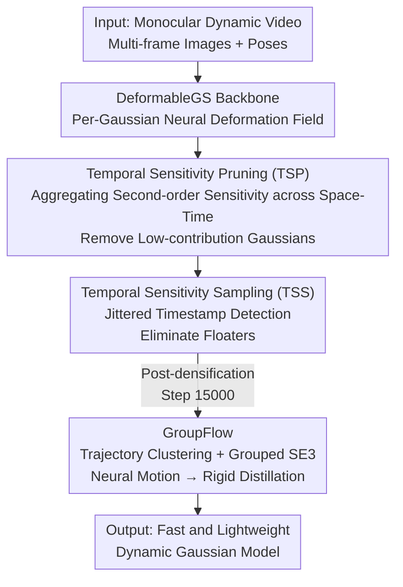

# SpeeDe3DGS: Speedy Deformable 3D Gaussian Splatting with Temporal Pruning and Motion Grouping

**Conference**: CVPR 2026  
**Paper**: [CVF Open Access](https://openaccess.thecvf.com/content/CVPR2026/html/Tu_SpeeDe3DGS_Speedy_Deformable_3D_Gaussian_Splatting_with_Temporal_Pruning_and_CVPR_2026_paper.html)  
**Code**: https://speede3dgs.github.io (Project Page)  
**Area**: 3D Vision  
**Keywords**: Dynamic Gaussian Splatting, Temporal Pruning, Motion Field Distillation, Real-time Rendering, Deformation Field

## TL;DR
SpeeDe3DGS integrates three modules — Temporal Sensitivity Pruning (TSP), Temporal Sensitivity Sampling (TSS), and Grouped Rigid Motion Distillation (GroupFlow) — into DeformableGS. It accelerates dynamic Gaussian Splatting rendering by 13.71×, reduces training time by 2.53×, and cuts the number of Gaussians to 1/10 while maintaining the image quality of neural deformation fields.

## Background & Motivation

**Background**: 3D Gaussian Splatting (3DGS) replaces ray-based MLP integration in NeRF with differentiable rasterization of Gaussian points, achieving real-time high-fidelity rendering for static scenes. To extend to dynamic scenes, a common approach is to couple each Gaussian with a time-varying motion field: DeformableGS uses a shared MLP to predict deformation offsets $(\Delta\mu_t, \Delta r_t, \Delta s_t)$, while 4DGS employs HexPlane grids for spatio-temporal interpolation. Systematic comparisons in MonoDyGauBench show that these neural motion fields achieve the highest and most stable reconstruction quality.

**Limitations of Prior Work**: The high quality of neural motion fields comes at a high computational cost — the deformation network must perform neural inference for **every Gaussian at every frame**. In MonoDyGauBench, DeformableGS reaches only 20.20 FPS, which is several times slower than analytic or non-neural motion representations, making real-time performance difficult to achieve.

**Key Challenge**: A trade-off exists between fidelity (neural motion field) and efficiency (analytic motion). Methods either obtain high quality via neural fields with slow performance or achieve high speed via analytic expressions with significantly reduced image quality.

**Goal**: To approach the speed of non-neural representations in dynamic 3DGS without sacrificing the image quality of neural fields. This requires addressing two issues simultaneously: reducing the number of Gaussians requiring neural inference and lowering the cost of deformation inference per Gaussian.

**Key Insight**: The authors observe two types of redundancy. First, dynamic 3DGS is heavily over-parameterized; near-equivalent image quality can be achieved with significantly fewer Gaussians (following findings from Speedy-Splat), suggesting the potential for pruning. However, static sensitivity pruning only calculates gradients at fixed frames, failing to handle "floaters" in dynamic scenes that appear normal in observed frames but drift at unobserved timestamps. Second, many objects in real-world scenes exhibit local rigid motion. The trajectories of neighboring Gaussians are highly correlated, making it unnecessary to compute unique deformations for every single Gaussian.

**Core Idea**: The bottleneck of "per-Gaussian neural inference" is compressed from two directions. **Temporal-aware pruning** removes low-contribution and temporally unstable Gaussians, while **grouped rigid distillation** compresses the neural deformation field of the remaining Gaussians by sharing one SE(3) transformation per group.

## Method

### Overall Architecture
SpeeDe3DGS is a unified training pipeline integrated into DeformableGS. The input consists of multi-frame images and poses from a monocular dynamic video, and the output is a fast, lightweight dynamic Gaussian model. Training proceeds in two stages: during the densification stage, TSP and TSS are interspersed to perform "soft/hard pruning" to gradually shrink model capacity, removing redundant and unstable Gaussians. After densification, GroupFlow is applied to distill the learned neural deformation field into grouped rigid motions. Consequently, inference only requires computing transformations per group rather than per Gaussian. These three modules are complementary: TSP reduces Gaussian count, TSS stabilizes pruning, and GroupFlow lowers the unit inference cost.

### Key Designs

**1. Temporal Sensitivity Pruning (TSP): Extending Static Sensitivity Pruning to Motion-Coupled Dynamic Scenes**

Static 3DGS pruning (e.g., Speedy-Splat) uses second-order sensitivity to measure each Gaussian's contribution to reconstruction, but it only computes this at fixed views and single frames. In dynamic scenes, contribution varies over time; applying static pruning directly misses motion-related redundancy. TSP aggregates the second-order sensitivity of the L2 reconstruction loss with respect to the Gaussian projection contribution $g_i$ **across all training poses and timestamps**: after training converges and the residual term vanishes, sensitivity is approximated as $\tilde{U}_{G_i} \approx \sum_{\phi,t\in P_{gt}} (\nabla_{g_i} I_{G_t}(\phi))^2$. Here, $\nabla_{g_i} I_{G_t}(\phi)$ is the readily available image-space gradient from rasterization backpropagation, adding nearly zero overhead. Crucially, because deformation parameters $(\Delta\mu_t, \Delta r_t, \Delta s_t)$ vary with time, these gradients inherently encode temporal motion coupling. Thus, $\tilde{U}_{G_i}$ is sensitive not only to static appearance but also to dynamic contribution. Removing low-scoring Gaussians at regular intervals enables the elimination of motion-related redundancy in a "temporal-aware" manner.

**2. Temporal Sensitivity Sampling (TSS): Exposing and Pruning Floaters with Jittered Timestamps**

TSP only evaluates gradients at observed training timestamps. Floaters are precisely the type of Gaussians that exhibit weak gradients and appear normal at observed frames but drift and cause visible artifacts when extrapolated to unobserved moments. TSS is a sub-module of TSP that injects a linearly annealed Gaussian perturbation into the timestamp input of the deformation function during sensitivity estimation: $(\mu+\Delta\mu, r+\Delta r, s+\Delta s) = D(\mu, r, s, t+X(i))$, where $X(i) = N(0,1)\cdot\beta\cdot\Delta t\cdot(1-i/\tau)$, $\beta=0.1$ controls the perturbation magnitude, $\Delta t$ is the frame interval, and $\tau=20{,}000$ is the annealing period. Since the sensitivity formula does not require ground truth supervision, TSS can calculate scores on any jittered motion state in a completely self-supervised manner. Consequently, Gaussians with inconsistent responses to small motion shifts receive lower sensitivity scores and are pruned. Strong early perturbations encourage exploration and clear floaters during densification, while late-stage annealing to zero allows optimization to focus on accurate reconstruction of observed frames — balancing temporal robustness and reconstruction accuracy.

**3. GroupFlow: Distilling Per-Gaussian Neural Deformation into Group-Shared SE(3) Rigid Motion**

Even after pruning, the deformation network must still perform inference for every remaining Gaussian. Assigning an individual SE(3) transformation to each Gaussian is too expensive in terms of memory and parameters. GroupFlow exploits the fact that "real dynamic objects are mostly locally rigid" by clustering Gaussians with similar trajectories into $J$ groups, with each group sharing a time-varying rigid transformation. This reduces the number of predicted transformations per frame from $N$ (per Gaussian) to $J$ (per group, $J=2048$ in the paper). The process involves three steps: first, each Gaussian's motion is represented as a sequence of means and quaternions across $F$ frames $M_i = \{\mu_i^t, r_i^t\}$. Using $t=0$ as the reference frame, farthest point sampling is applied to the means at $t=0$ to select $J$ control points, and each Gaussian is assigned to the nearest control point based on trajectory similarity $S_{i,j} = \lambda_r \text{std}_t(\|\mu_i^t - h_j^t\|) + (1-\lambda_r)\text{mean}_t(\|\mu_i^t - h_j^t\|)$ with $\lambda_r=0.5$. Then, for each group, Umeyama alignment (sampling up to $N_{max}=100$ means per group) estimates the SE(3) transformation $[R_j^t|T_j^t]$ mapping the reference frame to time $t$. At inference, Gaussian positions are computed as $\mu_i^t = R_j^t(\mu_i^0 - h_j^0) + h_j^0 + T_j^t$, and rotations are updated via $r_i^t = \text{quat}(R_j^t\,\text{mat}(r_i^0))$, where $\{h_j^0, R_j^t, T_j^t\}$ are set as learnable parameters. This neural-to-rigid distillation significantly reduces inference costs and acts as a regularizer: in scenes with unstable pose estimation, it stabilizes reconstruction, surpassing the image quality of per-Gaussian baselines.

### Loss & Training
The pipeline adopts the standard image reconstruction loss $L = \|I_G(\phi) - I_{gt}\|_1 + L_{\text{D-SSIM}}$. Training lasts for 30,000 steps. TSP is executed every 3,000 steps starting from step 6,000: during the densification phase 60% of Gaussians are "soft-pruned" each time, followed by "hard-pruning" 30% after densification ends. TSS perturbation uses $\beta=0.1$ and $\tau=20{,}000$ annealing. GroupFlow is initialized after densification at step 15,000 with $J=2048$ groups. FPS is measured on an RTX 3090, and training time is measured on an RTX A5000.

## Key Experimental Results

### Main Results
On 50 dynamic scenes from MonoDyGauBench, Pruning (TSP+TSS) and GroupFlow were incrementally added to DeformableGS and 4DGS baselines:

| Method | PSNR ↑ | SSIM ↑ | MS-SSIM ↑ | LPIPS ↓ | FPS ↑ | Training Time (s) ↓ |
|------|--------|--------|-----------|---------|-------|---------------|
| DeformableGS | 24.07 | 0.694 | 0.755 | 0.283 | 20.20 (1.00×) | 6227 (1.00×) |
| + Pruning | 23.86 | 0.694 | 0.749 | 0.295 | 137.01 (6.78×) | 2851 (2.18×) |
| + GroupFlow | 23.52 | **0.709** | **0.771** | 0.313 | **276.91 (13.71×)** | **2461 (2.53×)** |
| 4DGS | 23.55 | 0.708 | 0.765 | 0.277 | 62.99 (1.00×) | 8629 (1.00×) |
| + Pruning | 22.44 | 0.689 | 0.737 | 0.334 | 179.64 (2.85×) | 4358 (1.47×) |
| + GroupFlow | 21.00 | 0.667 | 0.705 | 0.380 | 290.21 (4.61×) | 4176 (2.07×) |

DeformableGS+Pruning achieves a 6.78× rendering speedup with almost no drop in quality, reaching frame rates comparable to non-neural baselines. Adding GroupFlow increases the speedup to 13.71×, nearly 100 FPS faster than all baselines, while SSIM/MS-SSIM actually **exceed** the original DeformableGS (due to GroupFlow's light regularization effect, most noticeable in scenes with unstable poses). Notably, GroupFlow improves SSIM when applied to DeformableGS but significantly degrades performance on 4DGS — suggesting that DeformableGS's per-Gaussian inference is more amenable to grouped motion distillation.

### Ablation Study
Module breakdown on the NeRF-DS dataset (7 real scenes, averaged over three runs):

| Configuration | PSNR ↑ | SSIM ↑ | FPS ↑ | Gaussian Count ↓ | Model Size (MB) |
|------|--------|--------|-------|----------|--------------|
| DeformableGS Baseline | 23.80 | 0.8503 | 54.37 (1.00×) | 132.22K (1.00×) | 33.21 |
| + TSP | 23.78 | 0.8507 | 346.96 (6.38×) | 10.90K (12.13×) | 4.52 |
| + TSP + TSS | 23.81 | **0.8515** | 345.24 (6.35×) | 11.06K (11.95×) | 4.55 |
| + GroupFlow (w/o Pruning) | 23.54 | 0.8433 | 406.21 (8.58×) | 132.32K | 51.00 |
| + TSP + TSS + GroupFlow | 23.66 | 0.8487 | **505.60 (10.68×)** | 11.10K (11.91×) | 21.40 |

### Key Findings
- **TSP is the primary driver for count reduction**: TSP alone compresses Gaussians by 1/12 and speeds up rendering by 6.38× with negligible impact on PSNR/SSIM.
- **TSS pushes quality beyond the baseline**: The SSIM for TSP+TSS (0.8515) is higher than the baseline (0.8503), as temporal jitter acts as a regularizer to suppress floaters while using only ~0.16K more Gaussians.
- **Pruning facilitates GroupFlow**: Pruning before grouping (TSP+TSS+GF) results in higher PSNR/SSIM than GroupFlow alone, and the entire model is **1.55× smaller** than the baseline; without pruning, GroupFlow causes the model to bloat to 51MB.
- **Synergy across datasets**: On HyperNeRF, TSP+TSS and GroupFlow individually provide 9.37× and 15.66× acceleration; combined, they reach 29.21×, reduce Gaussians 12.18×, and shorten training by 3.74×.

## Highlights & Insights
- **Pruning via "Recycled Gradients" with Zero Overhead**: TSP utilizes existing image-space gradients from rasterization backpropagation for second-order sensitivity. It generalizes static pruning to dynamic scenes with almost no extra cost — a clever observation that gradients naturally encode temporal contributions when deformation parameters vary over time.
- **Defining "Stability" via Temporal Jitter**: TSS equates "inconsistent response to small temporal shifts" with "being a floater." This allows a self-supervised perturbation to identify and prune temporally unstable Gaussians that traditional pruning misses. The annealing schedule ensures early cleanup and late-stage convergence.
- **Learnable Neural-to-Rigid Distillation**: GroupFlow is not simple clustering; it uses Umeyama alignment to estimate group SE(3) transforms as learnable parameters. Compressing $N$ trajectories into $J$ saves computation and provides regularization — this "compression as regularization" translates to quality gains in noisy pose scenarios and is transferable to other 4D representations needing motion compression.
- **Decoupled, Plug-and-Play Modules**: TSP/TSS can be added to any dynamic 3DGS, and GroupFlow can be added to any method with an explicit motion model, facilitating easy integration with existing pipelines.

## Limitations & Future Work
- **Quality Drops at Extreme Pruning/Grouping**: The authors acknowledge slight image quality degradation at very high pruning ratios and loss of detail in highly deformable regions when the group count is overly restricted, requiring a hyperparameter trade-off between speed and fidelity.
- **Lack of Explicit Motion Priors**: The method introduces only light regularization without learning dynamics or motion priors. Thus, it is complementary to, rather than a replacement for, "prior-driven/motion-aware" 3DGS.
- **Sensitivity of GroupFlow to Backbone**: ⚠️ Experiments show GroupFlow significantly degrades 4DGS performance (PSNR 22.44→21.00), indicating that grouped rigid assumptions are not friendly to all deformation parameterizations. Caution is needed when migrating to HexPlane-style grid motions.
- **Boundaries of Local Rigidity Assumption**: Group-shared SE(3) inherently assumes approximate rigidity within groups. This may fail for highly non-rigid or fluid-like motions; adding lightweight deformation residuals within groups could be considered.

## Related Work & Insights
- **vs. Speedy-Splat / PUP 3D-GS**: These perform Hessian/gradient-based sensitivity pruning on static 3DGS. Ours aggregates sensitivity along the temporal dimension (TSP) and adds temporal jitter detection (TSS), extending pruning to dynamic scenes to perceive motion-related redundancy.
- **vs. SC-GS / MoSca / Shape of Motion**: These use control points + Linear Blend Skinning (LBS) or learned low-dimensional motion bases for grouped motion, but often rely on expensive neural inference, complex deformation math, or 2D prior guidance. GroupFlow directly distills grouped rigid SE(3) via Umeyama alignment without extra networks, making it lighter and faster.
- **vs. DeformableGS / 4DGS (Backbones)**: Ours does not replace their motion parameterization but acts as an acceleration layer. On DeformableGS, it improves both speed and SSIM, proving its value as a powerful enhancement.

## Rating
- Novelty: ⭐⭐⭐⭐ Temporalizing static sensitivity pruning, defining floaters via temporal jitter, and adding grouped rigid distillation is a solid combination, though each part is an extension of existing concepts.
- Experimental Thoroughness: ⭐⭐⭐⭐⭐ Covers 50 MonoDyGauBench scenes plus NeRF-DS/D-NeRF/HyperNeRF, with per-module ablation, cross-backbone comparison, and three-run averaging. Convincing evidence.
- Writing Quality: ⭐⭐⭐⭐⭐ Clear logic from motivation to modules to experiments. Formulas and figures are well-placed; trade-offs are honestly discussed.
- Value: ⭐⭐⭐⭐ Plug-and-play capability pushes neural dynamic 3DGS to real-time. High engineering value, though limited by local rigidity assumptions and backbone sensitivity.

<!-- RELATED:START -->

## Related Papers

- [\[CVPR 2026\] Space-Time Forecasting of Dynamic Scenes with Motion-aware Gaussian Grouping](space-time_forecasting_of_dynamic_scenes_with_motion-aware_gaussian_grouping.md)
- [\[CVPR 2026\] Prune Wisely, Reconstruct Sharply: Compact 3D Gaussian Splatting via Adaptive Pruning and Difference-of-Gaussian Primitives](prune_wisely_reconstruct_sharply_compact_3d_gaussian_splatting_via_adaptive_prun.md)
- [\[CVPR 2026\] Learning Explicit Continuous Motion Representation for Dynamic Gaussian Splatting from Monocular Videos](learning_explicit_continuous_motion_representation_for_dynamic_gaussian_splattin.md)
- [\[CVPR 2026\] FastEventDGS: Deformable Gaussian Splatting for Fast Dynamic Scenes from a Single Event Camera](fasteventdgs_deformable_gaussian_splatting_for_fast_dynamic_scenes_from_a_single.md)
- [\[CVPR 2026\] ST4R-Splat: Spatio-Temporal Referring Segmentation in 4D Gaussian Splatting](st4r-splat_spatio-temporal_referring_segmentation_in_4d_gaussian_splatting.md)

<!-- RELATED:END -->
