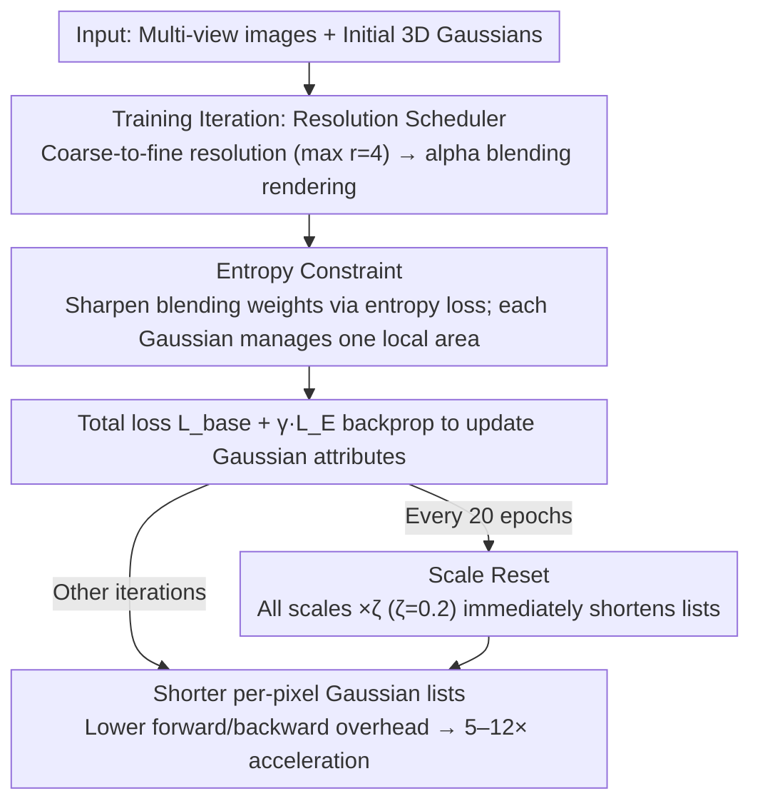

# Speeding Up the Learning of 3D Gaussians with Much Shorter Gaussian Lists

**Conference**: CVPR2026  
**arXiv**: [2603.09277](https://arxiv.org/abs/2603.09277)  
**Code**: [MachinePerceptionLab/ShorterSplatting](https://github.com/MachinePerceptionLab/ShorterSplatting)  
**Area**: 3D Vision  
**Keywords**: 3D Gaussian Splatting, Training Acceleration, Scale Reset, Entropy Constraint, Gaussian List Shortening

## TL;DR

By periodically resetting Gaussian scales (Scale Reset) and imposing entropy constraints on alpha blending weights (Entropy Constraint), the length of the Gaussian list for each pixel is shortened. This achieves a **5–12× acceleration** in 3DGS training while maintaining comparable rendering quality.

## Background & Motivation

Compared to NeRF, 3D Gaussian Splatting (3DGS) offers significant advantages in rendering efficiency and quality, but its training process remains slow, limiting time-sensitive applications. Existing acceleration methods mainly focus on the following aspects:

- **Reducing training iterations**: Reducing iterations from 30K to 5K–8K through better initialization or densification strategies.
- **Optimizers and CUDA implementations**: Using second-order optimizers to accelerate convergence or optimizing CUDA kernels.
- **Training strategies**: Freezing converged Gaussians, pruning redundant Gaussians, or progressive resolution training.

However, these methods either rely on reducing the total number of Gaussians (unsuitable for large-scale complex scenes) or provide only marginal acceleration (e.g., more accurate coverage estimation only accelerates by about 10%). This paper proposes a new perspective: **shortening the Gaussian list length for each pixel**, thereby reducing the number of Gaussians involved in each splatting operation, directly lowering the costs of forward rendering and backward gradient computation.

## Method

### Overall Architecture

Existing acceleration methods either cut the total number of Gaussians (hurting large scenes) or yield only marginal speedups. This work takes a different approach: keeping the total count intact while shortening the **Gaussian list length per pixel**. By ensuring each Gaussian concentrates its influence on local areas, fewer Gaussians are involved per pixel during splatting, reducing forward and backward costs. Implementation relies on three components: Scale Reset for periodic scale reduction, Entropy Constraint to sharpen alpha blending weights, and a Resolution Scheduler for coarse-to-fine resolution adjustment. All three are embedded in the standard 3DGS training loop, shortening the lists from different stages.

### Key Designs

**1. Scale Reset: Replacing complex volume penalties with periodic resets**

Larger Gaussians cover more pixels and result in longer lists. Intuitively, smaller scales should be encouraged, but adding volume penalty terms to the loss is difficult to tune—if the weight is too high, Gaussians are suppressed excessively; if too low, it is ineffective. Scale Reset bypasses gradients by directly multiplying all Gaussian scales by a scaling factor $\zeta < 1$ at fixed intervals:

$$s_i \leftarrow \zeta \cdot s_i, \quad \forall i$$

By default, this is executed every 20 epochs with $\zeta = 0.2$ (reducing to 20% of the original size). It offers three advantages over volume regularization: **Immediate effect**—the moment it is executed, lists for all pixels shorten, benefiting subsequent iterations immediately; **Adaptive recovery**—Gaussians have sufficient iterations to adjust color, opacity, position, and other attributes to approximate the radiance field again without quality collapse; **Beneficial side effects**—it encourages higher opacity, making Gaussians more compact and effective.

**2. Entropy Constraint: Sharpening blending weights for localized Gaussian influence**

Reducing scales alone is insufficient; each Gaussian must be concentrated on its dominant pixels. In alpha blending, the weight of the $i$-th Gaussian at pixel $p$ is $w_i = T_i \cdot \alpha_i$, where $T_i = \prod_{j=1}^{i-1}(1-\alpha_j)$. A list of length $N$ plus background contribution forms a valid probability distribution $\sum_{i=1}^{N+1} w_i = 1$ ($w_{N+1} = T_{N+1}$). This natural normalization allows entropy calculation without additional normalization or global statistics. The entropy for pixel $j$ is $H_j = -\sum_{i=1}^{N+1} w_{i,j} \log w_{i,j}$, and the entropy loss is the mean across all $M$ pixels: $\mathcal{L}_E = \frac{1}{M} \sum_{j=1}^{M} H_j$. Minimizing entropy pushes dominant weights higher and suppresses secondary weights, making each Gaussian more focused and shortening lists. To avoid per-pixel redundant derivation, the paper provides an $O(N)$ backward scanning algorithm: introducing an intermediate variable $R_{i,j} = \sum_{k=i}^{N+1} (\log w_{k,j} + 1) w_{k,j}$, then $\frac{\partial H_j}{\partial \alpha_{i,j}} = (-\log w_{i,j} - 1) T_{i,j} + \frac{R_{i+1,j}}{1-\alpha_{i,j}}$. This allows $R_j$ to be accumulated while scanning from $i=N$ to $1$. Unlike opacity constraints, entropy acts on blending weights that depend on opacity, scale, position, and rotation, providing more flexible regulation.

**3. Resolution Scheduler: Coarse-to-fine resolution adjustment**

Following the strategy of DashGaussian, the model is trained from low resolution (downsampling factor $r > 1$) to full resolution ($r=1$). However, excessively large $r$ can slow down training—at low resolutions, each tile covers a larger scene area with more Gaussian overlap. Empirically, the number of Gaussians per tile should not exceed 150, setting the $r_{\max}$ limit to 4. Stage-adaptive weights are used: weaker regularization in early low-resolution stages to preserve structure, followed by increased $\zeta$ and $\gamma$ in the full-resolution stage.

### Loss & Training

The total loss combines the base reconstruction loss with entropy regularization:

$$\mathcal{L} = \mathcal{L}_{\text{base}} + \gamma \mathcal{L}_E, \quad \mathcal{L}_{\text{base}} = (1-\lambda)\mathcal{L}_1 + \lambda \mathcal{L}_{\text{D-SSIM}}$$

Where $\gamma = 0.015$ is the weight for entropy loss, and $\lambda$ is the D-SSIM weight (following the 3DGS default).

## Key Experimental Results

### Main Results

Evaluations were conducted on Mip-NeRF 360, Deep Blending, and Tanks & Temples benchmarks using an RTX 5090 D GPU.

| Method | Iterations | # Gaussians | PSNR↑ | SSIM↑ | LPIPS↓ | Training Time (s)↓ |
|------|------|--------|-------|-------|--------|-------------|
| 3DGS | 30K | 3.3M | 27.55 | 0.819 | 0.209 | 919.51 |
| AdR-Gaussian | 30K | 1.3M | 26.92 | 0.792 | 0.257 | 504.86 |
| Taming-3DGS | 30K | 3.3M | 27.85 | 0.823 | 0.208 | 402.54 |
| EDGS | 5K | 3.5M | 26.46 | 0.817 | 0.205 | 318.06 |
| Mini-Splatting2 | 18K | 3.6M | 27.56 | 0.827 | 0.184 | 220.22 |
| DashGaussian | 30K | 3.3M | 27.84 | 0.824 | 0.203 | 218.85 |
| LiteGS | 30K | 3.3M | 27.75 | 0.822 | 0.208 | 191.17 |
| **Ours** | **30K** | **3.3M** | **27.28** | **0.810** | **0.224** | **99.58** |

*Results for the Mip-NeRF 360 dataset*

**Acceleration Gain**: Achieved speedups of **9.2×** (Mip-NeRF 360), **11.9×** (Deep Blending), and **5.3×** (Tanks & Temples) compared to 3DGS; nearly **50%** faster compared to the LiteGS baseline.

### Ablation Study

| Module Combination | PSNR↑ | SSIM↑ | LPIPS↓ | Time (s)↓ |
|---------|-------|-------|--------|---------|
| L (LiteGS) | 27.75 | 0.822 | 0.208 | 191.17 |
| L+R (Scale Reset) | 27.33 | 0.815 | 0.212 | 147.33 |
| L+E (Entropy) | 27.35 | 0.815 | 0.218 | 162.53 |
| L+R+E | 27.14 | 0.812 | 0.215 | 141.28 |
| L+D (DashGaussian) | 27.85 | 0.822 | 0.213 | 134.99 |
| L+D+R | 27.52 | 0.815 | 0.219 | 108.62 |
| L+D+E | 27.38 | 0.813 | 0.223 | 112.13 |
| L+D+R+E (Full Method) | 27.28 | 0.810 | 0.224 | 99.58 |

### Key Findings

1. **Scale Reset vs. Volume Regularization**: Scale Reset outperforms volume regularization in both quality and speed (PSNR 27.28 vs. 27.17, time 99.58s vs. 107.91s).
2. **Entropy vs. Opacity Constraint**: Entropy constraint is superior to opacity regularization because it acts on blending weights that integrate multiple attributes (opacity, scale, position, rotation), whereas opacity constraints are often too conservative.
3. **Module Complementarity**: Scale Reset provides immediate geometric regularization, while Entropy Constraint continuously adjusts contribution distributions during optimization; combined use yields the best results.
4. **Tile Size Independence**: 3DGS (16×16 tile) vs. LiteGS (8×8 tile) shows similar quality and training time, as smaller tiles produce shorter lists but increase the total number of tiles.
5. **Moderate Quality Trade-off**: The PSNR loss on Mip-NeRF 360 is only 0.27dB (27.28 vs. 27.55), while training time is drastically reduced from 919s to 100s.

## Highlights & Insights

- **Novel Perspective**: Instead of reducing the total number of Gaussians, it accelerates training by shortening the Gaussian list for each pixel, making it suitable for large-scale, complex scenes.
- **Simple and Efficient**: Scale Reset is implemented with a single line of code (element-wise multiplication), and the Entropy Constraint utilizes an efficient $O(N)$ gradient algorithm.
- **No Data Priors**: Does not rely on pre-trained models or geometric foundation models; it is a improvement at the training strategy level.
- **Orthogonality**: Can be combined with other methods such as CUDA optimizations (LiteGS) and resolution scheduling (DashGaussian).

## Limitations & Future Work

- **Quality Loss**: A PSNR drop of approximately 0.3-0.5dB might be unacceptable in high-fidelity scenarios.
- **Parameter Sensitivity**: Choosing $\zeta$ and $\gamma$ requires a trade-off between speed and quality, which may vary across scenes.
- **LiteGS Dependency**: Performance degradation in constrained settings (fewer iterations/Gaussians) stems from limitations in the LiteGS backbone.
- **High-order Optimizers**: Combining with second-order optimizers like Levenberg-Marquardt has not been explored and could offer further speedups.
- **Static Scene Focus**: Applicability to tasks such as dynamic scene reconstruction has not yet been verified.

## Rating

- Novelty: ⭐⭐⭐⭐ — Accelerating training via Gaussian list length is a novel perspective; Scale Reset is simple yet effective.
- Experimental Thoroughness: ⭐⭐⭐⭐⭐ — Extensive ablations on three standard datasets, detailed timing breakdowns, and comparison against multiple alternatives.
- Writing Quality: ⭐⭐⭐⭐ — Clear structure, rich diagrams, and complete mathematical derivations.
- Value: ⭐⭐⭐⭐ — Achieving 9× acceleration is of high practical value, and the method is easy to integrate into existing 3DGS pipelines.

<!-- RELATED:START -->

## Related Papers

- [\[CVPR 2026\] FastGS: Training 3D Gaussian Splatting in 100 Seconds](fastgs_training_3d_gaussian_splatting_in_100_seconds.md)
- [\[CVPR 2026\] Learning Differentiable Hierarchies in 3D Gaussian Splatting](learning_differentiable_hierarchies_in_3d_gaussian_splatting.md)
- [\[ICLR 2026\] MEGS2: Memory-Efficient Gaussian Splatting via Spherical Gaussians and Unified Pruning](../../ICLR2026/3d_vision/megs2_memory-efficient_gaussian_splatting_via_spherical_gaussians_and_unified_pr.md)
- [\[CVPR 2025\] MegaSynth: Scaling Up 3D Scene Reconstruction with Synthesized Data](../../CVPR2025/3d_vision/megasynth_scaling_up_3d_scene_reconstruction_with_synthesized_data.md)
- [\[CVPR 2026\] PhyGaP: Physically-Grounded Gaussians with Polarization Cues](phygap_physically-grounded_gaussians_with_polarization_cues.md)

<!-- RELATED:END -->
