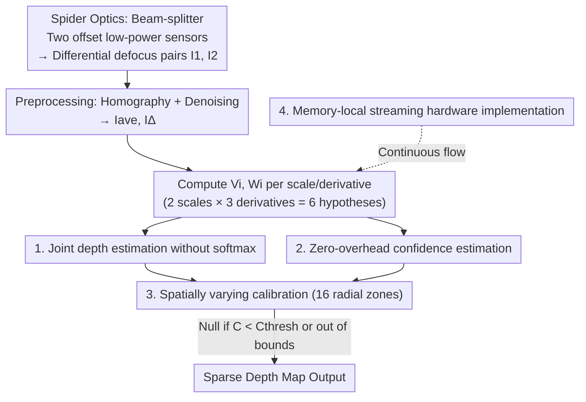

# SpiderCam: Low-Power Snapshot Depth from Differential Defocus

**Conference**: CVPR 2026  
**Paper**: [CVF Open Access](https://openaccess.thecvf.com/content/CVPR2026/html/Ferreira_SpiderCam_Low-Power_Snapshot_Depth_from_Differential_Defocus_CVPR_2026_paper.html)  
**Code**: None (Project page only: nubivlab.github.io/SpiderCam)  
**Area**: 3D Vision / Computational Imaging  
**Keywords**: Depth from Defocus, Differential Depth from Defocus (DfDD), Low-power FPGA, Snapshot Imaging, Streaming Hardware

## TL;DR
SpiderCam utilizes a beam-splitting prism and two low-power image sensors to capture a pair of differential defocus images. It executes an optimized Differential Depth from Defocus (DfDD) algorithm in a streaming fashion on a low-power FPGA—one too small to store even a single pair of full frames. This represents the first passive 3D camera in literature with a total power consumption under 1 Watt (624 mW @ 32.5 FPS) and an operating range exceeding half a meter.

## Background & Motivation
**Background**: Low-power depth sensing has long been dominated by stereo vision, where even the most efficient FPGA-based stereo prototypes consume 2–3 W. Depth from Defocus (DfD), specifically "Differential" DfDD which leverages infinitesimal defocus changes, theoretically requires significantly fewer FLOPs than other DfD methods but has never been validated in a truly ultra-low-power system.

**Limitations of Prior Work**: Many "low-power" stereo or DfD works in the literature suffer from two forms of inflation: first, they report only "core power," ignoring the electricity consumed by high-quality image sensors, I/O, and image alignment; second, they evaluate only on large-baseline, pre-aligned, high-quality datasets like KITTI/Middlebury, failing to report quantitative depth under real hardware acquisition. This overestimates accuracy and avoids the non-idealities of real low-power sensors, such as noise, calibration errors, and small baselines.

**Key Challenge**: Driving the total system power below 1 W involves overcoming three major obstacles: (1) an extremely tight computational budget where the relative cost of floating-point operations matters (one division ≈ ten additions); (2) minimal on-chip memory on low-power FPGAs that cannot hold two full frames, necessitating memory-local streaming; (3) small, noisy low-power sensors where optical aberrations and numerical errors are amplified.

**Goal**: To build a snapshot passive 3D camera that operates truly under 1 W, reporting total system power and real-world working distances, while adapting the DfDD algorithm for such hardware.

**Key Insight**: The authors draw inspiration from the jumping spider, which uses a poppy-seed-sized brain to estimate distance by simultaneously capturing a pair of differently defocused images with layered retinas. They implement this by using a beam-splitting prism to direct light onto two offset sensors, naturally obtaining "same-instant, two-defocus" image pairs at the hardware level.

**Core Idea**: Combine "spider-eye snapshot optics" with a "DfDD algorithm rewritten for low-power electronics"—replacing expensive softmax and divisions with cheap multiplications and sums, and using streaming processing with radial zone calibration to counter memory and aberration constraints. This achieves the first sub-Watt real-time passive depth camera.

## Method

### Overall Architecture
The system input consists of differential defocus image pairs $I_1, I_2$ captured simultaneously by two offset sensors behind a beam-splitter. The output is a sparse depth map filtered by a confidence threshold. The physical basis of DfDD is that the ratio of the intensity difference $I_\Delta$ at aligned pixels to the spatial second-order variation of the image $\nabla^2 I$ can cheaply estimate depth $Z$. The core relationship used is:

$$Z(x,y) = V(x,y)/W(x,y),\quad V = a\,\nabla^2\tilde{I},\quad W = bV - \tilde{I}_\Delta$$

where $a,b$ are calibrated camera parameters, and $\tilde{I}$ can be the original image, its spatial derivatives, or a downsampled version.

The pipeline performs preprocessing (sub-pixel homography for assembly error compensation + optional denoising), calculates the average image $I_{ave}$ and difference image $I_\Delta$, and then computes six $(V_i, W_i)$ hypotheses across two spatial scales and three derivative orders ($I, I_x, I_y$) in parallel. These hypotheses are jointly solved for depth and confidence using calibrated weights. Finally, a spatially varying (radially zoned) confidence threshold is applied to produce a sparse depth map. The entire algorithm is implemented as a streaming model on a Lattice ECP5 low-power FPGA.

### Key Designs

**1. Joint depth estimation without softmax: Replacing expensive softmax weighting with a single division**

Prior DfDD methods ([19,20]) fused multiple pixel-wise depth estimates $\{Z_i\}$ using softmax weighted by dynamic confidence $C_i$ ($Z=\sum_i e^{C_i}Z_i/\sum_i e^{C_i}$) to achieve dense and robust output. However, efficient hardware implementation of softmax remains a research challenge given the system's resource budget. The authors instead use a weighted joint solution for the six estimates:

$$Z(x,y) = \frac{\sum_i \omega_i V_i(x,y) W_i(x,y)}{\sum_i \omega_i W_i(x,y)^2}$$

Crucially, this formula requires only **one division**—which in their setting is as costly as ten additions. It preserves the range improvements of multi-hypothesis fusion while minimizing expensive operations.

**2. Zero-overhead confidence estimation: Using the numerator directly as confidence**

In natural scenes, triangulation cues are sparse, requiring per-pixel confidence to filter unreliable regions. The authors use a minimalist product-sum approach:

$$C_i(x,y) = V_i(x,y)W_i(x,y),\qquad C(x,y) = \sum_i \omega_i C_i(x,y)$$

The elegance lies in the fact that $C$ is exactly the **numerator** of the joint depth estimation, meaning confidence calculation requires almost no additional computation. Low confidence occurs where texture is missing ($V\propto\nabla^2 I$ approaches zero) or where the division is unstable ($W^2$ in the denominator approaches zero).

**3. 16 radial zone calibration: Countering field curvature and aberrations in compact optics**

Compact optics for low-power sensors suffer from non-idealities like Petzval field curvature, causing defocus inconsistency across the frame. Instead of constant parameters, the authors divide the image into **16 concentric radial zones**, allowing calibration parameters $\{a\}, \{b\}, C_{thresh}, Z_{min}, Z_{max}$ to vary per zone. To avoid expensive square root operations in the streaming pipeline, they compare the "squared radial distance" of the incoming pixel to thresholds to switch parameters dynamically.

**4. Memory-local streaming hardware: Executing the algorithm as a data stream on a tiny FPGA**

The algorithm is designed for the Lattice ECP5 (LFE5U-85F). To minimize power, the design avoids external DRAM and processes data in a stream. Key techniques include: (a) **Streaming upsamplers** using "zero-interleaved kernels" to expand the effective receptive field without increasing arithmetic operations or memory; (b) **Efficient kernels** using small, power-of-two integer coefficients and linear separable filters (e.g., 5-tap Burt-Adelson Gaussian); (c) **Mixed fixed-point + efficient floating-point**, using fixed-point during preprocessing and FP16 (without subnormal support) for the high-dynamic-range joint estimation.

## Key Experimental Results

### Main Results: Power and Working Distance Comparison
SpiderCam is one of the few passive FPGA depth cameras to report total system power alongside real acquired depth.

| System | Type | Core Power (W, Norm) | Real Working Range | Total Power |
|------|------|------|------|------|
| Mattoccia 2015 [45] | Stereo | 0.44–0.68 | Qualitative only | 2.5 W |
| Ttofis 2015 [65] | Stereo | 0.92–1.53 | Qualitative only | 2.8 W |
| Puglia 2017 [55] | Stereo | 0.43–0.68 | None | 2 W |
| Raj 2014 [30] | DfD | 0.46–0.58 | 0.77–0.80 m (0.5% err) | 2 W + Cam |
| Focal Split / Luo 2025 [42] | DfD | N/A | 0.40–1.20 m (10% err) | 4.9 W |
| **Ours (Norm, Kintex-7)** | DfD | **0.42–0.55** | – | – |
| **Ours (Measured, ECP5)** | DfD | **0.24–0.31** | **0.45–0.97 m (10% err)** | **0.6 W** |

Total system power is 624 mW @ 32.5 FPS, which is 1/3.3 to 1/5 of the lowest previously reported total power [55].

### Ablation Study: Impact of Estimates and Spatial Variation

| Configuration | Estimates | Range | Note |
|------|------|------|------|
| Full (2 Scales × 3 Derivs) | 6 | 0.43–0.99 m | Best accuracy |
| Single Scale × 3 Derivs | 3 | Second best | Higher efficiency than adding scales |
| 2 Scales × 1 Deriv | 2 | Poor | — |
| No spatial calibration | 6 | 0.51–0.82 m | Significant range reduction |

### Key Findings
- **Spatial calibration is crucial**: Removing it shrinks the range from 0.45–0.97 m to 0.51–0.82 m.
- **Derivatives are cheaper than scales**: Accuracy increases with the number of estimates, but adding derivative orders is more power-efficient than adding spatial scales.
- **Peripheral power dominates**: While core power varies between configurations, total system power is dominated by sensors and I/O.
- **Robustness**: The passive method handles reflections, transparent objects (bubble wrap), and motion blur more gracefully than active sensors (LiDAR/Structured Light).

## Highlights & Insights
- **"Designing out" expensive operations**: Instead of accelerating softmax or division, the authors redesigned the algorithm to use simpler arithmetic (weighted sums and single divisions).
- **Confidence as a byproduct**: Treating the numerator as a confidence metric is a "double-duty" calculation that is highly efficient for streaming.
- **Bio-inspired engineering**: Translating the jumping spider's layered retina into a beam-splitter dual-sensor system creates a manufacturable snapshot optical design.

## Limitations & Future Work
- **Sparse output**: The output is naturally sparse due to texture dependence.
- **Fixed thresholds**: Using a fixed confidence threshold is not always optimal; low-cost adaptive confidence estimation remains an open problem.
- **Limited FoV/Range**: Restricted to ~0.5m range and 9.4°×7.9° FoV due to compact optics.

## Related Work & Insights
- **vs. Stereo FPGA (e.g., Mattoccia, Ttofis)**: Stereo requires census transforms and semi-global matching (2–3 W). DfDD avoids matching, handles reflections better, and drops power to 0.6 W.
- **vs. Focal Split (Luo 2025 [42])**: Ours uses 12× more efficient sensors (HM0360), a streaming memory architecture, and spatial calibration. This reduces power from 4.9 W to 0.6 W while expanding the effective range.

## Rating
- Novelty: ⭐⭐⭐⭐⭐ 
- Experimental Thoroughness: ⭐⭐⭐⭐ 
- Writing Quality: ⭐⭐⭐⭐⭐ 
- Value: ⭐⭐⭐⭐⭐

<!-- RELATED:START -->

## Related Papers

- [\[CVPR 2026\] Spectrum from Defocus: Fast Spectral Imaging with Chromatic Focal Stack](spectrum_from_defocus_fast_spectral_imaging_with_chromatic_focal_stack.md)
- [\[CVPR 2026\] $L^{2}DGS$: Low-Light Dynamic Gaussian Splatting](l2dgs_low-light_dynamic_gaussian_splatting.md)
- [\[CVPR 2026\] GeoSAM2: Unleashing the Power of SAM2 for 3D Part Segmentation](geosam2_unleashing_the_power_of_sam2_for_3d_part_segmentation.md)
- [\[CVPR 2026\] Unlocking the Power of Critical Factors for 3D Visual Geometry Estimation](unlocking_the_power_of_critical_factors_for_3d_visual_geometry_estimation.md)
- [\[CVPR 2026\] Unleashing the Power of Chain-of-Prediction for Monocular 3D Object Detection](unleashing_the_power_of_chain-of-prediction_for_monocular_3d_object_detection.md)

<!-- RELATED:END -->
