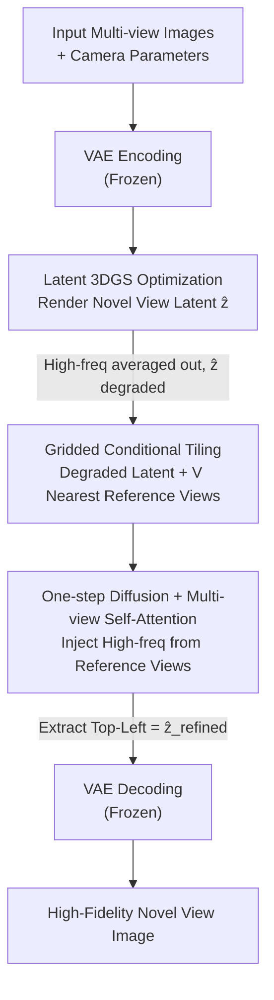

# Splatent: Splatting Diffusion Latents for Novel View Synthesis

**Conference**: CVPR 2026  
**arXiv**: [2512.09923](https://arxiv.org/abs/2512.09923)  
**Code**: https://orhir.github.io/Splatent (Project Page)  
**Area**: 3D Vision / Novel View Synthesis / Diffusion Models  
**Keywords**: Latent Radiation Fields, 3D Gaussian Splatting, Multi-view Attention, One-step Diffusion, VAE Latent Space

## TL;DR
Splatent performs 3DGS reconstruction within a frozen diffusion VAE latent space. It utilizes a one-step diffusion model combined with multi-view self-attention to inject high-frequency details—previously "averaged out" by 3D optimization—from neighboring reference views back into the rendered novel view latents. This approach achieves SOTA in latent-space novel view synthesis while preserving the reconstruction quality of the pre-trained VAE.

## Background & Motivation

**Background**: Diffusion models typically operate within a latent space compressed by a VAE. Recent works (such as LRF, latentSplat, and MVSplat360) have attempted to transition radiation fields (NeRF/3DGS) directly into this latent space for training. The advantages are significant: latent resolutions are downsampled by a factor of $f=8$, making optimization and rendering much faster. Furthermore, predicting 3D Gaussian features directly as latent features allows for end-to-end training of feed-forward 3D reconstruction networks, preventing gradient attenuation through the encoder.

**Limitations of Prior Work**: Directly applying 3DGS in the latent space often yields blurry results with lost details. The root cause is that the VAE latent space **lacks multi-view consistency**. Unlike the RGB space, high-frequency components essential for decoding are highly view-dependent and contradictory across different perspectives. 3DGS optimization attempts to find a consensus across all training views, which results in these conflicting high-frequency components being "averaged out," leaving only coarse low-frequency structures in the latent space, leading to blurry decodings.

**Key Challenge**: There is a trade-off between consistency and reconstruction quality. LRF **finetunes the VAE** to make the latent space more 3D-consistent, but this comes at the cost of reduced decoding quality and makes it difficult to integrate with pre-trained diffusion pipelines that expect the original distribution. MVSplat360 utilizes video diffusion models to hallucinate high-frequency details, which can lead to **hallucinations** of content not present in the scene (e.g., rendering incorrect details even when they were captured in input views).

**Goal**: To restore high-frequency details lost during latent space rendering while keeping the **VAE frozen** (preserving pre-trained weights, reconstruction quality, and generalization) and remaining faithful to input views without hallucinations.

**Key Insight**: The authors move beyond the "solve everything in 3D" paradigm. Since high-frequency view inconsistency is precisely why it cannot be unified in 3D space, it should not be forced. Instead, **3D representations handle low-frequency geometry**, while high-frequency details are managed in **2D space** by retrieving them from reference input views.

**Core Idea**: Replace "VAE finetuning" or "video diffusion hallucination" with a framework where "3DGS provides low-frequency geometry while one-step diffusion with multi-view self-attention injects high-frequency details from neighboring reference views." This enables faithful latent-space novel view synthesis under a frozen VAE.

## Method

### Overall Architecture
Splatent is a two-stage pipeline. Given a set of input views with camera parameters, **Stage 1** uses a pre-trained VAE to encode each image into the latent space. A 3DGS is then optimized on these latent features (following Feature-3DGS, each Gaussian is assigned an additional latent feature vector $f_z\in\mathbb{R}^d$, allowing the splatting of a novel view latent map). As established, the rendered latent map $\hat{z}$ is degraded due to multi-view inconsistency and lacks high frequencies. **Stage 2** performs diffusion refinement: the degraded rendering is tiled into a grid with several of its nearest neighbor reference latents (with the degraded map at the top-left). This grid is fed into a one-step diffusion model. Cross-view self-attention "transfers" high-frequency details from the reference views to the rendered latent. The top-left position of the grid is extracted as the refined latent $\hat{z}_{\text{refined}}$, which is finally decoded back into an image using the frozen VAE. The entire rendering and refinement process occurs **entirely in the latent space**, with the VAE remaining frozen throughout.

Stage 1 can either utilize per-scene test-time optimization (aligned with LRF's setup) or be replaced by a feed-forward network (like MVSplat360) to directly predict latent 3DGS, with Stage 2 acting as a plug-and-play enhancement module.

### Key Designs

**1. Latent 3DGS for Low-Frequency Geometry: Division of Labor**

The authors first diagnose "why it is blurry" before assigning tasks based on the findings. Each 3D Gaussian $G=(\mu,\Sigma,\alpha,f_c)$ is given a $d$-dimensional latent feature $f_z$. During splatting, these features are alpha-composited into a latent map. The issue is that VAE latents contain both low-frequency and high-frequency components. High-frequency components are severely inconsistent across views. Since 3DGS optimization requires multi-view consensus, the high frequencies cancel each other out, leaving only low-frequency coarse structures. The authors' key judgment is that **this low-frequency geometry is reliable**—it originates from actual 3D reconstruction and is naturally multi-view consistent. Therefore, rather than forcing the latent space to be consistent via VAE finetuning (which degrades decoding), they **accept that 3DGS can only provide low-frequency geometry** and delegate the high-frequency restoration to a 2D module in Stage 2.

**2. Gridded Multi-view Self-Attention Refinement: High-Frequency Transfer**

This is the core mechanism for restoring high frequencies. Inspired by Difix3D but with a different objective—where Difix3D fixes artifacts in RGB rendering, this work restores details **lost** due to 3D inconsistency in latent space. The degraded rendering $\hat{z}$ and $V$ neighboring training reference latents $\{z^i_{\text{ref}}\}_{i=1}^{V}$ are arranged into a grid $\hat{z}_{\text{grid}}\in\mathbb{R}^{(V+1)\times M\times d}$ (where $M=h\times w$). The view axis is merged into the spatial dimension to obtain $z\in\mathbb{R}^{((V+1)\cdot M)\times d}$, and **joint self-attention** is performed across all views:

$$\hat{z}_{\text{grid}}\in\mathbb{R}^{(V+1)\times M\times d}\ \longrightarrow\ z\in\mathbb{R}^{((V+1)\cdot M)\times d}\ \xrightarrow{\text{self-attn}}\ \hat{z}_{\text{refined}}$$

During denosing, attention propagates high-frequency details from reference views to the rendered latent. Reference views are selected based on their proximity in position and orientation to the target view. Using grid-based tiling rather than architectural changes allows the method to remain agnostic to the specific diffusion backbone.

**3. One-step Frozen-VAE Diffusion: Faithful, Efficient, and Plug-and-Play**

The refinement model is based on one-step diffusion (using pre-trained Stable Diffusion Turbo), producing results in a single forward pass for fast inference. Crucially, the **VAE remains frozen** throughout, preserving its reconstruction quality and generalization capabilities learned from billions of images. This also ensures the latent distribution remains unchanged, allowing seamless integration with existing latent diffusion pipelines—a feature LRF sacrifices. The complementarity of three information sources—diffusion priors, reference view details, and rendered coarse geometry—makes the model particularly stable under sparse views.

### Loss & Training
During training, a degraded latent $\hat{z}$ is rendered from training camera parameters, with a corresponding ground-truth encoded latent $z_{\text{gt}}$ for supervision. The primary loss is the latent space reconstruction L2:

$$\mathcal{L}_{\text{recon}}=\|\hat{z}_{\text{refined}}-z_{\text{gt}}\|_2^2$$

To improve perceptual quality, LPIPS and RGB reconstruction losses are added to the **decoded images** ($\mathcal{D}$ denotes the VAE decoder):

$$\mathcal{L}_{\text{LPIPS}}=\text{LPIPS}\big(\mathcal{D}(\hat{z}_{\text{refined}}),\mathcal{D}(z_{\text{gt}})\big),\quad \mathcal{L}_{\text{RGB}}=\|\mathcal{D}(\hat{z}_{\text{refined}})-\mathcal{D}(z_{\text{gt}})\|_2^2$$

The total loss is $\mathcal{L}_{\text{total}}=\mathcal{L}_{\text{recon}}+\lambda_{\text{LPIPS}}\mathcal{L}_{\text{LPIPS}}+\lambda_{\text{RGB}}\mathcal{L}_{\text{RGB}}$, with $\lambda_{\text{LPIPS}}=2$ and $\lambda_{\text{RGB}}=1$. Implementation details: KL-VAE from LDM ($f=8$), SD-Turbo, number of reference views $V=3$, noise level $\tau=300$. Model finetuned on 8×H100 for ~24 hours using 400 scenes from DL3DV-10K.

## Key Experimental Results

### Main Results
Evaluation was conducted on DL3DV-10K, LLFF, and Mip-NeRF360 (both LRF and Splatent were trained only on DL3DV-10K to test cross-dataset generalization). The "Dense" setting uses 30 input views (1/8 views for LLFF), and the "Sparse" setting uses 5.

| Setting / Dataset | Metric | Feature-3DGS | LRF (Prev. SOTA) | Splatent | Gain |
|--------|------|------|----------|------|------|
| Dense / DL3DV-10K | PSNR↑ | 16.37 | 20.19 | **21.94** | +1.75 |
| Dense / DL3DV-10K | LPIPS↓ | 0.704 | 0.322 | **0.265** | −0.057 |
| Dense / DL3DV-10K | FID↓ | 263.45 | 75.32 | **35.60** | −39.7 |
| Dense / Mip-NeRF360 | PSNR↑ | 14.85 | 19.08 | **20.42** | +1.34 |
| Sparse / DL3DV-10K | PSNR↑ | 15.04 | 15.34 | **17.44** | +2.10 |
| Sparse / DL3DV-10K | FID↓ | 308.00 | 204.36 | **86.12** | −118 |

Splatent leads across all datasets and metrics, with particularly large gains in FID. The advantage is more pronounced in sparse settings. 3D consistency was evaluated separately via the MEt3R metric (lower is better):

| Setting | Feature-3DGS | LRF | Splatent | Relative Gain |
|------|------|------|------|------|
| Dense | 0.1106 | 0.1082 | **0.0774** | ~28–30% |
| Sparse | 0.1281 | 0.1272 | **0.0998** | ~22% |

### Ablation Study
Impact of the number of reference views (DL3DV-10K, Dense):

| Configuration | PSNR↑ | LPIPS↓ | FID↓ | Description |
|------|------|---------|------|------|
| No Ref | 19.47 | 0.389 | 83.66 | Relying solely on diffusion prior; prone to hallucination. |
| 1 Ref | 21.61 | 0.276 | 38.04 | Major improvement with just one reference view. |
| Splatent (3 Refs) | 21.94 | 0.265 | 35.60 | Default config; balance of quality and VRAM. |
| 5 Refs | 21.96 | 0.263 | 35.16 | Diminishing returns. |

### Key Findings
- **Reference views are vital for high-frequency restoration**: Moving from "No Ref" to "1 Ref" increases PSNR by 2.1 and cuts FID from 83.66 to 38.04, proving details are retrieved from references rather than purely hallucinated.
- **Saturation at 3 views**: Performance gains saturate beyond 3 views in dense settings, while memory usage increases linearly.
- **Maximized gains in sparse scenarios**: In the 5-view Sparse setting, FID is reduced by more than half compared to LRF, showing the robust complementarity of the three information sources.
- **Plug-and-play enhancement for feed-forward models**: Integrating with MVSplat360 improved all metrics (PSNR 16.69→17.98) and corrected hallucinated structural errors.

## Highlights & Insights
- **Division of labor (3D for low-freq, 2D for high-freq)**: The realization that high-frequencies cannot be unified in 3D space allows the problem to be moved to the appropriate 2D domain.
- **Frozen VAE + Gridded Conditions**: By not modifying the VAE, the model preserves billion-image reconstruction quality and distribution compatibility. Using grid-tiling maintains compatibility with various diffusion backbones.
- **Fidelity vs. Generation**: Splatent is clearly positioned as a "fidelity" approach (retrieving real details) versus "generative" approaches (hallucinating content), yet it can integrate with the latter to provide both strong priors and fidelity constraints.

## Limitations & Future Work
- **Latent Bottleneck**: Latent space is inherently lossy. When RGB-space 3DGS is feasible and sufficient, RGB remains superior. Splatent is targeted at pipelines that must operate in the latent space.
- **VAE Reconstruction Ceiling**: The upper bound of high-frequency restoration is determined by the VAE decoder's quality.
- **Reference Selection**: Heuristics based on position/orientation are used; more advanced selection strategies in non-uniform view distributions remain unexplored.

## Related Work & Insights
- **vs. LRF**: LRF finetunes the VAE to force consistency, sacrificing quality. Splatent freezes the VAE and handles consistency/detail in 2D, outperforming LRF across the board.
- **vs. MVSplat360**: MVSplat360 uses video diffusion for hallucination. Splatent emphasizes fidelity via reference views. Splatent can serve as a detail enhancer for MVSplat360.
- **vs. Difix3D**: Difix3D refines artifacts in RGB rendering. Splatent addresses the more difficult problem of **lost** information in latent space due to 3D inconsistency.

## Rating
- Novelty: ⭐⭐⭐⭐⭐ (Effective task decomposition between 3D and 2D domains).
- Experimental Thoroughness: ⭐⭐⭐⭐ (Extensive cross-dataset and setting evaluations).
- Writing Quality: ⭐⭐⭐⭐⭐ (Strong logical flow from diagnosis to solution).
- Value: ⭐⭐⭐⭐ (Practical enhancement for latent-space 3D reconstruction).

<!-- RELATED:START -->

## Related Papers

- [\[CVPR 2026\] PR-IQA: Partial-Reference Image Quality Assessment for Diffusion-Based Novel View Synthesis](pr-iqa_partial-reference_image_quality_assessment_for_diffusion-based_novel_view.md)
- [\[CVPR 2026\] Physically Inspired Gaussian Splatting for HDR Novel View Synthesis](physically_inspired_gaussian_splatting_for_hdr_novel_view_synthesis.md)
- [\[CVPR 2026\] Learning Compact 3D Representations from Feed-Forward Novel View Synthesis](learning_compact_3d_representations_from_feed-forward_novel_view_synthesis.md)
- [\[CVPR 2026\] From None to All: Self-Supervised 3D Reconstruction via Novel View Synthesis](from_none_to_all_self-supervised_3d_reconstruction_via_novel_view_synthesis.md)
- [\[CVPR 2026\] SmokeSVD: Smoke Reconstruction from A Single View via Progressive Novel View Synthesis and Refinement with Diffusion Models](smokesvd_smoke_reconstruction_from_a_single_view_via_progressive_novel_view_synt.md)

<!-- RELATED:END -->
