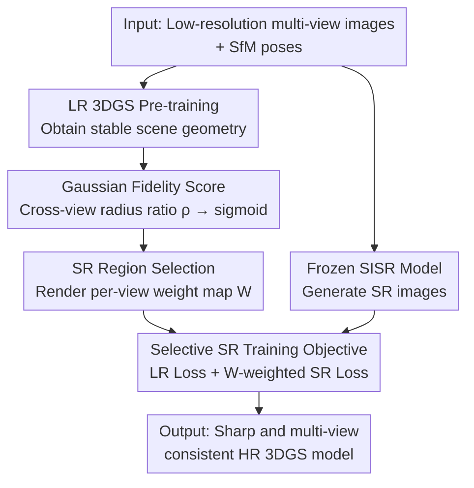

# SplatSuRe: Selective Super-Resolution for Multi-view Consistent 3D Gaussian Splatting

**Conference**: CVPR 2026  
**Paper**: [CVF Open Access](https://openaccess.thecvf.com/content/CVPR2026/html/Asthana_SplatSuRe_Selective_Super-Resolution_for_Multi-view_Consistent_3D_Gaussian_Splatting_CVPR_2026_paper.html)  
**Code**: https://splatsure.github.io (Project Page)  
**Area**: 3D Vision  
**Keywords**: Gaussian Splatting, Super-Resolution, Multi-view Consistency, Novel View Synthesis, Geometry-aware Supervision

## TL;DR
SplatSuRe avoids uniformly applying super-resolution (SR) to all pixels. Instead, it calculates a fidelity score based on how sufficiently each Gaussian is sampled across views and renders per-view weight maps. SR supervision is injected only into undersampled regions lacking high-frequency observations, resulting in sharper and multi-view consistent high-resolution reconstructions without additional neural components or modifications to the 3DGS backbone.

## Background & Motivation

**Background**: 3DGS utilizes anisotropic Gaussians and differentiable splatting for real-time high-fidelity novel view synthesis, but rendering quality is strictly tied to the training image resolution. When only low-resolution (LR) training images are available, a natural strategy is to use SR to enhance LR images to HR before fitting the 3D model (e.g., SRGS).

**Limitations of Prior Work**: Single Image Super-Resolution (SISR) processes each view independently, often producing view-dependent "hallucinated textures." Using these inconsistent SR results as direct supervision leads to conflicting gradients during 3D optimization across views, resulting in blurred renderings after averaging. Existing methods (learned neural components, temporal-consistent video priors, joint LR+SR optimization) attempt to mitigate inconsistency, but they **apply SR indiscriminately to every image and region**, regardless of whether generative details are actually needed.

**Key Challenge**: SR is not uniformly beneficial across the entire scene. Some regions already receive sufficient high-frequency supervision from closer LR views; applying SR there introduces unnecessary inconsistencies and damages cross-view consistency. Contrastingly, distant or sparsely observed regions are truly undersampled and require SR to compensate for missing details.

**Goal**: Refine the "to SR or not" decision from a global image-level policy to a **geometry-aware per-region decision**—identifying 3D regions lacking high-frequency observations and injecting SR only there.

**Key Insight**: The authors observe that multi-view sampling of 3D content is non-uniform. A close-up LR image often contains sufficient high-frequency details to supervise the same region observed coaresly by distant views. Consequently, many views already obtain high-frequency supervision from closer counterparts, and only regions without closer views require SR guidance.

**Core Idea**: Quantify how "sufficiently sampled" each Gaussian is based on the relationship between camera poses and scene geometry. This generates per-view weight maps to **selectively** apply SR only in undersampled regions rather than applying indiscriminate enhancement.

## Method

### Overall Architecture
SplatSuRe is a two-stage, supervision-only selective SR framework that introduces no new networks. First, an LR 3DGS model is trained using LR images to obtain stable geometry, which is used to calculate fidelity scores for each Gaussian and generate per-view weight maps (marking high-frequency deficiencies). Then, the target HR 3DGS model is trained: in each iteration, the HR rendering is downsampled and compared with the LR ground truth ($L_{LR}$, global consistency supervision). Simultaneously, the SR image produced by a frozen SISR model is compared with the HR rendering using the weight map for spatial weighting ($L_{SR}$, effective only in undersampled regions), with both weighted by coefficient $\gamma$. The pipeline only modifies the supervision loss, while rendering and densification follow standard 3DGS.

### Key Designs

**1. Gaussian Fidelity Score: Quantifying sampling sufficiency via cross-view screen radius ratios**

Different views contribute unequal high-frequency information to the 3D reconstruction—a close-up/telephoto LR view may contain more detail than a distant HR view. SplatSuRe first trains an LR 3DGS with LR images to obtain stable geometry. For each Gaussian $G_i$, it calculates the screen-space radius $r_i = 3\sqrt{\max(\lambda_1^i, \lambda_2^i)}$ (where $\lambda$ are eigenvalues of the 2D covariance matrix) across all training views. The ratio of the maximum to minimum radius $\rho_i = r_{max}^i / r_{min}^i$ for that Gaussian across all views in which it participates is used as an approximation of sampling frequency. A large ratio indicates high-fidelity observation in some views capable of supervising others; a ratio near 1 indicates uniform sampling frequency across views, suggesting a lack of higher-frequency observations and a need for SR. A crucial detail is that 3DGS uses a fixed low-pass filter to inflate Gaussians by $s=0.3$ to prevent aliasing, which artificially inflates radii (especially for distant Gaussians). This **inflation must be excluded** when calculating ratios. Finally, the raw ratio is shifted by a threshold and passed through a sigmoid to map to $[0,1]$: $\text{score}_{G_i} = \sigma((\rho_i - \tau)/k)$, where $k=0.05$ controls transition smoothness and $\tau$ is a hyperparameter based on scene structure and SR consistency. Gaussians visible in fewer than three views have their scores set to zero. High score = Sufficiently covered by LR; Low score = SR required.

**2. SR Region Selection: Rendering Gaussian-level scores into per-view pixel weight maps**

Fidelity scores are scene-level and defined per Gaussian, but updating the HR model requires pixel-level weights for each training view. For a given view $t$, the set of Gaussians whose maximum radius occurs exactly in that view is identified: $M(t) = \{G_i \mid t = \arg\max_{t'} r_{t'}^i\}$—these Gaussians are observed most closely in this view, with no other view providing higher-frequency information. The weight map for this view is rendered as $W'_t = (1 - \text{Render}(\text{score}_G)) + \text{Render}(\mathbf{1}_{M(t)}(G))$. The first term applies SR to low-fidelity (undersampled) regions, and the second term applies SR to regions where "this view provides the closest observation" (since no other view can provide higher resolution). The weight map is then normalized to ensure consistent SR loss magnitude across views. Intuitively, the weight map is bright in areas needing SR (e.g., distant trees behind a tractor) and dark in areas already sufficiently sampled by other LR views.

**3. Selective SR Training Objective: Pinning SR supervision only to required pixels via weight maps**

With the weight map $W_t$, the training objective uses two complementary signals. In each iteration, an HR rendering $R_{HR}$ is generated at the target resolution. It is **downsampled** and compared to the LR ground truth $I_{LR}$ to produce a globally consistent LR loss $L_{LR} = (1-\lambda)L_1(R_{HR}{\downarrow}, I_{LR}) + \lambda L_{\text{D-SSIM}}(R_{HR}{\downarrow}, I_{LR})$. Simultaneously, the SR image $I_{SR}$ from the frozen SISR is compared to $R_{HR}$ using a **spatially weighted** loss $L_{SR} = (1-\lambda)L_1^W(R_{HR}, I_{SR}) + \lambda L_{\text{D-SSIM}}^W(R_{HR}, I_{SR})$, where each pixel's contribution is scaled by $W_t$. High weights amplify SR supervision in undersampled regions, while low weights suppress SR where LR is reliable. The total objective is $L = (1-\gamma)L_{LR} + \gamma L_{SR}$, with $\gamma$ balancing the two. Thus, the model borrows generative details only where they improve reconstruction, avoiding inconsistencies in well-constrained regions.

### Loss & Training
Two-stage training: First, LR initialization (obtaining geometry and weight maps), followed by HR selective SR optimization. Main experiments use 4× SR with StableSR as the SISR, ratio threshold $\tau=1.1$, loss coefficients $\lambda=0.2$ and $\gamma=0.4$. An appendix provides a unified pipeline combining LR initialization and SR refinement within the same training budget as single-stage baselines.

## Key Experimental Results

### Main Results
On three real-world datasets (Tanks & Temples, Deep Blending, Mip-NeRF 360), at 4× SR with $\tau=1.1$:

| Dataset | Metric | Ours | SRGS | Mip-Splatting | 3DGS(LR) |
|--------|------|------|------|---------------|----------|
| Tanks & Temples | SSIM ↑ | **0.784** | 0.771 | 0.767 | 0.669 |
| Tanks & Temples | PSNR ↑ | **23.81** | 23.32 | 23.10 | 19.41 |
| Tanks & Temples | LPIPS ↓ | **0.272** | 0.286 | 0.303 | 0.350 |
| Tanks & Temples | FID ↓ | **37.72** | 49.11 | 52.46 | 71.58 |
| Deep Blending | SSIM ↑ | **0.872** | 0.861 | 0.865 | 0.836 |
| Deep Blending | PSNR ↑ | **29.01** | 28.23 | 28.43 | 26.72 |
| Mip-NeRF 360 | PSNR ↑ | 26.34 | 25.92 | **26.48** | 20.67 |

> Metric Note: FID/CMMD/DreamSim are perception-based metrics (lower is better), while MUSIQ/NIQE are no-reference naturalness scores. The paper notes that perceptual metrics often downsample images before feature extraction, making them less sensitive to high-frequency sharpness, thus 8 complementary metrics are used for evaluation.

Ours is optimal across nearly all metrics on Tanks & Temples and is strongest on Deep Blending. On Mip-NeRF 360, Ours outperforms SRGS broadly (except LPIPS), but both SR methods are outperformed by Mip-Splatting. This is because Mip-NeRF 360 has smooth camera trajectories, dense multi-view coverage, and minimal undersampling; its LR images already retain most high frequencies, leaving little room for SR improvement.

### Ablation Study

| Configuration | Key Finding | Description |
|------|---------|------|
| Threshold $\tau$ | PSNR/LPIPS peaks then drops as $\tau$ increases | A small amount of SR details is beneficial; excessive SR introduces cross-view inconsistency. $\tau=1.1$ is a chosen middle ground. |
| SISR Backbone (SwinIR vs StableSR) | Outperforms SRGS under both backbones | SwinIR is conservative with higher PSNR but over-smoothed; StableSR uses diffusion priors for better sharpness/perception but lower PSNR. StableSR is preferred for perceptual quality. |

### Key Findings
- **More SR is not always better**: Threshold ablation shows an optimal SR amount; excessive SR causes degradation in scenes with large camera-object distance variations due to inconsistency.
- **Backbone Decoupling**: Improving over SRGS using either SwinIR or StableSR proves Gains come from "selective application" rather than a specific SR network. Gains are larger with StableSR because its higher perceptual quality and inconsistency are effectively managed by the selective mechanism.
- **Concentrated Gains in Foreground/Undersampled Areas**: The most significant improvements occur in local foreground regions requiring higher detail, consistent with the design motivation.
- **Counter-intuitive No-reference Metrics**: 3DGS(LR) performs well on MUSIQ/NIQE because aliasing noise fits the natural image statistics favored by these metrics, but this does not reflect better visual quality.

## Highlights & Insights
- **Geometrizing "Sampling Sufficiency" as a Renderable Scalar Field**: Using cross-view screen radius ratios $\rho_i$ to quantify high-frequency availability and rendering this into per-view weight maps is a lightweight yet direct geometric prior that identifies detail deficiencies without learned components.
- **Excluding anti-aliasing inflation is crucial**: The authors noted that fixed low-pass inflation in 3DGS artificially enlarges radii for distant Gaussians, polluting the ratio. Excluding this shows a deep understanding of 3DGS internals.
- **Supervision-only, Zero Extra Networks**: By modifying only the loss, the method remains compatible with any SISR, video SR, diffusion post-processing, or 3D point cloud upsampling.
- **"Where generative details are needed" is a reusable question**: This geometry-aware where-to-SR criterion can serve as a guidance signal for diffusion-based 3D enhancement, preventing blind global generation.

## Limitations & Future Work
- **Conservative Strategy may Miss Useful SR**: Suppressing SR in regions covered fully by LR may miss beneficial refinements like stable details on high-contrast edges; future versions could selectively allow SR in these areas.
- **Single Upsampling Level**: The framework currently works at one scale; multi-scale formulations could provide finer control over SR injection for further sharpness Gains.
- **Reliance on SISR Multi-view Consistency Ceiling**: While reducing inconsistency, the method remains bounded by the quality of absolute SR images. Multi-view consistent generative SR is needed for breakthroughs.
- **Undersampling Criterion Depends on LR Geometry Quality**: Fidelity scores rely on LR 3DGS geometry. Scenes with failed SfM or unstable geometry (two excluded from T&T) directly impact weight map reliability.

## Related Work & Insights
- **vs SRGS**: SRGS also optimizes LR+SR with frozen SISR but applies it **indiscriminately across the image**, failing to eliminate blurring from SR inconsistencies. SplatSuRe is sharper and more consistent.
- **vs Mip-Splatting**: Mip-Splatting uses multi-scale 3D/2D anti-aliasing filters but quality is still limited by training resolution. SplatSuRe active high-frequency injection is superior on undersampled datasets (T&T, Deep Blending) but is surpassed on densely covered ones (Mip-NeRF 360).
- **vs S2Gaussian / SuperGaussian**: These rely on extra neural components or lack spatial adaptivity. SplatSuRe achieves spatial adaptivity via camera-geometry relationships without extra networks.
- **vs GaussianSR / 3DSR**: These use large pre-trained diffusion models for inconsistent predictions. SplatSuRe's explicit geometry criterion can complement these as a guidance mechanism.

## Rating
- Novelty: ⭐⭐⭐⭐ "Selective over uniform SR" + geometric ratio criterion is novel and elegant, though built on the SRGS framework.
- Experimental Thoroughness: ⭐⭐⭐⭐ Three datasets, eight metrics, and thorough ablations. Minor limitation in static scene focus.
- Writing Quality: ⭐⭐⭐⭐⭐ Well-reasoned motivation, observation, and mechanism. Excellent explanation of metric nuances.
- Value: ⭐⭐⭐⭐ Zero additional networks, high utility for foreground detail, and orthogonal to various SR/diffusion methods. Bounded by SISR consistency and LR geometry.

<!-- RELATED:START -->

## Related Papers

- [\[CVPR 2025\] S2Gaussian: Sparse-View Super-Resolution 3D Gaussian Splatting](../../CVPR2025/3d_vision/s2gaussian_sparse-view_super-resolution_3d_gaussian_splatting.md)
- [\[CVPR 2026\] Multi-view Consistent 3D Gaussian Head Avatars 'without' Multi-view Generation](multi-view_consistent_3d_gaussian_head_avatars_without_multi-view_generation.md)
- [\[CVPR 2026\] BRepGaussian: CAD Reconstruction from Multi-View Images with Gaussian Splatting](brepgaussian_cad_reconstruction_from_multi-view_images_with_gaussian_splatting.md)
- [\[CVPR 2026\] Confidence-Guided Multi-Scale Aggregation for Sparse-View High-Resolution 3D Gaussian Splatting](confidence-guided_multi-scale_aggregation_for_sparse-view_high-resolution_3d_gau.md)
- [\[AAAI 2026\] Arbitrary-Scale 3D Gaussian Super-Resolution](../../AAAI2026/3d_vision/arbitrary-scale_3d_gaussian_super-resolution.md)

<!-- RELATED:END -->
