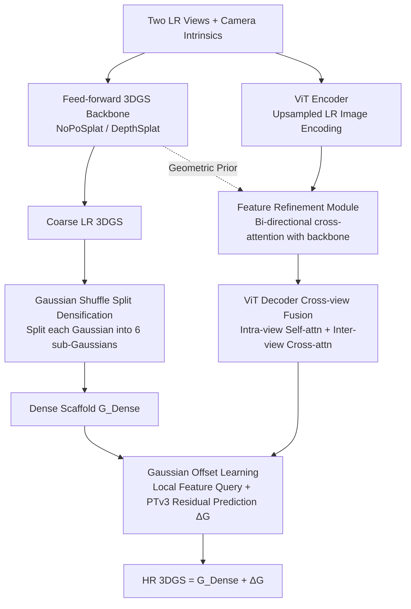

# SR3R: Rethinking Super-Resolution 3D Reconstruction With Feed-Forward Gaussian Splatting

**Conference**: CVPR2026  
**arXiv**: [2602.24020](https://arxiv.org/abs/2602.24020)  
**Code**: [Project Page](https://xiangfeng66.github.io/SR3R/)  
**Area**: 3D Vision  
**Keywords**: 3D Super-Resolution, 3D Gaussian Splatting, Feed-forward Reconstruction, Gaussian Offset Learning, Sparse-view Reconstruction

## TL;DR

Ours redefines 3D Super-Resolution (3DSR) as a **feed-forward mapping** problem from sparse low-resolution views to high-resolution 3DGS. High-fidelity HR 3DGS reconstruction is achieved through Gaussian offset learning and feature refinement, enabling strong zero-shot generalization without per-scene optimization.

## Background & Motivation

- **Limitations of Prior Work**: Existing 3DSR methods rely on dense LR inputs and pre-trained 2D super-resolution models to generate pseudo-HR images, followed by per-scene optimization of HR 3DGS. This approach has three fundamental limitations:
  1. **Limited High-Frequency Priors**: High-frequency knowledge stems solely from 2DSR model priors, failing to learn 3D-specific high-frequency geometric/textural structures.
  2. **Reconstruction Fidelity Ceiling**: The quality of pseudo-HR labels inherently determines the upper bound of reconstruction.
  3. **High Computational Overhead**: Requires dense multi-view synthesis and iterative per-scene optimization, precluding cross-scene generalization.
- **Key Insight**: While feed-forward 3DGS reconstruction models can predict 3DGS directly from sparse views, their quality is severely limited by input resolution. This raises the question: can 3DSR be modeled as a feed-forward mapping to learn 3D-specific high-frequency priors from large-scale multi-scene data?
- **Paradigm Shift**: Transitioning from "per-scene HR 3DGS self-optimization" to "generalized HR 3DGS feed-forward prediction" fundamentally changes how 3DSR acquires high-frequency knowledge.

## Method

### Overall Architecture

SR3R aims to directly predict a set of high-resolution (HR) 3D Gaussians from only two low-resolution (LR) views, avoiding per-scene optimization or reliance on pseudo-HR labels from 2D super-resolution models. It is designed as a **plug-and-play** layer: an existing feed-forward 3DGS backbone (e.g., NoPoSplat/DepthSplat) first extracts a coarse LR 3DGS $\mathcal{G}^{\text{LR}}$ from two LR views, which SR3R then refines and enhances with high-frequency details.

The pipeline operates as follows: LR images are processed by a ViT encoder, aligned with the backbone's geometric priors via feature refinement, and fused across views using a ViT decoder to extract multi-view features. Simultaneously, $\mathcal{G}^{\text{LR}}$ is densified into a structural scaffold $\mathcal{G}^{\text{Dense}}$ via Gaussian Shuffle Split. Finally, decoded features are used to predict residual offsets on the scaffold, transforming $\mathcal{G}^{\text{Dense}}$ into $\mathcal{G}^{\text{HR}}$. The mapping is formulated as:

$$f_{\boldsymbol{\theta}}: \{(\boldsymbol{I}^{v}_{lr}, \boldsymbol{K}^{v})\}_{v=1}^{V} \mapsto \mathcal{G}^{\text{HR}}$$

where each 3D Gaussian primitive is parameterized by $(\boldsymbol{\mu}, \alpha, \boldsymbol{r}, \boldsymbol{s}, \boldsymbol{c})$, representing center position, opacity, quaternion rotation, scale, and spherical harmonic coefficients.

### Key Designs

**1. Gaussian Shuffle Split Densification: Constructing a Fine Structural Scaffold**

The LR 3DGS generated by feed-forward backbones is too sparse to support HR-level details. SR3R performs densification by splitting each primitive in $\mathcal{G}^{\text{LR}}$ into 6 sub-Gaussians along the positive and negative directions of its three principal axes. The positions are given by:

$$\boldsymbol{\mu}_{j,k} = \boldsymbol{\mu}_j + \beta \, R_j \, \boldsymbol{e}_k \odot \boldsymbol{s}_j, \quad k=1,\dots,6$$

where $R_j$ is the rotation matrix derived from quaternion $\boldsymbol{r}_j$, $\boldsymbol{e}_k$ represents unit vectors of the principal axes, and $\beta=0.5$ controls the split magnitude. The scale of sub-Gaussians along the offset axis is reduced to $1/4$ to prevent overlapping artifacts. Splitting is only applied to Gaussians with opacity $> 0.5$ to concentrate computation on salient structures. The resulting $\mathcal{G}^{\text{Dense}}$ contains $N = 6M$ primitives ($M$ being the number of LR Gaussians), serving as a reliable structural scaffold.

**2. Feature Refinement: Filtering "Fake High-Frequencies" from Upsampling**

Upsampling LR images introduces blurring and "hallucinated" high-frequencies. Directly using these to predict Gaussians leads to 3D geometric and textural artifacts. The Feature Refinement module employs **bi-directional cross-attention** between the ViT encoded features $\boldsymbol{t}_{\text{en}}$ and the geometry-aware features $\boldsymbol{t}_{\text{pre}}$ from the pre-trained 3DGS backbone to calibrate both:

$$\mathbf{U}_{o \leftarrow p} = \text{softmax}\!\left(\frac{(\boldsymbol{t}_{\text{en}} \boldsymbol{W}^o_Q)(\boldsymbol{t}_{\text{pre}} \boldsymbol{W}^p_K)^\top}{\sqrt{d}}\right)(\boldsymbol{t}_{\text{pre}} \boldsymbol{W}^p_V)$$

$$\mathbf{U}_{p \leftarrow o} = \text{softmax}\!\left(\frac{(\boldsymbol{t}_{\text{pre}} \boldsymbol{W}^p_Q)(\boldsymbol{t}_{\text{en}} \boldsymbol{W}^o_K)^\top}{\sqrt{d}}\right)(\boldsymbol{t}_{\text{en}} \boldsymbol{W}^o_V)$$

The outputs are concatenated and fused via an MLP to generate refined features $\boldsymbol{t}_{ca}$. This utilizes the reliable 3D geometric priors of the backbone to suppress upsampling hallucinations, ensuring the 2D feature space contains genuine high-frequency signals.

**3. Gaussian Offset Learning: Learning Residuals Instead of Absolute Values**

This module is critical for performance gains. Instead of directly regressing absolute parameters for HR Gaussians, Ours predicts the residual offsets from $\mathcal{G}^{\text{Dense}}$ to $\mathcal{G}^{\text{HR}}$. Since $\mathcal{G}^{\text{Dense}}$ provides a coarse structure, the task reduces to supplementing local high-frequency signals. Learning offsets constrains the search space to the neighborhood of each Gaussian, leading to more stable training and sharper reconstructions.

Specifically, each dense Gaussian center $\boldsymbol{\mu}_i$ is projected onto the image plane to obtain 2D coordinates $\boldsymbol{p}_i$. Local features $\boldsymbol{F}_i$ are queried from the ViT decoder feature map $\boldsymbol{t}_{de}$. These features, along with Gaussian centers and camera intrinsics, are fed into PointTransformerV3 (PTv3) for spatial reasoning:

$$\boldsymbol{F} = \Phi_{\text{PTv3}}\!\left([\boldsymbol{\mu}_i;\, \{\boldsymbol{F}_i\}_{i=1}^{N};\, \boldsymbol{K}]\right)$$

The PTv3 output is processed by a lightweight MLP-based Gaussian Head to predict the 5-tuple residual, which is added to the scaffold:

$$\Delta G = (\Delta\boldsymbol{\mu},\, \Delta\boldsymbol{\alpha},\, \Delta\boldsymbol{r},\, \Delta\boldsymbol{s},\, \Delta\boldsymbol{c}) = \Psi_{\text{GH}}(\boldsymbol{F})$$

$$\mathcal{G}^{\text{HR}} = \mathcal{G}^{\text{Dense}} + \Delta\mathcal{G}$$

This "scaffold + residual" approach also reduces parameters, requiring significantly fewer Gaussians than brute-force upsampling (e.g., 16.5M vs. 44.5M).

**4. ViT Decoder Cross-view Fusion: Ensuring Inter-view Consistency**

The refined features $\boldsymbol{t}_{ca}$ enter the ViT decoder where two attention mechanisms are utilized: intra-view self-attention aggregates global context, while inter-view cross-attention fuses complementary information across the two views. This mitigates artifacts caused by inaccurate poses or insufficient view overlap, preventing conflicting high-frequency details that lead to ghosting in 3D.

### Mechanism Summary

Consider an indoor scene from RE10K: the input consists of two $64\times64$ LR views. The NoPoSplat backbone generates approximately $M$ LR Gaussians (~2.7M parameters). Gaussian Shuffle Split densifies salient Gaussians into $6M$ primitives to form $\mathcal{G}^{\text{Dense}}$, providing a coarse but complete structure. Simultaneously, upsampled LR images are processed through the encoder and refinement modules (filtering hallucinations). PTv3 then predicts residuals $\Delta G$ for each Gaussian in the scaffold using queried features. The final result is an HR 3DGS with $256\times256$ rendering quality, totaling 16.5M parameters. PSNR increases from a baseline of 21.33dB to 24.79dB, with a feed-forward inference time of ~1.69s (compared to $>300$s for optimization-based methods).

### Loss & Training

A combination of pixel-wise MSE reconstruction loss and Perceptual Patch Similarity (LPIPS) loss is used:

$$\mathcal{L} = \mathcal{L}_{\text{MSE}} + 0.05 \cdot \mathcal{L}_{\text{LPIPS}}$$

Training is conducted end-to-end via differentiable Gaussian rasterization.

## Key Experimental Results

### Main Results

| Method | Dataset | PSNR ↑ | SSIM ↑ | LPIPS ↓ | Gaussian Params |
|------|--------|--------|--------|---------|-----------|
| NoPoSplat | RE10K | 21.33 | 0.612 | 0.307 | 2.7M |
| Up-NoPoSplat | RE10K | 23.37 | 0.771 | 0.251 | 44.5M |
| **SR3R (NoPoSplat)** | **RE10K** | **24.79** | **0.827** | **0.188** | **16.5M** |
| DepthSplat | RE10K | 23.15 | 0.699 | 0.281 | 2.3M |
| Up-DepthSplat | RE10K | 24.71 | 0.793 | 0.244 | 38.3M |
| **SR3R (DepthSplat)** | **RE10K** | **26.25** | **0.856** | **0.165** | **14.2M** |
| NoPoSplat | ACID | 21.45 | 0.606 | 0.531 | 2.7M |
| Up-NoPoSplat | ACID | 23.91 | 0.692 | 0.384 | 44.5M |
| **SR3R (NoPoSplat)** | **ACID** | **25.54** | **0.746** | **0.283** | **16.5M** |
| DepthSplat | ACID | 23.80 | 0.624 | 0.437 | 2.3M |
| Up-DepthSplat | ACID | 25.32 | 0.721 | 0.322 | 38.3M |
| **SR3R (DepthSplat)** | **ACID** | **27.02** | **0.797** | **0.261** | **14.2M** |

**Key Findings**: SR3R achieves an average PSNR improvement of 1.4-3.5dB while maintaining Gaussian parameter counts at only 37%-63% of direct upsampling methods (e.g., 16.5M vs. 44.5M).

### Zero-shot Generalization (RE10K → DTU)

| Method | PSNR ↑ | SSIM ↑ | LPIPS ↓ | Recon Time |
|------|--------|--------|---------|---------|
| SRGS (Optimization) | 12.42 | 0.327 | 0.598 | 300s |
| FSGS+SRGS (Optimization) | 13.72 | 0.444 | 0.481 | 420s |
| NoPoSplat | 12.63 | 0.343 | 0.581 | 0.01s |
| Up-NoPoSplat | 16.64 | 0.598 | 0.369 | 0.16s |
| **SR3R (NoPoSplat)** | **17.24** | **0.607** | **0.291** | **1.69s** |

SR3R outperforms all feed-forward baselines and **surpasses optimization-based methods** like SRGS/FSGS+SRGS (PSNR +3.5dB), while being 177-248× faster.

### Ablation Study

| Component | PSNR ↑ | SSIM ↑ | LPIPS ↓ | Gaussian Params |
|------|--------|--------|---------|---------|
| NoPoSplat (Baseline) | 21.33 | 0.612 | 0.307 | 2.7M |
| + Upsampling | 23.37 | 0.771 | 0.251 | 44.5M |
| + Cross-Attention | 23.50 | 0.784 | 0.237 | 44.5M |
| + Offset Learn (w/o PTv3) | 24.45 | 0.808 | 0.211 | 16.5M |
| + PTv3 (**Full SR3R**) | **24.79** | **0.827** | **0.188** | **16.5M** |

**Key Findings**:
1. **Gaussian Offset Learning has the highest impact**: +0.95 PSNR and reduction of parameters from 44.5M to 16.5M.
2. Cross-attention feature refinement improves structural consistency (+0.13 PSNR).
3. PTv3 multi-scale spatial reasoning further enhances sharpness (+0.35 PSNR).

## Highlights & Insights

- 🔄 **Paradigm Shift**: Transforms 3DSR from "per-scene optimization + 2DSR pseudo-supervision" to "large-scale cross-scene feed-forward prediction."
- 🔌 **Plug-and-Play**: Compatible with various feed-forward 3DGS backbones, offering high practicality.
- 📐 **Offset Learning > Direct Regression**: Learning residuals instead of absolute parameters improves quality while reducing Gaussian counts to 37%.
- 🎯 **Zero-shot Generalization**: Outperforms optimization-based methods on unseen scenes with 2 orders of magnitude speedup.
- ⚡ **Efficiency**: Achieves high-resolution 3D reconstruction from only two LR views.

## Limitations & Future Work

- While inference (1.69s) is much faster than optimization (300s+), it is ~100× slower than basic feed-forward models (0.01s), limiting real-time use.
- Only $4\times$ super-resolution was validated; performance at $8\times/16\times$ remains unknown.
- The densification strategy (fixed 6 sub-Gaussians) is heuristic; adaptive densification might be superior.
- Training requires 4×RTX 5090, presenting a high computational barrier.
- Generalization to large-scale outdoor scenes (e.g., autonomous driving) requires further validation.

## Rating

- Novelty: ⭐⭐⭐⭐ — Innovative paradigm shift and clever offset learning design.
- Experimental Thoroughness: ⭐⭐⭐⭐ — Comprehensive evaluation across datasets, zero-shot, ablation, and upsampling strategies.
- Writing Quality: ⭐⭐⭐⭐ — Clear structure, well-defined motivation, and standardized formulas.
- Value: ⭐⭐⭐⭐ — Provides a new paradigm for 3DSR with a practical, plug-and-play design.

<!-- RELATED:START -->

## Related Papers

- [\[CVPR 2026\] AnchorSplat: Feed-Forward 3D Gaussian Splatting with 3D Geometric Priors](anchorsplat_feed-forward_3d_gaussian_splatting_with_3d_geometric_priors.md)
- [\[CVPR 2026\] Z-Order Transformer for Feed-Forward Gaussian Splatting](z-order_transformer_for_feed-forward_gaussian_splatting.md)
- [\[CVPR 2026\] SplatSuRe: Selective Super-Resolution for Multi-view Consistent 3D Gaussian Splatting](splatsure_selective_super-resolution_for_multi-view_consistent_3d_gaussian_splat.md)
- [\[CVPR 2025\] S2Gaussian: Sparse-View Super-Resolution 3D Gaussian Splatting](../../CVPR2025/3d_vision/s2gaussian_sparse-view_super-resolution_3d_gaussian_splatting.md)
- [\[CVPR 2026\] Off The Grid: Detection of Primitives for Feed-Forward 3D Gaussian Splatting](off_the_grid_detection_of_primitives_for_feed-forward_3d_gaussian_splatting.md)

<!-- RELATED:END -->
