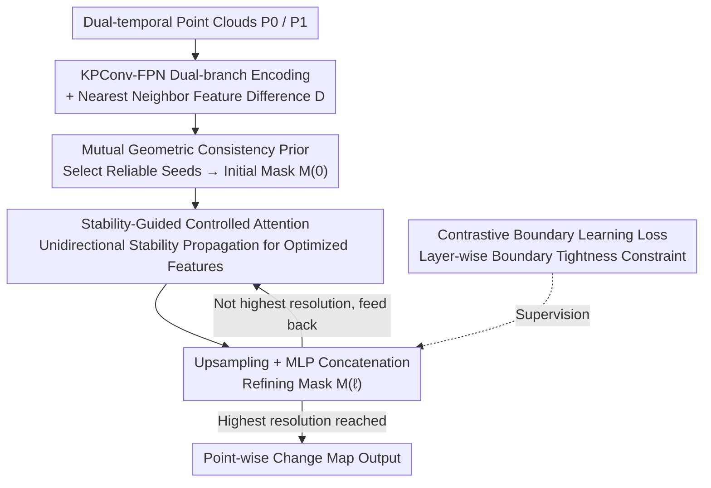

# SRGCD: Stability-Driven Region Growth Framework for 3D Change Detection

**Conference**: CVPR 2026  
**Paper**: [CVF Open Access](https://openaccess.thecvf.com/content/CVPR2026/html/Wu_SRGCD_Stability-Driven_Region_Growth_Framework_for_3D_Change_Detection_CVPR_2026_paper.html)  
**Code**: None  
**Area**: 3D Vision  
**Keywords**: 3D Change Detection, Point Cloud, Region Growth, Class Imbalance, Controlled Attention

## TL;DR
This paper redefines 3D point cloud change detection from "point-wise binary segmentation" to a stability propagation process that "starts from high-confidence invariant seeds and grows layer-by-layer toward boundaries." It selects seeds using geometric consistency priors and diffuses stability from the core to the boundaries via unidirectional controlled attention, achieving SOTA results with 94.11% / 78.79% mIoU on Urb3DCD / HKCD, respectively.

## Background & Motivation
**Background**: With the popularization of LiDAR and photogrammetry, large-scale dual-temporal point clouds are increasingly accessible. 3D Change Detection (3DCD) has become a fundamental task for urban reconstruction, disaster assessment, and environmental monitoring. The mainstream approach treats it as point-wise semantic segmentation: using Siamese dual-branch encoders to extract features from two periods, computing feature differences, and performing independent "changed/unchanged" binary classification for each point. A few works add attention fusion or decoder refinement, but the essence remains "one-step" segmentation.

**Limitations of Prior Work**: Independent point-wise classification destroys spatial consistency—isolated misclassification noise often appears inside coherent regions (interior incompleteness). At boundaries, the features of the two periods are inherently similar, causing the classifier to struggle and resulting in boundary ambiguity. Worse, change detection suffers from extreme class imbalance: unchanged regions contain far more points than changed regions, biasing the network toward "blindly predicting unchanged," a bias most severe at low-confidence boundaries.

**Key Challenge**: Treating every point equally for one-step classification ignores the hierarchical stability structure (where large unchanged geometric structures are inherently easy to distinguish) and allows massive unchanged points to overwhelm sparse changed points in the loss function. One-step classification fails to provide boundaries with an opportunity for "gradual convergence."

**Goal**: (1) To recover change maps with complete interiors and tight boundaries without relying on independent point-wise classification; (2) To mitigate class imbalance mechanistically rather than relying on class-weight patches.

**Key Insight**: The authors observe that change detection exhibits "hierarchical stability"—large, structurally consistent unchanged regions are internally stable and easy to classify, while boundaries or blurred areas are uncertain due to registration errors and noise. Therefore, it is preferable to establish a "stable foundation" from the most credible regions first and then gradually propagate this stability to uncertain regions.

**Core Idea**: Replace "point-wise segmentation" with "region growth"—first select a tiny amount of absolutely reliable unchanged seeds using strict geometric constraints, and then let stability diffuse layer-by-layer from the core to the boundaries via unidirectional controlled attention, "growing" the unchanged regions from coarse to fine.

## Method

### Overall Architecture
The core of SRGCD is the Stability-Driven Region Growth Framework (SDRGF), which replaces the traditional segmentation decoder with a "stability propagation" path. Given two aligned point clouds $P_0, P_1$, a KPConv-FPN dual-branch encoder first extracts multi-scale features $\{F^{(\ell)}_0, F^{(\ell)}_1\}$. At each layer, feature differences $D^{(\ell)} = \phi(F^{(\ell)}_0, F^{(\ell)}_1)$ are computed via spatial nearest-neighbor pairing to expose cross-temporal discrepancies.

At the deepest layer (lowest resolution), the **Mutual Geometric Consistency Prior (MGCP)** selects sparse but absolutely reliable unchanged seeds using strict multi-geometric constraints to initialize the stability field $M^{(0)}$. The framework then enters a cross-scale iterative closed loop: "**Stability-Guided Controlled Attention (SGCA)** optimizes features based on the current stability mask → Upsampling → MLP concatenates optimized features, difference features, and upsampled masks to generate a finer mask $M^{(\ell)}$ → Feed to the next SGCA layer." Stable regions grow layer-by-layer from sparse seeds toward high-resolution boundaries. During training, an additional Contrastive Boundary Learning (CBL) loss is applied to constrain boundary tightness and prevent overgrowth.

### Key Designs

**1. SDRGF: Redefining Point-wise Segmentation as Multi-stage Stability Propagation**

To address the root causes—destruction of spatial consistency and class imbalance—SDRGF abandons the symmetric upsampling path for feature reconstruction. Instead, it models change detection as a process of "stability growing layer-by-layer from deep to shallow." This offers two key benefits: first, it mitigates imbalance at the source—by only marking a tiny amount of high-confidence seeds at the deepest layer, the initial scale of the unchanged region is minimized, expanding via growth rather than allowing massive unchanged points to dominate the loss from the start. Second, it preserves spatial coherence by "growing outward from credible seeds" rather than independent point-wise judgment. The iterative formula is $M^{(\ell)} = \sigma\big(\text{MLP}(\tilde{D}^{(\ell-1)}_\uparrow \,\|\, D^{(\ell)} \,\|\, M^{(\ell-1)}_\uparrow)\big)$ and $\tilde{D}^{(\ell)} = \text{SGCA}(\tilde{D}^{(\ell-1)}_\uparrow; M^{(\ell)})$, integrating deep semantic stability (from optimized features) and spatial continuity (from upsampled masks) for layer-wise refinement. In ablation studies, the mIoU increases from 90.92% (Layer 0 only) to 94.11% (all five layers), proving that "multiple coarse-to-fine iterations" are the primary performance driver.

**2. MGCP: Selecting "Absolutely Reliable" Seeds via Mutual Nearest Neighbors + Geometric Consistency**

Seeds are the foundation of the entire growth chain and must have near-zero false positives—the paper explicitly requires the seed set to have "perfect unchanged predictions," i.e., $\frac{|M^{(0)}=0 \cap Y=0|}{|M^{(0)}=0|}=1$. The MGCP method works as follows: for each point $p_i$ in the source point cloud $P_0$, it finds its nearest neighbor $q_j$ in the target point cloud $P_1$, and then finds the nearest neighbor $p_i'$ of $q_j$ back in $P_0$. Only when $p_i'=p_i$ (Mutual Nearest Neighbor, MNN), the distance $\|p_i - q_j\| < \tau_d$, and the normal angle $\angle(n_{p_i}, n_{q_j}) < \tau_\theta$ are all satisfied, is $(p_i, q_j)$ marked as a high-confidence unchanged seed. MNN ensures bidirectional consistency of the correspondence, while distance and normal constraints ensure the local geometry is truly unchanged. Seeds selected this way are sparse but almost never wrong, providing a clean starting point for propagation. In ablation studies, enabling MGCP alone (ID 3) increases mIoU from 89.41% to 91.28%, as high-precision seeds significantly reduce erroneous expansion into changed areas.

**3. SGCA: Unidirectional Controlled Attention for Clean Stability Propagation**

The propagation quality of SDRGF depends on whether stability can be transmitted "cleanly" at each layer. Standard symmetric attention treats all points equally, allowing unstable features to conversely contaminate stable regions. SGCA solves this in three steps: (i) **SGA** Unidirectional Propagation—defining a stability mask $S^{(\ell)} = \mathbb{I}(M^{(\ell)} < 0.5)$, only features from stable regions participate as Key/Value ($K_s, V_s$ calculated using $S^{(\ell)} \odot D^{(\ell)}$), so that $\tilde{D}^{(\ell)} = $D^{(\ell)} + AV_s$, ensuring stable regions dominate feature interaction and diffuse globally. (ii) **SAP (Stability-Adaptive Propagation)** adjusts update intensity at the point level: $\lambda_i = \alpha + (1-\alpha)M^{(\ell)}_i$, where changed points ($M_i \approx 1$) receive stronger updates to absorb stable features, while stable points ($M_i \approx 0$) are only fine-tuned to preserve structure. (iii) **SPT (Stability-Proportional Temperature)** adjusts the propagation range at the scale level: dynamically setting the softmax temperature $T^{(\ell)} = T_{\max} - (T_{\max}-T_{\min})r^{(\ell)}$ based on the ratio of stable points $r^{(\ell)}$. When stable points are sparse, high temperatures make propagation smoother and wider; when dense, low temperatures make attention sharper and more precise. Combined, these allow stability to propagate across multi-scale hierarchies without overstepping boundaries.

**4. CBL: Contrastive Boundary Loss to Prevent Overgrowth**

Region growth carries the inherent risk of "overgrowing"—crossing boundaries into truly changed areas and blurring the edges. Besides layer-wise BCE supervision on $M^{(\ell)}$, the authors introduce Contrastive Boundary Learning: extracting a boundary point set $B$ from GT labels, where for each boundary point $p_i$, points with the same label in the neighborhood serve as positive samples and different labels as negative samples. Feature distances between boundary points and disparate neighbors are pushed apart, while distances to similar neighbors are pulled together using an InfoNCE form ($\mathcal{L}_{cbl} = -\frac{1}{|B|}\sum \log \frac{\sum_{Y_j=Y_i}\exp(-d(f_i,f_j)/\tau_c)}{\sum_k \exp(-d(f_i,f_k)/\tau_c)}$). The total loss $\mathcal{L} = \sum_\ell (\mathcal{L}^{(\ell)}_{bce} + \lambda \mathcal{L}^{(\ell)}_{cbl})$ is applied across all scales. It carves clear boundaries in the feature space, suppressing mask over-expansion and producing compact, aligned boundaries. Notably, since the framework relies on strict seed initialization rather than one-step classification to combat imbalance, **no explicit class weights** are added to the BCE loss.

### Loss & Training
The total loss exerts supervision on the refined mask $M^{(\ell)}$ generated at each scale, consisting of two parts: layer-wise BCE loss (standard binary cross-entropy for layer-by-layer mask optimization) + CBL contrastive boundary loss (for enhanced boundary discrimination), balanced by $\lambda$. Full-process multi-scale supervision is key to the stable convergence of coarse-to-fine growth.

## Key Experimental Results

### Main Results
On the synthetic dataset Urb3DCD-V1 (CAD urban models + simulated LiDAR, precision registration, dense labels) and the real street-view LiDAR dataset HKCD, SRGCD was compared with traditional methods (RF, DSM-FC-EF) and learning-based SOTA (3DCDNet, SiameseKPConv, PBFormer, PGN3DCD) using mIoU / mAcc metrics.

| Dataset | Metric | SRGCD | Runner-up (Method) | Gain |
|--------|------|-------|-----------|------|
| Urb3DCD-V1 | mIoU | **94.11%** | 92.46% (PGN3DCD) | +1.65% |
| Urb3DCD-V1 | mAcc | **96.95%** | 94.63% (PBFormer) | +2.32% |
| HKCD | mIoU | **78.79%** | 76.95% (PGN3DCD) | +1.84% |
| HKCD | mAcc | **87.93%** | 87.00% (PGN3DCD) | +0.93% |

Compared to traditional RF/DSM-FC-EF, mIoU on Urb3DCD improved by over 25%. Qualitatively, while other methods often produce isolated blocky misclassifications or global scattered noise, SRGCD's errors are concentrated almost entirely near boundaries. It tends to "occasionally misclassify unchanged as changed (orange points), but almost never misses true changes (red points)"—a unique error distribution brought by strict geometric priors + region growth, which nearly eliminates false negatives even on extremely unbalanced HKCD data (e.g., subtle changes like moving vehicles).

### Ablation Study
Component ablation (Urb3DCD-V1, ID 1 is backbone-only ≈ SiameseKPConv):

| ID | Configuration | mIoU (%) | Note |
|----|------|----------|------|
| 1 | Backbone only | 89.89 | Equivalent to SiameseKPConv |
| 2 | w/o MGCP/DynMask (SGCA only) | 89.41 | Unreliable seeds + static mask; worse than backbone |
| 3 | +MGCP | 91.28 | High-precision seeds, +1.87% over ID 2 |
| 4 | +DynMask (w/o MGCP) | 90.63 | Expansion from false stable seeds, −3.48% vs full |
| 6 | w/o SAP | 93.17 | Over-smoothing |
| 7 | w/o SPT | 93.25 | Uncontrolled propagation, cross-class leakage |
| 8 | Full model | **94.11** | Completed |

Region growth depth ablation: Layer 0 only 90.92% → Layers 0-1 92.31% → 0-2 93.12% → 0-3 93.67% → 0-4 full 94.11%, showing monotonic improvement.

### Key Findings
- **MGCP is the foundation; without it, the system fails**: Without reliable seeds (ID 2), growth expands from "false stable seeds," performing worse than the simple backbone—indicating the success of the region growth paradigm rests entirely on seed quality.
- **DynMask and MGCP must be paired**: Enabling only DynMask (ID 4) to refine from erroneous seeds significantly lowers the change class IoU by 3.48%.
- **SGCA sub-modules are complementary**: Removing SGA degrades it to symmetric attention, removing SAP causes over-smoothing, and removing SPT leads to uncontrolled cross-class leakage.
- **More iterative depth is better**: Stability propagation benefits from coarse-to-fine iterations; five layers balance performance and complexity.

## Highlights & Insights
- **Paradigm shift is the greatest highlight**: Changing "point-wise segmentation" to "region growth" simultaneously addresses spatial inconsistency, blurred boundaries, and class imbalance. Imbalance is solved at the source by "marking minimal seeds + growth" rather than weighting—this perspective is highly transferable to other dense prediction tasks with sparse foregrounds.
- **Decision for "Zero False Positive" MGCP is decisive**: Preferring extremely sparse but absolutely correct seeds (triple constraints of MNN, distance, and normal) leaves uncertainty for the growth stage rather than introducing noise at the start.
- **"Unidirectional" logic in SGCA is key**: Using stability masks to only allow stable regions into K/V fundamentally prevents unstable features from back-contaminating, which is much cleaner than "symmetric attention + post-filtering."
- **Interpretable Error Distribution**: The bias toward "false alarms in unchanged areas but near-zero misses of true changes" is particularly valuable for disaster/security monitoring scenarios where missing a change is high-risk.

## Limitations & Future Work
- **Limited to Binary 3DCD**: The authors intend to extend this to multi-class change detection; how to generalize the "stable/unstable" binary mask to multi-class semantics remains open.
- **Dependency on Dual-temporal Registration**: MGCP's MNN and distance constraints assume aligned point clouds. ⚠️ In real-world scenarios with large registration errors or incomplete overlap, seed quality may drop (as noted by performance drops across all methods on HKCD).
- **Seed Sparsity is a Double-Edged Sword**: While strictness ensures reliability, if a scene has almost no "absolutely unchanged" regions (e.g., large-scale gradual changes), the initial stability field might be too empty. The paper uses hierarchical recovery to mitigate this, but sensitivity analysis of seed ratios is missing.
- **No Code and Some Hyperparameters in Supplemental Materials**: Specific values and sensitivity for $\tau_d, \tau_\theta, \alpha, T_{\max}/T_{\min}, \lambda$ are not fully detailed in the main text.

## Related Work & Insights
- **vs SiameseKPConv**: Both use KPConv dual encoders, but SiameseKPConv is one-step point-wise segmentation without boundary awareness; SRGCD uses it as a backbone (ID 1) and improves mIoU from 89.89% to 94.11% via SDRGF+SGCA+CBL.
- **vs PGN3DCD**: PGN3DCD uses prior-guided attention to focus on changed regions to mitigate imbalance (a "highlighting foreground" approach); SRGCD reverses this by "compressing initial background scale + growth," which performs better on both datasets, especially on the highly unbalanced HKCD.
- **vs PBFormer**: PBFormer uses dual spatio-temporal Transformers for cross-period point-patch interaction but still relies on one-step segmentation; SRGCD's multi-step iterations allow boundary decisions to "gradually stabilize" rather than being fixed too early, resulting in significantly fewer blocky misclassifications.
- **vs INRCD / MUCD, etc.**: These use implicit reconstruction or mask consistency self-supervision; SRGCD differs by explicitly utilizing "hierarchical stability" geometric priors for supervised layer-wise growth.

## Rating
- Novelty: ⭐⭐⭐⭐⭐ First to model 3DCD as multi-stage stability propagation/region growth; a paradigm shift rather than mere module stacking.
- Experimental Thoroughness: ⭐⭐⭐⭐ Complete synthetic + real dual datasets, with full component and depth ablations, though lacking threshold sensitivity analysis and multi-class verification.
- Writing Quality: ⭐⭐⭐⭐ Clear chain of motivation-insight-method; effective diagrams and hierarchical visualizations.
- Value: ⭐⭐⭐⭐ SOTA performance and transferable paradigm for sparse-foreground dense prediction, though currently limited to binary classification and not yet open-source.

<!-- RELATED:START -->

## Related Papers

- [\[CVPR 2026\] Changes in Real Time: Online Scene Change Detection with Multi-View Fusion](changes_in_real_time_online_scene_change_detection_with_multi-view_fusion.md)
- [\[CVPR 2026\] Wavelet-Driven 3D Anomaly Detection under Pose-Agnostic and Sparse-View](wavelet-driven_3d_anomaly_detection_under_pose-agnostic_and_sparse-view.md)
- [\[CVPR 2026\] Towards Intrinsic-Aware Monocular 3D Object Detection](towards_intrinsic-aware_monocular_3d_object_detection.md)
- [\[CVPR 2026\] Scene Reconstruction as Mapping Priors for 3D Detection](scene_reconstruction_as_mapping_priors_for_3d_detection.md)
- [\[CVPR 2026\] PoseMaster: A Unified 3D Native Framework for Stylized Pose Generation](posemaster_a_unified_3d_native_framework_for_stylized_pose_generation.md)

<!-- RELATED:END -->
