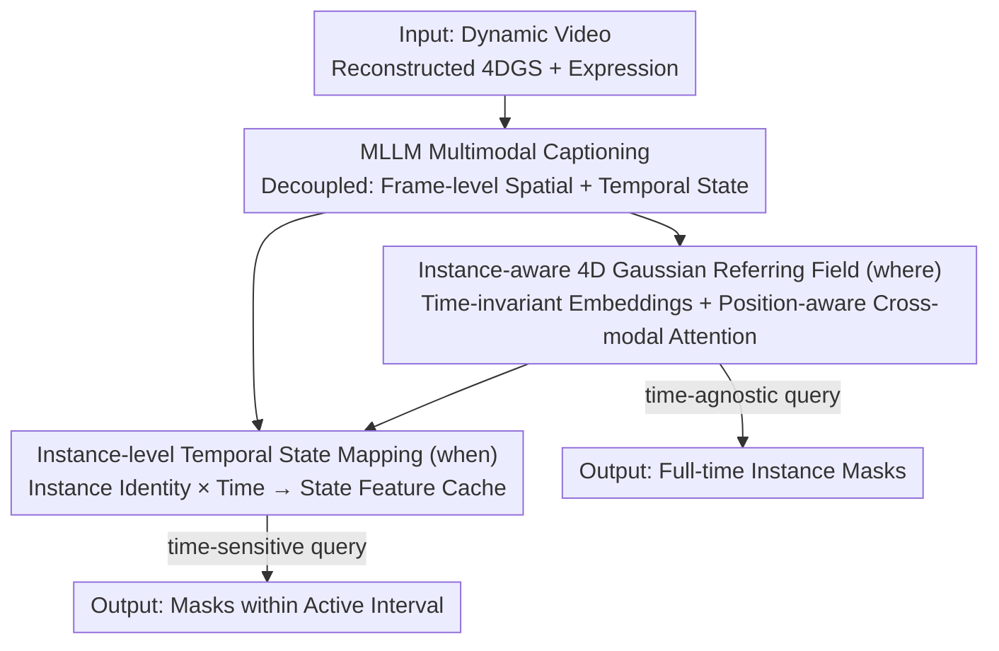

# ST4R-Splat: Spatio-Temporal Referring Segmentation in 4D Gaussian Splatting

**Conference**: CVPR 2026  
**Paper**: [CVF Open Access](https://openaccess.thecvf.com/content/CVPR2026/html/Meng_ST4R-Splat_Spatio-Temporal_Referring_Segmentation_in_4D_Gaussian_Splatting_CVPR_2026_paper.html)  
**Code**: None  
**Area**: 3D Vision  
**Keywords**: 4D Gaussian Splatting, Referring Segmentation, Spatio-Temporal Localization, Language Fields, MLLM Supervision

## TL;DR
This paper introduces the new task of "Spatio-Temporal Referring Segmentation in 4D Gaussian Splatting (STRS-4DGS)" and designs the ST4R-Splat framework: it utilizes **time-invariant instance referring embeddings** to solve "where" and **instance-level temporal state mapping in feature space** to solve "when." Combined with an MLLM-based pipeline for automatic spatio-temporal supervision generation, it significantly outperforms adapted SOTA baselines (time-agnostic mIoU 77.67% vs. 43.40%) on a self-constructed benchmark.

## Background & Motivation

**Background**: 3D Gaussian Splatting (3DGS) and its dynamic version (4DGS) have achieved high-fidelity, real-time dynamic scene reconstruction. However, they are fundamentally optimized for geometric fidelity and novel view synthesis, thus **lacking semantics and language understanding**. Recent research has attempted to add language capabilities to Gaussian fields: one direction builds language fields on static 3DGS (e.g., ReferSplat for static 3D referring segmentation), while another builds on dynamic 4DGS (e.g., 4DLangSplat for open-vocabulary queries).

**Limitations of Prior Work**: These two directions are "orthogonal"—the static 3DGS line only performs language grounding in **static** scenes, while the dynamic 4DGS line is limited to **category-level/open-vocabulary** retrieval (e.g., "find all cups") and cannot parse complex referring expressions that require joint reasoning of spatial layouts and temporal evolution.

**Key Challenge**: A referring expression such as "the object being broken in half in someone's hand" simultaneously involves **spatial disambiguation** ("in someone's hand" to lock the instance) and **temporal localization** ("being broken in half" to lock the time interval). Existing methods either lack a temporal axis or instance-level disambiguation, making it impossible to solve both on explicit 4D reconstructions.

**Goal**: Given a 4DGS representation and a free-form referring expression, the objective is to segment the described target instance across the **entire spatio-temporal range**, further divided into two sub-tasks: spatial disambiguation (where) and temporal localization (when).

**Key Insight**: The authors observe that "where and when should be decoupled." Spatial identity remains invariant over time (a cup remains the same cup), whereas states change over time. Entangling both in a time-deformable language field (as in 4DLangSplat, which relies on 2D rendering supervision) leads to interference from viewpoint changes and unstable temporal state learning.

**Core Idea**: Bind each 4D Gaussian to a **time-invariant** referring embedding to stably anchor spatial identity, and directly map "instance identity + timestamp" to semantic state features in the **feature space** for temporal localization, thereby completely bypassing the viewpoint dependency of 2D rendering supervision.

## Method

### Overall Architecture
ST4R-Splat overlays a language understanding system on 4DGS reconstruction. Inputs are dynamic scene RGB videos (reconstructed into 4DGS) and a referring expression; the output is the spatio-temporal segmentation mask of the target instance. The framework centers on "decoupling where/when" via three components: an MLLM-based pipeline to generate decoupled spatial and temporal captions as supervision; an **instance-aware 4D Gaussian referring field** to answer "where"; and an **instance-level temporal state mapping** module to answer "when." During inference, time-agnostic queries only use the spatial field, while time-sensitive queries first locate the instance via the field and then query the state cache for the time interval.

### Key Designs

**1. MLLM Multimodal Captioning: Generating Decoupled Spatio-Temporal Supervision Without Human Annotation**

Since referring segmentation requires fine-grained language-instance alignment, the authors use visual foundation models (Grounded-SAM-2 + Unipixel) for open-vocabulary detection/segmentation/tracking to obtain temporally consistent trajectories $\{M_{k,t}\}$. Then, MLLM (Qwen3-VL-8B) generates **two types of decoupled captions**: (i) **Frame-level description captions** $C_{\text{desc}}(o_k,t)$—by highlighting target instances with red contours and blurring the background in RGB frames, MLLM describes appearance, attributes, and spatial relations; (ii) **Temporal state captions** $C_{\text{state}}(o_k,t)$—after obtaining a coarse temporal summary $T^{\text{sum}}(o_k)$, MLLM queries short video clips to describe instantaneous states/actions at each time $t$. These captions supervise the spatial and temporal branches respectively. Decoupling ensures that spatial supervision is not contaminated by temporal info and vice-versa.

**2. Instance-aware 4D Gaussian Referring Field: Answering "Where" with Time-invariant Embeddings**

To ground expressions in continuous 4D space, each time-deforming Gaussian $g_i(t)$ is assigned a **learnable, time-invariant** referring embedding $e_i \in \mathbb{R}^d$. For text interaction, since embeddings are static but objects move, time-varying coordinates $\mu_i(t)$ are injected into a **position-aware cross-modal attention** $\phi$ to dynamically enhance embeddings $e_i'(t)=\phi(e_i,\mu_i(t),E)$. The semantic relevance $m_i(t)=\frac{1}{L}\sum_j \langle e_i'(t),E_j\rangle$ is calculated via dot product with word embeddings, alpha-blended into 2D masks, and aligned with pseudo-GT via BCE ($L_{\text{ref}}$). To disambiguate instances, two constraints are added: **Object-level contrastive learning** $L_{\text{con}}$—averaging top-$\tau$ percentile Gaussian features into an instance representation $e_g(t)$ to pull it toward sentence embedding $e_{\text{txt}}$; and **Instance-aware regularization** $L_{\text{inst}}=\lambda_{\text{comp}}L_{\text{comp}}+\lambda_{\text{dist}}L_{\text{dist}}$—to ensure compactness within instances and distinctiveness between them. **Decoupled optimization** is used: 4DGS is first reconstructed via $L_{\text{rgb}}$, then semantic terms $L_{\text{sem}}$ are optimized with **gradients stopped** for geometry.

**3. Instance-level Temporal State Mapping: Answering "When" in Feature Space**

Unlike 4DLangSplat, which suffers from low-quality features under novel views due to 2D rendering supervision, the authors build a mapping $c_{k,t}=F(\bar e_k,t)$ directly in **feature space**. Discriminative instance embeddings $\bar e_k$ and time $t$ are mapped to semantic state features $c_{k,t}$. Specifically, temporal state captions for each instance are encoded (using e5-mistral-7b) into a **pre-computed state cache** $C_k=\{c_{k,t}\mid t\in[0,T]\}$, strictly binding states to instance identities. For time-sensitive queries, the spatial branch first locates the instance; then, the query is encoded and compared with the state cache across frames, followed by temporal smoothing and adaptive thresholding to determine the active interval. This approach is **stable under novel views** as it does not rely on rendering (Fig.3: 90.38% Acc vs. 4DLangSplat's 51.92%).

### Loss & Training
The total semantic objective is $L_{\text{sem}}=\lambda_{\text{ref}}L_{\text{ref}}+L_{\text{inst}}+\lambda_{\text{con}}L_{\text{con}}$. $L_{\text{inst}}$ includes compactness and distinctiveness terms (the latter with $\epsilon$ to prevent division by zero). 4DGS geometry is reconstructed first via $L_{\text{rgb}}$; semantic training leaves geometry unchanged via stop-gradient. The temporal branch uses pre-computed caches. Text encoding: BERT for the spatial branch, e5-mistral-7b for the temporal branch.

## Key Experimental Results

### Main Results
Evaluations are conducted on the STRS-4DGS benchmark (extended from HyperNeRF, 6 scenes, 26 objects, 52 time-agnostic + 8 time-sensitive queries). Baselines are adapted from ReferSplat and 4DLangSplat.

**Time-agnostic Referring Queries (mIoU %)**:

| Method | Americano | Cookie | Keyboard | Average |
|------|-----------|--------|----------|---------|
| ReferSplat | 36.97 | 28.47 | 20.39 | 35.42 |
| 4DLangSplat | 35.70 | 46.55 | 61.00 | 43.40 |
| **ST4R-Splat (Ours)** | **80.51** | **69.48** | **83.25** | **77.67** |

**Time-sensitive Referring Queries (Acc / vIoU %)**:

| Method | Acc (Avg) | vIoU (Avg) |
|------|-----------|------------|
| 4DLangSplat | 52.24 | 12.14 |
| **ST4R-Splat (Ours)** | **83.44** | **57.98** |

> Metrics: **mIoU** is the mean IoU across all frames (spatial quality); **Acc** measures the ratio of correctly predicted frames (temporal interval accuracy); **vIoU** combines temporal accuracy and segmentation quality: $\frac{1}{|S_u|}\sum_{t\in S_i}\text{IoU}(\hat s_t,s_t)$.

### Ablation Study
Removing components for time-agnostic queries (mIoU %):

| Configuration | mIoU | Change |
|------|-----------|---------|
| Full Model | 77.67 | - |
| w/o Cross-modal Attention | 58.56 | -19.11 (Most critical) |
| w/o Contrastive Loss $L_{\text{con}}$ | 70.85 | -6.82 |
| w/o Instance Regularization $L_{\text{inst}}$ | 76.94 | -0.73 |

### Key Findings
- **Position-aware cross-modal attention is vital for spatial grounding**: Removing it causes mIoU to drop from 77.67% to 58.56%, far exceeding other components, confirming that injecting time-varying coordinates into Gaussian-text interaction is essential.
- **Superiority over 4DLangSplat stems from task alignment**: Designed for open-vocabulary queries, 4DLangSplat struggles with complex spatial-temporal reasoning, often activating both "hand" and "board" instead of the specific target.
- **Decoupling provides view robustness**: For time-sensitive queries in novel views, the Acc is 90.38% (Ours) vs. 51.92% (4DLangSplat), proving feature-space state mapping is unaffected by rendering perspectives.

## Highlights & Insights
- **Decoupling "where" (time-invariant) and "when" (feature-space)** is the most elegant design choice: By making spatial identity invariant and state mapping instance-specific in feature space, it avoids viewpoint dependency—the core reason for its robustness in novel views.
- **Automatic decoupled supervision via VFM + MLLM**: This eliminates human labeling by using detection/tracking for trajectories and MLLM for specific spatial vs. temporal captions, establishing a practical "annotation factory" paradigm.
- **Decoupled optimization + Stop-gradient**: Semantic training does not degrade 4DGS rendering quality, a critical engineering detail for any hybrid reconstruction-language field.

## Limitations & Future Work
- **Small Benchmark Scale**: Only 6 scenes and 26 objects; time-sensitive queries are limited (8), affecting statistical significance. Generalization to open, large-scale real-world scenes remains untested.
- **Supervision Quality Dependent on MLLM**: Captions errors or hallucinations directly pollute the field and cache. The impact of caption quality on final accuracy is not quantified.
- **Training Constraints**: The temporal branch relies on pre-computed caches rather than end-to-end learning, which might limit generalization to unseen state descriptions.
- **Lack of open-source code** increases replication costs.

## Related Work & Insights
- **vs. ReferSplat**: ReferSplat works on **static** 3DGS. This work extends its cross-modal attention and contrastive learning into the **temporal dimension** by injecting $\mu_i(t)$, allowing static embeddings to track dynamic objects.
- **vs. 4DLangSplat**: 4DLangSplat performs **category-level** queries using 2D rendering supervision. This work shifts to **instance-level** grounding and moves temporal state reasoning to feature space, solving stability issues in complex expressions and novel views.
- **vs. 2D/3D Referring Segmentation (RES / RVOS / ScanRefer)**: Unlike 2D methods that lack 3D geometry (vulnerable to occlusion) or 3D methods restricted to static point clouds, this work unifies instance-level grounding with explicit 4D geometry and dynamics.

## Rating
- Novelty: ⭐⭐⭐⭐⭐ Defined the STRS-4DGS task and provided the first decoupled "where/when" framework.
- Experimental Thoroughness: ⭐⭐⭐ Benchmark is small and self-built; lacks large-scale validation.
- Writing Quality: ⭐⭐⭐⭐ Motivations and decoupling logic are clearly presented.
- Value: ⭐⭐⭐⭐ Pioneers language-driven 4D scene understanding with clear potential for Robotics/AR.

<!-- RELATED:START -->

## Related Papers

- [\[CVPR 2026\] Geometry-Aware Cross-Modal Graph Alignment for Referring Segmentation in 3D Gaussian Splatting](geometry-aware_cross-modal_graph_alignment_for_referring_segmentation_in_3d_gaus.md)
- [\[CVPR 2026\] SparseCam4D: Spatio-Temporally Consistent 4D Reconstruction from Sparse Cameras](sparsecam4d_spatio-temporally_consistent_4d_reconstruction_from_sparse_cameras.md)
- [\[CVPR 2026\] MORE-STEM: Long-Short MemOry REcall and Spatio-TEmporal Consistency Model for Query-Driven 3D/4D Point Cloud Segmentation](more-stem_long-short_memory_recall_and_spatio-temporal_consistency_model_for_que.md)
- [\[CVPR 2026\] LangField4D: Learning Identity-Adaptive and Spatio-Temporal Continuous 4D Language Fields for Dynamic Scenes](langfield4d_learning_identity-adaptive_and_spatio-temporal_continuous_4d_languag.md)
- [\[CVPR 2026\] 4C4D: 4 Camera 4D Gaussian Splatting](4c4d_4_camera_4d_gaussian_splatting.md)

<!-- RELATED:END -->
