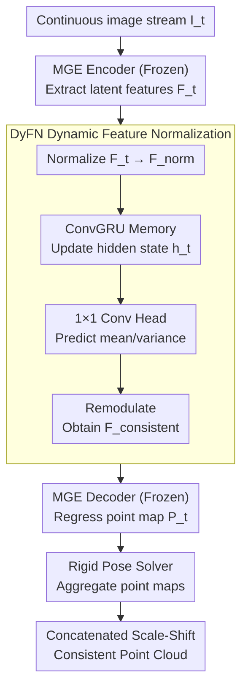

# Stabilizing Streaming Video Geometry via Dynamic Feature Normalization

**Conference**: CVPR 2026  
**Paper**: [CVF Open Access](https://openaccess.thecvf.com/content/CVPR2026/html/Lyu_Stabilizing_Streaming_Video_Geometry_via_Dynamic_Feature_Normalization_CVPR_2026_paper.html)  
**Code**: https://shawlyu.github.io/DyFN (Project Page)  
**Area**: 3D Vision / Online Geometric Reconstruction  
**Keywords**: Streaming Video Depth, Monocular Geometry Estimation, Scale-Shift Drift, Feature Normalization, Parameter-Efficient Fine-Tuning

## TL;DR
The authors discover that the root cause of temporal jitter in monocular geometry foundation models (such as MoGe) on video streams is not geometric error, but rather frame-by-frame "scale-shift" drift, which is directly determined by the fluctuations in the mean and variance of latent features. Consequently, they propose a lightweight recurrent module **DyFN (Dynamic Feature Normalization)** that accounts for only 2% of the parameters. Keeping the backbone frozen and tuning only this module, DyFN uses a ConvGRU to memorize and dynamically predict and replace feature statistics, achieving SOTA temporal stability across four benchmarks without sacrificing single-frame accuracy.

## Background & Motivation

**Background**: Monocular Geometry Estimation (MGE) and Monocular Depth Estimation (MDE) have made rapid progress with the emergence of large-scale foundation models (such as MiDaS, Depth Anything, and MoGe), which exhibit strong single-image accuracy and zero-shot generalization. However, these models are almost entirely designed for "single-image inference," whereas real-world scenarios such as robotics, autonomous driving, and AR naturally receive continuous video streams as inputs.

**Limitations of Prior Work**: Direct frame-by-frame application of single-image MGE models to video streams leads to severe temporal inconsistency—geometric predictions fluctuate drastically across frames, causing layering breaks and positional jitter in reconstructed scenes. Existing mitigation methods (such as temporal attention and recurrent memory modules) suffer from two major drawbacks: ① they typically require **full-network fine-tuning** on large-scale annotated videos, which is computationally and data-expensive; ② full-network fine-tuning often causes the backbone to overfit to specific video domains, **conversely damaging** the strong single-frame accuracy and zero-shot generalization capability inherent to the pre-trained models.

**Key Challenge**: The desire for "temporal consistency" and the preservation of "single-frame accuracy/generalization" present a trade-off in existing methods—the more the backbone is retrained for video, the more the original advantages of the foundation models are degraded.

**Key Insight**: The authors conduct a critical empirical analysis (detailed below). They find that pre-trained MGE models **already** encode sufficiently strong geometric structures: when aligning to the ground truth frame-by-frame using a pair of affine parameters (scale + shift) for each frame individually, the reconstructed geometry is highly accurate (with $\delta_1$ reaching 99.8); however, if a single pair of scale/shift is shared across the entire sequence, accuracy plummets to 62.5. This indicates that temporal inconsistency **is not geometric degradation, but frame-by-frame scale-shift drift**. Furthermore, they reveal that this scale/shift drift is strongly coupled with the **channel mean and variance** of the encoder's output latent features, while being largely decoupled from the relative geometric accuracy.

**Core Idea**: Given that the root cause is the fluctuation of feature statistics, rather than retraining the entire network, one should **directly regulate the mean and variance of latent features online** to keep scale/shift stable across frames—this is Dynamic Feature Normalization.

## Method

### Overall Architecture

DyFN transforms a "single-image geometry estimator" into a "streaming video geometry estimator." The entire online inference pipeline operates as follows: continuous video streams $I_t$ enter the **frozen** MGE encoder $E$ frame-by-frame to yield latent features $F_t = E(I_t)$. $F_t$ is then fed into the **DyFN module**, where it first undergoes instance normalization to produce $F_t^{norm}$, before being passed into a ConvGRU that tracks the cross-frame hidden state $h_t$ (aggregating historical context from all prior frames). Two $1\times1$ convolutional heads predict the "temporal-aware" mean $\hat{\mu}_t$ and standard deviation $\hat{\sigma}_t$. These predicted values replace the original per-frame drifting statistics to modulate the features into consistent features $F_t^{consistent}$. Finally, these features are fed into the **frozen** MGE decoder $D$ to regress the point map $P_t$. A correspondence-based rigid pose solver (estimating rotation and translation) aggregates the point maps of various frames into a coherent 3D reconstruction.

This entire modification only trains DyFN (accounting for about 2% of the total parameters), leaving the encoder and decoder completely frozen. Consequently, it both leverages the single-frame geometric priors of the foundation model and introduces sequence-level stability.

### Key Designs

**1. DyFN Dynamic Feature Normalization: Online prediction of mean/variance with recurrent memory to replace frame-by-frame drifting statistics**

This is the core contribution of the paper. The pain point is that the MGE encoder encodes each frame independently, leading to temporal fluctuations in the channel-wise statistics (mean, variance) of latent features. Since these two values directly dictate the global scale and shift of the predicted depth, this manifests as non-rigid distortion and drifting in the reconstruction. DyFN avoids "calculating statistics frame-by-frame" and instead "dynamically predicts feature statistics from historical context." Specifically, it follows four steps: first, it performs channel-wise normalization on the current feature $F_t$, $F_t^{norm} = \frac{F_t - \mu_{F_t}}{\sigma_{F_t} + \epsilon}$, striping off the unstable statistics inherent to each frame; next, it uses a ConvGRU to maintain the hidden state, $h_t = \mathrm{ConvGRU}(F_t, h_{t-1})$ (where the initial frame $h_0$ is set to zero), compressing observations from all past frames into $h_t$; then, two $1\times1$ convolutional heads predict the temporal-aware statistics from $h_t$, namely $\hat{\sigma}_t = \mathrm{Conv}^{\sigma}_{1\times1}(h_t)$ and $\hat{\mu}_t = \mathrm{Conv}^{\mu}_{1\times1}(h_t)$; finally, these are modulated back into the normalized features, $F_t^{consistent} = \hat{\sigma}_t \cdot F_t^{norm} + \hat{\mu}_t$, which are sent as consistent features to the decoder.

The effectiveness of this design is supported by the empirical analysis in Section 3, showing that scale/shift is strongly coupled with feature mean/variance but decoupled from geometric shape—hence, "only adjusting statistics" can resolve scale drift without harming geometric details. ConvGRU is chosen over standard GRU because mean and variance are statistics with spatial structures, and convolutional recurrent units are better suited to capturing "spatially-structured temporal statistics." This is a **causal recurrent** module that only looks at the history and not the future, making it naturally tailored for online, streaming scenarios of arbitrary sequence lengths.

**2. Frozen backbone, training only 2% parameters of the stabilizer: turning "temporal consistency" and "single-frame accuracy" from a trade-off into a win-win**

The problem with existing video methods is that full-network fine-tuning degrades foundation models. The authors adopt extreme parameter-efficient fine-tuning: the weights of the encoder $E$ and decoder $D$ are completely frozen, and only DyFN is trained, which accounts for only ~2% of the total parameters. The direct benefit is cleanly illustrated in Table 2—since the backbone remains untouched, the model's single-frame depth accuracy is **dataset-by-dataset identical** to the base MoGe v1 model; in contrast, FlashDepth (fine-tuned on Depth Anything v2) sees its $\delta_1$ on KITTI drop from the baseline's 95.3 to 92.6. In other words, DyFN acts as a temporal control layer added "on top of" the foundation model rather than "rewriting" the foundation model itself, successfully bypassing the classic trade-off of sacrificing single-frame accuracy for video consistency.

**3. Global alignment loss + cross-frame temporal loss: explicitly supervising scale-shift consistency across the entire sequence**

Architectural design alone is insufficient; specific loss functions are required to enforce "sequence-level stability." In addition to the base loss $\mathcal{L}_{MoGe}$ inherited from the backbone, the authors introduce two losses. The first is the **global alignment loss** $\mathcal{L}_{align}$: for a predicted point map sequence $\{\hat{P}_j\}_{j=1}^{L}$ of length $L$, only **a single pair** of global affine parameters $(s_g, t_g)$ is solved to simultaneously align all frames' points to the ground truth. The error is then measured using this single pair of unified parameters: $\mathcal{L}_{align} = \sum_{j=1}^{L}\sum_{i\in M}\frac{1}{z_i}\lVert s_g\hat{p}^i_j + t_g - p^i_j\rVert_1$. If any frame deviates from the "globally optimal scale/shift shared by the sequence," it is heavily penalized, forcing the feature representation to output temporally stable results. The second is the **cross-frame temporal loss** $\mathcal{L}_{temp}$, targeting long-range drift: it requires the predicted inter-frame displacement magnitude to match the ground-truth displacement, and is computed over multiple windows $k\in\{1,2,4\}$ to account for both short- and long-range dynamics: $\mathcal{L}_{temp} = \sum_{k\in K}\sum_{j=1}^{L-k}\sum_{i\in M}\frac{1}{z_i}\lVert s_g\hat{\delta}^i_{j,k} - \delta^i_{j,k}\rVert_1$, where $\hat{\delta}^i_{j,k}$ and $\delta^i_{j,k}$ denote the predicted and ground-truth point displacement magnitudes over a $k$-frame interval, respectively. Multiplying by the global scale $s_g$ aligns the predicted displacement with the metric scale of the ground truth for fair comparison. The final objective is formulated as $\mathcal{L}_{final} = \mathcal{L}_{MoGe} + \alpha\mathcal{L}_{align} + \beta\mathcal{L}_{temp}$, setting $\alpha=1$ and $\beta=0.1$. Ablation studies show that removing $\mathcal{L}_{align}$ drops performance even below the baseline, indicating that global alignment supervision is the lifeline of this loss scheme.

### Loss & Training

Only the DyFN module is fine-tuned, while the encoder/decoder are frozen. The training corpus consists of a large-scale mixed dataset of approximately 1 million frames; by default, continuous 12-frame segments of fixed length are sampled. The loss is the aforementioned $\mathcal{L}_{final}$ with ($\alpha=1$, $\beta=0.1$). Notably, the choice of global affine solving in $\mathcal{L}_{align}$ is critical: the authors compare "first-frame alignment" (solving $s_g, t_g$ based on the first frame's prediction and ground truth) with "full-sequence alignment" (solving across the entire sequence) and ultimately adopt **first-frame alignment**. This is because full-sequence alignment complicates optimization due to early unstable predictions and significantly increases training overhead.

## Key Experimental Results

### Main Results

Video depth evaluation (AbsRel↓, $\delta_1$=$\delta<1.25$↑) is performed on four benchmarks: Sintel (50 frames), ScanNet (90 frames), KITTI (110 frames), and Bonn (110 frames), uniformly applying a strict video protocol of "one pair of scale/shift per sequence." DyFN achieves SOTA across all datasets and metrics:

| Method | Category | Sintel AbsRel↓ | Sintel δ1↑ | ScanNet AbsRel↓ | ScanNet δ1↑ | KITTI AbsRel↓ | KITTI δ1↑ | Bonn AbsRel↓ | Bonn δ1↑ |
|------|------|------|------|------|------|------|------|------|------|
| MoGe v1 | Relative Depth | 0.216 | 65.3 | 0.117 | 84.7 | 0.076 | 96.0 | 0.074 | 95.5 |
| VGGT | Multi-frame Geometry | 0.287 | 66.1 | 0.031* | 98.5* | 0.070 | 96.5 | 0.055 | 97.1 |
| DepthCrafter | Video Depth | 0.270 | 69.7 | 0.123 | 85.6 | 0.104 | 89.6 | 0.071 | 97.2 |
| VDA | Video Depth | 0.300 | 63.3 | 0.075 | 95.4 | 0.079 | 95.0 | 0.051 | 98.1 |
| FlashDepth | Streaming Depth | 0.265 | 64.2 | 0.101 | 90.3 | 0.103 | 89.5 | 0.053 | 98.0 |
| **Ours (DyFN)** | Streaming Depth | **0.180** | **73.0** | **0.073** | **96.6** | **0.062** | **97.3** | **0.044** | **98.4** |

> *VGGT's 0.031/98.5 on ScanNet is due to its training on this dataset (marked in gray in the original paper) and does not represent generalization capability; on the dynamic Sintel scene, VGGT scores only 0.287, heavily underperforming compared to DyFN's 0.180.

Comparison Key points: ① Compared to FlashDepth, which is also a streaming method, ScanNet $\delta_1$ is improved from 90.3 to 96.6; ② Compared to the base model MoGe v1, ScanNet $\delta_1$ rises from 84.7 to 96.6 (~+11.9% gain in the original text); ③ Even when competing against offline video methods utilizing bidirectional attention (DepthCrafter, VDA), DyFN—a causal streaming model using only histories—performs better. The claim in the abstract, "up to 14% improvement over existing streaming methods," stems from these comparisons.

### Ablation Study

#### Single-frame accuracy (verifying "no performance drop")

| Method | Sintel AbsRel↓/δ1↑ | ScanNet | KITTI | Bonn |
|------|------|------|------|------|
| MoGe v1 (Base Model) | 0.124 / 83.7 | 0.027 / 98.6 | 0.044 / 98.0 | 0.028 / 98.8 |
| FlashDepth | 0.174 / 75.6 | 0.056 / 96.3 | 0.085 / 92.6 | 0.043 / 98.7 |
| **Ours (DyFN)** | **0.124 / 83.7** | **0.027 / 98.6** | **0.044 / 98.0** | **0.028 / 98.8** |

The single-frame performance of DyFN is **point-for-point identical** to MoGe v1 because the backbone is frozen, preserving the single-frame capability intact. In contrast, full-network fine-tuning methods like FlashDepth see their single-frame $\delta_1$ on KITTI drop from the baseline's 95.3 to 92.6—precisely the trade-off of "sacrificing single-frame for video" that DyFN aims to avoid.

#### Ablation on components

| Configuration | Sintel AbsRel↓/δ1↑ | ScanNet AbsRel↓/δ1↑ | Explanation |
|------|------|------|------|
| MoGe (Baseline) | 0.216 / 65.3 | 0.117 / 84.7 | No temporal regulation |
| **Ours† (Full)** | **0.180 / 73.0** | **0.073 / 96.6** | DyFN + dual losses + first-frame alignment |
| w/o $\mathcal{L}_{align}$ | 0.245 / 61.8 | 0.124 / 83.1 | Removing global alignment loss performs even **worse than baseline** |
| w/o $\mathcal{L}_{temp}$ | 0.183 / 72.7 | 0.069 / 96.4 | Removing temporal loss leads to minor degradation |
| DyFN (GRU) | 0.187 / 72.5 | 0.078 / 94.9 | Standard GRU replaces ConvGRU |
| $\mathcal{L}_{align}$‡ (Full-sequence alignment) | 0.189 / 72.1 | 0.066 / 96.4 | Full-sequence alignment performs worse than first-frame alignment |

### Key Findings
- **$\mathcal{L}_{align}$ is the lifeline**: Removing it yields accuracy even worse than the MoGe baseline (Sintel 0.245 vs 0.216), indicating that without global alignment supervision, DyFN fails to learn a correct unified scale and instead biases the relative depth.
- **$\mathcal{L}_{temp}$ is icing on the cake**: Removing it results in only minor degradation, with its primary function being the suppression of long-range drift and refinement of temporal consistency.
- **ConvGRU > GRU**: Convolutional recurrent units are better at capturing "spatially-structured temporal statistics" (a stable mean/variance field). A standard GRU drops the ScanNet $\delta_1$ from 96.6 to 94.9.
- **First-frame alignment > Full-sequence alignment**: Solving the global affine using the entire sequence complicates optimization due to early instability and vastly increases training overhead. Thus, first-frame alignment is preferred.
- **Robustness to long sequences**: In a setup using 100 scenes from ScanNet with 500 frames each, recomputing sequence-level alignment every 100 frames, DyFN's decay rate in AbsRel/$\delta_1$ is notably slower than FlashDepth and VDA. It maintains a distinct lead even at 500 frames, verifying its capability for long-range mitigation of scale drift.

## Highlights & Insights
- **Diagnose the problem before prescribing**: The authors first use control experiments to dissect "temporal jitter" into "accurate geometry but drifting scale/shift" (per-frame alignment 99.8 vs sequential alignment 62.5). They then locate this drift in the "channel mean/variance of features." This causal chain allows the method to adjust statistics without touching the backbone. This clean logic is the most compelling aspect of the paper.
- **SOTA achieved with only 2% parameters**: Freezing the backbone and training a lightweight recurrent normalizer saves computation while naturally preserving single-frame accuracy and zero-shot generalization, successfully resolving the "temporal consistency vs. single-frame accuracy" trade-off.
- **Statistical modulation as a transferable perspective**: The observation that "scale/shift is coupled with feature statistics but decoupled from geometry" can be extended to other dense regression tasks requiring cross-frame/cross-domain stability (e.g., surface normals, optical flow, surface reconstruction). The core idea is to regulate feature distribution instead of retraining the network.
- **Causal streaming**: ConvGRU operates using only historical context, enabling arbitrary-length sequences and low latency. This is much more practical for real online scenarios like autonomous driving or embodied AI compared to window-based bidirectional attention.

## Limitations & Future Work
- **Dependence on rigid pose solver concatenation**: The final global reconstruction relies on a correspondence-based rigid pose solver (estimating R, t), the details of which are left to the supplementary material. The robustness of this alignment in highly dynamic/non-rigid scenes is not thoroughly discussed in the main text.
- **Upper bound of statistical modulation**: DyFN only adjusts global mean/variance to correct scale/shift. If local geometric errors occur across frames (rather than global scale drift), this mechanism is theoretically helpless—its effectiveness hinges on the premise that "geometry is correct, but scale drifts."
- **12-frame short segments for training**: The model is trained on fixed 12-frame segments, relying on the recursive extrapolation of ConvGRU for long sequences. Behavioral performance on hyper-long sequences (>500 frames) is not presented in the main text.
- **Limited disclosure in the main text**: Details regarding $\mathcal{L}_{MoGe}$ and the composition of training data are placed in the supplementary material; replication will require referring to the appendix. ⚠️ Note that math notation/displacements ($\delta$ and displacement magnitude markers) should follow the original text.

## Related Work & Insights
- **vs Video Depth Methods (DepthCrafter / VideoDepthAnything)**: These enforce temporal consistency via bidirectional temporal attention + overlapped chunk inference. However, they suffer from high latency, high VRAM overhead, and fine-tuning backbones on video domains degrades single-frame quality. DyFN is causal, streaming, and leaves the backbone frozen, outperforming these heavy offline methods on most metrics.
- **vs Streaming Depth Methods (FlashDepth)**: These also maintain a recurrent hidden state for online inference, but FlashDepth undergoes full-network fine-tuning, harming single-frame accuracy (KITTI 95.3 $\rightarrow$ 92.6). DyFN freezes the backbone and modulates feature statistics, keeping single-frame performance identical to the base model while improving temporal stability.
- **vs Multi-frame Geometry Methods (VGGT / MonST3R / CUT3R / TTT3R)**: These directly regress dense point maps utilizing multi-view overlap and geometric constraints. They suffer from high computational overhead, rely heavily on static-scene assumptions, and tend to fail in pure monocular or highly dynamic settings. DyFN takes an alternative path: "monocular foundation model + lightweight temporal stabilizer."
- **vs Metric Depth Methods (Metric3D / UniDepth / MoGe v2)**: They attempt to predict absolute metrics directly to resolve ambiguity but still process frame-by-frame, lacking explicit temporal fusion. They perform inconsistently across datasets (e.g., MoGe v2 achieves a KITTI AbsRel of 0.183 vs. DyFN's 0.062).

## Rating
- **Novelty**: ⭐⭐⭐⭐⭐ Re-attributes "temporal jitter" to "feature statistics $\rightarrow$ scale/shift drift", and regulates statistics without modifying the backbone. This perspective is novel and highly explanatory.
- **Experimental Thoroughness**: ⭐⭐⭐⭐ Comparisons across 4 benchmarks and 6 categories, complete with single-frame/ablation/500-frame long sequence evaluations. A minor drawback is that pose solver and training data details are deferred to the supplementary material.
- **Writing Quality**: ⭐⭐⭐⭐⭐ The paper diagnoses before prescribing, presenting a clear causal chain. The diagrams convey "accurate geometry, drifting scale" very intuitively.
- **Value**: ⭐⭐⭐⭐⭐ Provides a simple, highly efficient, plug-and-play paradigm for deploying static foundation models on online video streams without dropping single-frame accuracy. Highly practical for engineering deployment.

<!-- RELATED:START -->

## Related Papers

- [\[CVPR 2026\] Point4Cast: Streaming Dynamic Scene Reconstruction and Forecasting](point4cast_streaming_dynamic_scene_reconstruction_and_forecasting.md)
- [\[CVPR 2026\] LongStream: Long-Sequence Streaming Autoregressive Visual Geometry](longstream_long-sequence_streaming_autoregressive_visual_geometry.md)
- [\[CVPR 2026\] DetAny4D: Detect Anything 4D Temporally in a Streaming RGB Video](detany4d_detect_anything_4d_temporally_in_a_streaming_rgb_video.md)
- [\[CVPR 2026\] SLARM: Streaming and Language-Aligned Reconstruction Model for Dynamic Scenes](slarm_streaming_and_language-aligned_reconstruction_model_for_dynamic_scenes.md)
- [\[ICLR 2026\] Streaming Visual Geometry Transformer](../../ICLR2026/3d_vision/streaming_visual_geometry_transformer.md)

<!-- RELATED:END -->
