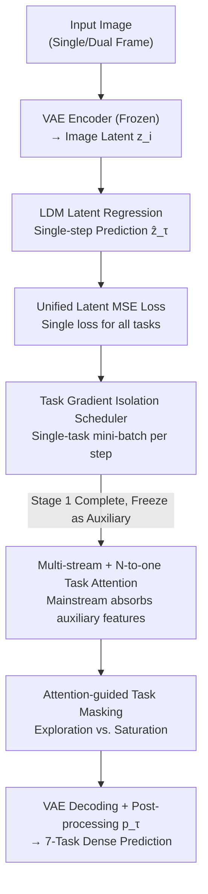

# StableMTL: Repurposing Latent Diffusion Models for Multi-Task Learning from Partially Annotated Synthetic Datasets

**Conference**: CVPR 2026  
**arXiv**: [2506.08013](https://arxiv.org/abs/2506.08013)  
**Code**: https://github.com/astra-vision/StableMTL (Available)  
**Area**: 3D Vision / Multi-Task Dense Prediction / Diffusion Models  
**Keywords**: Multi-Task Learning, Latent Regression, Partial Annotation, Domain Generalization, Task Attention

## TL;DR
StableMTL repurposes a pre-trained Latent Diffusion Model (Stable Diffusion) into a "single-step latent regressor." It jointly trains 7 dense prediction tasks (semantics, normals, depth, optical flow, scene flow, colorization, and albedo) on three synthetic datasets, each only partially annotated. By replacing per-task losses with a unified latent space MSE loss and facilitating knowledge sharing through an N-to-one "mainstream-auxiliary" task attention mechanism, StableMTL outperforms partially annotated MTL baselines by +4.78 $\Delta m$ across 8 real-world benchmarks and exhibits strong out-of-distribution generalization.

## Background & Motivation
**Background**: Multi-task learning (MTL) for dense prediction is highly valuable, as it simultaneously estimates scene cues like semantics, depth, normals, and optical flow, where representations learned for different tasks can mutually benefit each other. However, standard MTL requires "fully annotated" datasets where every image has labels for all tasks. Since pixel-level annotation is extremely expensive, such data is scarce. Consequently, "partially annotated MTL" has emerged, where each image only contains labels for a subset of tasks (e.g., MTPSL, DiffusionMTL, JTR).

**Limitations of Prior Work**: Existing partially annotated MTL methods suffer from two major issues. First is **single-domain training**—most simulate "missing labels" by randomly dropping annotations within a single dataset, leading to limited cross-domain generalization. Second is **task objective conflict**—designing specific pixel-level losses for each task and manually tuning weights to balance loss magnitudes and gradients becomes unstable and prohibitively expensive as the number of tasks grows ($>3$). Joint training on multiple real datasets also faces challenges like sensor noise (e.g., in depth maps) or unavailable ground truth for certain tasks (e.g., albedo, colorization).

**Key Challenge**: Scaling to more tasks and cross-domain generalization necessitates "multi-source partial annotation." However, the paradigm of per-task losses combined with manual balancing is neither stable nor scalable as the task count increases.

**Key Insight**: Recent works (Marigold, Lotus) found that fine-tuning the denoising UNet of a pre-trained Latent Diffusion Model (LDM) allows for single-task dense prediction on small synthetic datasets with strong generalization to real images, as generative priors are naturally resistant to domain shifts. The authors extend this "LDM redirection" from single-task to **multi-task + multi-synthetic datasets + partial annotation**, while completely discarding per-task losses.

**Core Idea**: Reformulate multi-task learning as a **latent space regression problem**. Labels for all tasks are first encoded into the unified latent space of Stable Diffusion. The model then learns to regress the target latent codes using a single shared MSE latent loss, with task identity specified by task tokens. An additional layer of "mainstream-to-auxiliary" task attention is introduced to explicitly facilitate cross-task communication.

## Method

### Overall Architecture
StableMTL aims to learn $K$ tasks from $N$ synthetic datasets where each dataset only labels $<K$ tasks (e.g., Hypersim labels semantics/normals/depth/colorization/albedo; VKITTI2 labels depth/normals/optical flow/scene flow/semantics; FlyingThings3D labels only optical flow/scene flow). The training proceeds in **two stages**:

- **First Stage (Single-Stream)**: Converts a Lotus-style single-step deterministic LDM into a multi-task version. The input image is encoded via a frozen SD VAE encoder into a latent $z_i=\mathcal{E}(x_i)$. Task labels are encoded into the same latent space via task-specific functions $f_\tau$ to obtain target latents $z_\tau=\mathcal{E}(f_\tau(y_\tau))$. A UNet $U_{\theta,\tau}$ predicts the task latent $\hat z_\tau=U_{\theta,\tau}(z_i)$ in a single step conditioned on a task token $c_\tau$, which is then mapped back to the task space via the VAE decoder and post-processing $p_\tau$. All tasks share parameters $\theta$ and are toggled by task tokens. Training uses a unified latent MSE loss with a Task Gradient Isolation Scheduler.
- **Second Stage (Multi-Stream)**: The single-stream UNet from stage one is **frozen** and used as an "auxiliary stream" $U_{\theta,\tau}$ (generating task-specific features for all non-primary tasks). A **trainable main UNet** $U_{\phi,T}$ is duplicated to output the primary task $T$. **Task Attention Layers** are inserted into each transformer block of the main UNet, allowing mainstream features to "absorb" task features from the auxiliary stream, compressing traditional N-to-N interactions into efficient N-to-one attention. Both stages use only one MSE latent loss without any per-task losses.

### Key Designs

**1. LDM Latent Regression + Task Token: Repurposing Generators as Multi-task Discriminators**

To address the poor scalability of per-task losses and weak cross-domain generalization, the authors avoid regressing in the original output spaces (depth maps, segmentation masks, etc.). Instead, all labels are unified into the 4-channel latent space of the SD VAE. Despite differences between discrete categories (semantics) and continuous scales (depth), labels are first mapped to 3-channel images via $f_\tau$ and then encoded as $z_\tau=\mathcal{E}(f_\tau(y_\tau))$, bringing heterogeneous tasks into a unified space. The UNet regresses $\hat z_\tau=U_{\theta,\tau}(z_i)$ in a single step (following Lotus's deterministic diffusion for speed and generalization). Task identity is injected via task tokens $c_\tau$ through cross-attention, allowing a single set of parameters $\theta$ to learn different "distribution patterns" per token, achieving full parameter sharing with zero extra parameters. The generative latent prior is the key to generalizing to real/OOD domains like KITTI/Waymo/DAVIS after training on only $\approx 80k$ synthetic images.

**2. Unified Latent MSE Loss: One Loss to Rule Them All**

To eliminate manual weight tuning, StableMTL calculates only the MSE in the latent space for every task:
$$\mathcal{L}(\theta)=\|\hat z_\tau-z_\tau\|_2^2=\|U_{\theta,\tau}(z_{i,j})-\mathcal{E}(f_\tau(y_\tau))\|_2^2$$
Because all tasks share the same latent space and are averaged over task tokens, heterogeneous tasks and different resolutions are naturally normalized. This inherently mitigates task scale imbalance. Adding new tasks requires no new loss designs or grid searches for weights. Experiments show that while certain per-task loss weight combinations can crash to $-68.94 \Delta m$, the unified latent loss achieves results on par with the optimal weights ($+3.92$ vs. $+4.07 \Delta m$) with zero tuning.

**3. Task Gradient Isolation Scheduler: Preventing Task Overpowering**

While the unified loss handles scale imbalance, gradient conflicts in magnitude and direction persist. Tasks with smaller gradient norms (e.g., semantics, albedo) can be "drowned out" by strong gradient tasks like depth. The solution is simple: **each training step uses a mini-batch of a single task**. Gradient accumulation occurs only within mini-batches of the same task; after an optimizer step, gradients are cleared before switching to the next task. This ensures all annotations are covered while preventing inter-task gradient interference within a single step. Ablations show this scheduler adds $+2.54 \Delta m$, with the most significant gains observed in low-gradient norm tasks.

**4. Multi-stream N-to-one Task Attention + Attention-guided Masking**

The single-stream model lacks explicit task interaction, while traditional N-to-N attention scales quadratically. StableMTL uses a multi-stream approach: a frozen single-stream UNet acts as an auxiliary stream, generating features $F_{\theta,\tau}$ for each non-primary task $\tau \in \mathcal{T}^* = \mathcal{T} \setminus \{T\}$. The main UNet features $F_{\phi,T}$ act as the query, while auxiliary features act as key/values in cross-attention:
$$\mathrm{Attention}(Q,K,V)=\mathrm{softmax}(QK^\top/\sqrt d)\,V$$
where $Q=[q_T(F_{\phi,T})]$ and $(K,V)=[(k_\tau(F_{\theta,\tau}),v_\tau(F_{\theta,\tau}))\mid\tau\in\mathcal{T}^*]$. Each task has **independent projection layers** $(q_t,k_t,v_t)$ for task-specific adaptation, compressing interactions into an efficient N-to-one mainstream-on-auxiliaries structure. To prevent early saturation on specific auxiliary tasks, an **Attention-guided Task Masking** is added: attention scores are normalized into a distribution $\pi_T(\tau)$, and a task $m_T$ is sampled to be masked (higher scores are more likely to be masked) with probability $\rho$. This forces the model to explore interactions with less dominant tasks.

### Loss & Training
- **Unique Loss**: Latent MSE (Eq. 1) used in both stages; no per-task losses or weights.
- **Multi-frame Adaptation**: For temporal tasks (optical flow/scene flow), input latents of two frames are concatenated channel-wise $z_{i,j}=\mathrm{concat}(z_i,z_j)$. For single-frame tasks, $j=i$.
- **Task Sampling**: One task is sampled uniformly per step. If a task is present in multiple datasets, domain matching rules are applied (e.g., Marigold sampling for depth/normals).
- **Backbone**: SD v2 (extensible to SD-XL/SD-3). Task attention is inserted into all 16 transformer blocks of the main UNet, with 4 attention heads being optimal.

## Key Experimental Results

### Main Results
Trained on 3 synthetic datasets (Hypersim/VKITTI2/FlyingThings3D, $\approx 80k$ images) and evaluated on 8 real-world benchmarks. The single-task baseline is Lotus-D trained individually. $\Delta m$ measures relative multi-task performance.

| Method | Semantic mIoU↑ | Normal mAE↓ | Depth AbsRel↓ (KITTI) | Flow EPE-2D↓ | Scene Flow EPE-3D↓ | Albedo RMSE↓ | $\Delta m$ %↑ |
| :--- | :--- | :--- | :--- | :--- | :--- | :--- | :--- |
| Single-task (Lotus-D) | 48.17 | 22.27 | 14.21 | 10.36 | 0.2735 | 0.2551 | 0.00 |
| JTR* | 20.46 | 50.91 | 39.27 | 34.92 | 0.5176 | 0.3565 | $-106.87$ |
| DiffusionMTL* | 45.92 | 44.56 | 24.83 | 36.60 | 0.3502 | 0.3660 | $-78.76$ |
| StableMTL-𝒮 (Single) | 52.57 | 23.94 | 15.64 | 12.76 | 0.2618 | 0.2077 | $-1.57$ |
| **StableMTL (Multi)** | **55.79** | **23.27** | **14.98** | **10.76** | **0.2313** | **0.2016** | **+4.78** |

Key comparison: StableMTL leads across semantic ($+9.87$ mIoU), normals ($-12.37$ mAE), and scene flow ($-0.1189$ EPE-3D). Baselines using per-task losses (JTR/DiffusionMTL) become unstable when scaled to 7 tasks (*).

### Ablation Study

| Configuration | $\Delta m$ %↑ | Description |
| :--- | :--- | :--- |
| **StableMTL Full (Multi-stream)** | **+4.78** | Complete model |
| w/o Independent Proj. $(q_t,k_t,v_t)$ | +0.85 (Gain -2.56) | Shared projections → Saturation |
| w/o Single-stream Initialization | $-3.11$ (Gain -6.52) | Essential for multi-stream success |
| w/o Multi-stream (Single-stream) | $-1.57$ (Gain -4.98) | No task interaction |
| Single-stream w/o Gradient Isolation | $-4.11$ (Gain -2.54) | Weak tasks drowned out |

Loss Ablation: Using only latent loss $\mathcal{L}_{\rm low}$ yields $+4.78 \Delta m$. Adding VAE output loss $\mathcal{L}_{\rm high}$ or per-task loss $\mathcal{L}_{\rm task}$ provides marginal gains ($\approx +6.9 \Delta m$ max) but doubles VRAM and requires weight balancing.

### Key Findings
- **Most Critical Design**: Initialization of the main UNet using single-stream weights is the most significant factor (drops $6.52 \Delta m$ if removed), followed by task gradient isolation and independent projections.
- **Task Interaction Visualization**: Strong bidirectional interactions occur between normals $\leftrightarrow$ depth, flow $\leftrightarrow$ scene flow, and colorization $\leftrightarrow$ albedo.
- **Generalization**: Training on only $80k$ synthetic images generalizes to real and OOD domains like Waymo and Cityscapes.

## Highlights & Insights
- **Unified Latent Space Regression**: By encoding heterogeneous tasks into the SD latent space, the persistent problem of per-task loss balancing is bypassed.
- **N-to-one Attention**: Compressing interactions into a mainstream-auxiliary structure provides scalability by reusing features from the frozen auxiliary stream.
- **Gradient Isolation Scheduler**: A simple training loop modification (one task per step) prevents dominant tasks from overwhelming smaller tasks without complex gradient surgery.

## Limitations & Future Work
- **Inference Cost**: Multi-stream inference requires the auxiliary stream to generate features for non-primary tasks, introducing additional overhead compared to single-network MTL.
- **Semantic Generalization**: Trained on closed-set synthetic driving categories, semantic generalization to non-driving domains is limited compared to geometry tasks.
- **Future Directions**: Shared/distilled auxiliary modules for faster inference and exploring open-vocabulary semantics.

## Related Work & Insights
- **vs. DiffusionMTL / JTR**: These methods rely on per-task pixel losses and manual weights, failing to scale beyond a few tasks. StableMTL uses a unified latent loss and scales to 7 tasks with ease.
- **vs. Marigold / Lotus**: These demonstrate single-task LDM fine-tuning; StableMTL extends this to the holistic MTL paradigm.
- **vs. Traditional MTL Balancing**: While other methods optimize Pareto fronts or manipulate gradients, StableMTL internalizes balancing via the unified representation.

## Rating
- Novelty: ⭐⭐⭐⭐⭐ (Repurposing LDMs for holistic MTL via latent regression is a significant shift.)
- Experimental Thoroughness: ⭐⭐⭐⭐⭐ (Comprehensive benchmarks and internal ablations.)
- Writing Quality: ⭐⭐⭐⭐ (Clear logic, though some loss ablation details require careful table cross-referencing.)
- Value: ⭐⭐⭐⭐⭐ (Provides a scalable, tuning-free path for MTL under annotation scarcity.)

<!-- RELATED:START -->

## Related Papers

- [\[CVPR 2026\] 3D-Aware Multi-Task Learning with Cross-View Correlations for Dense Scene Understanding](3d-aware_multi-task_learning_with_cross-view_correlations_for_dense_scene_unders.md)
- [\[CVPR 2026\] Mamba Learns in Context: Structure-Aware Domain Generalization for Multi-Task Point Cloud Understanding](mamba_learns_in_context_structure-aware_domain_generalization_for_multi-task_poi.md)
- [\[ICCV 2025\] Repurposing 2D Diffusion Models with Gaussian Atlas for 3D Generation](../../ICCV2025/3d_vision/repurposing_2d_diffusion_models_with_gaussian_atlas_for_3d_generation.md)
- [\[CVPR 2026\] NaTex: Seamless Texture Generation as Latent Color Diffusion](natex_seamless_texture_generation_as_latent_color_diffusion.md)
- [\[CVPR 2026\] MonoSAOD: Monocular 3D Object Detection with Sparsely Annotated Label](monosaod_monocular_3d_object_detection_with_sparsely_annotated_label.md)

<!-- RELATED:END -->
