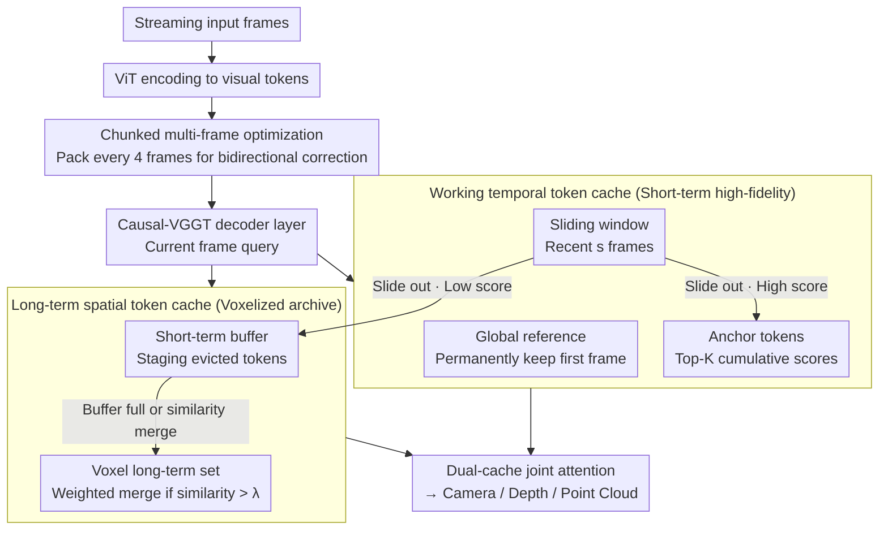

# STAC: Plug-and-Play Spatio-Temporal Aware Cache Compression for Streaming 3D Reconstruction

**Conference**: CVPR 2026  
**arXiv**: [2603.20284](https://arxiv.org/abs/2603.20284)  
**Code**: [https://stac-3r.github.io/](https://stac-3r.github.io/) (Project Page)  
**Area**: 3D Vision  
**Keywords**: Streaming 3D Reconstruction, KV Cache Compression, Spatio-Temporal Sparsity, Causal Transformer, Voxelized Storage

## TL;DR

Ours proposes the STAC framework, which leverages the spatio-temporal sparsity of KV caches in Causal Transformers. Through three modules—working temporal token cache, long-term spatial token cache, and chunked multi-frame optimization—it reduces memory consumption by approximately 10x and increases inference speed by 4x for streaming 3D reconstruction without additional training, while maintaining reconstruction quality.

## Background & Motivation

1. **Background**: Transformer-based 3D reconstruction methods (e.g., VGGT) have achieved SOTA performance by jointly inferring camera parameters, depth maps, and point clouds via feed-forward networks. To support streaming input, Causal-VGGT variants (STream3R, StreamVGGT) replace global self-attention with causal self-attention and maintain historical context via KV caches.
2. **Limitations of Prior Work**: KV caches grow linearly with the number of frames, leading to severe memory bottlenecks in long-sequence scenarios. For instance, when processing 200-300 frames, the cache can grow to nearly 20GB. Early eviction strategies under memory constraints significantly degrade reconstruction quality and temporal consistency.
3. **Key Challenge**: Existing methods treat all tokens uniformly, ignoring the inherent structured sparsity patterns in the cache—some tokens are only relevant in specific spatial locations (spatial sparsity), while others remain consistently important across frames (temporal sparsity). Uniform eviction/caching strategies lead to premature discarding of valuable tokens and unnecessary retention of useless ones.
4. **Goal**: (1) Maintain long-sequence 3D reconstruction quality under limited memory; (2) Utilize spatio-temporal sparsity for KV cache compression; (3) Achieve plug-and-play acceleration without extra training.
5. **Key Insight**: By analyzing the attention maps of Causal Transformers, the authors found that different attention heads exhibit specialized roles—some focus on spatial reasoning (attending to spatially adjacent regions), while others focus on temporal consistency (continuously attending to the first frame, landmark frames, or camera tokens). This "intrinsic spatio-temporal sparsity" provides a theoretical basis for structured compression.
6. **Core Idea**: Inspired by human memory mechanisms, the linear-growing KV cache is replaced with a dual-cache architecture consisting of "working memory (short-term high-fidelity) + long-term memory (spatially compressed storage)."

## Method

### Overall Architecture

The core problem STAC solves is the linear expansion of KV caches in streaming 3D reconstruction. Its strategy is to split "a single linearly growing large cache" into two functionally complementary memories: a high-fidelity working temporal cache for "recent + global anchors" and a long-term spatial cache for "compressed archiving of evicted tokens by spatial position."

Specifically, after each frame is encoded into visual tokens by the ViT, STAC maintains two caches in each decoder layer of Causal-VGGT: the working temporal cache $\mathcal{M}^{\text{temp}}$ stores the original representations of recent frames and anchor tokens, and the long-term spatial cache $\mathcal{M}^{\text{spat}}$ packs evicted tokens into a voxel grid and merges them online. During decoding, the current frame query attends to both caches simultaneously. On top of this, chunked multi-frame optimization packages consecutive frames into chunks for joint processing, reducing GPU overhead and allowing mutual correction between adjacent frames.

### Key Designs

**1. Working temporal token cache: Retaining "temporal anchors" beyond the sliding window**

Pure sliding windows only remember the last $s$ frames. Once a globally important token (first frame, landmark frame, camera token) slides out, it is lost forever. STAC splits short-term memory into three categories: global reference tokens $\mathcal{M}^{\text{refer}}$ (all tokens of the first frame), sliding window tokens $\mathcal{M}^{\text{window}}$ (recent $s$ frames), and anchor tokens $\mathcal{M}^{\text{anchor}}$ (dynamically selected tokens that remain attended over time). Retention is based on a decayed cumulative importance score:

$$s_t^i = \gamma s_{t-1}^i + \sum_j \alpha_t^{j,i}, \quad \gamma \in (0,1)$$

When a token slides out of the window, its cumulative score competes with existing anchor tokens to remain in the Top-K. This exponential decay naturally favors tokens that receive consistent long-term attention.

**2. Long-term spatial token cache: Compressing evicted tokens by 3D position**

Tokens in 3D reconstruction exhibit high spatial redundancy. STAC assigns a dual-buffer to each voxel: a short-term buffer $\mathcal{E}_u$ for newly evicted tokens and a long-term set $\mathcal{G}_u$ for merged representative tokens. Merging occurs via two paths: (1) One-to-one merging: if an evicted token's cosine similarity to a long-term representative exceeds $\lambda$, it is merged via weighted averaging:

$$\hat{m}^p \leftarrow \frac{Z(\hat{m}^p)\hat{m}^p + \omega(m^e,\hat{m}^p)m^e}{Z(\hat{m}^p) + \omega(m^e,\hat{m}^p)}$$

(2) Many-to-one aggregation: when the buffer is full, the highest-scoring token acts as a centroid to aggregate all buffered tokens into a new representative.

**3. Chunked multi-frame optimization: Amortizing GPU kernel overhead**

Frame-by-frame processing repeatedly triggers CUDA kernel overhead. STAC groups 4 consecutive frames into a temporal chunk. Intra-chunk bidirectional attention allows adjacent frames to exchange information and correct local geometry, while chunk boundaries maintain streaming constraints. Using Morton coding to map 3D voxel coordinates into linear indices allows batched selection, merging, and retrieval.

### Loss & Training

Ours is completely training-free and serves as a plug-and-play enhancement for pre-trained Causal-VGGT models. It only requires setting hyperparameters such as decay factor $\gamma=0.9$, voxel resolution $0.05$, and merging threshold $\lambda=0.8$. A custom CUDA kernel is implemented to support merge-aware attention calculations (using a $\log n$ bias for compensation).

## Key Experimental Results

### Main Results

Point cloud reconstruction results on NRGBD and 7-Scenes datasets (sampling step 5, 200-300 frames/sequence):

| Method | Type | NRGBD Acc↓ | NRGBD Comp↓ | NRGBD NC↑ | 7-Scenes Acc↓ | 7-Scenes NC↑ | Memory(GB)↓ | FPS↑ |
|------|------|-----------|------------|----------|--------------|-------------|----------|------|
| VGGT | Offline | 0.017 | 0.012 | 0.740 | 0.022 | 0.602 | – | <1 |
| STream3R | Online | 0.053 | 0.013 | 0.703 | 0.044 | 0.606 | 19.75 | 2.52 |
| STream3R-W8 | Online | 0.078 | 0.015 | 0.687 | 0.107 | 0.587 | 0.86 | 6.19 |
| **STream3R-STAC** | **Online** | **0.065** | **0.014** | **0.700** | **0.047** | **0.606** | **2.20(0.86)** | **10.53** |
| StreamVGGT | Online | 0.134 | 0.059 | 0.651 | 0.046 | 0.595 | 19.75 | 2.48 |
| StreamVGGT-STAC | Online | 0.126 | 0.047 | 0.682 | 0.056 | 0.596 | 2.57(0.86) | 10.49 |

STAC reduces STream3R's memory from 19.75GB to 2.20GB (0.86GB at runtime) and increases FPS from 2.52 to 10.53 with almost no loss in quality.

### Ablation Study

Evaluated on NRGBD based on STream3R-W8 (7-Scenes average metrics):

| Configuration | Acc↓ | Comp↓ | NC↑ | Memory(GB) | Runtime(ms) |
|------|------|-------|-----|----------|-------------|
| Baseline (W8) | 0.0776 | 0.0150 | 0.6865 | 0.858 | 92.56 |
| w/o Anchor tokens | 0.0725 | 0.0209 | 0.6991 | 1.901 | 61.36 |
| w/o Spatial cache | 0.0713 | 0.0199 | 0.6939 | 0.572 | 39.08 |
| w/o Count bias | 0.0666 | 0.0175 | 0.6973 | 2.063 | 56.08 |
| w/o Chunking | 0.0673 | 0.0156 | 0.6948 | 1.805 | 138.12 |
| **Full Model** | **0.0648** | **0.0142** | **0.6995** | **2.210** | **71.18** |

### Key Findings
- Chunked optimization has the greatest impact on runtime: removal increases single-step time from 71ms to 138ms.
- Spatial cache significantly improves Completion (Comp) metrics, indicating the importance of long-term spatial information.
- Anchor tokens are critical for Comp metrics (0.0142 vs 0.0209), confirming that persistent tokens preserve temporal consistency.
- Under the same memory budget, STAC consistently outperforms simple sliding window extensions.

## Highlights & Insights
- **Training-Free Plug-and-Play**: STAC requires no retraining and can be applied directly to Causal-VGGT architectures, lowering deployment barriers.
- **Precise Memory Analogy**: The "working memory + long-term memory" design accurately mirrors human cognitive models and is effectively implemented through "anchoring" via decayed cumulative scores.
- **Natural Fit for Voxel Organization**: Utilizing the 3D nature of the task to organize the spatial cache in a voxel grid allows O(1) retrieval, an advantage not present in LLM KV cache compression.

## Limitations & Future Work
- Voxel grids have fixed resolutions; active voxel counts may continue to grow in large-scale open scenes—CPU offloading or adaptive resolutions could be considered.
- Fast motion in highly dynamic scenes might introduce inconsistent token representations, affecting cache stability.
- Currently validated only on indoor datasets; scalability to large-scale outdoor driving scenarios remains to be explored.

## Related Work & Insights
- **vs StreamVGGT/STream3R**: These are the underlying architectures for STAC; STAC solves their core bottleneck of linear KV cache growth via structured compression.
- **vs H2O/StreamLLM (LLM KV Compression)**: These target 1D sequences. STAC is the first to introduce spatio-temporal structured sparsity for 3D vision KV caches using voxelized priors.
- **vs Spann3R/CUT3R**: These use implicit or latent memory, which can suffer from drift/forgetting; STAC's explicit dual-cache mechanism better maintains long-term consistency.

## Rating
- Novelty: ⭐⭐⭐⭐
- Experimental Thoroughness: ⭐⭐⭐⭐⭐
- Writing Quality: ⭐⭐⭐⭐⭐
- Value: ⭐⭐⭐⭐

<!-- RELATED:START -->

## Related Papers

- [\[CVPR 2026\] Revisiting Monocular SLAM with Spatio-Temporal Scene Modeling](revisiting_monocular_slam_with_spatio-temporal_scene_modeling.md)
- [\[CVPR 2026\] ST4R-Splat: Spatio-Temporal Referring Segmentation in 4D Gaussian Splatting](st4r-splat_spatio-temporal_referring_segmentation_in_4d_gaussian_splatting.md)
- [\[CVPR 2026\] LiDAR Prompted Spatio-Temporal Multi-View Stereo for Autonomous Driving](lidar_prompted_spatio-temporal_multi-view_stereo_for_autonomous_driving.md)
- [\[CVPR 2026\] STS-Mixer: Spatio-Temporal-Spectral Mixer for 4D Point Cloud Video Understanding](sts_mixer_4d_point_cloud.md)
- [\[CVPR 2026\] Point4Cast: Streaming Dynamic Scene Reconstruction and Forecasting](point4cast_streaming_dynamic_scene_reconstruction_and_forecasting.md)

<!-- RELATED:END -->
