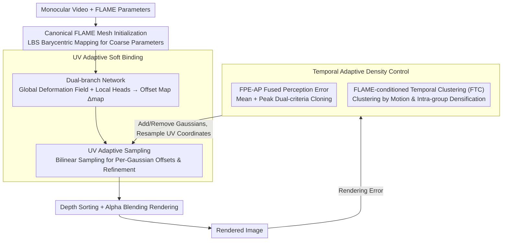

# STAvatar: Soft Binding and Temporal Density Control for Monocular 3D Head Avatars Reconstruction

**Conference**: CVPR2026  
**arXiv**: [2511.19854](https://arxiv.org/abs/2511.19854)  
**Code**: [Project Page](https://jiankuozhao.github.io/STAvatar/)  
**Area**: 3D Vision  
**Keywords**: 3D Head Avatar, 3D Gaussian Splatting, Soft Binding, Adaptive Density Control, Monocular Reconstruction

## TL;DR

Ours proposes STAvatar, a framework for reconstructing high-fidelity, drivable 3D head avatars from monocular video. By utilizing a UV-adaptive soft binding framework and a temporal adaptive density control strategy, it significantly outperforms existing methods in handling occluded areas (e.g., mouth interior, eyelids) and fine details.

## Background & Motivation

Reconstructing drivable, photorealistic 3D head avatars from monocular video remains a long-standing challenge in computer vision and graphics, with broad applications in AR/VR, telepresence, and digital humans. Existing methods based on 3D Gaussian Splatting (3DGS) suffer from two core limitations:

1.  **Rigid Binding Issue**: Current methods hard-bind Gaussian primitives to FLAME mesh triangles, driving deformation solely through Linear Blend Skinning (LBS). This results in Gaussians remaining relatively static within the local coordinate system of the triangles, failing to model non-rigid fine deformations such as wrinkles and expressive details. While some methods use fixed-dimensional MLPs for deformation, they require a predefined number of Gaussians, making them incompatible with Adaptive Density Control (ADC).
2.  **ADC Failure in Dynamic Scenes**: The original 3DGS ADC is designed for static scenes and fails in frequently occluded regions (e.g., mouth interior). These areas are visible only in a few frames, leading to low average positional gradients and insufficient densification. Furthermore, positional gradients only capture geometric discrepancies while ignoring texture details.

## Core Problem

How to achieve soft, non-rigid deformation from mesh to Gaussians while maintaining ADC flexibility? How to improve ADC to adapt to the requirements of transiently visible regions and texture details in dynamic head reconstruction?

## Method

### Overall Architecture

STAvatar aims to reconstruct 3D head avatars from monocular video that are freely drivable while preserving details. The challenge lies in allowing Gaussians to undergo non-rigid deformation according to expressions without losing the flexibility of Adaptive Density Control (ADC). The pipeline is built upon 3DGS driven by a FLAME parametric mesh: Gaussian primitives $g_i$ are initialized on a canonical FLAME mesh, each bound to a triangle with parameters including center $\boldsymbol{\mu}$, scale $\boldsymbol{S}$, rotation $\boldsymbol{R}$, opacity $\alpha$, and color $c$. During driving, coarse parameters are first estimated via barycentric mapping of the parent triangle: $\tilde{\boldsymbol{r}} = \boldsymbol{r}\boldsymbol{R}$, $\tilde{\boldsymbol{\mu}} = k\boldsymbol{r}\boldsymbol{\mu} + \boldsymbol{t}$, and $\tilde{\boldsymbol{s}} = k\boldsymbol{s}$ (where $\boldsymbol{r}$, $\boldsymbol{t}$ represent rotation and translation of the triangle center, and $k$ is isotropic scaling). Pixels are then rendered via alpha-blending after depth sorting: $\boldsymbol{C} = \sum_{i=1}^{N} c_i^* \alpha_i' \prod_{j=1}^{i-1}(1 - \alpha_j')$.

The issue lies in these "coarse estimates": under pure LBS, opacity and color remain constant ($\tilde{\alpha}=\alpha$, $\tilde{c}=c$), and Gaussians remain nearly static in the local coordinate system, unable to represent non-rigid details like wrinkles. STAvatar addresses this by layering two mechanisms over the coarse estimation: **UV Adaptive Soft Binding** to predict fine-grained offsets for each Gaussian to refine parameters, and **Temporal Adaptive Density Control** to adapt densification to "transiently visible" areas and "texture errors" ignored by original ADC.

### Key Designs

**1. Dual-branch Network for UV Adaptive Soft Binding: Predicting Gaussian offsets in UV space to recover non-rigid details lost in hard binding.**

Hard binding prevents Gaussians from deforming independently. A direct fix would be learning an offset for each Gaussian; however, using individual fixed-dimension MLPs per Gaussian (as in prior work) fixes the number of Gaussians and conflicts with ADC. STAvatar instead predicts an offset map in UV space. The network takes three inputs: texture extracted from a fixed reference frame $Img_r$ (defaulting to the first frame), a position map $UV_{pos}$ rasterized from reference UV coordinates, and a displacement map $UV_{disp}$ rasterized from vertex offsets between reference and control meshes. A global branch and a local branch cooperatively produce a feature offset map $\Delta_{map} \in \mathbb{R}^{256 \times 256 \times 13}$, where each texel stores 13-dimensional Gaussian offsets. The global branch handles a consistent deformation field using U-Net texture features $T = \mathcal{E}_i(Img_r)$, Fourier-encoded position maps $UV_{pos}' = \mathcal{E}_f(UV_{pos})$, and a control code $\beta$ (concatenated expression, translation, and pose), outputting $\omega_g = \Phi_g(T, UV_{pos}', \beta)$. The local branch focuses on four key regions (eyes, mouth, nose, forehead) using four region masks $M_i \in \{0,1\}^{256 \times 256}$ and dedicated heads $H_i$, outputting $\omega_l = \sum_{i=1}^{4} H_i(M_i \odot \Phi_l(T, UV_{disp}', \beta))$. These are fused into $\Delta_{map} = \mathcal{F}(\omega_g, \omega_l)$. Placing offsets in a UV map rather than per-Gaussian MLPs ensures spatial continuity for neighboring Gaussians and decouples the offset map from the Gaussian count, enabling compatibility with ADC.

**2. UV Adaptive Sampling: Utilizing a continuous offset map for an arbitrary number of Gaussians to ensure compatibility between soft binding and ADC.**

Once the offset map is generated, it must be "distributed" to each Gaussian. Since the number of Gaussians changes during ADC, the distribution mechanism must adapt. STAvatar assigns a coordinate in UV space to each Gaussian $g_i$, then performs bilinear sampling on $\Delta_{map}$ to retrieve its offset $\delta_i = \{\delta_\mu, \delta_s, \delta_r, \delta_\alpha, \delta_c\}$. Coordinate assignment (Algorithm 1) involves rasterizing UV vertices and faces, creating a pixel pool for each face, and sampling the corresponding number of pixels for Gaussians bound to that face to calculate UV coordinates via barycentric weights. When ADC triggers densification, new UV coordinates are automatically resampled. After obtaining offsets, coarse parameters are refined into final parameters:

| Parameter | Calculation | Operation Type |
|-----------|-------------|----------------|
| Position $\mu^*$ | $\tilde{\mu} + \delta_\mu$ | Additive Offset |
| Color $c^*$ | $\tilde{c} + \delta_c$ | Additive Offset |
| Opacity $\alpha^*$ | $\tilde{\alpha} + \delta_\alpha$ | Additive Offset |
| Scale $s^*$ | $\tilde{s} \odot \delta_s$ | Element-wise Multiplication |
| Rotation $r^*$ | $q(\tilde{r}, \delta_r)$ | Quaternion Hamilton Product |

Crucially, because offsets come from a continuous UV map supporting arbitrary resolution sampling, new Gaussians simply resample coordinates to obtain valid offsets. This allows "soft binding" and "dynamic Gaussian densification" to coexist.

**3. FPE-AP Fused Perception Error Criterion: Driving densification by texture error rather than just positional gradients.**

Original ADC uses positional gradients for cloning, which only reflects geometric inconsistency and ignores texture error. Consequently, regions with texture details but geometric alignment remain under-densified. STAvatar uses rendering error directly. A fused perception error map is constructed by combining per-pixel L1 and structural dissimilarity:

$$E = (1 - \lambda_1)|\mathcal{L}_1| + \lambda_1 \mathcal{L}_{d\text{-}ssim}$$

where $\lambda_1 = 0.2$. This error is then distributed to Gaussians: by recording its screen center $(x_i, y_i)$, pixel coverage $C_i$, and accumulated alpha $A_i$, an influence region of $R_i = \lfloor \sqrt{C_i}/2 \rfloor$ is defined to calculate the average fused perception error $\bar{E}_i = \frac{A_i}{C_i} \sum_{p \in \mathcal{P}_i} E(p)$ (using 2D SAT for acceleration). Since average error might suppress transient high errors, a peak criterion is added: $E_i^{peak} = \max_t(\frac{A_i^{(t)}}{C_i^{(t)}} \sum_{p} E^{(t)}(p))$, selecting the top 3% in set $\mathcal{S}_{peak}$. Cloning occurs if $\bar{E}_i > \tau_{avg}$ **OR** $i \in \mathcal{S}_{peak}$ ($\tau_{avg} = 1 \times 10^{-3}$). Splitting still follows positional gradients as it is primarily driven by geometric inconsistency.

**4. FLAME-conditioned Temporal Clustering (FTC): Ensuring sufficient densification for regions like the mouth interior which are visible only in few frames.**

Areas like the mouth interior or eyelids are occluded in most frames. Averaging densification criteria across the entire video results in values too low for triggering ADC. FTC clusters frames by motion patterns and calculates densification criteria within groups. Specifically, K-means is applied to FLAME parameters (expression 0.3, pose 0.6, translation 0.1) after PCA dimensionality reduction, selecting the optimal $K \in [5, 12]$ via the silhouette coefficient. During training, $N-M$ epochs are trained within clusters (performing intra-group ADC), followed by $M$ epochs of randomly shuffled data to eliminate inter-group inconsistencies ($N=6$, $M=1$). By grouping structurally similar frames, transiently visible regions like the mouth are sufficiently densified within their respective clusters—experimentally, FTC increases mouth Gaussian count by approximately 17% (over 400 primitives).

### Loss & Training

The RGB loss combines L1, SSIM, and perceptual loss: $\mathcal{L}_{rgb} = (1-\lambda_1)\mathcal{L}_1 + \lambda_1\mathcal{L}_{d\text{-}ssim} + \gamma\lambda_2\mathcal{L}_{vgg}$, where VGG loss is activated in the latter half of training ($\gamma=1$), with $\lambda_1=0.2$ and $\lambda_2=0.05$. Offset regularization $\mathcal{L}_{offset} = \lambda_3|\delta_s - 1| + \lambda_4\delta_c$ constrains scale offsets toward 1 and minimizes color offsets. Positional and scale losses from GaussianAvatars are also adopted. The Adam optimizer is used, with a learning rate of $1 \times 10^{-4}$ for the UV soft binding network. Since Gaussians are bound to mesh faces, opacity reset is omitted as there are almost no floating Gaussians.

## Key Experimental Results

Evaluation was performed on 22 identities across 4 datasets (INSTA, PointAvatar, NerFace, HDTF) at 512×512 resolution, trained on a single RTX 3090.

| Method | INSTA PSNR↑ | INSTA SSIM↑ | INSTA LPIPS↓ | PointAvatar PSNR↑ | NerFace PSNR↑ | HDTF PSNR↑ |
|------|-------------|-------------|--------------|-------------------|---------------|------------|
| SplattingAvatar | 27.48 | 0.9329 | 0.1046 | 24.93 | 26.14 | 26.02 |
| GaussianAvatars | 26.98 | 0.9378 | 0.0851 | 24.62 | 25.74 | 25.08 |
| FlashAvatar | 27.90 | 0.9357 | 0.0563 | 26.19 | 26.96 | 26.83 |
| FateAvatar | 28.33 | 0.9446 | 0.0508 | 28.36 | 27.12 | 27.18 |
| **STAvatar** | **30.63** | **0.9587** | **0.0304** | **28.25** | **30.08** | **27.99** |

- PSNR outperforms the second-best method by **2.2 dB** on INSTA, with LPIPS reduced by **40%+**.
- Convergence is achieved in only **6 epochs**, offering the highest training efficiency (competitors require 10-100 epochs).
- Ablation studies confirm component effectiveness: omitting soft binding drops PSNR by 1.0 dB; omitting ADC significantly degrades LPIPS.

## Highlights

1.  **Elegant UV-space Soft Binding**: Encoding Gaussian offsets in UV feature maps leverages spatial context (ensuring continuity for neighboring Gaussians) while remaining compatible with ADC—newly added Gaussians simply resample UV coordinates.
2.  **Targeted Temporal ADC Strategy**: FLAME parameter clustering ensures transiently visible regions are sufficiently densified within structurally similar frames. FPE-AP dual criteria (mean + peak) consider both geometry and texture.
3.  **High Training Efficiency**: Convergence in 6 epochs is an order of magnitude faster than MonoGaussianAvatar (100 epochs), attributed to efficient dual-branch network parameterization and focused FTC training.

## Limitations & Future Work

1.  **Dependence on FLAME Tracking**: The pipeline assumes high-quality FLAME fitting (e.g., via VHAP); tracking errors propagate directly to reconstruction.
2.  **Simple Reference Frame Selection**: Defaulting to the first frame as the reference neglects potential benefits of multi-reference or adaptive selection strategies.
3.  **Handling Hair and Accessories**: FLAME does not model hair; these regions rely entirely on 3DGS degrees of freedom for reconstruction.
4.  **FTC Clustering Hyperparameters**: While K is selected via silhouette coefficients, clustering effectiveness still depends on the distribution of FLAME parameters.
5.  **Real-time Inference**: While training is efficient, real-time inference framerates are not reported; the dual-branch network potentially impacts inference speed.

## Related Work & Insights

-   **vs GaussianAvatars (GA)**: GA uses hard binding and pure LBS. STAvatar's soft binding with offsets improves PSNR by 3.6 dB.
-   **vs FlashAvatar (FA) / MonoGaussianAvatar (MGA)**: FA/MGA use fixed-dimension MLPs to predict offsets, making them incompatible with ADC. STAvatar's UV sampling naturally supports dynamic Gaussian counts.
-   **vs FateAvatar**: Compared to this recent SOTA, STAvatar leads significantly on INSTA and NerFace (+2.3/+2.96 dB), primarily due to temporal ADC for occluded regions.
-   **vs Static ADC Methods** (e.g., SteepGS, 3DGS-MCMC): These are designed for static scenes and cannot handle transiently visible regions in dynamic reconstructions.

## Rating

- Novelty: ⭐⭐⭐⭐ (Combination of UV soft binding and temporal ADC effectively addresses practical issues with technical innovation)
- Experimental Thoroughness: ⭐⭐⭐⭐⭐ (4 datasets, 22 identities, 6 baselines, comprehensive ablations, and efficiency analysis)
- Writing Quality: ⭐⭐⭐⭐ (Clear motivation and excellent illustrations, though method description is dense)
- Value: ⭐⭐⭐⭐ (Advances SOTA in monocular head avatar reconstruction with practical training efficiency)

<!-- RELATED:START -->

## Related Papers

- [\[CVPR 2026\] Zero-Shot Reconstruction of Animatable 3D Avatars with Cloth Dynamics from a Single Image](zero-shot_reconstruction_of_animatable_3d_avatars_with_cloth_dynamics_from_a_sin.md)
- [\[CVPR 2026\] PhysHead: Simulation-Ready Gaussian Head Avatars](physhead_simulation-ready_gaussian_head_avatars.md)
- [\[CVPR 2026\] FlexAvatar: Flexible Large Reconstruction Model for Animatable Gaussian Head Avatars with Detailed Deformation](flexavatar_flexible_large_reconstruction_model_for_animatable_gaussian_head_avat.md)
- [\[NeurIPS 2025\] DC4GS: Directional Consistency-Driven Adaptive Density Control for 3D Gaussian Splatting](../../NeurIPS2025/3d_vision/dc4gs_directional_consistency-driven_adaptive_density_control_for_3d_gaussian_sp.md)
- [\[CVPR 2026\] Multi-view Consistent 3D Gaussian Head Avatars 'without' Multi-view Generation](multi-view_consistent_3d_gaussian_head_avatars_without_multi-view_generation.md)

<!-- RELATED:END -->
