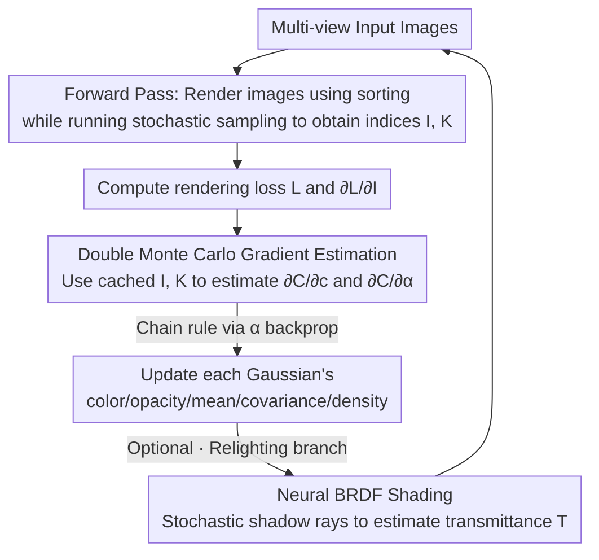

# Stochastic Ray Tracing for the Reconstruction of 3D Gaussian Splatting

**Conference**: CVPR 2026  
**Paper**: [CVF Open Access](https://openaccess.thecvf.com/content/CVPR2026/html/Xu_Stochastic_Ray_Tracing_for_the_Reconstruction_of_3D_Gaussian_Splatting_CVPR_2026_paper.html)  
**Code**: To be confirmed  
**Area**: 3D Vision  
**Keywords**: 3D Gaussian Splatting, Ray Tracing, Stochastic Estimation, Differentiable Rendering, Relighting

## TL;DR
Instead of the expensive task of sorting all intersecting Gaussians along each ray for ray-traced 3DGS, this work proposes an **unbiased, order-free Monte Carlo gradient estimator**. It can backpropagate gradients by sampling only a few Gaussians per ray, matching the speed and quality of rasterization on standard 3DGS while vastly outperforming existing sorting-based ray tracing, and seamlessly extending the same estimator to relightable 3DGS reconstruction with real shadow rays.

## Background & Motivation

**Background**: 3DGS represents scenes with a set of anisotropic semi-transparent Gaussians, and the mainstream path is **rasterization**, which projects (splats) each Gaussian onto the screen for alpha blending. It is fast and effective with hardware acceleration, becoming the standard for novel view synthesis. Another path is **ray tracing**, which casts camera rays directly into the scene to intersect with Gaussians. Its benefit is that it naturally supports shadows, reflections/refractions, and non-pinhole camera models like fisheye, bypassing various approximation patches of rasterization.

**Limitations of Prior Work**: Although ray-traced 3DGS (such as 3DGRT) is more fully-featured, it has two major drawbacks. First, it is **slow**. To perform correct alpha blending, all intersecting Gaussians along each ray must be **sorted by depth**, a step whose cost escalates rapidly as the number of intersecting Gaussians $n$ increases. Second, it is **incomplete**. When handling relighting scenes, existing ray tracing methods fall back to rasterization-style approximations (like shadow mapping or deferred shading) to estimate occlusions, discarding the "physically correct" generality that ray tracing should bring.

**Key Challenge**: Sorting is done to precisely compute "how much the front Gaussians block the rear ones," but it is the exact performance bottleneck. Sun et al. previously proposed an **unbiased, order-free** stochastic rendering algorithm that can efficiently perform **forward rendering** of 3DGS, but it is **non-differentiable** and thus cannot be used for scene reconstruction or relighting. In other words, "order-free forward rendering" exists, but "order-free backward gradients" are missing.

**Goal**: (1) Design an unbiased, order-free stochastic algorithm to estimate gradients of pixel colors with respect to **all** Gaussian parameters, enabling differentiable ray tracing to run efficiently; (2) Extend the same stochastic mechanism to relightable 3DGS, replacing shadow mapping with real shadow rays.

**Key Insight**: Since forward stochastic blending can unbiasedly estimate pixel colors by "sampling one Gaussian with probability equal to its blending weight," the same product term $\alpha_i\prod_{j\prec i}(1-\alpha_j)$ appears in the **gradients**, which should be cancelable using the **same sampling scheme**. Following this observation, the authors reuse the forward sampling directly in the backward pass, and employ a **second Monte Carlo sampling** for the additional "summation over subsequent Gaussians" term in the gradient.

**Core Idea**: Replace the "exact summation after sorting" with an unbiased Monte Carlo estimator that "samples only two Gaussians (a foreground $g_I$ + a subsequent $g_K$)," eliminating the need for sorting during backpropagation. This estimator is exceptionally beneficial for relighting, where shading each Gaussian (by tracing shadow rays) is extremely costly, saving massive computation by "only computing for the sampled ones."

## Method

### Overall Architecture

The input consists of multi-view images, and the output is the reconstructed 3DGS scene (standard or relightable). The method does not alter the representation or optimizer of 3DGS, but only **replaces the backward automatic differentiation module** by replacing "exact gradient calculation after sorting" with "unbiased estimation via sampling a few Gaussians."

Returning to the forward equation, a ray intersecting $n$ Gaussians renders a pixel color with alpha blending: $C=\sum_{i=1}^{n} c_i\,\alpha_i\prod_{j\prec i}(1-\alpha_j)$, where $j\prec i$ denotes a Gaussian closer than $g_i$. **Stochastic blending** works by sampling an index $I$ with probability $p_I=\alpha_I\prod_{j\prec I}(1-\alpha_j)$, and defining the random variable $\langle C\rangle=\frac{1}{p_I}c_I\alpha_I\prod_{j\prec I}(1-\alpha_j)$. This exactly cancels out the product term, yielding the simplified $\langle C\rangle=c_I$ with an unbiased expectation $\mathbb{E}[\langle C\rangle]=C$. This sampling can be achieved by traversing the Gaussians along the ray **out of order** (maintaining a "currently selected" item and replacing it if a closer one is found with $\xi<\alpha_i$), completely avoiding sorting.

This paper addresses the backward pass. The entire reconstruction pipeline is a standard two-pass process:

Note an engineering ingenious detail: when the forward pass uses **sorting-based** rendering (e.g., for simple scenes), the sampling indices $I,K$ required for the backward pass can be collected **with almost zero cost** along the way, saving the need to run an independent stochastic sampling pass.

### Key Designs

**1. Double Monte Carlo Gradient Estimation: Sampling only "foreground + one subsequent" Gaussians calculates all gradients unbiasedly**

Backpropagating 3DGS requires only two types of gradients: the color gradient $\partial C/\partial c_i$ and the opacity gradient $\partial C/\partial \alpha_i$. Gradients of other parameters ($\mu_i,\Sigma_i,\sigma_i$) can be derived through the chain rule via $\alpha_i$. The difficulty is that in stochastic blending, $\alpha_i$ controls the branching decision $\xi<\alpha_i$. Naive automatic differentiation treats this branch as a constant and **incorrectly computes** $\partial C/\partial\alpha_i$, while compiler techniques capable of handling such discrete branches are hard to deploy in general GPU frameworks like CUDA/OptiX.

The authors' solution is a custom-written unbiased estimator. Differentiating the equation yields $\frac{\partial C}{\partial c_i}=\alpha_i\prod_{j\prec i}(1-\alpha_j)$ and $\frac{\partial C}{\partial \alpha_i}=\big(\prod_{j\prec i}(1-\alpha_j)\big)\big(c_i-\sum_{k\succ i}c_k\alpha_k\prod_{i\prec t\prec k}(1-\alpha_t)\big)$. The key observation is that both equations contain $\alpha_i\prod_{j\prec i}(1-\alpha_j)$, which is exactly the forward sampling probability $p_I$. Reusing the forward sampling to draw $I$, the product term is canceled by the probability, leaving $\langle\partial_c C\rangle_I=1$ and $\langle\partial_\alpha C\rangle_I=\frac{1}{\alpha_I}\big(c_I-\sum_{k\succ I}c_k\alpha_k\prod_{I\prec t\prec k}(1-\alpha_t)\big)$, with all other components being 0. Intuitively, $\partial_\alpha C$ measures the difference between "the color of the sampled Gaussian $g_I$" and "the blended color of all Gaussians **behind** it"—effectively the effect of removing $g_I$ from the blend.

But the "summation over subsequent Gaussians" still requires sorting those behind $g_I$. This is where the **second** Monte Carlo sampling steps in: sample an index $K$ **located behind $g_I$** with probability $p_{K|I}=\alpha_K\prod_{I\prec t\prec K}(1-\alpha_t)$. This shares the same form as $p_I$ but restricted to after $g_I$, and can be implemented with the same order-free sampling. After cancellation, the entire opacity gradient collapses into a simple **color difference**: $\langle\partial_\alpha C\rangle_I=\frac{1}{\alpha_I}(c_I-c_K)$. Thus, by sampling only a "foreground $g_I$ + background $g_K$" pair per ray and computing their colors $c^{+},c^{-}$ once, the gradients can be unbiasedly estimated (proven in the appendix). The entire backward pass also remains order-free, maintaining minimal per-ray states ($I,K$ and their depths), repeated for $M_b$ rounds to reduce variance.

**2. Two-Pass Reconstruction Pipeline Reusing Forward Sampling: Decoupling "sampling" from "shading" and storing indices on the fly**

Having an unbiased estimator is not enough; it must be integrated into the two-pass reconstruction pipeline without redundant computation. The forward pass runs a normal sorted rendering on a mini-batch to render an image using Moenne-Loccoz et al.'s algorithm, **while** running the stochastic sampling algorithm simultaneously—but **only sampling the indices without computing colors**, storing $I,K$ for each ray. The backward pass first compares the rendered image with the input view to compute loss $L$ and pixel-wise gradient $\partial L/\partial I$, then uses the **pre-stored indices** to estimate gradients. These gradients are backpropagated to $c_i,\alpha_i$ and the derived $\mu_i,\Sigma_i,\sigma_i$ of each Gaussian, updating parameters following 3DGRT.

This "sampling/shading decoupling" is vital: under relighting, computing the color of a Gaussian requires tracing shadow rays, which is extremely expensive. Decoupling "first determining which two to sample, then shading only those two" reduces the expensive shading operations to a constant number per ray. In standard scenes, it harvests indices by piggybacking on the sorted forward pass, introducing almost zero extra overhead.

**3. Relighting Extension: Neural BRDF Shading + Stochastic Shadow Rays for Transmittance, Completely Omitting Shadow Mapping**

In standard 3DGS, each Gaussian stores a fixed color $c_i$ (like self-emission); for relighting, the color must depend on incoming light (the Gaussian is **reflecting** light). The authors express the color using the rendering equation integrated over a hemisphere: $c_i(\omega_{out})=\int_{S^2} f_r(z_i,\omega_{in},\omega_{out})\,L_{in}(\omega_{in})\,d\omega_{in}$, and approximate it using a lightweight neural decoder $\underline{\Theta}$ shared by all Gaussians (following RNG): $\underline{\Theta}(z_i,\omega_{in},\omega_{out},L_e,T)\approx f_r\cdot L_{in}$. Besides direction and per-Gaussian latent feature $z_i$, $\underline{\Theta}$ takes two additional variables to help the network learn global light effects like interreflection: direct light source emission $L_e$ and **transmittance** from the light to the Gaussian $T=1-\sum_{i'} \alpha^{shadow}_{i'}\prod_{j'\prec i'}(1-\alpha^{shadow}_{j'})$ (the occlusion along the shadow ray over unsorted Gaussians). $L_e\,T$ is the attenuated direct illumination.

The key is how to calculate $T$ both fast and accurately. Under relighting, the higher-dimensional integration makes sorted forward passes computationally prohibitive, so the forward color is switched to the stochastic algorithm (Algorithm 1). Under point/directional lights, the hemispherical integration reduces to a summation over light directions, while environmental lighting is estimated via Monte Carlo integration. Transmittance $T$ is estimated with a modified stochastic sampling: after traversing all Gaussians along a shadow ray, **if no Gaussian is sampled** (sampling depth $z=\infty$, meaning unoccluded), $T$ is recorded as 1; otherwise, it is 0. Training still runs the same two-pass pipeline, but colors are generated by $\underline{\Theta}$. $\langle\partial_c C\rangle$ backpropagates to update the network weights and latent features $z_i$, and $\langle\partial_\alpha C\rangle$ updates shape parameters. Compared with prior methods using shadow mapping or dedicated shadow-prediction networks, this approach of tracing **actual shadow rays** naturally supports complex environmental lights and is compatible with various shading models $f_r$ (such as GS3, Relightable-3DGS, GS-IR, etc.). ⚠️ Please refer to the original paper for precise formula details.

### Loss & Training

Standard reconstruction follows the optimization scheme of 3DGS/3DGRT with backward sample count $M_b=8$. Since stochastic estimation tends to generate more Gaussians, the densification interval is loosened to 400 in novel view synthesis for a fair comparison; multiple forward samples perform independent trials within a single BVH traversal, using $M_f=15$ forward samples for relighting. Relighting employs a two-stage process: Stage 1 optimizes geometry as standard 3DGS (view-dependent SH) for 15,000 steps for initialization, and Stage 2 switches to the neural appearance model to fine-tune for 85,000 steps (the network has 4 layers, width 64, with a 16-dimensional latent feature per Gaussian; densification/pruning/density-reset intervals are set to 3,000/1,000/12,000). The implementation is built on the 3DGRT codebase, utilizing OptiX for hardware ray tracing. Sampling is executed in the any-hit program, neural network evaluation uses OptiX Cooperative Vector, and experiments run on an RTX 5880 Ada GPU.

## Key Experimental Results

### Main Results

Compared with rasterization-based 3DGS and sorted ray-traced 3DGRT on standard Novel View Synthesis (NVS). As a ray tracing method, the proposed method matches the speed of rasterization, exhibits comparable quality, and is much faster than 3DGRT.

| Dataset | Metric | 3DGS | 3DGRT | Ours |
|--------|------|------|-------|------|
| MipNeRF360 | PSNR↑ | 28.69 | 28.40 | 28.31 |
| MipNeRF360 | SSIM↑ | 0.867 | 0.862 | 0.857 |
| MipNeRF360 | Time↓ | 24m | 69m | 33m |
| Tanks & Temples | PSNR↑ | 23.14 | 22.95 | 22.57 |
| Tanks & Temples | Time↓ | 14m | 41m | 20m |
| Deep Blending | PSNR↑ | 29.41 | 29.69 | 29.87 |
| Deep Blending | Time↓ | 20m | 54m | 25m |

Comparison with RNG and GS3 on the relighting benchmark NRHints (PSNR↑ | SSIM↑). Benefiting from tracing actual shadow rays, the geometry and shadow quality are significantly better:

| Scene | Ours | RNG | GS3 |
|------|------|-----|-----|
| Lego | 30.40 \| 0.949 | 26.72 \| 0.924 | 26.62 \| 0.923 |
| Basket | 28.02 \| 0.956 | 19.97 \| 0.853 | 23.22 \| 0.936 |
| Pixiu | 30.89 \| 0.936 | 30.35 \| 0.941 | 30.38 \| 0.937 |
| Hotdog | 31.88 \| 0.955 | 30.38 \| 0.960 | 25.40 \| 0.949 |
| FurBall | 33.69 \| 0.949 | 27.82 \| 0.926 | 26.36 \| 0.931 |
| Cat | 28.42 \| 0.870 | 28.39 \| 0.888 | 26.09 \| 0.882 |

### Ablation Study

Breakdown of per-iteration time on MipNeRF360, demonstrating that the speedup stems from the **backward pass**—the backward time of this method is cut by more than half compared to 3DGRT, with the total time close to 3DGS:

| Configuration | Total Time (ms)↓ | Backward (ms)↓ | Description |
|------|------------|-----------|------|
| 3DGS (Rasterization) | 31.4 | 20.6 | Speed upper bound reference |
| 3DGRT (Sorted Ray Tracing) | 87.5 | 50.5 | Sorted backward pass is the main bottleneck |
| Ours (Stochastic Ray Tracing) | 39.8 | 17.9 | Backward pass reduced to ~1/3 of 3DGRT |

### Key Findings

- **Bottleneck Precisely Eliminated**: Compared to 3DGRT, this method reduces backward time from 50.5ms to 17.9ms, which is the primary driver of compressing the total time from 87.5ms to 39.8ms. The main remaining overhead compared to 3DGS is BVH construction.
- **Virtually Undamaged Quality**: Eliminating sorting and utilizing an unbiased estimator that samples only two or three Gaussians keeps the NVS PSNR on all three benchmarks within ±0.4 of 3DGRT/3DGS, and even slightly higher (29.87) on Deep Blending. Taking 30 spp forward samples in NVS achieves the optimal speed-quality trade-off.
- **Relighting Is the True Home Court**: On scenes with heavy shadows like Basket (28.02 vs. RNG 19.97) and FurBall (33.69 vs. 27.82), the PSNR advantage over RNG/GS3 reaches 6–8 dB, originating from the accurate occlusion brought by real shadow rays. Training with only point lights enables relighting under new environmental lighting, and the full ray tracing pipeline incurs "zero extra cost" for environmental illumination.

## Highlights & Insights
- **Dual-Purpose Sampling Probability**: The sampling probability $p_I$ that makes forward alpha blending unbiased happens to be the exact product term to be canceled out in the color/opacity gradient formulas. By directly porting the forward sampling to the backward pass, the authors eliminate the entire sorting process with a single clean observation.
- **"Gradient = Color Difference of Two Gaussians"**: The $\partial_\alpha C$ term, which seemingly requires summing over all subsequent Gaussians, is collapsed via the second sampling into $\frac{1}{\alpha_I}(c_I-c_K)$. It is both unbiased and requires calculating only two colors, which is Key to buffering expensive shading overheads.
- **Transferable Sampling-Shading Decoupling**: When "shading once" is highly expensive (neural BRDF, tracing shadow rays, or any complex shader), this architectural design of "first stochastically identifying which few primitives participate, and then shading only those" can be directly transferred to other differentiable rendering tasks.
- **Modifying Backpropagation Only**: The method is orthogonal to acceleration methods like compression and densification, ensuring low deployment costs as a plug-and-play fast backward backend for ray-traced 3DGS.

## Limitations & Future Work
- The authors acknowledge that stochastic estimation introduces **variance** to the gradients, which affects the behavior of split/prune heuristics during Gaussian densification. How the densification scheme interacts with this variance is left for future work (which is why the densification interval is tuned to 400 in NVS).
- Self-critique: The NVS quality is "comparably slightly lower" rather than surpassing rasterization (slightly worse than 3DGS on most metrics). Its main selling point is matching speed and unlocking shadows/reflections **within a ray-tracing framework**, rather than pushing raw performance metrics; standard NVS users restricted to pinhole cameras may not find it necessary.
- Relighting comparisons are confined to the single NRHints dataset, and the quantitative comparison with StochasticSplats is placed in the appendix (with only qualitative figures in the main text), making the evaluation slightly conservative; the gap with StochasticSplats (whose gradient estimator suffers from high variance due to near-singular opacity terms) is mainly demonstrated through analysis and visualization. ⚠️ Please refer to the original paper for precise details.

## Related Work & Insights
- **vs 3DGRT (Sorted Ray Tracing)**: Both employ ray tracing to unlock shadows/reflections/non-pinhole cameras, but 3DGRT must sort intersecting Gaussians along each ray, making the backward pass particularly slow. This method uses an unbiased stochastic estimator to eliminate sorting, reducing backward time to ~1/3 while maintaining similar quality.
- **vs Sun et al.'s Stochastic Rendering**: They introduced an unbiased, order-free **forward** stochastic algorithm, but it is non-differentiable, cannot reconstruct scenes, and does not address relighting. This work completes the "differentiable backward" pass and extends it to relighting.
- **vs StochasticSplats**: This also stochastically estimates gradients of alpha-blended colors, but it operates in a **rasterization** framework, and its gradient estimator suffers from high variance due to near-singular opacity terms, making it unsuitable for end-to-end reconstruction. This work presents a lower-variance estimator in a ray-tracing framework with better reconstruction quality.
- **vs RNG / GS3 (Relightable 3DGS)**: Prior methods estimate occlusion via shadow mapping, baked visibility, or shadow-prediction networks. This work directly traces real shadow rays and environmental light integrals using the same per-ray visibility estimator, resulting in more accurate geometry/shadows and leading by a large margin (6–8 dB PSNR) in heavily shadowed scenes.

## Rating
- Novelty: ⭐⭐⭐⭐⭐ First to use stochastic ray tracing for both standard and relightable 3DGS reconstruction; the unbiased, order-free gradient estimator is a genuinely new mechanism.
- Experimental Thoroughness: ⭐⭐⭐⭐ Dual tracks of NVS and relighting with detailed time profiling; however, the relighting dataset is relatively limited, and the quantitative comparison with StochasticSplats is relegated to the appendix.
- Writing Quality: ⭐⭐⭐⭐⭐ The logical derivation from forward stochastic blending to backward gradients, and eventually collapsing it to a color difference, is exceptionally clear.
- Value: ⭐⭐⭐⭐ Provides a plug-and-play fast differentiable backend for ray-traced 3DGS, yielding notable improvements in relighting scenes with strong transferability.

<!-- RELATED:START -->

## Related Papers

- [\[CVPR 2026\] Geometric-Photometric Event-based 3D Gaussian Ray Tracing](geometric-photometric_event-based_3d_gaussian_ray_tracing.md)
- [\[CVPR 2026\] Exact-GS: Mathematically Rigorous and Accurate 3D Gaussian Splatting for 3D X-ray Reconstruction](exact-gs_mathematically_rigorous_and_accurate_3d_gaussian_splatting_for_3d_x-ray.md)
- [\[CVPR 2026\] Lens Component Deletion based on Differentiable Ray Tracing](lens_component_deletion_based_on_differentiable_ray_tracing.md)
- [\[CVPR 2025\] IRGS: Inter-Reflective Gaussian Splatting with 2D Gaussian Ray Tracing](../../CVPR2025/3d_vision/irgs_inter-reflective_gaussian_splatting_with_2d_gaussian_ray_tracing.md)
- [\[ICCV 2025\] Radiant Foam: Real-Time Differentiable Ray Tracing](../../ICCV2025/3d_vision/radiant_foam_real-time_differentiable_ray_tracing.md)

<!-- RELATED:END -->
