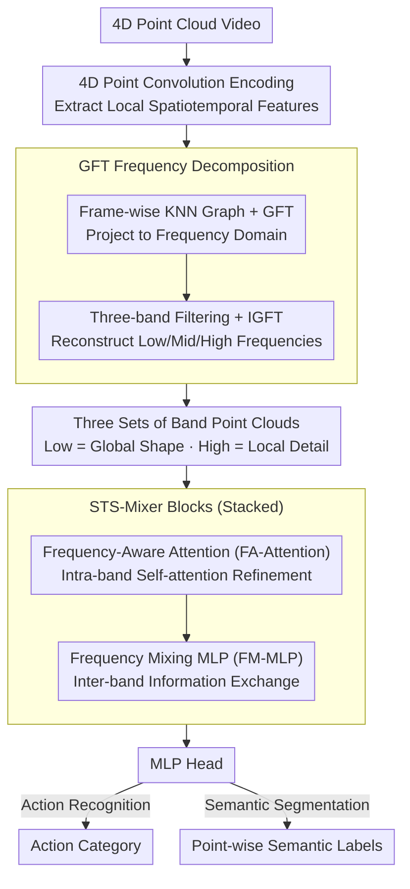

# STS-Mixer: Spatio-Temporal-Spectral Mixer for 4D Point Cloud Video Understanding

**Conference**: CVPR 2026  
**arXiv**: [2604.11637](https://arxiv.org/abs/2604.11637)  
**Code**: [https://github.com/Vegetebird/STS-Mixer](https://github.com/Vegetebird/STS-Mixer)  
**Area**: 3D Vision  
**Keywords**: 4D Point Cloud Video, Graph Fourier Transform, Spectral Representation, Action Recognition, Semantic Segmentation

## TL;DR
STS-Mixer first introduces the Graph Fourier Transform (GFT) into 4D point cloud video understanding, capturing geometric structures across scales through frequency domain decomposition (Low-frequency = global shape, High-frequency = local details). By mixing these with spatio-temporal information, it achieves SOTA performance in action recognition and semantic segmentation.

## Background & Motivation

**Background**: 4D point cloud videos contain 3D spatial and temporal information. Existing methods (P4Transformer, PST-Transformer, etc.) model short-term and long-term dynamics in the spatio-temporal domain.

**Limitations of Prior Work**: Current methods operate exclusively in the spatio-temporal domain, struggling to capture underlying geometric properties such as abstract shapes and local-global context. The irregular and unordered nature of point clouds makes standard frequency domain transforms (e.g., DCT) inapplicable.

**Key Challenge**: Spatio-temporal domains can model motion dynamics but lack explicit modeling of static geometric structures—such as global shapes and local details—which are crucial for understanding 4D scenes.

**Key Insight**: Graph Fourier Transform (GFT) is naturally suited for irregular point clouds. Through the eigendecomposition of the Graph Laplacian, point clouds are transformed into the frequency domain, where different frequency bands capture geometric structures at varying scales.

**Core Idea**: Decompose 4D point clouds into multi-band signals (Low/Mid/High frequency). Each band captures distinct geometric features, which are then mixed with spatio-temporal information for comprehensive representation learning.

## Method

### Overall Architecture
STS-Mixer aims to address the issue that prior 4D point cloud video understanding focused only on the "spatio-temporal" dimensions, neglecting the explicit characterization of geometric shapes—specifically, the global contours versus local details. This approach supplements point clouds with a third dimension: "Spectrum." Upon inputting a point cloud video, a 4D point convolution first encodes local spatio-temporal features for each point. Subsequently, a graph is constructed for each frame, and a Graph Fourier Transform (GFT) projects coordinates into the frequency domain. Frequency band filters slice the signal into low, medium, and high bands, which are transformed back into the spatial domain via an inverse transform, resulting in three sets of point clouds each retaining a specific geometric scale. Finally, these three band-specific point clouds are fed into stacked STS-Mixer blocks. Within each block, FA-Attention performs refinement within each band, followed by FM-MLP to facilitate inter-band communication. An MLP head outputs the action category or point-wise semantic labels. The core mechanism is to "decompose geometry by frequency, process independently, and reintegrate."

### Key Designs

**1. GFT Frequency Decomposition: Distinguishing "Global Shape" and "Local Details" as Distinct Signals**

While spatio-temporal modeling excels at capturing motion, it tends to conflate static geometric structures. Since point clouds are irregular, standard DCT/FFT cannot be applied. GFT is designed for graph structures: for each point cloud frame, a KNN graph is constructed to calculate the normalized Graph Laplacian $L = I - D^{-1/2} A D^{-1/2}$. Eigendecomposition $L = U \Lambda U^\top$ is performed, where eigenvectors ordered by eigenvalues (frequencies) form a basis. Projecting point coordinates $x$ onto this basis yields the GFT coefficients:

$$\hat{x} = U^\top x, \qquad x = U \hat{x}\ \text{(IGFT)}$$

Low eigenvalues correspond to smooth, slowly changing components (global contours), while high eigenvalues correspond to rapidly changing components (edges, local details). Three band-pass filters split $\hat{x}$ into Low/Mid/High segments. Each segment undergoes an Inverse Graph Fourier Transform (IGFT) to return to the spatial domain, producing three reconstructed point clouds. Band rejection experiments verify this: removing low frequencies causes the global structure to collapse, while removing high frequencies preserves the shape but blurs edges—proving that band separation allows the network to process different geometric scales independently.

**2. Frequency-Aware Attention (FA-Attention): Intra-scale Alignment**

The semantics of the three frequency bands are not directly interchangeable—the low-frequency band describes "humanoid shape" while the high-frequency band describes "edges." Conflating them in a single attention mechanism causes interference. FA-Attention performs independent self-attention within each frequency band, allowing points to focus on patterns specific to that scale. This step refines features internally, ensuring clear representation in each path.

**3. Frequency Mixing MLP (FM-MLP): Facilitating Inter-scale Dialogue**

While independent processing prevents interference, it can isolate information—low, mid, and high frequencies ultimately describe the same object. FM-MLP restores connectivity by concatenating features along the frequency dimension and applying an MLP for cross-band information exchange. This allows global positions from low frequencies to localize local details from high frequencies, and high-frequency details to sharpen low-frequency contours. FA-Attention handles "intra-band refinement" while FM-MLP handles "inter-band fusion," forming the core of the STS-Mixer block.

### Loss & Training
Action recognition utilizes Cross-Entropy loss. Semantic segmentation utilizes Cross-Entropy loss combined with Lovász-softmax loss (to optimize mIoU directly).

## Key Experimental Results

### Main Results

| Task/Dataset | Metric | Ours | Prev. SOTA | Gain |
|--------------|--------|-------|------------|------|
| MSR-Action3D | Acc | SOTA | PST-Transformer | Improvement |
| NTU RGB+D 60 | Acc | SOTA | PPTr | Improvement |
| Synthia 4D   | mIoU | SOTA | PST-Transformer | Improvement |

### Ablation Study

| Configuration | Accuracy | Description |
|---------------|----------|-------------|
| Full STS-Mixer | Optimal | Spatio-temporal + Spectral |
| Spatio-temporal only (no GFT) | Decrease | Lack of geometric structure modeling |
| w/o FA-Attention | Decrease | Missing intra-band refinement |
| w/o FM-MLP | Decrease | Missing inter-band interaction |
| Single-band | Decrease | Multi-band decomposition is necessary |

### Key Findings
- Spectral representations and spatio-temporal representations are highly complementary, capturing different aspects of the data.
- Low frequencies contribute most to action recognition (global shape distinguishes categories), whereas high frequencies are more critical for fine-grained segmentation.
- Three-band decomposition outperforms two-band decomposition, though returns diminish as the number of bands increases further.

## Highlights & Insights
- **First Frequency View for 4D Point Clouds**: GFT introduces a new informational dimension to point cloud understanding, analogous to frequency domain processing in RGB images.
- **Intuitive Validation via Band Rejection**: Visually demonstrates the informational meaning of each band by observing reconstruction effects after removing specific frequencies.

## Limitations & Future Work
- GFT computation (eigendecomposition) may become a bottleneck for large-scale point clouds.
- The number of bands and filter parameters require manual tuning.
- Future work could explore adaptive band decomposition and more efficient spectral methods.

## Related Work & Insights
- **vs P4Transformer/PST-Transformer**: These focus on pure spatio-temporal modeling and ignore frequency-domain geometric information.
- **vs PointGST/PointWavelet**: These are frequency methods for static point clouds and have not been extended to 4D videos.

## Rating
- Novelty: ⭐⭐⭐⭐⭐ First to introduce GFT to 4D point cloud understanding; unique perspective.
- Experimental Thoroughness: ⭐⭐⭐⭐ Validated across action recognition and semantic segmentation on multiple datasets.
- Writing Quality: ⭐⭐⭐⭐ Spectral analysis is clear and intuitive.
- Value: ⭐⭐⭐⭐ Opens a new dimension for 4D scene understanding.

<!-- RELATED:START -->

## Related Papers

- [\[CVPR 2026\] MORE-STEM: Long-Short MemOry REcall and Spatio-TEmporal Consistency Model for Query-Driven 3D/4D Point Cloud Segmentation](more-stem_long-short_memory_recall_and_spatio-temporal_consistency_model_for_que.md)
- [\[CVPR 2026\] ST4R-Splat: Spatio-Temporal Referring Segmentation in 4D Gaussian Splatting](st4r-splat_spatio-temporal_referring_segmentation_in_4d_gaussian_splatting.md)
- [\[ICCV 2025\] UST-SSM: Unified Spatio-Temporal State Space Models for Point Cloud Video Modeling](../../ICCV2025/3d_vision/ust-ssm_unified_spatio-temporal_state_space_models_for_point_cloud_video_modelin.md)
- [\[CVPR 2026\] Deformation-based In-Context Learning for Point Cloud Understanding](deformation-based_in-context_learning_for_point_cloud_understanding.md)
- [\[CVPR 2026\] Vista4D: Video Reshooting with 4D Point Clouds](vista4d_video_reshooting_with_4d_point_clouds.md)

<!-- RELATED:END -->
