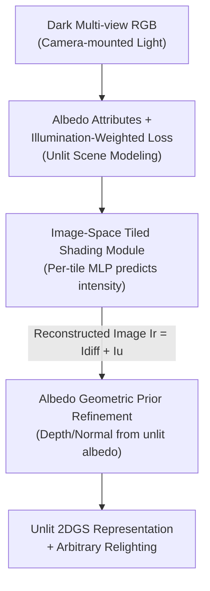

# SunFaded: Illumination-Aware Gaussian Splatting for Dark Scenes with Camera-Mounted Active Lighting

**Conference**: CVPR 2026  
**Paper**: [CVF Open Access](https://openaccess.thecvf.com/content/CVPR2026/html/Chang_SunFaded_Illumination-Aware_Gaussian_Splatting_for_Dark_Scenes_with_Camera_Mounted_Active_CVPR_2026_paper.html)  
**Code**: TBD  
**Area**: 3D Vision  
**Keywords**: Gaussian Splatting, Dark Scene Reconstruction, Active Lighting, Illumination Decoupling, 2DGS

## TL;DR
Addressing dark scenes with "camera-mounted moving light sources," this paper utilizes 2DGS and albedo attributes to decouple illumination from intrinsic appearance. Through a three-stage training process—incorporating "illumination-weighted loss → image-space tiled shading → albedo-guided geometric prior refinement"—it outperforms methods like DarkGS across PSNR/SSIM/LPIPS while achieving faster training and rendering.

## Background & Motivation

**Background**: Gaussian Splatting (3DGS / 2DGS) has become a mainstream representation for neural radiance fields due to its real-time rendering and high quality. When handling "in-the-wild" appearance variations (e.g., varying times of day, weather, ISP settings), typical approaches involve assigning additional appearance features to each Gaussian or learning view-dependent color transforms (e.g., GS-W, WildGaussians, VastGaussian).

**Limitations of Prior Work**: In dark scenes, robots or handheld devices must rely on camera flashes or "camera-mounted light sources" to capture usable images. In these cases, lighting changes drastically and is highly localized according to the viewpoint—the same physical point appears entirely different in color across views due to lighting rather than material. The "global tone change" assumption used for in-the-wild data fails completely. Per-Gaussian appearance adjustments are not robust against strong local highlights and projected shadows, leading to floaters, color distortion, and geometric collapse.

**Key Challenge**: These methods **implicitly entangle** illumination with intrinsic appearance and do not enforce lighting consistency across multiple views. The only method to explicitly model dark scene lighting, DarkGS, requires **pre-calibrated light sources**, necessitating re-calibration for every hardware change and limiting practicality.

**Goal**: To reconstruct a **light-independent unlit scene representation** from dark images captured with camera-mounted lighting, enabling high-quality rendering under arbitrary illumination without requiring light calibration.

**Key Insight**: Borrowing from Retinex theory, the authors view an image as the product of "illumination × albedo." They assume illumination varies smoothly in space (low frequency in the log domain), while material edges and textures are high frequency. Thus, a smooth illumination prior can be estimated from a single image to "suppress bright regions" and guide unlit reconstruction.

**Core Idea**: Replace Spherical Harmonic (SH) coefficients in 2DGS with **view-independent albedo attributes**. An independent "imaging/lighting module" explicitly models the camera-mounted light. By applying lighting to the **rendered image (image-space tiled shading)** instead of individual Gaussians, the method decouples illumination from appearance while significantly reducing computational costs.

## Method

### Overall Architecture
The input consists of multi-view RGB images $\{I_m\}_{m=1}^M$ captured in dark environments with camera-mounted lighting. The goal is to learn a set of 2D Gaussian surfels $\{G_i\}$, where each Gaussian is parameterized by a mean $\mu_i$, covariance $\Sigma_i$, opacity $\alpha_i$, and **albedo attribute $a$** (replacing SH color). Since jointly optimizing geometry, appearance, and lighting under active illumination is highly ill-posed, the authors employ a **three-stage training** strategy: first, recover the unlit scene and initial geometry under illumination-weighted constraints (Stage 1); second, use an image-space lighting module to apply illumination back to the rendered image to explicitly separate lighting from appearance (Stage 2); finally, refine Gaussian geometry using geometric priors derived from the unlit albedo maps (Stage 3).

### Key Designs

**1. Albedo Attributes + Illumination-Weighted Photometric Loss: Suppressing highlights to reveal the unlit scene**

The challenge is that local highlights from the moving light source cause standard photometric losses to make Gaussians "fit the light" instead of the material. The authors replace SH color with albedo $a$. Alpha-blending yields an albedo map $A_m$, and the unlit image is modeled as $I_m^u = E \odot A_m$ (where $E\in\mathbb{R}^3$ is a learnable global ambient light). Key to this is the loss: inspired by Retinex, they estimate a smooth illumination prior $L_m = K_\sigma(\log(I_m+\varepsilon))$ using a large-kernel Gaussian filter $K_\sigma$ in the log domain. This is converted into per-pixel weights $W_m = \exp(-\beta\cdot \mathrm{Norm}(L_m))$, where $\beta>0$ controls the suppression of bright areas. The final loss is $\mathcal{L}_{\text{unlit}} = \frac{1}{M}\sum_m \lVert W_m \odot (I_m^u - I_m)\rVert_1$. Pixels in highlight zones receive lower weights, preventing them from dominating the optimization and pushing the representation toward the "underlying unlit appearance." Ablations show $\beta=10$ is optimal.

**2. Image-Space Tiled Shading Module: Shading rendered images rather than individual Gaussians**

Previous methods adjusted appearance per Gaussian, which is expensive and prone to overfitting view embeddings. This paper performs shading on the rendered albedo map $A$, depth map $D$, and normal map $N$. A learnable virtual light position $l\in\mathbb{R}^3$ and an MLP $M_{\text{light}}$ are introduced. The image is divided into $16\times16$ pixel tiles. For the center pixel $(u,v)$ of each tile, the 3D position $p = K^{-1}[u,v,1]^T \cdot D(u,v)$ is back-projected. The direction $\omega = (p-l)/d$ and distance $d=\lVert p-l\rVert$ relative to the virtual light are fed into the MLP to predict the RGB light intensity $i = M_{\text{light}}(\gamma([\theta,\phi]),\gamma(d))$. Shading within the tile follows a simplified diffuse model $I_{\text{diff}}(x) = (A(x)\odot i)\max(0,\hat{n}(x)\cdot \hat{l})$. This image-space prediction avoids per-view overfitting. Ablations show $16\times16$ is the best balance between quality and speed (193 FPS).

**3. Albedo Geometric Prior Refinement: Refining geometry using "Unlit Albedo Maps"**

Monocular depth priors (e.g., from Depth-Pro) estimated directly from **illuminated dark images** suffer from artifacts due to lighting changes. The authors instead predict depth $D_{\text{albedo}}$ and normals $N_{\text{albedo}}$ from the **decoupled, illumination-invariant albedo maps** in the third stage. These serve as more reliable pseudo-labels for geometric refinement. To avoid destroying optimized components, they first freeze all Gaussian attributes except opacity (performing opacity-based pruning), then jointly optimize all parameters except $M_{\text{light}}$ and light position $l$. This feedback loop from "lighting-invariant appearance" to "geometric supervision" significantly improves geometric accuracy.

### Loss & Training
Total training consists of 40K iterations on a single A6000 (~20 mins per scene). Stages: First 10K iterations for the unlit scene (Stage 1, $\mathcal{L}_{\text{unlit}}$ + geometric priors); 10K–20K iterations update only light position $l$ and $M_{\text{light}}$ (Stage 2, $\mathcal{L}_r$); 20K–30K iterations for joint optimization; final stage for Gaussian opacity refinement (Stage 3).

## Key Experimental Results

### Main Results
On the DarkRobotic dataset (FLIR camera + light mounted on a quadruped robot), average over 4 scenes:

| Dataset | Metric | Ours | Prev. SOTA (GS-W) | DarkGS |
|--------|------|------|----------|--------|
| DarkRobotic Avg | PSNR↑ | **41.02** | 35.62 | 35.50 |
| DarkRobotic Avg | SSIM↑ | **0.9739** | 0.9525 | 0.9131 |
| DarkRobotic Avg | LPIPS↓ | **0.0286** | 0.1577 | 0.0778 |

On the self-collected DarkPhone dataset (iPhone 15 + flash), DarkGS **failed to reconstruct** due to its dependence on pre-calibrated light parameters. Ours leads across all scenes (e.g., Corner: 39.39 PSNR vs GS-W's 35.68).

Efficiency (DarkRobotic):

| Method | Training Time | Rendering FPS |
|------|---------|----------|
| GS-W | ~287min | 51 |
| WildGaussians | ~473min | 106 |
| DarkGS | ~25min | 145 |
| **Ours** | **~22min** | **193** |

### Ablation Study
| Configuration | Key Metrics | Note |
|------|---------|------|
| Ours (full) | PSNR 41.02 / SSIM 0.9739 | Full model |
| Ours* (No geometric prior) | PSNR 40.92 / SSIM 0.9711 | Removing Stage 3 prior still outperforms rivals |
| $\beta=1$ | PSNR 40.26 | Insufficient highlight suppression |
| $\beta=10$ | PSNR 41.02 | Optimal default |
| $\beta=50$ | PSNR 37.03 | Excessive suppression, loses texture |
| Tile $4\times4$ | PSNR 41.25 / 95 FPS | Slight quality gain, halved speed |
| Tile $16\times16$ | PSNR 41.02 / 193 FPS | Recommended balance |

### Key Findings
- The weight $\beta$ in the illumination loss is critical: too small fails to suppress highlights, too large erases useful textures; $\beta=10$ is most stable.
- Image-space shading significantly reduces computational overhead. $16\times16$ tiles are the "sweet spot" for speed and quality.
- Even without geometric priors (Ours*), the method outperforms DarkGS/GS-W, showing that "illumination decoupling + image-space shading" is the primary source of gain.

## Highlights & Insights
- **Shifting Shading from "Per-Gaussian" to "Per-Image Tile"**: This is a clever design—it fits the 3DGS rasterization pipeline without breaking it, avoids overfitting view-dependent embeddings, and saves computation.
- **Using Decoupled Albedo for Geometric Supervision**: Since raw dark images give unreliable depth priors, the authors extract the "clean" light-invariant appearance first. This "appearance-aids-geometry" loop is a transferable insight for other degraded-input reconstruction tasks.
- **No Light Calibration Required**: Unlike DarkGS, this method fits a virtual light position and MLP end-to-end, making it far more practical for handheld or robotic capture.

## Limitations & Future Work
- The lighting model is intentionally simplified: it does **not explicitly model projected shadows** and treats specular highlights only roughly.
- Illumination decoupling is inherently ill-posed; the recovered components (light position, ambient term, intensity) are not physically precise but rather serves for contrastive reconstruction.
- Future directions: Integrating differentiable shadow modeling, more complex BRDFs, and validating stability in large-scale outdoor night scenes or multi-source environments.

## Related Work & Insights
- **vs DarkGS**: Both target dark scenes with moving lights. DarkGS requires pre-calibration and links color to Gaussian-light spatial relations; Ours is calibration-free and uses image-space shading, achieving superior metrics.
- **vs GS-W / WildGaussians**: These model global appearance drift. Faced with strong local highlights, they overfit illumination into the geometry; Ours explicitly separates them using albedo.
- **vs Flash-Splat**: Requires paired flash/no-flash images; Ours only needs a single active lighting sequence.

## Rating
- Novelty: ⭐⭐⭐⭐ Moving shading to image-space tiles and using albedo for geometric priors is a practical and effective combination of 2DGS and Retinex ideas.
- Experimental Thoroughness: ⭐⭐⭐⭐ Solid results on two datasets, efficiency benchmarks, and three sets of ablations; however, limited to smaller indoor scenes.
- Writing Quality: ⭐⭐⭐⭐ Clear three-stage motivation and well-illustrated diagrams.
- Value: ⭐⭐⭐⭐ High practical value for nighttime robotics and handheld reconstruction due to being calibration-free and fast.

<!-- RELATED:START -->

- **DarkGS**: Learning to Reconstruct 3D Scenes from Dark Multi-view Images (CVPR 2025)
- **2DGS**: 2D Gaussian Splatting for Geometrically Accurate Radiance Fields (SIGGRAPH 2024)
- **GS-W**: Gaussian Splatting in the Wild (ArXiv 2024)

<!-- RELATED:END -->

## Related Papers

- [\[CVPR 2026\] LuxRemix: Lighting Decomposition and Remixing for Indoor Scenes](luxremix_lighting_decomposition_and_remixing_for_indoor_scenes.md)
- [\[CVPR 2026\] IR-HGP: Physically-Aware Gaussian Inverse Rendering for High-Illumination Scenes via Generative Priors](ir-hgp_physically-aware_gaussian_inverse_rendering_for_high-illumination_scenes_.md)
- [\[CVPR 2026\] FastEventDGS: Deformable Gaussian Splatting for Fast Dynamic Scenes from a Single Event Camera](fasteventdgs_deformable_gaussian_splatting_for_fast_dynamic_scenes_from_a_single.md)
- [\[CVPR 2026\] 4C4D: 4 Camera 4D Gaussian Splatting](4c4d_4_camera_4d_gaussian_splatting.md)
- [\[CVPR 2026\] VAD-GS: Visibility-Aware Densification for 3D Gaussian Splatting in Dynamic Urban Scenes](vad-gs_visibility-aware_densification_for_3d_gaussian_splatting_in_dynamic_urban.md)

<!-- RELATED:END -->
