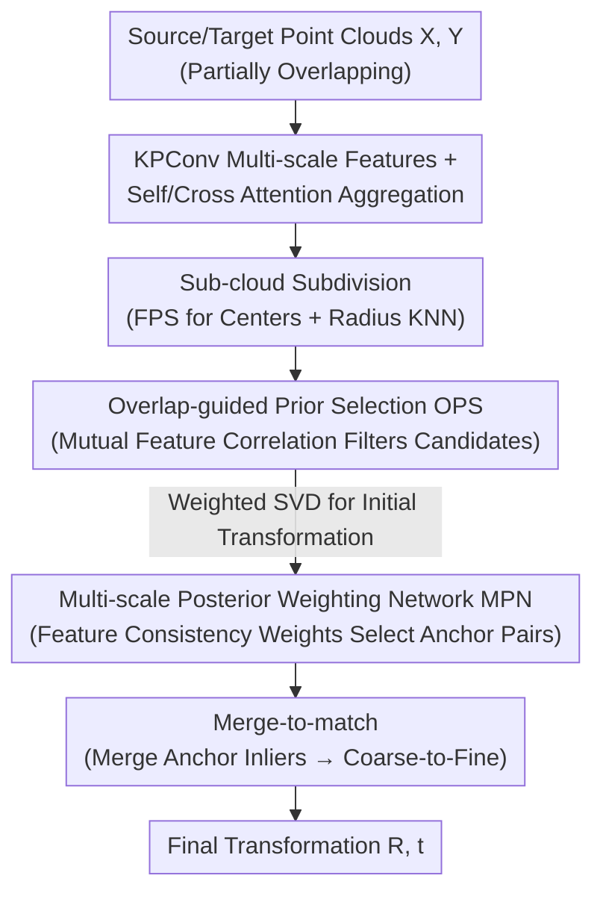

# SuP: Sub-cloud Driven Point Cloud Registration

**Conference**: CVPR 2026  
**Paper**: [CVF Open Access](https://openaccess.thecvf.com/content/CVPR2026/html/Fung_SuP_Sub-cloud_Driven_Point_Cloud_Registration_CVPR_2026_paper.html)  
**Code**: https://github.com/SheldonFung98/SuP  
**Area**: 3D Vision  
**Keywords**: Point cloud registration, low overlap, sub-cloud anchor pair mining, feature consistency, plug-and-play

## TL;DR
To address the persistent challenge in low-overlap point cloud registration—where geometric and semantic similarities in non-overlapping regions lead to mismatches—SuP reformulates the problem as "mining high-overlap anchor pairs within sub-clouds." By employing a dual-phase mining process (prior weighting for candidate screening + posterior network for consistency verification) followed by merged matching, it establishes new SOTA results on Color3DMatch/3DLoMatch and can serve as a plug-and-play module to enhance existing methods.

## Background & Motivation

**Background**: Point cloud registration achieves high precision when two scans share substantial common geometry (high overlap). Early pioneering work explicitly predicted point-wise overlap weights to locate overlapping regions (e.g., Predator). Recent mainstream approaches (GeoTransformer, PEAL, ColorPCR, etc.) have shifted away from explicit overlap prediction, opting instead for powerful attention layers to **implicitly strengthen global features** by injecting geometric encoding, semantic features, or color information to learn transformation-invariant features.

**Limitations of Prior Work**: When the overlap ratio drops significantly (e.g., below 30%, or as low as 0.1%–0.3% in C3DLoMatch), these methods suffer from performance degradation. The fundamental reason is that even with well-extracted features in overlapping areas, **geometric or semantic similarities persist between non-overlapping regions**—one wall may look identical to another, or one corner to another. These similarities cause models to establish numerous "deceptively reasonable" outlier correspondences in non-overlapping areas, drowning out true inlier correspondences and leading to registration failure (as shown in Fig. 1 of the paper: ColorPCR/GeoTr. exhibit high RRE of 41.3° and RTE in the 1-meter range under low overlap).

**Key Challenge**: Performing dense global correspondence estimation directly on whole low-overlap point cloud pairs necessitates simultaneously "identifying rare true inliers" and "resisting massive pseudo-similar outliers." These two tasks are inherently entangled and difficult to resolve together.

**Goal**: Rather than directly tackling low-overlap point cloud pairs, the objective is to "reconstruct" them into high-overlap pairs for matching.

**Key Insight**: The authors observe that if source and target point clouds are subdivided into smaller **sub-clouds** and paired together, there will consistently exist a small subset of **locally high-overlap sub-cloud pairs** (referred to as anchor pairs). The difficulty lies in efficiently and robustly mining these high-overlap anchor pairs hidden among all possible sub-cloud combinations.

**Core Idea**: Reformulate low-overlap registration as a **"high-overlap sub-cloud anchor pair mining" problem**—first identify truly overlapping sub-cloud pairs locally and perform matching only within these regions to bypass ambiguities in non-overlapping areas.

## Method

### Overall Architecture
Given source point cloud $X\in\mathbb{R}^{m\times3}$ and target point cloud $Y\in\mathbb{R}^{n\times3}$ (partially overlapping), the goal is to estimate the rigid transformation $T = \{R,t\}$. The pipeline begins with a KPConv-style backbone for multi-scale downsampling and local geometric feature extraction, followed by attention layers (self-attention for global aggregation + cross-attention for cross-cloud conditioning) to enhance point-level features. The core is the **Dual-phase Sub-cloud Anchor Mining (DSAM)** module, which subdivides each cloud into sub-clouds, uses "Overlap-guided Prior Selection (OPS)" to select high-overlap candidates and estimate initial transformations, and then employs a "Multi-scale Posterior Weighting Network (MPN)" to select anchor pairs based on feature consistency. Finally, a merge-to-match strategy combines coarse inlier correspondences from anchor pairs to generate final correspondences across scales and estimate the transformation.

### Key Designs

**1. Sub-cloud Subdivision + Overlap-guided Prior Selection (OPS): Efficiently filtering "potentially overlapping" sub-cloud pairs**

Explicitly calculating all sub-cloud pairs is computationally expensive. The authors first use Farthest Point Sampling (FPS) on the coarsest point layer $\hat{X}_4$ to select $k$ distributed centers, and then cluster each center into a sub-cloud $\hat{S}^x_i$ using radius-constrained KNN. The same is done for the target cloud. Combining $k$ sub-clouds from each side yields $k^2$ candidate pairs. For each pair, a Gaussian correlation matrix $s_{ij}=\exp(-\lVert \mathrm{norm}(F^c_{xi})-\mathrm{norm}(F^c_{yj})\rVert_2^2)$ is computed using conditioned features. The prior weight $w^o_{lm}=\frac{1}{|M|}\sum_{s\in M}s$ is derived from the "bi-directional top-k mutual correlation" set $M$. The underlying assumption is that two truly overlapping points tend to have strong mutual feature correlations. Finally, the top-$\bar{k}$ initial candidates $C_p$ are selected. This step relies solely on feature correlation and does not require training, efficiently eliminating many non-overlapping sub-cloud pairs. For each candidate, a weighted SVD is performed using the correlation matrix $S$ (with dual normalization for noise suppression) to estimate a preliminary transformation for subsequent verification. In experiments, $k=6$ sub-clouds and $\bar{k}=24$ candidates are used.

**2. Multi-scale Posterior Weighting Network (MPN) + Feature Consistency Weight: Robustly verifying true anchor pairs via "post-alignment consistency"**

OPS provides only prior screening and may include false positives. The authors' key observation is that **truly aligned sub-cloud pairs exhibit high feature similarity at their overlapping points (points near each other after alignment), whereas misaligned pairs do not**. MPN learns this "post-alignment feature consistency." Given the initial transformation $\hat{T}_k$ of the $k$-th candidate, an aligned overlapping point set $\hat{O}^3_k=\{(\hat{x}^3_i,\hat{y}^3_j): \lVert \hat{x}^3_i-\hat{T}_k(\hat{y}^3_j)\rVert_2<\hat{\tau}\}$ is first extracted at the coarse layer, and then mapped to a denser scale $\hat{O}^2_k$ via cross-scale 1-NN (ensuring efficient correspondence across scales). Affinity features $Z=[F^{O2}_x,F^{O3}_x]\odot[F^{O2}_y,F^{O3}_y]$ (Hadamard product) are computed and processed through a lightweight multi-head self-attention module with residuals to obtain contextualized affinity $\hat{Z}$. This is then projected via MLP + GELU + global max pooling to generate a consistency descriptor $\hat{F}_d$, resulting in a final feature consistency weight $w^c_k=\mathrm{Softmax}(\mathrm{MLP}(\hat{F}_d))$. Anchor pairs are selected based on top-k weights exceeding a threshold. This step couples "geometric alignment" and "feature consistency," making it far more robust than feature similarity alone.

**3. Alignment-aware Weighted Loss (AWL): Using "real-time alignment error" to supervise consistency weights**

Since MPN is learnable, it requires supervision. Rather than using "overlap" as a binary label, the authors utilize **real-time calculated alignment RMSE**. Using ground-truth transformations, posterior weights $w^c$ are categorized into positive and negative groups: the positive group $\epsilon_p$ consists of anchor pairs with RMSE $E_{\text{rmse}}<\tau_e$, and the negative group $\epsilon_n$ contains the rest. The loss is defined as $\mathcal{L}_a = -\frac{1}{|\epsilon_p|}\sum_{p\in\epsilon_p}\lambda_a\log w^c_p - \frac{1}{|\epsilon_n|}\sum_{n\in\epsilon_n}\lambda_a\log(1-w^c_n)$, where the alignment-aware weight $\lambda_a = 1-E_{\text{rmse}}$ (when $\tau_e<E_{\text{rmse}}<\tau_e+\delta$) and 1 otherwise. The intuition is that the boundary zone $\delta$ allows alignments that exceed the threshold but are "nearly correct" to still receive relatively high consistency weights $w^c$, preventing the model from over-penalizing good candidates that are slightly off. The total loss is $\mathcal{L}=\mathcal{L}_{oc}+\alpha\mathcal{L}_p+\beta\mathcal{L}_a$ ($\mathcal{L}_{oc}$ overlap-aware circle loss, $\mathcal{L}_p$ point matching loss).

### Mechanism Walkthrough
Consider a 3DLoMatch sample with only ~14.5% overlap: ColorPCR establishes many outlier correspondences in non-overlapping regions (similar walls/corners), resulting in an inlier ratio of only 9.0% and a high RMSE of 0.499m, leading to failure. SuP first divides the source and target into 6 sub-clouds each, creating 36 pairs; OPS uses mutual feature correlation to prune non-overlapping pairs to 24 candidates and estimates initial transformations; MPN verifies the feature consistency of each aligned candidate, selecting the top-8 anchor pairs (which correspond to truly overlapping local regions); merge-to-match then combines the inliers from these anchor pairs and refines them from coarse to fine. The final inlier ratio rises to 51.2% and RMSE drops to 0.069m, achieving clean alignment. The key is that mismatched outliers are excluded through "sub-cloud isolation + alignment consistency verification."

### Loss & Training
Implemented in PyTorch and trained end-to-end using vanilla SGD. Each cloud is divided into $k=6$ sub-clouds, and OPS selects $\bar{k}=24$ candidates. MPN uses an overlap threshold $\hat{\tau}=0.04$ and selects the top-8 anchor pairs. The learning rate is $1\times10^{-4}$ with a 0.95 exponential decay per epoch and $1\times10^{-6}$ weight decay. Training was conducted on 8 RTX 4070 Ti GPUs using DataParallel with an effective batch size of 8 for 40 epochs (approximately 10 hours).

## Key Experimental Results

### Main Results
Evaluation was performed on Color3DMatch (C3DM, overlap >30%) and Color3DLoMatch (C3DLM, harder low-overlap cases with 0.1%–0.3% overlap). Using RANSAC estimation and 5000 sample points, the comparison with SOTA is (higher is better):

| Metric | Dataset | Ours (SuP) | Prev. SOTA (ColorPCR) | Gain |
|------|--------|------|----------|------|
| Registration Recall | C3DM | **98.1** | 96.7 | +1.4 |
| Registration Recall | C3DLM | **90.4** | 88.9 | +1.5 |
| Inlier Ratio | C3DM | **91.1** | 87.8 | +3.3 |
| Inlier Ratio | C3DLM | **76.0** | 68.0 | +8.0 |
| Feature Matching Recall | C3DM | **99.7** | 99.5 | +0.2 |

The largest improvement occurs in the Inlier Ratio for low-overlap cases (C3DLM, +8.0), confirming that SuP effectively addresses low-overlap weaknesses. Under RANSAC-free Local Group Registration (LGR), SuP also leads: C3DM RR 97.8%, C3DLM RR 90.2%. Geometric accuracy is also superior—under LGR, RRE/RTE for C3DM is 1.374°/0.046m and for C3DLM is 2.493°/0.074m, consistently outperforming ColorPCR (1.492°/0.048m and 2.581°/0.075m).

### Plug-and-Play & Ablation Study
When integrated as a back-end plugin for existing methods (using LGR estimation), SuP provides universal gains:

| Configuration | C3DM RR | C3DLM RR | Note |
|------|---------|----------|------|
| GeoTr. | 91.5 | 74.0 | Original |
| SuP + GeoTr. | 92.8 | 76.7 | +1.3 / +2.7 |
| PEAL | 94.3 | 81.2 | Original |
| SuP + PEAL | 95.6 | 83.4 | +1.3 / +2.2 |
| ColorPCR | 96.5 | 88.3 | Original |
| SuP + ColorPCR | 97.8 | 90.2 | +1.3 / +1.9 |

Step-by-step ablation study (RR%, starting from a baseline without the proposed modules):

| Configuration | C3DM RR | C3DLM RR | Note |
|------|---------|----------|------|
| baseline | 96.5 | 88.3 | No proposed modules |
| +OPS | 96.6 | 88.6 | Overlap-driven, minor gain |
| +OPS+FCW | 97.0 | 89.1 | Added consistency weight |
| +OPS+FCW+MPN | 97.5 | 89.7 | Multi-scale, significant low-overlap gain |
| Full (+AWL) | **97.8** | **90.2** | Final gain with alignment-aware loss |

### Key Findings
- **MPN (Multi-scale Posterior Network) is critical**: It provides the most significant robustness boost in low-overlap (C3DLM) scenarios, as "post-alignment consistency" effectively blocks false candidates.
- **Low-overlap gains significantly exceed high-overlap gains**: The inlier ratio improvement in C3DLM (+8.0) vs. C3DM (+3.3) validates that the "sub-cloud anchor pair" strategy is tailored for low-overlap scenarios.
- **Sub-cloud subdivision threshold $\tau$ has a sweet spot**: When $\tau$ is too small (0.15), sub-clouds are too fine to contain enough overlap, causing recall to drop. When too large, local details are lost. $\tau=0.35$ provides the optimal balance.

## Highlights & Insights
- **Problem Reformulation**: The most significant highlight is shifting from "hunting" for rare correspondences in low-overlap clouds to "mining high-overlap anchor pairs in sub-clouds." This inherently bypasses non-overlapping ambiguities and can be generalized to other outlier-heavy matching tasks.
- **Alignment-aware Consistency**: Using "feature consistency after alignment" is clever. While prior feature similarity can be fooled by geometric repetition (walls looking like walls), the condition that "overlapping points remain consistent after alignment" is almost exclusively met by true anchor pairs.
- **Plug-and-Play Utility**: SuP can be appended to the output of GeoTr., PEAL, or ColorPCR without modifying the original backbone, offering stable performance gains and high engineering value.

## Limitations & Future Work
- The authors acknowledge that in cases of extreme cross-modal differences (different sensors, severe appearance distortion), extracted features may exhibit minor inconsistencies, potentially affecting OPS selection or MPN weighting. Lightweight feature normalization or domain adaptation is suggested as a remedy.
- Methodological overhead: SuP introduces several hyperparameters ($k$, $\bar{k}$, $\hat{\tau}$, $\tau_e$, $\delta$) and the $O(k^2)$ sub-cloud pair enumeration plus initial transformation estimation adds computational complexity. A direct comparison of runtime/memory efficiency against SOTA was not provided.
- Evaluation is limited to indoor Color3DMatch/3DLoMatch; generalization to large-scale outdoor scenes or sparse LiDAR scans remains unverified.

## Related Work & Insights
- **vs. Predator (Explicit Overlap Prediction)**: Predator predicts point-wise overlap weights, which relies heavily on initial feature consistency and fails under low overlap. SuP mines anchor pairs at the sub-cloud level and uses alignment verification, ensuring better robustness.
- **vs. GeoTransformer / PEAL (Implicit Feature Enhancement)**: These rely on geometric encoding or attention but are still susceptible to mismatches in repeating non-overlapping regions. SuP isolates overlapping local regions in space, bypassing ambiguity.
- **vs. ColorPCR (Color-enhanced Features)**: ColorPCR uses color information to improve feature discriminability but still struggles with low overlap. SuP builds on the ColorPCR backbone, pushing C3DLM RR from 88.3% to 90.2%.

## Rating
- Novelty: ⭐⭐⭐⭐⭐ The reformulation of registration as sub-cloud anchor mining is powerful.
- Experimental Thoroughness: ⭐⭐⭐⭐ Good coverage of benchmarks, estimation methods, and plugin experiments, though missing runtime/memory analysis and outdoor datasets.
- Writing Quality: ⭐⭐⭐⭐ Clear motivation, complete formulas, and intuitive figures.
- Value: ⭐⭐⭐⭐⭐ High value due to SOTA performance and plug-and-play capability for low-overlap challenges.

<!-- RELATED:START -->

## Related Papers

- [\[CVPR 2026\] MHopReg: Efficient Hierarchical Multi-Hop Graph Search for Point Cloud Registration](mhopreg_efficient_hierarchical_multi-hop_graph_search_for_point_cloud_registrati.md)
- [\[CVPR 2026\] Generalized-CVO: Fast and Correspondence-Free Local Point Cloud Registration with Second Order Riemannian Optimization](generalized-cvo_fast_and_correspondence-free_local_point_cloud_registration_with.md)
- [\[CVPR 2026\] C-GenReg: Training-Free 3D Point Cloud Registration by Multi-View-Consistent Geometry-to-Image Generation with Probabilistic Modalities Fusion](c-genreg_training-free_3d_point_cloud_registration_by_multi-view-consistent_geom.md)
- [\[CVPR 2026\] Hg-I2P: Bridging Modalities for Generalizable Image-to-Point-Cloud Registration via Heterogeneous Graphs](hg-i2p_bridging_modalities_for_generalizable_image-to-point-cloud_registration_v.md)
- [\[ICLR 2026\] RayI2P: Learning Rays for Image-to-Point Cloud Registration](../../ICLR2026/3d_vision/rayi2p_learning_rays_for_image-to-point_cloud_registration.md)

<!-- RELATED:END -->
