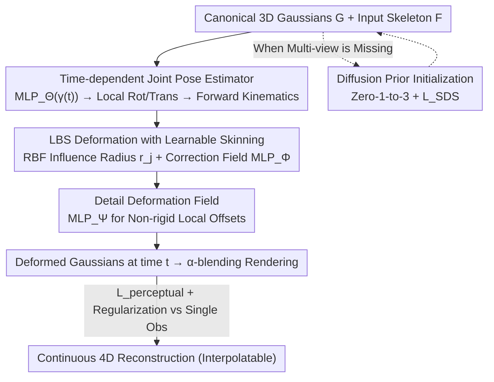

# SV-GS: Sparse View 4D Reconstruction with Skeleton-Driven Gaussian Splatting

**Conference**: CVPR 2026  
**Paper**: [CVF Open Access](https://openaccess.thecvf.com/content/CVPR2026/html/Chao_SV-GS_Sparse_View_4D_Reconstruction_with_Skeleton-Driven_Gaussian_Splatting_CVPR_2026_paper.html)  
**Code**: To be confirmed  
**Area**: 3D Vision  
**Keywords**: 4D Reconstruction, Gaussian Splatting, Skeleton-Driven Deformation, Sparse View, Linear Blend Skinning

## TL;DR
SV-GS reconstructs continuous 4D motion of articulated objects under extreme sparse settings—with only one arbitrary view per timestamp (approx. 20× fewer than typical dense video)—driven by "input skeleton + first-frame static reconstruction." By restricting time-variance exclusively to joint poses for smooth interpolation, it achieves PSNR gains of up to 34% over SOTA on synthetic data.

## Background & Motivation

**Background**: Mainstream dynamic object reconstruction relies on NeRF or 3DGS paired with a time-dependent deformation field (e.g., D-NeRF, 4DGS, SC-GS, RigGS). These usually assume dense spatio-temporal coverage, meaning multi-view videos at every timestamp provide sufficient motion cues and cross-frame correspondences.

**Limitations of Prior Work**: Such dense observations are often unavailable in practice. Surveillance cameras sample moving targets sparsely in time, and multiple camera views may vary significantly. Large movements or self-occlusions between observations cause drastic changes in cross-frame appearance, making temporal correspondences nearly impossible to establish. This transforms reconstruction into a highly ill-posed problem. The authors demonstrate that directly applying 4DGS, SK-GS, or RigGS in these sparse settings—even with identical initialization—results in divergent deformations, collapsed structures, and blurry rendering.

**Key Challenge**: Under sparse supervision, unconstrained deformation fields have too many degrees of freedom. Without enough images to constrain them, a model cannot simultaneously "fit observed frames" and "maintain structural integrity at unobserved timestamps/views."

**Goal**: Reconstruct continuous motion of articulated objects from sparse temporal observations (one arbitrary view per timestamp) and support smooth interpolation for unobserved intermediate frames.

**Key Insight**: Introduce additional structural priors—a coarse skeleton (3D node positions and hierarchy) and a first-frame static 3D reconstruction—to constrain deformation within a kinematic structure, significantly compressing the solution space. However, this input does not constitute a complete rigged model: the skeleton may be noisy, and joint poses, skinning weights, and point-to-bone assignments are unknown and must be learned during optimization.

**Core Idea**: Learn a "skeleton-driven deformation field" decoupled into two layers: "time-dependent coarse joint poses" and "time-independent fine deformations (skinning + details)." By making **only the joint pose estimator dependent on time**, the model can smoothly interpolate unobserved timestamps while preserving learned local geometric details.

## Method

### Overall Architecture
The inputs to SV-GS are: a canonical static 3D Gaussian set $\mathcal{G}$ from the first frame, a noisy input skeleton graph $\mathcal{F}$ ($J$ joint positions + connectivity), and a set of posed RGB images $\mathcal{I}=\{I_t\}$ from sparse timestamps and arbitrary views. The output is a continuous 4D reconstruction capable of rendering at any time and viewpoint.

The pipeline is as follows: For each timestamp $t$, an MLP predicts local joint poses (rotation + root translation), which propagate to global transformations via forward kinematics (FK). Then, "Learnable Linear Blend Skinning (LBS)" transforms canonical Gaussians to the current pose based on skinning weights. Next, a detail deformation field compensates for non-rigid movements not explained by the skeleton. Finally, the deformed Gaussians are rendered and compared against the single observation using a perceptual loss. During training, static Gaussians $\mathcal{G}$ remain frozen; only deformation parameters are optimized, alongside motion and detail regularizations to suppress noise from single-view supervision.

### Key Designs

**1. Time-dependent Joint Pose Estimator: Minimizing Time-variance for Interpolatability**

This is the core trade-off SV-GS makes for sparse temporal data. The pain point is that unconstrained dense deformation fields flicker or jump at unobserved timestamps when supervised sparsely. The authors' solution: **only the joint pose layer explicitly depends on time**. Specifically, an MLP takes position-encoded time as input to predict local rotation quaternions $q^t_j$ for each joint $j$ and a root translation $p^t$: $q^t, p^t = \text{MLP}_\Theta(\gamma(t))$. Forward kinematics then propagates these to global transformations $\hat{R}^t_j, \hat{T}^t_j = \text{fk}(\mathcal{F}, q^t, p^t)$. Since only this layer is continuous over time, interpolation for intermediate frames reduces to "interpolating a few joint poses," which is much more stable than interpolating an entire Gaussian field. Time-independent components, like skinning corrections and detail offsets, are preserved to maintain geometric details.

**2. LBS Deformation with Learnable Skinning: Joint-Gaussian Binding under Noise**

The input skeleton is noisy and lacks skinning weights or bone assignments. Direct LBS would lead to incorrect binding. The authors model the influence of each bone $b_j$ (the edge between joint $j$ and its parent) in the canonical space using a Radial Basis Function (RBF) kernel, overlaid with a position-dependent correction field. Each Gaussian center $\mu_i$ is transformed to time $t$ via: $\mu^t_i = \sum_{j=1}^{B} w_{i,j}(\hat{R}^t_j \mu_i + \hat{T}^t_j)$, with rotations weighted similarly. Skinning weights are normalized as $w_{i,j} = \hat{w}_{i,j} / \sum_j \hat{w}_{i,j}$, where $\hat{w}_{i,j} = \Delta w_{i,j}\exp(-d_{i,j}^2 / 2r_j^2)$. Here, $d_{i,j}$ is the distance to bone $b_j$, $r_j$ is a **learnable influence radius per bone**, and $\Delta w_{i,j}=\text{MLP}_\Phi(\gamma(\mu_i))$ is a **position-dependent correction term**. While the RBF provides a geometric proximity-based initialization, $\text{MLP}_\Phi$ fine-tunes weights for noisy skeletons or complex shapes, ensuring stability without ground truth (GT) supervision.

**3. Detail Deformation Field: Capturing Non-rigid Artifacts**

Skeletons are inherently sparse and only represent coarse joint movements, failing to capture non-rigid details like clothing wrinkles or muscle deformations. The authors add a pose-dependent detail field $\text{MLP}_\Psi$ that predicts small offsets: $\hat{\mu}^t_i = \mu^t_i + \text{MLP}_\Psi(\gamma(\mu_i), R^t)$, where inputs are the canonical Gaussian center and the current joint poses. Defined in the canonical frame and producing only small displacements, this layer is compatible with the "time-dependency only in joint poses" design—it does not explicitly take time as input but varies indirectly via pose $R^t$, allowing for detail refinement without breaking interpolation stability. Ablation shows that removing this component drops PSNR from 27.75 to 26.34.

**4. Motion Regularization + Diffusion Prior: Stabilizing Sparse Supervision**

When only one image is available per timestamp, unobserved regions are prone to unstable deformations. Two regularizations are introduced. **Motion Regularization** minimizes the second-order difference (Laplacian) of joint poses over time: $\mathcal{L}_{motion}=\frac{1}{TJ}\sum_t\sum_j |q^{t-1}_j - 2q^t_j + q^{t+1}_j|$, which alleviates ambiguity from self-occlusion and prevents sudden pose jumps in $\text{MLP}_\Theta$. **Detail Regularization** applies an L2 constraint $\mathcal{L}_{detail}=\frac{1}{N}\sum_i \|\text{MLP}_\Psi(\cdot)\|^2_2$ to prevent large displacements. Furthermore, the authors demonstrate that first-frame multi-view initialization can be replaced by a pre-trained 2D diffusion model (Zero-1-to-3). Using only a single reference image $I_r$, they optimize the static Gaussians using $\mathcal{L}_{perceptual}$ for the reference view and an SDS loss $\mathcal{L}_{SDS}$ for unseen views, allowing the method to work in true wild/surveillance scenarios without multi-view setups.

### Loss & Training
Deformation parameters (joint pose $\text{MLP}_\Theta$, bone radii $r_j$, skinning correction $\text{MLP}_\Phi$, and detail field $\text{MLP}_\Psi$) are jointly optimized while static Gaussians $\mathcal{G}$ are frozen. Total loss: $\mathcal{L}=\lambda_1\mathcal{L}_{perceptual}+\lambda_2\mathcal{L}_{motion}+\lambda_3\mathcal{L}_{detail}$, where $\mathcal{L}_{perceptual}$ is a combination of L1 and D-SSIM. Implementation uses $\lambda_1{=}2, \lambda_2{=}1, \lambda_3{=}1$, with 40,000 optimization steps per scene on a single RTX 4080. Skeleton initialization is taken from RigGS estimates.

## Key Experimental Results

### Main Results
On synthetic data, timestamps in $[0,1]$ were downsampled to a 0.1 interval (11 frames per sequence, ~1/20 of original). All baselines were given the same multi-view initialization for fairness.

| Dataset | Metric | SV-GS (Ours) | RigGS | 4DGS | SK-GS |
|--------|------|------|----------|------|------|
| D-NeRF (0.1) | PSNR ↑ | **27.75** | 24.23 | 21.70 | 19.43 |
| D-NeRF (0.1) | SSIM ↑ | **0.950** | 0.897 | 0.925 | 0.921 |
| D-NeRF (0.1) | LPIPS×100 ↓ | **5.79** | 8.28 | 7.85 | 8.8 |
| DG-Mesh (0.1) | PSNR ↑ | **23.76** | 21.80 | 21.28 | 20.56 |
| DG-Mesh (0.05) | PSNR ↑ | **25.81** | 22.81 | 23.40 | 23.32 |

On real-world ZJU-MoCap data, baselines used **full monocular video**, while SV-GS used only 1/10 and 1/5 of the frames:

| Method | Frames | SSIM ↑ | PSNR ↑ | LPIPS×100 ↓ |
|------|------|--------|--------|------|
| AP-NeRF | Full | 0.919 | 25.62 | 9.34 |
| RigGS | Full | 0.975 | 33.54 | 3.27 |
| Ours | 1/5 | 0.944 | 28.83 | 5.89 |
| Ours | 1/10 | 0.934 | 28.13 | 6.53 |

SV-GS matches AP-NeRF and approaches the performance of full-video RigGS using 5–10× fewer frames.

### Ablation Study
Removing components on D-NeRF:

| Config | SSIM ↑ | PSNR ↑ | LPIPS×100 ↓ | Description |
|------|--------|--------|------|------|
| Ours (Full) | 0.950 | 27.75 | 5.79 | Full model |
| w/o $\mathcal{L}_{motion}$ | 0.942 | 27.26 | 6.08 | Small quantitative drop, but qualitative joint noise increases |
| w/o $\text{MLP}_\Phi$ | 0.945 | 27.28 | 5.97 | Remove skinning correction |
| w/o $\text{MLP}_\Psi$ | 0.931 | 26.34 | 6.51 | Remove detail field (largest drop) |

### Key Findings
- **Detail Deformation Field $\text{MLP}_\Psi$ is the most critical**: Removing it drops PSNR by 1.41, as skeleton-driven motion provides only coarse movements.
- **Motion Regularization is qualitative**: While it only adds ~0.5 to PSNR, it is essential for temporal consistency and resolving self-occlusion ambiguities.
- **Sparsity highlights the advantage**: On DG-Mesh at 0.05 sparsity, baselines perform closer to SV-GS, but at 0.1 (more sparse), the gap widens significantly, proving the value of the structural prior.
- **Diffusion initialization is feasible but flawed**: In wild monocular scenes (e.g., DAVIS camel), SDS helps reconstruct motion and textures, but unseen regions suffer from typical SDS over-saturation artifacts.

## Highlights & Insights
- **Localizing time-dependency to joint poses is key**: Reducing 4D interpolation from a high-dimensional Gaussian field to a low-dimensional joint space is the root of its stability. This explains why RigGS fails in sparse settings—it lacks this structured decoupling.
- **RBF Initialization + MLP Correction**: A practical paradigm of "Prior + Residual." Using geometric priors (RBF) to provide a reasonable start and MLPs to absorb skeleton noise can be transferred to other rigging/skinning tasks lacking GT labels.
- **Diffusion as Initialization, not Motion Generator**: Unlike methods that use video diffusion to generate motion (which only requires plausibility), SV-GS estimates **real** motion from sparse observations, using 2D diffusion only for the static geometry of the first frame.

## Limitations & Future Work
- **Diffusion Initialization**: Reliability depends on the generalizability of pre-trained models; it may fail in cases of extreme self-occlusion or rare viewpoints.
- **Unseen Region Artifacts**: SDS-induced over-saturation remains a bottleneck for completely multi-view-free scenarios.
- **Skeleton Quality**: While the model absorbs noise, it is sensitive to topological errors (incorrect joints or connectivity).
- **Future Directions**: Introducing category-specific priors or joint estimation of motion and reconstruction conditioned on noisy skeletons.

## Related Work & Insights
- **vs RigGS / SK-GS**: These also use skeleton-driven 3DGS but usually take continuous monocular video to **infer** a skeleton. SV-GS uses the skeleton as an **input prior** for sparse settings.
- **vs 4DGS**: 4DGS uses unconstrained hex-planes; sparse supervision causes the high-DOF deformation field to diverge. SV-GS constrains the solution space via LBS.
- **vs Generative 4D (Video Diffusion + SDS)**: Generative methods aim for "looking right" without needing to match a ground truth sequence. SV-GS focuses on **recovery** of real motion from sparse data.

## Rating
- Novelty: ⭐⭐⭐⭐ The decoupling of time-dependency to joint poses is an elegant solution for sparse 4D, though components like LBS and SDS are adapted from existing works.
- Experimental Thoroughness: ⭐⭐⭐⭐ Strong results across synthetic, real, and wild data; however, lacks a systematic study on skeleton topology robustness.
- Writing Quality: ⭐⭐⭐⭐ Clear problem definition and intuitive illustrations, though some equation formats are slightly cluttered.
- Value: ⭐⭐⭐⭐ Pushes dynamic reconstruction toward "surveillance-level" sparse observations, offering a practical path forward for wild scenario 4D.

<!-- RELATED:START -->

## Related Papers

- [\[CVPR 2026\] DropAnSH-GS: Dropping Anchor and Spherical Harmonics for Sparse-view Gaussian Splatting](dropping_anchor_and_spherical_harmonics_for_sparse-view_gaussian_splatting.md)
- [\[CVPR 2026\] MotionScale: Reconstructing Appearance, Geometry, and Motion of Dynamic Scenes with Scalable 4D Gaussian Splatting](motionscale_reconstructing_appearance_geometry_and_motion_of_dynamic_scenes_with.md)
- [\[CVPR 2026\] SGS-Intrinsic: Semantic-Invariant Gaussian Splatting for Sparse-View Indoor Inverse Rendering](sgs-intrinsic_semantic-invariant_gaussian_splatting_for_sparse-view_indoor_invers.md)
- [\[CVPR 2026\] BRepGaussian: CAD Reconstruction from Multi-View Images with Gaussian Splatting](brepgaussian_cad_reconstruction_from_multi-view_images_with_gaussian_splatting.md)
- [\[CVPR 2026\] Disco-GS: Gaussian Splatting in Dynamic Color Lighting](disco-gs_gaussian_splatting_in_dynamic_color_lighting.md)

<!-- RELATED:END -->
