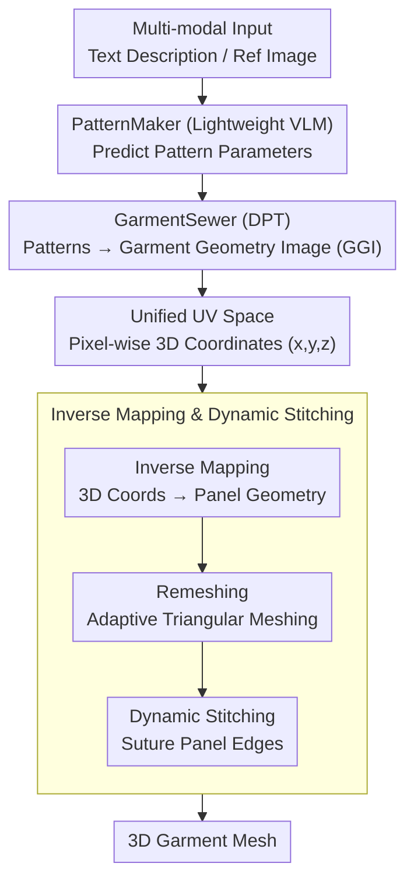

# SwiftTailor: Efficient 3D Garment Generation with Geometry Image Representation

**Conference**: CVPR2026  
**arXiv**: [2603.19053](https://arxiv.org/abs/2603.19053)  
**Authors**: Phuc Pham, Uy Dieu Tran, Binh-Son Hua, Phong Nguyen  
**Code**: To be confirmed  
**Area**: 3D Vision / Garment Generation  
**Keywords**: 3D Garment Generation, Geometry Image, Sewing Patterns, VLM, Dense Prediction Transformer  

## TL;DR

Ours proposes SwiftTailor, a two-stage lightweight framework that generates 3D garment meshes by predicting sewing patterns via PatternMaker and converting them into Garment Geometry Images (GGI) in a unified UV space via GarmentSewer. Combined with inverse mapping and dynamic stitching, it achieves SOTA quality with inference speeds tens of times faster than existing methods.

## Background & Motivation

3D garment generation is a long-standing challenge in computer vision and digital fashion. Typical pipelines use large Vision-Language Models (VLMs) to generate serialized representations of 2D sewing patterns, which are then converted into simulatable 3D meshes using frameworks like GarmentCode. While high-quality, these methods face significant bottlenecks:

**Low Inference Efficiency**: Dependence on physics simulation engines (e.g., GarmentCode) to convert 2D patterns to 3D meshes results in 30-60 seconds of inference time per garment, failing to meet real-time or large-scale generation needs.

**VLM Redundancy**: Using large VLMs for sewing pattern prediction involves parameter waste; lightweight models are sufficient for this task.

**Non-unified Representation**: The transition from 2D patterns to 3D meshes relies on complex simulation pipelines that are multi-stage, non-differentiable, and difficult to optimize end-to-end.

**Core Problem**: How to significantly enhance inference efficiency for 3D garment generation while maintaining generation quality?

## Method

### Overall Architecture

Existing 3D garment generation follows the path of "Large VLM predicting 2D patterns → Physics engines like GarmentCode for 3D mesh conversion," which is slow and non-differentiable. SwiftTailor replaces this with a two-stage learnable cascade: Stage 1, PatternMaker, uses a lightweight VLM to predict sewing pattern parameters from multi-modal inputs; Stage 2, GarmentSewer, uses a Dense Prediction Transformer to convert patterns into a Garment Geometry Image (GGI), encoding the 3D surfaces of all panels into a unified UV space. Finally, inverse mapping, remeshing, and dynamic stitching are used to assemble the 3D mesh. The core idea is to replace physics simulation with a learned geometry image representation, amortizing expensive simulation costs into the training phase to achieve sub-second inference.

### Key Designs

**1. PatternMaker: Pattern prediction does not require large VLMs**

Existing methods (e.g., AIpparel, ChatGarment) use large VLMs like LLaVA-1.5V-7B, which is parameter-inefficient. PatternMaker operates on the premise that sewing pattern prediction is essentially a structured prediction task. It streamlines the model scale to focus on pattern-specific features, supporting text and image inputs to directly output parameterized representations of panel shapes, sizes, and stitching relations, achieving better cost-performance on Multimodal GarmentCodeData.

**2. GarmentSewer and GGI: Transforming irregular 3D meshes into regular 2D image prediction**

The bottleneck in pattern-to-3D conversion is the non-differentiable physics simulation. GarmentSewer introduces the Garment Geometry Image (GGI) to bypass this: it encodes 3D surface information of all panels into a unified 2D UV space, where each pixel stores corresponding 3D coordinates $(x, y, z)$. This converts irregular 3D mesh generation into a regular 2D image prediction task. GarmentSewer employs an efficient DPT architecture to predict GGI conditioned on pattern parameters. The global attention of the Transformer effectively captures spatial relationships between panels, while the UV mapping maximizes information density and maintains geometric consistency.

**3. Inverse Mapping and Dynamic Stitching: Reconstructing 3D garments from GGI**

Reconstructing the final mesh involves three steps: Inverse mapping projects 3D coordinates back to the original panel space; Remeshing adaptively re-triangulates the panels to ensure mesh quality; and Dynamic Stitching automatically sutures corresponding edges based on pattern definitions, handling practical issues such as inconsistent edge lengths. This pipeline completely replaces traditional physics simulation, reducing assembly time from dozens of seconds to sub-second levels.

## Key Experimental Results

Experiments were evaluated on the Multimodal GarmentCodeData dataset.

### Main Results

| Method | Pattern Accuracy | 3D Geo Error ↓ | Visual Fidelity ↑ | Inference Time |
|------|---------|------------|------------|---------|
| GarmentCode + Large VLM | High | Low | High | 30-60s |
| Serialization-based | Medium | Medium | Medium | ~30s |
| **SwiftTailor** | **Highest** | **Lowest** | **Highest** | **< 1s** |

SwiftTailor achieves a speedup of over an order of magnitude while maintaining SOTA accuracy.

### Ablation Study

| Configuration | Geo Error ↓ | Inference Time | Description |
|------|---------|---------|------|
| Full SwiftTailor | Lowest | Fastest | Complete two-stage framework |
| w/o GGI (Physics Sim) | Comparable | 30-60s | Validates GGI replacing simulation |
| w/o Dynamic Stitching | High | Fast | Decreased stitching quality |
| w/o Remeshing | Medium | Fastest | Reduced mesh quality |
| Large VLM for PatternMaker | Comparable | Slower | Validates lightweight VLM efficiency |

Ablation results demonstrate the necessity of the GGI representation, dynamic stitching, and remeshing components.

## Key Findings

1. **Geometry Images as Efficient Representations**: GGI unifies irregular 3D meshes into a regular 2D image space, allowing standard image prediction architectures to be applied to garment generation.
2. **Simulation can be Replaced by Learning**: By amortizing simulation costs during training, the inference phase requires no physics engine, drastically reducing latency.
3. **Lightweight VLMs are Sufficient**: Sewing pattern prediction is a relatively structured task that does not require ultra-large scale VLMs.
4. **Efficiency and Quality Can Coexist**: SwiftTailor proves that efficiency gains do not have to come at the expense of quality in 3D garment generation.

## Highlights & Insights

- **Representation Innovation**: Garment Geometry Image is an inspiring design. Encoding all 3D panels into a unified 2D space can be generalized to other multi-component 3D object generation tasks.
- **Amortized Optimization**: Shifting the cost of physics simulation from inference to training is a universal acceleration strategy, similar to concepts in neural physics and neural rendering.
- **Modular Design**: The decoupled two-stage design allows PatternMaker and GarmentSewer to be independently optimized or replaced.
- **Practical Utility**: The 10x+ speedup makes the method viable for real-world deployment, such as real-time 3D virtual try-ons and game character customization.
- **Interpretability**: By maintaining sewing patterns as an intermediate representation, users can inspect and edit parameters, providing a robust human-computer interface.

## Limitations

1. **Dataset Dependency**: Evaluated only on Multimodal GarmentCodeData; diversity may not cover all real-world garment types (e.g., complex evening gowns or ethnic wear).
2. **GGI Resolution**: The resolution of the geometry image sets an upper bound on 3D mesh detail, which might be insufficient for fine structures like wrinkles or embroidery.
3. **Topological Constraints**: GGI assumes panels can be flattened into 2D UV space, which may struggle with topologically complex garments (e.g., holes or multi-layer stacking).
4. **Physical Realism**: While simulation costs are amortized, it remains to be verified if the learned geometry fully adheres to physical laws (e.g., gravity-induced draping or fabric thickness).
5. **Generalization**: The ability to generalize to entirely new garment types outside the training distribution requires further investigation.

## Related Work & Insights

- **GarmentCode**: A garment modeling framework that procedurally generates 3D meshes from sewing patterns; the primary baseline SwiftTailor replaces.
- **SewFormer / DressCode**: Transformer-based pattern prediction methods using serialization, which are slower.
- **Geometry Images (Gu et al., 2002)**: Classic method for encoding 3D meshes into 2D images; SwiftTailor extends this to multi-panel garment scenarios.
- **Neural Garment Rendering**: NeRF/Gaussian-based methods for rendering that do not generate manipulatable 3D meshes.
- **DPT (Dense Prediction Transformer)**: A Transformer architecture for dense prediction, used as the backbone for GGI generation in SwiftTailor.

**Insight**: The GGI representation could be extended to other multi-part 3D object generation (e.g., furniture, mechanical parts). The "amortized simulation" concept provides a reference for any 3D content generation pipeline dependent on physics engines.

## Rating

- **Novelty**: 8/10 — The GGI representation and two-stage amortized framework are innovative applications of classical geometry image concepts.
- **Experimental Thoroughness**: 7/10 — Achieves SOTA on standard datasets with ablations, though lacks cross-dataset generalization and real-world deployment validation.
- **Writing Quality**: 8/10 — Clear framework description, logical two-stage design, and well-supported motivation.
- **Value**: 8/10 — 10x acceleration offers clear application value, and the GGI representation pushes the field forward.

<!-- RELATED:START -->

## Related Papers

- [\[CVPR 2026\] SGI: Structured 2D Gaussians for Efficient and Compact Large Image Representation](sgi_structured_2d_gaussians_for_efficient_and_compact_large_image_representation.md)
- [\[CVPR 2026\] Improving Human Image Animation via Semantic Representation Alignment](improving_human_image_animation_via_semantic_representation_alignment.md)
- [\[CVPR 2026\] ReWeaver: Towards Simulation-Ready and Topology-Accurate Garment Reconstruction](reweaver_towards_simulation-ready_and_topology-accurate_garment_reconstruction.md)
- [\[CVPR 2026\] Text–Image Conditioned 3D Generation](text-image_conditioned_3d_generation.md)
- [\[CVPR 2026\] FlashVGGT: Efficient and Scalable Visual Geometry Transformers with Compressed Descriptor Attention](flashvggt_efficient_and_scalable_visual_geometry_transformers_with_compressed_descr.md)

<!-- RELATED:END -->
