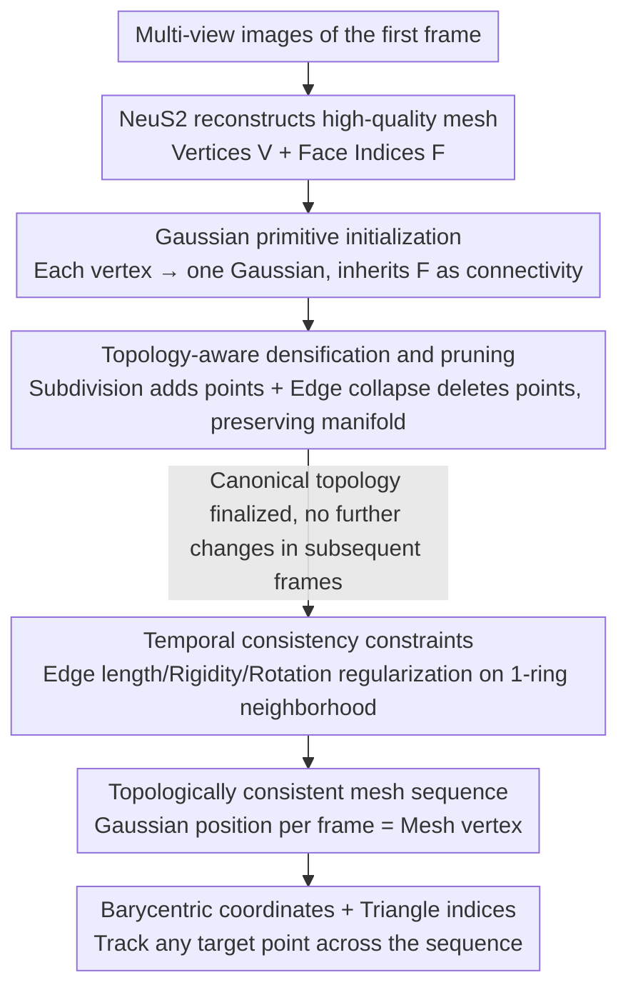

# TagSplat: Topology-Aware Gaussian Splatting for Dynamic Mesh Modeling and Tracking

**Conference**: CVPR2026  
**arXiv**: [2512.01329](https://arxiv.org/abs/2512.01329)  
**Code**: [Project Page](https://haza628.github.io/tagSplat/)  
**Area**: 3D Vision  
**Keywords**: Gaussian Splatting, Topological Consistency, Dynamic Mesh Reconstruction, 3D Keypoint Tracking, Manifold Preservation

## TL;DR

The authors propose TagSplat, a topology-aware Gaussian Splatting framework. By explicitly encoding the spatial connectivity between Gaussian primitives, it generates topologically consistent mesh sequences in dynamic scene reconstruction and supports precise 3D keypoint tracking.

## Background & Motivation

The core workflow of the animation industry is based on meshes: rendering, skinning, and editing all require topologically consistent triangular meshes. However, existing 4D reconstruction methods face critical challenges:

- **NeRF-based methods** (HyperNeRF, D-NeRF, etc.) utilize implicit representations and cannot impose explicit topological constraints on dynamic objects. Even when using Marching Cubes to extract meshes frame-by-frame, inter-frame topological continuity cannot be guaranteed.
- **3DGS-based methods** (Dynamic 3DGS, DG-Mesh, Dynamic 2DGS, etc.) offer high-quality rendering, but independent mesh reconstruction for each frame leads to topological inconsistency. Vertex counts and connectivity change across frames, making them unsuitable for rigging and keypoint tracking.
- **Topo4D** binds Gaussians to static template mesh vertices, but it relies on high-quality Metahuman templates and is limited to head models.
- **GauSTAR** uses optical flow to guide reconstruction and tracking, but the preprocessing pipeline is complex and difficult to deploy.

**Key Challenge**: Existing methods disrupt the manifold structure during the Gaussian densification and pruning processes, causing the topology to change across training iterations.

## Core Problem

How can manifold topology be kept invariant during the training of 3D Gaussian Splatting to generate dynamic mesh sequences with consistent vertex counts and connectivity?

## Method

### Overall Architecture

TagSplat addresses a specific challenge: rendering, skinning, and editing in the animation industry are built on top of topologically consistent triangular meshes. Existing 4D reconstruction methods extract meshes independently per frame, leading to vertex counts and connectivity that change every frame, making it impossible to bind skeletons or track keypoints. Its core insight is to embed "topology" into the Gaussian representation from the start and keep it invariant throughout training.

The workflow uses a canonical space (taken from the first frame) to establish the topology, while subsequent frames only modify geometry. First, a high-quality mesh is reconstructed from the first frame's multi-view images using NeuS2. Each mesh vertex is converted into a Gaussian primitive, and the mesh's face indices are directly inherited as connectivity between Gaussians. Next, "topology-aware" densification and pruning are performed only in the canonical space, ensuring that adding or removing Gaussians does not break the manifold. Finally, when training each subsequent frame, temporal regularization based on 1-ring neighborhoods fixes the inter-frame topology. Once training is complete, the position of the Gaussians in each frame serves as the corresponding mesh vertex coordinates. Since all frames share the same topology, any point on the mesh surface can be represented using "barycentric coordinates + triangle index"—a parameterization that is consistent across all frames, allowing any target point to be tracked throughout the sequence.

### Key Designs

**1. Gaussian Primitive Initialization: Inheriting Mesh Topology from Birth**

The root cause of inconsistent topology in independent reconstruction is that Gaussians are essentially a cloud of unconnected points. TagSplat starts from the initial frame mesh $\mathcal{M}=(\mathcal{V},\mathcal{F})$, instantiating each vertex $\boldsymbol{v}_i$ directly as a Gaussian primitive. The initialized Gaussian set $\mathcal{G}=(\{(\boldsymbol{p}_i,\boldsymbol{R}_i,\boldsymbol{s}_i,\boldsymbol{c}_i,\alpha_i)\}_{i=1}^{|\mathcal{V}|},\mathcal{F})$ carries the face indices $\mathcal{F}$. These indices $\mathcal{F}$ serve as the "skeleton" for all subsequent topological operations, defining adjacency between Gaussians. Parameters are initialized as follows:

| Parameter | Initialization Strategy |
|-----------|-------------------------|
| Position $\boldsymbol{p}_i$ | Vertex coordinates $\boldsymbol{v}_i$ |
| Color $\boldsymbol{c}_i$ | Vertex RGB color |
| Opacity $\alpha_i$ | Uniformly set to 1 |
| Rotation $\boldsymbol{R}_i$ | Based on vertex normal $\boldsymbol{n}_i$, with normal as the local z-axis |
| Scale $s_{i,x}, s_{i,y}$ | Based on neighboring vertex distances to ensure coverage |
| Scale $s_{i,z}$ | Set to a minimal value $\epsilon$ to keep the Gaussian tight to the surface |

Compressing $s_{i,z}$ to a minimum and aligning rotation with the normal makes the Gaussians act like "scales" attached to the surface rather than free-floating ellipsoids, ensuring their centers stably correspond to mesh vertices.

**2. Topology-Aware Densification & Pruning: Adding/Removing Gaussians without Tearing the Manifold**

This is the core innovation of the paper. Standard 3DGS densification and pruning only consider local attributes (view-space gradient, opacity, scale), where added or removed points have no explicit connectivity. Consequently, the manifold structure of the surface breaks after several iterations. TagSplat redefines "addition" and "deletion" as topology-preserving operations on the face indices $\mathcal{F}$.

Densification targets triangular faces where the view-space gradient exceeds a threshold: a new Gaussian is inserted within the face, inheriting the average attributes of the three vertex Gaussians. The original triangle is subdivided into three new triangles $(\mu_0, \mu_1, \mu_{\text{new}})$, $(\mu_1, \mu_2, \mu_{\text{new}})$, and $(\mu_2, \mu_0, \mu_{\text{new}})$, ensuring the face indices remain a valid triangulation. Scaling follows 3DGS clone/split intuition: if the average scale $\bar{s} < \tau_s$ (under-reconstructed), the new point is used directly; otherwise (over-reconstructed), the scales of both the new and original vertices are halved.

Pruning utilizes a customized edge collapse strategy inspired by Hoppe, calculating a collapse cost that incorporates both geometric and color errors:

$$C = \omega_g \cdot \|\mathbf{p}_i - \mathbf{p}_j\| + \omega_a \cdot \|\mathbf{c}_i - \mathbf{c}_j\|$$

where $\|\mathbf{p}_i - \mathbf{p}_j\|$ is the Euclidean distance between centers (geometric error) and $\|\mathbf{c}_i - \mathbf{c}_j\|$ is the difference in color (attribute error). For each Gaussian to be pruned, all neighbors in its 1-ring neighborhood are checked to find the edge with the minimum cost for collapse. This minimizes geometric and visual loss while reducing the point count. Crucially, densification and pruning are only performed in the canonical space. Once finalized, no points are added/removed, and indices are not modified for subsequent frames, ensuring consistency.

**3. Temporal Consistency Constraints: Fixing Inter-frame Topology via 1-ring Neighborhoods**

While topology is fixed in the canonical space, the geometry changes with motion. Without constraints, the relative relationships between adjacent Gaussians would fluctuate. TagSplat adds three temporal regularizations based on the 1-ring neighborhood during subsequent frame training: edge length consistency ensures adjacent Gaussian distances are continuous across frames; rigidity constraints ensure local relative displacements follow local rigid body assumptions; and rotation consistency ensures the rotation change of adjacent Gaussians is smooth across frames. The weights for these are 4.0, 4.0, and 20.0, respectively, with rotation consistency being the highest, indicating its sensitivity for temporal coherence.

### Loss & Training

The first frame utilizes joint optimization with both Gaussian rendering and differentiable mesh rasterization (Nvdiffrast). The loss consists of several components:

| Loss Item | Formula | Function | Weight |
|-----------|---------|----------|--------|
| Gaussian Color Loss $\mathcal{L}_c^{gs}$ | $0.8\cdot\|I_{gs}-I_{gt}\|+0.2\cdot\mathcal{L}_{ssim}$ | Align rendered image with GT | 1.0 |
| Mesh Color Loss $\mathcal{L}_c^{mesh}$ | Same as above, using Nvdiffrast | Improve mesh rendering quality | 1.0 |
| Gaussian Mask Loss $\mathcal{L}_m^{gs}$ | $0.8\cdot\|I_m-I_{mask}\|+0.2\cdot\mathcal{L}_{ssim}$ | Ensure coverage of target region | 3.0 |
| Mesh Mask Loss $\mathcal{L}_m^{mesh}$ | Same as above | Same as above | 3.0 |
| 2D Scale Constraint $\mathcal{L}_{2d}$ | $\sum_{i=1}^k s_z^i$ | Constraint z-axis scale to fit surface | 1.0 |
| Laplacian Smoothing $\mathcal{L}_{lap}$ | $\frac{1}{k}\sum\|\boldsymbol{\delta}_i\|^2$ | Suppress surface artifacts | 5.0 |
| Normal Consistency $\mathcal{L}_n$ | $\sum\|\boldsymbol{n}_i^{gs}-\boldsymbol{n}_i^{mesh}\|$ | Align Gaussian orientation with mesh normal | 1.0 |

The Laplacian term $\boldsymbol{\delta}_i = \boldsymbol{\mu}_i - \frac{1}{|m|}\sum_{j=1}^m \boldsymbol{\mu}_j$ measures the deviation of each Gaussian from its 1-ring neighborhood center.

Subsequent frames add the three temporal regularizations. Edge length consistency (weight 4.0):

$$\mathcal{L}_{len} = \sum_{i=1}^{k_l} \|l_{t,i} - l_{t-1,i}\|$$

Rigidity constraint (weight 4.0), where $\Delta\boldsymbol{R}_t = \boldsymbol{R}_{i,t-1}\boldsymbol{R}_{i,t}^{-1}$ and weight $\omega_{i,j}=\exp(-\lambda_w \cdot l_{i,j})$ strengthens constraints for closer neighbors:

$$\mathcal{L}_{rigid} = \sum_{i=1}^k \sum_{j=1}^m \omega_{i,j} \|(\boldsymbol{\mu}_{j,t-1}-\boldsymbol{\mu}_{i,t-1}) - \Delta\boldsymbol{R}_t(\boldsymbol{\mu}_{j,t}-\boldsymbol{\mu}_{i,t})\|$$

Rotation consistency (weight 20.0), where $\boldsymbol{q}$ is a normalized quaternion and $\otimes$ denotes quaternion multiplication:

$$\mathcal{L}_{rot} = \sum_{i=1}^k \sum_{j=1}^m \omega_{i,j} \|\boldsymbol{q}_{j,t}\otimes\boldsymbol{q}_{j,t-1}^{-1} - \boldsymbol{q}_{i,t}\otimes\boldsymbol{q}_{i,t-1}^{-1}\|$$

## Key Experimental Results

### Datasets

- **MIX-TAG** (Synthetic): 3 dynamic humans (Worker/Dancer/Boxer), 42 virtual cameras, 1080×1080 resolution, 90-130 frames, provides GT mesh.
- **TalkBody4D** (Real): 59 calibrated RGB cameras @20FPS, 3000×4000 resolution, using 30 views.

### Main Results (MIX-TAG Dataset, Boxer Scenario)

| Methods | PSNR↑ | SSIM↑ | CD↓ | Tracking MSE↓ | Topologically consistent? |
|---------|-------|-------|-----|---------------|---------------------------|
| Dynamic 3DGS | 30.56 | 0.97 | ✗ | 0.000676 | ✗ |
| DG-Mesh | 22.46 | 0.95 | 1.48 | 0.013502 | ✗ |
| Deformable-GS | 34.38 | 0.98 | ✗ | 0.006631 | ✗ |
| Dynamic 2DGS | 34.27 | 0.97 | 0.47 | 0.009148 | ✗ |
| **Ours** | **34.76** | **0.98** | **0.32** | **0.000569** | **✔** |

In the Dancer scenario, TagSplat's tracking MSE is 0.000101, which is approximately 70% lower than Dynamic 3DGS (0.000329) and 99.8% lower than Dynamic 2DGS (0.042436).

### TalkBody4D Real Dataset (Mesh Rendering Quality)

| Methods | PSNR↑ | SSIM↑ | LPIPS↓ |
|---------|-------|-------|--------|
| DG-Mesh | 24.90 | 0.91 | 0.097 |
| Dynamic-2DGS | 23.58 | 0.90 | 0.081 |
| **Ours** | **26.82** | **0.93** | **0.077** |

### Ablation Study

- Removing Mesh Loss: PSNR dropped from 32.90 to 27.70, CD increased from 0.360 to 0.396.
- Removing Topology-Preserving D&P Module: PSNR dropped to 30.22.
- Removing Rotation Consistency Loss: Tracking MSE increased from 0.000368 to 0.000372 (minimal impact, but still contributing).
- Removing Rigidity Loss: Tracking MSE increased to 0.000395 (significant impact).

## Highlights & Insights

1. **First method to maintain manifold topology during dynamic Gaussian updates**, achieving truly topologically consistent mesh sequence reconstruction.
2. **Exquisitely designed topology-aware densification and pruning strategies**: Addition via triangle subdivision and deletion via edge collapse cost minimization increase geometric detail while preserving the manifold.
3. **Significant lead in tracking accuracy**: By leveraging topological consistency for 3D keypoint tracking, the MSE is 1-2 orders of magnitude lower than the next best methods.
4. **End-to-end framework**: From multi-view video to topologically consistent mesh sequences + 3D tracking without specialized preprocessing.
5. Employs dual-stream supervision from both Gaussian Splatting and differentiable mesh rasterization (Nvdiffrast), enhancing geometric accuracy.

## Limitations & Future Work

1. **Inability to handle drastic topological changes**: In scenarios like clothing tearing or object splitting, the framework assumes stable topological relationships.
2. **Dependence on high-quality first-frame mesh reconstruction**: Uses NeuS2 for initialization; poor initial reconstruction affects all subsequent frames.
3. **Limited to foreground humans**: Experiments are confined to single-person dynamic reconstruction, not covering multiple people or general dynamic scenes.
4. **Densification and pruning only in canonical space**: Topology precision cannot be adaptively adjusted in subsequent frames.
5. Experiments were conducted on a single RTX 3090; training time and inference speed were not reported.

## Related Work & Insights

- **vs DG-Mesh**: DG-Mesh attaches Gaussians to meshes and automatically reconstructs dynamic meshes, but with per-frame independent topology; TagSplat maintains cross-frame consistency.
- **vs Dynamic 2DGS**: Dynamic 2DGS uses 2D Gaussians to improve mesh accuracy but still relies on per-frame Poisson reconstruction; TagSplat generates consistent meshes directly from Gaussian topology.
- **vs Topo4D**: Topo4D depends on high-quality Metahuman templates and is limited to heads; TagSplat is more general, starting from data-driven initial meshes.
- **vs Dynamic 3DGS**: Dynamic 3DGS offers acceptable rendering but no mesh output; TagSplat achieves both high-quality rendering and mesh reconstruction.
- **vs GauSTAR**: GauSTAR has a complex preprocessing pipeline (optical flow); TagSplat's workflow is more streamlined.

## Rating
- Novelty: ⭐⭐⭐⭐ (Topology-aware Gaussian densification/pruning is a distinct innovation)
- Experimental Thoroughness: ⭐⭐⭐⭐ (Synthetic + Real datasets, thorough ablation, but lacks speed comparison)
- Writing Quality: ⭐⭐⭐⭐ (Clear structure, detailed algorithm description)
- Value: ⭐⭐⭐⭐ (An important step in bridging 3DGS with animation industry mesh workflows)

<!-- RELATED:START -->

## Related Papers

- [\[CVPR 2026\] ExMesh: EXplicit Mesh Reconstruction with Topology Adaptation](exmesh_explicit_mesh_reconstruction_with_topology_adaptation.md)
- [\[CVPR 2026\] Part$^{2}$GS: Part-aware Modeling of Articulated Objects using 3D Gaussian Splatting](part2gs_part-aware_modeling_of_articulated_objects_using_3d_gaussian_splatting.md)
- [\[CVPR 2026\] RT-Splatting: Joint Reflection-Transmission Modeling with Gaussian Splatting](rt-splatting_joint_reflection-transmission_modeling_with_gaussian_splatting.md)
- [\[ICLR 2026\] Topology-Preserved Auto-regressive Mesh Generation in the Manner of Weaving Silk](../../ICLR2026/3d_vision/topology-preserved_auto-regressive_mesh_generation_in_the_manner_of_weaving_silk.md)
- [\[CVPR 2026\] VAD-GS: Visibility-Aware Densification for 3D Gaussian Splatting in Dynamic Urban Scenes](vad-gs_visibility-aware_densification_for_3d_gaussian_splatting_in_dynamic_urban.md)

<!-- RELATED:END -->
