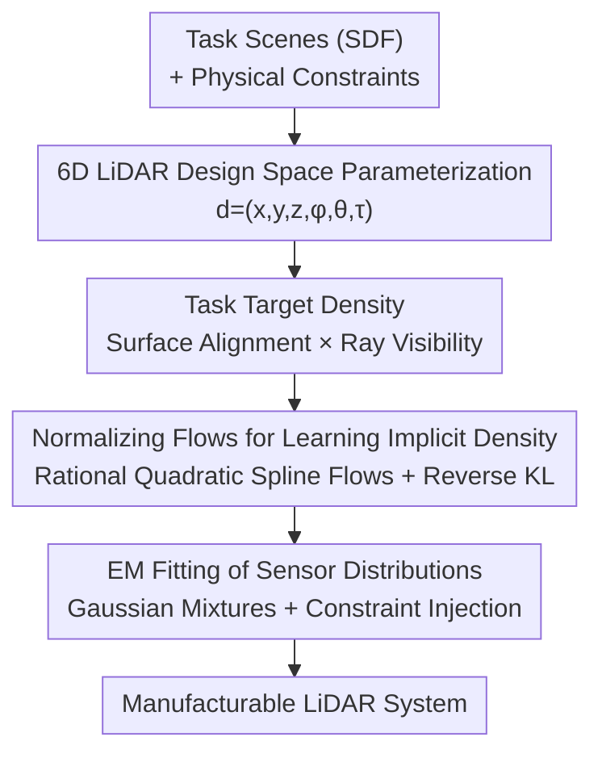

# Task-Driven Implicit Representations for Automated Design of LiDAR Systems

**Conference**: CVPR 2026  
**Paper**: [CVF Open Access](https://openaccess.thecvf.com/content/CVPR2026/html/Behari_Task-Driven_Implicit_Representations_for_Automated_Design_of_LiDAR_Systems_CVPR_2026_paper.html)  
**Code**: [Project page nikhilbehari.github.io/implicitlidar](https://nikhilbehari.github.io/implicitlidar)  
**Area**: 3D Vision / Computational Imaging / Sensor System Design  
**Keywords**: LiDAR system design, implicit density, normalizing flows, expectation-maximization, computational imaging

## TL;DR
This work encodes LiDAR sensor configurations as points in a continuous 6D design space, uses normalizing flows to learn an implicit density of "which designs are most useful for a given 3D task", and then fits Gaussian mixture "sensors" to this density via EM. This enables the **automated generation** of LiDAR systems tailored to tasks such as face scanning, robotic arm tracking, or warehouse detection under arbitrary physical constraints, while reducing data bandwidth by up to approximately 90% (1/10).

## Background & Motivation

**Background**: Imaging system design (selection and placement of optics, sensors, and illumination) remains a highly manual, iterative engineering process. While LiDAR (direct Time-of-Flight, dToF) is ubiquitous in mobile phones, robotics, and autonomous driving, it introduces numerous unique design degrees of freedom compared to conventional cameras—such as scanning patterns, time gates, emission power, and data throughput—making the design space significantly more complex.

**Limitations of Prior Work**: Most existing LiDAR optimization methods focus solely on the single dimension of **placement** (e.g., where to mount a scanning LiDAR on an autonomous vehicle), assuming fixed hardware and tasks. Meanwhile, co-design methods for sensors and perception can only fine-tune **predefined** camera parameters and require retraining whenever constraints change. No existing method can unifiedly represent various LiDAR modalities—such as flash, gated, or motion-adaptive—in a continuous space while supporting post-hoc constraint adjustments.

**Key Challenge**: LiDAR system design must simultaneously satisfy three competing requirements: (1) searching within a high-dimensional, **mixed discrete-continuous** space (comprising sensor count, scanning patterns, placement, orientation, field of view, and time gates); (2) tailoring configurations to **specific tasks** (e.g., mobile LiDAR capturing fine facial geometry, or distributed robotic tracking complying with workspace and kinematic constraints); and (3) satisfying **physical constraints** like size, weight, power, and range, alongside user preferences, while allowing rapid recomputation. Integrating these three elements into a single differentiable, sampleable, and constraint-aware framework constitutes the key challenge.

**Goal**: To automatically generate practical and manufacturable LiDAR systems for any 3D vision task under arbitrary constraints.

**Key Insight**: The authors draw inspiration from translation paradigms of implicit neural representations (INRs / NeRFs). Since NeRF learns an implicit volume density over a continuous 5D subspace and achieves novel view synthesis via strategic sampling, could we likewise learn an implicit **design density** over a continuous **6D LiDAR design space**, and then convert high-density regions into actual manufacturable sensors via "constraint-aware sampling"?

**Core Idea**: To reformulate "designing a LiDAR system" as "maximum likelihood sampling over an implicit density" through a four-step framework: "6D design space + task-driven implicit density + flow-model-based density learning + EM-based sensor fitting."

## Method

### Overall Architecture

The proposed method is structured as a four-stage sequential pipeline: **First, any LiDAR measurement is unified and parameterized as a point in a 6D design space. Second, a target density is defined for a given task to quantify "how beneficial a design point is for the task." Third, normalizing flows are utilized to learn this target density (which is difficult to sample directly) as an invertible transformation (implicit density). Finally, "a sensor" is modeled as a parametric distribution over the 6D space, and EM is employed to fit it to the learned implicit density while incorporating physical constraints, outputting a manufacturable LiDAR system.**

The input consists of a batch of simulated scenes (represented by SDFs) for a given task and user-defined physical constraints; the output is a set of sensor configurations (placement, field of view, orientation, time gate, and ray allocation for each sensor). The four stages correspond to Sections 3, 4.1, 4.3, and 5 of the paper, respectively.

### Key Designs

**1. 6D LiDAR Design Space Parameterization: Decomposing "a Sensor" into a Set of Samples in Continuous Coordinates**

A major limitation of prior work is that LiDAR design variables mix discrete aspects (e.g., number of sensors, number of scan lines) with continuous ones (e.g., angles, time gates), which existing methods fail to formulate in a unified manner. The authors address this by representing **each individual LiDAR measurement** as a ray with an infinitesimal time-of-flight, characterized by six continuous coordinates: the spatial origin $x=(x,y,z)\in\mathbb{R}^3$, the ray direction (azimuth $\phi$ and elevation $\theta$) $a=(\phi,\theta)$, and the temporal coordinate $\tau\in\mathbb{R}^+$ (time-of-flight, equivalent to depth). Thus, a design point is written as:

$$d = (x,y,z,\phi,\theta,\tau)^\top \in \mathcal{D} = \mathcal{X}\times\mathcal{A}\times\mathcal{T}.$$

The observed scene point for each ray is given by the forward mapping $s=M(d)=x+\tau\,v(\phi,\theta)$, where $v(\phi,\theta)=(\cos\theta\cos\phi,\ \cos\theta\sin\phi,\ \sin\theta)^\top$ is the unit direction vector. A complete echo is paired by an emission ray $d_e$ and a detection ray $d_d$, satisfying $M(d_e)=M(d_d)=s$. This work primarily focuses on the co-located transmitter-receiver case ($d_e=d_d$), although the framework naturally extends to bi-static configurations. The elegance of this parameterization lies in the fact that **all existing LiDAR modalities (single/multi-point dToF, flash, gated, scanning) are reformulated as discrete sampling volumes in the 6D space**, thereby unifying "LiDAR design" as "point selection within a continuous 6D space."

**2. Task Target Density: Quantifying Design Worthiness via "Surface Alignment × Ray Visibility"**

To learn density in the 6D space, a metric is required to measure "how good a design point $d$ is." The proposed target density $p^\ast(d)$ decomposes "quality" into two physical factors, summed over a set of task-relevant scenes $\{i\}$. The first is **surface alignment**: the scene point $s=M(d)$ observed by design $d$ should, on average, lie close to the object surface to maximize valid echo collection. Using the signed distance function $\mathrm{SDF}_i(s)$ (which is 0 at the surface) of each scene, the energy is defined as:

$$S_i(d)=\exp\!\Big(-\frac{\mathrm{SDF}_i(s)^2}{2\sigma^2}\Big),$$

representing the likelihood of $s$ being near the surface under Gaussian noise $\sigma$. The second is **ray visibility**: the optical path from origin $x$ to $s$ must be unoccluded, modeled using the transmittance formulation from volume rendering:

$$T_i(d)=\exp\!\Big(-\!\int_0^\tau \kappa\,\mathrm{sigmoid}\big(-\mathrm{SDF}_i(x+t\,v(\phi,\theta))\big)\,dt\Big),$$

where $\kappa>0$ controls attenuation. The final target density is the sum of their products over the scene dataset:

$$p^\ast(d)=\sum_i \underbrace{S_i(d)}_{\text{surface alignment}}\ \underbrace{T_i(d)}_{\text{ray visibility}}.$$

This metric provides two crucial contributions: first, **projecting task-specific scene diversity into the design space**—if a scene point $s$ lies on the surface in $I$ scenes, then under full visibility $p^\ast(d)\!\approx\!|I|$, proportional to the occurrence frequency of the surface point across scenes; second, **explicitly modeling occlusions**, as the visibility term reduces the density of occluded equivalent rays, yielding physically plausible projections. Note that the surface alignment term introduces design ambiguity (infinitely many geometrically equivalent $d$'s for a single $s$, forming curves in the design space), which naturally reflects the inherent multi-solution nature of real-world LiDAR design.

**3. Normalizing Flows for Learning Implicit Density: Transforming Hard-to-Sample Target Density into an Invertible Mapping**

Although $p^\ast(d)$ is defined, finding high-density regions directly in a 6D space is intractable. The core technique is to leverage **normalizing flows** to learn an invertible mapping from an easy-to-sample base distribution to the target density. Consequently, the LiDAR design density for each task is encoded "implicitly" as a transformation of the base distribution. Specifically, sampling $z$ from a 6D uniform base distribution $\pi=U([0,1]^6)$, we learn an invertible mapping $f:\mathbb{R}^6\to\mathbb{R}^6$ to obtain $d=f(z)$. The density is given by the change-of-variables formula:

$$p(d)=\pi\big(f^{-1}(d)\big)\,\big|\det \nabla f^{-1}(d)\big|.$$

$f$ is constructed by composing $K$ **autoregressive spline flow layers**, where each coordinate update $d_i=h_{\psi_i}(z_i;z_{1:i-1})$ employs a rational quadratic spline conditioned by an MLP (which predicts spline bin widths, heights, and derivatives). The training objective is to minimize the **reverse KL divergence** between the learned density $p(d;\Phi)$ and the target $p^\ast(d)$. The loss function comprises three terms: base log-likelihood, log-Jacobian determinant of the flow, and target log-density, augmented by an entropy regularization weight $\lambda_{\text{ent}}$ to promote sample diversity. The invertible and differentiable properties yield closed-form Jacobians and exact likelihoods, which are essential for the subsequent EM-based sampling.

**4. EM-based Gaussian Mixture Fitting: Translating Implicit Density into Manufacturable, Constrained Sensors**

The final step is to translate the "continuous density" into "physical sensors." The authors model a new sensor as a parametric distribution over the 6D space: $q(d\mid\eta)=q_x(x\mid\eta_x)\,q_a(a\mid\eta_a)\,q_\tau(\tau\mid\eta_\tau)$. Synthesizing a sensor setup is formulated as Maximum Likelihood Estimation (MLE): $\eta^\ast=\arg\max_\eta \mathbb{E}_{d\sim p(d)}[\log q(d\mid\eta)]$, which aligns the sensor distribution with the high-density regions of the implicit density. In practice, $q$ is modeled as a $G$-component **Gaussian Mixture Model (GMM)**: $q(d\mid\eta)=\sum_{g=1}^G \pi_g\,\mathcal{N}(d;\mu_g,\Sigma_g)$, iteratively fitted via **Expectation-Maximization (EM)**. The E-step computes the component posterior $q(g\mid d;\eta^{(t)})$, and the M-step updates $\eta^{(t+1)}$ to maximize the Jensen lower bound of the log-likelihood. Each Gaussian represents a synthesized "sensor," whose physical parameters (angles, time gates, and origins in distributed systems) are extracted from its 95% confidence intervals. For line-based scanning, the total ray budget is allocated to individual sensors proportionally to their mixing weights $\pi_g$, aligning spatial sampling density with sensor importance. The paramount value of this step is that **constraint injection is extremely cheap**: spatial, angular, or temporal constraints are enforced by limiting the density support to a permissible region $\mathcal{C}$ (setting $p(d)=0$ for $d\notin\mathcal{C}$ ) and refitting; field-of-view and time-gate constraints translate into simple bounds on covariance diagonal elements $\Sigma_{a,ii}\in[\sigma_{\min}^2,\sigma_{\max}^2]$; the number of sensors is controlled by the mixture order $G$; and fixing specific parameters (such as $\mu_x, \Sigma_x$) imposes hard placement constraints. **Crucially, modifying constraints requires absolutely no retraining of the flow model.**

### A Concrete Example: Automated Design for Face Scanning

Taking the mobile flash-LiDAR face scanning in Expt. A as an illustrative walkthrough: (1) 50 facial meshes sampled from the Basel Face Model (converted to SDFs) serve as task scenes; (2) surface alignment $S_i$ and ray visibility $T_i$ are calculated for each candidate design point $d$, with their sum defining the target density—yielding naturally higher density over high-frequency geometric regions like the nose and eye sockets; (3) spline flows are used to learn this density as an invertible mapping; (4) EM is run under the constraint of "10 sensors, 576 total rays," yielding 10 Gaussian sensors. Notably, **a sensor dedicated to the nose automatically emerges in the solution**, and ray budgets are dynamically reallocated across sensors under a fixed overall budget. Finally, ray-mesh intersections, Delaunay triangulation reconstruction, and Chamfer distance evaluation are simulated on 50 test faces: reconstruction fidelity is consistently higher, and data bandwidth is cut to roughly 1/6 of the uniform baseline.

## Key Experimental Results

The authors evaluate the method on three separate 3D vision tasks: **face scanning** (Chamfer distance), **robotic arm end-effector tracking** (Fréchet distance), and **warehouse object detection** (miss rate), compared against two baselines: uniform sampling (uniform origin and angles, fixed time gates) and random sampling. The table below summarizes the **data bandwidth** comparison at a fixed refresh rate and bit depth (@10Hz, 40-bit bins, figures extracted from Fig. 6 of the paper). The main takeaway is that while consistently delivering superior accuracy, the proposed design dramatically compresses data bandwidth due to smarter time gating.

### Main Results: Bandwidth Comparison (Lower is Better)

| Task (Ray Count Configuration) | Baseline Random/Uniform | Ours (2 Sensors) | Ours (4 Sensors) | Ours (More Sensors) |
|---|---|---|---|---|
| Face Scanning (196/361/576 lines) | 5.2 / 9.5 / 15.2 Mbps | 0.9 / 1.6 / 2.5 | 0.9 / 1.7 / 2.7 | 0.8 / 1.5 / 2.3 (10 Sensors) |
| Tracking/Detection (400/1000/1200 lines) | 10.7 / 26.8 / 32.2 Mbps | 6.9 / 17.3 / 20.8 | 5.4 / 13.4 / 16.1 | 4.7 / 11.7 / 14.0 (8 Sensors) |
| Single-stage (6/12/18 lines) | 1.9 / 3.8 / 5.8 Mbps | 0.3 / 0.4 / 0.6 (Ours) | — | — |

> Overall across configurations: face scanning bandwidth is reduced by ~**6×**, tracking by ~**2×**, and motion-adaptive detection by ~**10×** (all compared to the uniform baseline, with no degradation in task accuracy). ⚠️ Precise metrics for Chamfer/Fréchet distances and miss rates are not tabulated in the main text (curves were plotted with a smoothing window of w=3, with raw data provided in the supplementary material); hence, only the explicitly stated bandwidth values from the paper are referenced here.

### Ablation Study: Role of the Ray Visibility Term

| Configuration | Key Metric | Description |
|---|---|---|
| Full (with visibility term, occlusion-aware) | Fréchet Distance Baseline | Complete target density |
| w/o Visibility Term (occlusion-blind) | Requires **2× rays** to match | Sampling quality degrades after removing $T_i(d)$ |

Comparing the "complete density" with the "density without the ray visibility term" on the robotic arm tracking task: distributed LiDAR configurations are sampled from both models, and their Fréchet distances are evaluated under varying ray budgets. The **occlusion-aware design matches the accuracy of the occlusion-blind counterpart using only 1/2 of the rays**, demonstrating that explicit occlusion modeling (the visibility term) is crucial for robust LiDAR system design. Furthermore, the paper provides comparisons with other baselines, such as occupancy grid modeling, end-to-end optimization, reinforcement learning, and evolutionary search, in the supplementary material.

### Key Findings
- **Bandwidth dividends stem from smarter time gating**: While achieving higher accuracy, the proposed design compresses bandwidth to 1/2 to 1/10 of the baseline level. This reduction predominantly results from learned time gates pruning useless depth ranges, rather than simply reducing ray counts.
- **The visibility term is central to robustness**: Removing this term requires doubling the ray count to match baseline performance, showing that occlusion modeling is a necessity rather than an optional enhancement.
- **Designs adapt to geometry and motion**: Face scanning automatically allocates a sensor specializing on the nose; the detection task conditions the design on the robot's physical position, yielding a space-adaptive scanning strategy.
- **Physical hardware validation**: Using a Single-Photon Avalanche Diode (SPAD) + picosecond pulsed laser + dual-axis galvos ($\pm 20^\circ$/axis, $40^\circ$ combined FoV), the authors prototype 2, 4, and 10-sensor configurations (each with 576 rays). Compared to a uniform scanning baseline, the prototype achieves denser surface coverage, enhanced facial detail, and superior robustness against depth outliers.

## Highlights & Insights
- **Transferring the INR/NeRF paradigm to hardware design**: While NeRF models scene density over a continuous space, this work models **design density** over a continuous space. Utilizing the identical workflow of "implicit representation + strategic sampling" but shifting the target from pixel rendering to sensor configuration constitutes an elegant paradigm shift.
- **Abstraction of "sensors as distributions, design as MLE"**: Modeling a sensor as a parametric distribution over a 6D space and sensor synthesis as maximum likelihood estimation allows diverse LiDAR modalities (fixed, bi-static, distributed, or mobile) and constraints to be processed within a rigorous, unified framework.
- **Zero-retraining constraint injection**: Adjusting field-of-view or time-gates simply modifies covariance bounds; changing the sensor count only modifies the GMM order $G$; and fixing specific parameters imposes hard placement constraints. This is highly suitable for engineering R&D where design constraints evolve frequently, offering a major practical advantage over end-to-end co-design methods.
- **Transferable workflow**: The overall pipeline—"target density definition (physical metric) $\to$ flow-model-based implicit representation $\to$ EM fitting of parametric primitives"—can theoretically be transferred to other sensor system designs, such as camera arrays, ultrasound, or microphone arrays.

## Limitations & Future Work
- **Heavy reliance on simulation fidelity**: The framework depends on simulated task scenes to learn design densities. Performance may degrade if simulations fail to model real-world variability, or if test scenes deviate significantly from the training distribution.
- **Difficult to evaluate directly on offline datasets**: Since the flow model must actively query continuous regions in the 6D design space, it cannot be run on pre-recorded online datasets like KITTI. Larger-scale real-world validation remains a crucial pending step.
- **Currently limited to indoor/short-to-medium-range environments**: Experiments are focused on indoor/short-to-medium-range tasks (range: 2–5m) such as faces, robotic arms, and warehouses. Extension to outdoor scale and autonomous driving configurations is discussed only in the supplementary material and not physically tested.
- **Future improvements**: Upgrading simulations to differentiable rendering or integrating physical return priors could bridge the sim-to-real gap. Alternatively, expanding the target density from "surface alignment × visibility" to learnable metrics associated with semantic or downstream task losses could align the hardware design closer to downstream neural network performance.

## Related Work & Insights
- **vs. LiDAR Placement Optimization (AV domain [16,25,26,28])**: These methods only optimize the **placement** of scanning LiDARs under the assumption of fixed hardware. In contrast, this work models a continuous design space, accommodates multiple modalities such as flash, gated, or motion-adaptive, and allows arbitrary post-hoc constraint adjustments.
- **vs. Sensor-Perception Co-design [12,21,47,48]**: These works fine-tune **predefined** camera parameters and require retraining when constraints change. The proposed LiDAR representation allows dynamic post-hoc adjustments **without retraining**.
- **vs. Next-Best-View Methods [7,8,13,14,...]**: These techniques use rule-based or learnable viewport selection to maximize reconstruction fidelity, but they assume pre-determined camera hardware and tasks. This work directly designs the physical hardware configurations.
- **vs. NeRF / Implicit Neural Representations [31,32,37,50]**: Historically, INRs have represented visual signals (such as radiance fields, occupancy, or implicit surfaces). This paper **broadens the INR paradigm to represent imaging hardware design**, representing a major expansion of INR applications.

## Rating
- Novelty: ⭐⭐⭐⭐⭐ First task-tailored continuous implicit LiDAR design representation, porting the INR paradigm to hardware design, representing a highly novel direction.
- Experimental Thoroughness: ⭐⭐⭐⭐ Three validated tasks accompanied by real SPAD hardware verification under multiple constraints and configurations; however, most precision metrics are relegated to the supplemental material, leaving main-text tables sparse.
- Writing Quality: ⭐⭐⭐⭐⭐ Excellent clarity in the logical progression from 6D parameterization to EM convergence, accompanied by helpful diagrams.
- Value: ⭐⭐⭐⭐⭐ Offers a compelling precedent for "generative computational sensor design," with high practical significance for robotics and mobile hardware R&D.

<!-- RELATED:START -->

## Related Papers

- [\[CVPR 2026\] Content-Aware Frequency Encoding for Implicit Neural Representations with Fourier-Chebyshev Features](content-aware_frequency_encoding_for_implicit_neural_representations_with_fourie.md)
- [\[CVPR 2025\] SiNR: Sparsity Driven Compressed Implicit Neural Representations](../../CVPR2025/3d_vision/sinr_sparsity_driven_compressed_implicit_neural_representations.md)
- [\[CVPR 2026\] Ghosts in the Point Clouds: De-glaring LiDAR in the Transient Domain](ghosts_in_the_point_clouds_de-glaring_lidar_in_the_transient_domain.md)
- [\[CVPR 2026\] LiDAR Prompted Spatio-Temporal Multi-View Stereo for Autonomous Driving](lidar_prompted_spatio-temporal_multi-view_stereo_for_autonomous_driving.md)
- [\[CVPR 2026\] NTK-Guided Implicit Neural Teaching](ntk-guided_implicit_neural_teaching.md)

<!-- RELATED:END -->
