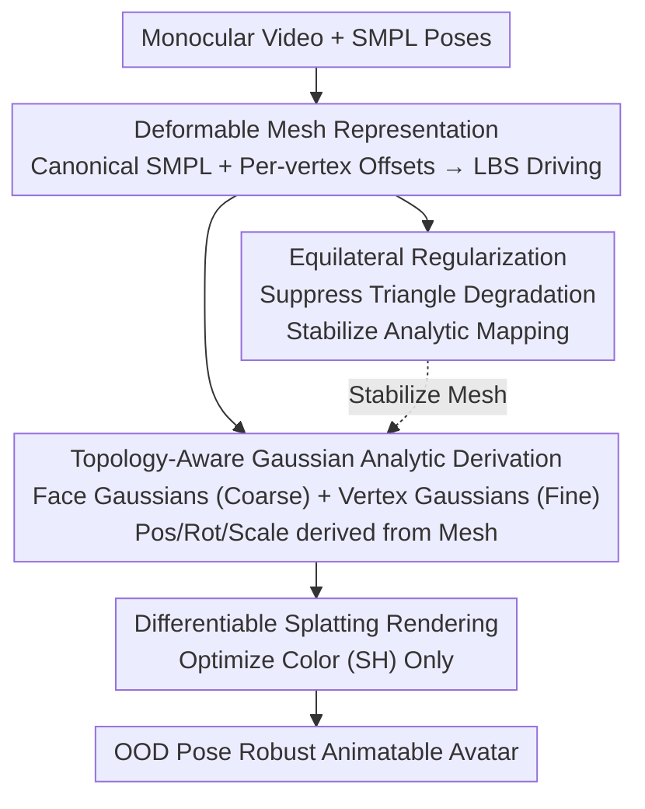

# Tavatar: Topology-Aware Gaussian Attribute Derivation for Animatable Human Avatars

**Conference**: CVPR 2026  
**Paper**: [CVF Open Access](https://openaccess.thecvf.com/content/CVPR2026/html/Luo_Tavatar_Topology-Aware_Gaussian_Attribute_Derivation_for_Animatable_Human_Avatars_CVPR_2026_paper.html)  
**Code**: None (Project page only: https://hailin545.github.io/tavatar/)  
**Area**: 3D Vision / Animatable Digital Humans  
**Keywords**: Gaussian Splatting, Animatable Digital Humans, Topological Consistency, Mesh Binding, OOD Pose Generalization  

## TL;DR
Tavatar no longer treats the rotation and scale of each 3D Gaussian as freely optimized parameters. Instead, it **analytically derives** them from the triangular geometry of the underlying deformable mesh. This anchors Gaussians naturally to the mesh topology, preventing them from detaching or creating holes under unseen complex poses (OOD). Normal error is reduced by 13.8% on X-Avatar and 17.9% on PeopleSnapshot compared to the best baseline, while maintaining competitive rendering quality.

## Background & Motivation

**Background**: Reconstructing animatable human avatars from monocular video primarily combines parametric body models (SMPL) with neural rendering. NeRF-based methods offer high image quality but suffer from slow volume rendering and poor generalization to unseen poses. 3DGS (3D Gaussian Splatting) has become a mainstream choice due to its explicit representation and real-time rendering, with most methods binding Gaussians to SMPL deformations.

**Limitations of Prior Work**: Existing 3DGS-based methods treat Gaussians as "free-floating" entities—position, rotation, and scale are all optimized independently. While this flexibility helps in fitting training poses, it **lacks topological consistency**. During movement, the clothed surface stretches or compresses along with the underlying mesh. If freely optimized Gaussians deviate from the mesh deformation patterns, they overfit to training poses (e.g., simple rotations), resulting in **Gaussian detachment** or **surface holes** under OOD poses (e.g., complex gestures), which severely breaks immersion.

**Key Challenge**: Even recent improvements (e.g., IHuman, GomAvatar) only constrain Gaussian **rotation**, leaving **scale** for free optimization. The authors argue that scale is precisely the key to adapting to OOD poses. When the mesh undergoes large deformations near joints, without topology-aware scale derivation, Gaussians cannot follow the local surface stretching/shrinking, inevitably leading to artifacts. This is a problem of "insufficient partial constraints."

**Core Idea**: Instead of optimizing Gaussian geometric attributes, they should be **analytically derived directly from the mesh geometry**. By analytically anchoring Gaussians to the faces and vertices of the mesh, rotation and scale are calculated from triangular attributes and local edge lengths. This allows each Gaussian to "inherit" the spatial structure and deformation behavior of the mesh, enforcing topological consistency by design.

## Method

### Overall Architecture

Tavatar takes monocular video as input and outputs an animatable Gaussian human avatar robust to OOD poses. The pipeline uses a "deformable mesh" as a geometric scaffold, deriving all Gaussian attributes from this scaffold while leaving only color for optimization. It consists of three parts: first, constructing a **personalized deformable mesh** using a canonical SMPL template plus learned per-vertex offsets, driven by LBS skinning to the target pose; second, **analytically deriving the position/rotation/scale of each Gaussian** on this pose-deformed mesh (Face Gaussians for coarse coverage and Vertex Gaussians for details and seams); finally, using **equilateral regularization** to ensure mesh triangles do not degenerate, as the stability of the analytic mapping relies entirely on mesh quality. Mesh geometry and Gaussian appearance are optimized jointly end-to-end.

### Key Designs

**1. Analytic Gaussian Attribute Derivation: "Calculating" rather than "Learning" scale and rotation from mesh geometry**

This is the core of the paper, directly addressing the detachment of freely optimized Gaussians in OOD poses. The authors designed two types of complementary Gaussians whose geometric attributes $(\mu, R, s)$ are derived analytically and **not included in the optimizer**.

*   *Face Gaussians* manage coarse surface coverage: For each triangle $f_i$, the center is placed at the **incenter** weighted by opposite edge lengths $\mu_f^i = \frac{l_1 v_{i,1} + l_2 v_{i,2} + l_3 v_{i,3}}{l_1 + l_2 + l_3}$; the orientation $R_f^i = [t_1^i, t_2^i, n_f^i]$ aligns with the local coordinate system of the triangle (normal + two orthogonal tangents); the **scale is bound to the incircle radius** $r_i = A_i / s_i$ (where $A_i$ is area and $s_i$ is semi-perimeter), specifically $s_{f,x}^i = s_{f,y}^i = \epsilon \cdot r_i$ and $s_{f,z}^i = \vartheta$ ($\epsilon=0.5$, $\vartheta=10^{-3}$ to compress into a disk), with opacity fixed at 1.0 to ensure complete coverage. As the triangle stretches, the incircle radius increases, and the Gaussian scale follows automatically—exactly the behavior scale should exhibit.

*   *Vertex Gaussians* manage details and seamless transitions at face joints: One per vertex, centered at $\mu_v^j = v_j^p$, with orientation aligned to the **vertex normal** (area-weighted average of neighboring face normals). The scale is set to the **minimum edge length** of the 1-ring neighborhood $s_{v,x}^j = s_{v,y}^j = \varpi \cdot \min_{v_k \in N_1(j)} \lVert v_k^p - v_j^p \rVert$, allowing Gaussian density to adapt to local mesh density.

The total representation includes $M+N$ Gaussians ($M$ faces + $N$ vertices), with **only SH color coefficients being optimized**. The authors also intentionally **abandoned the standard adaptive densification of 3DGS**, as it would break the strict correspondence between Gaussians and the mesh, which is the source of animation stability.

**2. Equilateral Regularization: Stabilizing the analytic mapping by preserving mesh quality**

Since Gaussian scales are analytically bound to local mesh geometry (incircles for faces, edge lengths for vertices), mesh distortions introduced by LBS near joints (such as long, thin triangles) would **directly propagate to Gaussian attributes**. Degenerate triangles produce extreme scale values and rendering instability. This design blocks this propagation.

The authors apply an equilateral constraint to the personalized mesh $M_s$: $L_{tri} = \sum_{f \in F_s}\big(\mathrm{Var}(\{\lVert e_1\rVert, \lVert e_2\rVert, \lVert e_3\rVert\}) + \sum_{\theta \in \Theta_f}(1 - \cos\theta)^2\big)$. It consists of two terms: an **edge length variance term** forcing edges to be equal, and an **angle term** punishing deviations from 60°. Together, they prevent triangle degradation, ensuring that Gaussian scale/rotation derived from the mesh remain stable and surface coverage remains complete. Combined with standard Laplacian smoothing and normal consistency $L_{mesh}$, the mesh stays well-conditioned even during large deformations and in fine areas like hands or clothing folds.

### Loss & Training

Two sets of variables are optimized end-to-end: the parameters of the shape encoder $E_s$ (multi-resolution hash encoding predicting per-vertex offsets) and the SH color coefficients of all Gaussians. Geometric attributes $(\mu, R, s)$ are **never optimized**. Photometric loss $L_{rgb}$ and normal loss $L_{normal}$ use a combination of L1 + SSIM ($\lambda_{SSIM}=0.2$). Normals are supervised by pseudo-GT from a pre-trained Sapiens estimator. The total objective is $L_{total} = L_{rgb} + \lambda_n L_{normal} + \lambda_m L_{mesh} + \lambda_t L_{tri}$ ($\lambda_n=0.05, \lambda_m=0.01, \lambda_t=0.01$). Training takes 2000 iters per subject on a single RTX-3090 using Adam ($lr = 10^{-3}$).

## Key Experimental Results

Datasets: **PeopleSnapshot** (24 subjects, simple rotations, testing in-distribution reconstruction) and **X-Avatar** (12 subjects, complex motions, large gap between train/test poses, testing OOD generalization, includes GT meshes). Metrics: Rendering quality (PSNR/SSIM/LPIPS); geometric accuracy via Normal error (using Sapiens pseudo-GT for all methods); and **predictor-independent** metrics for X-Avatar like Chamfer Distance (CD) and Point-to-Surface (P2S). Baselines: 3DGS-based GART / IHuman / GomAvatar, and NeRF-based InstantAvatar.

### Main Results: Geometric Accuracy (Core Strength)

| Dataset | Metric | Ours | Best Baseline | Gain |
| :--- | :--- | :--- | :--- | :--- |
| PeopleSnapshot | Normal ↓ | 1.687 | IHuman 2.055 | −17.9% |
| X-Avatar | Normal ↓ | 1.772 | IHuman 2.056 (P2S) / ~2.0 | −13.8% |
| X-Avatar | CD ↓ | 0.111 | IHuman 0.132 | Significantly lower |
| X-Avatar | P2S ↓ | 0.107 | IHuman 0.126 | Significantly lower |

Geometric metrics lead across the board, validating the core hypothesis: deriving Gaussian attributes analytically from mesh topology ensures geometric consistency during animation. Qualitatively, GART/IHuman show floating Gaussians and surface holes under OOD poses, while Tavatar's Gaussians remain structured and strictly follow mesh deformations.

### Main Results: Rendering Quality (SOTA on X-Avatar, trade-offs on PeopleSnapshot)

| Dataset | Subset | Metric | Ours | Comparison |
| :--- | :--- | :--- | :--- | :--- |
| X-Avatar | 00016 | PSNR ↑ | 29.03 | GomAvatar 28.86 |
| X-Avatar | 00019 | SSIM ↑ | 0.9813 | GomAvatar 0.9772 |
| PeopleSnapshot | male-3 | PSNR ↑ | 28.93 | GART 30.21 (Higher) |
| PeopleSnapshot | male-3 | LPIPS ↓ | 0.0168 | Best in class |

Tavatar achieves SOTA rendering quality on X-Avatar's OOD poses. On PeopleSnapshot's simple rotations, GART's PSNR is slightly higher—the authors explain that free-floating Gaussians overfit more easily to simple motions, which highlights Tavatar’s trade-off: sacrificing minor fitting flexibility for significant OOD robustness.

### Ablation Study (X-Avatar subject 00019)

| Configuration | PSNR ↑ | SSIM ↑ | Normal ↓ | CD ↓ | Description |
| :--- | :--- | :--- | :--- | :--- | :--- |
| w/o FG | 26.89 | 0.9721 | 2.143 | 0.128 | No Face Gaussians; sparse representation with rendering holes. |
| w/o VG | 25.67 | 0.9654 | 2.687 | 0.145 | No Vertex Gaussians; lost details and discontinuities at seams. |
| w/o ER | 27.83 | 0.9798 | 1.834 | 0.115 | No Equilateral Reg; mesh degradation and misaligned Gaussians. |
| Full | **28.11** | **0.9813** | **1.772** | **0.111** | Complete model. |

### Key Findings
- **Face Gaussians handle coarse geometric integrity**: Without them, even making vertex scales learnable (similar to IHuman) results in sparse representations and obvious rendering holes, showing that analytically derived Face Gaussians are indispensable.
- **Vertex and Face Gaussians are complementary**: Removing Vertex Gaussians caused the largest performance drop (PSNR 25.67, Normal 2.687), with broken details and seams, proving the synergistic value of the dual-primitive design.
- **Equilateral Regularization is the "foundation" for analytic mapping**: Removing it causes mesh degradation, which invalidates the analytic mapping and leads to chaotic Gaussian distributions—confirming the principle that "analytical derivation stability = mesh geometry quality."

## Highlights & Insights
- **Paradigm Shift: From "Optimizing" to "Deriving" Gaussians**. Turning scale/rotation from learnable parameters into analytic functions of mesh geometry is a clean approach—it makes topological consistency "by design" rather than a soft constraint via loss, which is the root cause of its OOD robustness.
- **Capturing the Overlooked Scale**. Previous works only constrained rotation, which is an "incomplete constraint." The authors highlight that scale is the key to adapting to large deformations and provide intuitive geometric derivations (incircle radius/minimum edge length).
- **Intentionally Abandoning Densification is a Strength**. To maintain a strict 1:1 correspondence between Gaussians and the mesh, they sacrifice 3DGS's densification. This "counter-intuitive" trade-off gains animation stability, suggesting a design philosophy: balancing expressive power vs. structural constraints.
- **Transferable Equilateral Regularization**: Any method binding primitive attributes to local mesh geometry faces the risk of primitives exploding due to triangle degradation. Minimizing edge length variance and 60° angle deviation is a lightweight, universal solution.

## Limitations & Future Work
- **Heavy reliance on the fitting quality of the parametric body model**: Accuracy is coupled with the initial body model fitting; inaccurate SMPL fitting directly drags down avatar quality.
- **Fixed mesh topology**: Inheriting SMPL's canonical topology makes it difficult to handle geometry that significantly deviates from the human mesh, such as loose clothing or long hair; the authors suggest integrating physics-based dynamic clothing in the future.
- ⚠️ The reported 13.8% geometric improvement on X-Avatar is relative to the "best baseline," but Tab. 3 shows that different baselines lead in different metrics (IHuman is best in normal but GART/GomAvatar lead elsewhere); care is needed when comparing metrics across methods.
- Only tested on monocular video with 2000 iters per subject; cross-identity generalization or reusability was not reported.

## Related Work & Insights
- **vs. IHuman**: IHuman uses mesh normals to constrain Gaussian **rotation**, but scale is still freely optimized, leading to surface inconsistency under large deformations. Tavatar includes scale in the analytic derivation, completing the constraint.
- **vs. GomAvatar**: GomAvatar binds Gaussians to the SMPL surface but **lacks mesh quality regularization**. When triangles distort, scales become unstable. Tavatar's equilateral regularization specifically addresses this for stable analytic mapping.
- **vs. GART**: GART uses free-floating Gaussians, achieving higher PSNR on simple poses (PeopleSnapshot), but suffers from severe detachment and holes under OOD poses. Tavatar sacrifices minor fitting accuracy in simple scenes for robust generalization in complex poses.

## Rating
- Novelty: ⭐⭐⭐⭐☆ The shift from optimization to analytic derivation of Gaussian attributes is a clear paradigm change that addresses the overlooked scale factor cleanly.
- Experimental Thoroughness: ⭐⭐⭐⭐☆ Tested on two datasets with photometric and geometric (CD/P2S) metrics and complete ablations, though only 4 subjects per dataset were detailed and cross-identity generalization was not tested.
- Writing Quality: ⭐⭐⭐⭐☆ The motivation (insufficient constraints → scale is key) and methodology are clearly articulated with complete formulas.
- Value: ⭐⭐⭐⭐☆ High practical value for OOD-robust animatable avatars; the geometric-driven binding and equilateral regularization are transferable designs.

<!-- RELATED:START -->

## Related Papers

- [\[CVPR 2026\] ActAvatar: Temporally-Aware Precise Action Control for Talking Avatars](actavatar_temporally-aware_precise_action_control_for_talking_avatars.md)
- [\[ICCV 2025\] Avat3r: Large Animatable Gaussian Reconstruction Model for High-fidelity 3D Head Avatars](../../ICCV2025/human_understanding/avat3r_large_animatable_gaussian_reconstruction_model_for_hi.md)
- [\[AAAI 2026\] Generating Attribute-Aware Human Motions from Textual Prompt](../../AAAI2026/human_understanding/generating_attribute-aware_human_motions_from_textual_prompt.md)
- [\[CVPR 2026\] Gaussian-Mixture Latent Flow for Stochastic 3D Human Motion Prediction](gaussian-mixture_latent_flow_for_stochastic_3d_human_motion_prediction.md)
- [\[CVPR 2026\] Egocentric Visibility-Aware Human Pose Estimation](egocentric_visibility-aware_human_pose_estimation.md)

<!-- RELATED:END -->
