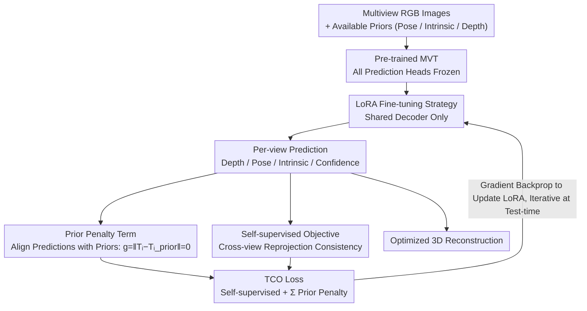

# Learning 3D Reconstruction with Priors in Test Time

**Conference**: CVPR 2026  
**arXiv**: [2604.03878](https://arxiv.org/abs/2604.03878)  
**Code**: [https://github.com/cvlab-stonybrook/TCO](https://github.com/cvlab-stonybrook/TCO)  
**Area**: 3D Reconstruction  
**Keywords**: test-time optimization, 3D reconstruction, multiview transformer, camera pose, LoRA

## TL;DR

A Test-Time Constrained Optimization (TCO) framework is proposed. Without retraining or modifying pre-trained multiview Transformer architectures, it significantly improves 3D reconstruction accuracy by optimizing priors (camera pose, intrinsics, depth) as prediction constraints during inference.

## Background & Motivation

Feed-forward multiview Transformers (MVTs) such as DUSt3R, VGGT, and $\pi^3$ can output depth maps, camera poses, and intrinsics from multiple RGB images in a single forward pass. However, these models inherently accept only RGB inputs and cannot utilize additional prior information (e.g., camera poses from COLMAP or depth maps from LiDAR).

Existing methods (e.g., Pow3R, MapAnything) modify architectures to incorporate priors as extra inputs. However, these methods are tied to specific architectures and prior types, requiring retraining every time the backbone or prior type changes, which is both inflexible and computationally expensive.

The Key Insight of TCO: Instead of feeding priors as inputs to the network, they are treated as constraints on the output, and the network is optimized at inference time to satisfy these constraints.

## Method

### Overall Architecture

Feed-forward MVTs (like DUSt3R, VGGT, $\pi^3$) output depth, pose, and intrinsics from multiple RGB images in one go, but they only accept RGB inputs, leaving available priors like COLMAP poses or LiDAR depth unused. The core idea of TCO is a shift in perspective: instead of modifying the architecture to feed priors as inputs (as in Pow3R or MapAnything, which requires retraining for new backbones or priors), priors are treated as constraints on the output. The network is optimized at test time to meet these constraints. Specifically, the pre-trained MVT is frozen, and only a shared decoder is fine-tuned using LoRA. The objective function consists of two parts: "self-supervised compatibility + prior penalty." During test time, the process involves repeated forward passes, loss calculation, and gradient backpropagation to update LoRA parameters iteratively, ultimately outputting a 3D reconstruction that is both consistent and satisfies the priors.

### Key Designs

**1. Prior Penalty Term: Priors as Output Constraints Rather Than Inputs**

Traditional approaches concatenate priors into the network input, rigidly coupling the prior type with the backbone architecture. TCO reverses this by transforming each available prior directly into an output constraint for the corresponding prediction modality: camera pose priors are expressed as $g = \|T_i - T_i^{prior}\| = 0$, and depth priors are treated similarly. Since constraints are applied at the MVT output, changing the backbone or adding new priors requires neither structural modification nor retraining.

**2. Self-supervised Objective (Prediction Compatibility): Preventing Objective Overfitting**

Optimizing solely with prior penalties might cause the network to overfit to those few priors, degrading the rest of the 3D structure. The self-supervised objective complements these constraints by measuring compatibility between multi-view predictions using photometric or geometric losses—rendering one view from others and checking consistency with the view itself. This forces the optimization to maintain overall 3D reconstruction coherence while satisfying priors.

**3. LoRA Fine-tuning Strategy: Synergetic Modalities via Shared Decoder**

Fine-tuning all parameters is slow and prone to instability. TCO freezes all prediction heads and uses zero-initialized LoRA to fine-tune only the shared decoder, ensuring fewer parameters and faster convergence. Crucially, as predictions for different modalities share this representation layer, a prior in one modality can improve predictions in others through the shared representation—for instance, pose priors can indirectly assist depth estimation.

### Loss & Training

Test-time optimization loss = Self-supervised compatibility objective + $\sum$ Prior penalty terms. Self-supervised objectives can utilize photometric loss (reprojection consistency) or geometric loss (point cloud alignment). LoRA parameters are initialized from zero for rapid convergence.

## Key Experimental Results

### Main Results

| Dataset | Metric | Ours (TCO) | Base Model | Gain |
|--------|------|----------|---------|------|
| ETH3D | Pointmap distance error | Reduced >50% | image-only MVT | Significant |
| 7-Scenes | Pointmap distance error | Reduced >50% | image-only MVT | Significant |
| NRGBD | Pointmap distance error | Reduced >50% | image-only MVT | Significant |

### Ablation Study

| Configuration | Key Metric | Description |
|------|---------|------|
| Prior penalty only (No self-supervision) | Poor performance | Prone to overfitting priors |
| Self-supervision only (No prior) | Improved | Inferior to combined use |
| Full parameter fine-tuning | Unstable | LoRA is superior |

### Key Findings

- TCO not only significantly outperforms the base image-only model but also surpasses prior-aware feed-forward methods that require retraining (e.g., Pow3R, MapAnything).
- TCO effectively utilizes priors even when only a subset of them is available.
- The self-supervised objective is critical for preventing overfitting.

## Highlights & Insights

- Plug-and-play design: TCO can be applied to any pre-trained MVT without architecture modification or retraining.
- The perspective shift of "priors as constraints rather than inputs" is elegant.
- The strategy of fine-tuning the shared decoder with LoRA cleverly exploits inter-modality synergy.
- It aligns with the broader trend of test-time compute scaling.

## Limitations & Future Work

- Test-time optimization introduces additional inference latency.
- The quality of priors directly impacts optimization; noisy priors may be detrimental.
- Validation has primarily focused on indoor scenes; applicability to large-scale outdoor scenes remains to be explored.

## Related Work & Insights

- Consistent in spirit with test-time fine-tuning methods like Test3R and TTT3R, but TCO is more general.
- Provides inspiration for other 3D tasks requiring the integration of multi-modal priors.

## Rating

- Novelty: ⭐⭐⭐⭐ — The idea of treat priors as constraints rather than inputs is novel.
- Technical Depth: ⭐⭐⭐⭐ — Reasonable combined design of self-supervision + prior constraints + LoRA.
- Experimental Thoroughness: ⭐⭐⭐⭐ — Verified across multiple datasets and prior types.
- Value: ⭐⭐⭐⭐ — High versatility due to its plug-and-play nature.

<!-- RELATED:START -->

## Related Papers

- [\[CVPR 2026\] tttLRM: Test-Time Training for Long Context and Autoregressive 3D Reconstruction](tttlrm_test-time_training_for_long_context_and_autoregressive_3d_reconstruction.md)
- [\[CVPR 2026\] ZipMap: Linear-Time Stateful 3D Reconstruction via Test-Time Training](zipmap_linear-time_stateful_3d_reconstruction_via_test-time_training.md)
- [\[CVPR 2026\] Low-Rank Test-Time Training for Pre-Trained Point Cloud Models](low-rank_test-time_training_for_pre-trained_point_cloud_models.md)
- [\[CVPR 2026\] Rethinking Dense Optical Flow without Test-Time Scaling](rethinking_dense_optical_flow_without_test-time_scaling.md)
- [\[CVPR 2026\] Scene Reconstruction as Mapping Priors for 3D Detection](scene_reconstruction_as_mapping_priors_for_3d_detection.md)

<!-- RELATED:END -->
