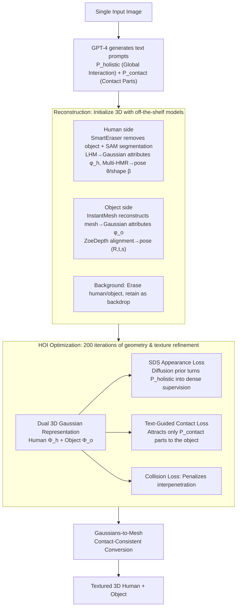

# TeHOR: Text-Guided 3D Human and Object Reconstruction with Textures

## Basic Information

- **Conference**: CVPR 2026
- **arXiv**: [2602.19679](https://arxiv.org/abs/2602.19679)
- **Code**: [Project Page](https://hygenie1228.github.io/TeHOR/)
- **Area**: 3D Vision / Human-Object Reconstruction
- **Keywords**: 3D Human-Object Reconstruction, Text-Guided Optimization, Score Distillation Sampling, 3D Gaussian Splatting, Human-Object Interaction

## TL;DR

TeHOR utilizes text descriptions as semantic guidance to jointly optimize the geometry and texture of 3D humans and objects through Score Distillation Sampling from pre-trained diffusion models. It breaks the reliance of traditional methods on contact information, achieving accurate and semantically consistent 3D reconstruction for both contact-based and non-contact interactions.

## Background & Motivation

Jointly reconstructing 3D humans and objects from a single image is a critical task for human behavior understanding, with broad applications in robotics, AR/VR, and digital content creation. Existing methods face two fundamental limitations:

**Over-reliance on contact information**: Current approaches (e.g., PHOSA, CONTHO, InteractVLM) primarily use human-object contact regions as the core cue for interaction reasoning, enforcing geometric proximity through iterative fitting. However, many real-world interactions are non-contact (e.g., gazing, pointing), rendering contact information ineffective. Furthermore, incorrect contact predictions directly lead to reconstruction failure.

**Neglecting global appearance context**: The fitting process in existing methods is mainly driven by local geometric proximity, ignoring global interaction context provided by appearance cues (colors, shadows, etc.). This leads to globally implausible results, such as incorrect object orientations or misaligned human eye contact.

## Method

### Overall Architecture

TeHOR aims to reconstruct 3D humans and objects with textures from a single image. The challenge lies in the fact that current methods rely entirely on "contact" for reasoning, which fails for non-contact actions like gazing or pointing. The core insight is to integrate "textual semantics" into the optimization loop: first, off-the-shelf models are used to initialize the 3D human, object, and background; then, a text description drives multi-view optimization to ensure correct orientations and poses even without contact cues.

The workflow consists of two stages. The **Reconstruction phase** handles initialization: GPT-4 extracts two types of text prompts from the input image—$P_{\text{holistic}}$ (global interaction description, e.g., "a person riding a bicycle on grass") and $P_{\text{contact}}$ (contacting body parts, e.g., "right hand, left hand"). For the human, SmartEraser removes the object, SAM segments the human, and LHM generates initial 3D Gaussian attributes $\phi_h$ (40,000 anchors sampled uniformly on the SMPL-X surface), while Multi-HMR estimates pose $\theta$ and shape $\beta$. For the object, InstantMesh (Zero123++ to 6-views $\rightarrow$ Triplane network) reconstructs the mesh, which is converted to Gaussian attributes $\phi_o$, and ZoeDepth provides depth alignment for pose $(R, t, s)$. The background is processed by erasing humans and objects to serve as a rendering backdrop. The **HOI optimization phase** then performs 200 iterations of joint refinement for geometry and texture.

### Key Designs

**1. Dual 3D Gaussian Representation: Enabling Appearance-Driven Optimization**

Humans and objects are represented by 3D Gaussian sets $\Phi_h$ and $\Phi_o$ instead of traditional meshes. Human Gaussians are parameterized by attributes $\phi_h$, pose $\theta$, and shape $\beta$, with anchors defined on the canonical SMPL-X surface and driven by LBS (using original skinning weights for hands/face and neighborhood averaging otherwise). Object Gaussians are defined by $\phi_o$ and pose $(R, t, s)$ in standard space. Gaussians are chosen over meshes because they model higher-fidelity visual details for appearance losses and provide richer gradient signals, while their topology-free nature facilitates spatial relationship optimization.

**2. SDS Appearance Loss: Distilling Text into Dense Spatial Supervision**

This is the core of the method. While contact information is localized, TeHOR employs a global text $P_{\text{holistic}}$ as supervision. Through Score Distillation Sampling (SDS), the visual prior of pre-trained StableDiffusion-v2.1 is injected into the optimization:

$$\nabla_{\Phi}\mathcal{L}_{\text{appr}} = \mathbb{E}\left[w_t\left(\hat{\epsilon}_t(\mathbf{x}_t; P_{\text{holistic}}) - \epsilon_t\right)\frac{\partial \mathbf{x}_t}{\partial \Phi}\right]$$

where $t$ is the noise level, $\mathbf{x}_t$ is the noisy rendered image, and $w_t$ is the weighting factor. The loss forces the rendering to align with the "reasonable appearance distribution given the text." Views are sampled uniformly in spherical coordinates $(r, \upsilon, \psi)$. SDS provides pixel-level dense gradients, which are more effective for constraining fine-grained spatial relationships than global vector encodings like CLIP (replacing SDS with CLIP dropped object CD from 16.701 to 18.504).

**3. Text-Guided Contact Loss: Targeted Proximity**

To utilize useful contact cues without being misled by errors, TeHOR uses $P_{\text{contact}}$ to identify specific Gaussian centers $V_{h,c}$ and attracts them to the nearest object points:

$$\mathcal{L}_{\text{contact}} = \frac{1}{|V_{h,c}|}\sum_{v_h \in V_{h,c}} d(v_h, V_o) \cdot \mathbb{1}[d(v_h, V_o) < \tau]$$

The threshold $\tau = 10$ cm and indicator function ensure gradients are only applied to points already near the object, preventing the "hard dragging" of irrelevant distant points—maintaining local physical plausibility without ruining the entire reconstruction via one incorrect contact prediction.

**4. Collision Loss: Preventing Interpenetration**

Since appearance and contact constraints do not inherently prevent overlap, a collision penalty is added by calculating the ratio of human vertices inside the object mesh, ensuring physical feasibility.

**5. Gaussians-to-Mesh Contact-Consistent Conversion: Fair Comparison**

For evaluation against mesh-based methods, Gaussians are converted back to mesh. Since Gaussians may drift from the base mesh, contact regions can become misaligned. The solution identifies contact regions (distance < 5 cm) and minimizes the gap between corresponding mesh vertices to zero to produce contact-consistent mesh outputs.

### Loss & Training

The total loss is the weighted sum of four components:

$$\mathcal{L} = \mathcal{L}_{\text{recon}} + \mathcal{L}_{\text{appr}} + \mathcal{L}_{\text{contact}} + \mathcal{L}_{\text{collision}}$$

$\mathcal{L}_{\text{recon}}$ is the MSE between front-view renderings and the input image (including RGB reconstruction error and silhouette/mask error). The HOI optimization phase consists of 200 iterations.

## Main Results

### Comparison with SOTA (Tab. 4)

| Method | CD↓_human (O3D) | CD↓_obj (O3D) | Contact↑ (O3D) | Coll.↓ (O3D) | CD↓_human (BH) | CD↓_obj (BH) | Contact↑ (BH) |
|------|:---:|:---:|:---:|:---:|:---:|:---:|:---:|
| PHOSA | 5.342 | 49.180 | 0.243 | 0.044 | 5.758 | 46.003 | 0.257 |
| LEMON+PICO | 5.948 | 25.889 | 0.335 | 0.078 | 6.159 | 22.585 | 0.082 |
| InteractVLM | 5.252 | 24.238 | 0.392 | 0.054 | 5.770 | 19.197 | 0.379 |
| HOI-Gaussian | 5.111 | 19.363 | 0.348 | 0.070 | 5.748 | 21.774 | 0.371 |
| **Ours (TeHOR)** | **4.941** | **16.701** | **0.412** | **0.047** | **5.615** | **17.339** | **0.412** |

The method outperforms all SOTA baselines. On Open3DHOI, object CD improved from 19.363 to 16.701 (↓13.7%), and Contact F1 increased from 0.392 to 0.412.

### Evaluation on Non-Contact Scenarios (Tab. 5)

| Method | CD↓_human | CD↓_object | Collision↓ |
|------|:---:|:---:|:---:|
| PHOSA | 5.401 | 65.537 | 0.028 |
| InteractVLM | 5.390 | 46.819 | 0.011 |
| HOI-Gaussian | 5.244 | 25.374 | 0.037 |
| **Ours (TeHOR)** | **4.958** | **17.546** | **0.005** |

The advantage is even more pronounced in non-contact scenarios, where object CD improved by 30.8% (25.374 → 17.546), validating the importance of text-guided semantic guidance.

## Ablation Study

**Effect of Text-Guided Optimization (Tab. 1)**:

| Set | CD↓_human | CD↓_obj | Contact↑ | Collision↓ |
|------|:---:|:---:|:---:|:---:|
| Pre-optimization | 5.252 | 31.268 | 0.305 | 0.040 |
| Opt. (w/o Text) | 5.028 | 20.348 | 0.374 | 0.052 |
| **Opt. (Full)** | **4.941** | **16.701** | **0.412** | **0.047** |

**Loss Function Configuration (Tab. 2)**:

| $\mathcal{L}_{\text{appr}}$ | $\mathcal{L}_{\text{contact}}$ | CD↓_obj | Contact↑ |
|:---:|:---:|:---:|:---:|
| ✗ | ✓ | 22.094 | 0.330 |
| ✓ | ✗ | 19.849 | 0.374 |
| CLIP Substitute | ✓ | 18.504 | 0.366 |
| **✓ (SDS)** | **✓** | **16.701** | **0.412** |

**Key Findings**: SDS appearance loss significantly outperforms CLIP loss, as CLIP lacks the ability to model dense spatial relationships, whereas SDS provides pixel-level dense gradients.

## Highlights & Insights

- **Breaking the Contact-Dependency Paradigm**: First to introduce text descriptions into joint 3D human-object reconstruction, enabling reasoning for non-contact interactions.
- **SDS Appearance Optimization**: Leverages diffusion model priors for fine-grained semantic alignment via multi-view SDS, which is empirically superior to CLIP.
- **First Joint Texture Reconstruction**: Claims to be the first framework to simultaneously reconstruct complete 3D textures for both humans and objects, allowing for direct creation of immersive digital assets.
- **Robust Experimental Design**: Separately evaluates general and non-contact scenarios, with five sets of ablations confirming the effectiveness of each component.

## Limitations & Future Work

- High dependency on multiple external models (GPT-4, StableDiffusion, LHM, InstantMesh), leading to a long inference chain and high costs.
- Computational efficiency is low, at approximately 134 seconds per sample (RTX 8000), making real-time applications difficult.
- Appearance loss primarily provides global guidance and lacks supervision for local details (e.g., small accessories or subtle surface deformations).
- Absence of quantitative evaluation metrics for texture quality (lack of 3D HOI datasets with joint geometry and texture labels).

## Rating

⭐⭐⭐⭐ — Clearly identifies fundamental limitations of existing methods (contact dependency and lack of global appearance context). The proposed text-guided SDS optimization is novel and effective. Achieves SOTA across general and non-contact scenarios. Deductions are mainly for optimization efficiency and complexity of the model dependency chain.

<!-- RELATED:START -->

## Related Papers

- [\[ICCV 2025\] StrandHead: Text to Hair-Disentangled 3D Head Avatars Using Human-Centric Priors](../../ICCV2025/3d_vision/strandhead_text_to_hair-disentangled_3d_head_avatars_using_human-centric_priors.md)
- [\[ICCV 2025\] PlaceIt3D: Language-Guided Object Placement in Real 3D Scenes](../../ICCV2025/3d_vision/placeit3d_language-guided_object_placement_in_real_3d_scenes.md)
- [\[CVPR 2025\] Multi-view Reconstruction via SfM-guided Monocular Depth Estimation](../../CVPR2025/3d_vision/multi-view_reconstruction_via_sfm-guided_monocular_depth_estimation.md)
- [\[ICCV 2025\] MemoryTalker: Personalized Speech-Driven 3D Facial Animation via Audio-Guided Stylization](../../ICCV2025/3d_vision/memorytalker_personalized_speech-driven_3d_facial_animation_via_audio-guided_sty.md)
- [\[ICCV 2025\] RapVerse: Coherent Vocals and Whole-Body Motion Generation from Text](../../ICCV2025/3d_vision/rapverse_coherent_vocals_and_whole-body_motion_generation_from_text.md)

<!-- RELATED:END -->
