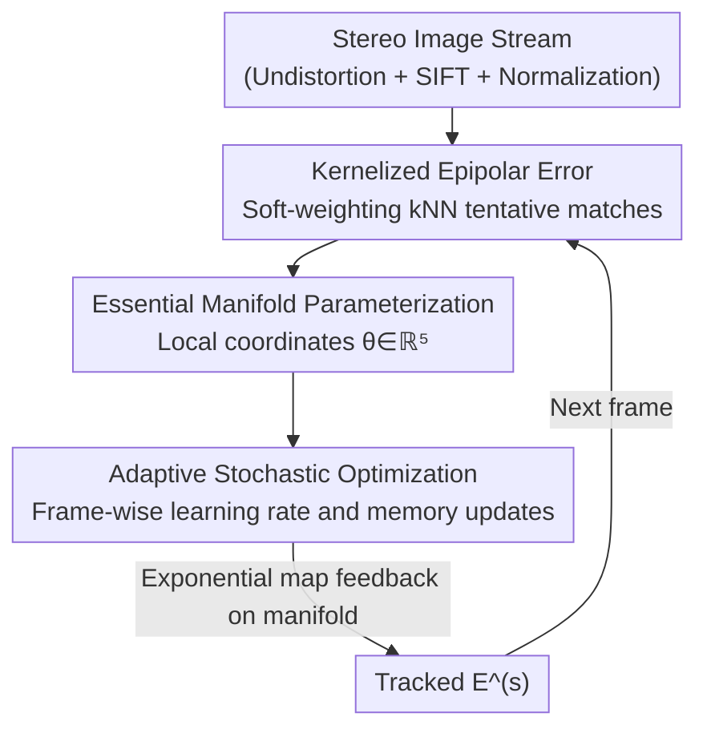

# TESO: Online Tracking of Essential Matrix by Stochastic Optimization

**Conference**: CVPR 2026  
**arXiv**: [2604.19420](https://arxiv.org/abs/2604.19420)  
**Code**: https://github.com/moravecj/teso (Available)  
**Area**: 3D Vision / Multi-view Geometry / Online Calibration  
**Keywords**: Essential Matrix, Online Stereo Calibration, Kernel Correlation, Stochastic Optimization, Epipolar Geometry

## TL;DR
TESO models the online extrinsic calibration of stereo cameras as "adaptive stochastic optimization of a robust kernelized epipolar error on the essential matrix manifold." Without any training data and with only two hyperparameters, it tracks camera calibration drifts in real-time with 0.12°-level accuracy, achieving single-frame optimization precision comparable to neural-network-based methods.

## Background & Motivation
**Background**: Multi-sensor systems such as those in autonomous driving and robotics rely heavily on precise geometric registration (relative pose) between cameras. The current mainstream approach is offline calibration—fixing extrinsic parameters once in a controlled calibration room.

**Limitations of Prior Work**: Deployed systems experience slow drift or sudden shifts in relative sensor poses due to mechanical vibration, moving parts, temperature fluctuations, and material wear. Recalibration requires returning the vehicle to specialized facilities, leading to downtime and high costs. Therefore, it is necessary to track the evolution of calibration parameters over time **online**. However, online scenarios demand low latency and can only use small data batches for parameter updates, making optimization highly sensitive to informational fluctuations in the sequence—some scenes (highways, repetitive textures, distant views) provide almost no valid constraints.

**Key Challenge**: The fundamental difficulty of online calibration tracking is **simultaneously ensuring fast and stable convergence on small-batch data with fluctuating information content**. Existing methods mostly focus on "selecting more robust feature extractors" or "robust estimators (RANSAC/learning models)" using complex outlier rejection to combat noisy matches.

**Goal**: Construct a low-overhead method that is robust to scene changes and capable of real-time tracking of non-stationary calibration parameters, specifically applied to stereo epipolar geometry (essential matrix).

**Key Insight**: The authors adopt a different perspective—instead of explicitly rejecting outliers, they **make the loss function naturally robust**. Kernel correlation is used to soft-weight tentative matches, ensuring outliers are automatically down-weighted. Optimization is performed directly on the essential matrix manifold to preserve the geometric invariants of epipolar geometry.

**Core Idea**: Replace "robust estimators + outlier rejection + learning models" with "kernelized epipolar error + adaptive stochastic optimization on the essential manifold," making online calibration tracking a lightweight, training-free, and practically parameter-free optimization process.

## Method

### Overall Architecture
TESO aims to solve the following: given a stereo image stream, output the essential matrix $\mathbf{E}$ (encoding relative rotation $\mathbf{R}$ and translation direction $\mathbf{t}$ between two cameras, totaling 5 degrees of freedom) evolving over time. The pipeline is: undistortion using the OpenCV polynomial model → SIFT keypoint detection and descriptor extraction → normalization to camera coordinates using respective intrinsic matrices $\mathbf{K}_j$ → calculating a robust loss for all tentative matches (kNN) between left and right images using **kernelized epipolar error** → updating $\mathbf{E}$ on the essential manifold via **stochastic second-order optimization with an adaptive learning rate** for frame-by-frame tracking. The process starts from a reference essential matrix $\mathbf{E}^{(0)}=\mathbf{E}^{\text{ref}}$ obtained from an offline session and subsequently relies on the data stream for adaptive corrections.

The two primary contributions are the "kernelized epipolar error" and the "adaptive stochastic optimization on the essential manifold"; undistortion, SIFT, and normalization are general preprocessing components—the paper even explicitly states that the choice of keypoint detector is not critical (as kernel correlation tolerates outliers).

### Key Designs

**1. Kernelized Epipolar Error: Embedding outlier tolerance directly into the loss to eliminate explicit outlier rejection**

Tentative matches contain many outliers, which traditional methods remove using robust estimators like RANSAC. TESO does the opposite—using kernel correlation to make the loss function inherently insensitive to outliers. The epipolar constraint is $\mathbf{y}^\top \mathbf{E}\mathbf{x}=0$ (in normalized coordinates, corresponding points should lie on each other's epipolar lines). TESO does not minimize the residual directly; instead, it wraps the residual in a Gaussian kernel and takes the negative sum (the smaller, the better):

$$\mathcal{L}(\theta\,|\,\mathbf{X},\mathbf{Y})=-\sum_{\mathbf{x}\in\mathbf{X}}\sum_{\mathbf{y}\in\text{NN}^1(\mathbf{x})}\exp\!\left[-\frac{(\mathbf{y}^\top\mathbf{E}(\theta)\mathbf{x})^2}{2\sigma^2}\right]-\sum_{\mathbf{y}\in\mathbf{Y}}\sum_{\mathbf{x}\in\text{NN}^0(\mathbf{y})}\exp\!\left[-\frac{(\mathbf{y}^\top\mathbf{E}(\theta)\mathbf{x})^2}{2\sigma^2}\right]$$

Rather than hard matching, $k=5$ nearest neighbors are taken in the descriptor space for each keypoint ($\text{NN}^1, \text{NN}^0$ bidirectional), and all these candidate pairs are fed into the kernel. An outlier with a large epipolar residual results in an $\exp[-\cdot]$ value near 0, contributing almost nothing to the loss; an inlier with a small residual yields a kernel value near 1, dominating the optimization. The hyperparameter $\sigma$ controls the width of the basin of attraction and final precision; the authors set it to the pixel angular resolution of the camera (vertical FoV/height, 0.001 for CARLA/MAN and 0.00075 for KITTI). This design offers two direct benefits: the keypoint detector choice is no longer critical (simple and fast detectors suffice), and explicit outlier rejection or learned matchers are completely unnecessary.

**2. Five-parameter Localization of the Essential Matrix Manifold: Optimization within a geometrically correct space**

An essential matrix has 5 observable degrees of freedom (baseline scale does not affect $\mathbf{y}^\top\mathbf{E}\mathbf{x}=0$, so translation is only by direction). To keep $\mathbf{E}$ valid throughout iterations (avoiding optimization into a matrix that does not satisfy $\mathbf{E}=[\mathbf{t}]_\times\mathbf{R}$), TESO adopts the manifold parameterization from [18]: $\mathbf{E}$ is decomposed via SVD into $\mathbf{E}=\mathbf{U}\Sigma_0\mathbf{V}^\top$ (normalized $\Sigma_0=\mathrm{diag}(1,1,0)$), and 5 local parameters $\theta\in\mathbb{R}^5$ are used via the matrix exponential of two skew-symmetric matrices: $\mathbf{E}(\theta)=\mathbf{U}\,\text{expm}[\Omega_1(\theta)]\,\Sigma_0\,\text{expm}[-\Omega_2(\theta)]\,\mathbf{V}^\top$. Updates are applied only to $\mathbf{U}$ and $\mathbf{V}$ (each multiplied by an exponential map) to synthesize the new $\mathbf{E}^{(s)}$. This ensures every iteration yields a valid essential matrix, naturally expressing "calibration tracking" as "trajectory tracking on a manifold" while preserving the geometric invariants of rotation/translation direction.

**3. Adaptive Stochastic Optimization: Balancing "fast convergence" and "shift resistance" via self-adjusting learning rate and memory length**

In online scenarios, calibration parameters represent a non-stationary stochastic process that may drift slowly or shift abruptly. TESO borrows the adaptive learning rate stochastic optimization from Schaul et al. [29]: for each parameter $\theta_i$, it estimates the gradient mean $g_i$, Hessian diagonal $h_i$, and raw second moment of the gradient $v_i$ using exponential moving averages. The update amount interpolates between a quasi-Newton step and a gradient descent step:

$$\Delta\theta_i^{(s)}=-\nu_i\,\frac{1}{h_i^{(s)}}\,\frac{\partial\mathcal{L}}{\partial\theta_i},\qquad \nu_i=\frac{(g_i^{(s)})^2}{v_i^{(s)}+\varepsilon}$$

$\nu_i$ is key: when the squared gradient is much smaller than the variance (indicating high noise/low information), $\nu_i\to 0$, suppressing updates to maintain stability; when the gradient is comparable to the variance (sufficient information), $\nu_i\to 1$, approaching a stable quasi-Newton step for faster convergence. Memory length $m_i$ is adaptively updated similarly: $m_i^{(s)}=(1-\frac{(g_i^{(s)})^2}{v_i^{(s)}+\varepsilon})m_i^{(s-1)}+1$, increasing memory to stabilize during sudden shifts and shortening it to accelerate when information is abundant. This specifically addresses the core difficulty of "small batches + informational fluctuations": instead of hard-tuning a fixed step size, the optimizer perceives whether the current frame is trustworthy and how large a step to take. A 10-frame burn-in period at the start accumulates filtered quantities without updating the manifold.

### Loss & Training
The core loss is the kernelized epipolar error (Eq. 4) described above, with only two hyperparameters: kernel width $\sigma$ and kNN $k=5$. No data-driven training is involved. In online mode, updates are perform frame-by-frame using adaptive stochastic optimization [29] (including 10-frame burn-in, $\varepsilon=10^{-7}$ for stability). On the CARLA–FlowGuided dataset, which lacks continuous sequences and contains only discrete image pairs, online stochastic optimization is replaced by Differential Evolution (DE) for 7 iterations of global optimization with $\sigma$ annealing (starting from 0.02 and halving each time) to achieve coarse-to-fine calibration, specifically to validate the strength of the kernelized error itself.

## Key Experimental Results

### Main Results
Four datasets were used: the custom CARLA–Drift (with ground truth drift), KITTI, MAN TruckScenes (commercial trucks with large baselines), and CARLA–FlowGuided (discrete pairs for comparison with learning methods). Metrics include geometric accuracy (Rotation/Translation MAE), rectification metrics KO (Keypoint Offset)/VOF (Vertical Optical Flow offset), and Depth Consistency DC (MAE between stereo depth and LiDAR/GT depth); the `-I` suffix denotes improvement relative to the reference calibration, where negative values are better.

Tracking fast drifts of ±0.01°/frame/DoF on CARLA–Drift (Geometric accuracy, lower is better):

| Rotation Axis | TESO | w/o tracking |
|---------------|------|--------------|
| Rx [°]        | **0.011** | 0.157 |
| Ry [°]        | **0.039** | 0.166 |
| Rz [°]        | **0.015** | 0.175 |

Stereo matrix improvement (CARLA–Drift, lower is better): KO-I 1.94→**0.03**, VOF-I 1.65→**0.07**, DC-I 2.06→**0.52** (approx. 4x reduction). Y-rotation is the hardest degree of freedom to observe (the kernelized epipolar error has low sensitivity to it) and has the greatest impact on depth, which explains why the DC-I improvement is relatively smallest.

On CARLA–FlowGuided, using only kernelized error + DE global optimization (no online updates, no training), compared with three published SOTA methods (including end-to-end learning):

| Method | Rx [°] | Ry [°] | Rz [°] | T [°] |
|--------|--------|--------|--------|-------|
| Kumar et al. [21] | 0.03 | 0.23 | 0.11 | — |
| Rockwell et al. [27] | 0.007 | 0.153 | 0.017 | 2.73 |
| Gong et al. [15] | 0.003 | **0.077** | **0.006** | 0.86 |
| **Ours (DE)** | 0.007 | **0.027** | 0.012 | 1.34 |

TESO outperforms all learning-based methods in Ry using only the loss function (without touching the training set). Stereo metrics KO/VOF/DC are also on par with the best end-to-end method [15], proving the robustness of the kernelized error itself.

### Key Findings: KITTI Calibration Inconsistency
TESO revealed systematic inconsistencies in the original KITTI calibration [14] across four camera pairs (Geometric accuracy, lower is better):

| Stereo Pair | Calibration Source | Rx [°] | Ry [°] | Rz [°] |
|-------------|--------------------|--------|--------|--------|
| 00-01       | [14]               | 0.011  | 0.489  | 0.023  |
| 00-01       | [4]                | 0.005  | **0.025** | 0.004  |
| 00-03       | [14]               | 0.004  | 0.303  | 0.016  |
| 02-01       | [14]               | 0.009  | 0.308  | 0.024  |
| 02-03       | [14]               | 0.003  | 0.116  | 0.015  |

When using original intrinsics, the Y-axis rotation error was massive (0.489° for pair 00-01), and while KO/VOF improved, DC actually worsened—indicating errors existed in intrinsics, not just extrinsics. Switching to recalibrated intrinsics from [4] improved Ry accuracy by 20x to 0.025° and improved depth consistency from 2 m to 4 cm (approx. 50x). This aligns with findings from several prior works [4,5,24,2].

### Ablation Study
The paper does not provide a standard "component-wise" ablation table but verifies the necessity of each design through controlled experiments:

| Configuration/Comparison | Key Metric | Explanation |
|--------------------------|------------|-------------|
| Tracking vs w/o tracking (CARLA–Drift) | Ry 0.039° vs 0.166° | Stochastic optimization + kernel loss improves drift accuracy by ~4x |
| Simulated drift vs no drift | Similar accuracy | The tracker is unbiased and does not introduce systematic bias due to drift |
| Kernelized error alone (DE, no online/training) | Comparable to learning SOTA | Proves robustness stems from the kernel loss, not online optimization or training |
| Keypoint detector replacement (Supp. A.4) | Insensitive | Kernel correlation absorbs outliers; detector choice is non-critical |
| Original vs Recalibrated Intrinsics (KITTI) | Ry 0.489°→0.025° | Diagnosed intrinsic decalibration via conflicting rectification/depth metrics |

### Key Findings
- **The primary contributor is the kernelized epipolar error**: On CARLA–FlowGuided, the loss alone (without training or online updates) matches learning-based SOTA, suggesting robustness comes from loss design rather than the optimizer or data.
- **Y-axis rotation is the most difficult degree of freedom**: It has the lowest observability in epipolar error but the highest impact on depth estimation—this is an inherent geometric difficulty (large vertical FoV + low pixel angular resolution), not a methodological flaw.
- **"Improved rectification but worsened depth" is a useful diagnostic signal**: When KO/VOF improve but DC degrades, it indicates errors are in intrinsics rather than extrinsics. The authors used this to locate KITTI intrinsic decalibration.
- **Unbiased tracker**: Similar accuracy is achieved for sequences with and without drift, proving that the method does not introduce artificial bias.

## Highlights & Insights
- **Moving robustness from the estimator to the loss function**: By soft-weighting tentative matches with kernel correlation, outliers are automatically attenuated. This eliminates the need for RANSAC/outlier rejection/learned matchers—an elegant reductionist approach.
- **Adaptive learning rate $\nu_i=(g_i)^2/(v_i+\varepsilon)$ for step size and memory adjustment**: Using one metric ("squared gradient vs variance") to suppress updates for stability under low information and approach quasi-Newton steps for speed under high information. This trick is transferable to any non-stationary online parameter tracking task.
- **Manifold parameterization ensures valid iterations**: Updating with five parameters and matrix exponentials directly on the essential manifold prevents the optimization from straying into invalid matrices, embedding geometric constraints into the "representation" rather than "penalties."
- **Diagnostic use of metric contradictions**: Offsetting rectification metrics against depth metrics to deduce intrinsic issues—this logic of using "consistency between multiple metrics" to locate error sources is highly valuable.
- **Extremely lightweight, training-free, and only two hyperparameters**: Suitable for resource-constrained platforms or even ASIC-integrated sensors.

## Limitations & Future Work
- **Omission of intrinsics**: The authors acknowledge they do not track intrinsics (especially focal length). In MAN TruckScenes, fine-tuning focal length significantly improved accuracy for some sequences, but this was not stably reproducible. tracking focal length alongside the essential matrix is a future direction.
- **Inherent difficulty of Y-rotation observation**: In scenarios with large vertical FoV, low resolution, or distant views (highways), Ry accuracy is significantly weaker than X/Z (by ~5x) and impacts depth most heavily; this is difficult to solve fundamentally within the method.
- **Translation only to direction**: Baseline scale must be restored using a reference to compare MAE with GT, as absolute scale is unobservable (inherent to epipolar geometry).
- **Reliance on a good reference starting point $\mathbf{E}^{\text{ref}}$**: The method is designed to "track drift." If the initial offline calibration is severely flawed (e.g., KITTI intrinsics), external recalibration is required to be effective.
- **Synthetic data reliance**: CARLA–Drift is synthetic; real datasets with ground truth decalibration for tracking remain scarce, limiting the evaluation of real-world absolute accuracy.

## Related Work & Insights
- **vs Camera Pose Estimation (PoseNet [19] / Orientation Learning [3] / Rockwell [27])**: These are mostly single-image 6-DoF regressions for offline use. Pose regression is too coarse for stereo calibration and ignores stereo geometric consistency. TESO focuses on online tracking, optimizing geometric constraints on the essential manifold to reach sub-degree precision.
- **vs Online Stereo Calibration (Dang [7] iEKF / SOFT2 [5] point-to-epipolar line / Kumar [21] learned rectification / Gong [15] semi-dense matching+RANSAC+LM)**: These obtain robustness through "better features/estimators" or trained models. TESO robustifies the loss function itself (kernelized error), remaining training-free and RANSAC-free, matching learning SOTA on CARLA–FlowGuided without neural networks.
- **vs Schaul et al. [29] Adaptive Stochastic Optimization**: TESO adapts this general optimizer for tracking non-stationary calibration parameters on the essential manifold, utilizing its learning rate/memory adaptation to handle small-batch informational fluctuations.
- **Insight**: The combination of "softening matches with kernel correlation + stochastic optimization with adaptive step size on a manifold" can be transferred to any online, non-stationary geometric parameter tracking problem containing outliers (e.g., LiDAR-camera online calibration, IMU extrinsic tracking).

## Rating
- Novelty: ⭐⭐⭐⭐ New perspective (robustness in loss rather than estimator), clever combination, though kernel correlation and adaptive optimization are borrowed from existing work.
- Experimental Thoroughness: ⭐⭐⭐⭐ Multi-metric evaluation on four datasets, including real large-baseline trucks and comparison with learning SOTA; lacks a standard component-wise ablation table.
- Writing Quality: ⭐⭐⭐⭐ Logic from motivation to method to experiment is clear; formulas are complete; diagnostic analysis (KITTI intrinsics) is highly persuasive.
- Value: ⭐⭐⭐⭐ Lightweight and training-free, suitable for low-cost hardware/ASIC; high practical value for autonomous driving online calibration.

<!-- RELATED:START -->

## Related Papers

- [\[CVPR 2026\] Linear Fundamental Matrix Estimation from 7 or 5 Points](linear_fundamental_matrix_estimation_from_7_or_5_points.md)
- [\[CVPR 2026\] Stochastic Ray Tracing for the Reconstruction of 3D Gaussian Splatting](stochastic_ray_tracing_for_the_reconstruction_of_3d_gaussian_splatting.md)
- [\[CVPR 2026\] Solving Minimal Problems Without Matrix Inversion Using FFT-Based Interpolation](solving_minimal_problems_without_matrix_inversion_using_fft-based_interpolation.md)
- [\[CVPR 2026\] Tracking by Predicting 3-D Gaussians Over Time](tracking_by_predicting_3-d_gaussians_over_time.md)
- [\[NeurIPS 2025\] Online Segment Any 3D Thing as Instance Tracking](../../NeurIPS2025/3d_vision/online_segment_any_3d_thing_as_instance_tracking.md)

<!-- RELATED:END -->
