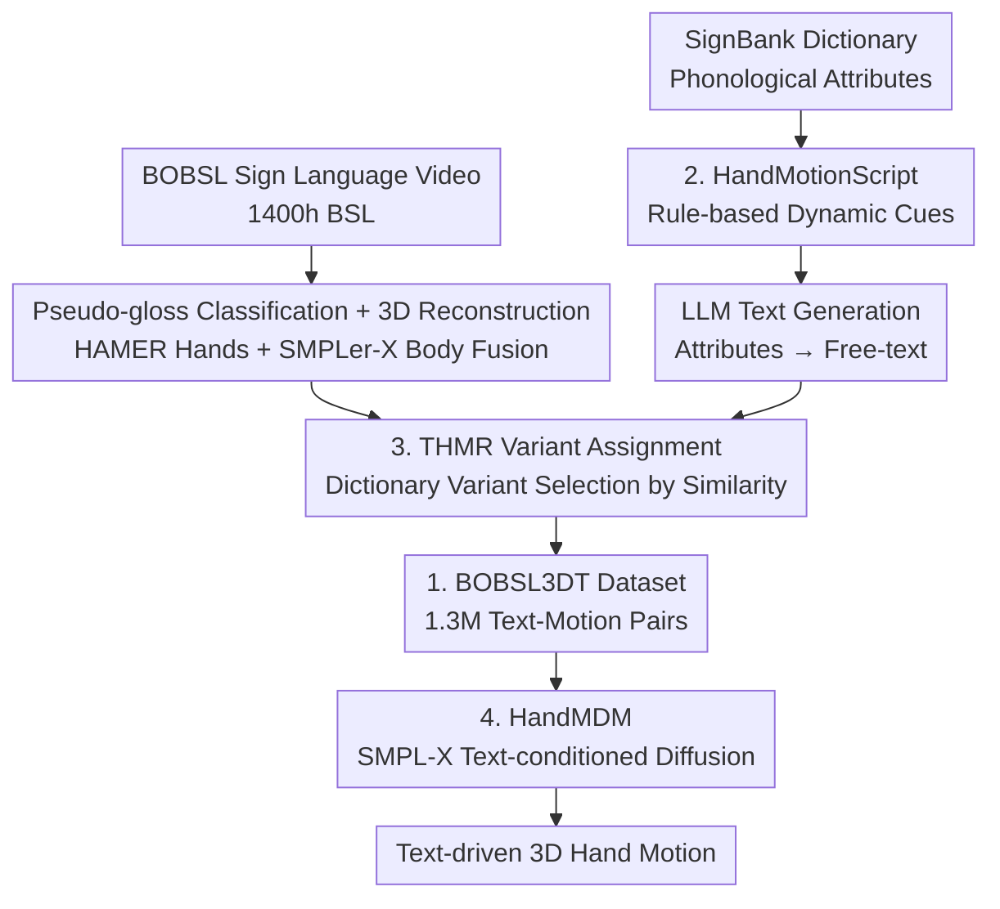

# Text-Driven 3D Hand Motion Generation from Sign Language Data

**Conference**: CVPR 2026  
**Paper**: [CVF Open Access](https://openaccess.thecvf.com/content/CVPR2026/html/Bensabath_Text-Driven_3D_Hand_Motion_Generation_from_Sign_Language_Data_CVPR_2026_paper.html)  
**Code**: None (Project page https://imagine.enpc.fr/~leore.bensabath/HandMDM, authors commit to open-sourcing models and data)  
**Area**: 3D Vision / Human Understanding / Diffusion Models  
**Keywords**: Hand motion generation, Text-conditioned diffusion, Sign language data, Data scaling, SMPL-X

## TL;DR
Utilizing large-scale sign language videos, sign language dictionaries, and LLMs, this work automatically constructs a dataset of 1.3 million "text-3D hand motion" pairs (BOBSL3DT). From this, the authors train HandMDM, a hand motion diffusion model driven by free-text descriptions (hand shape, position, finger/arm movement), which demonstrates strong generalization to unseen gestures, various sign languages, and non-sign language hand movements.

## Background & Motivation
**Background**: Text-driven human motion generation has seen significant progress with diffusion models like HumanML3D and Motion-X. However, most work focuses on **body skeletons**, where hands are either ignored or represented only by coarse wrist positions.

**Limitations of Prior Work**: Precise hand motion is critical for "expressive" human motion. However, this area is hindered by **data availability**: common MoCap datasets lack finger joints and text labels describing hands. Motion-X encodes hand shapes using rule-scripts but lacks motion-level descriptions and remains body-centric. BOTH57M uses manual labels for hands but is limited to ~1.8k samples due to high annotation costs.

**Key Challenge**: Hand motion generation requires **large-scale 3D hand data with text descriptions**. A fundamental cost contradiction exists between high-quality manual annotation (precision, low noise) and scale (millions of samples).

**Goal**: (1) Develop an automated method to scale "text-hand motion" pairs to the million-level. (2) Validate whether a robust text-conditioned hand motion generation model can be trained on such high-scale, albeit inevitably noisy, data.

**Key Insight**: Sign language videos naturally contain rich, precise hand shapes and motions. Datasets like BOBSL provide 1400 hours of BSL (British Sign Language) with dense pseudo-labels for gesture categories. Meanwhile, sign language dictionaries like SignBank provide **phonological attributes** (hand shape, start/end positions) for each gesture. Mapping "3D motions in videos" to "attribute descriptions in dictionaries" enables mass production of data pairs.

**Core Idea**: Embrace a "high scale & high noise" approach. Extract motions from sign language videos via monocular 3D reconstruction, use LLMs to translate dictionary attributes into free-text descriptions, and automatically align the two using a retrieval model. This builds a million-scale dataset for training a standard diffusion model with minimal modifications, relying on scale to provide robustness.

## Method

### Overall Architecture
The approach consists of two main components: **Automatic Data Construction** (Sec 3.1, the primary contribution) and **Diffusion Model Training** (Sec 3.2). Data construction solves the problem of sign language videos having motions without text descriptions, while dictionaries have descriptions without continuous 3D motions. These are paired into "text → motion" signals.

The pipeline follows two paths: one starting from **BOBSL videos**, using pseudo-gesture classifiers to generate frame-level pseudo-glosses, and performing 3D reconstruction using HAMER (hands) + SMPLer-X (upper body). The second path starts from the **SignBank dictionary**, extracting phonological attributes and dynamic cues via HandMotionScript to generate free-text via an LLM. These paths merge in the "Assignment" phase: a retrieval model (THMR) selects the best-matching dictionary variant based on motion similarity, resulting in 130 million "text-3D motion" pairs (BOBSL3DT) for training HandMDM.

### Key Designs

**1. BOBSL3DT Data Pipeline: Translating Video to Million-scale Supervision**

This addresses the bottleneck of hand-text data scaling. The authors assemble several components: ① **Video Source**: 1400 hours of BSL broadcasts with a VideoSwin classifier generating dense frame-level pseudo-glosses. Segments with at least $m=6$ consecutive frames are retained (~1.9M pairs). ② **3D Estimation**: HAMER estimates precise MANO hand poses, while SMPLer-X provides stable upper-body global positions. These are fused, and arm joints are optimized for natural rotation. ③ **Text Side**: SignBank attributes and HandMotionScript cues are fed to an LLM (Gemini 2.5 Pro) for in-context generation. 

Crucially, **gloss names are never fed to the LLM** to prevent hallucinations. The LLM acts only as a translator for structured attributes. The final dataset yields 1.3M training pairs after filtering and assignment.

**2. HandMotionScript (HMS): Adding Dynamic Motion to Static Attributes**

SignBank attributes are often static (e.g., "flat hand shape") and lack dynamic descriptions (e.g., "hands move apart"). HMS implements a set of rules to detect the distance between hands and body parts, as well as palm orientations, across frames. These are discretized into labels like `close` or `spread`. A sequence like `[close, spread]` allows the LLM to describe motion as "hands opening apart." This explicit representation of motion cues ensures the generated text captures both shape and dynamics.

**3. THMR Variant Assignment: Resolving Alignment Noise**

Assigning dictionary descriptions to video motions is complex because a single gloss may have multiple variants. The authors train THMR (Text-Hand Motion Retrieval) to pick the dictionary variant that best matches the reconstructed motion. This "de-noising" step significantly improves performance compared to random variant assignment.

**4. HandMDM: SMPL-X Text-conditioned Diffusion**

To focus on data construction, the generator uses a standard diffusion model with minimal changes. It extends MDM-SMPL to **SMPL-X** to support hand and face joints. Motion is represented using 6D rotations in a vector space $\mathbb{R}^{274}$ (15 joints per hand, 13 for upper body, 16 face parameters). A Transformer encoder processes CLIP text tokens and diffusion timesteps to predict the denoised motion via MSE.

### Loss & Training
The diffusion model is trained using MSE loss on predicted motions. It employs a 5% condition dropout rate to support classifier-free guidance during inference. Diffusion is performed over 100 timesteps.

## Key Experimental Results

### Main Results (In-domain & Cross-domain Transfer)
In-domain evaluation on BOBSL3DT test sets (Seen/Unseen gestures):

| Control Input | Seen R@1 ↑ | Seen R@3 ↑ | Unseen R@1 ↑ | Unseen R@3 ↑ |
|---------------|-----------|-----------|--------------|--------------|
| Gloss (Fixed Vocab) | 21.71 | 37.53 | n/a | n/a |
| Phonology (Raw Attr) | 17.14 | 28.78 | 20.98 | 34.48 |
| LLM(Gloss) | 1.00 | 2.29 | 5.17 | 10.06 |
| LLM(Phonology) | 19.95 | 33.14 | 22.99 | 37.07 |
| **LLM(Phonology+HMS)** | **21.68** | **34.18** | 17.53 | **36.20** |

Zero-shot transfer across languages (BSL → ASL):

| Training Data | ASL-Text R@1 ↑ | ASL-Text R@3 ↑ | MS-ZSSLR-W R@1 ↑ | MS-ZSSLR-W R@3 ↑ |
|----------|---------------|---------------|------------------|------------------|
| ASL-Text only (baseline) | 5.98 | 16.21 | 6.43 | 16.85 |
| BOBSL3DT (Phon.+HMS) | **17.09** | **35.43** | **15.39** | **31.50** |

The model significantly outperforms baselines trained on smaller target-domain datasets, demonstrating the transferability of large-scale BSL data.

### Ablation Study

| Configuration | Seen R@1 ↑ | Seen R@3 ↑ | Unseen R@1 ↑ | Description |
|------|-----------|-----------|--------------|------|
| Random Assignment | 18.77 | 32.27 | 16.09 | No variant disambiguation |
| **THMR Assignment** | **21.68** | **34.18** | **17.53** | Similarity-based selection |
| Data Scale 100% | High | — | High | R@1 increases with data |

### Key Findings
- **Variant assignment is the primary de-noising step**: THMR assignment improves seen R@1 by ~3 points over random assignment.
- **Monotonic gains from data scale**: Performance has not yet saturated, suggesting that further scaling will continue to improve results.
- **LLM Hallucination Mitigation**: Avoiding gloss names and using only structured attributes as LLM input successfully prevents "confidently incorrect" descriptions.

## Highlights & Insights
- **Scalable "Data Factory"**: Integrating dictionaries, videos, and LLMs provides a blueprint for generating supervision in domains where paired data is scarce but component resources are abundant.
- **Architectural Simplicity**: By keeping the diffusion model "vanilla," the paper proves that data scale is the primary driver for robust generation of complex motions.
- **Practical LLM Engineering**: The strategy of using the LLM as a constrained translator for attributes rather than a knowledge source for sign language is a valuable pattern for domain-specific data labeling.

## Limitations & Future Work
- **Precision at Contact**: The model struggles with precise "touch" gestures (e.g., fingers contacting the chin accurately).
- **Evaluator Bias**: Since the retrieval evaluator is trained on BOBSL3DT, cross-domain metrics might be biased toward the training distribution.
- **Cumulative Noise**: Source noise from pseudo-labels, 3D reconstruction, and LLM generation still exists and is currently countered mainly by scale.

## Related Work & Insights
- **vs Motion-X/BOTH57M**: This work achieves a dataset size orders of magnitude larger than previous efforts and provides motion-level descriptive text as the sole control signal.
- **vs Sign Language Production (SLP)**: While SLP models translate sentences to sign, this model generates general-purpose hand motions driven by descriptive free text.
- **vs MDM**: HandMDM demonstrates that the MDM architecture scales well to the high-dimensional joint space of SMPL-X hands when sufficient data is provided.

## Rating
- Novelty: ⭐⭐⭐⭐⭐ 
- Experimental Thoroughness: ⭐⭐⭐⭐ 
- Writing Quality: ⭐⭐⭐⭐ 
- Value: ⭐⭐⭐⭐⭐ 

<!-- RELATED:START -->

## Related Papers

- [\[CVPR 2026\] HandDreamer: Zero-Shot Text to 3D Hand Model Generation](handdreamer_zero_shot_text_to_3d_hand_model_generation.md)
- [\[CVPR 2026\] MoLingo: Motion-Language Alignment for Text-to-Human Motion Generation](molingo_motion-language_alignment_for_text-to-motion_generation.md)
- [\[CVPR 2026\] MotionMaster: Generalizable Text-Driven Motion Generation and Editing](motionmaster_generalizable_text-driven_motion_generation_and_editing.md)
- [\[CVPR 2026\] Learning Effective Sign Features without Text for Gloss-free Sign Language Translation](learning_effective_sign_features_without_text_for_gloss-free_sign_language_trans.md)
- [\[CVPR 2026\] Hierarchical Enhancement of Semantic Priors for Disentangled Text-Driven Motion Generation](hierarchical_enhancement_of_semantic_priors_for_disentangled_text-driven_motion_.md)

<!-- RELATED:END -->
