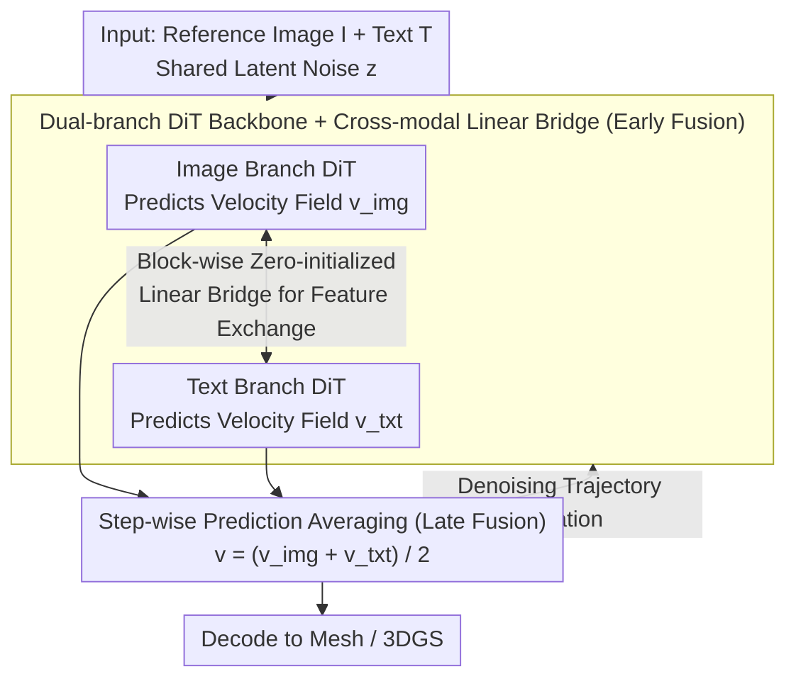

# Text–Image Conditioned 3D Generation

**Conference**: CVPR 2026  
**arXiv**: [2603.21295](https://arxiv.org/abs/2603.21295)  
**Code**: [https://jumpat.github.io/tigon-page](https://jumpat.github.io/tigon-page)  
**Area**: 3D Vision / 3D Generation  
**Keywords**: Joint Text-Image Conditioning, 3D Generation, Dual-branch DiT, Cross-modal Fusion, Rectified Flow  

## TL;DR
This paper observes that image and text conditions provide complementary information in 3D generation—images provide precise appearance but are limited by viewpoint, while text provides global semantics but lacks visual detail. It proposes TIGON, a minimalist dual-branch DiT baseline that achieves native 3D generation under joint text-image conditioning through zero-initialized cross-modal bridges (early fusion) and step-wise prediction averaging (late fusion).

## Background & Motivation
1. **Background**: Native 3D generation models (e.g., TRELLIS, UniLat3D) can generate high-quality 3D assets from a single condition (image or text). These methods perform well in their respective modalities but rely on a single conditional signal.
2. **Limitations of Prior Work**: (a) **Image-conditioned** 3D generation is extremely sensitive to the input view—when provided with low-information views (e.g., bottom-up, heavy occlusion), the model must "hallucinate" invisible regions, often deviating from user intent; (b) **Text-conditioned** generation provides comprehensive semantics but lacks low-level visual constraints, leading to lower visual quality.
3. **Key Challenge**: Images provide locally precise geometry and appearance cues but lack complete coverage, while text provides global semantics but lacks fine granularity—the two are inherently complementary.
4. **Goal**: (a) Diagnose and quantify the limitations of unimodal 3D generation; (b) Formalize the new task of "joint text-image conditioned 3D generation"; (c) Design a simple yet effective dual-modal baseline.
5. **Key Insight**: The authors conducted a diagnostic experiment—directly averaging the velocity fields of two pre-trained rectified flow models (image-conditioned and text-conditioned) at inference time (termed SimFusion). This naive fusion significantly outperformed unimodal methods (FD_DINOv2: 82.40 vs. 125.93/154.88), revealing strong cross-modal complementarity.
6. **Core Idea**: Maintain two modality-specific DiT backbones, exchange features through lightweight cross-modal linear bridges, and progressively average predictions along the denoising trajectory to achieve joint text-image 3D generation.

## Method

### Overall Architecture
TIGON addresses the problem of generating 3D assets given both a reference image and a text description. Built on the UniLat3D rectified flow framework, it avoids a single unified backbone. Instead, the image and text branches run separate DiTs to predict their respective velocity fields based on a shared latent noise $\tilde{\mathbf{z}}$. Lightweight linear bridges are inserted between layers for feature exchange (early fusion), and the velocity fields from both branches are averaged at each denoising step (late fusion). Finally, the denoised latent is decoded into meshes or 3DGS. The core mechanism is "two experts looking at different modalities while aligning throughout the process."

### Key Designs

**1. Dual-branch DiT Backbone: Decoupling Modal Experts**

A naive approach would concatenate image and text tokens into a single DiT. However, the "granularity" of these conditions is mismatched—image tokens are dense, anchored to specific viewpoints, and rich in local information, while text (e.g., "tiger") might be represented by a single sparse, abstract token. Forcing them together can lead to degradation due to this mismatch. TIGON maintains independent branches for each, predicting $\mathbf{v}_{\text{img}} = \mathcal{F}_{\text{img}}(\tilde{\mathbf{z}}, t, \mathbf{I})$ and $\mathbf{v}_{\text{txt}} = \mathcal{F}_{\text{txt}}(\tilde{\mathbf{z}}, t, \mathbf{T})$. This allows each branch to inherit pre-trained unimodal capabilities without losing performance during joint training with limited data.

**2. Cross-modal Linear Bridge (Early Fusion): Zero-initialized Feature Exchange**

If two branches remain completely isolated, they may diverge during denoising, causing the averaged velocity field to cancel out details. The bridge establishes bidirectional channels between DiT block pairs: after the $i$-th block output, a learned linear projection maps features from the opposite branch to its own:

$$\mathbf{f}^{(i),\prime}_{\text{img}} = \mathbf{f}^{(i)}_{\text{img}} + \mathcal{P}^{(i)}_{\text{txt}\rightarrow\text{img}}(\mathbf{f}^{(i)}_{\text{txt}})$$

The text side mirrors this with $\mathcal{P}^{(i)}_{\text{img}\rightarrow\text{txt}}$. Critical to this is the zero-initialization trick from ControlNet—all bridge parameters start at zero, ensuring the model initially behaves exactly like the pre-trained unimodal models, with the "gates" opening gradually during training. Ablations show FD_DINOv2 drops from 66.78 (no bridge) to 61.59 (with bridge).

**3. Step-wise Prediction Averaging (Late Fusion): Minimalist Integration**

Since early fusion already conditions the intermediate layers, TIGON employs a simple equal-weight average for the final velocity field at each denoising step: $\mathbf{v} = \frac{1}{2}(\mathbf{v}_{\text{txt}} + \mathbf{v}_{\text{img}})$. More complex strategies like adaptive weights (AW) or attention-based fusion (AT) showed marginal gains (61.59 vs. 60.90) because the branch parameters can implicitly absorb dynamic weighting via re-parameterization. Simple averaging maintains a cleaner training signal.

### Loss & Training
A two-stage training strategy is used: (1) Unimodal pre-training—the image branch uses the original UniLat3D checkpoint, while the text branch is trained from scratch on the same backbone for 1M iterations; (2) Joint fine-tuning for 50k iterations, training the cross-modal bridges and all parameters simultaneously. During training, image and text conditions are independently dropped with a 0.5 probability, creating a balanced mix (25% unconditional, 25% text-only, 25% image-only, 25% joint) to allow free-form conditional input.

## Key Experimental Results

### Main Results (Toys4K Dataset)

| Model | Condition | Rep. | CLIP↑ | FD_DINOv2↓ |
|------|------|------|-------|------------|
| UniLat3D | Image | GS | 91.20 | 85.30 |
| UniLat3D | Text | GS | 86.14 | 154.88 |
| SimFusion (Naive) | Img+Txt | GS | 91.95 | 66.78 |
| **TIGON** | **Img+Txt** | **GS** | **92.33** | **61.59** |
| TRELLIS | Image (View-1) | GS | 88.16 | 143.58 |
| TIGON | Image | GS | 91.40 | 84.62 |
| TIGON | Text | GS | 86.77 | 152.34 |

### Ablation Study (Toys4K)

| Bridge | Fusion | Fine-tune | CLIP↑ | FD_DINOv2↓ |
|----------|----------|----------|-------|------------|
| ✗ | Sim | ✗ | 91.95 | 66.78 |
| ✗ | Sim | ✓ | 92.05 | 66.04 |
| ✓ | Sim | ✓ | **92.33** | **61.59** |
| ✓ | AW | ✓ | 92.31 | 60.90 |
| ✓ | AT | ✓ | 92.26 | 62.00 |

### Key Findings
- **Cross-modal complementarity is significant**: Even naive fusion (SimFusion) reduces FD_DINOv2 from 85.30 (image-only) and 154.88 (text-only) to 66.78, proving that the two modalities provide complementary information.
- **Cross-modal bridges are the core contribution**: Joint fine-tuning without bridges yields marginal improvement (66.78→66.04), while adding bridges significantly improves performance (→61.59). Qualitatively, without bridges, the two branches diverge during denoising, creating inconsistent structures.
- **Complex fusion is unnecessary**: AW and AT fusion methods show negligible differences compared to simple averaging, suggesting early fusion is sufficient for branch interaction.
- **TIGON preserves unimodal capabilities**: Under single-image or single-text conditions, TIGON performs comparably to unimodal UniLat3D models.

## Highlights & Insights
- **Diagnostic-driven task definition**: The paper begins with quantitative experiments to prove unimodal limitations and cross-modal complementarity before defining the task, avoiding the "solution looking for a problem" trap.
- **Minimalist Design Philosophy**: Effective cross-modal fusion is achieved using only linear projections and zero-initialization, without heavy attention mechanisms or complex gating. This design maintains unimodal fidelity and supports free-form conditioning.
- **Controllable Generation**: Fine-tuning attributes of a 3D object by fixing the image and varying the text produces consistent results. The model learns to implicitly balance modalities—text dominates when image information is weak, and vice versa.

## Limitations & Future Work
- The method is only validated on the UniLat3D framework; generalizability to other native 3D generators (e.g., direct 3DGS generators) is untested.
- In cases of explicit conflict between image and text, TIGON tends to favor the image—lacking an explicit conflict-resolution mechanism.
- Training is limited to the TRELLIS-500K dataset; testing is primarily on synthetic assets (Toys4K, UniLat1K). Real-world generalization requires further validation.
- The dual-branch architecture roughly doubles parameters and inference costs; lighter conditional injection methods could be explored.
- Metrics like ULIP/Uni3D were only reported for mesh outputs; 3DGS outputs lack point-cloud level evaluation.

## Related Work & Insights
- **vs. TRELLIS/UniLat3D**: These are unimodal baselines. TIGON builds on them by adding cross-modal fusion while maintaining their original unimodal performance.
- **vs. TICD**: TICD uses SDS modifications to fuse text-image conditions and relies on 2D diffusion priors, whereas TIGON operates directly in a native 3D generation framework.
- **vs. FlexGen**: FlexGen focuses on 2D multi-view generation rather than native 3D synthesis.

## Supplement Detail

### Datasets & Metrics
- Training Set: TRELLIS-500K.
- Test Sets: Toys4K (approx. 4K objects across 105 classes) and UniLat1K (a more challenging 1K object benchmark).
- Key Metrics: CLIP (semantic alignment of rendered views), FD_DINOv2 (visual fidelity of rendered views, lower is better), ULIP/Uni3D (3D point cloud-image alignment, available for mesh).
- Evaluation used three non-ideal reference views (front, top, bottom) to test viewpoint robustness.

### Conflict Behavior
When image and text conditions explicitly conflict, TIGON tends to follow the image, as images are generally more specific and less ambiguous. This suggests a need for future designs with explicit conflict weight mechanisms.

## Rating
- Novelty: ⭐⭐⭐⭐ (Task definition is well-supported by experiments, though the method is relatively straightforward)
- Experimental Thoroughness: ⭐⭐⭐⭐ (Comprehensive ablations and qualitative results, though test sets are synthetic)
- Writing Quality: ⭐⭐⭐⭐⭐ (Clear logical flow: diagnosis → task definition → method → validation)
- Value: ⭐⭐⭐⭐ (Opens a meaningful new direction with a clean baseline for future work)

<!-- RELATED:START -->

## Related Papers

- [\[CVPR 2026\] PerpetualWonder: Long-horizon Action-conditioned 4D Scene Generation](perpetualwonder_long-horizon_action-conditioned_4d_scene_generation.md)
- [\[CVPR 2026\] Are We Ready for RL in Text-to-3D Generation? A Progressive Investigation](are_we_ready_for_rl_in_text-to-3d_generation_a_progressive_investigation.md)
- [\[CVPR 2026\] Multimodal Semantic Bias Mitigation for Diverse Text-To-3D Generation](multimodal_semantic_bias_mitigation_for_diverse_text-to-3d_generation.md)
- [\[CVPR 2026\] Text-Driven 3D Hand Motion Generation from Sign Language Data](text-driven_3d_hand_motion_generation_from_sign_language_data.md)
- [\[CVPR 2026\] HandDreamer: Zero-Shot Text to 3D Hand Model Generation using Corrective Hand Shape Guidance](handdreamer_zero-shot_text_to_3d_hand_model_generation_using_corrective_hand_sha.md)

<!-- RELATED:END -->
