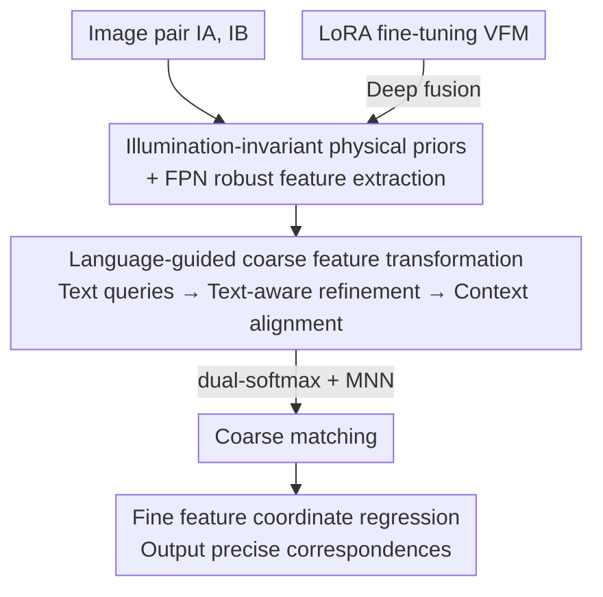

# TextFM: Robust Semi-dense Feature Matching with Language Guidance

**Conference**: CVPR 2026  
**Paper**: [CVF Open Access](https://openaccess.thecvf.com/content/CVPR2026/html/Zheng_TextFM_Robust_Semi-dense_Feature_Matching_with_Language_Guidance_CVPR_2026_paper.html)  
**Code**: None  
**Area**: 3D Vision  
**Keywords**: Feature Matching, Visual Language Models, Domain Generalization, LoRA, Illumination Invariant Priors

## TL;DR
TextFM is the first framework to introduce text semantics from Visual-Language Models (VLM) into semi-dense feature matching. It utilizes text embeddings to generate instance-level queries that inject domain-invariant semantics into coarse matching, employs LoRA for efficient fine-tuning of Visual Foundation Models (VFM), and overlays illumination-invariant physical priors, significantly outperforming existing methods like EfficientLoFTR under cross-domain and day-night variations.

## Background & Motivation
**Background**: Image feature matching is the cornerstone of geometry-aware tasks such as SfM and visual localization. Methods have evolved from detector-based sparse matching to detector-free dense/semi-dense matching (e.g., LoFTR, EfficientLoFTR), which establish correspondences for all pixels to enhance robustness through global context.

**Limitations of Prior Work**: Mainstream coarse matching learning relies on 3D supervision, yet high-quality large-scale 3D data is scarce, leading to model overfitting and poor generalization to unseen domains. Recent works have introduced frozen VFMs (such as DINOv2) to provide transferable visual features. However, pure visual features still fail in regions where geometric cues are ambiguous, such as **textureless surfaces or repetitive textures**. Furthermore, the generalization capability of VFM representations can be compromised under **extreme illumination/appearance changes** (e.g., day-night switching).

**Key Challenge**: The fundamental issue is the **persistent domain gap between pre-trained knowledge and unseen application scenarios**. Pure visual features lack "semantic anchors" that are stable across domains. Simultaneously, fully utilizing VFMs faces a dilemma: freezing the backbone does not fully exploit its generalization potential, while full fine-tuning is expensive and risks overfitting or forgetting pre-trained knowledge.

**Goal**: To build a semi-dense matcher robust to cross-domain, low-texture, and extreme illumination conditions without relying on expensive 3D supervision. This is decomposed into three sub-problems: (1) injecting domain-invariant semantic information into coarse matching; (2) efficiently adapting VFMs to matching tasks without losing knowledge; (3) resisting illumination changes.

**Key Insight**: The authors observe that **textual semantics are naturally domain-invariant**—categorical concepts like "building" or "sky" remain consistent across day/night and different datasets, serving as semantic prototypes to cluster similar regions. Since features in the coarse matching stage originate from deep backbone layers and already encode high-level semantics, they represent an ideal location for injecting language guidance.

**Core Idea**: Utilize VLM text embeddings to generate instance-level queries, injecting "semantic consistency" as a domain-invariant prior into the detector-free coarse matching stage. Simultaneously, use LoRA for efficient VFM fine-tuning and overlay illumination-invariant physical priors, combining all three for robust matching.

## Method

### Overall Architecture
TextFM follows the coarse-to-fine detector-free matching paradigm: taking a pair of images $I_A, I_B$ as input and outputting precise pixel correspondences. The pipeline consists of three stages: **robust visual feature extraction, language-guided coarse matching, and coordinate refinement**.

The first stage extracts illumination-invariant physical priors from the input images, feeds them into a CNN-based FPN, and integrates LoRA-fine-tuned VFM features at deep FPN layers to obtain coarse features $F_c$ at 1/8 resolution and fine features $F_f$ at 1/2 resolution. The second stage feeds coarse features into a language-guided coarse feature transformation module: using frozen CLIP to generate text queries, employing text-aware refinement to cluster pixel features according to semantic prototypes, and establishing class-level correspondences via context alignment. Finally, coarse matches are selected using dual-softmax + mutual nearest neighbor (MNN). The third stage performs high-resolution coordinate regression using fine features within local cropped patches from the coarse matches, following the two-stage refinement strategy of EfficientLoFTR.

### Key Designs

**1. Illumination-invariant physical priors + FPN robust feature extraction: Making features inherently resistant to illumination interference**

While VFM features are semantically rich, they lack the fine spatial details required for precise matching and may exceed their generalization limits under extreme conditions like day-night transitions. Instead of using RGB images directly, the authors extract **illumination-invariant physical priors**: a color-invariant edge detector based on Kubelka–Munk reflection theory, providing $H, C, W$ priors that depend only on material reflectance rather than illumination or viewpoint. Together with an RGB color order map $O$, these four priors are concatenated as FPN input embeddings. Consequently, the network perceives stable "material-level" signals rather than raw pixels susceptible to illumination disturbances. This FPN extracts multi-scale features, enhancing resistance to day-night/appearance changes at the source. Ablations show significant gains on MegaDepth-night2night.

**2. LoRA fine-tuning VFM: An efficient solution between "preserving pre-trained knowledge" and "task adaptation"**

Previous methods either used frozen VFMs (not fully exploiting generalization) or full fine-tuning (expensive with 304M parameters, prone to overfitting and forgetting). TextFM inserts trainable low-rank matrices into every VFM layer: for pre-trained weights $W_i$ at layer $i$, feature propagation is modified to $f_{i+1} = W_i f_i + \Delta W_i f_i$, where the residual $\Delta W_i = BA$ uses low-rank decomposition ($A \in \mathbb{R}^{r\times c}, B \in \mathbb{R}^{c\times r}, r \ll c$). The authors further replace $\Delta W_i$ with a learnable token $T_i$ and a lightweight MLP $M_i(\cdot)$, where the update becomes $f_{i+1} = W_i f_i + M_i(T_i W_i f_i)$, with $T_i = A_i B_i$ for continued low-rank optimization. This scheme requires only ~3M trainable parameters, allowing DINOv2 to adapt to matching tasks while preserving pre-trained knowledge. In ablations, this contributes the largest single-item gain on in-domain MegaDepth, and **frozen VFM outperformed full fine-tuning**, confirming that full fine-tuning leads to overfitting and forgetting.

**3. Language-guided coarse feature transformation: Injecting domain-invariant text semantics into coarse matching**

This is the core innovation, consisting of three sub-stages: **(a) Text query generation**: A frozen CLIP text encoder $E_T$ is used. To avoid the fragility of manual prompts, prompt learning is adopted—concatenating a learnable prompt $p$ to each category label token $\text{CLS}_k$ to get $t_k = E_T([p, \text{CLS}_k])$, which is projected via MLP into text queries $Q_t \in \mathbb{R}^{K\times\hat C}$ (default $K=150$ ADE20K categories). **(b) Text-aware refinement**: Before the standard alternating self/cross-attention blocks, a cross-attention layer is inserted, allowing each pixel feature to "query" the text prototypes $\hat t$. The attention is calculated as:

$$\hat{f}_i = f_i + A \times v, \quad A = \mathrm{Softmax}\!\left(\frac{q \times k^T}{\sqrt{\alpha}}\right)$$

where pixel features $f_i$ are projected as query $q$, and text prototypes as $k,v$. This effectively soft-assigns each pixel to $K$ text prototypes for weighted aggregation, **clustering similar regions in feature space** guided by domain-invariant text semantics. **(c) Context alignment**: A Transformer decoder with $N$ masked attention layers iteratively updates text queries $Q_t \to \hat Q_t$ (injecting spatial context from coarse features). The dot product of refined pixel features $\tilde F_c$ and $\hat Q_t$ yields a context correlation map $\hat F_c \in \mathbb{R}^{H\times W\times K}$, encoding the semantic affinity between spatial positions and text concepts, producing "semantically aligned" visual representations. Together, these steps make coarse features more separable and stable across domains—t-SNE visualization shows more uniform distribution of unseen target domain samples.

### Loss & Training
The entire pipeline is trained end-to-end, with separate supervision for coarse matching and refinement. The coarse layer uses negative log-likelihood loss for the correlation score matrix $S_c$: $\mathcal{L}_c^v = -\frac{1}{N_c}\sum_{(i,j)\in M_c^{gt}} \log S_c(i,j)$, where ground truth correspondences $M_c^{gt}$ are obtained by warping grid points from $I_A$ to $I_B$ using known poses and depth. An additional term $\mathcal{L}_c^t$ is added for the text correlation score matrix $S_c^t$, such that $\mathcal{L}_c = \mathcal{L}_c^v + \mathcal{L}_c^t$. The fine layer follows the EfficientLoFTR two-stage approach: NLL loss $\mathcal{L}_{f1}$ for local score maps, and L2 regression loss $\mathcal{L}_{f2}$ for sub-pixel coordinates. Total loss $\mathcal{L} = \mathcal{L}_c + \alpha\mathcal{L}_{f1} + \beta\mathcal{L}_{f2}$, with $\alpha=1.0, \beta=0.25$. Default VFM is DINOv2-L, text refinement blocks $M=4$, and decoder $N=3$. Training is conducted solely on outdoor MegaDepth using AdamW with an initial learning rate of $4\times10^{-3}$.

## Key Experimental Results

### Main Results
Two-view geometry (Pose error AUC@5°/10°/20°), evaluated across all domains using the same MegaDepth-trained model:

| Dataset | Category | EfficientLoFTR | TextFM (Ours) | Gain |
|--------|------|----------------|--------------|------|
| MegaDepth (in-domain) | Semi-dense | 55.3 / 71.4 / 83.1 | **58.0 / 73.6 / 84.6** | +2.7 / +2.2 / +1.5 |
| ScanNet (Cross-domain) | Semi-dense | 18.4 / 35.6 / 52.7 | **22.7 / 43.2 / 59.9** | +4.3 / +7.6 / +7.2 |
| MegaDepth-N2D (Day-Night) | Semi-dense | 47.5 / 64.7 / 77.8 | **49.4 / 66.3 / 79.3** | +1.9 / +1.6 / +1.5 |
| MegaDepth-N2N (Night-Night) | Semi-dense | 42.6 / 60.1 / 74.0 | **45.1 / 62.7 / 76.1** | +2.5 / +2.6 / +2.1 |

The largest gains are in cross-domain (ScanNet) and nighttime scenarios, validating the domain-invariant advantage of language guidance. Runtime is 183.5ms, slower than EfficientLoFTR (93.7ms) but significantly faster than the dense ROMA (707ms) while approaching its accuracy. In visual localization, InLoc averages 73.85 (>EfficientLoFTR 73.63), and the Aachen v1.1 nighttime subset leads with 79.8/92.0/99.5, with an overall high of 92.70.

### Ablation Study
Incremental addition of key components (AUC@5°, VFM=LoRA-VFM, Priors=Physical Priors, TAR=Text-Aware Refinement, CA=Context Alignment):

| Configuration | MegaDepth | ScanNet | N2N | Params |
|------|-----------|---------|-----|--------|
| baseline | 55.5 | 18.4 | 42.6 | 17.4M |
| +VFM | 56.8 (+1.3) | 20.0 (+1.6) | 43.7 | 20.7M |
| +Priors | 56.1 | 19.1 | 43.6 (+1.0) | 17.5M |
| +TAR+CA | 56.6 | 21.6 (+3.2) | 43.9 | 19.5M |
| Full (All) | **58.0 (+2.5)** | **22.7 (+4.3)** | **45.1 (+2.5)** | 23.1M |

Comparison of VFM fine-tuning schemes (DINOv2-L backbone only):

| Scheme | AUC@5° | Trainable Params |
|------|--------|----------|
| Baseline | 55.3 | 0M |
| Frozen DINOv2 | 56.4 | 0M |
| LoRA Fine-tuning | **56.8** | 2.99M |
| Full Fine-tuning | 56.1 | 304.2M |

### Key Findings
- **Modular coverage of domains**: LoRA-VFM provides the largest gain in-domain (MegaDepth); language guidance (TAR+CA) provides the largest gain in cross-domain (ScanNet AUC@10° +5.0); physical priors primarily handle day-night (N2N). These address different dimensions of robustness.
- **Full < Frozen < LoRA**: Full fine-tuning (304M parameters) underperforms freezing, confirming overfitting/forgetting. LoRA achieves the best results with only 3M parameters.
- **Wider vocabulary implies stability**: ADE20K 150 categories (covering indoor/outdoor) outperformed Cityscapes 19 and NYUv2 40, as well as random learnable tokens (58.0 vs. 57.3), indicating that gains indeed stem from textual semantics. Prompt learning outperformed fixed templates (58.0 vs. 57.2).
- **Resolution insensitivity**: Training at 480² showed only a slight drop compared to 800² (57.3 vs 58.0) thanks to VFM features, benefiting real-world deployment.
- VFM backbones are interchangeable (CLIP/EVA02/DINOv2 all work), with DINOv2-L being optimal.

## Highlights & Insights
- **"Text as domain-invariant anchor" perspective**: While visual features drift across domains, semantic concepts like "building" or "sky" remain stable across day/night and datasets. Using text prototypes to cluster similar pixels serves as a semantic compass. This is the first work to introduce VLM into feature matching.
- **Hybrid of physical priors and learned features**: Utilizing color invariants from Kubelka–Munk reflection theory as input rather than raw RGB removes illumination at the source. This is a reusable trick for combining classical physical modeling with deep features in any illumination-sensitive vision task.
- **LoRA validates "less is more" in matching**: 3M vs 304M parameters with superior results provides a clean controlled experiment for using large models without the associated burden.
- **MegaDepth-Sync benchmark**: Contributed a day-night matching benchmark (translated via image-to-image models from MegaDepth, including ground truth poses), filling a gap in evaluation under extreme illumination.

## Limitations & Future Work
- Text queries depend on a predefined segmentation vocabulary (ADE20K 150). Performance may drop when unseen categories appear—semantic prior coverage is limited by the vocabulary. Self-adaptive vocabulary expansion in open-vocabulary scenarios remains an open problem.
- Latency (183.5ms) is nearly double that of pure-visual EfficientLoFTR. The introduction of CLIP encoding and multi-stage attention adds overhead, requiring trade-offs in real-time scenarios.
- ⚠️ Evaluated on cross-domain datasets while trained only on outdoor MegaDepth. While generalization results are impressive, the singular training distribution leaves its robustness across more diverse training distributions not fully verified.
- Physical priors derive from a fixed color-invariant edge detector; its stability on extremely noisy/blurred images versus learned illumination removal was not deeply explored.

## Related Work & Insights
- **vs EfficientLoFTR**: This paper uses it as a baseline (replacing the backbone with FPN) and adopts its two-stage refinement. The difference lies in TextFM injecting language guidance + LoRA-VFM + physical priors in the coarse stage, yielding significant cross-domain gains (ScanNet AUC@10° 35.6→43.2) at the cost of being twice as slow.
- **vs methods using frozen VFM (e.g., OmniGlue, ROMA series)**: Those methods use frozen DINOv2/CLIP as auxiliary features without full adaptation. This work uses LoRA to exploit VFM generalization and proves full fine-tuning is inferior.
- **vs Dense methods (DKM / ROMA)**: Dense methods provide higher accuracy (ROMA 62.4/76.4/86.2) but are much slower (707ms). TextFM approaches dense accuracy within a semi-dense framework, closing the cross-domain gap with a better efficiency-accuracy trade-off.
- **vs TopicFM**: Both aim to introduce "topics/semantics" into matching. However, TopicFM's topics are self-learned visually with no explicit semantics. TextFM uses VLM text embeddings for **explicit, domain-invariant** semantic prototypes, providing better cross-domain stability.

## Rating
- Novelty: ⭐⭐⭐⭐⭐ First to introduce VLM text semantics to feature matching; "text as domain-invariant anchor" is a fresh perspective.
- Experimental Thoroughness: ⭐⭐⭐⭐⭐ Covers two-view and localization tasks, in/out-of-domain, and detailed ablations on vocabulary/prompt/resolution/backbones.
- Writing Quality: ⭐⭐⭐⭐ Clear motivation and good figure-text alignment, though some formula formatting is slightly cluttered.
- Value: ⭐⭐⭐⭐ High practical value for cross-domain/day-night robust matching; contributes a day-night benchmark. Speed overhead is the primary trade-off.

<!-- RELATED:START -->

## Related Papers

- [\[CVPR 2026\] Scalable Feature Matching via State Space Modeling and Sparse Correlation](scalable_feature_matching_via_state_space_modeling_and_sparse_correlation.md)
- [\[ICCV 2025\] CasP: Improving Semi-Dense Feature Matching Pipeline Leveraging Cascaded Correspondence Priors for Guidance](../../ICCV2025/3d_vision/casp_improving_semi-dense_feature_matching_pipeline_leveraging_cascaded_correspo.md)
- [\[CVPR 2026\] AsymLoc: Towards Asymmetric Feature Matching for Efficient Visual Localization](asymloc_towards_asymmetric_feature_matching_for_efficient_visual_localization.md)
- [\[CVPR 2026\] PatchAlign3D: Local Feature Alignment for Dense 3D Shape Understanding](patchalign3d_local_feature_alignment_for_dense_3d_shape_understanding.md)
- [\[CVPR 2026\] HeroGS: Hierarchical Guidance for Robust 3D Gaussian Splatting under Sparse Views](herogs_hierarchical_guidance_for_robust_3d_gaussian_splatting_under_sparse_views.md)

<!-- RELATED:END -->
