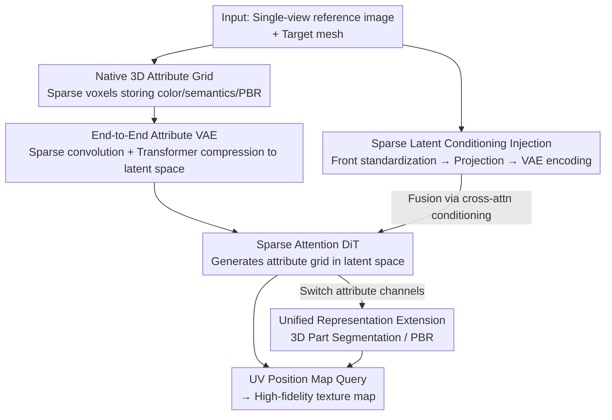

# TEXTRIX: Latent Attribute Grid for Native Texture Generation and Beyond

**Conference**: CVPR 2026  
**Paper**: [CVF Open Access](https://openaccess.thecvf.com/content/CVPR2026/html/Zeng_TEXTRIX_Latent_Attribute_Grid_for_Native_Texture_Generation_and_Beyond_CVPR_2026_paper.html)  
**Code**: To be confirmed  
**Area**: 3D Vision  
**Keywords**: 3D Texture Generation, Native 3D Representation, Sparse Voxel, Diffusion Transformer, 3D Part Segmentation

## TL;DR
TEXTRIX represents 3D textures as a "native 3D attribute grid" (a sparse voxel field storing color, semantics, and PBR properties in each voxel) and textures models directly in voxel space using a diffusion Transformer with sparse attention. This fundamentally bypasses multi-view fusion seams and UV unwrapping fragmentation issues. By simply changing the prediction target, the same architecture can perform high-precision 3D part segmentation, achieving State-of-the-Art (SOTA) on both tasks.

## Background & Motivation
**Background**: Generating high-fidelity, stylistically consistent textures for a given 3D mesh is one of the most critical bottlenecks in 3D content generation. Current mainstream approaches leverage mature 2D diffusion models: either optimizing a 3D representation via score distillation, or first generating multi-view images and then reconstructing/projecting them back onto the mesh (multi-view fusion). Recent variants project multi-view generations directly onto the mesh surface.

**Limitations of Prior Work**: This 2D-centric paradigm suffers from two unavoidable drawbacks. The first is **multi-view fusion**: generating views independently and then merging them naturally introduces view inconsistency, leading to seams, blurriness, and inconsistent lighting, with complex or occluded regions often lacking proper coverage (as shown by the lip and neck seams in Figure 2 of the paper). The second is **UV parametrization space generation**: although texturing directly on 2D UV maps avoids per-object optimization, UV unwrapping cuts continuous 3D surfaces into disconnected 2D charts. This disrupts geodetically adjacent neighborhoods, resulting in artifacts at UV seams and causing a disconnect between the learned texture patterns and the underlying 3D geometry.

**Key Challenge**: The root cause is that textures—essentially attributes on 3D surfaces—are forced into 2D representations (multi-view images / UV maps) for generation. Without a "native 3D" representation, global 3D consistency cannot be structurally guaranteed, making seams and inconsistencies inherent to the representation itself rather than issues that can be resolved via post-processing.

**Goal**: (1) To find a truly native 3D texture representation and generation paradigm that eliminates multi-view inconsistency and UV fragmentation from the source; (2) To guarantee high-fidelity alignment with user-provided conditioning images while reasonably inpainting occluded areas; (3) To make this representation general enough to naturally extend from color generation to perception and generation tasks like predicting semantics and materials.

**Key Insight**: Since the issue stems from "non-native representations," textures should be represented and generated directly in 3D space. A **sparse voxel attribute field** can be used to store textures, where each voxel contains not only color but also arbitrary attributes such as semantic labels or PBR materials. Then, a diffusion Transformer can be trained to learn the distribution of this 3D grid.

**Core Idea**: By replacing "multi-view fusion / UV generation" with a **native 3D attribute grid + sparse-attention DiT**, texture generation becomes direct coloring in voxel space. By switching attribute channels, this single architecture can unify texture generation and 3D segmentation.

## Method

### Overall Architecture
TEXTRIX aims to solve the problem of "generating textures (as well as segmentation/PBR) natively in 3D space given a single-view conditioning image and a target mesh." The pipeline consists of four steps: **first, encoding 3D attributes into a unified sparse voxel attribute grid (representation layer)**; **second, compressing the high-resolution grid into a compact continuous latent space using an end-to-end attribute VAE**; **third, training an image-conditioned diffusion Transformer (DiT) to generate attributes in the VAE latent space, utilizing a "sparse latent conditioning" mechanism to enforce tight alignment with the input image**; **finally, querying the generated grid via UV position maps to produce texture maps, or adapting the same architecture to predict semantics/materials for segmentation and PBR**.

The input consists of a single (or multiple) reference image(s) and a mesh to be textured; the intermediate representation is a voxel attribute grid; the output is a geometrically aligned, high-resolution texture map (or part segmentation map). The representation layer is prioritized because the subsequent VAE, DiT, and downstream extensions are all built upon the "attribute grid" as a unified container—which is the paper's primary "native 3D" selling point.

### Key Designs

**1. Native 3D Attribute Grid: Representing textures as true 3D attributes via sparse voxel fields**

This step directly addresses the pain point of 3D inconsistencies caused by non-native representations. The paper represents the 3D attributes $A$ of an object as a set of sparse voxel attribute vectors near the surface: $A=\{a_i \mid a_i\in\mathbb{R}^k\}_{i=1}^{M}$, where $M$ is the total number of sparse voxels. The channel dimension $k=k_{color}+k_{semantic}+k_{PBR}+\cdots+k_e$ of each voxel vector can simultaneously accommodate color, semantics, PBR, and other attributes—providing the physical foundation for switching tasks by simply changing channels. Unlike TRELLIS, which projects multi-view DINOv2 features into voxels, TEXTRIX directly stores high-resolution raw attributes. This avoids losing high-frequency information from DINOv2 features and allows scaling to high resolutions like $1024^3$ due to the low channel dimension.

The query mechanism is key to its utility: to retrieve attributes at any point on the surface, a **UV position map** is precomputed—a high-resolution 2D image where each pixel $(u,v)$ stores the corresponding 3D world coordinates $p=(x,y,z)$, serving as a UV↔3D lookup table. Given a query point $p\in[-0.5,0.5]^3$, it is scaled by the grid resolution $R$ to locate the target voxel, and the origin corner index $v_0=\lfloor p\cdot R\rfloor$ is extracted. Trilinear interpolation is then performed over the attributes of the 8 corners of the voxel: $A(p)=\sum_{i,j,k\in\{0,1\}}(1-\alpha_i)(1-\alpha_j)(1-\alpha_k)\,a_{ijk}$ with weight $\alpha=(p\cdot R)-v_0$. This adaptive interpolation enables the sparse representation to learn a non-linear continuous attribute field, maintaining high generation fidelity and segmentation accuracy despite the sparse storage.

**2. End-to-End Attribute VAE: Compressing high-resolution grids into a compact, diffusible latent space**

Running diffusion directly on a $1024^3$ grid is intractable; thus, a VAE is required to compress it into a latent space. However, non-native representations like TRELLIS must decode DINOv2 features into FlexiCubes or 3D Gaussians to supervise appearance, which is computationally inefficient and limits the resolution to $256^3$. Leveraging the flexibility and efficiency of native attribute grids, TEXTRIX designs a **fully end-to-end, symmetric attribute VAE**. The encoder uses a sequence of sparse convolutions to downsample progressively and extract multi-scale local features, then serializes the coarse feature grid into tokens to feed into a sparse Transformer to model long-range dependencies, ultimately mapping them to a compact latent distribution. The decoder symmetrically interprets the sampled latent code using a sparse Transformer, and then progressively upsamples via sparse transposed convolutions to reconstruct the high-resolution attribute grid. In practice, a $1024^3$ input is compressed into a $128^3$ latent grid with 16 latent channels.

Two notable designs are incorporated into the training objective. First, **pruning**: since the decoded grid contains both valid and redundant regions, voxels are selectively discarded after each upsampling step based on whether they correspond to a valid surface area (downsampling factors are sequentially set to 2, 4, and 8). This pruning process is supervised using binary cross-entropy loss $L_{prune}$. Second, **online rendering supervision**: instead of supervising directly with the input grid, view-dependent rendering results are used to provide attribute supervision to enhance reconstruction fidelity. The final loss is formulated as $L_{total}=\lambda_1 L_1+\lambda_{prune}L_{prune}+\lambda_{kl}L_{kl}+\lambda_{lpips}L_{lpips}+\lambda_{adv}L_{adv}$, combining L1, pruning BCE, KL regularization, LPIPS perceptual loss, and GAN adversarial loss with weights to balance geometric correctness and visual realism.

**3. Sparse Latent Conditioning Injection: Anchoring generation results firmly to the input image**

The biggest risk in generative texturing is the discrepancy between the output and the user's conditioning image. Previous methods extracted global image features using CLIP/DINO as conditioning, but the domain gap between these embeddings and the VAE latent representations often led to misaligned attributes. TEXTRIX proposes a **sparse latent conditioning** mechanism to resolve this gap. First, a reference image $I'$ from an arbitrary unknown view is normalized: using a tuned diffusion model conditioned on the target's frontal position map, a well-aligned frontal image $I_{front}$ is synthesized. Then, $I_{front}$ pixels are projected into a 3D voxel grid using the same frontal position map to serve as a condition. This sparse voxel condition is fed into the **pretrained attribute VAE encoder**, which embeds the condition into the exact same latent space as the latent token $z$, naturally eliminating any domain gap.

To enhance stability, global semantic features extracted from DINOv3 are also incorporated to form a **hybrid cross-attention** mechanism. This injects both "spatially explicit sparse latent conditioning" and "global semantic conditioning" into the diffusion process: $\hat z=\text{CrossAttn}\big(z,\text{PE}(E_{VAE}(A(I)))\big)+\text{CrossAttn}\big(z,E_{DINOv3}(I)\big)$, where $\text{PE}$ is positional encoding, $E_{VAE}$ is the attribute VAE encoder, $A(I)$ is the sparse volume projected from the input image, and $E_{DINOv3}$ is the DINOv3 encoder. The DiT itself adopts spatially sparse attention from Direct3D-S2 to improve self-attention efficiency and is trained using a rectified flow (flow matching) objective. This design ensures that the generated textures restore visible view details with high fidelity while reasonably completing occluded areas using this information.

**4. Unified Representation Extension: Adapting to 3D segmentation and PBR by simply changing attribute channels**

Attribute grids can store more than just colors—this is where the "and Beyond" aspect of the paper comes into play. By training the same architecture to predict **semantic labels** instead of colors, high-precision 3D part segmentation can be achieved. During training, ground-truth UV maps, where each part is assigned a unique random RGB value, are treated as discrete labels, and segmentation is learned as a generative task. During inference, a set of (often over-segmented) initial masks is first obtained from rendered views using off-the-shelf 2D segmentation methods. DINO features are then used to calculate the similarity between adjacent segments to merge similar ones, yielding semantically meaningful parts. With this as a condition, the model generates the final color-encoded attribute grid. Querying this grid yields the UV map for the corresponding 3D segmentation, and a final clustering of label values produces the segmentation results. Operating on a high-resolution voxel grid allows it to generate exceptionally sharp and precise segmentation boundaries, even on highly detailed meshes with complex topologies. Similarly, changing the target to predict roughness, metallic properties, or normals enables PBR material generation (details are provided in the supplementary material of the original paper).

## Key Experimental Results

### Main Results: Texture Generation Fidelity
TEXTRIX (Ours) consistently outperforms Paint3D, TexGen, and TRELLIS in both front-view reconstruction and novel-view generation metrics (Table 1):

| Method | SSIM ↑ | PSNR ↑ | LPIPS ↓ | CLIP Score ↑ | CLIP FID ↓ |
|------|--------|--------|---------|--------------|------------|
| Paint3D | 0.8903 | 21.5729 | 0.1051 | 0.8013 | 23.1599 |
| TexGen | 0.8976 | 22.4177 | 0.1005 | 0.8206 | 22.1541 |
| TRELLIS | 0.9150 | 25.5405 | 0.0856 | 0.8346 | 21.3961 |
| **Ours** | **0.9421** | **30.0985** | **0.0627** | **0.8545** | **19.8543** |

The front-view PSNR improved from the second-best 25.54 to 30.10 (+4.56), and the LPIPS decreased from 0.0856 to 0.0627, demonstrating that the sparse latent conditioning successfully pegs the generative outputs to the input views. The novel-view CLIP Score and CLIP-FID are also optimal, indicating superior performance in inpainting occluded regions. The paper also reports that combining TEXTRIX with MVAdapter (MVAdapter+Ours) outperforms all baselines on multi-view novel-view metrics (CLIP 0.8357, CLIP-FID 21.7571), proving its capability to enhance existing multi-view frameworks.

### 3D Part Segmentation (mIoU ↑)
Comparisons against SOTA segmentation methods on two Objaverse subsets consisting of 100 meshes each (Table 3):

| Dataset | SAMesh | SAMPart3D | PartField | Ours |
|--------|--------|-----------|-----------|------|
| Objaverse (Random) | 44.84 | 46.34 | **74.63** | 72.26 |
| Objaverse (Complex) | 31.07 | 36.67 | 51.79 | **60.82** |

On the random subset, TEXTRIX performs comparably to the strongest baseline, PartField (72.26 vs 74.63, slightly lower). The authors explain that the general subset contains many large and simple faces spanning multiple voxels, which can introduce slight inconsistencies during grid querying. However, on the **Complex subset** (complex meshes with over 10,000 sharp edges selected via DORA), TEXTRIX leads by a large margin (60.82 vs PartField 51.79, +9.03), validating the advantage of high-resolution voxel grids in preserving high-frequency geometric details and producing sharp boundaries.

### Ablation Study
Removing the sparse latent conditioning causes a significant collapse in front-view consistency (Table 4):

| Configuration | SSIM ↑ | PSNR ↑ | LPIPS ↓ | Description |
|------|--------|--------|---------|------|
| Ours (Single View) | 0.9421 | 30.0985 | 0.0627 | Full model |
| w/o Sparse Latent Condition | 0.9052 | 24.3984 | 0.0942 | Without sparse latent conditioning |

The PSNR drops sharply from 30.10 to 24.40 (−5.70), and both SSIM and LPIPS deteriorate, demonstrating that "projecting conditions into 3D voxels and embedding them into the same latent space using the same VAE encoder" is crucial for high-fidelity alignment. This directly answers why global CLIP features alone are insufficient.

### Key Findings
- The most significant contributor is the **sparse latent conditioning**: removing it drops the front-view PSNR by 5.7, indicating that texture alignment relies heavily on this design rather than global CLIP/DINO features.
- The advantages of a native 3D representation are most evident on "hard cases": segmentation performance is comparable on simple meshes but significantly higher on complex, high-poly meshes, which aligns with the claim that high-resolution voxels preserve high-frequency geometry.
- The framework offers genuine extensibility: by simply changing attribute channels, the exact same architecture can switch from texturing to segmentation (and to PBR), achieving state-of-the-art or competitive results in each domain.

## Highlights & Insights
- **"Native 3D" is a structural gain, not just a buzzword**: Representing textures as a 3D voxel attribute field eliminates multi-view fusion seams and UV fragmentation at the representation level. This provides structural consistency that post-processing can never fully recover, addressing the root cause rather than relying on 2D models for patch-ups.
- **Using a VAE encoder as a conditioning encoder to elegantly eliminate domain gaps**: Projecting the input image into 3D voxels and reusing the attribute VAE's encoder to embed conditions into the same latent space guarantees that conditions share the same source as the latent tokens. This is the core trick behind its superior alignment fidelity compared to baselines and can be transferred to any generative task where a domain gap exists between conditions and the latent space.
- **Unified attribute containers unlock task reusability**: The voxel vector channel design $k=k_{color}+k_{semantic}+k_{PBR}+\cdots$ allows "generation" and "perception" to share a single architecture, with the only change being the target. This perspective of treating perception as a generation task is highly inspiring for unified 3D frameworks.

## Limitations & Future Work
- **Dependency on high-quality UV position maps and meshes**: The querying mechanism relies heavily on precomputed UV position maps. Consequently, performance may be degraded for assets without proper UV unwrapping or with degenerate topologies.
- **Vulnerability to large, simple faces**: The authors acknowledge that on Objaverse (Random), flat planes spanning multiple voxels can introduce slight query inconsistencies, causing segmentation performance to fall slightly behind PartField—which is an inherent cost of voxel discretization.
- **Heavy inference pipeline**: Texture generation requires first synthesizing a normalized frontal image using a fine-tuned diffusion model and then projecting and encoding it; segmentation requires 2D over-segmentation followed by DINO feature merging and clustering. This multi-stage pipeline is less "one-step" than the title may imply.
- **PBR details limited to supplementary materials**: Quantitative results for PBR are not presented in the main text, making the "and Beyond" aspect somewhat under-supported. ⚠️ PBR details are subject to the supplementary material of the original paper.
- The training cost is relatively high (32× A100 GPUs, batch size 16 per GPU, approximately 30k steps), presenting a high barrier to replication.

## Related Work & Insights
- **vs. TRELLIS**: Both adopt native voxel 3D generation. However, TRELLIS projects multi-view DINOv2 features into voxels and requires decoding them into FlexiCubes/3DGS to supervise appearance, which loses high-frequency details and limits resolution to $256^3$. TEXTRIX directly stores raw attributes and uses an end-to-end VAE to scale to $1024^3$, resulting in significantly higher texture fidelity (PSNR 30.1 vs. 25.5).
- **vs. Multi-view Fusion (Paint3D / TexGen / Hunyuan3D)**: These models generate 2D views first and then project/stitch them, making them vulnerable to view inconsistencies, seams, and occlusion gaps. TEXTRIX colors directly within voxel space, structurally eliminating these artifacts, and can also be integrated with MVAdapter to enhance existing multi-view frameworks.
- **vs. UV Space Generation**: UV unwrapping disrupts geodetic neighborhoods and introduces seam artifacts. TEXTRIX queries voxel fields via 3D coordinates, successfully bypassing UV fragmentation.
- **vs. SAMMesh / SAMPart3D / PartField (3D Segmentation)**: Whereas these methods learn continuous part perceptual feature fields, TEXTRIX treats segmentation as a generative task on high-resolution voxel grids, producing sharper boundaries on complex, high-poly meshes (Complex subset mIoU 60.82 vs. 51.79).

## Rating
- Novelty: ⭐⭐⭐⭐⭐ Unifying texture generation and perception via native 3D attribute grids, and using the VAE encoder as a conditioning encoder to eliminate the domain gap, delivers a genuine paradigm shift.
- Experimental Thoroughness: ⭐⭐⭐⭐ Both texture generation and segmentation tasks are validated with quantitative comparisons and ablation studies. However, PBR is restricted to supplementary materials, and more ablations on the individual contributions of pruning, online rendering, and DINOv3 would provide further clarity.
- Writing Quality: ⭐⭐⭐⭐ The motivation is clear, the illustrations are well-presented, and the equations and overall framework pipeline are complete. Some implementation details (e.g., merging/clustering steps) are slightly brief.
- Value: ⭐⭐⭐⭐⭐ This work points toward a promising direction for 3D texturing and unified 3D representations, yielding high engineering and research value.

<!-- RELATED:START -->

## Related Papers

- [\[CVPR 2026\] NaTex: Seamless Texture Generation as Latent Color Diffusion](natex_seamless_texture_generation_as_latent_color_diffusion.md)
- [\[CVPR 2026\] MatLat: Material Latent Space for PBR Texture Generation](matlat_material_latent_space_for_pbr_texture_generation.md)
- [\[CVPR 2026\] Lafite: A Generative Latent Field for 3D Native Texturing](lafite_a_generative_latent_field_for_3d_native_texturing.md)
- [\[CVPR 2026\] CaliTex: Geometry-Calibrated Attention for View-Coherent 3D Texture Generation](calitex_geometry-calibrated_attention_for_view-coherent_3d_texture_generation.md)
- [\[CVPR 2026\] Native and Compact Structured Latents for 3D Generation](native_and_compact_structured_latents_for_3d_generation.md)

<!-- RELATED:END -->
