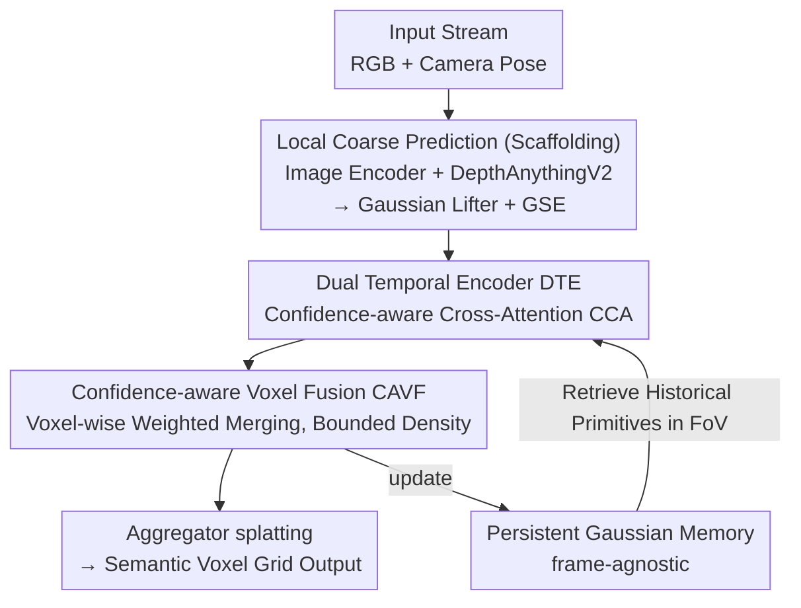

# TGSFormer: Scalable Temporal Gaussian Splatting for Embodied Semantic Scene Completion

**Conference**: CVPR 2026  
**Paper**: [CVF Open Access](https://openaccess.thecvf.com/content/CVPR2026/html/Qian_TGSFormer_Scalable_Temporal_Gaussian_Splatting_for_Embodied_Semantic_Scene_Completion_CVPR_2026_paper.html)  
**Code**: https://github.com/Made-Gpt/TGSFormer (The paper claims "Code will be released", but it might not be available yet)  
**Area**: 3D Vision  
**Keywords**: Semantic Scene Completion, 3D Gaussian Splatting, Embodied Perception, Temporal Fusion, Online Mapping

## TL;DR
TGSFormer utilizes a persistent Gaussian memory combined with confidence-aware temporal fusion to cast embodied semantic scene completion (embodied SSC) into a feed-forward framework that "expands boundlessly with exploration while keeping the number of primitives strictly bounded." It achieves state-of-the-art (SOTA) performance on both monocular and embodied benchmarks while utilizing over 20% fewer Gaussian primitives than competitors.

## Background & Motivation
**Background**: 3D semantic scene completion (SSC) aims to reconstruct dense geometry and semantic voxels from 2D observations. Existing methods mainly fall into two categories: dense voxel methods (e.g., MonoScene, SurroundOcc), which possess strong geometric expressiveness but suffer from cubic computational complexity, and object-centric sparse methods (e.g., GaussianFormer), which adopt 3D Gaussian primitives as representation units. The latter are highly efficient, differentiable, and gradually becoming the new foundation. Embodied scenarios further require models to **online** update their understanding of the environment along ego-centric video streams, thereby necessitating geometric expressiveness, temporal stability, scalability, and efficiency.

**Limitations of Prior Work**: To perform long-term embodied prediction, the key is to maintain a "predictive memory of explored regions" so that the output of each frame can interact with past observations. However, existing embodied SSC methods (such as EmbodiedOcc) almost exclusively initialize dense Gaussian primitives randomly within a **pre-defined bounded volume** to cover the explored area. This approach is redundant, inefficient, and fails completely if the boundary prior is unavailable, preventing scalability to realistic, unbounded scenes. Recent depth-guided initialization schemes (e.g., SplatSSC) mitigate redundancy, but only perform local prediction without a long-range memory mechanism, leading to severe noise accumulation and memory explosions as observations accumulate. Another category of spatiotemporal methods (e.g., ST-Occ, ST-GS) performs well in short-term temporal fusion but heavily relies on frame-to-frame coherence, causing predictions to fail when keyframes are missing or inconsistent.

**Key Challenge**: In long-range embodied exploration, there is a fundamental conflict between "preserving reliable historical predictions" and "maintaining a compact/bounded representation." Retaining more information leads to primitive explosion, while saving memory requires discarding valuable history. Simultaneously, reliance on frame-to-frame coherence makes the system fragile to missing frames.

**Goal**: To simultaneously address three tasks within a unified Gaussian representation—primitive initialization, temporal fusion, and bounded memory—achieving unbounded global completion without relying on frame coherence.

**Key Insight**: Instead of frame-caching for alignment, the authors observe that it is highly beneficial to maintain a **persistent Gaussian memory updated via feature correlation**. This memory directly stores the Gaussian primitives themselves and utilizes cross-attention between "current primitives $\leftrightarrow$ historical primitives" for fusion, thereby removing dependency on continuous video streams (making it frame-agnostic).

**Core Idea**: To replace the "bounded-volume random initialization + frame cache" paradigm with a persistent, compact Gaussian memory. Then, compile local depth-guided SSC into large-scale embodied perception using Dual Temporal Encoders (DTE) for confidence-aware temporal fusion and Confidence-Aware Voxel Fusion (CAVF) to guarantee bounded primitives.

## Method

### Overall Architecture
TGSFormer is a feed-forward architecture that processes a continuous stream of ego-centric observations $X=\{x_1, x_2, \dots\}$, where each $x_t=\{I^t_{rgb}, P_t\}$ contains the current RGB image and camera pose. The goal is to maintain a global Gaussian memory $M_t$ representing the semantics of the explored area. The entire pipeline consists of two stages: **(1) Monocular Local Prediction**: A parallel image encoder and DepthAnythingV2 extract appearance features and geometric priors, which are fed into a Gaussian Lifter to generate current-frame Gaussian primitives. These are processed by several Gaussian Encoder (GSE) blocks to obtain local coarse representations $\{G_t, Q_t\}$; **(2) Gaussian Memory Maintenance** (the core contribution of this work): Historical primitives $\{\hat G, \hat Q\}$ falling within the current field-of-view (FoV) are retrieved from the historical memory $M_{t-1}$. Dual Temporal Encoders (DTE) perform confidence-aware cross-attention fusion on both current and historical primitives to produce refined primitive sets. Then, the Confidence-Aware Voxel Fusion (CAVF) module merges primitives falling within the same voxel to control density. Finally, an aggregator splats the merged Gaussians into semantic voxel grids and updates the global memory.

The memory update is formulated as $M_t = \mathrm{MTGSFormer}(x_t, M_{t-1})$. When $t=1$, the local prediction is directly set as the initial memory $M_1=\{G_1, Q_1\}$. When degenerated to the monocular self-refinement mode, the query operation is set as $\{\hat G, \hat Q\}=\{G_t, Q_t\}$, and the entire mechanism naturally transforms into single-frame self-refinement.

### Key Designs

**1. Persistent Gaussian Memory: Replacing Frame Cache with Feature Correlation to Achieve Unbounded yet Bounded Representation**

To address the dual limitations of "unscalable bounded-volume random initialization and coherence-dependent frame caching," TGSFormer departs from filling preset volumes with random Gaussians or caching historical frames. Instead, it maintains an **accumulative Gaussian memory** $M_t$ that stores Gaussian primitives and their embeddings $\{G, Q\}$. For each incoming frame, it retrieves only the historical primitives **falling within the current field-of-view (FoV)** to participate in fusion, rather than aligning the entire global scene. The fused results are then written back to the memory. Consequently, the scene can expand infinitely outward (borderless) during exploration without any prior boundary assumptions. Furthermore, since the update operates via "feature correlation and voxel-wise merging on existing primitives" rather than infinite appending of new primitives, the total number of primitives in memory remains tightly bounded. This design provides the "frame-agnostic" property—predictions are no longer fragilely bound to frame-to-frame coherence, and missing frames do not compromise the stable geometry and semantics already in memory. In ablation studies, the simple baseline TGSFormer-C (which directly concatenates loaded historical Gaussians) suffers clear performance drops in embodied scenarios, underscoring the necessity of this principled memory maintenance mechanism.

**2. Dual Temporal Encoder (DTE) + Confidence Estimation: Empowering Reliable Primitives to Dominate Fusion**

When fusing current local primitives with historical memory primitives, both sides may contain unreliable predictions, meaning directly symmetric fusion could lead to mutual noise contamination. DTE utilizes two **weight-shared** temporal encoders for dual-stream cross-attention: one stream uses current primitives $\{G_t, Q_t\}$ to query historical ones $\{\hat G, \hat Q\}$, and the other stream acts in reverse. These yield updated features $Q^c_t = \mathrm{CCA}(Q_t, \hat Q, C_t, \hat C)$ and $\hat Q^c = \mathrm{CCA}(\hat Q, Q_t, \hat C, C_t)$, respectively. In monocular mode, this degenerates to self-attention over a single frame: $Q^c_t=\mathrm{CCA}(Q_t,Q_t,C_t,C_t)$.

Crucially, each primitive is associated with a **confidence score** $C_i\in[0,1]$ to modulate the information flow, jointly evaluating semantic uncertainty and geometric stability. Specifically, semantic uncertainty is measured by the Shannon entropy of the softmax probability $\tilde c_i$: $H(\tilde c_i)=-\sum_k \tilde c^k_i \log \tilde c^k_i$ (higher entropy means higher uncertainty). Geometric certainty is directly represented by the primitive opacity $a_i$. The final confidence is formulated as:

$$C_i = \underbrace{\left(1-\min(H(\tilde c_i)/H_{max},\,1)\right)^p}_{C_{sem}} \cdot\, a_i,$$

where $H_{max}$ is a hyperparameter for maximum entropy and $p$ controls the sharpness of the power transformation. This confidence performs **modulation in two places** within the CCA (proven optimal by ablation studies): the historical value projection is scaled by the historical confidence $V'=V\odot\hat C$, and the output of attention aggregation is scaled by the current confidence $C_t$ before passing through the final output projection:

$$\mathrm{CCA}(Q_t,\hat Q,C_t,\hat C)=\big(\mathrm{Concat}(\mathrm{MHA}(Q,K,V'))\odot C_t\big)W_o.$$

This dual modulation ensures that information from high-confidence primitives is trusted and propagated, while low-confidence/uncertain primitives are suppressed during temporal fusion, which explains why this design is more robust than symmetric fusion.

**3. Confidence-Aware Voxel Fusion (CAVF): Compressing Primitive Count Back to Bounded in a Training-Free Manner**

As embodied exploration proceeds, the number of Gaussian primitives tends to grow exponentially. CAVF is a **training-free, differentiable voxel fusion module**. It voxelizes current local primitives and historical primitives based on their 3D means $\mu_i$, mapping them to voxel indices $s$ (voxelization is strictly used for grouping). Primitives falling within the **same voxel** are merged into a single new primitive. The merging weights are derived from the softmax of the primitive confidences within that voxel:

$$w_{i\to s}=\frac{\exp(C_i/T)}{\sum_{j:V_j=s}\exp(C_j/T)},$$

where $T$ is a temperature hyperparameter. All properties ($\mu, s, q, c$) and features of the new primitive are computed as confidence-weighted sums: $G_s=\sum_{i:V_i=s} w_{i\to s}G_i$ and $Q_s=\sum w_{i\to s}Q_i$. This step significantly reduces the total number of primitives without introducing extra trainable parameters. Ablation studies show that adjusting voxel granularities (0.08m $\rightarrow$ 0.14m) enables a trade-off between accuracy and memory; at 0.12m, the memory usage per frame is only 859 MiB (compared to 4086 MiB without CAVF), while achieving higher mIoU. Essentially, CAVF binds the concept of "bounded memory" to voxel resolution, which dictates the maximum number of primitives retained in a single region.

**4. Multi-Stage Supervision + Two-Stage Training: Building Single-Frame Priors Before Learning Temporal Fusion**

Direct end-to-end training of embodied prediction often suffers from unstable convergence, as the model must locate single-frame perception and temporal fusion simultaneously. The authors decouple this into two stages: **Stage 1 (Monocular Pre-training)** establishes a scene-agnostic perception prior using randomly sampled frames across scenes (removing temporal correlation). The SSC loss is a compact combination of focal, Lovász, and geometry scale losses: $L_{ssc}=\lambda_1 L_{focal}+\lambda_2 L_{lovasz}+L^{geo}_{scale}$. Concurrently, both GSE and DTE outputs are supervised, applying an attenuation weight $w_j=\frac{2^j}{2^n-1}$ to the $j$-th layer output (as higher-level predictions are more important), with the total objective defined as $L_{total}=\sum_j w_j L^j_{ssc}$. **Stage 2 (Embodied Fine-tuning)** groups frames by scene to preserve temporal continuity and **only updates the DTE while freezing all other components**. This forces the DTE to focus solely on "aligning current/historical geometry and semantics" without disrupting the pre-trained single-frame features. Multi-stage supervision also aligns intermediate Gaussian features toward the final encoder space (PCA visualization shows more isotropic and semantically organized distributions). Ablations reveal that supervising in Stage 1+2 yields the best performance, whereas full-course supervision over-constrains the model and degrades performance.

### Loss & Training
See point 4 above: Stage 1 uses $L_{total}=\sum_{j=1}^n w_j L^j_{ssc}$ for multi-layer attenuated weighted supervision, where $L_{ssc}$ consists of focal, Lovász, and geometry scale losses. Stage 2 only fine-tunes the DTE while freezing other components.

## Key Experimental Results

Datasets: Occ-ScanNet / Occ-ScanNet-mini for monocular tasks, and EmbodiedOcc-ScanNet / -mini for embodied tasks. Metrics include geometric IoU and semantic mIoU.

### Main Results

| Task / Dataset | Metric | Ours (TGSFormer) | Prev. SOTA | Gain |
|--------------|------|------|----------|------|
| Monocular / Occ-ScanNet | IoU / mIoU | 64.42 / 54.73 | SplatSSC 62.83 / 51.83 | +1.59 / +2.90 |
| Monocular / Occ-ScanNet-mini | IoU / mIoU | 66.19 / 55.82 | SplatSSC 61.47 / 48.87 | +4.72 / +6.95 |
| Embodied / EmbodiedOcc-ScanNet | IoU / mIoU | 54.42 / 45.29 | RoboOcc 53.30 / 44.05 | +1.10 / +1.20 |

On the embodied tasks, the model not only establishes a new SOTA but also **uses over 20% fewer Gaussian primitives** (Fig. 1), achieving the best performance in 7 out of 11 categories (with minor performance drops in a few large, homogeneous areas due to feature smoothing). In contrast, the baseline TGSFormer-C (which directly concatenates historical Gaussians) yields only 37.40 IoU / 37.40-ish performance on embodied tasks—performing well on monocular but failing on embodied setups—underscoring the indispensability of the principled memory maintenance mechanism.

### Ablation Study

| Configuration | Memory per Frame (MiB) | IoU↑ | mIoU↑ | Description |
|------|------|------|------|------|
| w/o CAVF | 4086.0 | 60.48 | 41.84 | No fusion, primitive explosion |
| CAVF, 0.12m, w/o Conf | 876.1 | 59.76 | 45.76 | Voxel fusion without confidence |
| CAVF, 0.10m, w/ Conf | 1124.3 | 64.35 | 50.38 | — |
| **CAVF, 0.12m, w/ Conf (Ours)** | **859.0** | **64.16** | **50.55** | Optimal trade-off between accuracy↑ and memory↓ |
| CAVF, 0.14m, w/ Conf | 671.0 | 63.45 | 49.88 | Coarser voxels, minor performance drop |

Temporal encoder ablation (embodied): 49.35 mIoU without temporal fusion; single-stream cross-attention drops to 48.52; dual-stream cross-attention without confidence drops to 48.29; **dual-stream cross-attention + confidence modulation reaches 49.70** (+1.67 IoU)—proving that both dual-stream and confidence modulation are indispensable. CCA modulation location ablation: only modulating in the two positions of $C_v+C_a$ is optimal (mIoU 54.41), outperforming modulation of query or output alone. Supervision strategy: Stage 1+2 supervision performs best (49.70 mIoU on embodied), while supervising only stage 2 or the whole course yields worse results.

### Key Findings
- CAVF represents a win-win for both GPU memory and accuracy: removing it increases memory from 859 MiB to 4086 MiB (a 79% increase), while mIoU drops from 50.55 to 41.84. This indicates that fusion not only saves memory but also effectively eliminates noise brought by redundant primitives.
- Confidence modulation is the lifeblood of temporal fusion: if dual-stream cross-attention is used without confidence (dual ca w/o conf), IoU only improves by 1.13 while mIoU drops by 1.06; incorporating confidence is essential to correctly regularize both geometry and semantics.
- The performance gains do not solely depend on the powerful depth estimations from DepthAnythingV2: in Gaussian initialization ablations, even when replacing the depth estimator with a weaker model, TGSFormer consistently maintains its top performance, demonstrating the substantial contribution of the memory maintenance mechanism itself.

## Highlights & Insights
- **The "storing primitives in memory, retrieving by FoV" paradigm is exceptionally elegant**: compared to caching frames for alignment, storing Gaussian primitives makes the system naturally frame-agnostic and robust to missing frames. Meanwhile, retrieving only the historical primitives falling within the current FoV keeps the per-frame fusion cost under control. This strategy can be readily transferred to any online incremental mapping tasks (e.g., semantic layers in SLAM, long-video 3D reconstruction).
- **The confidence metric elegantly unifies both semantic and geometric uncertainties using "entropy $\times$ opacity"**, requiring modulation only at the value and output stages. This design is highly restrained; such a technique of using explainable scalar gates to control attention weights can be widely reused in other multi-source fusion scenarios.
- **CAVF binds the concept of "bounded memory" to voxel resolution**—a training-free, differentiable merging operator that simultaneously addresses primitive explosion and noise accumulation. This approach is exceptionally neat, requiring virtually zero extra computational overhead.
- **The two-stage training scheme of "freezing the backbone and training only the DTE"** is a simple yet effective engineering insight. Decoupling single-frame perception and temporal fusion learning prevents them from mutually interfering during optimization.

## Limitations & Future Work
- The authors acknowledge minor performance drops on **large, homogeneous areas** (e.g., large wall surfaces) due to feature smoothing, leading to sub-optimal results in 4 out of 11 classes.
- The "bounded memory" of CAVF is sensitive to the choice of the temperature hyperparameter $T$ and voxel size; setting them too coarsely degrades accuracy (a decline is already visible at 0.14m). Moreover, $H_{max}$ and $p$ in the confidence formula are also sensitive hyperparameters, for which sensitivity analysis curves are not provided in the paper.
- Evaluations are conducted exclusively on ScanNet-based indoor datasets; the real-world scalability to outdoor/large-scale unbounded scenes, as well as the handling of dynamic objects (the static scene assumption is currently held), remains unverified.
- Detailed datasets, implementation details, and metric definitions are relegated to the supplementary materials. The main text describes some details (such as the power transformation calibration of confidence) rather briefly, requiring readers to refer to the appendix for replication. ⚠️ Some hyperparameters and definitions are subject to the original text and its appendix.

## Related Work & Insights
- **vs EmbodiedOcc / RoboOcc**: These methods randomly initialize dense Gaussians within a predefined bounded volume for online refinement, requiring boundary priors and incurring high primitive redundancy. TGSFormer utilizes persistent memory with depth-guided initialization to achieve borderless and sparser primitives, outperforming them in both IoU and mIoU on embodied tasks while using over 20% fewer primitives.
- **vs SplatSSC**: SplatSSC applies depth-guided initialization for local SSC, showing strong performance but lacking long-range memory mechanisms, which leads to noise accumulation with increasing observations. TGSFormer leverages it directly as a "local coarse prediction" component integrated with memory maintenance, outperforming SplatSSC on monocular tasks (+2.90 mIoU on Occ-ScanNet).
- **vs ST-Occ / ST-GS**: These spatiotemporal methods rely on frame-to-frame coherence for short-term fusion, rendering them fragile to missing frames. TGSFormer's frame-agnostic memory operates independently of coherence, making it far more suitable for realistic embodied exploration.

## Rating
- Novelty: ⭐⭐⭐⭐ Integrating "persistent Gaussian memory + confidence temporal/voxel fusion" into embodied SSC presents a distinctive frame-agnostic path, though individual components mostly refine existing paradigms.
- Experimental Thoroughness: ⭐⭐⭐⭐⭐ Evaluated across both monocular/embodied tasks alongside GPU memory metrics; the ablation studies thoroughly cover CAVF, DTE, CCA modulation locations, supervision strategies, and initialization, which is highly robust.
- Writing Quality: ⭐⭐⭐⭐ The structure is clear and the mathematical formulations are complete, though key details (dataset and metric definitions) are left to the appendix, leaving the main text slightly squeezed.
- Value: ⭐⭐⭐⭐ Offers a compact, efficient, and scalable foundation for large-scale, memory-driven online 3D perception with strong practical engineering value.

<!-- RELATED:START -->

## Related Papers

- [\[CVPR 2026\] Learning Spatial-Temporal Consistency for 3D Semantic Scene Completion](learning_spatial-temporal_consistency_for_3d_semantic_scene_completion.md)
- [\[AAAI 2026\] Towards Temporal Fusion Beyond the Field of View for Camera-based Semantic Scene Completion](../../AAAI2026/3d_vision/towards_temporal_fusion_beyond_the_field_of_view_for_camera-based_semantic_scene.md)
- [\[AAAI 2026\] SplatSSC: Decoupled Depth-Guided Gaussian Splatting for Semantic Scene Completion](../../AAAI2026/3d_vision/splatssc_decoupled_depth-guided_gaussian_splatting_for_semantic_scene_completion.md)
- [\[CVPR 2026\] Multi-modal Frequency Decomposition Network for Semantic Scene Completion](multi-modal_frequency_decomposition_network_for_semantic_scene_completion.md)
- [\[CVPR 2026\] SAGE: Scalable Agentic 3D Scene Generation for Embodied AI](sage_scalable_agentic_3d_scene_generation_for_embodied_ai.md)

<!-- RELATED:END -->
